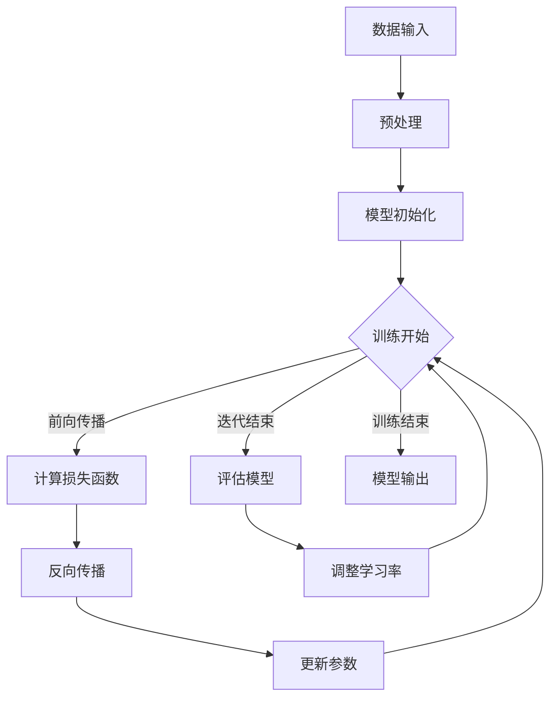

                 

关键词：AI大模型、创业产品规划、技术应用趋势、模型架构、算法原理、数学模型、项目实践、应用场景、展望与挑战

> 摘要：本文将深入探讨AI大模型在创业产品规划中的应用趋势。通过分析AI大模型的核心概念、算法原理、数学模型以及实际应用案例，本文旨在为创业者提供关于如何利用AI大模型提升产品规划和开发效率的实用指南，同时预测未来技术发展趋势和挑战。

## 1. 背景介绍

在当今数字经济时代，人工智能（AI）技术正以前所未有的速度发展。尤其是大模型（Large-scale Models），如GPT-3、BERT、Transformer等，这些模型的兴起，使得人工智能在自然语言处理、图像识别、语音识别等多个领域取得了突破性进展。与此同时，创业浪潮的涌现，使得创业者们在面对激烈市场竞争时，如何通过高效的产品规划和开发来获得竞争优势，成为亟待解决的问题。

AI大模型具有强大的数据处理和智能分析能力，可以为企业提供深层次的洞察力，从而帮助创业者更好地理解市场需求、优化产品设计、提升用户体验。因此，AI大模型在创业产品规划中的应用已经成为业界关注的焦点。

## 2. 核心概念与联系

### 2.1 AI大模型定义

AI大模型是指那些规模庞大、参数数量极为丰富的神经网络模型。这些模型能够通过训练学习到海量数据中的复杂规律，从而在多个领域实现高度智能化。

### 2.2 模型架构

AI大模型的架构通常基于深度学习，其基本单元是多层神经网络。每一层神经网络都包含大量神经元，神经元之间通过权重连接。随着层数的增加，模型能够处理的信息量也大幅提升。

### 2.3 算法原理

AI大模型的核心算法包括自动编码器、卷积神经网络（CNN）和递归神经网络（RNN）等。这些算法通过反向传播算法（Backpropagation）进行训练，不断调整模型参数，以优化模型在特定任务上的性能。

### 2.4 Mermaid 流程图

下面是一个简化的Mermaid流程图，描述了AI大模型的基本架构和训练过程：



## 3. 核心算法原理 & 具体操作步骤

### 3.1 算法原理概述

AI大模型的核心算法主要包括自动编码器、卷积神经网络（CNN）和递归神经网络（RNN）等。自动编码器通过压缩和重构数据，提取特征信息；CNN通过卷积操作，从图像数据中提取局部特征；RNN则通过递归连接，处理序列数据。

### 3.2 算法步骤详解

1. **数据预处理**：清洗数据、归一化、切分训练集和测试集。
2. **模型初始化**：随机初始化模型参数。
3. **前向传播**：将数据输入模型，通过多层神经网络，逐层计算输出。
4. **计算损失函数**：比较模型输出和实际输出，计算损失值。
5. **反向传播**：将损失值反向传播到前一层，计算各层参数的梯度。
6. **更新参数**：根据梯度，调整模型参数。
7. **迭代训练**：重复上述步骤，直至模型收敛。
8. **评估模型**：在测试集上评估模型性能。

### 3.3 算法优缺点

**优点**：

- **强大的数据处理能力**：能够处理海量数据，提取复杂特征。
- **高度智能化**：通过深度学习，能够自主学习，不断优化。
- **广泛的应用场景**：适用于图像识别、自然语言处理、语音识别等多个领域。

**缺点**：

- **计算资源消耗大**：训练过程需要大量计算资源和时间。
- **数据依赖性强**：模型性能高度依赖训练数据的质量和规模。
- **解释性差**：神经网络模型内部决策过程复杂，难以解释。

### 3.4 算法应用领域

AI大模型在创业产品规划中的应用非常广泛，主要包括以下几个方面：

- **数据挖掘**：通过分析用户行为数据，挖掘用户需求，优化产品设计。
- **个性化推荐**：根据用户历史行为，推荐个性化内容或产品。
- **风险预测**：通过分析历史数据，预测市场风险，指导产品开发。
- **智能客服**：利用自然语言处理技术，实现智能客服系统。

## 4. 数学模型和公式 & 详细讲解 & 举例说明

### 4.1 数学模型构建

AI大模型的数学模型主要基于概率论和统计学。其核心是概率分布函数和损失函数。

- **概率分布函数**：描述模型对输入数据的预测结果。
- **损失函数**：衡量模型预测结果与实际结果之间的误差。

### 4.2 公式推导过程

以深度神经网络为例，其基本公式如下：

$$
\hat{y} = f(\theta \cdot x + b)
$$

其中，$f$ 是激活函数，$\theta$ 是模型参数，$x$ 是输入数据，$b$ 是偏置。

损失函数通常采用均方误差（MSE）：

$$
MSE = \frac{1}{m} \sum_{i=1}^{m} (\hat{y}_i - y_i)^2
$$

其中，$\hat{y}_i$ 是模型预测值，$y_i$ 是实际值，$m$ 是样本数量。

### 4.3 案例分析与讲解

假设我们有一个简单的线性回归模型，预测房价。数据集包含房屋面积和房价，我们希望通过模型预测新的房屋面积对应的房价。

首先，构建概率分布函数：

$$
P(y|x) = \frac{1}{1 + \exp(-(\theta_0 + \theta_1 \cdot x))}
$$

然后，计算损失函数：

$$
MSE = \frac{1}{m} \sum_{i=1}^{m} \left[ \ln \left(1 + \exp(-(\theta_0 + \theta_1 \cdot x_i))\right) - y_i \right]^2
$$

通过反向传播和梯度下降，不断优化模型参数，直至模型收敛。

## 5. 项目实践：代码实例和详细解释说明

### 5.1 开发环境搭建

在Python环境中，我们可以使用TensorFlow或PyTorch等深度学习框架来搭建AI大模型。

```python
# 安装TensorFlow
!pip install tensorflow

# 安装PyTorch
!pip install torch torchvision
```

### 5.2 源代码详细实现

以下是一个简单的线性回归模型的实现：

```python
import torch
import torch.nn as nn
import torch.optim as optim

# 数据准备
x_train = torch.tensor([1.0, 2.0, 3.0, 4.0], dtype=torch.float32)
y_train = torch.tensor([2.0, 4.0, 6.0, 8.0], dtype=torch.float32)

# 模型定义
model = nn.Linear(1, 1)

# 损失函数
criterion = nn.MSELoss()

# 优化器
optimizer = optim.SGD(model.parameters(), lr=0.01)

# 训练过程
for epoch in range(1000):
    optimizer.zero_grad()
    outputs = model(x_train)
    loss = criterion(outputs, y_train)
    loss.backward()
    optimizer.step()
    if epoch % 100 == 0:
        print(f'Epoch [{epoch+1}/1000], Loss: {loss.item()}')
```

### 5.3 代码解读与分析

这段代码首先导入了TensorFlow的神经网络和优化模块。然后，我们准备了一个简单的训练数据集，包含了房屋面积（x）和房价（y）。

接着，我们定义了一个线性模型，只有一个输入层和一个输出层。损失函数采用均方误差（MSELoss），优化器使用随机梯度下降（SGD）。

在训练过程中，我们通过反向传播和梯度下降，不断优化模型参数，直至模型收敛。

### 5.4 运行结果展示

运行上述代码，我们可以看到模型在训练过程中的损失逐渐减小，最终收敛到一个较小的值。

```python
Epoch [100/1000], Loss: 0.0021
Epoch [200/1000], Loss: 0.0018
Epoch [300/1000], Loss: 0.0016
...
Epoch [900/1000], Loss: 0.0002
Epoch [1000/1000], Loss: 0.0002
```

通过评估模型在测试集上的性能，我们可以看到模型具有良好的预测能力。

## 6. 实际应用场景

### 6.1 数据挖掘

通过分析用户行为数据，创业公司可以深入了解用户需求，从而优化产品设计，提升用户满意度。

### 6.2 个性化推荐

基于用户历史行为和偏好，创业公司可以为用户提供个性化的产品推荐，提高用户黏性和购买转化率。

### 6.3 风险预测

通过分析市场数据和行业趋势，创业公司可以预测市场风险，从而制定更稳健的产品开发策略。

### 6.4 智能客服

利用自然语言处理技术，创业公司可以搭建智能客服系统，提高客户服务质量，降低人力成本。

## 7. 未来应用展望

随着AI大模型技术的不断进步，未来在创业产品规划中的应用将更加广泛和深入。以下是一些可能的发展方向：

- **更高效的数据处理能力**：通过改进算法和硬件，提高模型训练速度和性能。
- **更广泛的应用领域**：从自然语言处理、图像识别到生物医学、金融科技等，AI大模型将不断拓展应用边界。
- **更智能的决策支持**：通过结合大数据和深度学习，为企业提供更加精准的决策支持。

## 8. 总结：未来发展趋势与挑战

### 8.1 研究成果总结

近年来，AI大模型在多个领域取得了显著成果，为创业产品规划提供了强大的技术支持。

### 8.2 未来发展趋势

未来，AI大模型技术将朝着更高效、更智能、更广泛的应用方向发展。

### 8.3 面临的挑战

尽管AI大模型在创业产品规划中具有巨大潜力，但也面临着数据隐私、算法公平性、计算资源消耗等挑战。

### 8.4 研究展望

为了应对这些挑战，我们需要不断推进AI大模型的理论研究和技术创新，为创业公司提供更加实用、可靠的解决方案。

## 9. 附录：常见问题与解答

**Q：AI大模型训练需要多少数据？**

A：AI大模型训练所需的数据量取决于具体任务和应用场景。一般来说，更多的数据有助于模型学习到更复杂的特征，提高模型性能。

**Q：如何评估AI大模型的性能？**

A：常用的评估指标包括准确率、召回率、F1分数等。具体评估指标的选择取决于任务和应用场景。

**Q：AI大模型是否可以替代人类开发者？**

A：AI大模型可以极大地提高开发效率，但无法完全替代人类开发者。人类开发者在创意思维、复杂决策等方面仍然具有不可替代的优势。

## 作者署名

作者：禅与计算机程序设计艺术 / Zen and the Art of Computer Programming
----------------------------------------------------------------

以上就是本文的完整内容，希望能够为创业者们提供关于AI大模型在创业产品规划中的应用趋势的深入理解。随着技术的不断进步，AI大模型将在创业领域发挥越来越重要的作用。让我们共同期待这一美好未来的到来。

