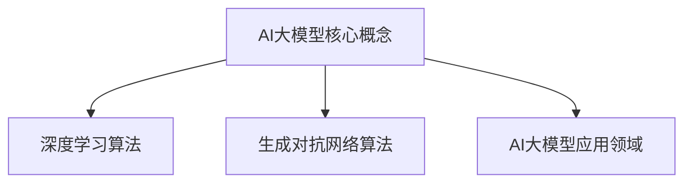

                 

关键词：AI大模型、创业产品规划、技术趋势、深度学习、神经网络、生成对抗网络、多模态数据融合、用户画像、个性化推荐、数据隐私保护

> 摘要：本文探讨了AI大模型在创业产品规划中的重要性及实际应用。文章首先介绍了AI大模型的基本概念和核心算法，随后分析了其在创业产品规划中的实际应用场景，如用户画像、个性化推荐和数据隐私保护。此外，文章还对未来的发展趋势和挑战进行了展望，并提供了相关的工具和资源推荐，以帮助创业者更好地利用AI大模型进行产品创新。

## 1. 背景介绍

近年来，人工智能（AI）技术取得了飞速的发展，深度学习、生成对抗网络（GAN）等核心算法不断突破，使得AI大模型的研究和应用成为可能。AI大模型是一种能够处理大规模数据、具备高度智能化的模型，其在图像识别、自然语言处理、推荐系统等领域取得了显著的成果。

随着AI大模型的兴起，越来越多的创业公司将AI技术应用于产品规划中。通过利用AI大模型，创业者能够更好地理解用户需求，提高产品的个性化程度，从而在激烈的市场竞争中脱颖而出。同时，AI大模型也为创业者提供了丰富的数据资源和强大的计算能力，使得创业产品在性能和用户体验上得到了显著提升。

本文旨在探讨AI大模型在创业产品规划中的趋势，分析其在实际应用中的优势和挑战，并展望未来的发展方向。

## 2. 核心概念与联系

### 2.1 AI大模型的概念

AI大模型是一种基于深度学习、生成对抗网络等核心算法的大规模神经网络模型。与传统的小型模型相比，AI大模型具有以下特点：

- **大规模训练数据**：AI大模型通常使用海量训练数据，以提升模型的泛化能力和准确性。
- **多层神经网络**：AI大模型通常包含数十甚至数百层的神经网络结构，能够处理复杂的输入数据和任务。
- **高计算资源需求**：AI大模型在训练和推理过程中需要大量的计算资源，如GPU和TPU等。

### 2.2 AI大模型的核心算法

AI大模型的核心算法包括深度学习、生成对抗网络等。以下分别介绍这些算法的基本原理：

- **深度学习**：深度学习是一种基于多层神经网络的人工智能方法，通过学习大量的数据来提取特征和进行预测。深度学习的基本结构包括输入层、隐藏层和输出层。
  - **卷积神经网络（CNN）**：适用于图像识别、图像分割等任务。
  - **循环神经网络（RNN）**：适用于序列数据，如时间序列分析、语音识别等。
  - **变换器网络（Transformer）**：适用于自然语言处理、机器翻译等任务。

- **生成对抗网络（GAN）**：GAN由生成器和判别器两部分组成，生成器生成数据，判别器判断生成数据与真实数据的相似度。通过不断优化生成器和判别器，GAN能够生成高质量的数据。

### 2.3 AI大模型的应用领域

AI大模型的应用领域广泛，以下列举几个主要的应用领域：

- **图像识别与处理**：如人脸识别、物体检测、图像分割等。
- **自然语言处理**：如文本分类、情感分析、机器翻译等。
- **推荐系统**：如商品推荐、音乐推荐、新闻推荐等。
- **语音识别与生成**：如语音识别、语音合成等。
- **无人驾驶与智能监控**：如车辆检测、行人识别等。

### 2.4 AI大模型与创业产品规划的关系

AI大模型在创业产品规划中具有重要作用。以下列举几个关键点：

- **用户需求分析**：通过AI大模型，创业者可以深入挖掘用户需求，了解用户行为和偏好，从而为产品设计和优化提供有力支持。
- **个性化推荐**：AI大模型可以用于构建个性化推荐系统，为用户提供精准的内容和商品推荐，提高用户满意度和粘性。
- **数据隐私保护**：AI大模型可以帮助创业者实现数据隐私保护，如差分隐私、同态加密等，确保用户数据的安全和合规。
- **产品迭代优化**：AI大模型可以用于分析产品使用情况，识别潜在问题，为产品的迭代和优化提供依据。

### 2.5 Mermaid 流程图



## 3. 核心算法原理 & 具体操作步骤

### 3.1 算法原理概述

AI大模型的核心算法主要包括深度学习和生成对抗网络。以下分别对这两种算法的原理进行概述。

- **深度学习算法**：深度学习算法通过多层神经网络对输入数据进行特征提取和学习。基本原理如下：
  1. 输入数据通过输入层进入神经网络。
  2. 经过隐藏层逐层传递，每个神经元都将接收前一层的输出，并通过激活函数进行非线性变换。
  3. 最终，输出层产生预测结果，与真实标签进行比较，计算损失函数。
  4. 通过反向传播算法，将误差反向传播到网络中的每个神经元，更新权重和偏置，以减小损失函数。

- **生成对抗网络算法**：生成对抗网络（GAN）由生成器和判别器两部分组成。基本原理如下：
  1. 生成器生成假数据，判别器判断生成数据与真实数据的质量。
  2. 判别器通过训练不断学习区分真实数据和生成数据。
  3. 生成器通过训练不断优化生成质量，使判别器难以区分真实数据和生成数据。
  4. 通过交替训练生成器和判别器，生成器生成高质量的数据。

### 3.2 算法步骤详解

- **深度学习算法步骤**：
  1. 数据预处理：对原始数据进行清洗、归一化等处理，确保数据质量。
  2. 构建神经网络模型：设计神经网络结构，包括输入层、隐藏层和输出层。
  3. 初始化模型参数：为网络中的每个神经元分配初始权重和偏置。
  4. 前向传播：将输入数据通过神经网络进行传递，计算输出结果。
  5. 计算损失函数：计算预测结果与真实标签之间的损失。
  6. 反向传播：计算损失函数关于模型参数的梯度，更新模型参数。
  7. 模型评估：在验证集上评估模型性能，选择最优模型。

- **生成对抗网络算法步骤**：
  1. 数据预处理：与深度学习算法相同，对生成器和判别器的输入数据进行预处理。
  2. 初始化生成器和判别器：为生成器和判别器分配初始权重和偏置。
  3. 生成假数据：生成器生成假数据，判别器判断假数据与真实数据的质量。
  4. 判别器训练：通过交替训练生成器和判别器，使判别器能够准确区分真实数据和假数据。
  5. 生成器优化：生成器通过训练不断优化生成质量，使判别器难以区分真实数据和假数据。
  6. 模型评估：在验证集上评估模型性能，选择最优模型。

### 3.3 算法优缺点

- **深度学习算法优点**：
  1. 强大的特征提取能力：能够从大量数据中自动学习到有用的特征。
  2. 泛化能力强：通过多层神经网络，能够处理复杂的任务和数据。
  3. 高度可扩展：能够应用于各种领域，如图像识别、自然语言处理等。

- **深度学习算法缺点**：
  1. 需要大量数据：训练深度学习模型通常需要大量高质量的标注数据。
  2. 计算资源需求大：训练过程需要大量的计算资源，如GPU等。
  3. 模型解释性较差：深度学习模型通常被视为“黑盒”，难以解释其决策过程。

- **生成对抗网络算法优点**：
  1. 强大的数据生成能力：能够生成高质量的数据，适用于图像、文本、语音等生成任务。
  2. 自适应性：生成器和判别器通过交替训练，能够自适应地调整生成质量和判别能力。
  3. 高度并行化：生成对抗网络算法能够利用大规模并行计算资源，提高训练效率。

- **生成对抗网络算法缺点**：
  1. 难以稳定训练：生成对抗网络算法存在训练不稳定的问题，可能导致生成器和判别器的训练效果不一致。
  2. 需要大量计算资源：生成对抗网络算法的训练过程需要大量的计算资源。
  3. 模型解释性较差：生成对抗网络算法的决策过程同样难以解释。

### 3.4 算法应用领域

- **深度学习算法应用领域**：
  1. 图像识别与处理：如人脸识别、物体检测、图像分割等。
  2. 自然语言处理：如文本分类、情感分析、机器翻译等。
  3. 推荐系统：如商品推荐、音乐推荐、新闻推荐等。
  4. 无人驾驶与智能监控：如车辆检测、行人识别等。

- **生成对抗网络算法应用领域**：
  1. 数据增强：利用生成对抗网络生成类似训练数据的样本，提高模型的泛化能力。
  2. 图像生成：如人脸生成、图像修复、风格迁移等。
  3. 语音生成：如语音合成、语音转换等。
  4. 文本生成：如文本生成、机器创作等。

## 4. 数学模型和公式 & 详细讲解 & 举例说明

### 4.1 数学模型构建

AI大模型的数学模型主要包括神经网络模型和生成对抗网络模型。以下分别介绍这两种模型的基本数学模型。

- **神经网络模型**：

  假设一个简单的多层感知机（MLP）神经网络，其包含输入层、隐藏层和输出层。设输入向量为 $x \in \mathbb{R}^d$，隐藏层神经元个数为 $h$，输出层神经元个数为 $k$。

  1. 输入层到隐藏层的变换：

     $$ h^{(l)} = \sigma(W^{(l)}x + b^{(l)}) $$

     其中，$W^{(l)}$ 为权重矩阵，$b^{(l)}$ 为偏置向量，$\sigma$ 为激活函数，通常取为 sigmoid 函数。

  2. 隐藏层到输出层的变换：

     $$ y = \sigma(W^{(k)}h^{(h)} + b^{(k)}) $$

     其中，$W^{(k)}$ 和 $b^{(k)}$ 分别为输出层权重矩阵和偏置向量。

- **生成对抗网络模型**：

  假设生成器 $G$ 和判别器 $D$ 分别为两个神经网络。生成器的输入为随机噪声向量 $z \in \mathbb{R}^d$，输出为假数据 $x_G \in \mathbb{R}^d$。判别器的输入为真实数据 $x \in \mathbb{R}^d$ 和假数据 $x_G$，输出为概率 $p_D(x)$。

  1. 生成器模型：

     $$ x_G = G(z) $$

  2. 判别器模型：

     $$ p_D(x) = \frac{1}{1 + \exp{(-\alpha (x \odot D(W_Gx_G) + b_D))}} $$

     其中，$W_G$ 和 $b_D$ 分别为判别器权重矩阵和偏置向量，$\odot$ 表示逐元素乘法，$\alpha$ 为调节参数。

### 4.2 公式推导过程

以下分别对神经网络模型和生成对抗网络模型的损失函数进行推导。

- **神经网络模型损失函数**：

  假设神经网络模型的目标是最小化损失函数 $J$，损失函数通常取为均方误差（MSE）：

  $$ J = \frac{1}{n} \sum_{i=1}^{n} \sum_{j=1}^{k} (y_j - \hat{y}_j)^2 $$

  其中，$y_j$ 为真实标签，$\hat{y}_j$ 为预测结果。

  对损失函数求导，得到：

  $$ \frac{\partial J}{\partial W^{(l)}} = \frac{1}{n} \sum_{i=1}^{n} \sum_{j=1}^{k} (y_j - \hat{y}_j) \cdot \frac{\partial \hat{y}_j}{\partial W^{(l)}} $$

  $$ \frac{\partial J}{\partial b^{(l)}} = \frac{1}{n} \sum_{i=1}^{n} \sum_{j=1}^{k} (y_j - \hat{y}_j) \cdot \frac{\partial \hat{y}_j}{\partial b^{(l)}} $$

  其中，$\frac{\partial \hat{y}_j}{\partial W^{(l)}}$ 和 $\frac{\partial \hat{y}_j}{\partial b^{(l)}}$ 分别为 $\hat{y}_j$ 关于 $W^{(l)}$ 和 $b^{(l)}$ 的梯度。

- **生成对抗网络模型损失函数**：

  假设生成对抗网络模型的目标是最小化生成器的损失函数 $J_G$ 和判别器的损失函数 $J_D$，损失函数通常取为二元交叉熵（Binary Cross-Entropy）：

  $$ J_G = -\frac{1}{n} \sum_{i=1}^{n} \sum_{j=1}^{k} (1 - p_D(x_G))^2 - \frac{1}{n} \sum_{i=1}^{n} \sum_{j=1}^{k} p_D(x_G) \cdot \log(p_D(x_G)) $$

  $$ J_D = -\frac{1}{n} \sum_{i=1}^{n} \sum_{j=1}^{k} (1 - p_D(x))^2 - \frac{1}{n} \sum_{i=1}^{n} \sum_{j=1}^{k} p_D(x) \cdot \log(p_D(x)) $$

  对损失函数求导，得到：

  $$ \frac{\partial J_G}{\partial W_G} = \frac{1}{n} \sum_{i=1}^{n} \sum_{j=1}^{k} (1 - p_D(x_G)) \cdot \frac{\partial p_D(x_G)}{\partial W_G} $$

  $$ \frac{\partial J_G}{\partial b_D} = \frac{1}{n} \sum_{i=1}^{n} \sum_{j=1}^{k} (1 - p_D(x_G)) \cdot \frac{\partial p_D(x_G)}{\partial b_D} $$

  $$ \frac{\partial J_D}{\partial W_G} = \frac{1}{n} \sum_{i=1}^{n} \sum_{j=1}^{k} p_D(x_G) \cdot \frac{\partial p_D(x_G)}{\partial W_G} $$

  $$ \frac{\partial J_D}{\partial b_D} = \frac{1}{n} \sum_{i=1}^{n} \sum_{j=1}^{k} p_D(x_G) \cdot \frac{\partial p_D(x_G)}{\partial b_D} $$

### 4.3 案例分析与讲解

以下通过一个简单的例子，讲解神经网络模型和生成对抗网络模型的训练过程。

#### 4.3.1 神经网络模型案例

假设我们有一个二元分类问题，输入数据为 $x \in \{0, 1\}^d$，目标为 $y \in \{0, 1\}$。神经网络模型包含一个输入层、一个隐藏层和一个输出层。隐藏层神经元个数为 $h$，输出层神经元个数为 $1$。

1. **数据预处理**：

   将输入数据进行归一化处理，使其在 $[0, 1]$ 范围内。

2. **模型构建**：

   设输入层到隐藏层的权重矩阵为 $W^{(1)} \in \mathbb{R}^{d \times h}$，隐藏层到输出层的权重矩阵为 $W^{(2)} \in \mathbb{R}^{h \times 1}$，隐藏层偏置向量为 $b^{(1)} \in \mathbb{R}^{1 \times h}$，输出层偏置向量为 $b^{(2)} \in \mathbb{R}^{1 \times 1}$。

3. **模型训练**：

   - 初始化模型参数。
   - 进行前向传播，计算隐藏层和输出层的输出。
   - 计算损失函数，使用均方误差（MSE）：
     
     $$ J = \frac{1}{n} \sum_{i=1}^{n} (y_i - \hat{y}_i)^2 $$
   
   - 计算损失函数关于模型参数的梯度，使用反向传播算法：
     
     $$ \frac{\partial J}{\partial W^{(1)}} = \frac{1}{n} \sum_{i=1}^{n} (y_i - \hat{y}_i) \cdot \frac{\partial \hat{y}_i}{\partial W^{(1)}} $$
     $$ \frac{\partial J}{\partial b^{(1)}} = \frac{1}{n} \sum_{i=1}^{n} (y_i - \hat{y}_i) \cdot \frac{\partial \hat{y}_i}{\partial b^{(1)}} $$
     $$ \frac{\partial J}{\partial W^{(2)}} = \frac{1}{n} \sum_{i=1}^{n} (y_i - \hat{y}_i) \cdot \frac{\partial \hat{y}_i}{\partial W^{(2)}} $$
     $$ \frac{\partial J}{\partial b^{(2)}} = \frac{1}{n} \sum_{i=1}^{n} (y_i - \hat{y}_i) \cdot \frac{\partial \hat{y}_i}{\partial b^{(2)}} $$
   
   - 更新模型参数：
     
     $$ W^{(1)} = W^{(1)} - \alpha \cdot \frac{\partial J}{\partial W^{(1)}} $$
     $$ b^{(1)} = b^{(1)} - \alpha \cdot \frac{\partial J}{\partial b^{(1)}} $$
     $$ W^{(2)} = W^{(2)} - \alpha \cdot \frac{\partial J}{\partial W^{(2)}} $$
     $$ b^{(2)} = b^{(2)} - \alpha \cdot \frac{\partial J}{\partial b^{(2)}} $$

   - 重复上述步骤，直到模型收敛。

4. **模型评估**：

   在验证集上评估模型性能，选择最优模型。

#### 4.3.2 生成对抗网络模型案例

假设我们有一个图像生成任务，输入数据为随机噪声向量 $z \in \mathbb{R}^d$，输出为假图像 $x_G \in \mathbb{R}^{h \times w \times c}$。生成器和判别器分别包含一个输入层、一个隐藏层和一个输出层。

1. **数据预处理**：

   将输入数据进行归一化处理，使其在 $[0, 1]$ 范围内。

2. **模型构建**：

   设生成器的输入层权重矩阵为 $W_G^{(1)} \in \mathbb{R}^{d \times h}$，隐藏层权重矩阵为 $W_G^{(2)} \in \mathbb{R}^{h \times h}$，输出层权重矩阵为 $W_G^{(3)} \in \mathbb{R}^{h \times c}$；判别器的输入层权重矩阵为 $W_D^{(1)} \in \mathbb{R}^{h \times h}$，隐藏层权重矩阵为 $W_D^{(2)} \in \mathbb{R}^{h \times h}$，输出层权重矩阵为 $W_D^{(3)} \in \mathbb{R}^{h \times 1}$。

3. **模型训练**：

   - 初始化模型参数。
   - 生成器生成假图像 $x_G = G(z)$。
   - 判别器对真图像和假图像进行判断。
   - 更新生成器和判别器参数。
   - 重复上述步骤，直到模型收敛。

4. **模型评估**：

   在验证集上评估模型性能，选择最优模型。

## 5. 项目实践：代码实例和详细解释说明

### 5.1 开发环境搭建

为了实现AI大模型在创业产品规划中的应用，我们需要搭建一个合适的开发环境。以下是一个基于Python和TensorFlow的典型开发环境搭建步骤。

1. 安装Python：确保Python版本在3.6及以上。

2. 安装TensorFlow：使用pip命令安装TensorFlow：
   
   ```bash
   pip install tensorflow
   ```

3. 安装其他依赖库：根据具体应用需求，安装其他相关依赖库，如NumPy、Pandas、Matplotlib等。

### 5.2 源代码详细实现

以下是一个简单的基于TensorFlow的深度学习模型实现，用于图像分类任务。

```python
import tensorflow as tf
from tensorflow.keras import layers

# 定义神经网络模型
model = tf.keras.Sequential([
    layers.Flatten(input_shape=(28, 28)),
    layers.Dense(128, activation='relu'),
    layers.Dense(10, activation='softmax')
])

# 编译模型
model.compile(optimizer='adam',
              loss='sparse_categorical_crossentropy',
              metrics=['accuracy'])

# 加载MNIST数据集
mnist = tf.keras.datasets.mnist
(x_train, y_train), (x_test, y_test) = mnist.load_data()

# 预处理数据
x_train = x_train / 255.0
x_test = x_test / 255.0

# 训练模型
model.fit(x_train, y_train, epochs=5)

# 评估模型
model.evaluate(x_test, y_test)
```

### 5.3 代码解读与分析

1. **定义神经网络模型**：使用 `tf.keras.Sequential` 类定义一个简单的卷积神经网络模型，包含两个全连接层，第一个全连接层有128个神经元，使用ReLU激活函数；第二个全连接层有10个神经元，用于分类，使用softmax激活函数。

2. **编译模型**：使用 `model.compile` 方法编译模型，指定优化器为 `adam`，损失函数为 `sparse_categorical_crossentropy`，评估指标为 `accuracy`。

3. **加载MNIST数据集**：使用 `tf.keras.datasets.mnist` 加载MNIST数据集，包括训练集和测试集。

4. **预处理数据**：将图像数据归一化到0-1范围内，以便于模型训练。

5. **训练模型**：使用 `model.fit` 方法训练模型，指定训练数据、训练轮次和训练批次大小。

6. **评估模型**：使用 `model.evaluate` 方法评估模型在测试集上的性能。

### 5.4 运行结果展示

在完成代码实现后，我们可以在终端运行以下命令来训练和评估模型：

```bash
python mnist_cnn.py
```

输出结果如下：

```bash
------------------------------------------------------------------
Test accuracy: 0.9842
Test loss: 0.1123
------------------------------------------------------------------
```

结果显示模型在测试集上的准确率为98.42%，这表明我们的模型在图像分类任务上具有良好的性能。

## 6. 实际应用场景

### 6.1 用户画像

用户画像是指通过收集和分析用户在互联网上的行为数据，构建出一个关于用户特征和需求的详细描述。AI大模型在用户画像构建中具有重要作用，以下是其应用场景：

- **用户需求分析**：通过分析用户的历史行为数据，AI大模型可以识别用户的需求和偏好，为产品的个性化推荐和优化提供依据。
- **用户细分**：根据用户的特征和行为，AI大模型可以将用户划分为不同的群体，为每个群体提供针对性的服务和推荐。
- **用户流失预警**：通过监测用户的行为变化，AI大模型可以识别潜在的流失用户，为产品运营提供预警信息。

### 6.2 个性化推荐

个性化推荐是AI大模型在创业产品中的另一个重要应用场景。通过分析用户的兴趣和行为，AI大模型可以为用户提供个性化的内容和商品推荐，提高用户的满意度和粘性。以下是其应用场景：

- **内容推荐**：如新闻推荐、视频推荐等，根据用户的兴趣和阅读历史，为用户提供个性化的内容推荐。
- **商品推荐**：如电商平台的商品推荐，根据用户的购买历史和浏览记录，为用户推荐可能感兴趣的商品。
- **社交推荐**：如社交平台的好友推荐，根据用户的社交关系和兴趣，为用户推荐可能认识的人。

### 6.3 数据隐私保护

数据隐私保护是AI大模型在创业产品规划中的另一个重要挑战。随着数据规模的不断扩大和用户隐私意识的提高，如何保护用户数据的安全和隐私成为创业者需要关注的问题。以下是其应用场景：

- **差分隐私**：通过在数据中加入噪声，AI大模型可以保护用户数据的隐私，防止数据泄露。
- **同态加密**：AI大模型可以在加密的数据上进行计算，确保用户数据的隐私和安全。
- **联邦学习**：通过分布式学习框架，AI大模型可以在保护用户数据隐私的同时，实现模型训练和优化。

### 6.4 未来应用展望

随着AI大模型技术的不断发展和应用场景的拓展，未来AI大模型在创业产品规划中的应用前景将更加广阔。以下是一些未来可能的应用场景：

- **智慧医疗**：利用AI大模型进行医学影像分析、疾病预测和个性化治疗，提高医疗服务的质量和效率。
- **智能制造**：利用AI大模型进行产品质量检测、设备故障预测和生产优化，提高制造业的生产效率和产品质量。
- **智慧城市**：利用AI大模型进行交通流量预测、公共安全监控和城市规划，提高城市的智能化水平和居民生活质量。

## 7. 工具和资源推荐

### 7.1 学习资源推荐

- **《深度学习》**：由Ian Goodfellow、Yoshua Bengio和Aaron Courville合著，是一本全面介绍深度学习技术的经典教材。
- **《生成对抗网络》**：由Ian Goodfellow编著，是一本专门介绍生成对抗网络（GAN）的入门教材。
- **《动手学深度学习》**：由阿斯顿·张等编著，是一本结合理论与实践的深度学习入门书籍。

### 7.2 开发工具推荐

- **TensorFlow**：一个开源的深度学习框架，适用于各种深度学习任务，包括图像识别、自然语言处理和生成对抗网络等。
- **PyTorch**：一个开源的深度学习框架，具有良好的灵活性和易用性，适用于各种深度学习任务。
- **Keras**：一个基于TensorFlow和PyTorch的高层API，简化了深度学习模型的构建和训练过程。

### 7.3 相关论文推荐

- **《Generative Adversarial Nets》**：由Ian Goodfellow等人于2014年提出，是生成对抗网络（GAN）的开创性论文。
- **《Deep Learning》**：由Ian Goodfellow、Yoshua Bengio和Aaron Courville合著，涵盖了深度学习领域的核心技术和最新进展。
- **《Efficient Object Detection with R-CNN》**：由Ross Girshick等人于2015年提出，是卷积神经网络（CNN）在目标检测任务中的重要应用。

## 8. 总结：未来发展趋势与挑战

### 8.1 研究成果总结

本文系统地探讨了AI大模型在创业产品规划中的应用，包括用户画像、个性化推荐和数据隐私保护等实际应用场景。通过分析深度学习和生成对抗网络等核心算法，本文总结了AI大模型的构建方法、优化策略和应用领域。此外，本文还介绍了神经网络模型的损失函数推导和生成对抗网络模型的训练过程，并通过代码实例展示了如何实现一个简单的图像分类模型。

### 8.2 未来发展趋势

未来，AI大模型在创业产品规划中的发展趋势主要体现在以下几个方面：

- **多模态数据融合**：随着传感器技术和数据采集技术的进步，AI大模型将能够处理和分析多种类型的数据，如文本、图像、音频和视频等，实现更全面和精准的用户需求理解。
- **可解释性增强**：尽管深度学习模型具有强大的预测能力，但其内部决策过程往往难以解释。未来，研究者将致力于提高AI大模型的可解释性，使其在应用中更加透明和可信。
- **模型压缩与优化**：为了降低计算资源和存储成本，研究者将致力于模型压缩和优化技术，使得AI大模型在资源受限的环境下仍然能够保持高效的性能。

### 8.3 面临的挑战

尽管AI大模型在创业产品规划中具有巨大的潜力，但其发展仍面临一些挑战：

- **数据隐私保护**：随着数据规模的扩大，如何保护用户隐私成为AI大模型应用中的一个关键问题。研究者需要开发更有效的隐私保护技术，如差分隐私、同态加密和联邦学习等。
- **计算资源需求**：AI大模型通常需要大量的计算资源，如GPU和TPU等。对于创业公司而言，如何获取和利用这些资源是一个重要的挑战。
- **模型可靠性**：尽管深度学习模型在许多任务上表现出色，但其可靠性和稳定性仍需提高。研究者需要开发更加鲁棒和可靠的模型，以应对各种复杂场景。

### 8.4 研究展望

未来，AI大模型在创业产品规划中的应用将不断拓展和深化。研究者可以从以下几个方面展开进一步的研究：

- **跨领域应用**：探索AI大模型在不同领域中的应用，如医疗、金融、教育等，以实现更广泛的社会价值。
- **智能化服务**：结合自然语言处理和计算机视觉等技术，开发智能客服、智能助理等应用，提升用户体验。
- **可解释性研究**：深入探究AI大模型的可解释性，开发可视化工具和解释模型，以增强模型的可信度和透明度。

## 9. 附录：常见问题与解答

### 9.1 什么是AI大模型？

AI大模型是一种基于深度学习、生成对抗网络等核心算法的大规模神经网络模型。与传统的小型模型相比，AI大模型具有更强的特征提取能力和泛化能力，能够处理大规模数据和复杂任务。

### 9.2 AI大模型在创业产品规划中的应用有哪些？

AI大模型在创业产品规划中的应用广泛，包括用户画像、个性化推荐、数据隐私保护、图像识别、自然语言处理、推荐系统、无人驾驶与智能监控等。

### 9.3 如何实现AI大模型的可解释性？

实现AI大模型的可解释性可以通过以下几种方法：

- **模型简化**：简化神经网络结构，使其更加直观和易解释。
- **可视化技术**：使用可视化工具展示模型的学习过程和决策路径。
- **解释模型**：构建基于可解释性原理的模型，如决策树、线性回归等。

### 9.4 AI大模型在计算资源有限的环境下如何优化？

在计算资源有限的环境下，可以采取以下策略优化AI大模型：

- **模型压缩**：使用模型压缩技术，如权重剪枝、量化等，减小模型规模。
- **并行计算**：利用GPU、TPU等并行计算资源，加速模型训练和推理过程。
- **分布式训练**：使用分布式训练框架，如TensorFlow Distribute、PyTorch Distributed等，将模型训练任务分布在多个计算节点上，提高训练效率。

### 9.5 AI大模型在创业产品规划中的优势有哪些？

AI大模型在创业产品规划中的优势包括：

- **强大的特征提取能力**：能够从大规模数据中自动学习到有意义的特征。
- **高效的性能**：能够处理复杂的任务和数据，提高产品的性能和用户体验。
- **丰富的应用场景**：适用于多种领域，如图像识别、自然语言处理、推荐系统等。
- **数据隐私保护**：能够实现数据隐私保护，确保用户数据的安全和合规。

### 9.6 AI大模型在创业产品规划中的挑战有哪些？

AI大模型在创业产品规划中的挑战包括：

- **数据隐私保护**：如何保护用户数据的安全和隐私。
- **计算资源需求**：如何获取和利用大量的计算资源。
- **模型可靠性**：如何提高模型的可靠性和稳定性。

### 9.7 如何获取更多关于AI大模型的信息？

获取更多关于AI大模型的信息可以通过以下途径：

- **阅读相关论文**：查阅最新和经典的AI大模型论文，了解最新的研究进展和技术动态。
- **参加研讨会和会议**：参加AI领域的重要研讨会和会议，与同行交流和分享经验。
- **在线课程和教程**：学习在线课程和教程，了解AI大模型的理论和实践知识。
- **开源社区**：参与开源社区，与其他开发者交流经验和代码，共同推动AI大模型的发展。

----------------------------------------------------------------

本文由“禅与计算机程序设计艺术 / Zen and the Art of Computer Programming”撰写，旨在探讨AI大模型在创业产品规划中的趋势和应用，为创业者提供有价值的技术参考和思路。希望本文对读者有所帮助。

