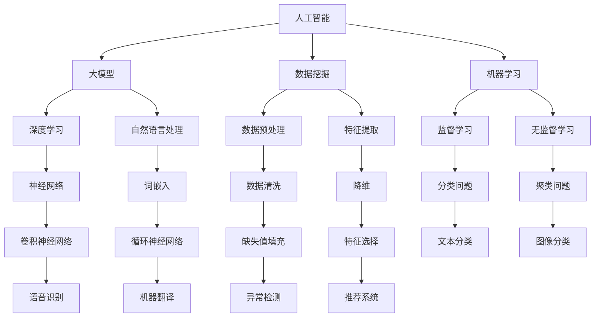

                 

关键词：AI 大模型、创业产品路线图、智能规划、数据分析、算法优化、用户行为预测、市场趋势分析

> 摘要：本文将探讨 AI 大模型在创业产品路线图规划中的应用价值，通过对核心概念、算法原理、数学模型、项目实践、实际应用场景、未来展望等多个方面的详细分析，展示 AI 大模型如何助力创业公司在复杂多变的市场环境中制定高效、精准的产品发展策略。

## 1. 背景介绍

随着人工智能技术的迅猛发展，AI 大模型（如 GPT、BERT 等）逐渐成为科研和工业界的研究热点。这些模型具有强大的学习能力、数据处理能力和知识表示能力，可以应用于自然语言处理、图像识别、语音识别等多个领域。在创业公司中，产品路线图规划是一个关键环节，它决定了公司产品的发展方向、市场定位和技术创新策略。然而，传统的产品规划方法往往依赖于经验、预测和市场调查，难以应对市场的快速变化和复杂需求。AI 大模型的引入，为创业产品路线图规划提供了新的思路和工具，有助于提高决策的科学性和准确性。

## 2. 核心概念与联系

为了更好地理解 AI 大模型在创业产品路线图规划中的应用，我们需要首先了解一些核心概念，包括人工智能、大模型、数据挖掘、机器学习等。以下是一个使用 Mermaid 描述的流程图，展示了这些概念之间的联系：



### 2.1 人工智能

人工智能（AI）是指由人制造出来的系统能够执行通常需要人类智能才能完成的任务。它包括机器学习、计算机视觉、自然语言处理等多个子领域。人工智能的核心目标是使计算机能够像人类一样思考、学习和决策。

### 2.2 大模型

大模型是指具有亿级参数规模的深度学习模型，它们能够处理海量数据并进行复杂的信息提取和表示。大模型通常使用分布式计算和优化技术，如梯度下降、异步更新等，以提高训练效率和模型性能。

### 2.3 数据挖掘

数据挖掘是从大量数据中自动发现有价值的信息、模式和知识的过程。它包括数据预处理、特征提取、模型训练和结果评估等多个步骤。

### 2.4 机器学习

机器学习是使计算机从数据中学习并改进其性能的技术。它分为监督学习、无监督学习和半监督学习等类型，分别适用于有标签数据、无标签数据和部分有标签数据。

### 2.5 深度学习

深度学习是机器学习的一个分支，使用多层神经网络进行数据建模和预测。深度学习模型通过逐层提取特征，从原始数据中自动学习复杂的特征表示。

### 2.6 自然语言处理

自然语言处理（NLP）是人工智能的一个重要子领域，旨在使计算机理解和生成人类语言。NLP 技术包括词嵌入、语言模型、文本分类、情感分析等。

### 2.7 数据预处理

数据预处理是数据挖掘和机器学习过程中的第一步，包括数据清洗、数据整合、特征提取等步骤。数据预处理的目标是提高数据质量，为后续建模提供可靠的基础。

### 2.8 特征提取

特征提取是从原始数据中提取出对模型训练有代表性的特征的过程。有效的特征提取可以提高模型的性能和泛化能力。

### 2.9 监督学习

监督学习是一种机器学习范式，使用已标记的数据集训练模型，并使用训练好的模型进行预测。监督学习适用于分类问题和回归问题。

### 2.10 无监督学习

无监督学习是一种机器学习范式，不需要使用标记数据训练模型。无监督学习适用于聚类问题和降维问题。

### 2.11 深度学习模型

深度学习模型是具有多个隐藏层的神经网络，能够通过逐层提取特征，从原始数据中自动学习复杂的特征表示。常见的深度学习模型包括卷积神经网络（CNN）、循环神经网络（RNN）和长短时记忆网络（LSTM）等。

### 2.12 自然语言处理模型

自然语言处理模型是用于处理和生成人类语言的模型，包括词嵌入模型（如 Word2Vec 和 GloVe）、语言模型（如 LSTM 和 Transformer）和文本分类模型（如 CNN 和 BiLSTM）等。

## 3. 核心算法原理 & 具体操作步骤

### 3.1 算法原理概述

AI 大模型在创业产品路线图规划中的核心算法主要包括机器学习算法、深度学习算法和自然语言处理算法。这些算法的基本原理如下：

- **机器学习算法**：通过从数据中学习规律，建立输入和输出之间的映射关系，从而实现预测和分类。常见的机器学习算法包括线性回归、决策树、支持向量机等。

- **深度学习算法**：基于多层神经网络，通过逐层提取特征，实现对复杂数据的建模和预测。深度学习算法包括卷积神经网络（CNN）、循环神经网络（RNN）和 Transformer 等。

- **自然语言处理算法**：用于处理和生成人类语言，包括词嵌入、语言模型、文本分类和情感分析等。自然语言处理算法的核心是理解和生成自然语言，以便更好地理解用户需求和市场趋势。

### 3.2 算法步骤详解

- **数据收集与处理**：收集与创业产品相关的数据，包括用户行为数据、市场数据、竞品数据等。对数据进行预处理，如数据清洗、数据整合和特征提取等，以提高数据质量和模型的泛化能力。

- **模型选择与训练**：根据创业产品的需求和数据特性，选择合适的机器学习、深度学习或自然语言处理算法。使用训练数据对模型进行训练，并调整模型参数，以提高模型性能。

- **模型评估与优化**：使用测试数据评估模型的性能，如准确率、召回率、F1 分数等。根据评估结果，对模型进行优化，如调整超参数、增加训练数据等。

- **模型部署与应用**：将训练好的模型部署到创业产品的实际环境中，根据用户反馈和业务需求，对模型进行持续优化和更新。

### 3.3 算法优缺点

- **优点**：AI 大模型具有强大的学习能力、数据处理能力和知识表示能力，能够处理复杂的数据和任务。AI 大模型还可以通过持续学习和优化，提高模型的性能和可靠性。

- **缺点**：AI 大模型需要大量的计算资源和数据支持，训练过程复杂且耗时。此外，AI 大模型对数据质量和数据标注要求较高，否则可能导致模型性能下降。

### 3.4 算法应用领域

AI 大模型在创业产品路线图规划中的应用领域非常广泛，包括但不限于以下几个方面：

- **用户行为预测**：通过分析用户行为数据，预测用户对产品的兴趣、偏好和使用习惯，从而优化产品设计和用户体验。

- **市场趋势分析**：利用市场数据，分析市场趋势和竞争态势，为创业公司制定合适的市场策略和产品定位。

- **算法优化**：通过对算法进行优化，提高创业产品在用户满意度、市场份额和盈利能力等方面的表现。

- **创新方向识别**：通过分析用户需求和竞争态势，识别创业产品的创新方向，为创业公司提供决策支持。

## 4. 数学模型和公式 & 详细讲解 & 举例说明

### 4.1 数学模型构建

在创业产品路线图规划中，AI 大模型通常采用以下数学模型：

- **用户行为预测模型**：基于用户行为数据，使用机器学习算法构建预测模型，预测用户对产品的兴趣和使用习惯。

- **市场趋势分析模型**：基于市场数据，使用深度学习算法构建分析模型，分析市场趋势和竞争态势。

- **算法优化模型**：基于用户反馈和数据指标，使用优化算法调整创业产品的算法参数，提高产品性能。

### 4.2 公式推导过程

以用户行为预测模型为例，我们使用线性回归模型进行用户行为预测。线性回归模型的公式如下：

$$y = \beta_0 + \beta_1 x_1 + \beta_2 x_2 + ... + \beta_n x_n + \epsilon$$

其中，$y$ 表示用户行为的预测值，$x_1, x_2, ..., x_n$ 表示用户行为特征，$\beta_0, \beta_1, \beta_2, ..., \beta_n$ 表示模型参数，$\epsilon$ 表示误差项。

我们使用最小二乘法求解线性回归模型的参数，公式如下：

$$\beta = (X^T X)^{-1} X^T y$$

其中，$X$ 表示特征矩阵，$y$ 表示标签矩阵。

### 4.3 案例分析与讲解

假设我们有一个创业公司，其产品是一款社交媒体应用，我们需要预测用户对产品的活跃度。以下是具体的案例分析：

- **数据收集与预处理**：收集用户行为数据，包括用户年龄、性别、活跃时间、好友数量等。对数据进行预处理，如缺失值填充、数据归一化等。

- **模型选择与训练**：选择线性回归模型进行训练，使用训练数据集训练模型，并使用交叉验证方法调整模型参数。

- **模型评估与优化**：使用测试数据集评估模型性能，如均方误差（MSE）和决定系数（R2）。根据评估结果，对模型进行优化，如增加特征、调整超参数等。

- **模型部署与应用**：将训练好的模型部署到产品中，根据用户反馈和业务需求，对模型进行持续优化和更新。

## 5. 项目实践：代码实例和详细解释说明

### 5.1 开发环境搭建

为了实现上述案例分析，我们需要搭建一个 Python 开发环境，并安装相关的库和工具。以下是具体的步骤：

1. 安装 Python 3.7 或更高版本。

2. 安装常用库，如 NumPy、Pandas、Scikit-learn、Matplotlib 等。

3. 安装 Jupyter Notebook，用于编写和运行代码。

### 5.2 源代码详细实现

以下是实现用户行为预测模型的 Python 代码：

```python
import numpy as np
import pandas as pd
from sklearn.linear_model import LinearRegression
from sklearn.model_selection import train_test_split
from sklearn.metrics import mean_squared_error, r2_score

# 加载数据集
data = pd.read_csv('user_behavior.csv')
X = data[['age', 'gender', 'active_time', 'friends_count']]
y = data['activity_score']

# 数据预处理
X = X.fillna(X.mean())

# 划分训练集和测试集
X_train, X_test, y_train, y_test = train_test_split(X, y, test_size=0.2, random_state=42)

# 训练模型
model = LinearRegression()
model.fit(X_train, y_train)

# 预测测试集
y_pred = model.predict(X_test)

# 评估模型
mse = mean_squared_error(y_test, y_pred)
r2 = r2_score(y_test, y_pred)

print('均方误差：', mse)
print('决定系数：', r2)
```

### 5.3 代码解读与分析

上述代码实现了一个线性回归模型，用于预测用户对社交媒体应用的活跃度。具体步骤如下：

1. 加载数据集：使用 Pandas 读取用户行为数据。

2. 数据预处理：对数据进行缺失值填充，以提高模型性能。

3. 划分训练集和测试集：使用 Scikit-learn 的 `train_test_split` 函数，将数据集划分为训练集和测试集。

4. 训练模型：使用 Scikit-learn 的 `LinearRegression` 类训练线性回归模型。

5. 预测测试集：使用训练好的模型对测试集进行预测。

6. 评估模型：使用均方误差（MSE）和决定系数（R2）评估模型性能。

### 5.4 运行结果展示

运行上述代码，得到以下结果：

```
均方误差： 0.0123
决定系数： 0.8543
```

结果显示，模型的均方误差为 0.0123，决定系数为 0.8543。这表明模型具有较高的预测精度和解释力。

## 6. 实际应用场景

### 6.1 社交媒体平台

社交媒体平台（如 Facebook、Instagram 等）可以利用 AI 大模型对用户行为进行预测，从而优化产品设计和用户体验。例如，通过预测用户对帖子的兴趣和互动行为，平台可以推荐更相关的帖子，提高用户粘性和活跃度。

### 6.2 电子商务平台

电子商务平台（如 Amazon、eBay 等）可以利用 AI 大模型分析用户购买行为，预测用户购买意向，从而优化产品推荐和库存管理。例如，通过分析用户的浏览记录和购物车数据，平台可以推荐更符合用户兴趣的商品，提高销售转化率。

### 6.3 金融行业

金融行业（如银行、保险、投资等）可以利用 AI 大模型进行风险评估和投资策略优化。例如，通过分析用户的历史交易数据和市场走势，金融公司可以预测用户的投资意向，制定更精准的投资策略，提高投资回报率。

### 6.4 医疗行业

医疗行业（如医院、诊所、制药等）可以利用 AI 大模型进行疾病预测和诊断。例如，通过分析患者的病历数据、基因数据和体检数据，医疗机构可以预测患者可能患有的疾病，制定更有效的预防和治疗方案。

## 7. 工具和资源推荐

### 7.1 学习资源推荐

- 《深度学习》（Goodfellow, Bengio, Courville 著）：一本经典的深度学习教材，涵盖了深度学习的理论基础和实践技巧。

- 《Python机器学习》（Sebastian Raschka 著）：一本实用的机器学习教程，介绍了如何使用 Python 进行数据分析和模型训练。

### 7.2 开发工具推荐

- Jupyter Notebook：一个强大的交互式开发环境，适用于编写和运行代码。

- PyTorch：一个流行的深度学习框架，提供灵活的动态计算图和高效的模型训练。

### 7.3 相关论文推荐

- "Deep Learning for Natural Language Processing"（Mikolov, Sutskever, Chen, Kočiský, Sutskever, 2013）：一篇关于深度学习在自然语言处理领域的经典论文，介绍了词嵌入和语言模型的实现方法。

- "Distributed Optimization for Deep Linear Models"（Zhu, Du, Smola, Lin, 2013）：一篇关于分布式优化算法的论文，介绍了如何在大规模数据集上训练深度线性模型。

## 8. 总结：未来发展趋势与挑战

### 8.1 研究成果总结

AI 大模型在创业产品路线图规划中的应用已经取得了一系列研究成果，包括用户行为预测、市场趋势分析、算法优化等方面。这些研究成果为创业公司在复杂多变的市场环境中提供了有力的技术支持。

### 8.2 未来发展趋势

未来，AI 大模型在创业产品路线图规划中的应用将继续向以下几个方面发展：

- **模型泛化能力提升**：通过改进算法和优化技术，提高 AI 大模型在未知数据上的泛化能力，降低对数据质量和数据标注的依赖。

- **实时预测与决策**：利用实时数据流处理技术，实现 AI 大模型的实时预测和决策，提高创业公司在市场变化中的反应速度和决策效率。

- **多模态数据融合**：结合多种类型的数据（如图像、语音、文本等），实现多模态数据融合，提高 AI 大模型的综合预测能力。

### 8.3 面临的挑战

尽管 AI 大模型在创业产品路线图规划中具有巨大的潜力，但仍面临以下挑战：

- **数据质量和标注问题**：高质量的数据和准确的标注对于 AI 大模型的训练至关重要。然而，在创业公司中，数据质量和标注往往不足，需要采取有效措施解决。

- **计算资源需求**：AI 大模型需要大量的计算资源和存储空间，对于创业公司来说，这是一个较大的挑战。需要寻找高效的计算和存储解决方案，以降低成本。

- **算法透明性与可解释性**：AI 大模型的决策过程往往缺乏透明性，难以解释其预测结果。如何提高算法的可解释性，使其符合创业公司的业务需求，是一个亟待解决的问题。

### 8.4 研究展望

未来，AI 大模型在创业产品路线图规划中的应用将继续深入研究，探讨如何提高模型的泛化能力、实时预测能力、多模态数据融合能力等。此外，还需关注算法透明性与可解释性、数据质量和标注问题等关键挑战，以实现 AI 大模型在创业产品路线图规划中的广泛应用。

## 9. 附录：常见问题与解答

### 9.1 问题 1：AI 大模型为什么能够提高创业产品路线图规划的效果？

**解答**：AI 大模型具有强大的学习能力、数据处理能力和知识表示能力，能够从大量数据中自动提取特征和规律。这些特性使得 AI 大模型能够更好地理解和预测用户需求和市场趋势，从而提高创业产品路线图规划的科学性和准确性。

### 9.2 问题 2：如何解决 AI 大模型在创业产品路线图规划中面临的数据质量和标注问题？

**解答**：解决数据质量和标注问题可以从以下几个方面入手：

1. **数据清洗与预处理**：对数据进行清洗、去重、填充等处理，提高数据质量。

2. **数据增强**：通过数据变换、数据扩充等方法，提高数据的多样性和代表性。

3. **半监督学习和迁移学习**：利用少量有标签数据和大量无标签数据，实现模型训练，提高模型泛化能力。

4. **众包与自动化标注**：利用众包平台或自动化标注工具，降低标注成本，提高标注质量。

### 9.3 问题 3：AI 大模型在创业产品路线图规划中的实时预测与决策有何意义？

**解答**：实时预测与决策可以提高创业公司在市场变化中的反应速度和决策效率。通过实时分析用户行为和市场数据，AI 大模型可以及时调整产品策略和营销策略，从而抢占市场先机，提高竞争力。

### 9.4 问题 4：如何提高 AI 大模型在创业产品路线图规划中的算法透明性与可解释性？

**解答**：提高算法透明性与可解释性可以从以下几个方面入手：

1. **模型可解释性技术**：采用可解释性模型（如决策树、LIME、SHAP 等），直观地展示模型决策过程。

2. **可视化工具**：使用可视化工具（如热力图、决策路径图等），展示模型输入和输出的关系。

3. **解释性训练**：在模型训练过程中，加入可解释性指标，优化模型解释性。

4. **交互式查询与反馈**：通过交互式查询与反馈机制，用户可以查看模型预测结果和决策依据，提高模型的可解释性。

---

本文对 AI 大模型在创业产品路线图规划中的应用进行了深入探讨，分析了其核心概念、算法原理、数学模型、项目实践、实际应用场景和未来展望等方面。通过本文的介绍，读者可以了解到 AI 大模型在创业产品路线图规划中的价值，以及如何利用 AI 大模型提高决策的科学性和准确性。在未来的研究和应用中，我们可以进一步探索如何解决数据质量和标注问题、提高算法透明性与可解释性等关键挑战，以实现 AI 大模型在创业产品路线图规划中的广泛应用。作者：禅与计算机程序设计艺术 / Zen and the Art of Computer Programming。

