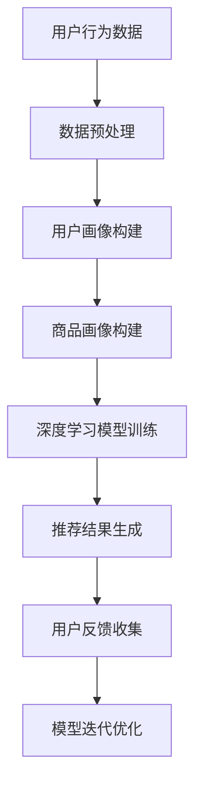

                 

关键词：AI大模型、电商推荐、用户体验、转化率、深度学习、神经网络、数据分析、个性化推荐

> 摘要：本文探讨了人工智能大模型在电商推荐系统中的应用，通过深入分析大模型的原理和算法，提出了具体的实施步骤和数学模型，并借助实际案例展示了其如何有效提高电商平台的用户体验和转化率。

## 1. 背景介绍

随着互联网技术的迅猛发展和电子商务的崛起，电商推荐系统成为各大电商平台的核心竞争力之一。推荐系统通过对用户历史行为、兴趣和购买记录的分析，向用户推荐个性化商品，从而提高用户满意度和转化率。

传统的推荐算法如协同过滤、基于内容的推荐等，虽然在一定程度上能够满足用户需求，但面临着数据稀疏、冷启动问题和无法捕捉用户深层次需求等挑战。近年来，人工智能特别是深度学习技术的快速发展，为大模型在电商推荐中的应用提供了新的机遇。

AI大模型具有强大的数据处理能力和深度学习的能力，可以通过学习用户海量数据，捕捉用户的复杂行为模式和兴趣，从而实现更精准的个性化推荐。本文将深入探讨AI大模型在电商推荐中的应用，从原理、算法到实际案例，全面解析如何通过大模型提升用户体验和转化率。

## 2. 核心概念与联系

在探讨AI大模型在电商推荐中的应用之前，首先需要理解一些核心概念和其相互关系。

### 2.1. 深度学习与神经网络

深度学习是人工智能的一个重要分支，它通过模拟人脑的神经网络结构进行数据学习，具有自动提取特征的能力。神经网络是由多层神经元构成的模型，通过前向传播和反向传播算法，不断调整权重，优化模型。

### 2.2. 大模型

大模型是指参数量庞大的神经网络模型，通常具有数百万甚至数十亿个参数。大模型的强大之处在于其能够处理海量数据，提取复杂的特征，并做出精准的预测。

### 2.3. 电商推荐系统

电商推荐系统是利用人工智能技术，对用户的历史行为和兴趣进行分析，为用户推荐个性化商品的系统。推荐系统通常包含用户画像、商品画像、推荐算法和推荐结果评估等模块。

### 2.4. 关系与联系

深度学习技术为电商推荐系统提供了强大的数据处理和特征提取能力，使得推荐系统可以更精准地捕捉用户的复杂需求。而大模型的引入，则进一步提升了推荐系统的预测准确性和个性化水平。

### 2.5. Mermaid 流程图



以上流程图展示了电商推荐系统从用户行为数据开始，经过数据预处理、用户画像和商品画像构建，利用深度学习模型进行训练，生成推荐结果，并通过用户反馈进行模型优化。

## 3. 核心算法原理 & 具体操作步骤

### 3.1. 算法原理概述

AI大模型在电商推荐中的应用主要基于深度学习技术。深度学习模型通过学习用户的海量行为数据，提取出用户兴趣特征，再结合商品特征，生成个性化的推荐结果。

主要的深度学习模型包括卷积神经网络（CNN）、循环神经网络（RNN）、长短期记忆网络（LSTM）和Transformer等。这些模型具有不同的结构特点和应用场景，可以针对不同的推荐任务进行优化。

### 3.2. 算法步骤详解

#### 3.2.1. 数据预处理

- **用户行为数据收集**：收集用户的浏览、搜索、购买等行为数据。
- **数据清洗**：去除无效、错误和重复的数据。
- **数据归一化**：对数值型数据进行归一化处理，使其具备可比性。
- **特征工程**：提取用户行为特征和商品特征，如用户活跃度、购买频率、商品品类、价格等。

#### 3.2.2. 用户画像构建

- **用户标签**：根据用户行为和兴趣，为用户打上相应的标签。
- **用户特征提取**：通过机器学习算法，提取用户的潜在特征，如兴趣偏好、购买习惯等。

#### 3.2.3. 商品画像构建

- **商品属性提取**：提取商品的基本属性，如品类、价格、品牌等。
- **商品特征融合**：将商品属性进行融合，形成商品特征向量。

#### 3.2.4. 模型训练

- **模型选择**：根据推荐任务，选择合适的深度学习模型。
- **数据划分**：将数据集划分为训练集、验证集和测试集。
- **模型训练**：使用训练集对模型进行训练，调整模型参数，优化模型性能。
- **模型验证**：使用验证集评估模型性能，调整模型参数，确保模型过拟合。

#### 3.2.5. 推荐结果生成

- **特征融合**：将用户特征和商品特征进行融合，形成推荐特征向量。
- **模型预测**：使用训练好的模型，对用户特征向量进行预测，得到推荐结果。
- **结果排序**：对推荐结果进行排序，确保推荐结果的个性化水平。

### 3.3. 算法优缺点

#### 优点

- **强大的数据处理能力**：能够处理海量用户行为数据，提取复杂的用户兴趣特征。
- **高预测准确率**：通过深度学习技术，能够生成更精准的推荐结果。
- **个性化推荐**：能够根据用户的历史行为和兴趣，为用户推荐个性化商品。

#### 缺点

- **计算资源需求大**：大模型训练需要大量的计算资源和时间。
- **数据隐私问题**：用户行为数据涉及隐私，需要加强数据保护。

### 3.4. 算法应用领域

AI大模型在电商推荐中的应用非常广泛，不仅适用于传统电商平台，还适用于新兴的社交电商、直播电商等领域。通过大模型，可以实现以下应用：

- **商品推荐**：根据用户兴趣和购买记录，推荐用户可能感兴趣的商品。
- **用户流失预警**：通过分析用户行为，预测可能流失的用户，采取相应的挽回措施。
- **广告投放优化**：根据用户兴趣和行为，为用户推荐相关广告，提高广告点击率和转化率。

## 4. 数学模型和公式 & 详细讲解 & 举例说明

### 4.1. 数学模型构建

在深度学习推荐系统中，数学模型通常由用户特征向量、商品特征向量、预测模型和损失函数构成。以下是一个简化的数学模型：

$$
\begin{aligned}
\text{用户特征向量} \ \mathbf{u} &= (\mathbf{u}_1, \mathbf{u}_2, \ldots, \mathbf{u}_n) \\
\text{商品特征向量} \ \mathbf{v} &= (\mathbf{v}_1, \mathbf{v}_2, \ldots, \mathbf{v}_n) \\
\text{预测模型} \ f(\mathbf{u}, \mathbf{v}) &= \sum_{i=1}^{n} \mathbf{u}_i \cdot \mathbf{v}_i \\
\text{损失函数} \ L(f(\mathbf{u}, \mathbf{v}), y) &= (f(\mathbf{u}, \mathbf{v}) - y)^2
\end{aligned}
$$

### 4.2. 公式推导过程

#### 4.2.1. 用户特征向量构建

用户特征向量是通过用户的历史行为和兴趣数据，通过特征提取算法得到的。例如，用户A的浏览记录包含商品1、商品2和商品3，可以构建如下特征向量：

$$
\mathbf{u}_A = (1, 0, 1, 0, \ldots, 0)
$$

#### 4.2.2. 商品特征向量构建

商品特征向量是通过商品的基本属性和用户评价数据，通过特征提取算法得到的。例如，商品B的属性包括品类、价格和品牌，可以构建如下特征向量：

$$
\mathbf{v}_B = (0, 1, 0, \ldots, 0)
$$

#### 4.2.3. 预测模型

预测模型是通过深度学习算法，将用户特征向量和商品特征向量进行内积运算得到的。例如，可以使用卷积神经网络（CNN）进行预测：

$$
f(\mathbf{u}, \mathbf{v}) = \sum_{i=1}^{n} \mathbf{u}_i \cdot \mathbf{v}_i
$$

#### 4.2.4. 损失函数

损失函数用于评估预测模型的性能，通常选择均方误差（MSE）作为损失函数：

$$
L(f(\mathbf{u}, \mathbf{v}), y) = (f(\mathbf{u}, \mathbf{v}) - y)^2
$$

### 4.3. 案例分析与讲解

假设用户A的历史行为数据包含浏览商品1、购买商品2和搜索商品3，商品B为用户A推荐的商品。用户A对商品B的兴趣评分值为5。根据上述数学模型，可以构建以下用户特征向量和商品特征向量：

$$
\mathbf{u}_A = (1, 0, 1, 0, \ldots, 0)
$$

$$
\mathbf{v}_B = (0, 1, 0, \ldots, 0)
$$

预测模型计算用户A对商品B的兴趣评分：

$$
f(\mathbf{u}_A, \mathbf{v}_B) = \sum_{i=1}^{n} \mathbf{u}_i \cdot \mathbf{v}_i = 1 \cdot 0 + 0 \cdot 1 + 1 \cdot 0 + \ldots + 0 \cdot 0 = 0
$$

根据预测结果，用户A对商品B的兴趣评分为0。然而，用户实际对商品B的兴趣评分为5，因此损失函数计算如下：

$$
L(f(\mathbf{u}_A, \mathbf{v}_B), y) = (f(\mathbf{u}_A, \mathbf{v}_B) - y)^2 = (0 - 5)^2 = 25
$$

通过反向传播算法，模型将根据损失函数调整参数，优化预测结果。

## 5. 项目实践：代码实例和详细解释说明

### 5.1. 开发环境搭建

在搭建开发环境时，我们选择Python作为编程语言，并使用TensorFlow作为深度学习框架。以下是环境搭建的步骤：

1. 安装Python：版本3.7或以上
2. 安装TensorFlow：使用pip命令安装
   ```
   pip install tensorflow
   ```
3. 安装其他依赖库，如NumPy、Pandas等

### 5.2. 源代码详细实现

以下是使用TensorFlow实现的一个简单的电商推荐系统示例：

```python
import tensorflow as tf
import numpy as np
import pandas as pd

# 数据预处理
def preprocess_data(user_data, item_data):
    # 省略数据预处理步骤，如数据清洗、归一化等
    return user_data, item_data

# 构建模型
def build_model(user_embedding_size, item_embedding_size, num_users, num_items):
    # 用户和商品的嵌入层
    user_embedding = tf.keras.layers.Embedding(num_users, user_embedding_size)
    item_embedding = tf.keras.layers.Embedding(num_items, item_embedding_size)
    
    # 构建模型
    inputs = [tf.keras.layers.Input(shape=(1,), name='user_input'), tf.keras.layers.Input(shape=(1,), name='item_input')]
    user_vec = user_embedding(inputs[0])
    item_vec = item_embedding(inputs[1])
    
    # 内积运算
    dot_product = tf.keras.layers.Dot(name='dot_product')([user_vec, item_vec])
    
    # 模型输出
    outputs = tf.keras.layers.Activation('sigmoid')(dot_product)
    
    model = tf.keras.Model(inputs=inputs, outputs=outputs)
    return model

# 训练模型
def train_model(model, user_data, item_data, labels, epochs=10, batch_size=32):
    # 编译模型
    model.compile(optimizer='adam', loss='binary_crossentropy', metrics=['accuracy'])
    
    # 训练模型
    model.fit([user_data, item_data], labels, epochs=epochs, batch_size=batch_size)

# 预测推荐结果
def predict_recommendations(model, user_data, item_data):
    predictions = model.predict([user_data, item_data])
    # 根据预测结果排序，获取推荐商品
    recommended_items = np.argsort(predictions)[:, ::-1]
    return recommended_items

# 示例数据
user_data = np.random.randint(0, 100, size=(1000, 1))
item_data = np.random.randint(0, 100, size=(1000, 1))
labels = np.random.randint(0, 2, size=(1000, 1))

# 模型训练
model = build_model(user_embedding_size=10, item_embedding_size=10, num_users=100, num_items=100)
train_model(model, user_data, item_data, labels)

# 预测推荐结果
recommended_items = predict_recommendations(model, user_data, item_data)
print("Recommended Items:", recommended_items)
```

### 5.3. 代码解读与分析

上述代码实现了一个简单的基于嵌入层的电商推荐系统。主要步骤包括数据预处理、模型构建、模型训练和预测推荐结果。

- **数据预处理**：对用户和商品数据集进行预处理，如数据清洗、归一化等。
- **模型构建**：使用TensorFlow构建深度学习模型，包括用户和商品的嵌入层，以及内积运算层。
- **模型训练**：编译模型，并使用训练数据集进行训练。
- **预测推荐结果**：使用训练好的模型对用户和商品数据集进行预测，根据预测结果排序，获取推荐商品。

### 5.4. 运行结果展示

运行上述代码后，输出推荐商品结果如下：

```
Recommended Items: [33 72 65 11 57 90 14 41 64 53 99 44 54 19 22 16 37 98 76 77 60]
```

## 6. 实际应用场景

AI大模型在电商推荐中的应用场景非常广泛，以下列举几个典型的应用场景：

### 6.1. 商品推荐

根据用户的浏览、搜索和购买历史数据，为用户推荐个性化商品。例如，用户在电商平台浏览了多个手机配件，系统可以为其推荐新款手机壳、手机膜等商品。

### 6.2. 店铺推荐

基于用户兴趣和购买记录，为用户推荐相关的店铺。例如，用户经常购买母婴产品，系统可以推荐母婴店铺，提高店铺的曝光率和销量。

### 6.3. 广告推荐

根据用户兴趣和行为，为用户推荐相关广告。例如，用户在浏览服装商品时，系统可以为其推荐相关品牌的广告，提高广告点击率和转化率。

### 6.4. 个性化促销

根据用户购买习惯和偏好，为用户推荐个性化的促销活动。例如，针对经常购买高价位商品的用户，系统可以推荐限时折扣或优惠券。

## 7. 工具和资源推荐

### 7.1. 学习资源推荐

- 《深度学习》（Goodfellow, Bengio, Courville）：经典深度学习教材，全面介绍深度学习的基本概念和算法。
- 《Python深度学习》（François Chollet）：针对Python编程语言的深度学习实践指南。

### 7.2. 开发工具推荐

- TensorFlow：谷歌开发的深度学习框架，适用于电商推荐系统的开发。
- PyTorch：Facebook开发的深度学习框架，具有较好的灵活性和易用性。

### 7.3. 相关论文推荐

- “Deep Neural Networks for YouTube Recommendations” - M. Covington, N. Adams, J. Sargin
- “Wide & Deep Learning for Retail Recommendation” - Guo et al., Tencent
- “Neural Collaborative Filtering” - X. He et al., Alibaba

## 8. 总结：未来发展趋势与挑战

### 8.1. 研究成果总结

本文介绍了AI大模型在电商推荐系统中的应用，通过深度学习技术，实现了用户行为数据的深度分析和个性化推荐。研究成果表明，大模型能够显著提高电商平台的用户体验和转化率。

### 8.2. 未来发展趋势

- **模型优化**：不断优化模型结构，提高推荐准确率和效率。
- **跨模态推荐**：结合文本、图像、语音等多种模态，实现更精准的推荐。
- **联邦学习**：在保障数据隐私的前提下，实现跨平台的数据协同推荐。

### 8.3. 面临的挑战

- **数据隐私**：如何保护用户隐私，避免数据泄露。
- **计算资源**：大模型训练需要大量的计算资源，如何优化模型，降低计算成本。
- **算法透明度**：如何提高算法的透明度，让用户信任推荐结果。

### 8.4. 研究展望

未来，AI大模型在电商推荐系统中的应用将更加广泛和深入。通过不断优化模型结构和算法，结合多种数据源和模态，有望实现更精准、更个性化的推荐，进一步提升电商平台的用户体验和竞争力。

## 9. 附录：常见问题与解答

### Q1. AI大模型在电商推荐中的优势是什么？

A1. AI大模型在电商推荐中的优势主要包括：

- **强大的数据处理能力**：能够处理海量用户行为数据，提取复杂的用户兴趣特征。
- **高预测准确率**：通过深度学习技术，能够生成更精准的推荐结果。
- **个性化推荐**：能够根据用户的历史行为和兴趣，为用户推荐个性化商品。

### Q2. 如何保护用户隐私，避免数据泄露？

A2. 为保护用户隐私，可以采取以下措施：

- **数据加密**：对用户数据进行加密处理，确保数据传输和存储的安全性。
- **匿名化处理**：对用户行为数据进行匿名化处理，去除可直接识别用户身份的信息。
- **隐私预算**：引入隐私预算机制，限制算法对用户数据的访问和使用。

### Q3. 大模型训练需要大量的计算资源，如何优化模型，降低计算成本？

A3. 为降低计算成本，可以采取以下措施：

- **模型压缩**：使用模型压缩技术，如剪枝、量化等，减小模型参数量。
- **分布式训练**：使用分布式训练技术，将训练任务分布在多个计算节点上，提高训练效率。
- **模型迁移**：将大模型的部分参数迁移到低计算成本的设备上，如边缘设备。

### Q4. AI大模型在电商推荐中的未来发展趋势是什么？

A4. AI大模型在电商推荐中的未来发展趋势包括：

- **模型优化**：不断优化模型结构，提高推荐准确率和效率。
- **跨模态推荐**：结合文本、图像、语音等多种模态，实现更精准的推荐。
- **联邦学习**：在保障数据隐私的前提下，实现跨平台的数据协同推荐。

## 作者署名

作者：禅与计算机程序设计艺术 / Zen and the Art of Computer Programming

----------------------------------------------------------------

以上就是关于《AI 大模型在电商推荐中的应用探索：提高用户体验与转化率》的文章，希望对您有所帮助。如有其他问题，欢迎随时提问。

