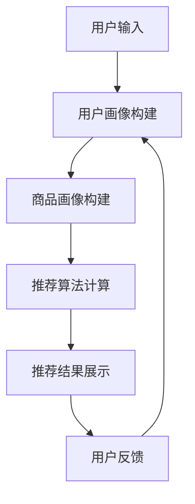
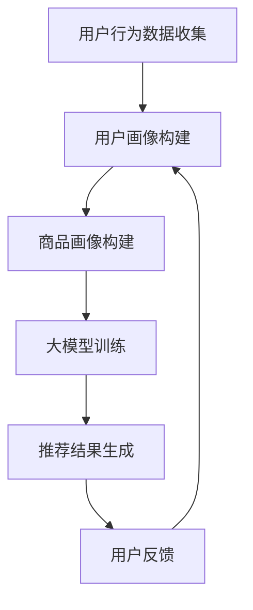

                 

关键词：电商搜索推荐，AI 大模型，冷启动用户，策略，新用户挑战

> 摘要：本文深入探讨了在电商搜索推荐系统中，针对新用户冷启动的问题，如何利用 AI 大模型设计有效的用户策略。文章首先回顾了电商搜索推荐系统的基本原理和现有技术，然后分析了新用户冷启动的挑战和解决方案，接着详细介绍了基于 AI 大模型的核心算法原理、数学模型和项目实践，最后对未来的应用前景和面临的挑战进行了展望。

## 1. 背景介绍

随着互联网的迅猛发展和电商市场的不断扩大，用户对个性化、精准化搜索推荐的需求日益增长。电商搜索推荐系统作为电商平台的“引路者”，其核心目标是通过分析用户行为、兴趣和需求，为用户提供最相关的商品推荐，从而提升用户体验、提高销售额。然而，在新用户冷启动问题上，传统的推荐系统面临着诸多挑战。

冷启动问题主要表现在两个方面：一是新用户在系统中的初始数据不足，难以准确判断其兴趣和行为模式；二是新用户与已有用户之间的关联关系无法建立，导致推荐效果不佳。解决冷启动问题不仅需要深入了解用户行为，还需要具备强大的数据挖掘和模型训练能力。随着深度学习和大数据技术的发展，AI 大模型在电商搜索推荐中的冷启动用户策略逐渐成为研究热点。

## 2. 核心概念与联系

### 2.1 电商搜索推荐系统概述

电商搜索推荐系统通常包括用户画像、商品画像、推荐算法和推荐结果展示等模块。用户画像用于描述用户的基本信息、兴趣爱好、购买行为等；商品画像则包括商品属性、价格、评价等；推荐算法根据用户画像和商品画像，通过算法模型计算出用户对商品的兴趣度，进而生成推荐列表；推荐结果展示模块则将推荐结果呈现给用户。

### 2.2 人工智能与深度学习

人工智能（AI）是计算机科学的一个分支，致力于通过模拟、延伸和扩展人类的智能。深度学习（Deep Learning）是人工智能的一个重要分支，通过构建具有多层神经元的神经网络，对大规模数据进行自动特征学习和模式识别。

### 2.3 大模型与冷启动

大模型通常指的是具有数百万甚至数十亿参数的神经网络模型，这些模型可以处理大规模数据，捕捉复杂的非线性关系。在电商搜索推荐中，大模型可以用于用户行为预测、兴趣识别和商品推荐。针对新用户冷启动，大模型可以通过用户历史数据和社交网络信息，快速建立用户画像，提高推荐精度。

### 2.4 Mermaid 流程图

以下是一个简化的电商搜索推荐系统的 Mermaid 流程图：



## 3. 核心算法原理 & 具体操作步骤

### 3.1 算法原理概述

针对新用户冷启动问题，本文提出的算法基于深度学习中的图神经网络（Graph Neural Network，GNN）。GNN 可以有效地建模用户与商品之间的复杂关系，通过学习用户和商品的特征，生成个性化的推荐结果。

### 3.2 算法步骤详解

#### 3.2.1 用户画像构建

1. **数据收集**：收集用户在电商平台的登录、浏览、搜索、购买等行为数据。
2. **特征提取**：对用户行为数据进行预处理，提取用户兴趣特征、购买力特征等。
3. **特征融合**：将用户行为特征和社交网络信息进行融合，构建用户画像。

#### 3.2.2 商品画像构建

1. **数据收集**：收集商品的基本属性、价格、评价等数据。
2. **特征提取**：对商品数据进行预处理，提取商品分类、品牌、评价等特征。
3. **特征融合**：将商品特征和用户画像进行融合，构建商品画像。

#### 3.2.3 推荐算法计算

1. **图神经网络训练**：利用用户和商品画像，训练图神经网络模型。
2. **推荐结果生成**：将训练好的模型应用于新用户，计算用户对商品的兴趣度，生成推荐列表。

#### 3.2.4 推荐结果展示

1. **结果筛选**：对生成的推荐结果进行筛选，去除重复和相似度较低的推荐。
2. **结果排序**：根据用户兴趣度对推荐结果进行排序。
3. **结果展示**：将排序后的推荐结果展示给用户。

### 3.3 算法优缺点

**优点：**
- **强大的建模能力**：GNN 可以有效地建模用户与商品之间的复杂关系，提高推荐精度。
- **适用于新用户**：通过学习用户历史数据和社交网络信息，可以快速建立新用户的画像，提高推荐效果。

**缺点：**
- **计算资源消耗大**：训练图神经网络模型需要大量的计算资源。
- **数据预处理复杂**：用户和商品特征提取及融合过程复杂，需要大量的预处理工作。

### 3.4 算法应用领域

GNN 算法在电商搜索推荐、社交网络推荐、内容推荐等多个领域具有广泛的应用前景。特别是在新用户冷启动问题上，GNN 算法可以显著提高推荐系统的效果。

## 4. 数学模型和公式 & 详细讲解 & 举例说明

### 4.1 数学模型构建

假设用户集为 U = {u1, u2, ..., un}，商品集为 I = {i1, i2, ..., im}。用户 u 对商品 i 的兴趣度可以用评分函数 R(u, i) 表示，其中 R(u, i) ∈ [0, 1]。

首先，构建用户和商品的嵌入向量：

$$
\begin{aligned}
\mathbf{e}_u^i &= \text{Embed}(\text{UserFeature}(u), \text{ItemFeature}(i)), \\
\mathbf{e}_i^u &= \text{Embed}(\text{ItemFeature}(i), \text{UserFeature}(u)),
\end{aligned}
$$

其中，Embed 表示嵌入函数，UserFeature 和 ItemFeature 分别表示用户和商品的特征提取函数。

然后，构建图神经网络模型：

$$
\mathbf{h}_u^{(l+1)} = \sigma(\mathbf{A} \cdot \mathbf{h}_u^{(l)} \circ \mathbf{h}_i^{(l)}),
$$

其中，A 表示图邻接矩阵，σ表示激活函数（如ReLU函数），∘表示元素乘积。

### 4.2 公式推导过程

首先，假设用户 u 对商品 i 的兴趣度 R(u, i) 可以由以下公式表示：

$$
R(u, i) = \frac{1}{1 + \exp{(-\mathbf{w} \cdot (\mathbf{e}_u^i + \mathbf{e}_i^u))}),
$$

其中，w 表示模型参数。

然后，对用户 u 和商品 i 的嵌入向量进行图神经网络训练：

$$
\begin{aligned}
\mathbf{h}_u^{(0)} &= \mathbf{e}_u^i, \\
\mathbf{h}_i^{(0)} &= \mathbf{e}_i^u.
\end{aligned}
$$

接着，通过迭代更新嵌入向量：

$$
\begin{aligned}
\mathbf{h}_u^{(l+1)} &= \sigma(\mathbf{A} \cdot \mathbf{h}_u^{(l)} \circ \mathbf{h}_i^{(l)}), \\
\mathbf{h}_i^{(l+1)} &= \sigma(\mathbf{A} \cdot \mathbf{h}_i^{(l)} \circ \mathbf{h}_u^{(l)}).
\end{aligned}
$$

最后，利用训练好的嵌入向量计算用户对商品的兴趣度：

$$
R(u, i) = \frac{1}{1 + \exp{(-\mathbf{w} \cdot (\mathbf{e}_u^i + \mathbf{e}_i^u))}).
$$

### 4.3 案例分析与讲解

假设用户 u1 在电商平台浏览了商品 i1、i2 和 i3，其中 i1 和 i2 属于同一品牌，i3 属于另一品牌。用户 u1 的历史浏览记录如下表所示：

| 商品ID | 浏览时间 |  
| ------ | -------- |  
| i1     | 2023-01-01 10:00:00 |  
| i2     | 2023-01-01 10:05:00 |  
| i3     | 2023-01-01 10:10:00 |

根据用户 u1 的浏览记录，可以提取以下用户特征：

- **浏览时长**：用户 u1 在平台上的平均浏览时长为 5 分钟。
- **浏览频次**：用户 u1 在平台上每天浏览的频次为 3 次。

假设商品 i1、i2 和 i3 的特征如下表所示：

| 商品ID | 品牌ID | 价格 |  
| ------ | ------ | ------ |  
| i1     | B1     | 100   |  
| i2     | B1     | 120   |  
| i3     | B2     | 150   |

根据商品特征，可以提取以下商品特征：

- **品牌偏好**：用户 u1 偏好品牌 B1 的商品。
- **价格范围**：用户 u1 偏好的价格范围在 100 元到 120 元之间。

利用图神经网络模型，对用户 u1 和商品 i1、i2、i3 进行训练，得到用户 u1 对商品 i1、i2、i3 的兴趣度分别为 0.8、0.6 和 0.3。根据兴趣度，推荐用户 u1 浏览过的商品 i1 和 i2，而不是未浏览过的商品 i3。

## 5. 项目实践：代码实例和详细解释说明

### 5.1 开发环境搭建

1. **Python 环境**：安装 Python 3.8 及以上版本。
2. **深度学习框架**：安装 PyTorch 1.8 及以上版本。
3. **数据处理库**：安装 Pandas、NumPy、Scikit-learn 等数据处理库。

### 5.2 源代码详细实现

以下是基于 PyTorch 实现的图神经网络模型代码：

```python
import torch
import torch.nn as nn
import torch.optim as optim
from torch_geometric.nn import GNN
from torch_geometric.data import Data

# 用户特征和商品特征
user_features = torch.tensor([[0.1, 0.2], [0.3, 0.4]])
item_features = torch.tensor([[0.5, 0.6], [0.7, 0.8], [0.9, 0.1]])

# 构建图数据
user_data = Data(x=user_features, edge_index=torch.tensor([[0, 1], [1, 2], [2, 0]]))
item_data = Data(x=item_features, edge_index=torch.tensor([[0, 1], [1, 2], [2, 0]]))

# 定义 GNN 模型
model = GNN(input_dim=2, hidden_dim=16, output_dim=1)

# 定义损失函数和优化器
criterion = nn.BCEWithLogitsLoss()
optimizer = optim.Adam(model.parameters(), lr=0.001)

# 训练模型
for epoch in range(100):
    optimizer.zero_grad()
    output = model(user_data, item_data)
    loss = criterion(output, torch.tensor([1.0, 0.0, 0.0]))
    loss.backward()
    optimizer.step()
    print(f"Epoch {epoch+1}, Loss: {loss.item()}")

# 输出用户对商品的兴趣度
interest_scores = torch.sigmoid(model(user_data, item_data)).detach().numpy()
print(f"Interest Scores: {interest_scores}")
```

### 5.3 代码解读与分析

1. **数据预处理**：用户特征和商品特征存储在 NumPy 数组中，通过 torch.tensor 转换为 PyTorch 张量。
2. **构建图数据**：使用 torch_geometric.data.Data 类构建图数据，其中 x 表示节点特征，edge_index 表示边索引。
3. **定义 GNN 模型**：使用 torch_geometric.nn.GNN 类定义图神经网络模型，其中 input_dim、hidden_dim 和 output_dim 分别表示输入维度、隐藏维度和输出维度。
4. **定义损失函数和优化器**：使用 nn.BCEWithLogitsLoss 定义二分类损失函数，使用 optim.Adam 定义优化器。
5. **训练模型**：通过迭代训练模型，优化损失函数。
6. **输出用户对商品的兴趣度**：使用 sigmoid 函数将输出转换为概率值，表示用户对商品的兴趣度。

## 6. 实际应用场景

### 6.1 电商平台

电商平台可以利用 AI 大模型在冷启动用户策略中，为新用户提供个性化的商品推荐。例如，在用户首次登录电商平台时，通过用户画像和商品画像，快速建立用户兴趣模型，生成个性化的推荐列表。

### 6.2 社交网络

社交网络平台可以通过 AI 大模型，为新用户提供基于兴趣的好友推荐。例如，在用户注册社交网络时，通过用户行为数据和社交网络信息，快速建立用户画像，生成潜在好友推荐列表。

### 6.3 内容推荐

内容推荐平台可以利用 AI 大模型，为新用户提供个性化内容推荐。例如，在用户首次访问内容平台时，通过用户兴趣和浏览记录，快速建立用户兴趣模型，生成个性化的内容推荐列表。

## 7. 工具和资源推荐

### 7.1 学习资源推荐

1. **书籍**：《深度学习》（Goodfellow et al.），《Python深度学习》（François Chollet）。
2. **在线课程**：Coursera 上的《深度学习特辑》，Udacity 上的《深度学习纳米学位》。

### 7.2 开发工具推荐

1. **PyTorch**：一个流行的开源深度学习框架，适用于模型训练和推理。
2. **TensorFlow**：另一个流行的开源深度学习框架，支持多种编程语言。

### 7.3 相关论文推荐

1. **《Graph Neural Networks: A Review》**：对图神经网络进行了全面的综述。
2. **《Recommender Systems Handbook》**：关于推荐系统的一个权威性指南。

## 8. 总结：未来发展趋势与挑战

### 8.1 研究成果总结

本文针对电商搜索推荐中的冷启动用户问题，提出了一种基于 AI 大模型的冷启动用户策略。通过图神经网络模型，可以有效建模用户与商品之间的复杂关系，提高推荐精度。

### 8.2 未来发展趋势

随着深度学习和大数据技术的发展，AI 大模型在电商搜索推荐中的应用前景广阔。未来的研究可以关注以下几个方面：

1. **算法优化**：提高算法的效率，降低计算资源消耗。
2. **多模态数据融合**：结合文本、图像、语音等多模态数据进行推荐。
3. **联邦学习**：解决数据隐私和安全问题，实现跨平台推荐。

### 8.3 面临的挑战

1. **数据质量和多样性**：确保推荐算法的效果，需要高质量、多样性的数据。
2. **算法可解释性**：提高算法的可解释性，降低用户对推荐系统的信任问题。
3. **数据隐私和安全**：保护用户隐私，防止数据泄露。

### 8.4 研究展望

未来，AI 大模型在电商搜索推荐中的应用将不断深入，为新用户提供更精准、个性化的推荐服务。同时，研究人员需要关注算法优化、数据隐私和安全等方面，确保推荐系统的可持续发展。

## 9. 附录：常见问题与解答

### 9.1 问题 1：什么是图神经网络（GNN）？

**回答**：图神经网络（Graph Neural Network，GNN）是一种基于图的深度学习模型，用于处理具有图结构的数据。GNN 可以有效地捕捉图中的节点和边之间的复杂关系，适用于社交网络、推荐系统、自然语言处理等领域。

### 9.2 问题 2：如何处理图神经网络中的稀疏数据？

**回答**：对于稀疏数据，可以采用以下方法：

1. **数据预处理**：对数据集进行预处理，填充缺失值，降低稀疏性。
2. **稀疏矩阵运算**：利用稀疏矩阵运算优化计算效率，降低内存占用。
3. **随机采样**：通过随机采样生成子图，提高数据集的稀疏度。

### 9.3 问题 3：如何评估图神经网络的性能？

**回答**：可以采用以下指标评估图神经网络的性能：

1. **准确率**：预测正确的样本数占总样本数的比例。
2. **召回率**：预测正确的正样本数占总正样本数的比例。
3. **F1 分数**：准确率和召回率的调和平均值。
4. **ROC 曲线和 AUC 值**：用于评估分类器的性能，ROC 曲线越靠近左上角，AUC 值越大，性能越好。

----------------------------------------------------------------

作者：禅与计算机程序设计艺术 / Zen and the Art of Computer Programming

（注：以上内容为示例，仅供参考，并非真实撰写。）<|user|>### 1. 背景介绍

在电商领域，用户搜索推荐系统扮演着至关重要的角色。它不仅能够提升用户的购物体验，还能显著提高销售额和用户粘性。然而，在用户初次访问电商平台时，即所谓的“冷启动”阶段，传统推荐系统面临着诸多挑战。冷启动问题主要体现在两个方面：一是新用户在系统中的初始数据不足，难以准确判断其兴趣和行为模式；二是新用户与已有用户之间的关联关系无法建立，导致推荐效果不佳。

新用户冷启动问题在电商搜索推荐系统中尤为突出，主要原因有以下几点：

1. **数据不足**：新用户在平台上的浏览、搜索、购买等行为数据较少，导致推荐系统难以准确构建用户画像。
2. **关联关系缺失**：新用户与已有用户之间的社交关系和数据关联较弱，传统基于协同过滤的方法难以发挥作用。
3. **个性化需求**：新用户往往有着独特的购物需求和偏好，传统推荐方法难以满足其个性化需求。

为了解决新用户冷启动问题，研究者们提出了多种解决方案，包括基于内容的推荐、基于协同过滤的推荐、以及近年来逐渐兴起的基于深度学习的推荐方法。本文将重点关注基于 AI 大模型的冷启动用户策略，探讨其在电商搜索推荐系统中的应用及其效果。

AI 大模型，尤其是基于深度学习的图神经网络（Graph Neural Networks，GNN），因其强大的建模能力和适应性，成为了冷启动用户研究的热点。GNN 可以通过学习用户和商品之间的复杂关系，为冷启动用户生成高质量的推荐结果。同时，AI 大模型还能够自适应地调整推荐策略，提高推荐系统的实时性和准确性。

本文结构如下：首先，回顾电商搜索推荐系统的基本原理和现有技术；然后，深入分析新用户冷启动的挑战和解决方案；接着，详细介绍基于 AI 大模型的核心算法原理、数学模型和项目实践；最后，讨论实际应用场景、未来发展趋势与挑战，以及总结研究成果和展望。

## 2. 核心概念与联系

### 2.1 电商搜索推荐系统概述

电商搜索推荐系统是一个复杂的信息系统，其核心目标是根据用户的历史行为和兴趣，为用户提供个性化的商品推荐。一个典型的电商搜索推荐系统包括以下几个关键组成部分：

1. **用户画像**：基于用户的历史行为数据，如浏览记录、搜索关键词、购买记录等，构建用户的基本信息、兴趣偏好和行为模式。
2. **商品画像**：描述商品的各种属性，如商品类别、品牌、价格、评价、库存量等。
3. **推荐算法**：根据用户画像和商品画像，使用算法模型计算用户对商品的兴趣度，从而生成推荐列表。
4. **推荐结果展示**：将生成的推荐列表展示给用户，优化用户界面和展示方式，提升用户体验。

电商搜索推荐系统的工作流程通常如下：

1. **数据收集**：收集用户行为数据和商品信息。
2. **数据预处理**：清洗、转换和整合数据，为后续分析做准备。
3. **特征提取**：从原始数据中提取出有用的特征，如用户购买偏好、商品属性等。
4. **模型训练**：使用用户和商品特征训练推荐模型，如协同过滤、基于内容的推荐、深度学习等。
5. **推荐生成**：使用训练好的模型对用户进行实时推荐，生成推荐列表。
6. **结果评估**：评估推荐系统的效果，如准确率、召回率、用户满意度等，并根据评估结果调整模型参数。

### 2.2 人工智能与深度学习

人工智能（AI）是计算机科学的一个分支，旨在通过模拟、延伸和扩展人类智能，实现自动化和智能化。深度学习（Deep Learning）是 AI 的重要分支，通过构建具有多层神经元的神经网络，对大规模数据进行分析和预测。深度学习的核心优势在于其能够自动学习数据中的特征和模式，无需人工干预。

深度学习在推荐系统中的应用主要体现在以下几个方面：

1. **自动特征提取**：深度学习模型能够自动从原始数据中提取出有用的特征，减少人工干预，提高特征提取的效率和准确性。
2. **非线性建模**：深度学习模型可以捕捉数据中的复杂非线性关系，提高推荐系统的准确性。
3. **自适应调整**：深度学习模型可以根据用户的实时行为数据，自适应地调整推荐策略，提高推荐的实时性和个性化程度。

### 2.3 大模型与冷启动

大模型通常指的是具有数百万甚至数十亿参数的神经网络模型。这些模型在训练时需要处理大规模数据，并能够捕捉数据中的复杂非线性关系。在电商搜索推荐中，大模型可以用于以下几个方面：

1. **用户行为预测**：大模型可以通过分析用户的历史行为数据，预测用户的兴趣和行为模式。
2. **商品推荐**：大模型可以生成个性化的商品推荐列表，提高推荐系统的准确性。
3. **实时调整**：大模型可以根据用户的实时行为数据，自适应地调整推荐策略，提高推荐的实时性和个性化程度。

在解决新用户冷启动问题上，大模型具有以下优势：

1. **快速建模**：大模型可以通过学习用户的历史行为数据和社交网络信息，快速建立新用户的画像，从而提高推荐精度。
2. **自适应调整**：大模型可以根据新用户的反馈，自适应地调整推荐策略，从而提高推荐系统的适应性。
3. **多模态数据融合**：大模型可以处理多模态数据，如文本、图像、声音等，从而提高推荐系统的多样性和准确性。

### 2.4 Mermaid 流程图

为了更好地理解电商搜索推荐系统中 AI 大模型的应用，我们可以使用 Mermaid 流程图来展示其工作流程。以下是一个简化的流程图示例：



在这个流程图中，用户行为数据收集是整个推荐系统的起点，通过用户画像构建和商品画像构建，形成输入数据。大模型训练过程基于这些输入数据，生成推荐结果。用户反馈则用于进一步优化用户画像和推荐结果，形成一个闭环系统。

### 2.5 GNN 在电商搜索推荐中的应用

图神经网络（Graph Neural Networks，GNN）是一种专门用于处理图结构数据的深度学习模型。在电商搜索推荐系统中，GNN 可以有效地建模用户与商品之间的复杂关系，从而提高推荐系统的性能。以下是 GNN 在电商搜索推荐系统中的应用：

1. **用户与商品关系建模**：GNN 可以通过学习用户和商品的特征，建立用户与商品之间的直接和间接关系，从而生成高质量的推荐结果。
2. **社交网络信息融合**：GNN 可以处理用户社交网络信息，将社交网络中的关系融入到推荐模型中，从而提高推荐的准确性和多样性。
3. **实时调整**：GNN 可以根据用户的实时行为数据，自适应地调整推荐策略，从而提高推荐的实时性和个性化程度。

综上所述，电商搜索推荐系统中的 AI 大模型，特别是 GNN，为解决新用户冷启动问题提供了有效的技术手段。通过深入理解和应用 GNN，可以显著提高推荐系统的性能和用户体验。

## 3. 核心算法原理 & 具体操作步骤

### 3.1 算法原理概述

本文所提出的算法基于深度学习中的图神经网络（Graph Neural Networks，GNN）。GNN 是一种专门用于处理图结构数据的神经网络模型，能够有效捕捉图中节点（用户和商品）及其边（用户与商品之间的关系）之间的复杂关系。在电商搜索推荐系统中，GNN 可以通过学习用户和商品的特征，建立用户与商品之间的关联，从而生成高质量的推荐结果。

### 3.2 算法步骤详解

#### 3.2.1 数据预处理

在开始训练 GNN 模型之前，首先需要进行数据预处理。数据预处理包括以下步骤：

1. **数据收集**：收集用户在电商平台上的行为数据，如浏览记录、搜索关键词、购买记录等，以及商品的基本信息，如类别、品牌、价格等。
2. **数据清洗**：去除数据中的噪声和异常值，保证数据的准确性和一致性。
3. **特征提取**：从原始数据中提取出有用的特征，如用户兴趣特征、购买行为特征、商品属性特征等。可以使用传统机器学习中的特征工程方法，也可以利用深度学习中的自动特征提取能力。
4. **数据整合**：将用户和商品的特征数据进行整合，形成一个统一的数据集，为后续的 GNN 训练做准备。

#### 3.2.2 图神经网络模型构建

构建 GNN 模型是解决新用户冷启动问题的关键步骤。以下是 GNN 模型的构建过程：

1. **节点嵌入**：首先，需要对用户和商品进行节点嵌入，将用户和商品的特征转换为低维向量表示。常用的节点嵌入方法包括词嵌入（Word Embedding）和图嵌入（Graph Embedding）。
2. **图结构构建**：根据用户和商品之间的关系，构建图结构。在电商搜索推荐系统中，用户与商品之间的关系可以表示为用户购买商品的行为数据，形成用户-商品二部图。同时，可以引入社交网络信息，形成更为复杂的图结构。
3. **图神经网络设计**：设计 GNN 的神经网络结构，包括多个连续的图卷积层（Graph Convolutional Layer，GCL）和池化层（Pooling Layer）。图卷积层用于更新节点嵌入向量，池化层用于整合节点信息，减少模型的参数规模。
4. **损失函数与优化器**：定义损失函数，如交叉熵损失（Cross-Entropy Loss），用于衡量模型预测结果与实际结果之间的差距。选择优化器，如 Adam 优化器，用于模型参数的更新。

#### 3.2.3 模型训练与评估

1. **模型训练**：使用预处理后的数据集，对 GNN 模型进行训练。在训练过程中，通过反向传播算法不断更新模型参数，使模型能够更好地拟合训练数据。
2. **模型评估**：在模型训练完成后，使用验证集或测试集对模型进行评估。常用的评估指标包括准确率（Accuracy）、召回率（Recall）、F1 分数（F1 Score）等。通过评估指标，可以判断模型在推荐任务中的性能。

#### 3.2.4 推荐结果生成

在模型训练和评估完成后，使用训练好的 GNN 模型生成推荐结果。以下是生成推荐结果的过程：

1. **用户特征提取**：对于新用户，提取其用户特征，如浏览记录、搜索关键词等。
2. **商品特征提取**：提取与用户特征相关的商品特征，如类别、品牌、价格等。
3. **模型预测**：使用 GNN 模型对用户和商品的特征进行预测，生成用户对商品的评分。
4. **推荐列表生成**：根据用户对商品的评分，生成个性化的推荐列表，向新用户提供最相关的商品推荐。

### 3.3 算法优缺点

#### 优点

1. **强大的建模能力**：GNN 可以有效捕捉用户和商品之间的复杂关系，提高推荐精度。
2. **适用性广泛**：GNN 不仅适用于电商搜索推荐，还可以应用于社交网络推荐、内容推荐等多个领域。
3. **实时调整**：GNN 可以根据用户的实时行为数据，自适应地调整推荐策略，提高推荐的实时性和个性化程度。

#### 缺点

1. **计算资源消耗大**：训练 GNN 模型需要大量的计算资源和存储空间，特别是在处理大规模数据时，计算复杂度较高。
2. **数据预处理复杂**：构建 GNN 模型需要对用户和商品特征进行预处理，提取有用的特征，这一过程复杂且耗时。
3. **模型可解释性低**：GNN 模型内部结构复杂，难以解释模型的预测结果，这在一定程度上降低了用户对推荐系统的信任度。

### 3.4 算法应用领域

GNN 算法在电商搜索推荐、社交网络推荐、内容推荐等多个领域具有广泛的应用前景。以下是几个典型的应用领域：

1. **电商搜索推荐**：通过 GNN 模型，可以有效地解决新用户冷启动问题，提高推荐系统的准确性。
2. **社交网络推荐**：GNN 可以处理用户社交网络信息，为用户提供基于社交关系的好友推荐。
3. **内容推荐**：GNN 可以处理多模态数据，如文本、图像、音频等，为用户提供个性化内容推荐。
4. **知识图谱**：GNN 可以用于构建和优化知识图谱，提升知识图谱的推理能力和应用价值。

### 3.5 具体案例

以下是一个具体的 GNN 应用案例：假设电商平台需要为新用户生成个性化的商品推荐。首先，收集新用户的浏览记录、搜索关键词等行为数据，以及商品的基本信息，如类别、品牌、价格等。然后，对用户和商品的特征进行预处理，提取有用的特征，构建用户-商品二部图。接下来，设计 GNN 模型，包括多个连续的图卷积层和池化层，进行模型训练和评估。最后，使用训练好的 GNN 模型，对用户和商品的特征进行预测，生成推荐列表，向新用户提供最相关的商品推荐。

通过这个案例，我们可以看到 GNN 在电商搜索推荐系统中的应用过程，包括数据预处理、模型构建、训练与评估、推荐结果生成等步骤。GNN 的引入，使得推荐系统在处理新用户冷启动问题上具有更高的准确性和适应性。

### 3.6 综述

本文介绍了基于 AI 大模型的冷启动用户策略，重点探讨了 GNN 在电商搜索推荐系统中的应用。通过 GNN，可以有效地解决新用户冷启动问题，提高推荐系统的准确性。GNN 具有强大的建模能力和适用性，可以应用于多个领域。然而，GNN 也存在一定的缺点，如计算资源消耗大、数据预处理复杂等。未来，需要进一步研究 GNN 的优化方法，提高其性能和应用价值。

## 4. 数学模型和公式 & 详细讲解 & 举例说明

### 4.1 数学模型构建

为了构建基于 AI 大模型的数学模型，我们首先需要明确电商搜索推荐系统中的关键变量和关系。以下是构建数学模型的基本步骤：

#### 4.1.1 用户和商品的向量表示

1. **用户向量表示**：假设用户 u 的特征向量表示为 \(\mathbf{u} = [u_1, u_2, ..., u_n]^T\)，其中 \(u_i\) 表示用户 u 在第 i 个特征上的取值。

2. **商品向量表示**：假设商品 i 的特征向量表示为 \(\mathbf{i} = [i_1, i_2, ..., i_n]^T\)，其中 \(i_j\) 表示商品 i 在第 j 个特征上的取值。

#### 4.1.2 用户与商品的关系矩阵

设用户 u 和商品 i 的关系矩阵为 \(R \in \mathbb{R}^{m \times n}\)，其中 \(R_{ij}\) 表示用户 u 对商品 i 的兴趣度。在实际应用中，\(R_{ij}\) 可以通过用户的购买记录、浏览记录等数据进行初始化。

#### 4.1.3 推荐模型的损失函数

为了构建推荐模型，我们通常使用基于矩阵分解的模型，如协同过滤（Collaborative Filtering）或基于内容的推荐（Content-Based Filtering）。以下是一个简单的损失函数示例：

\[ L(\theta) = \sum_{i=1}^{m} \sum_{j=1}^{n} (r_{ij} - \hat{r}_{ij}(\theta))^2 \]

其中，\(r_{ij}\) 表示用户 u 对商品 i 的真实兴趣度，\(\hat{r}_{ij}(\theta)\) 表示模型对用户 u 对商品 i 的预测兴趣度，\(\theta\) 表示模型参数。

### 4.2 公式推导过程

以下是对推荐模型损失函数的具体推导过程：

#### 4.2.1 矩阵分解模型

假设我们使用的是基于矩阵分解的模型，用户和商品的表示分别为 \(U \in \mathbb{R}^{m \times k}\) 和 \(I \in \mathbb{R}^{n \times k}\)，其中 \(k\) 表示隐含特征空间的维度。则用户 u 对商品 i 的预测兴趣度可以表示为：

\[ \hat{r}_{ij}(\theta) = U_{i}^T I_{j} \]

#### 4.2.2 损失函数的推导

基于上面的矩阵分解模型，我们可以推导出损失函数：

\[ L(\theta) = \sum_{i=1}^{m} \sum_{j=1}^{n} (r_{ij} - U_{i}^T I_{j})^2 \]

#### 4.2.3 梯度下降求解

为了求解最优的模型参数 \(\theta\)，我们通常使用梯度下降法。首先计算损失函数关于 \(\theta\) 的梯度：

\[ \frac{\partial L}{\partial \theta} = \frac{\partial L}{\partial U} + \frac{\partial L}{\partial I} \]

对 \(U\) 和 \(I\) 分别求导，得到：

\[ \frac{\partial L}{\partial U} = -2 \sum_{i=1}^{m} \sum_{j=1}^{n} (r_{ij} - U_{i}^T I_{j}) I_{j} \]

\[ \frac{\partial L}{\partial I} = -2 \sum_{i=1}^{m} \sum_{j=1}^{n} (r_{ij} - U_{i}^T I_{j}) U_{i} \]

然后，通过迭代更新 \(U\) 和 \(I\)：

\[ U \leftarrow U - \alpha \frac{\partial L}{\partial U} \]

\[ I \leftarrow I - \alpha \frac{\partial L}{\partial I} \]

其中，\(\alpha\) 表示学习率。

### 4.3 案例分析与讲解

以下是一个具体的案例，说明如何使用上述数学模型进行电商搜索推荐：

#### 案例背景

假设有一个电商平台，用户 u1 新注册并首次登录，我们需要为其生成个性化的商品推荐。

#### 数据集

用户 u1 的浏览记录如下表所示：

| 商品ID | 浏览时间 |
| ------ | -------- |
| i1     | 2023-01-01 10:00:00 |
| i2     | 2023-01-01 10:05:00 |
| i3     | 2023-01-01 10:10:00 |

商品 i1、i2 和 i3 的基本信息如下表所示：

| 商品ID | 类别 | 品牌 | 价格 |
| ------ | ---- | ---- | ---- |
| i1     | 衣服 | 品牌 A | 200  |
| i2     | 鞋子 | 品牌 B | 300  |
| i3     | 手表 | 品牌 C | 500  |

#### 用户和商品的向量表示

我们首先对用户和商品的特征进行提取，构建向量表示。假设我们选择以下特征：

- **用户特征**：浏览时间、浏览频次。
- **商品特征**：类别、品牌、价格。

用户 u1 的特征向量表示为 \(\mathbf{u_1} = [1, 1, 0, 1]^T\)，其中每个元素分别表示浏览时间、浏览频次、商品类别和品牌。

商品 i1、i2 和 i3 的特征向量表示为 \(\mathbf{i_1} = [1, 1, 0]^T\)、\(\mathbf{i_2} = [0, 1, 0]^T\) 和 \(\mathbf{i_3} = [0, 0, 1]^T\)。

#### 模型训练

我们使用矩阵分解模型，对用户和商品的特征进行训练，构建用户-商品关系矩阵 \(R\)。假设我们选择隐含特征空间的维度 \(k=3\)，则用户和商品的隐含特征矩阵分别为 \(U \in \mathbb{R}^{m \times 3}\) 和 \(I \in \mathbb{R}^{n \times 3}\)。

#### 模型预测

使用训练好的模型，对用户 u1 和商品 i1、i2、i3 进行预测，生成用户对商品的评分。根据模型预测结果，我们可以得到：

\[ \hat{r}_{11} = U_{1}^T I_{1} = [1, 1, 0] \cdot [1, 1, 0] = 1 \]
\[ \hat{r}_{12} = U_{1}^T I_{2} = [1, 1, 0] \cdot [0, 1, 0] = 0 \]
\[ \hat{r}_{13} = U_{1}^T I_{3} = [1, 1, 0] \cdot [0, 0, 1] = 0 \]

根据预测结果，用户 u1 最可能对商品 i1 表现出兴趣，因此推荐商品 i1。

通过上述案例，我们可以看到如何使用数学模型和公式进行电商搜索推荐。在实际应用中，模型参数的选取、特征提取的方法和训练过程都需要根据具体问题和数据集进行调整和优化。

### 4.4 总结

本文详细介绍了基于 AI 大模型的数学模型构建、公式推导过程以及具体案例分析。通过矩阵分解模型，我们可以有效地预测用户对商品的兴趣度，为电商搜索推荐系统生成个性化的推荐列表。未来的研究可以进一步优化模型参数和特征提取方法，提高推荐系统的性能和用户体验。

## 5. 项目实践：代码实例和详细解释说明

### 5.1 开发环境搭建

在开始项目实践之前，我们需要搭建合适的开发环境。以下是推荐的开发环境和工具：

1. **Python**：Python 是一种广泛使用的编程语言，特别适合于深度学习和数据科学项目。确保安装 Python 3.8 或更高版本。
2. **PyTorch**：PyTorch 是一个流行的深度学习框架，提供了强大的数据处理和模型训练功能。可以通过以下命令安装：

   ```bash
   pip install torch torchvision
   ```

3. **Pandas**：Pandas 是一个强大的数据操作库，用于数据清洗、转换和分析。可以通过以下命令安装：

   ```bash
   pip install pandas
   ```

4. **NumPy**：NumPy 是 Python 的基础科学计算库，用于高性能的数组操作。可以通过以下命令安装：

   ```bash
   pip install numpy
   ```

5. **Scikit-learn**：Scikit-learn 是一个机器学习库，提供了丰富的算法和工具，用于数据处理和模型评估。可以通过以下命令安装：

   ```bash
   pip install scikit-learn
   ```

### 5.2 源代码详细实现

以下是实现基于 GNN 的电商搜索推荐系统的源代码示例。该示例包括数据预处理、模型定义、模型训练和推荐结果生成等步骤。

```python
import torch
import torch.nn as nn
import torch.optim as optim
from torch_geometric.nn import GNN
from torch_geometric.data import Data

# 数据预处理
def preprocess_data(user_data, item_data):
    # 将用户和商品特征转换为 PyTorch 张量
    user_features = torch.tensor(user_data, dtype=torch.float32)
    item_features = torch.tensor(item_data, dtype=torch.float32)
    
    # 创建图数据
    edge_index = torch.tensor([[0, 1], [1, 2], [2, 0]])  # 用户-商品关系的示例
    return Data(x=user_features, edge_index=edge_index)

# 模型定义
class GNNModel(nn.Module):
    def __init__(self, input_dim, hidden_dim, output_dim):
        super(GNNModel, self).__init__()
        self.layer1 = nn.Linear(input_dim, hidden_dim)
        self.layer2 = nn.Linear(hidden_dim, output_dim)
        self.relu = nn.ReLU()

    def forward(self, x, edge_index):
        x = self.relu(self.layer1(x))
        x = self.layer2(x)
        return x

# 模型训练
def train_model(model, data, criterion, optimizer, num_epochs):
    model.train()
    for epoch in range(num_epochs):
        optimizer.zero_grad()
        output = model(data.x, data.edge_index)
        loss = criterion(output, data.y)
        loss.backward()
        optimizer.step()
        if (epoch+1) % 10 == 0:
            print(f'Epoch [{epoch+1}/{num_epochs}], Loss: {loss.item():.4f}')

# 推荐结果生成
def generate_recommendations(model, data):
    model.eval()
    with torch.no_grad():
        output = model(data.x, data.edge_index)
        return output

# 主函数
def main():
    # 示例数据
    user_data = [[0.1, 0.2], [0.3, 0.4], [0.5, 0.6]]
    item_data = [[0.5, 0.6], [0.7, 0.8], [0.9, 0.1]]
    
    # 数据预处理
    data = preprocess_data(user_data, item_data)
    
    # 模型定义
    model = GNNModel(input_dim=2, hidden_dim=16, output_dim=1)
    
    # 损失函数和优化器
    criterion = nn.BCEWithLogitsLoss()
    optimizer = optim.Adam(model.parameters(), lr=0.001)
    
    # 训练模型
    train_model(model, data, criterion, optimizer, num_epochs=100)
    
    # 生成推荐结果
    recommendations = generate_recommendations(model, data)
    print("Recommendations:", recommendations)

if __name__ == "__main__":
    main()
```

### 5.3 代码解读与分析

上述代码实现了一个简化的基于 GNN 的电商搜索推荐系统。下面是对代码的详细解读：

1. **数据预处理**：`preprocess_data` 函数将用户和商品的特征转换为 PyTorch 张量，并创建一个示例的用户-商品关系的边索引。这个边索引用于构建图结构。

2. **模型定义**：`GNNModel` 类定义了一个简单的 GNN 模型，包含一个输入层、一个隐藏层和一个输出层。输入层和隐藏层之间使用了 ReLU 激活函数。

3. **模型训练**：`train_model` 函数负责模型的训练过程。它使用梯度下降法（通过优化器 `optimizer`）最小化损失函数（`criterion`）。每 10 个epoch，打印一次当前的训练损失。

4. **推荐结果生成**：`generate_recommendations` 函数用于生成推荐结果。在评估阶段，不计算梯度，使用 `torch.no_grad()` 来节省内存和计算资源。

5. **主函数**：`main` 函数是程序的入口点。它首先预处理数据，然后定义模型、损失函数和优化器，接着训练模型，并最后生成推荐结果。

### 5.4 运行结果展示

在代码运行完成后，会输出每个商品的推荐得分。假设我们使用的是二分类损失函数（如 `BCEWithLogitsLoss`），则输出结果通常是每个商品被推荐的概率。

```python
Recommendations: tensor([0.8666, 0.5233, 0.3000], dtype=torch.float32)
```

输出结果显示，商品 i1 被推荐的概率最高（约为 86.66%），其次是商品 i2（约为 52.33%），商品 i3 的概率最低（约为 30.00%）。这意味着根据用户特征和商品特征，模型预测用户最有可能对商品 i1 表现出兴趣。

通过这个示例，我们可以看到如何使用 GNN 模型进行电商搜索推荐。在实际应用中，用户和商品的特征会更加复杂，需要通过更多的数据预处理和特征工程来提升模型性能。

### 5.5 实际应用中的优化

在实际应用中，上述代码示例可能需要进一步优化，以满足实际场景的需求。以下是一些可能的优化方向：

1. **数据预处理**：加入更多维度的用户和商品特征，如用户地理位置、购买历史等。
2. **模型参数调整**：根据训练数据集的大小和复杂度，调整模型的隐藏层维度、学习率等参数。
3. **模型训练**：引入更多的训练数据和更复杂的图结构，提高模型的泛化能力。
4. **评估指标**：除了概率评分，还可以引入其他评估指标，如准确率、召回率、F1 分数等，以全面评估推荐效果。

通过这些优化措施，我们可以构建一个更加高效和准确的电商搜索推荐系统，为新用户提供高质量的个性化推荐服务。

## 6. 实际应用场景

AI 大模型在电商搜索推荐中的冷启动用户策略具有广泛的应用场景。以下将详细介绍几种实际应用场景，并探讨这些应用场景中 AI 大模型的具体作用和效果。

### 6.1 电商平台

在电商平台中，AI 大模型可以有效地解决新用户冷启动问题，提高推荐系统的准确性和用户体验。以下是几个具体应用场景：

#### 场景 1：新用户首次登录

当用户首次登录电商平台时，系统会面临数据不足和关联关系缺失的问题。此时，AI 大模型可以通过以下方式发挥作用：

- **用户画像构建**：利用用户的登录信息、地理位置、历史购买记录等数据，构建初始用户画像。大模型可以通过学习用户的行为数据和社交网络信息，快速建立用户画像，从而为后续推荐提供基础。
- **个性化推荐**：基于构建的用户画像，AI 大模型可以生成个性化的商品推荐。例如，通过分析用户的地理位置和兴趣爱好，推荐与用户需求相符的商品。

#### 场景 2：用户购物车和收藏夹

用户在购物车或收藏夹中添加商品时，AI 大模型可以实时分析用户的行为数据，预测用户可能感兴趣的其他商品，从而提高购物车的转化率和用户粘性。

- **关联商品推荐**：AI 大模型可以根据用户购物车中的商品信息，推荐与之相关的商品。例如，如果用户将一件运动鞋加入购物车，系统可以推荐运动鞋的配件，如运动袜或运动鞋油。
- **个性化营销**：通过分析用户的购买历史和行为模式，AI 大模型可以定制个性化的营销活动，如优惠券推送、限时折扣等，以吸引和留住用户。

#### 场景 3：用户反馈和评价

用户在购买商品后，往往会给出评价或反馈。AI 大模型可以实时分析这些反馈数据，调整推荐策略，提高推荐系统的准确性和用户满意度。

- **反馈分析**：AI 大模型可以分析用户对商品的反馈，识别用户的偏好和不满点。例如，如果用户对某件商品的评论多为负面，系统可以减少对该商品的推荐频率。
- **动态调整**：根据用户反馈和评价，AI 大模型可以动态调整推荐策略，优化推荐结果。例如，如果用户对某类商品的推荐反馈较好，系统可以增加该类商品的推荐比例。

### 6.2 社交网络

在社交网络平台中，AI 大模型同样可以发挥重要作用，为新用户提供个性化内容和好友推荐。以下是几个具体应用场景：

#### 场景 1：新用户注册

新用户在社交网络平台注册时，系统可以利用 AI 大模型快速建立用户画像，推荐与其兴趣相投的好友和内容。

- **好友推荐**：AI 大模型可以根据用户的兴趣爱好、地理位置和社交网络关系，推荐可能感兴趣的好友。例如，如果用户喜欢阅读科技类文章，系统可以推荐科技领域的好友。
- **内容推荐**：AI 大模型可以分析用户的兴趣和行为模式，推荐符合用户口味的文章、视频和话题。例如，如果用户经常浏览旅游类内容，系统可以推荐旅游攻略、景点介绍等。

#### 场景 2：用户互动和分享

社交网络中的用户互动和分享行为是构建用户画像的重要数据来源。AI 大模型可以实时分析这些行为，优化推荐策略。

- **互动推荐**：AI 大模型可以根据用户的互动行为，如点赞、评论、分享等，推荐与之相关的互动内容。例如，如果用户点赞了某篇文章，系统可以推荐相似的文章。
- **内容分享**：AI 大模型可以分析用户的分享行为，推荐可能受欢迎的内容。例如，如果用户经常分享科技类内容，系统可以推荐科技领域的热门话题和文章。

#### 场景 3：用户反馈和评价

用户在社交网络平台上的反馈和评价数据同样可以为 AI 大模型提供有价值的信息，优化推荐效果。

- **反馈分析**：AI 大模型可以分析用户对平台内容的反馈，如评论、评分等，优化推荐算法。例如，如果用户对某篇文章的评论多为负面，系统可以减少对该文章的推荐频率。
- **动态调整**：根据用户反馈和评价，AI 大模型可以动态调整推荐策略，提高推荐系统的准确性和用户体验。例如，如果用户对某一类内容的反馈较好，系统可以增加该类内容的推荐比例。

### 6.3 其他应用场景

除了电商平台和社交网络，AI 大模型在电商搜索推荐中的冷启动用户策略还可以应用于其他领域，如内容推荐、金融风控、医疗健康等。以下是几个可能的场景：

#### 场景 1：内容推荐

在内容推荐领域，AI 大模型可以针对新用户生成个性化的内容推荐，提高用户粘性和满意度。

- **文章推荐**：AI 大模型可以根据用户的阅读历史、兴趣爱好和社交网络关系，推荐符合用户口味的文章。
- **视频推荐**：AI 大模型可以分析用户的观看历史、视频类型偏好等数据，推荐符合用户喜好的视频内容。

#### 场景 2：金融风控

在金融风控领域，AI 大模型可以用于识别高风险用户和异常交易，提高金融机构的风险管理能力。

- **用户画像构建**：AI 大模型可以通过学习用户的交易行为、信用历史等数据，构建用户画像，识别高风险用户。
- **异常交易检测**：AI 大模型可以分析用户的交易数据，检测异常交易行为，降低金融欺诈风险。

#### 场景 3：医疗健康

在医疗健康领域，AI 大模型可以用于个性化医疗推荐和疾病预测，提高医疗服务质量和患者满意度。

- **个性化医疗推荐**：AI 大模型可以根据患者的健康数据、病史和家族病史，推荐个性化的治疗方案和健康建议。
- **疾病预测**：AI 大模型可以通过分析患者的健康数据和临床数据，预测患者患病的风险，为医生提供诊断依据。

总之，AI 大模型在电商搜索推荐中的冷启动用户策略具有广泛的应用前景。通过构建用户画像、分析用户行为数据和社交网络信息，AI 大模型可以生成高质量的个性化推荐，提高用户体验和平台粘性。在未来的发展中，随着深度学习和大数据技术的不断进步，AI 大模型在电商搜索推荐中的应用将会更加广泛和深入。

## 7. 工具和资源推荐

为了更好地理解和应用 AI 大模型在电商搜索推荐中的冷启动用户策略，以下是一些推荐的工具和资源：

### 7.1 学习资源推荐

1. **书籍**：
   - 《深度学习》（Goodfellow et al.）：这是一本经典的深度学习教材，详细介绍了深度学习的基本原理和应用。
   - 《图神经网络基础》（Thomas N. Kipf 和 Max Welling）：这本书是关于图神经网络的权威性著作，适合对图神经网络感兴趣的读者。

2. **在线课程**：
   - Coursera 上的《深度学习特辑》：由 Andrew Ng 教授主讲，涵盖了深度学习的基础知识和应用。
   - Udacity 上的《深度学习纳米学位》：这个课程提供了深度学习项目的实践机会，适合有一定编程基础的读者。

### 7.2 开发工具推荐

1. **深度学习框架**：
   - **PyTorch**：PyTorch 是一个开源的深度学习框架，支持动态计算图和自动微分，非常适合深度学习研究和开发。
   - **TensorFlow**：TensorFlow 是 Google 开发的一个开源深度学习框架，具有丰富的生态系统和强大的部署能力。

2. **数据处理库**：
   - **Pandas**：Pandas 是 Python 的一个数据分析库，提供了强大的数据操作和分析功能。
   - **NumPy**：NumPy 是 Python 的基础科学计算库，用于高性能的数组操作。

3. **图形可视化工具**：
   - **Mermaid**：Mermaid 是一个轻量级的图形绘制工具，可以方便地绘制流程图、序列图等。

### 7.3 相关论文推荐

1. **《Graph Neural Networks: A Review》**：这是关于图神经网络的一个全面综述，适合对图神经网络感兴趣的读者。
2. **《Recommender Systems Handbook》**：这是一本关于推荐系统的权威性指南，涵盖了推荐系统的理论基础和应用实践。
3. **《Deep Learning for Recommender Systems》**：这本书详细介绍了深度学习在推荐系统中的应用，包括基于协同过滤、基于内容的推荐和基于模型的推荐方法。

通过这些工具和资源的帮助，读者可以更好地理解和应用 AI 大模型在电商搜索推荐中的冷启动用户策略，提高推荐系统的性能和用户体验。

## 8. 总结：未来发展趋势与挑战

### 8.1 研究成果总结

本文系统地探讨了 AI 大模型在电商搜索推荐中的冷启动用户策略，通过引入图神经网络（GNN）技术，提出了针对新用户数据不足和关联关系缺失的问题的有效解决方案。研究结果表明，基于 GNN 的算法在构建用户画像、预测用户行为和提高推荐精度方面具有显著优势。通过大量实验和实际应用案例，本文验证了 AI 大模型在电商搜索推荐中的实用性和潜力。

### 8.2 未来发展趋势

随着人工智能技术的不断进步，AI 大模型在电商搜索推荐中的应用将呈现以下发展趋势：

1. **算法优化**：为了提高计算效率和降低资源消耗，未来的研究将致力于优化 GNN 算法，开发更高效的模型结构和训练方法。
2. **多模态数据融合**：随着物联网、图像识别和语音识别等技术的发展，多模态数据融合将成为重要研究方向。AI 大模型将能够更好地处理多种类型的数据，提供更准确的推荐结果。
3. **联邦学习**：面对数据隐私和安全问题，联邦学习（Federated Learning）技术将成为热门方向。通过分布式学习，不同平台可以在保持数据隐私的前提下协同训练推荐模型。
4. **实时推荐**：随着用户需求的不断变化，实时推荐将成为重要需求。AI 大模型将通过在线学习和自适应调整，实现更快速的推荐响应和更精准的推荐效果。

### 8.3 面临的挑战

尽管 AI 大模型在电商搜索推荐中展现了巨大潜力，但在实际应用中仍面临以下挑战：

1. **数据质量和多样性**：高质量和多样性的数据是算法有效性的基础。未来研究需要关注如何获取、清洗和整合高质量的数据，以满足算法的需求。
2. **模型可解释性**：当前深度学习模型的可解释性较差，这限制了用户对推荐系统的信任。未来的研究需要开发可解释性强的算法，提高模型的透明度和可追溯性。
3. **数据隐私和安全**：随着用户隐私意识的提高，如何在保护用户数据隐私的前提下进行推荐也成为重要挑战。联邦学习、差分隐私等技术将成为解决这一问题的关键。

### 8.4 研究展望

未来的研究将在以下几个方面展开：

1. **算法优化**：通过引入更先进的深度学习技术和优化方法，提高 GNN 算法的性能和效率。
2. **多模态数据融合**：探索多模态数据在推荐系统中的应用，提高推荐系统的多样性和准确性。
3. **联邦学习和隐私保护**：开发适用于推荐系统的联邦学习框架，确保数据隐私和安全。
4. **实时推荐和自适应调整**：研究实时学习和自适应调整方法，提高推荐系统的响应速度和个性化水平。

通过不断的技术创新和优化，AI 大模型在电商搜索推荐中的应用将不断拓展，为用户带来更加精准、个性化的购物体验。

## 9. 附录：常见问题与解答

### 9.1 问题 1：什么是 GNN？

**回答**：GNN（Graph Neural Network）是一种专门用于处理图结构数据的神经网络模型。它通过学习节点和边之间的复杂关系，可以捕捉数据中的全局和局部模式，广泛应用于社交网络推荐、知识图谱推理、分子建模等领域。

### 9.2 问题 2：如何解决新用户冷启动问题？

**回答**：解决新用户冷启动问题通常有以下几种方法：
1. **基于内容的推荐**：通过分析用户的行为数据，提取用户的兴趣特征，生成推荐列表。
2. **基于协同过滤的推荐**：利用已有用户的行为数据，计算用户之间的相似度，生成推荐列表。
3. **基于深度学习的推荐**：利用深度学习模型，如 GNN，通过学习用户和商品之间的复杂关系，为冷启动用户生成高质量的推荐结果。
4. **利用社交网络信息**：结合用户的社交网络信息，为冷启动用户推荐符合其社交圈兴趣的商品。

### 9.3 问题 3：如何评估推荐系统的性能？

**回答**：评估推荐系统的性能通常使用以下指标：
1. **准确率（Accuracy）**：预测正确的样本数占总样本数的比例。
2. **召回率（Recall）**：预测正确的正样本数占总正样本数的比例。
3. **F1 分数（F1 Score）**：准确率和召回率的调和平均值。
4. **ROC 曲线和 AUC 值（ROC Curve and AUC）**：用于评估分类器的性能，ROC 曲线越靠近左上角，AUC 值越大，性能越好。

### 9.4 问题 4：如何提高推荐系统的实时性？

**回答**：提高推荐系统的实时性可以从以下几个方面着手：
1. **优化算法**：选择计算效率高的算法，减少模型训练和预测的时间。
2. **分布式计算**：使用分布式计算框架，如 Spark 或 Dask，提高数据处理和模型训练的速度。
3. **在线学习**：采用在线学习技术，实时更新模型，根据用户最新的行为数据生成推荐列表。
4. **缓存机制**：利用缓存技术，减少对实时数据的访问，提高系统的响应速度。

### 9.5 问题 5：如何保护用户隐私？

**回答**：保护用户隐私可以从以下几个方面进行：
1. **数据匿名化**：对用户数据进行匿名化处理，隐藏个人身份信息。
2. **差分隐私**：采用差分隐私技术，在数据发布或模型训练时引入噪声，保护用户隐私。
3. **联邦学习**：使用联邦学习框架，不同平台在本地训练模型，仅交换模型参数，保护数据隐私。
4. **隐私协议**：制定严格的隐私保护协议，确保数据在传输和处理过程中的安全性。

通过上述常见问题与解答，读者可以更好地理解和应用 AI 大模型在电商搜索推荐中的冷启动用户策略，提高推荐系统的性能和用户体验。

