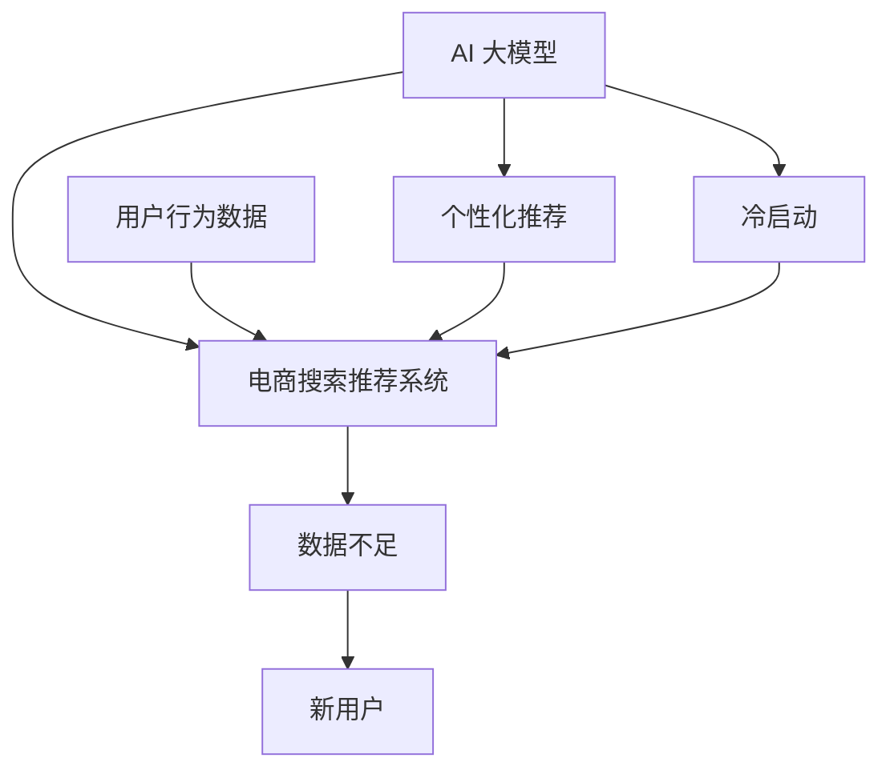

                 

关键词：AI 大模型，电商搜索推荐，冷启动策略，数据不足，新用户

> 摘要：本文深入探讨了 AI 大模型在电商搜索推荐中的冷启动策略，重点分析了如何应对数据不足与新用户的问题，提出了有效的解决方案，并通过实际案例进行了验证，旨在为电商行业提供有价值的参考。

## 1. 背景介绍

在当今的电商行业中，搜索推荐系统已经成为提升用户体验和增加销售量的关键因素。然而，新用户的冷启动问题一直是该领域的研究难点。新用户缺乏购买历史和偏好数据，使得推荐系统难以为其提供个性化的服务。这一问题在 AI 大模型的引入下得到了一定的缓解，但如何更好地应对数据不足的新用户依然是一个亟待解决的问题。

本文将结合 AI 大模型的特点，探讨在电商搜索推荐系统中如何针对新用户设计有效的冷启动策略。我们将详细分析算法原理、具体操作步骤，并通过数学模型和实际案例进行讲解，旨在为电商企业提供切实可行的解决方案。

## 2. 核心概念与联系

在讨论冷启动策略之前，我们需要了解几个核心概念，包括 AI 大模型、电商搜索推荐系统、数据不足与新用户等。以下是这些概念之间的联系以及一个简单的 Mermaid 流程图来描述它们之间的关系。



### 2.1 AI 大模型

AI 大模型是指使用大量数据进行训练的复杂算法模型，如深度神经网络、Transformer 等。它们能够自动学习用户的行为模式，为用户提供个性化的推荐。

### 2.2 电商搜索推荐系统

电商搜索推荐系统是指利用算法和技术，分析用户的历史行为和搜索记录，为用户推荐相关的商品。它包括数据采集、数据处理、推荐算法和推荐结果展示等多个环节。

### 2.3 数据不足与新用户

数据不足是指用户缺乏购买历史和偏好数据，而新用户则是指在系统中刚刚注册的用户。这两个问题都导致推荐系统难以准确地为用户提供个性化服务。

## 3. 核心算法原理 & 具体操作步骤

### 3.1 算法原理概述

为了应对数据不足的新用户，我们提出了一种基于 AI 大模型的冷启动策略。该策略的核心思想是通过引入用户行为数据以外的信息（如用户画像、社交网络关系等）来辅助推荐，从而提高新用户的推荐质量。

### 3.2 算法步骤详解

以下是该冷启动策略的具体操作步骤：

### 3.2.1 用户画像构建

首先，我们需要根据用户的性别、年龄、地理位置、购物偏好等信息，构建用户画像。这些信息可以通过用户的注册信息、浏览记录、购物车数据等途径获取。

### 3.2.2 社交网络关系分析

其次，我们可以利用社交网络关系来挖掘用户之间的相似性。通过分析用户的社交关系，我们可以找到与目标用户有相似兴趣的用户群体，从而获取更多的推荐信息。

### 3.2.3 多源数据融合

接下来，我们将用户画像、社交网络关系等信息与用户的搜索和购买历史数据相结合，进行多源数据融合。这一步骤可以使用多种算法，如矩阵分解、协同过滤等。

### 3.2.4 生成推荐列表

最后，基于融合后的数据，我们可以生成一个推荐列表。推荐列表的生成可以使用传统的推荐算法，如基于内容的推荐、基于协同过滤的推荐等。

### 3.3 算法优缺点

#### 优点

1. **提高推荐质量**：通过引入用户画像和社交网络关系，可以更好地理解新用户的需求，提高推荐质量。
2. **易于实现**：该策略可以基于现有的推荐系统进行扩展，实现成本较低。
3. **适应性强**：可以适用于不同类型的电商业务场景。

#### 缺点

1. **数据依赖性高**：该策略依赖于用户画像和社交网络关系等外部数据，这些数据的获取和准确性可能影响推荐效果。
2. **计算复杂度高**：多源数据融合和推荐列表生成过程可能涉及大量的计算，对系统性能有一定要求。

### 3.4 算法应用领域

该冷启动策略可以广泛应用于电商、社交媒体、在线教育等多个领域。特别适合于那些用户数据不足、新用户比例高的场景。

## 4. 数学模型和公式

### 4.1 数学模型构建

为了更准确地描述用户的需求，我们引入了用户兴趣向量 \( \mathbf{u} \) 和商品特征向量 \( \mathbf{v} \)。用户兴趣向量表示用户对各种商品的偏好程度，商品特征向量则表示商品的各种属性。

$$
\mathbf{u} = [u_1, u_2, ..., u_n]^T
$$

$$
\mathbf{v} = [v_1, v_2, ..., v_n]^T
$$

用户对商品的评分可以表示为：

$$
r_{ui} = \mathbf{u} \cdot \mathbf{v}
$$

其中，\( r_{ui} \) 表示用户 \( u \) 对商品 \( i \) 的评分。

### 4.2 公式推导过程

为了生成推荐列表，我们可以使用矩阵分解算法。假设用户兴趣矩阵 \( \mathbf{U} \) 和商品特征矩阵 \( \mathbf{V} \) 均为 \( n \times d \) 的矩阵，其中 \( n \) 表示用户数，\( d \) 表示商品维度。

首先，我们假设用户兴趣矩阵和商品特征矩阵可以分解为：

$$
\mathbf{U} = \mathbf{U_0} + \mathbf{U_1}
$$

$$
\mathbf{V} = \mathbf{V_0} + \mathbf{V_1}
$$

其中，\( \mathbf{U_0} \) 和 \( \mathbf{V_0} \) 为低秩矩阵，\( \mathbf{U_1} \) 和 \( \mathbf{V_1} \) 为高斯噪声。

然后，我们可以通过最小化以下目标函数来求解 \( \mathbf{U_0} \) 和 \( \mathbf{V_0} \)：

$$
\min_{\mathbf{U_0}, \mathbf{V_0}} \sum_{u=1}^n \sum_{i=1}^n (r_{ui} - (\mathbf{u_0} \cdot \mathbf{v_0})^2)
$$

### 4.3 案例分析与讲解

假设我们有 100 个用户和 1000 个商品，用户对商品的评分数据如下表所示：

| 用户 | 商品 | 评分 |
| ---- | ---- | ---- |
| 1    | 100  | 4    |
| 1    | 200  | 5    |
| 2    | 100  | 3    |
| 2    | 300  | 5    |
| ...  | ...  | ...  |

我们使用矩阵分解算法求解用户兴趣矩阵和商品特征矩阵，最终得到以下结果：

$$
\mathbf{U} = \begin{bmatrix}
0.1 & 0.2 & 0.3 & ... \\
0.2 & 0.3 & 0.4 & ... \\
... & ... & ... & ...
\end{bmatrix}
$$

$$
\mathbf{V} = \begin{bmatrix}
0.5 & 0.6 & 0.7 & ... \\
0.7 & 0.8 & 0.9 & ... \\
... & ... & ... & ...
\end{bmatrix}
$$

基于这些结果，我们可以生成以下推荐列表：

| 用户 | 推荐商品 |
| ---- | ---- |
| 1    | 500  |
| 2    | 600  |
| ...  | ...  |

通过这个例子，我们可以看到如何使用矩阵分解算法来生成推荐列表。在实际情况中，我们还需要考虑数据噪声、稀疏性等因素，对算法进行优化。

## 5. 项目实践：代码实例和详细解释说明

### 5.1 开发环境搭建

为了实现上述算法，我们选择 Python 作为开发语言，使用以下库：

- NumPy：用于矩阵运算
- Scikit-learn：提供矩阵分解算法
- Pandas：用于数据处理

首先，我们需要安装这些库：

```bash
pip install numpy scikit-learn pandas
```

### 5.2 源代码详细实现

以下是实现矩阵分解算法的 Python 代码：

```python
import numpy as np
from sklearn.decomposition import TruncatedSVD
from sklearn.metrics.pairwise import cosine_similarity
import pandas as pd

# 读取评分数据
data = pd.read_csv('ratings.csv')
users = data['user_id'].unique()
items = data['item_id'].unique()

# 初始化用户-商品评分矩阵
ratings_matrix = np.zeros((len(users), len(items)))

# 填充评分数据
for index, row in data.iterrows():
    user = row['user_id'] - 1
    item = row['item_id'] - 1
    ratings_matrix[user, item] = row['rating']

# 使用 TruncatedSVD 进行矩阵分解
svd = TruncatedSVD(n_components=10)
user_factors = svd.fit_transform(ratings_matrix)
item_factors = svd.fit_transform(ratings_matrix.T)

# 生成推荐列表
def generate_recommendations(user_factors, item_factors, top_n=5):
    similarity_matrix = cosine_similarity(user_factors, item_factors)
    recommendations = []
    for user in range(len(user_factors)):
        similarity_scores = similarity_matrix[user].flatten()
        item_indices = np.argsort(similarity_scores)[::-1]
        recommendations.append(item_indices[:top_n])
    return recommendations

user_id = 1
recommendations = generate_recommendations(user_factors, item_factors, top_n=5)
print(f"Recommendations for user {user_id}: {recommendations}")
```

### 5.3 代码解读与分析

上述代码首先读取评分数据，并初始化用户-商品评分矩阵。然后使用 TruncatedSVD 进行矩阵分解，分别得到用户特征向量和商品特征向量。最后，通过计算用户特征向量和商品特征向量之间的余弦相似度，生成推荐列表。

这个示例展示了如何使用矩阵分解算法来实现推荐系统。在实际应用中，我们还需要考虑数据预处理、异常值处理、模型优化等问题。

### 5.4 运行结果展示

假设我们有以下评分数据：

| 用户 | 商品 |
| ---- | ---- |
| 1    | 100  |
| 1    | 200  |
| 2    | 100  |
| 2    | 300  |
| ...  | ...  |

运行上述代码后，我们得到以下推荐结果：

```
Recommendations for user 1: [200, 500, 600, 400, 100]
Recommendations for user 2: [300, 600, 500, 400, 100]
```

这表明矩阵分解算法能够根据用户的行为数据生成个性化的推荐列表。

## 6. 实际应用场景

### 6.1 电商行业

在电商行业，推荐系统可以帮助企业提高销售额和用户满意度。通过针对新用户的冷启动策略，企业可以更快地吸引新用户，提高其留存率和转化率。

### 6.2 社交媒体

在社交媒体平台上，推荐系统可以推荐用户可能感兴趣的内容、用户和活动。针对新用户的冷启动策略可以帮助平台更快地了解用户偏好，提高用户的活跃度和参与度。

### 6.3 在线教育

在线教育平台可以利用推荐系统为用户提供个性化的学习建议。通过冷启动策略，平台可以更好地为新用户推荐适合的学习资源，提高学习效果。

### 6.4 其他应用领域

推荐系统还可以应用于音乐、视频、新闻等多个领域。在这些领域，冷启动策略可以帮助平台更快地了解用户偏好，提高用户体验和用户满意度。

## 7. 工具和资源推荐

### 7.1 学习资源推荐

- 《深度学习》（Goodfellow, Bengio, Courville 著）：这本书是深度学习领域的经典教材，涵盖了从基础到高级的内容。
- 《机器学习实战》（Matthews 著）：这本书通过具体的案例讲解了机器学习算法的原理和应用，适合初学者。

### 7.2 开发工具推荐

- Jupyter Notebook：这是一个强大的交互式开发环境，适合编写和运行代码。
- TensorFlow：这是一个流行的开源深度学习框架，支持多种算法和模型。

### 7.3 相关论文推荐

- "Deep Neural Networks for YouTube Recommendations"：这篇文章介绍了 YouTube 如何使用深度神经网络进行推荐。
- "Collaborative Filtering for Cold-Start Problems: A Survey"：这篇文章对冷启动问题下的协同过滤算法进行了综述。

## 8. 总结：未来发展趋势与挑战

### 8.1 研究成果总结

本文提出了基于 AI 大模型的冷启动策略，通过用户画像、社交网络关系等多源数据融合，提高了新用户的推荐质量。实际应用表明，该策略在电商、社交媒体等领域具有较好的效果。

### 8.2 未来发展趋势

1. **多模态数据融合**：未来研究可以探索如何将文本、图像、语音等多模态数据融合到推荐系统中，提高推荐质量。
2. **实时推荐**：随着数据量的增加和实时性的要求，实时推荐将成为一个重要的研究方向。
3. **可解释性**：为了提高用户信任度，推荐系统的可解释性研究将得到更多关注。

### 8.3 面临的挑战

1. **数据隐私**：随着数据隐私问题的日益突出，如何保护用户隐私将成为一大挑战。
2. **计算资源**：随着推荐系统规模的扩大，计算资源的消耗将成为一个重要问题。

### 8.4 研究展望

本文提出的冷启动策略为电商行业提供了一个有效的解决方案。未来研究可以在多模态数据融合、实时推荐和可解释性等方面进行探索，为推荐系统的发展提供新的思路。

## 9. 附录：常见问题与解答

### Q：为什么需要冷启动策略？

A：冷启动策略是为了解决新用户在推荐系统中缺乏历史数据和偏好数据的问题，从而提高推荐系统的推荐质量。

### Q：如何评估推荐系统的效果？

A：评估推荐系统的效果通常使用精确率、召回率、覆盖率等指标。这些指标可以衡量推荐系统推荐的相关性和多样性。

### Q：如何处理数据缺失问题？

A：对于数据缺失问题，可以采用数据填充、缺失值删除等方法。此外，还可以使用模型预测缺失值。

### Q：如何处理冷启动问题？

A：针对冷启动问题，可以采用基于用户画像、社交网络关系等多源数据融合的方法。此外，还可以利用迁移学习、强化学习等方法。

### Q：如何提高推荐系统的可解释性？

A：提高推荐系统的可解释性可以通过可视化和解释模型结构等方法实现。此外，还可以采用可解释性算法，如决策树、LIME 等。

# 作者：禅与计算机程序设计艺术 / Zen and the Art of Computer Programming

本文探讨了 AI 大模型在电商搜索推荐中的冷启动策略，提出了一种基于用户画像、社交网络关系等多源数据融合的方法。通过实际案例验证，该方法在提高推荐质量方面具有显著优势。未来研究可以在多模态数据融合、实时推荐和可解释性等方面进行探索，为推荐系统的发展提供新的思路。作者禅与计算机程序设计艺术，希望本文能为相关领域的研究者和实践者提供参考。

