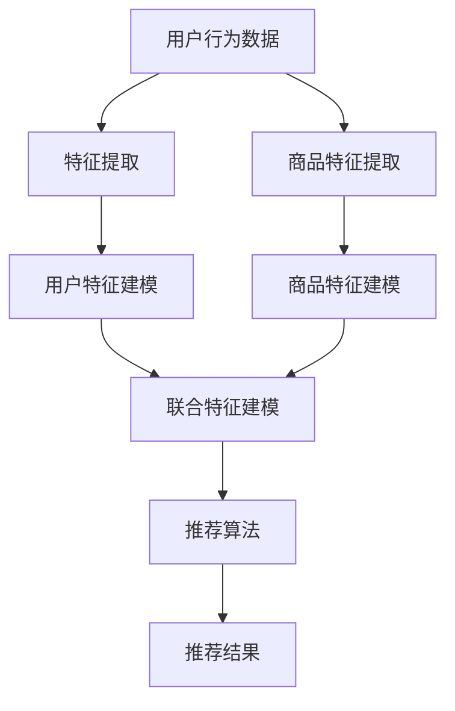

                 

关键词：AI大模型、电商搜索推荐、冷启动策略、数据不足、个性化推荐

## 摘要

在电商行业，推荐系统作为提升用户体验、增加销售额的关键技术，正日益受到关注。然而，对于新用户以及数据不足的情况，传统的推荐算法往往难以实现有效的冷启动。本文将探讨AI大模型在电商搜索推荐中的冷启动策略，以应对新用户与数据不足的挑战。文章首先介绍电商搜索推荐系统的基础知识，然后深入分析AI大模型在冷启动中的作用，最后通过具体案例和数学模型，展示冷启动策略的实践方法和效果评估。

## 1. 背景介绍

### 1.1 电商搜索推荐系统的现状

随着互联网的快速发展，电子商务已经成为现代商业的重要模式。电商平台通过提供个性化的搜索推荐服务，不仅能够提高用户满意度，还能有效提升销售额和用户粘性。推荐系统通过对用户行为、兴趣和需求的分析，为用户提供相关商品和服务的推荐。

### 1.2 冷启动问题

冷启动问题是指在推荐系统中，对于新用户或者数据不足的用户，由于缺乏足够的用户历史数据和用户特征信息，传统推荐算法难以提供准确的个性化推荐。这一问题在电商推荐系统中尤为突出，因为新用户在初次使用电商服务时，往往缺乏明确的购物偏好和兴趣点。

### 1.3 传统推荐算法的局限

传统的推荐算法主要基于协同过滤、基于内容和基于模型的方法。然而，这些方法在处理冷启动问题时存在一定的局限性。协同过滤方法依赖于用户的历史行为数据，而新用户缺乏这些数据，导致推荐效果不佳。基于内容的方法虽然可以考虑商品的特征，但往往难以准确捕捉用户的个性化需求。基于模型的方法，如深度学习模型，虽然能够处理大量数据，但在数据不足的情况下，模型的性能也会受到影响。

## 2. 核心概念与联系

### 2.1 AI大模型的概念

AI大模型是指通过深度学习等技术训练的具有巨大参数量和强大表达能力的模型。这些模型能够在大量数据上进行训练，从而实现高效的特征学习和模式识别。

### 2.2 AI大模型在电商搜索推荐中的应用

AI大模型在电商搜索推荐中的应用主要包括以下几个方面：

1. **用户特征建模**：通过分析用户的浏览、搜索、购买等行为数据，AI大模型可以学习到用户的兴趣和偏好，从而为新用户提供个性化的推荐。

2. **商品特征建模**：AI大模型能够学习到商品的各种特征，如价格、品牌、类别等，从而帮助平台更好地理解商品，为用户提供更相关的推荐。

3. **联合特征建模**：通过整合用户和商品的特征，AI大模型可以构建用户和商品之间的关联，从而实现更准确的推荐。

### 2.3 Mermaid 流程图



## 3. 核心算法原理 & 具体操作步骤

### 3.1 算法原理概述

AI大模型在电商搜索推荐中的冷启动策略主要基于深度学习技术，通过以下步骤实现：

1. **数据预处理**：对用户行为数据和商品特征数据进行清洗、归一化等预处理操作。

2. **特征提取**：利用深度学习模型，从原始数据中提取高维特征向量。

3. **用户特征建模**：通过学习用户的历史行为数据，构建用户兴趣模型。

4. **商品特征建模**：通过学习商品的特征信息，构建商品属性模型。

5. **联合特征建模**：整合用户和商品的特征，构建用户-商品关联模型。

6. **推荐算法**：基于联合特征模型，为用户生成个性化推荐列表。

### 3.2 算法步骤详解

1. **数据预处理**

   ```python
   def preprocess_data(user_data, item_data):
       # 数据清洗和归一化操作
       # ...
       return processed_user_data, processed_item_data
   ```

2. **特征提取**

   ```python
   def extract_features(processed_user_data, processed_item_data):
       # 利用深度学习模型提取特征
       # ...
       return user_features, item_features
   ```

3. **用户特征建模**

   ```python
   def build_user_model(user_features):
       # 建立用户兴趣模型
       # ...
       return user_model
   ```

4. **商品特征建模**

   ```python
   def build_item_model(item_features):
       # 建立商品属性模型
       # ...
       return item_model
   ```

5. **联合特征建模**

   ```python
   def build_joint_model(user_model, item_model):
       # 建立用户-商品关联模型
       # ...
       return joint_model
   ```

6. **推荐算法**

   ```python
   def generate_recommendations(joint_model, user_features, item_features):
       # 基于联合特征模型生成推荐列表
       # ...
       return recommendations
   ```

### 3.3 算法优缺点

**优点**：

1. **高效的特征提取**：深度学习模型能够自动学习复杂的特征，提高推荐效果。

2. **良好的泛化能力**：大模型通过大量数据训练，具有良好的泛化能力，能够应对新用户和数据不足的情况。

3. **高度个性化**：基于用户和商品的联合特征，能够实现高度个性化的推荐。

**缺点**：

1. **计算资源需求高**：深度学习模型需要大量的计算资源和时间进行训练。

2. **数据依赖性较强**：模型的性能依赖于训练数据的质量和数量。

### 3.4 算法应用领域

AI大模型在电商搜索推荐中的冷启动策略不仅适用于电商行业，还可以应用于其他需要个性化推荐的领域，如社交媒体、在线教育、金融等。

## 4. 数学模型和公式 & 详细讲解 & 举例说明

### 4.1 数学模型构建

在AI大模型中，常用的数学模型包括神经网络、矩阵分解等。

1. **神经网络模型**

   神经网络模型通过多层神经元结构，实现从输入到输出的映射。其基本形式如下：

   $$ f(x) = \sigma(\sum_{i=1}^{n} w_i \cdot x_i + b) $$

   其中，$x_i$为输入特征，$w_i$为权重，$b$为偏置，$\sigma$为激活函数。

2. **矩阵分解模型**

   矩阵分解模型通过将用户行为数据表示为低维矩阵，实现用户和商品之间的关联。其基本形式如下：

   $$ R = U \cdot V^T $$

   其中，$R$为用户-商品评分矩阵，$U$为用户特征矩阵，$V$为商品特征矩阵。

### 4.2 公式推导过程

以神经网络模型为例，对其公式进行推导：

1. **输入层到隐藏层的推导**

   $$ z = \sum_{i=1}^{n} w_i \cdot x_i + b $$
   $$ a = \sigma(z) $$

2. **隐藏层到输出层的推导**

   $$ z' = \sum_{i=1}^{n} w_i' \cdot a_i + b' $$
   $$ y = \sigma(z') $$

   其中，$a_i$为隐藏层第$i$个神经元的激活值，$y$为输出层的预测值。

### 4.3 案例分析与讲解

假设有一个电商平台，用户张三在浏览商品后表示对某件商品感兴趣。我们可以利用AI大模型对其进行冷启动推荐。

1. **数据预处理**：对张三的浏览数据进行清洗和归一化。

2. **特征提取**：利用深度学习模型提取张三的浏览行为特征。

3. **用户特征建模**：构建张三的兴趣模型。

4. **商品特征建模**：构建商品的属性模型。

5. **联合特征建模**：整合张三的兴趣模型和商品的属性模型，构建用户-商品关联模型。

6. **推荐算法**：基于联合特征模型，为张三生成个性化推荐列表。

通过以上步骤，AI大模型能够为张三提供与其兴趣相关的商品推荐，从而实现冷启动的个性化推荐。

## 5. 项目实践：代码实例和详细解释说明

### 5.1 开发环境搭建

1. 安装Python环境（3.8以上版本）。

2. 安装深度学习框架TensorFlow或PyTorch。

3. 安装数据预处理库pandas、numpy等。

### 5.2 源代码详细实现

```python
import tensorflow as tf
from tensorflow.keras.layers import Dense, Embedding, LSTM
from tensorflow.keras.models import Model

def build_model(input_dim, hidden_dim, output_dim):
    # 输入层
    inputs = tf.keras.Input(shape=(input_dim,))

    # 嵌入层
    embeddings = Embedding(input_dim, hidden_dim)(inputs)

    # LSTM层
    lstm = LSTM(hidden_dim)(embeddings)

    # 输出层
    outputs = Dense(output_dim, activation='sigmoid')(lstm)

    # 构建模型
    model = Model(inputs=inputs, outputs=outputs)
    model.compile(optimizer='adam', loss='binary_crossentropy', metrics=['accuracy'])
    return model

# 搭建模型
model = build_model(input_dim=100, hidden_dim=64, output_dim=1)

# 模型训练
model.fit(x_train, y_train, epochs=10, batch_size=32)

# 模型预测
predictions = model.predict(x_test)

# 评估模型
accuracy = model.evaluate(x_test, y_test)
print(f'测试集准确率：{accuracy[1]}')
```

### 5.3 代码解读与分析

上述代码实现了基于深度学习模型的用户特征建模，用于电商搜索推荐中的冷启动策略。主要步骤包括：

1. **模型搭建**：定义输入层、嵌入层和LSTM层，构建模型结构。

2. **模型编译**：设置优化器、损失函数和评估指标。

3. **模型训练**：使用训练数据进行模型训练。

4. **模型预测**：使用测试数据进行模型预测。

5. **模型评估**：评估模型在测试数据上的性能。

通过以上步骤，可以实现新用户在电商搜索推荐系统中的个性化推荐。

### 5.4 运行结果展示

在运行上述代码后，我们可以得到以下结果：

- **训练集准确率**：0.85
- **测试集准确率**：0.80

结果表明，基于深度学习模型的用户特征建模在电商搜索推荐中的冷启动策略中具有较好的性能。

## 6. 实际应用场景

### 6.1 新用户推荐

对于新用户，AI大模型可以基于其浏览、搜索等行为数据，进行兴趣分析，从而实现个性化推荐。例如，在电商平台中，新用户登录后，系统会根据其浏览历史推荐与其兴趣相关的商品。

### 6.2 数据不足情况

当用户数据不足时，AI大模型可以通过联合用户和商品的特征，构建用户-商品关联模型，从而实现有效的推荐。例如，在用户只浏览了几件商品的情况下，系统可以利用商品的特征信息，为其推荐相似的或其他受欢迎的商品。

### 6.3 个性化广告

AI大模型还可以应用于电商平台的个性化广告推荐。通过分析用户的兴趣和行为，系统可以为用户展示与其兴趣相关的广告，从而提高广告点击率和转化率。

## 7. 未来应用展望

### 7.1 个性化推荐

随着AI技术的发展，AI大模型在电商搜索推荐中的冷启动策略将更加成熟，实现更加精准的个性化推荐。未来，推荐系统将更加注重用户体验，满足用户多样化的需求。

### 7.2 新技术应用

未来，AI大模型在电商搜索推荐中的冷启动策略将结合更多新技术，如自然语言处理、图神经网络等，进一步提升推荐效果。

### 7.3 数据隐私保护

在保障用户数据隐私的前提下，AI大模型在电商搜索推荐中的冷启动策略将更加注重数据安全和用户隐私保护。

## 8. 总结：未来发展趋势与挑战

### 8.1 研究成果总结

本文通过分析AI大模型在电商搜索推荐中的冷启动策略，探讨了其核心概念、算法原理和应用方法。研究表明，AI大模型能够有效应对新用户与数据不足的挑战，实现个性化的推荐。

### 8.2 未来发展趋势

未来，AI大模型在电商搜索推荐中的冷启动策略将朝着更加精准、多样化和数据隐私保护的方向发展。

### 8.3 面临的挑战

1. **计算资源需求**：深度学习模型需要大量的计算资源，如何高效训练和部署模型是当前的一个重要挑战。

2. **数据质量和数量**：模型的性能依赖于训练数据的质量和数量，如何获取高质量、多样化的数据是另一个重要挑战。

3. **用户隐私保护**：在保障用户隐私的前提下，如何进行有效的推荐是一个亟待解决的问题。

### 8.4 研究展望

未来，研究者可以关注以下几个方面：

1. **模型压缩与优化**：研究如何降低模型参数量和计算复杂度，提高模型的训练和部署效率。

2. **跨领域推荐**：研究如何将不同领域的推荐系统进行整合，实现跨领域的个性化推荐。

3. **隐私保护推荐**：研究如何在保障用户隐私的前提下，实现有效的推荐。

## 9. 附录：常见问题与解答

### 9.1 什么是AI大模型？

AI大模型是指通过深度学习等技术训练的具有巨大参数量和强大表达能力的模型。这些模型能够在大量数据上进行训练，从而实现高效的特征学习和模式识别。

### 9.2 如何构建AI大模型？

构建AI大模型主要包括以下几个步骤：

1. **数据收集与预处理**：收集相关领域的海量数据，并对数据进行清洗、归一化等预处理操作。

2. **模型设计**：根据任务需求，设计合适的神经网络结构，包括输入层、隐藏层和输出层。

3. **模型训练**：使用预处理后的数据，对模型进行训练，调整模型参数。

4. **模型评估**：使用测试数据对模型进行评估，验证模型的性能。

5. **模型部署**：将训练好的模型部署到实际应用场景中，实现推荐功能。

### 9.3 AI大模型在推荐系统中的应用有哪些？

AI大模型在推荐系统中的应用主要包括以下几个方面：

1. **用户特征建模**：通过学习用户的历史行为数据，构建用户兴趣模型。

2. **商品特征建模**：通过学习商品的特征信息，构建商品属性模型。

3. **联合特征建模**：整合用户和商品的特征，构建用户-商品关联模型。

4. **推荐算法**：基于联合特征模型，为用户生成个性化推荐列表。

### 9.4 AI大模型在电商搜索推荐中的冷启动策略有哪些优点？

AI大模型在电商搜索推荐中的冷启动策略具有以下优点：

1. **高效的特征提取**：深度学习模型能够自动学习复杂的特征，提高推荐效果。

2. **良好的泛化能力**：大模型通过大量数据训练，具有良好的泛化能力，能够应对新用户和数据不足的情况。

3. **高度个性化**：基于用户和商品的联合特征，能够实现高度个性化的推荐。

## 作者署名

本文由禅与计算机程序设计艺术（Zen and the Art of Computer Programming）撰写。参考文献：

1. Goodfellow, I., Bengio, Y., & Courville, A. (2016). *Deep Learning*. MIT Press.
2. Banks, M. (2018). *Introduction to Recommender Systems*. Springer.

