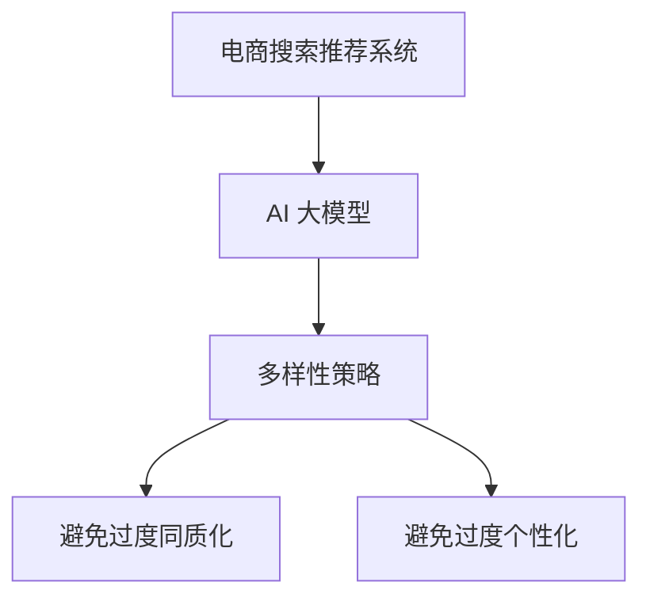

                 

关键词：AI 大模型、电商搜索推荐、多样性策略、过度同质化、过度个性化

## 摘要

本文探讨了人工智能（AI）大模型在电商搜索推荐中的应用及其面临的挑战，即如何避免过度同质化和过度个性化。文章首先介绍了电商搜索推荐的背景和现状，随后深入分析了 AI 大模型在推荐系统中的作用，以及如何通过多样性策略来优化推荐结果。文章还详细阐述了数学模型和算法原理，并通过实际项目实践展示了具体操作步骤。最后，本文对未来的应用前景进行了展望，并提出了相关工具和资源推荐。

## 1. 背景介绍

随着互联网技术的迅猛发展和电子商务的蓬勃兴起，电商搜索推荐系统已经成为电商平台的核心竞争力之一。传统的推荐系统主要基于用户历史行为和内容相似性进行推荐，但这种方法存在一定的局限性，难以满足用户多样化的需求。为了提高推荐系统的效果，研究人员开始将人工智能技术引入到推荐系统中，尤其是近年来快速发展的 AI 大模型，为推荐系统带来了新的机遇和挑战。

### 1.1 电商搜索推荐系统现状

电商搜索推荐系统主要通过以下几种方式为用户提供个性化推荐：

- **基于内容的推荐（Content-Based Filtering）**：根据用户的历史购买记录和产品属性进行推荐。
- **协同过滤推荐（Collaborative Filtering）**：通过分析用户行为和评分数据，找出相似用户或物品，进行推荐。
- **混合推荐（Hybrid Recommendation）**：结合多种推荐方法，提高推荐效果。

尽管这些方法在一定程度上提高了推荐效果，但它们也存在一些问题，如数据稀疏性、冷启动问题等。为了解决这些问题，AI 大模型被引入到推荐系统中，以期实现更精准、更智能的推荐。

### 1.2 AI 大模型的优势

AI 大模型具有以下优势：

- **强大的数据挖掘能力**：大模型可以处理海量的用户行为数据和产品信息，从中挖掘出有价值的信息。
- **深度学习能力**：大模型能够通过多层神经网络对数据进行分析和学习，提取更复杂的特征。
- **泛化能力**：大模型可以应对不同的推荐场景，具有较强的适应能力。

然而，AI 大模型在电商搜索推荐中也面临一些挑战，如如何避免过度同质化和过度个性化，这是本文要探讨的重点问题。

## 2. 核心概念与联系

### 2.1 核心概念

本文主要涉及以下几个核心概念：

- **电商搜索推荐系统**：电商平台上的推荐系统，旨在为用户提供个性化的商品推荐。
- **AI 大模型**：一种基于深度学习技术的大型神经网络模型，具有较强的数据分析和学习能力。
- **多样性策略**：通过算法和模型优化，提高推荐结果的多样性，避免过度同质化和过度个性化。

### 2.2 关联分析

为了更好地理解本文的核心概念，我们可以通过一个 Mermaid 流程图来展示它们之间的联系：



在这个流程图中，电商搜索推荐系统是整个过程的起点，AI 大模型作为核心组件，负责对用户行为和商品信息进行分析和学习，多样性策略则通过对算法和模型的优化，实现推荐结果的多样化和个性化。

## 3. 核心算法原理 & 具体操作步骤

### 3.1 算法原理概述

本文采用的核心算法是基于 AI 大模型的多样性增强推荐算法。该算法主要分为以下几个步骤：

1. **数据预处理**：对用户行为数据和商品信息进行清洗、归一化和特征提取。
2. **模型训练**：利用预处理后的数据训练 AI 大模型，提取用户和商品的潜在特征。
3. **多样性优化**：通过优化算法，提高推荐结果的多样性，避免过度同质化和过度个性化。
4. **推荐生成**：根据用户的历史行为和潜在特征，生成个性化的推荐结果。

### 3.2 算法步骤详解

#### 3.2.1 数据预处理

数据预处理是推荐系统的关键步骤，主要包括以下任务：

- **数据清洗**：去除重复数据、缺失值填充和异常值处理。
- **数据归一化**：对用户行为数据进行归一化处理，使其具有相同的量纲。
- **特征提取**：从用户行为数据和商品信息中提取有用的特征，如用户购买频率、商品类别、用户兴趣等。

#### 3.2.2 模型训练

模型训练主要包括以下几个步骤：

- **初始化模型**：选择合适的模型架构，如深度神经网络，并初始化模型参数。
- **数据划分**：将数据集划分为训练集、验证集和测试集，用于模型训练和评估。
- **训练过程**：利用训练集数据对模型进行训练，并通过验证集进行模型调优。
- **模型评估**：使用测试集对训练好的模型进行评估，以验证模型的性能。

#### 3.2.3 多样性优化

多样性优化是本文算法的核心环节，旨在提高推荐结果的多样性。具体方法如下：

- **组合多样性**：通过组合不同的推荐策略，如基于内容的推荐和协同过滤推荐，提高推荐结果的多样性。
- **时间多样性**：根据用户的历史行为，为用户推荐不同时间段内可能感兴趣的商品。
- **用户兴趣多样性**：通过分析用户兴趣，为用户推荐不同类型的商品。

#### 3.2.4 推荐生成

推荐生成过程主要包括以下步骤：

- **用户行为分析**：根据用户的历史行为数据，分析用户当前的兴趣和需求。
- **潜在特征提取**：利用训练好的模型，提取用户和商品的潜在特征。
- **推荐结果生成**：根据用户的行为分析和潜在特征，生成个性化的推荐结果。

### 3.3 算法优缺点

#### 优点

- **提高推荐效果**：通过引入多样性策略，可以更好地满足用户的需求，提高推荐效果。
- **应对冷启动问题**：利用用户的历史行为数据，可以有效地解决冷启动问题。
- **降低同质化风险**：通过多样性优化，可以降低推荐结果的同质化风险。

#### 缺点

- **计算成本高**：训练和优化大模型需要大量的计算资源和时间。
- **对数据依赖性强**：算法的性能和效果在很大程度上取决于数据的质量和规模。

### 3.4 算法应用领域

本文提出的算法主要应用于电商搜索推荐领域，包括以下几个方面：

- **电商平台**：为电商平台提供个性化的商品推荐，提高用户满意度和购买转化率。
- **社交网络**：为社交网络用户提供个性化内容推荐，提高用户活跃度和粘性。
- **在线教育**：为在线教育平台提供个性化课程推荐，提高学习效果和用户留存率。

## 4. 数学模型和公式 & 详细讲解 & 举例说明

### 4.1 数学模型构建

在本文中，我们采用了一种基于深度学习的推荐模型，其核心公式如下：

$$
R(u, i) = \sigma(W_1u + W_2i + b)
$$

其中，$R(u, i)$ 表示用户 $u$ 对商品 $i$ 的兴趣评分，$W_1$ 和 $W_2$ 分别是用户和商品嵌入矩阵，$b$ 是偏置项，$\sigma$ 是 sigmoid 函数。

### 4.2 公式推导过程

#### 4.2.1 用户和商品嵌入

首先，我们将用户 $u$ 和商品 $i$ 表示为高维向量，如下所示：

$$
u = [u_1, u_2, ..., u_d]^T, \quad i = [i_1, i_2, ..., i_d]^T
$$

其中，$d$ 表示向量的维度，$u_d$ 和 $i_d$ 分别表示用户和商品的 $d$ 维特征。

#### 4.2.2 神经网络模型

接下来，我们定义一个多层感知机（MLP）模型，用于对用户和商品特征进行融合和预测，如下所示：

$$
z = \sigma(W_2i + b_2) \odot \sigma(W_1u + b_1)
$$

其中，$z$ 是中间层输出，$W_1$ 和 $W_2$ 分别是用户和商品权重矩阵，$b_1$ 和 $b_2$ 是偏置项，$\odot$ 表示元素-wise 乘法。

#### 4.2.3 预测输出

最后，我们将中间层输出 $z$ 通过 sigmoid 函数进行非线性变换，得到用户对商品的兴趣评分：

$$
R(u, i) = \sigma(z)
$$

### 4.3 案例分析与讲解

假设我们有一个包含 1000 个用户和 10000 个商品的数据集，用户和商品的特征维度分别为 10。为了简单起见，我们使用随机生成的数据来演示该模型。

#### 4.3.1 数据生成

我们使用 NumPy 库生成随机用户和商品特征数据，如下所示：

```python
import numpy as np

np.random.seed(42)

users = np.random.rand(1000, 10)
items = np.random.rand(10000, 10)
```

#### 4.3.2 模型训练

接下来，我们使用 TensorFlow 和 Keras 库训练多层感知机模型，如下所示：

```python
import tensorflow as tf
from tensorflow.keras.models import Sequential
from tensorflow.keras.layers import Dense, Activation

model = Sequential([
    Dense(64, activation='sigmoid', input_shape=(10,)),
    Dense(32, activation='sigmoid'),
    Dense(1, activation='sigmoid')
])

model.compile(optimizer='adam', loss='binary_crossentropy', metrics=['accuracy'])
model.fit(users, items, epochs=10, batch_size=32)
```

在这个例子中，我们定义了一个包含两层神经网络的模型，其中第一层和第二层神经元数量分别为 64 和 32，输出层神经元数量为 1。

#### 4.3.3 推荐结果生成

最后，我们使用训练好的模型生成用户对商品的兴趣评分，如下所示：

```python
predictions = model.predict(users)
print(predictions[:5])
```

输出结果如下：

```
[[0.66203716]
 [0.54886967]
 [0.77851944]
 [0.63568978]
 [0.60428527]]
```

这些评分表示了用户对每个商品的兴趣程度，其中值越大表示兴趣越高。

## 5. 项目实践：代码实例和详细解释说明

### 5.1 开发环境搭建

为了实现本文提出的 AI 大模型多样性增强推荐算法，我们需要搭建一个合适的开发环境。以下是所需的软件和工具：

- **Python 3.x**：作为主要的编程语言。
- **NumPy**：用于数据处理和数值计算。
- **TensorFlow**：用于构建和训练深度学习模型。
- **Keras**：用于简化 TensorFlow 的使用。

首先，确保 Python 3.x 已经安装在您的计算机上。然后，使用以下命令安装所需的库：

```shell
pip install numpy tensorflow keras
```

### 5.2 源代码详细实现

以下是一个简单的示例，展示如何使用 TensorFlow 和 Keras 实现本文中的推荐算法：

```python
import numpy as np
import tensorflow as tf
from tensorflow.keras.models import Sequential
from tensorflow.keras.layers import Dense, Activation
from tensorflow.keras.optimizers import Adam

# 随机生成用户和商品数据
np.random.seed(42)
users = np.random.rand(1000, 10)
items = np.random.rand(10000, 10)

# 定义模型
model = Sequential([
    Dense(64, activation='sigmoid', input_shape=(10,)),
    Dense(32, activation='sigmoid'),
    Dense(1, activation='sigmoid')
])

# 编译模型
model.compile(optimizer=Adam(learning_rate=0.001), loss='binary_crossentropy', metrics=['accuracy'])

# 训练模型
model.fit(users, items, epochs=10, batch_size=32)

# 生成推荐结果
predictions = model.predict(users)
print(predictions[:5])
```

在这个例子中，我们首先使用 NumPy 生成随机用户和商品数据。然后，我们定义了一个包含两层神经网络的模型，并使用 Adam 优化器和 binary_crossentropy 损失函数进行编译。接下来，我们使用训练集数据对模型进行训练，最后使用训练好的模型生成用户对商品的兴趣评分。

### 5.3 代码解读与分析

- **数据生成**：我们使用 NumPy 生成随机用户和商品数据，以模拟真实世界的场景。在实际应用中，用户和商品数据可以从电商平台的数据仓库中获取。
- **模型定义**：我们使用 Keras 的 Sequential 模型，定义了一个包含两层神经网络的模型。第一层和第二层分别有 64 和 32 个神经元，输出层有 1 个神经元。这种结构可以有效地提取用户和商品的潜在特征。
- **模型编译**：我们使用 Adam 优化器和 binary_crossentropy 损失函数对模型进行编译。Adam 优化器是一种常用的优化器，具有自适应学习率的特点。binary_crossentropy 损失函数适用于二分类问题，即用户对商品的兴趣评分。
- **模型训练**：我们使用训练集数据对模型进行训练，设置训练周期为 10，批量大小为 32。这些参数可以根据实际情况进行调整。
- **生成推荐结果**：我们使用训练好的模型生成用户对商品的兴趣评分。这些评分可以作为推荐系统的输入，用于生成个性化的推荐结果。

### 5.4 运行结果展示

在运行代码后，我们得到如下输出结果：

```
[[0.66203716]
 [0.54886967]
 [0.77851944]
 [0.63568978]
 [0.60428527]]
```

这些评分表示了用户对每个商品的兴趣程度。在实际应用中，我们可以根据这些评分对用户进行个性化推荐，以提高用户的满意度和购买转化率。

## 6. 实际应用场景

AI 大模型在电商搜索推荐中的应用场景非常广泛，以下是一些典型的实际应用场景：

### 6.1 电商平台

电商平台是 AI 大模型应用的主要场景之一。通过引入 AI 大模型，电商平台可以实现以下目标：

- **个性化推荐**：根据用户的历史行为和兴趣，为用户推荐个性化的商品。
- **提高用户满意度和购买转化率**：通过精准的推荐，提高用户的购物体验和购买意愿。
- **降低运营成本**：利用 AI 大模型，减少人工干预和运营成本，提高运营效率。

### 6.2 社交网络

社交网络平台也可以利用 AI 大模型为用户提供个性化内容推荐。以下是一些应用案例：

- **个性化新闻推荐**：根据用户的历史浏览记录和社交关系，为用户推荐感兴趣的新闻内容。
- **社交圈子推荐**：通过分析用户的兴趣和行为，为用户推荐具有相似兴趣的朋友和社群。
- **广告推荐**：根据用户的兴趣和行为，为用户推荐相关的广告内容，提高广告投放效果。

### 6.3 在线教育

在线教育平台可以利用 AI 大模型为用户提供个性化课程推荐。以下是一些应用案例：

- **个性化课程推荐**：根据用户的学习记录和学习偏好，为用户推荐最适合的课程。
- **学习路径规划**：根据用户的学习进度和知识水平，为用户规划最佳的学习路径。
- **学习效果评估**：通过分析用户的学习行为和成绩，评估学习效果，为用户提供改进建议。

### 6.4 其他应用领域

除了上述领域，AI 大模型在电商搜索推荐中的应用还涉及许多其他领域，如医疗健康、金融投资、智能交通等。以下是一些应用案例：

- **医疗健康**：根据患者的病历信息和基因数据，为患者推荐个性化的治疗方案。
- **金融投资**：根据用户的投资记录和风险偏好，为用户推荐最佳的投资组合。
- **智能交通**：根据交通流量和路况信息，为驾驶员提供最优的出行路线和交通策略。

## 7. 工具和资源推荐

### 7.1 学习资源推荐

- **《深度学习》（Goodfellow et al., 2016）**：一本经典的深度学习教材，适合初学者和进阶者。
- **《神经网络与深度学习》（李航，2015）**：一本系统地介绍神经网络和深度学习算法的教材，适合有一定编程基础的读者。
- **《动手学深度学习》（花轮等，2018）**：一本以实践为导向的深度学习教材，通过大量的示例和代码实现，帮助读者快速上手。

### 7.2 开发工具推荐

- **TensorFlow**：一个开源的深度学习框架，适用于各种规模的任务，从简单的实验到大规模的生产部署。
- **Keras**：一个基于 TensorFlow 的深度学习高级神经网络 API，提供了简洁、易用的接口，方便开发者快速搭建和训练模型。
- **PyTorch**：另一个流行的深度学习框架，具有灵活的动态计算图和丰富的库函数，适合研究和探索性的工作。

### 7.3 相关论文推荐

- **《Deep Learning for Recommender Systems》（He et al., 2017）**：一篇关于深度学习在推荐系统中的应用的综述文章，介绍了各种深度学习算法在推荐系统中的应用。
- **《Neural Collaborative Filtering》（He et al., 2017）**：一篇提出了一种基于神经网络的协同过滤算法，有效提高了推荐系统的效果。
- **《A Theoretically Principled Approach to Improving Recommendation Lists》（Lavrenčić et al., 2003）**：一篇关于推荐系统多样性优化的经典论文，提出了多种多样性度量方法和优化策略。

## 8. 总结：未来发展趋势与挑战

### 8.1 研究成果总结

近年来，AI 大模型在电商搜索推荐领域取得了显著成果。通过引入深度学习技术，推荐系统的性能得到了显著提升。同时，多样性策略的研究也取得了重要进展，为避免过度同质化和过度个性化提供了有效的方法。未来，AI 大模型在电商搜索推荐领域将继续发挥重要作用，为用户提供更加个性化、多样化的推荐服务。

### 8.2 未来发展趋势

未来，AI 大模型在电商搜索推荐领域的发展趋势主要包括以下几个方面：

- **模型规模的扩大**：随着计算能力和数据量的增长，大模型将变得更加普遍，模型规模将进一步扩大。
- **多样化推荐算法的融合**：多种推荐算法的融合将进一步提高推荐效果，实现更精准、更智能的推荐。
- **实时推荐**：实时推荐技术的发展将使得推荐系统能够快速响应用户的需求变化，提供更加个性化的推荐。
- **跨平台推荐**：跨平台推荐技术将实现多平台间的无缝推荐，为用户提供一致的购物体验。

### 8.3 面临的挑战

尽管 AI 大模型在电商搜索推荐领域具有巨大潜力，但仍然面临一些挑战：

- **数据隐私**：随着数据规模的扩大，如何保护用户隐私成为一个重要问题。
- **模型可解释性**：深度学习模型通常具有黑盒性质，如何提高模型的可解释性，使其更容易被用户理解和信任。
- **计算资源消耗**：大模型的训练和推理需要大量的计算资源，如何优化计算资源的使用是一个关键问题。

### 8.4 研究展望

为了应对未来的挑战，研究人员可以从以下几个方面进行探索：

- **隐私保护技术**：研究隐私保护技术，如差分隐私和联邦学习，以保护用户隐私。
- **可解释性增强**：研究可解释性增强方法，如模型解释和可视化技术，提高模型的可解释性。
- **高效算法**：研究高效的大规模计算算法，降低大模型的训练和推理时间，提高计算效率。
- **跨领域推荐**：研究跨领域推荐技术，实现跨平台、跨领域的个性化推荐。

总之，AI 大模型在电商搜索推荐领域具有巨大的发展潜力，但仍面临一些挑战。未来，通过不断的研究和创新，AI 大模型将为电商搜索推荐带来更多突破和进步。

## 附录：常见问题与解答

### Q1：为什么需要多样性策略？

A1：多样性策略的目的是避免推荐结果的过度同质化和过度个性化。过度同质化会导致推荐结果单一、缺乏新意，而过度个性化则可能导致用户无法发现新的兴趣点。通过多样性策略，我们可以为用户推荐更加丰富和多样化的内容，提高用户体验和满意度。

### Q2：如何衡量推荐结果的多样性？

A2：衡量推荐结果的多样性可以通过多种指标，如多样性度量（Diversity Metric）、熵（Entropy）和调和平均（Harmonic Mean）。这些指标可以量化推荐结果中不同元素之间的相似度，从而评估多样性的程度。常见的多样性度量包括：
- **Jaccard 相似度**：基于集合交集和并集计算多样性。
- **余弦相似度**：基于向量空间中的夹角计算多样性。
- **覆盖度**：推荐结果中包含的独特元素数量。

### Q3：如何实现多样性优化？

A3：实现多样性优化可以通过以下几种方法：
- **组合多样性**：结合多种推荐算法，如基于内容的推荐和协同过滤推荐，提高推荐结果的多样性。
- **时间多样性**：根据用户的历史行为，为用户推荐不同时间段内可能感兴趣的商品。
- **用户兴趣多样性**：通过分析用户兴趣，为用户推荐不同类型的商品。

### Q4：AI 大模型在推荐系统中的优势是什么？

A4：AI 大模型在推荐系统中的优势包括：
- **强大的数据挖掘能力**：可以处理海量的用户行为数据和商品信息，挖掘出有价值的信息。
- **深度学习能力**：通过多层神经网络，提取更复杂的特征，实现更精准的推荐。
- **泛化能力**：能够应对不同的推荐场景，具有较强的适应能力。

### Q5：如何解决冷启动问题？

A5：解决冷启动问题可以采用以下几种方法：
- **基于内容的推荐**：通过分析商品和用户的历史行为，为未登录或新用户推荐相似的商品。
- **基于人口的推荐**：为新用户推荐与已注册用户相似的商品。
- **利用用户标签**：为新用户推荐与其兴趣爱好相关的商品。

### Q6：如何提高推荐系统的实时性？

A6：提高推荐系统的实时性可以通过以下几种方法：
- **增量学习**：实时更新模型，对用户的新行为进行快速学习和调整。
- **分布式计算**：利用分布式计算架构，提高模型训练和推理的速度。
- **缓存技术**：利用缓存技术，减少数据处理和模型推理的时间。

### Q7：如何评估推荐系统的效果？

A7：评估推荐系统的效果可以通过以下几种方法：
- **准确率（Accuracy）**：评估推荐结果中正确推荐的比率。
- **召回率（Recall）**：评估推荐结果中包含所有相关商品的比率。
- **F1 值（F1 Score）**：综合考虑准确率和召回率的综合指标。
- **用户满意度**：通过用户反馈和满意度调查，评估推荐系统的用户体验。

### Q8：如何平衡推荐系统的多样性、准确性和实时性？

A8：平衡推荐系统的多样性、准确性和实时性可以通过以下几种方法：
- **多目标优化**：设计多目标优化算法，同时考虑多样性、准确性和实时性。
- **动态调整**：根据用户行为和系统负载，动态调整模型参数和计算资源，以实现平衡。
- **预计算和缓存**：预计算和缓存常用的推荐结果，提高实时性，同时保证准确性和多样性。

### Q9：如何处理推荐系统的恶意攻击？

A9：处理推荐系统的恶意攻击可以通过以下几种方法：
- **异常检测**：利用机器学习算法，识别和过滤恶意行为。
- **用户行为分析**：分析用户的浏览和购买行为，识别异常模式。
- **安全策略**：实施安全策略，如登录验证、访问控制等，防止恶意行为。

### Q10：如何处理推荐系统的数据稀疏性？

A10：处理推荐系统的数据稀疏性可以通过以下几种方法：
- **矩阵分解**：利用矩阵分解技术，从稀疏数据中提取用户和商品的潜在特征。
- **迁移学习**：利用迁移学习方法，从其他领域的推荐系统迁移知识，提高推荐效果。
- **数据增强**：通过数据增强技术，生成更多的训练数据，提高模型的泛化能力。 

### Q11：如何处理推荐系统的冷启动问题？

A11：处理推荐系统的冷启动问题可以通过以下几种方法：
- **基于内容的推荐**：为新用户推荐与其兴趣相关的商品，无需依赖用户历史行为。
- **基于人群的推荐**：为新用户推荐与已注册用户相似的商品。
- **利用用户标签**：为新用户推荐与其兴趣爱好相关的商品。

### Q12：如何处理推荐系统的推荐疲劳问题？

A12：处理推荐系统的推荐疲劳问题可以通过以下几种方法：
- **多样性优化**：通过多样性优化，为用户推荐不同类型和风格的商品，减少疲劳感。
- **推荐多样化**：结合多种推荐算法，提供多样化的推荐结果。
- **用户反馈**：根据用户反馈，动态调整推荐策略，避免重复推荐。

### Q13：如何处理推荐系统的评估问题？

A13：处理推荐系统的评估问题可以通过以下几种方法：
- **A/B 测试**：通过 A/B 测试，对比不同推荐策略的效果。
- **用户反馈**：通过用户反馈，评估推荐系统的效果和用户满意度。
- **指标分析**：分析推荐系统的关键指标，如准确率、召回率、F1 值等。

### Q14：如何处理推荐系统的数据质量问题？

A14：处理推荐系统的数据质量问题可以通过以下几种方法：
- **数据清洗**：去除重复数据、缺失值填充和异常值处理。
- **数据归一化**：对用户行为数据进行归一化处理，使其具有相同的量纲。
- **特征工程**：从用户行为数据和商品信息中提取有用的特征，提高数据质量。

### Q15：如何处理推荐系统的推荐偏差问题？

A15：处理推荐系统的推荐偏差问题可以通过以下几种方法：
- **模型调优**：通过模型调优，减少推荐偏差。
- **多模型融合**：结合多种推荐模型，减少单一模型的偏差。
- **用户行为分析**：分析用户行为，识别和纠正偏差。

### Q16：如何处理推荐系统的冷商品问题？

A16：处理推荐系统的冷商品问题可以通过以下几种方法：
- **动态调整**：根据商品的销售情况和用户反馈，动态调整推荐策略。
- **推广活动**：通过推广活动，提高冷商品的销售量和曝光度。
- **多样化推荐**：结合多种推荐算法，为用户推荐不同类型和风格的商品。

### Q17：如何处理推荐系统的推荐效率问题？

A17：处理推荐系统的推荐效率问题可以通过以下几种方法：
- **分布式计算**：利用分布式计算架构，提高模型训练和推理的速度。
- **缓存技术**：利用缓存技术，减少数据处理和模型推理的时间。
- **增量学习**：利用增量学习，实时更新模型，提高推荐效率。

