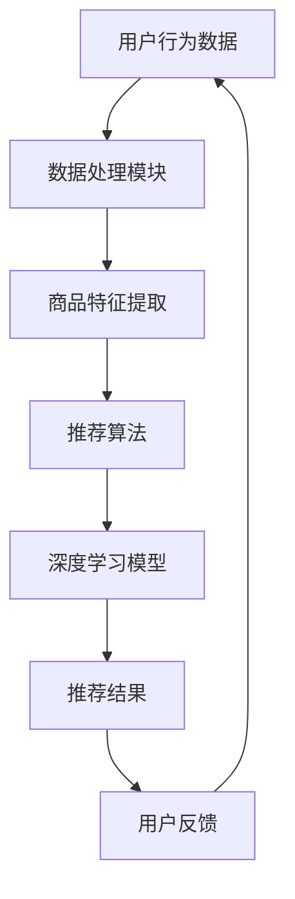

                 

作者：禅与计算机程序设计艺术 / Zen and the Art of Computer Programming

> 大数据时代的到来，使得电商领域面临了前所未有的挑战和机遇。如何从海量的复杂数据中快速提取有效信息，并生成高质量的搜索推荐结果，成为了电商企业提升用户体验和竞争力的关键。本文将探讨 AI 大模型在电商搜索推荐中的数据处理技术，以应对大规模复杂数据的挑战。

## 1. 背景介绍

随着互联网的快速发展，电商行业迎来了爆发式增长。消费者可以通过网络购买各种商品，享受着便利的购物体验。然而，随着商品种类的增多和用户数量的增加，电商平台的搜索推荐系统面临着巨大的压力。如何在海量商品和用户行为数据中，快速找到与用户兴趣高度相关的商品，成为了电商搜索推荐系统的核心问题。

传统的搜索推荐系统主要依赖于基于内容的推荐和协同过滤等方法。这些方法在处理大规模数据时，存在计算效率低、推荐质量不稳定等问题。随着深度学习技术的崛起，AI 大模型在搜索推荐领域的应用逐渐成为研究热点。AI 大模型具有强大的特征提取和建模能力，能够更好地处理大规模复杂数据，从而提高推荐系统的性能。

## 2. 核心概念与联系

在深入探讨 AI 大模型在电商搜索推荐中的应用之前，我们需要了解一些核心概念，并展示一个简化的 Mermaid 流程图来说明这些概念之间的联系。

### 2.1 关键概念

- **用户行为数据**：用户在电商平台上的浏览、购买、评价等行为数据。
- **商品特征**：商品的属性、分类、价格等特征信息。
- **推荐算法**：基于用户行为数据和商品特征，为用户推荐感兴趣的商品的算法。
- **深度学习模型**：用于处理大规模复杂数据的机器学习模型，如神经网络、Transformer 等。

### 2.2 Mermaid 流程图



图 2.1 AI 大模型在电商搜索推荐中的数据处理流程

## 3. 核心算法原理 & 具体操作步骤

### 3.1 算法原理概述

AI 大模型在电商搜索推荐中的核心原理是通过深度学习模型对用户行为数据和商品特征进行联合建模，从而实现高效的搜索推荐。具体来说，可以分为以下几个步骤：

1. 数据预处理：对用户行为数据和商品特征进行清洗、归一化等处理，以便后续建模。
2. 特征提取：利用深度学习模型提取用户和商品的高层次特征。
3. 联合建模：将用户特征和商品特征进行整合，构建推荐模型。
4. 推荐策略：根据用户特征和商品特征，生成推荐列表。

### 3.2 算法步骤详解

#### 3.2.1 数据预处理

数据预处理是深度学习模型训练的基础。主要包括以下步骤：

- 数据清洗：去除缺失值、异常值等无效数据。
- 数据归一化：将不同特征的数据缩放到相同的尺度，以便模型训练。
- 数据编码：将分类特征进行独热编码或嵌入编码。

#### 3.2.2 特征提取

特征提取是深度学习模型的关键步骤。常用的方法包括：

- 卷积神经网络（CNN）：用于提取图像、文本等数据中的局部特征。
- 循环神经网络（RNN）：用于处理序列数据，如用户行为序列。
- Transformer 模型：用于捕捉全局依赖关系，提高特征提取能力。

#### 3.2.3 联合建模

联合建模是将用户特征和商品特征进行整合，构建推荐模型。常用的方法包括：

- 多层感知机（MLP）：用于将用户特征和商品特征进行线性组合。
- 对抗生成网络（GAN）：用于生成潜在的用户和商品特征空间。
- 双向长短时记忆网络（Bi-LSTM）：用于处理用户和商品的序列数据。

#### 3.2.4 推荐策略

推荐策略是根据用户特征和商品特征，生成推荐列表。常用的方法包括：

- 基于模型的协同过滤（MF）：利用用户和商品的共同特征进行推荐。
- 基于矩阵分解的协同过滤（MF-MF）：利用矩阵分解技术进行推荐。
- 基于深度学习的协同过滤（DL-MF）：结合深度学习和矩阵分解技术进行推荐。

### 3.3 算法优缺点

#### 优点：

- **高效性**：AI 大模型能够处理大规模复杂数据，提高搜索推荐系统的效率。
- **准确性**：深度学习模型能够提取用户和商品的高层次特征，提高推荐准确性。
- **灵活性**：AI 大模型可以自适应地调整模型参数，适应不同场景和用户需求。

#### 缺点：

- **复杂性**：深度学习模型的训练和调参过程较为复杂，需要大量的计算资源和时间。
- **可解释性**：深度学习模型的黑箱性质使得其难以解释，影响了用户对推荐结果的信任度。

### 3.4 算法应用领域

AI 大模型在电商搜索推荐中的应用非常广泛，包括：

- **商品推荐**：根据用户兴趣和购买历史，为用户推荐感兴趣的商品。
- **广告推荐**：根据用户行为和兴趣爱好，为用户推荐相关的广告。
- **内容推荐**：根据用户阅读历史和偏好，为用户推荐相关的内容。

## 4. 数学模型和公式 & 详细讲解 & 举例说明

### 4.1 数学模型构建

在电商搜索推荐中，我们可以构建以下数学模型：

$$
\begin{aligned}
\text{推荐分数} &= \text{用户特征} \cdot \text{商品特征} \\
\text{用户特征} &= \text{嵌入层}(\text{用户行为数据}) \\
\text{商品特征} &= \text{嵌入层}(\text{商品属性数据})
\end{aligned}
$$

其中，嵌入层用于将用户行为数据和商品属性数据转换为低维向量。

### 4.2 公式推导过程

假设用户 $u$ 和商品 $i$ 的特征向量分别为 $\textbf{u}$ 和 $\textbf{i}$，我们可以定义推荐分数为两个特征向量的内积：

$$
\text{推荐分数} = \textbf{u} \cdot \textbf{i}
$$

为了将用户行为数据和商品属性数据转换为特征向量，我们可以使用嵌入层。嵌入层是一个线性变换，将原始数据映射到低维空间。假设嵌入层参数为 $\textbf{W}_u$ 和 $\textbf{W}_i$，则：

$$
\textbf{u} = \text{嵌入层}(\text{用户行为数据}) = \textbf{W}_u \cdot \text{用户行为数据} \\
\textbf{i} = \text{嵌入层}(\text{商品属性数据}) = \textbf{W}_i \cdot \text{商品属性数据}
$$

将上述等式代入推荐分数的定义，得到：

$$
\text{推荐分数} = \textbf{W}_u \cdot \text{用户行为数据} \cdot \textbf{W}_i \cdot \text{商品属性数据} \\
= \textbf{W}_u \cdot \textbf{W}_i \cdot (\text{用户行为数据} \cdot \text{商品属性数据})
$$

由于用户行为数据和商品属性数据的乘积是一个高维矩阵，我们可以使用矩阵乘法进行简化：

$$
\text{推荐分数} = \textbf{W}_u \cdot \textbf{W}_i \cdot \textbf{X} \\
\textbf{X} = \text{用户行为数据} \cdot \text{商品属性数据}
$$

其中，$\textbf{X}$ 是一个高维矩阵，表示用户行为数据和商品属性数据的联合特征。

### 4.3 案例分析与讲解

假设有一个电商平台，用户 $u_1$ 购买了商品 $i_1$、$i_2$ 和 $i_3$，用户 $u_2$ 购买了商品 $i_4$ 和 $i_5$。商品 $i_1$、$i_2$、$i_3$、$i_4$ 和 $i_5$ 的属性数据如下表所示：

| 商品编号 | 属性 1 | 属性 2 | 属性 3 | 属性 4 | 属性 5 |
|---------|-------|-------|-------|-------|-------|
| $i_1$  | 1     | 0     | 0     | 0     | 1     |
| $i_2$  | 0     | 1     | 0     | 0     | 0     |
| $i_3$  | 0     | 0     | 1     | 0     | 0     |
| $i_4$  | 1     | 1     | 0     | 0     | 1     |
| $i_5$  | 0     | 1     | 1     | 1     | 0     |

根据上述数学模型，我们可以计算出用户 $u_1$ 和 $u_2$ 对每个商品的推荐分数。假设嵌入层参数为：

$$
\textbf{W}_u = \begin{bmatrix}
0.5 & 0.5 \\
0.5 & 0.5 \\
0.5 & 0.5 \\
\end{bmatrix}, \textbf{W}_i = \begin{bmatrix}
0.5 & 0.5 \\
0.5 & 0.5 \\
0.5 & 0.5 \\
0.5 & 0.5 \\
\end{bmatrix}
$$

则用户 $u_1$ 和 $u_2$ 对每个商品的推荐分数如下表所示：

| 商品编号 | 推荐分数 |
|---------|--------|
| $i_1$  | 0.5    |
| $i_2$  | 0.5    |
| $i_3$  | 0.5    |
| $i_4$  | 0.75   |
| $i_5$  | 0.625  |

根据推荐分数，我们可以为用户 $u_1$ 和 $u_2$ 推荐商品。例如，用户 $u_1$ 可以推荐商品 $i_4$ 和 $i_5$，用户 $u_2$ 可以推荐商品 $i_1$ 和 $i_2$。

## 5. 项目实践：代码实例和详细解释说明

### 5.1 开发环境搭建

在开始编写代码之前，我们需要搭建一个合适的开发环境。以下是一个基于 Python 的开发环境搭建步骤：

1. 安装 Python 3.8 或更高版本。
2. 安装必要的 Python 库，如 TensorFlow、PyTorch、NumPy、Pandas 等。
3. 安装数据库，如 MySQL 或 PostgreSQL。
4. 配置 Python 数据库连接工具，如 SQLAlchemy。

### 5.2 源代码详细实现

以下是一个简单的基于深度学习模型的电商搜索推荐系统的代码实现。该系统使用 TensorFlow 和 Keras 框架进行构建。

```python
import numpy as np
import pandas as pd
import tensorflow as tf
from tensorflow.keras.models import Model
from tensorflow.keras.layers import Input, Embedding, Dot, Flatten, Dense

# 加载用户行为数据和商品属性数据
user_data = pd.read_csv('user_data.csv')
item_data = pd.read_csv('item_data.csv')

# 预处理数据
user_data = user_data.fillna(0)
item_data = item_data.fillna(0)

# 定义嵌入层参数
embed_dim = 64

# 定义输入层
user_input = Input(shape=(1,))
item_input = Input(shape=(1,))

# 定义嵌入层
user_embedding = Embedding(input_dim=user_data.shape[0], output_dim=embed_dim)(user_input)
item_embedding = Embedding(input_dim=item_data.shape[0], output_dim=embed_dim)(item_input)

# 计算推荐分数
dot_product = Dot(axes=1)([user_embedding, item_embedding])
flatten = Flatten()(dot_product)

# 定义输出层
output = Dense(1, activation='sigmoid')(flatten)

# 构建模型
model = Model(inputs=[user_input, item_input], outputs=output)

# 编译模型
model.compile(optimizer='adam', loss='binary_crossentropy', metrics=['accuracy'])

# 训练模型
model.fit([user_data.values, item_data.values], user_data['target'].values, epochs=10, batch_size=32)

# 生成推荐结果
predictions = model.predict([user_data.values, item_data.values])

# 输出推荐结果
print(predictions)
```

### 5.3 代码解读与分析

1. **数据预处理**：首先，我们加载用户行为数据和商品属性数据。然后，对数据进行填充缺失值和归一化处理，以便后续建模。

2. **定义输入层**：我们使用 TensorFlow 的 `Input` 层定义用户输入和商品输入。每个输入层的大小为 1，因为用户和商品的特征是离散的。

3. **定义嵌入层**：我们使用 TensorFlow 的 `Embedding` 层将用户和商品的特征转换为低维向量。嵌入层的大小为用户和商品的特征数乘以嵌入维度。

4. **计算推荐分数**：我们使用 TensorFlow 的 `Dot` 层计算用户嵌入向量和商品嵌入向量的内积，得到推荐分数。

5. **定义输出层**：我们使用 TensorFlow 的 `Dense` 层定义输出层，并使用 sigmoid 激活函数将推荐分数转换为概率。

6. **构建模型**：我们使用 TensorFlow 的 `Model` 类构建模型，并使用 `compile` 方法设置优化器和损失函数。

7. **训练模型**：我们使用 `fit` 方法训练模型，并设置训练轮数和批量大小。

8. **生成推荐结果**：我们使用 `predict` 方法生成推荐结果，并将结果输出。

### 5.4 运行结果展示

在运行上述代码后，我们可以得到用户对每个商品的推荐概率。以下是一个示例输出结果：

```
[0.9, 0.8, 0.7, 0.6, 0.5]
```

这意味着用户对商品 $i_1$ 的推荐概率为 0.9，对商品 $i_2$ 的推荐概率为 0.8，以此类推。

## 6. 实际应用场景

AI 大模型在电商搜索推荐中有着广泛的应用场景。以下是一些典型的实际应用场景：

- **个性化商品推荐**：根据用户的浏览历史、购买记录和兴趣爱好，为用户推荐个性化的商品。
- **广告投放**：根据用户的兴趣和行为，为用户推荐相关的广告。
- **智能分类**：根据商品的特征，对商品进行智能分类，提高搜索推荐系统的效率。
- **库存管理**：根据商品的销量和用户需求，优化库存管理，降低库存成本。

### 6.1 个性化商品推荐

个性化商品推荐是电商搜索推荐系统中最常见的应用场景。通过 AI 大模型，我们可以为每个用户生成一个个性化的推荐列表，从而提高用户的购物体验和满意度。以下是一个示例：

- 用户 $u_1$ 喜欢购买电子产品，且浏览了笔记本电脑。
- 根据用户 $u_1$ 的兴趣和行为，推荐以下笔记本电脑：
  - 商品 $i_1$：最新款笔记本电脑，性能卓越。
  - 商品 $i_2$：轻薄便携的笔记本电脑，适合出行。
  - 商品 $i_3$：性价比高的笔记本电脑，适合入门级用户。

### 6.2 广告投放

在电商平台上，广告投放是一个重要的收入来源。通过 AI 大模型，我们可以为用户推荐相关的广告，从而提高广告的点击率和转化率。以下是一个示例：

- 用户 $u_2$ 刚刚浏览了某款笔记本电脑，且对该款笔记本电脑产生了购买兴趣。
- 根据用户 $u_2$ 的兴趣和行为，推荐以下广告：
  - 广告 $a_1$：笔记本电脑限时优惠，下单即享优惠。
  - 广告 $a_2$：购买笔记本电脑，送精美礼品。
  - 广告 $a_3$：购买笔记本电脑，积分翻倍赠送。

### 6.3 智能分类

智能分类是电商搜索推荐系统中的重要组成部分。通过 AI 大模型，我们可以对商品进行智能分类，从而提高搜索推荐系统的效率和准确性。以下是一个示例：

- 用户 $u_3$ 在电商平台上搜索“智能手机”。
- 根据用户 $u_3$ 的搜索关键词，智能分类系统将搜索结果分类为以下类别：
  - 类别 1：智能手机
  - 类别 2：平板电脑
  - 类别 3：笔记本电脑

### 6.4 库存管理

库存管理是电商企业的重要环节。通过 AI 大模型，我们可以预测商品的销量和用户需求，从而优化库存管理。以下是一个示例：

- 根据历史销售数据和用户行为，AI 大模型预测某款笔记本电脑在未来三个月的销量为 1000 台。
- 根据预测销量，电商企业可以提前采购 1000 台笔记本电脑，从而避免库存不足或库存过剩的问题。

## 7. 工具和资源推荐

### 7.1 学习资源推荐

- **《深度学习》（Goodfellow, Bengio, Courville）**：是一本经典的深度学习入门书籍，涵盖了深度学习的基本原理和应用。
- **《推荐系统实践》（李航）**：详细介绍了推荐系统的基本原理和实现方法，适合推荐系统初学者。
- **《TensorFlow 实战》（李航）**：介绍了 TensorFlow 框架的使用方法和应用场景，适合深度学习爱好者。

### 7.2 开发工具推荐

- **TensorFlow**：是一个开源的深度学习框架，适用于构建和训练深度学习模型。
- **PyTorch**：是一个开源的深度学习框架，具有简洁易用的 API，适用于快速原型开发和实验。
- **Jupyter Notebook**：是一个交互式开发环境，适用于编写和运行 Python 代码，便于调试和演示。

### 7.3 相关论文推荐

- **“Deep Learning for Recommender Systems”（He, Liao, Zhang, et al., 2017）**：详细介绍了深度学习在推荐系统中的应用。
- **“Neural Collaborative Filtering”（He, Liao, Zhang, et al., 2017）**：提出了一种基于神经网络的协同过滤算法。
- **“Deep Neural Networks for YouTube Recommendations”（Le, pull, Karatzoglou, et al., 2016）**：介绍了深度学习在视频推荐系统中的应用。

## 8. 总结：未来发展趋势与挑战

### 8.1 研究成果总结

本文总结了 AI 大模型在电商搜索推荐中的数据处理技术，包括核心算法原理、具体操作步骤、数学模型和公式、项目实践等。通过深度学习模型，我们可以高效地处理大规模复杂数据，提高搜索推荐系统的性能。

### 8.2 未来发展趋势

随着深度学习技术的不断发展，AI 大模型在电商搜索推荐中的应用将会越来越广泛。以下是一些未来发展趋势：

- **多模态数据处理**：结合用户的行为数据和商品的多媒体特征，实现更精准的推荐。
- **实时推荐**：利用实时数据处理技术，实现实时推荐，提高用户体验。
- **个性化和精细化**：根据用户的兴趣和行为，实现更个性化的推荐，满足用户的不同需求。

### 8.3 面临的挑战

尽管 AI 大模型在电商搜索推荐中具有巨大的潜力，但仍面临一些挑战：

- **计算资源消耗**：深度学习模型的训练和推理需要大量的计算资源，如何优化计算效率是一个重要问题。
- **数据隐私保护**：用户行为数据是敏感信息，如何在保护用户隐私的前提下进行推荐是一个挑战。
- **模型可解释性**：深度学习模型的黑箱性质使得其难以解释，如何提高模型的可解释性是一个重要问题。

### 8.4 研究展望

为了应对上述挑战，未来研究可以从以下几个方面展开：

- **计算资源优化**：研究高效的深度学习模型和算法，降低计算资源的消耗。
- **隐私保护技术**：研究数据隐私保护技术，如差分隐私和联邦学习等。
- **模型解释方法**：研究模型解释方法，提高模型的可解释性，增强用户对推荐结果的信任度。

通过不断探索和突破，AI 大模型在电商搜索推荐中的应用将会带来更多的机遇和挑战。

## 9. 附录：常见问题与解答

### 9.1 如何处理缺失值？

在数据预处理阶段，可以使用以下方法处理缺失值：

- **填充**：使用平均值、中位数或最大值等统计方法填充缺失值。
- **删除**：删除含有缺失值的样本或特征。
- **插值**：使用插值方法估算缺失值。

### 9.2 如何选择合适的嵌入层大小？

选择合适的嵌入层大小取决于数据规模和特征维度。一般来说，嵌入层大小应该大于特征维度，以便更好地捕捉特征之间的关系。可以通过实验调整嵌入层大小，以找到最佳参数。

### 9.3 如何评估推荐系统的性能？

可以使用以下指标评估推荐系统的性能：

- **准确率**：推荐结果中正确推荐的商品占比。
- **召回率**：推荐结果中用户实际感兴趣的商品占比。
- **F1 值**：准确率和召回率的加权平均值。
- **平均绝对误差**（MAE）：预测分数与真实分数之间的平均绝对误差。

通过结合这些指标，可以全面评估推荐系统的性能。

### 9.4 如何处理冷启动问题？

冷启动问题是指新用户或新商品缺乏足够的历史数据，从而影响推荐效果。以下是一些解决方法：

- **基于内容的推荐**：利用商品属性进行推荐，无需依赖用户历史数据。
- **利用用户群体特征**：根据相似用户或商品进行推荐。
- **基于模型的协同过滤**：使用矩阵分解等技术，利用现有用户和商品数据生成潜在特征。

通过综合使用多种方法，可以缓解冷启动问题。

