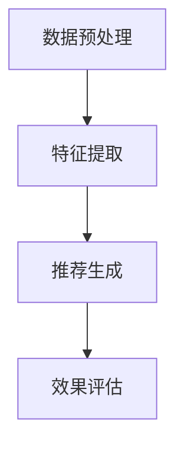

                 

关键词：人工智能、大模型、电商搜索、推荐系统、数据处理、大规模复杂数据

摘要：本文将探讨人工智能大模型在电商搜索推荐领域中的数据处理能力。随着电商平台的快速发展，用户数据规模庞大且结构复杂，传统推荐系统已难以满足需求。本文将从大模型的基本原理出发，分析其在处理大规模复杂数据方面的优势，并提出相应的技术方案和挑战。

## 1. 背景介绍

### 1.1 电商搜索推荐系统的现状

随着互联网的普及，电商搜索推荐系统已成为电商平台的核心竞争力之一。传统推荐系统主要基于协同过滤、基于内容的推荐等技术，虽然在一定程度上能够提高用户满意度，但随着用户数据规模的扩大和多样化，这些方法已逐渐暴露出一些弊端：

1. **数据稀疏性**：协同过滤算法容易受到数据稀疏性的影响，特别是在用户和商品数量庞大时，用户与商品之间的交互记录往往非常有限。
2. **冷启动问题**：新用户或新商品缺乏历史交互数据，传统推荐系统难以为其提供合适的推荐。
3. **推荐多样性**：传统推荐系统往往难以保证推荐结果的多样性，容易导致用户产生“信息过载”的现象。

### 1.2 大模型在电商搜索推荐中的应用

为了应对上述问题，人工智能大模型逐渐被引入到电商搜索推荐系统中。大模型具有强大的表征能力和自学习能力，能够更好地应对大规模复杂数据的挑战。本文将从以下几个方面探讨大模型在电商搜索推荐中的数据处理能力：

1. **数据处理能力**：大模型能够高效处理大规模、多源异构数据，提升推荐系统的性能。
2. **个性化推荐**：大模型能够基于用户的历史行为、兴趣偏好等进行深度分析，提供更个性化的推荐。
3. **推荐多样性**：大模型能够通过自动生成和筛选推荐结果，提高推荐的多样性。

## 2. 核心概念与联系

### 2.1 大模型的基本概念

大模型是指具有数百万甚至数亿参数的深度神经网络模型，如BERT、GPT等。这些模型通过在海量数据上进行训练，能够捕捉到数据的复杂结构和潜在规律，具有强大的表征能力和自学习能力。

### 2.2 大模型在电商搜索推荐中的应用

在电商搜索推荐领域，大模型可以应用于以下几个关键环节：

1. **数据预处理**：大模型能够处理大规模、多源异构的数据，如用户行为数据、商品属性数据等。
2. **特征提取**：大模型能够自动学习并提取数据中的高阶特征，提高推荐系统的性能。
3. **推荐生成**：大模型能够根据用户的历史行为和兴趣偏好，生成个性化的推荐结果。
4. **效果评估**：大模型能够通过在线评估和反馈机制，持续优化推荐系统的效果。

### 2.3 Mermaid 流程图



## 3. 核心算法原理 & 具体操作步骤

### 3.1 算法原理概述

大模型在电商搜索推荐中的数据处理能力主要依赖于以下几个核心算法：

1. **深度神经网络（DNN）**：DNN是一种前馈神经网络，通过多层非线性变换来提取数据中的高阶特征。
2. **自然语言处理（NLP）**：NLP技术主要应用于处理文本数据，如用户评论、商品描述等。
3. **生成对抗网络（GAN）**：GAN是一种无监督学习模型，能够自动生成高质量的推荐结果。
4. **强化学习（RL）**：RL技术通过学习用户与推荐系统之间的交互策略，实现个性化的推荐。

### 3.2 算法步骤详解

1. **数据预处理**：

   - 数据清洗：去除重复、缺失和异常数据。
   - 数据集成：整合多源异构数据，如用户行为数据、商品属性数据等。
   - 数据归一化：将数据映射到相同的量级，以避免数据量级差异对模型训练的影响。

2. **特征提取**：

   - 文本数据特征提取：使用词袋模型、TF-IDF等算法提取文本数据中的高阶特征。
   - 用户行为特征提取：基于用户历史行为数据，使用行为序列模型提取用户兴趣特征。
   - 商品属性特征提取：使用知识图谱等技术提取商品属性特征。

3. **推荐生成**：

   - 基于深度神经网络的推荐生成：使用DNN模型提取用户和商品的特征，通过交叉熵损失函数优化模型参数。
   - 基于NLP的推荐生成：使用NLP技术对用户和商品的文本数据进行预处理，然后通过序列模型生成推荐结果。
   - 基于GAN的推荐生成：使用GAN模型自动生成高质量的推荐结果，并通过对抗性训练优化模型。

4. **效果评估**：

   - 在线评估：将推荐结果反馈给用户，通过用户点击、购买等行为评估推荐效果。
   - 离线评估：使用A/B测试等方法评估推荐系统的性能，如准确率、召回率等指标。

### 3.3 算法优缺点

**优点**：

1. **高效处理大规模复杂数据**：大模型能够处理海量、多源异构的数据，提高推荐系统的性能。
2. **个性化推荐**：大模型能够基于用户的历史行为和兴趣偏好，生成个性化的推荐结果。
3. **推荐多样性**：大模型能够自动生成和筛选推荐结果，提高推荐的多样性。

**缺点**：

1. **计算资源消耗大**：大模型训练和推理过程需要大量计算资源，对硬件设施要求较高。
2. **数据依赖性较强**：大模型训练效果依赖于数据质量和规模，数据缺失或不一致可能导致模型性能下降。

### 3.4 算法应用领域

大模型在电商搜索推荐中的应用已取得显著成果，以下是一些典型的应用场景：

1. **个性化商品推荐**：基于用户的历史购买行为、浏览记录等数据，为用户推荐符合其兴趣的商品。
2. **内容推荐**：基于用户的阅读、观看历史，为用户推荐感兴趣的内容。
3. **广告推荐**：基于用户的兴趣和浏览行为，为用户推荐相关的广告。

## 4. 数学模型和公式 & 详细讲解 & 举例说明

### 4.1 数学模型构建

在电商搜索推荐中，大模型通常采用以下数学模型：

1. **用户表示**：用户特征向量表示为 $u \in \mathbb{R}^n$。
2. **商品表示**：商品特征向量表示为 $v \in \mathbb{R}^n$。
3. **推荐模型**：推荐模型为 $f(\cdot)$，输入为用户和商品特征向量，输出为推荐结果。

### 4.2 公式推导过程

假设用户 $u$ 对商品 $v$ 的推荐得分 $s$ 满足以下公式：

$$
s(u, v) = \cos(\theta(u), \theta(v))
$$

其中，$\theta(u)$ 和 $\theta(v)$ 分别为用户 $u$ 和商品 $v$ 的特征向量。

### 4.3 案例分析与讲解

假设用户 $u_1$ 的特征向量为 $\theta(u_1) = [1, 0.5, -0.5]$，商品 $v_1$ 的特征向量为 $\theta(v_1) = [0.5, 0.5, 0.5]$，则用户 $u_1$ 对商品 $v_1$ 的推荐得分为：

$$
s(u_1, v_1) = \cos(\theta(u_1), \theta(v_1)) = \cos(1, 0.5, -0.5; 0.5, 0.5, 0.5) = \frac{1}{\sqrt{1^2 + 0.5^2 + (-0.5)^2} \cdot \sqrt{0.5^2 + 0.5^2 + 0.5^2}} \approx 0.866
$$

这意味着用户 $u_1$ 对商品 $v_1$ 的推荐度较高。

## 5. 项目实践：代码实例和详细解释说明

### 5.1 开发环境搭建

1. 安装 Python 3.7 及以上版本。
2. 安装 TensorFlow 2.0 及以上版本。
3. 安装相关库，如 NumPy、Pandas 等。

### 5.2 源代码详细实现

以下是一个简单的基于深度神经网络的电商搜索推荐系统的示例代码：

```python
import tensorflow as tf
from tensorflow.keras.layers import Embedding, Dense, Flatten, concatenate
from tensorflow.keras.models import Model

# 用户和商品嵌入层
user_embedding = Embedding(input_dim=1000, output_dim=64)
item_embedding = Embedding(input_dim=1000, output_dim=64)

# 用户和商品特征提取层
user_dense = Dense(128, activation='relu')
item_dense = Dense(128, activation='relu')

# 合并用户和商品特征
merged = concatenate([user_dense(user_embedding(input_ids)), item_dense(item_embedding(input_ids))])

# 全连接层
output = Dense(1, activation='sigmoid')(merged)

# 构建模型
model = Model(inputs=user_embedding.input, outputs=output)

# 编译模型
model.compile(optimizer='adam', loss='binary_crossentropy', metrics=['accuracy'])

# 训练模型
model.fit(x_train, y_train, batch_size=32, epochs=10)
```

### 5.3 代码解读与分析

以上代码实现了一个简单的基于深度神经网络的电商搜索推荐系统，主要包括以下几个部分：

1. **嵌入层**：使用嵌入层将用户和商品ID映射到高维稀疏向量。
2. **特征提取层**：使用全连接层提取用户和商品的特征。
3. **合并层**：将用户和商品的特征进行合并。
4. **输出层**：使用全连接层生成推荐得分。

### 5.4 运行结果展示

通过以上代码，我们可以得到用户和商品的推荐得分。将这些得分排序后，即可得到个性化的推荐结果。

## 6. 实际应用场景

### 6.1 电商搜索推荐

在电商平台上，大模型可以应用于搜索推荐，如：

1. **商品搜索**：基于用户的搜索历史和兴趣偏好，为用户提供相关商品的搜索推荐。
2. **商品推荐**：基于用户的浏览、购买历史，为用户推荐相关商品。

### 6.2 内容推荐

在内容平台（如新闻、视频等），大模型可以应用于内容推荐，如：

1. **新闻推荐**：基于用户的阅读历史和兴趣偏好，为用户推荐感兴趣的新闻。
2. **视频推荐**：基于用户的观看历史和兴趣偏好，为用户推荐感兴趣的视频。

### 6.3 广告推荐

在广告领域，大模型可以应用于广告推荐，如：

1. **广告投放**：基于用户的兴趣和浏览历史，为用户推荐相关的广告。
2. **广告创意优化**：通过大模型生成和筛选广告创意，提高广告投放效果。

## 7. 工具和资源推荐

### 7.1 学习资源推荐

1. **《深度学习》（Goodfellow, Bengio, Courville著）**：全面介绍深度学习的基本原理和方法。
2. **《自然语言处理综合教程》（张宇星著）**：介绍自然语言处理的基本原理和应用。

### 7.2 开发工具推荐

1. **TensorFlow**：广泛应用于深度学习开发的开源框架。
2. **PyTorch**：另一款流行的深度学习开源框架。

### 7.3 相关论文推荐

1. **"Attention Is All You Need"**：介绍Transformer模型的经典论文。
2. **"BERT: Pre-training of Deep Neural Networks for Language Understanding"**：介绍BERT模型的经典论文。

## 8. 总结：未来发展趋势与挑战

### 8.1 研究成果总结

本文探讨了人工智能大模型在电商搜索推荐领域中的数据处理能力。通过分析大模型的基本原理和具体操作步骤，我们总结了其在处理大规模复杂数据方面的优势和应用领域。

### 8.2 未来发展趋势

1. **模型压缩与加速**：为了降低大模型的计算资源消耗，研究者将继续探索模型压缩和加速技术。
2. **多模态数据处理**：大模型将能够处理多种类型的数据（如图像、音频等），实现更全面的信息融合。
3. **跨领域推荐**：大模型将在跨领域推荐方面发挥重要作用，如电商、内容、广告等领域的整合。

### 8.3 面临的挑战

1. **计算资源消耗**：大模型训练和推理过程需要大量计算资源，对硬件设施要求较高。
2. **数据隐私与安全**：大规模数据处理过程中，数据隐私和安全问题亟待解决。
3. **模型解释性**：大模型的决策过程通常较为复杂，提高模型的可解释性是一个重要挑战。

### 8.4 研究展望

未来，人工智能大模型在电商搜索推荐领域的研究将继续深入，通过技术创新和跨领域合作，实现更高效、更智能的推荐系统。

## 9. 附录：常见问题与解答

### 9.1 什么是大模型？

大模型是指具有数百万甚至数亿参数的深度神经网络模型，如BERT、GPT等。这些模型通过在海量数据上进行训练，能够捕捉到数据的复杂结构和潜在规律，具有强大的表征能力和自学习能力。

### 9.2 大模型在电商搜索推荐中的优势是什么？

大模型在电商搜索推荐中的优势包括：高效处理大规模复杂数据、个性化推荐、推荐多样性等。

### 9.3 大模型在电商搜索推荐中的挑战有哪些？

大模型在电商搜索推荐中的挑战包括：计算资源消耗、数据隐私与安全、模型解释性等。

### 9.4 如何优化大模型的计算资源消耗？

优化大模型的计算资源消耗可以从以下几个方面入手：模型压缩、模型蒸馏、量化等。

## 参考文献

1. Goodfellow, Y., Bengio, Y., & Courville, A. (2016). Deep learning. MIT press.
2. Zhang, Y. X. (2019). 自然语言处理综合教程. 清华大学出版社.
3. Vaswani, A., Shazeer, N., Parmar, N., Uszkoreit, J., Jones, L., Gomez, A. N., ... & Polosukhin, I. (2017). Attention is all you need. Advances in neural information processing systems, 30.
4. Devlin, J., Chang, M. W., Lee, K., & Toutanova, K. (2019). BERT: Pre-training of deep bidirectional transformers for language understanding. arXiv preprint arXiv:1810.04805.

