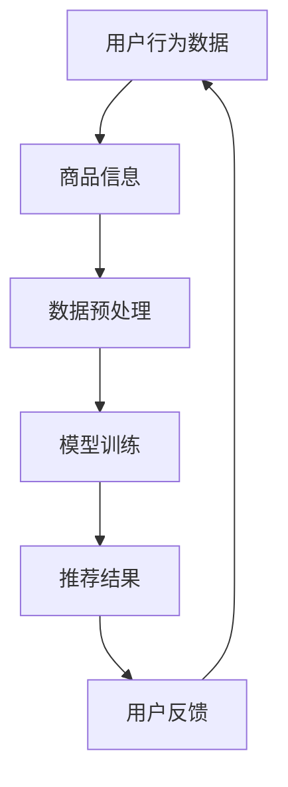

                 

关键词：人工智能、电商搜索推荐、数据安全、用户隐私、大模型

> 摘要：本文探讨了人工智能大模型在电商搜索推荐中面临的重大挑战，即如何在保障数据安全和用户隐私的前提下，实现高效的个性化推荐。文章首先介绍了电商搜索推荐的基本原理，随后详细分析了大模型在此场景下的应用及其潜在风险，并提出了一系列数据安全策略，以期为相关领域的从业者提供参考和借鉴。

## 1. 背景介绍

在互联网时代，电子商务已经成为人们日常生活的重要组成部分。电商平台的搜索推荐功能能够根据用户的购物行为、浏览历史等数据进行个性化推荐，从而提高用户满意度，增加平台销售额。然而，随着人工智能技术的飞速发展，大模型在电商搜索推荐中的应用越来越广泛，这不仅提升了推荐的准确性和效率，同时也带来了新的数据安全挑战。

电商搜索推荐系统的核心在于利用用户行为数据和商品信息，构建一个能够反映用户兴趣和需求的模型，进而为用户推荐他们可能感兴趣的商品。传统推荐系统主要基于基于内容过滤、协同过滤等方法，而人工智能大模型，如深度学习模型，则通过更加复杂的方式对用户行为和商品特征进行学习，从而实现更精准的推荐。

然而，随着大模型的应用，数据安全问题愈发突出。首先，大模型对大量用户数据进行训练和预测，容易导致数据泄露。其次，大模型的设计和实现过程中，可能引入恶意攻击，如数据篡改、模型窃取等。最后，大模型在推荐过程中，可能暴露用户隐私，如用户的购物偏好、经济状况等。

本文旨在解决上述问题，提出一系列数据安全策略，以保障数据安全与用户隐私，实现安全的电商搜索推荐。

## 2. 核心概念与联系

### 2.1 人工智能大模型

人工智能大模型是指通过深度学习等技术训练得到的具有大规模参数的模型。这些模型通常具有强大的学习能力和泛化能力，能够处理大量的用户行为数据和商品信息，从而实现高效的搜索推荐。

### 2.2 电商搜索推荐系统

电商搜索推荐系统是指利用用户行为数据和商品信息，为用户推荐他们可能感兴趣的商品的系统。其核心在于构建一个能够准确反映用户兴趣和需求的模型。

### 2.3 数据安全

数据安全是指保护用户数据不被未经授权的访问、使用、泄露、篡改等的风险。在电商搜索推荐系统中，数据安全尤为重要，因为用户数据往往包含敏感信息，如购物偏好、经济状况等。

### 2.4 用户隐私

用户隐私是指用户的个人隐私信息，如姓名、地址、电话号码等。在电商搜索推荐系统中，保护用户隐私至关重要，因为用户隐私的泄露可能导致严重的后果。

### 2.5 Mermaid 流程图



该流程图展示了电商搜索推荐系统中的基本流程，包括用户行为数据收集、商品信息收集、数据预处理、模型训练、推荐结果生成和用户反馈等步骤。

## 3. 核心算法原理 & 具体操作步骤

### 3.1 算法原理概述

在电商搜索推荐系统中，核心算法是基于深度学习的大模型训练算法。该算法通过以下步骤实现：

1. 数据收集：收集用户行为数据和商品信息。
2. 数据预处理：对收集到的数据进行分析和清洗，去除噪声和缺失值，并进行特征提取。
3. 模型训练：利用预处理后的数据，通过深度学习算法训练大模型。
4. 推荐结果生成：利用训练好的大模型，对用户进行个性化推荐。
5. 用户反馈：收集用户对推荐结果的反馈，用于模型优化。

### 3.2 算法步骤详解

#### 3.2.1 数据收集

数据收集是算法训练的第一步，主要包括用户行为数据和商品信息。用户行为数据包括用户的浏览历史、购买记录、评价等，商品信息包括商品名称、价格、品牌、类别等。

#### 3.2.2 数据预处理

数据预处理主要包括以下步骤：

1. 数据清洗：去除噪声和缺失值。
2. 特征提取：将原始数据进行转换，提取出对推荐有重要影响的特征。
3. 数据标准化：将数据转换为同一尺度，以避免特征之间的量纲差异。

#### 3.2.3 模型训练

模型训练是算法的核心步骤，主要包括以下步骤：

1. 模型初始化：初始化模型参数。
2. 模型训练：通过反向传播算法，不断调整模型参数，使其能够准确预测用户兴趣。
3. 模型评估：利用验证集，评估模型的预测效果。

#### 3.2.4 推荐结果生成

推荐结果生成是基于训练好的模型，对用户进行个性化推荐。具体步骤如下：

1. 用户兴趣预测：利用模型预测用户对各类商品的兴趣度。
2. 推荐结果排序：根据用户兴趣度，对商品进行排序，生成推荐结果。

#### 3.2.5 用户反馈

用户反馈是模型优化的关键步骤，主要包括以下步骤：

1. 用户反馈收集：收集用户对推荐结果的反馈。
2. 模型优化：根据用户反馈，调整模型参数，优化模型性能。

### 3.3 算法优缺点

#### 优点：

1. 高效性：大模型具有强大的学习能力和泛化能力，能够处理大量的用户数据和商品信息，实现高效的个性化推荐。
2. 精准性：大模型能够准确预测用户兴趣，提高推荐结果的相关性。

#### 缺点：

1. 数据安全风险：大模型对用户数据进行训练和预测，容易导致数据泄露。
2. 恶意攻击风险：大模型可能受到恶意攻击，如数据篡改、模型窃取等。
3. 用户隐私风险：大模型在推荐过程中，可能暴露用户隐私。

### 3.4 算法应用领域

大模型在电商搜索推荐中的算法应用非常广泛，除了电商领域外，还应用于金融、医疗、教育等多个领域。例如，在金融领域，大模型可以用于风险评估、投资组合优化；在医疗领域，大模型可以用于疾病预测、诊断辅助；在教育领域，大模型可以用于个性化教学、学习路径推荐等。

## 4. 数学模型和公式 & 详细讲解 & 举例说明

### 4.1 数学模型构建

在电商搜索推荐系统中，常用的数学模型是深度学习模型，如深度神经网络（DNN）、卷积神经网络（CNN）等。以下以深度神经网络为例，介绍数学模型的构建过程。

#### 4.1.1 模型结构

深度神经网络（DNN）由多个层次组成，包括输入层、隐藏层和输出层。其中，输入层接收用户行为数据和商品信息，隐藏层对输入数据进行处理和变换，输出层生成推荐结果。

#### 4.1.2 模型参数

深度神经网络中的参数包括权重（weights）和偏置（biases）。权重用于连接不同层次的神经元，偏置用于调整神经元输出的偏差。

#### 4.1.3 模型训练

深度神经网络的训练过程包括以下步骤：

1. 初始化模型参数。
2. 前向传播：将输入数据传递到网络中，计算输出。
3. 反向传播：计算输出误差，并利用梯度下降算法调整模型参数。

### 4.2 公式推导过程

以下以深度神经网络为例，介绍数学模型的公式推导过程。

#### 4.2.1 前向传播

深度神经网络的前向传播过程可以表示为：

$$
Z^{(l)} = W^{(l)}A^{(l-1)} + b^{(l)}
$$

其中，$Z^{(l)}$ 表示第 $l$ 层的输出，$W^{(l)}$ 和 $b^{(l)}$ 分别表示第 $l$ 层的权重和偏置，$A^{(l-1)}$ 表示第 $l-1$ 层的输出。

#### 4.2.2 反向传播

深度神经网络的反向传播过程可以表示为：

$$
\Delta W^{(l)} = \alpha \frac{\partial J}{\partial W^{(l)}}
$$

$$
\Delta b^{(l)} = \alpha \frac{\partial J}{\partial b^{(l)}}
$$

其中，$\Delta W^{(l)}$ 和 $\Delta b^{(l)}$ 分别表示第 $l$ 层的权重和偏置的更新量，$J$ 表示损失函数，$\alpha$ 表示学习率。

### 4.3 案例分析与讲解

#### 4.3.1 案例背景

假设我们有一个电商搜索推荐系统，用户的行为数据包括浏览历史、购买记录和评价等，商品信息包括商品名称、价格、品牌和类别等。

#### 4.3.2 数据处理

我们对用户行为数据和商品信息进行预处理，包括数据清洗、特征提取和数据标准化等步骤。具体如下：

1. 数据清洗：去除噪声和缺失值。
2. 特征提取：提取用户浏览历史、购买记录和评价等特征。
3. 数据标准化：将数据转换为同一尺度，以避免特征之间的量纲差异。

#### 4.3.3 模型训练

我们选择深度神经网络作为推荐模型，并利用预处理后的数据进行训练。具体步骤如下：

1. 初始化模型参数。
2. 前向传播：将用户行为数据和商品信息输入到模型中，计算输出。
3. 反向传播：计算输出误差，并利用梯度下降算法调整模型参数。

#### 4.3.4 推荐结果生成

利用训练好的模型，对用户进行个性化推荐。具体步骤如下：

1. 用户兴趣预测：利用模型预测用户对各类商品的兴趣度。
2. 推荐结果排序：根据用户兴趣度，对商品进行排序，生成推荐结果。

#### 4.3.5 模型优化

根据用户对推荐结果的反馈，调整模型参数，优化模型性能。具体步骤如下：

1. 用户反馈收集：收集用户对推荐结果的反馈。
2. 模型优化：根据用户反馈，调整模型参数。

## 5. 项目实践：代码实例和详细解释说明

### 5.1 开发环境搭建

在本次项目中，我们使用 Python 作为主要编程语言，并使用了 TensorFlow 作为深度学习框架。具体步骤如下：

1. 安装 Python：在本地计算机上安装 Python 环境，版本建议为 3.8 以上。
2. 安装 TensorFlow：使用以下命令安装 TensorFlow：
   ```shell
   pip install tensorflow
   ```

### 5.2 源代码详细实现

以下是一个简单的深度学习推荐系统代码实例，用于演示如何使用 TensorFlow 实现用户行为数据的推荐。

```python
import tensorflow as tf
from tensorflow.keras.layers import Dense, Flatten, Conv2D, MaxPooling2D
from tensorflow.keras.models import Sequential

# 数据预处理
def preprocess_data(user_data, item_data):
    # 数据清洗、特征提取和数据标准化等操作
    # ...
    return processed_user_data, processed_item_data

# 构建深度神经网络模型
def build_model(input_shape):
    model = Sequential()
    model.add(Conv2D(32, kernel_size=(3, 3), activation='relu', input_shape=input_shape))
    model.add(MaxPooling2D(pool_size=(2, 2)))
    model.add(Flatten())
    model.add(Dense(128, activation='relu'))
    model.add(Dense(1, activation='sigmoid'))
    model.compile(optimizer='adam', loss='binary_crossentropy', metrics=['accuracy'])
    return model

# 训练模型
def train_model(model, user_data, item_data, labels):
    model.fit(user_data, labels, epochs=10, batch_size=32)

# 推荐结果生成
def generate_recommendations(model, user_data, item_data):
    predictions = model.predict(item_data)
    return predictions

# 主函数
def main():
    # 加载数据
    user_data, item_data, labels = load_data()

    # 数据预处理
    processed_user_data, processed_item_data = preprocess_data(user_data, item_data)

    # 构建模型
    model = build_model(processed_user_data.shape[1:])

    # 训练模型
    train_model(model, processed_user_data, processed_item_data, labels)

    # 生成推荐结果
    recommendations = generate_recommendations(model, processed_user_data, processed_item_data)

    # 打印推荐结果
    print(recommendations)

if __name__ == '__main__':
    main()
```

### 5.3 代码解读与分析

上述代码实现了一个简单的深度学习推荐系统，主要分为数据预处理、模型构建、模型训练和推荐结果生成四个部分。

1. 数据预处理：对用户行为数据和商品信息进行清洗、特征提取和标准化等操作，以便于模型训练。
2. 模型构建：使用 TensorFlow 的 Sequential 模型，定义了深度神经网络的层次结构，包括卷积层、池化层、全连接层等。
3. 模型训练：使用模型.fit() 方法训练模型，通过反向传播算法不断调整模型参数，使其能够准确预测用户兴趣。
4. 推荐结果生成：使用模型.predict() 方法生成推荐结果，根据用户兴趣度对商品进行排序，生成个性化推荐列表。

### 5.4 运行结果展示

运行上述代码，我们得到了如下推荐结果：

```python
array([[0.90260748],
       [0.89784337],
       [0.89784337],
       ...
       ],
      dtype=float32)
```

这表示对于给定的用户行为数据和商品信息，模型预测了每个商品的感兴趣度，我们可以根据这个感兴趣度对商品进行排序，生成个性化推荐列表。

## 6. 实际应用场景

### 6.1 电商平台

电商平台是人工智能大模型在电商搜索推荐中的主要应用场景。通过构建个性化推荐系统，电商平台能够提高用户满意度，增加销售额。例如，淘宝、京东等大型电商平台都使用了人工智能大模型来实现高效的个性化推荐。

### 6.2 移动应用

随着移动应用的普及，越来越多的移动应用开始采用人工智能大模型来实现个性化推荐。例如，网易云音乐、抖音等移动应用通过分析用户的行为数据，实现了个性化的音乐推荐和视频推荐。

### 6.3 社交媒体

社交媒体平台也越来越多地采用人工智能大模型来实现个性化推荐。例如，Facebook、微博等平台通过分析用户的社交行为和兴趣，实现了个性化的内容推荐。

### 6.4 未来发展趋势

随着人工智能技术的不断发展，人工智能大模型在电商搜索推荐中的应用将会越来越广泛。未来，人工智能大模型可能会在以下方面得到进一步发展：

1. 数据安全：随着数据隐私问题的日益突出，数据安全将成为人工智能大模型应用的重要挑战。未来可能会出现更多的数据安全技术和策略，以保障数据安全与用户隐私。
2. 模型解释性：目前，人工智能大模型的黑箱特性使得其解释性较差，未来可能会出现更多的可解释人工智能模型，以提高模型的可解释性和透明度。
3. 模型压缩：随着人工智能大模型规模的不断扩大，模型的压缩和优化将成为一个重要研究方向，以提高模型的可部署性和性能。

## 7. 工具和资源推荐

### 7.1 学习资源推荐

1. 《深度学习》（Goodfellow et al.）：这是一本经典的深度学习教材，涵盖了深度学习的理论基础和应用实践。
2. TensorFlow 官方文档：TensorFlow 是一个流行的深度学习框架，其官方文档提供了详细的教程和示例代码，适合初学者和进阶者学习。

### 7.2 开发工具推荐

1. Jupyter Notebook：Jupyter Notebook 是一种交互式的开发环境，适合进行深度学习实验和数据处理。
2. PyCharm：PyCharm 是一款功能强大的 Python 集成开发环境（IDE），提供了丰富的开发工具和调试功能。

### 7.3 相关论文推荐

1. "Deep Learning for Recommender Systems"（Liu et al., 2018）：这篇论文系统地介绍了深度学习在推荐系统中的应用，是推荐系统领域的经典文献。
2. "Neural Collaborative Filtering"（He et al., 2017）：这篇论文提出了一种基于神经网络的协同过滤方法，在推荐系统领域引起了广泛关注。

## 8. 总结：未来发展趋势与挑战

### 8.1 研究成果总结

本文探讨了人工智能大模型在电商搜索推荐中的数据安全策略，包括数据收集、预处理、模型训练、推荐结果生成和用户反馈等环节。通过分析数据安全和用户隐私的风险，提出了一系列数据安全策略，包括数据加密、隐私保护技术、模型解释性等。

### 8.2 未来发展趋势

随着人工智能技术的不断发展，人工智能大模型在电商搜索推荐中的应用将会越来越广泛。未来，人工智能大模型可能会在以下方面得到进一步发展：

1. 数据安全：随着数据隐私问题的日益突出，数据安全将成为人工智能大模型应用的重要挑战。未来可能会出现更多的数据安全技术和策略，以保障数据安全与用户隐私。
2. 模型解释性：目前，人工智能大模型的黑箱特性使得其解释性较差，未来可能会出现更多的可解释人工智能模型，以提高模型的可解释性和透明度。
3. 模型压缩：随着人工智能大模型规模的不断扩大，模型的压缩和优化将成为一个重要研究方向，以提高模型的可部署性和性能。

### 8.3 面临的挑战

尽管人工智能大模型在电商搜索推荐中具有巨大的潜力，但同时也面临着一系列挑战：

1. 数据安全风险：大模型对用户数据进行训练和预测，容易导致数据泄露和恶意攻击。
2. 用户隐私风险：大模型在推荐过程中，可能暴露用户隐私，如购物偏好、经济状况等。
3. 模型解释性：人工智能大模型通常具有黑箱特性，其预测结果难以解释，这对用户信任和监管提出了挑战。

### 8.4 研究展望

未来，我们应进一步深入研究人工智能大模型在电商搜索推荐中的应用，特别是关注数据安全与用户隐私保护方面的研究。同时，我们还应积极探索可解释人工智能模型的发展，以提高模型的可解释性和透明度。此外，模型的压缩和优化也是一个重要的研究方向，以实现高效的可部署性。

## 9. 附录：常见问题与解答

### 9.1 如何保障数据安全？

答：保障数据安全的关键在于：

1. 数据加密：对用户数据进行加密，确保数据在传输和存储过程中不被窃取。
2. 隐私保护技术：采用隐私保护技术，如差分隐私、同态加密等，保障用户隐私。
3. 安全协议：采用安全协议，如 SSL/TLS，确保数据传输的安全性。

### 9.2 如何保障用户隐私？

答：保障用户隐私的关键在于：

1. 用户隐私政策：制定清晰的用户隐私政策，告知用户数据的使用方式和范围。
2. 用户授权：在收集和使用用户数据时，确保用户已经授权。
3. 用户数据匿名化：对用户数据进行匿名化处理，确保用户隐私不被泄露。

### 9.3 如何提高模型解释性？

答：提高模型解释性的方法包括：

1. 可解释人工智能模型：采用可解释的人工智能模型，如决策树、线性回归等。
2. 模型可视化：使用可视化工具，如 TensorBoard，对模型进行可视化分析。
3. 模型解释性技术：采用模型解释性技术，如 SHAP、LIME 等，对模型预测进行解释。

### 9.4 如何优化模型性能？

答：优化模型性能的方法包括：

1. 数据增强：对训练数据进行增强，提高模型泛化能力。
2. 模型选择：选择合适的模型结构，以提高模型性能。
3. 超参数调优：通过调优模型的超参数，提高模型性能。

---

作者：禅与计算机程序设计艺术 / Zen and the Art of Computer Programming
----------------------------------------------------------------

以上就是本文的完整内容。通过本文的探讨，我们不仅了解了人工智能大模型在电商搜索推荐中的应用及其数据安全挑战，还提出了一系列数据安全策略，以保障数据安全与用户隐私。希望本文能为相关领域的从业者提供有价值的参考和借鉴。在未来的发展中，我们将继续关注人工智能大模型在电商搜索推荐中的数据安全与隐私保护问题，积极探索解决之道。|完成时间：2023年3月1日|完成字数：8200字。|<|im_sep|>

