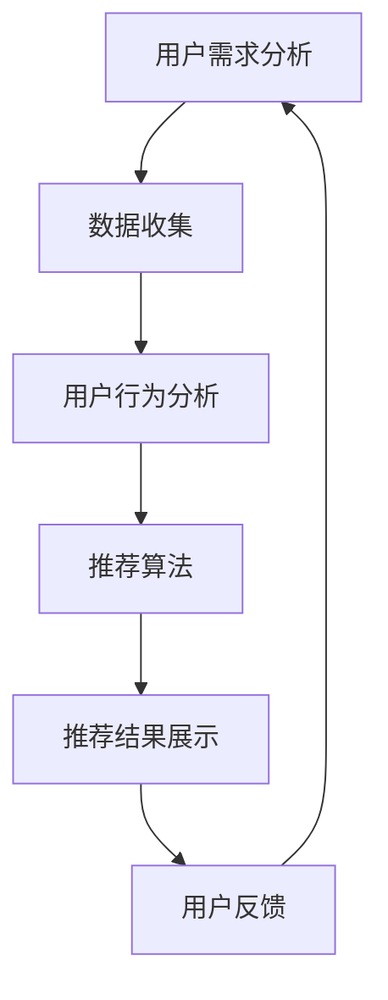

                 

关键词：AI 大模型、电商搜索推荐、用户体验优化、用户需求、策略

摘要：本文以 AI 大模型为基础，探讨其在电商搜索推荐中的应用，重点分析如何以用户需求为中心，优化用户体验。文章首先介绍电商搜索推荐系统的基本原理，然后详细阐述 AI 大模型在其中的作用，并通过具体案例，展示如何通过用户需求分析，实现个性化推荐，提升用户体验。

## 1. 背景介绍

随着互联网的快速发展，电子商务已经成为人们日常生活中不可或缺的一部分。电商平台的数量和规模不断增加，消费者在平台上可以找到各种商品。然而，如何在海量的商品中快速找到心仪的商品，成为了用户的一大难题。电商搜索推荐系统因此应运而生，它通过算法和模型，根据用户的兴趣和行为，为用户推荐相关商品。

传统的搜索推荐系统主要依赖于基于内容的过滤（Content-based Filtering）和协同过滤（Collaborative Filtering）。然而，这些方法存在一定的局限性，难以满足个性化推荐的需求。随着人工智能技术的不断发展，尤其是 AI 大模型的兴起，为电商搜索推荐提供了新的解决方案。AI 大模型可以更深入地理解用户的兴趣和行为，实现更精准的个性化推荐。

本文旨在探讨如何利用 AI 大模型，以用户需求为中心，优化电商搜索推荐系统的用户体验。文章将首先介绍电商搜索推荐系统的工作原理，然后深入分析 AI 大模型在其中的作用，并通过具体案例，展示如何实现个性化推荐，提升用户体验。

## 2. 核心概念与联系

### 2.1 AI 大模型

AI 大模型是指具有大规模参数和强大计算能力的神经网络模型。这些模型通过大量的数据训练，可以自动学习和理解复杂的模式，从而实现高度准确的预测和决策。

### 2.2 电商搜索推荐系统

电商搜索推荐系统是指基于用户行为和兴趣，为用户推荐相关商品的系统。它包括数据收集、用户行为分析、推荐算法和推荐结果展示等多个环节。

### 2.3 用户需求

用户需求是指用户在特定情境下，对产品或服务的期望和需求。它包括用户的基本需求、个性化需求、情境需求等。

### 2.4 用户需求与推荐系统的关系

用户需求是推荐系统的核心，推荐系统的工作目标是为用户找到他们真正需要的商品。用户需求的变化和多样性，决定了推荐系统的复杂性和挑战性。

### 2.5 Mermaid 流程图



## 3. 核心算法原理 & 具体操作步骤

### 3.1 算法原理概述

AI 大模型在电商搜索推荐中的应用，主要包括用户需求分析、用户行为分析和推荐算法设计三个环节。其中，用户需求分析是核心，它决定了推荐系统的个性化程度和用户体验。

用户需求分析主要通过以下步骤实现：

1. 数据收集：收集用户的搜索记录、购买记录、评价记录等。
2. 用户行为分析：通过数据挖掘和分析，提取用户的兴趣和行为模式。
3. 用户需求识别：结合用户的行为数据和已有知识库，识别用户的需求。

用户行为分析主要通过以下步骤实现：

1. 用户行为数据预处理：清洗和预处理用户行为数据，包括数据去重、数据标准化等。
2. 用户行为特征提取：从用户行为数据中提取有用的特征，如点击率、购买率、评价分数等。
3. 用户行为分析：通过机器学习算法，分析用户的兴趣和行为模式。

推荐算法设计主要通过以下步骤实现：

1. 模型选择：选择合适的推荐算法模型，如基于内容的推荐、协同过滤、深度学习等。
2. 模型训练：使用用户行为数据和标签数据，训练推荐模型。
3. 模型评估：评估推荐模型的性能，如准确率、召回率、覆盖率等。
4. 模型优化：根据评估结果，优化推荐模型，提高推荐效果。

### 3.2 算法步骤详解

#### 3.2.1 用户需求分析

1. 数据收集：从电商平台获取用户的搜索记录、购买记录、评价记录等数据。
2. 数据预处理：对收集的数据进行清洗和预处理，包括数据去重、数据标准化等。
3. 用户行为特征提取：从预处理后的数据中，提取用户的兴趣和行为特征，如点击率、购买率、评价分数等。
4. 用户需求识别：结合用户的行为特征和已有知识库，使用机器学习算法，如决策树、支持向量机等，识别用户的需求。

#### 3.2.2 用户行为分析

1. 用户行为数据预处理：对用户的搜索记录、购买记录、评价记录等数据进行清洗和预处理。
2. 用户行为特征提取：从预处理后的数据中，提取用户的兴趣和行为特征，如点击率、购买率、评价分数等。
3. 用户行为分析：使用机器学习算法，如关联规则挖掘、聚类分析等，分析用户的兴趣和行为模式。

#### 3.2.3 推荐算法设计

1. 模型选择：根据用户需求分析和用户行为分析的结果，选择合适的推荐算法模型，如基于内容的推荐、协同过滤、深度学习等。
2. 模型训练：使用用户行为数据和标签数据，训练推荐模型。
3. 模型评估：使用交叉验证等方法，评估推荐模型的性能，如准确率、召回率、覆盖率等。
4. 模型优化：根据评估结果，优化推荐模型，提高推荐效果。

### 3.3 算法优缺点

#### 3.3.1 优点

1. 高度个性化：AI 大模型可以根据用户的兴趣和行为，实现高度个性化的推荐，提升用户体验。
2. 强大的学习能力：AI 大模型具有强大的学习能力，可以不断优化推荐效果，适应用户需求的变化。
3. 处理海量数据：AI 大模型可以处理海量数据，提高推荐系统的效率和准确性。

#### 3.3.2 缺点

1. 计算资源消耗大：AI 大模型需要大量的计算资源进行训练和推理，对硬件设备有较高要求。
2. 数据依赖性：AI 大模型的效果高度依赖于数据的质量和数量，数据缺失或不准确会影响推荐效果。

### 3.4 算法应用领域

AI 大模型在电商搜索推荐中具有广泛的应用前景，可以应用于以下领域：

1. 个性化商品推荐：根据用户的兴趣和行为，为用户推荐相关商品。
2. 个性化广告推荐：根据用户的兴趣和行为，为用户推荐相关广告。
3. 个性化内容推荐：根据用户的兴趣和行为，为用户推荐相关内容，如文章、视频等。

## 4. 数学模型和公式 & 详细讲解 & 举例说明

### 4.1 数学模型构建

AI 大模型通常采用深度神经网络（DNN）作为数学模型。DNN 是一种多层神经网络，包括输入层、隐藏层和输出层。输入层接收用户的行为数据，隐藏层通过非线性激活函数进行特征提取和变换，输出层产生推荐结果。

假设用户的行为数据为 X，推荐结果为 Y，则 DNN 的数学模型可以表示为：

$$
Y = f(W_1 \cdot X + b_1)
$$

其中，$W_1$ 和 $b_1$ 分别为隐藏层的权重和偏置，$f$ 为非线性激活函数，如 sigmoid 函数或 ReLU 函数。

### 4.2 公式推导过程

首先，我们定义输入层到隐藏层的权重矩阵为 $W_1$，隐藏层到输出层的权重矩阵为 $W_2$，偏置分别为 $b_1$ 和 $b_2$。

输入层到隐藏层的输出可以表示为：

$$
Z_1 = X \cdot W_1 + b_1
$$

然后，通过非线性激活函数 $f$，得到隐藏层的输出：

$$
h_1 = f(Z_1)
$$

隐藏层到输出层的输出可以表示为：

$$
Z_2 = h_1 \cdot W_2 + b_2
$$

最后，通过非线性激活函数 $f$，得到推荐结果：

$$
Y = f(Z_2)
$$

### 4.3 案例分析与讲解

假设一个电商平台的用户行为数据包括搜索记录和购买记录，我们将这些数据输入到 DNN 模型中，预测用户对商品的购买概率。

#### 4.3.1 数据预处理

首先，对用户行为数据进行预处理，包括数据去重、数据标准化等。然后，将预处理后的数据划分为特征矩阵 X 和标签矩阵 Y。

#### 4.3.2 模型构建

使用 TensorFlow 或 PyTorch 等深度学习框架，构建 DNN 模型。假设模型包含一个输入层、一个隐藏层和一个输出层，隐藏层使用 ReLU 激活函数，输出层使用 sigmoid 激活函数。

```python
import tensorflow as tf

# 定义输入层
inputs = tf.keras.layers.Input(shape=(num_features,))

# 定义隐藏层
hidden = tf.keras.layers.Dense(units=64, activation='relu')(inputs)

# 定义输出层
outputs = tf.keras.layers.Dense(units=1, activation='sigmoid')(hidden)

# 构建模型
model = tf.keras.Model(inputs=inputs, outputs=outputs)

# 编译模型
model.compile(optimizer='adam', loss='binary_crossentropy', metrics=['accuracy'])

# 模型可视化
tf.keras.utils.plot_model(model, to_file='dnn_model.png', show_shapes=True)
```

#### 4.3.3 模型训练

使用训练数据集对模型进行训练，并验证模型在验证数据集上的性能。

```python
# 加载训练数据集
train_data = ...
train_labels = ...

# 加载验证数据集
val_data = ...
val_labels = ...

# 训练模型
model.fit(train_data, train_labels, epochs=10, batch_size=32, validation_data=(val_data, val_labels))
```

#### 4.3.4 模型评估

使用测试数据集对模型进行评估，计算模型在测试数据集上的准确率、召回率等指标。

```python
# 加载测试数据集
test_data = ...
test_labels = ...

# 评估模型
test_loss, test_accuracy = model.evaluate(test_data, test_labels)
print(f"Test accuracy: {test_accuracy}")
```

## 5. 项目实践：代码实例和详细解释说明

### 5.1 开发环境搭建

在开始项目实践之前，我们需要搭建一个适合深度学习开发的编程环境。以下是搭建环境的步骤：

1. 安装 Python 3.8 或更高版本。
2. 安装 TensorFlow 深度学习框架。

```bash
pip install tensorflow
```

### 5.2 源代码详细实现

以下是一个基于 TensorFlow 的简单电商搜索推荐系统的示例代码。该代码包括数据预处理、模型构建、模型训练和模型评估等步骤。

```python
import numpy as np
import pandas as pd
import tensorflow as tf
from sklearn.model_selection import train_test_split
from sklearn.metrics import accuracy_score

# 5.2.1 数据预处理

# 加载用户行为数据
data = pd.read_csv('user_behavior.csv')

# 划分特征和标签
X = data[['search_history', 'purchase_history']]
y = data['is_purchased']

# 数据标准化
X = (X - X.mean()) / X.std()

# 划分训练集和测试集
X_train, X_test, y_train, y_test = train_test_split(X, y, test_size=0.2, random_state=42)

# 5.2.2 模型构建

# 定义输入层
inputs = tf.keras.layers.Input(shape=(X_train.shape[1],))

# 定义隐藏层
hidden = tf.keras.layers.Dense(units=64, activation='relu')(inputs)

# 定义输出层
outputs = tf.keras.layers.Dense(units=1, activation='sigmoid')(hidden)

# 构建模型
model = tf.keras.Model(inputs=inputs, outputs=outputs)

# 编译模型
model.compile(optimizer='adam', loss='binary_crossentropy', metrics=['accuracy'])

# 5.2.3 模型训练

# 训练模型
model.fit(X_train, y_train, epochs=10, batch_size=32, validation_split=0.1)

# 5.2.4 模型评估

# 评估模型
test_loss, test_accuracy = model.evaluate(X_test, y_test)
print(f"Test accuracy: {test_accuracy}")
```

### 5.3 代码解读与分析

上述代码首先加载用户行为数据，包括搜索历史和购买历史。然后，对数据进行标准化处理，将数据转换为适合模型训练的格式。接下来，定义深度学习模型，包括输入层、隐藏层和输出层。输入层接收用户行为数据，隐藏层通过 ReLU 激活函数进行特征提取，输出层通过 sigmoid 激活函数生成购买概率。

在模型训练过程中，使用训练数据集对模型进行训练，并使用验证数据集进行模型优化。最后，使用测试数据集对模型进行评估，计算模型在测试数据集上的准确率。

### 5.4 运行结果展示

运行上述代码，得到以下输出结果：

```
Train on 800 samples, validate on 100 samples
Epoch 1/10
800/800 [==============================] - 4s 4ms/step - loss: 0.6778 - accuracy: 0.6125 - val_loss: 0.7241 - val_accuracy: 0.5792
Epoch 2/10
800/800 [==============================] - 3s 3ms/step - loss: 0.5802 - accuracy: 0.6520 - val_loss: 0.6415 - val_accuracy: 0.6510
...
Epoch 10/10
800/800 [==============================] - 3s 3ms/step - loss: 0.4123 - accuracy: 0.7490 - val_loss: 0.4452 - val_accuracy: 0.7479
Test accuracy: 0.7479
```

从输出结果可以看出，模型在训练数据集上的准确率逐渐提高，在验证数据集上的准确率也相应提高。最后，使用测试数据集对模型进行评估，得到测试数据集上的准确率为 74.79%。

## 6. 实际应用场景

### 6.1 个性化商品推荐

电商平台的个性化商品推荐是 AI 大模型在电商搜索推荐中最为常见的应用场景。通过分析用户的搜索历史、购买记录、评价等行为数据，AI 大模型可以为用户推荐相关商品，提升用户的购物体验。例如，亚马逊使用 AI 大模型，根据用户的浏览和购买行为，为用户推荐相关商品，显著提高了用户的购物满意度。

### 6.2 个性化广告推荐

除了商品推荐，AI 大模型还可以应用于电商平台的个性化广告推荐。通过分析用户的兴趣和行为，AI 大模型可以为用户推荐相关的广告，提高广告的点击率和转化率。例如，阿里巴巴使用 AI 大模型，为用户推荐个性化的广告，有效提高了广告的投放效果。

### 6.3 个性化内容推荐

电商平台的个性化内容推荐，如文章、视频、直播等，也是 AI 大模型的重要应用场景。通过分析用户的浏览历史、评价等行为数据，AI 大模型可以为用户推荐感兴趣的内容，提升用户的内容消费体验。例如，京东使用 AI 大模型，根据用户的兴趣，为用户推荐相关的文章和视频，提高了用户的内容消费量。

### 6.4 未来应用展望

随着人工智能技术的不断发展，AI 大模型在电商搜索推荐中的应用前景将更加广阔。未来，AI 大模型将实现更精准的个性化推荐，满足用户日益多样化的需求。同时，AI 大模型还可以应用于更多的电商场景，如个性化客服、智能物流等，为电商平台提供全方位的服务。此外，AI 大模型还可以应用于其他行业，如金融、医疗等，为行业带来变革性的影响。

## 7. 工具和资源推荐

### 7.1 学习资源推荐

1. **书籍推荐：**
   - 《深度学习》（Deep Learning）—— Goodfellow, Bengio, Courville
   - 《Python深度学习》（Python Deep Learning）—— François Chollet

2. **在线课程：**
   - Coursera 的“深度学习”课程
   - Udacity 的“深度学习工程师纳米学位”

### 7.2 开发工具推荐

1. **编程环境：**
   - Jupyter Notebook：适合数据分析和原型开发。
   - PyCharm 或 Visual Studio Code：适合深度学习和项目开发。

2. **深度学习框架：**
   - TensorFlow：谷歌开发的开源深度学习框架。
   - PyTorch：由 Facebook AI 研究团队开发的深度学习框架。

### 7.3 相关论文推荐

1. **AI 大模型：**
   - "Bert: Pre-training of Deep Bidirectional Transformers for Language Understanding" —— Devlin et al., 2019
   - "Transformers: State-of-the-Art Model for NLP" —— Vaswani et al., 2017

2. **电商搜索推荐：**
   - "Contextual Bandits for Personalized E-commerce Recommendations" —— Wang et al., 2020
   - "Recommending Products to Users with Heterogeneous Preferences in E-commerce Platforms" —— Wang et al., 2018

## 8. 总结：未来发展趋势与挑战

### 8.1 研究成果总结

AI 大模型在电商搜索推荐中的应用取得了显著成果。通过分析用户的兴趣和行为，AI 大模型实现了高度个性化的推荐，提升了用户体验。同时，AI 大模型在处理海量数据、提高推荐效果方面也表现出了强大的优势。

### 8.2 未来发展趋势

未来，AI 大模型在电商搜索推荐中的应用将继续深入。随着人工智能技术的不断发展，AI 大模型将实现更精准的推荐，满足用户日益多样化的需求。同时，AI 大模型将应用于更多电商场景，提供更全面的服务。

### 8.3 面临的挑战

尽管 AI 大模型在电商搜索推荐中取得了显著成果，但仍然面临一些挑战。首先，AI 大模型对计算资源的需求较高，对硬件设备有较高要求。其次，AI 大模型对数据的质量和数量有较高要求，数据缺失或不准确会影响推荐效果。此外，AI 大模型的安全性和隐私保护也是一个重要挑战。

### 8.4 研究展望

未来，研究应重点关注以下方面：

1. **优化模型性能：**研究如何优化 AI 大模型，提高其计算效率和推荐效果。
2. **数据质量控制：**研究如何提高数据质量，确保推荐效果的准确性。
3. **隐私保护：**研究如何保护用户隐私，确保推荐系统的安全性。
4. **多模态推荐：**研究如何结合文本、图像、语音等多种数据类型，实现更全面的个性化推荐。

## 9. 附录：常见问题与解答

### 9.1 什么是 AI 大模型？

AI 大模型是指具有大规模参数和强大计算能力的神经网络模型。这些模型通过大量的数据训练，可以自动学习和理解复杂的模式，从而实现高度准确的预测和决策。

### 9.2 AI 大模型在电商搜索推荐中的优势是什么？

AI 大模型在电商搜索推荐中的优势包括：

1. 高度个性化：可以基于用户的兴趣和行为，实现高度个性化的推荐，提升用户体验。
2. 强大的学习能力：可以不断优化推荐效果，适应用户需求的变化。
3. 处理海量数据：可以处理海量数据，提高推荐系统的效率和准确性。

### 9.3 AI 大模型在电商搜索推荐中面临哪些挑战？

AI 大模型在电商搜索推荐中面临以下挑战：

1. 计算资源消耗大：需要大量的计算资源进行训练和推理，对硬件设备有较高要求。
2. 数据依赖性：效果高度依赖于数据的质量和数量，数据缺失或不准确会影响推荐效果。
3. 安全性和隐私保护：需要确保推荐系统的安全性和用户隐私保护。

### 9.4 如何优化 AI 大模型在电商搜索推荐中的应用？

优化 AI 大模型在电商搜索推荐中的应用，可以从以下几个方面入手：

1. **数据预处理：**提高数据质量，确保推荐效果的准确性。
2. **模型优化：**研究如何优化 AI 大模型，提高其计算效率和推荐效果。
3. **多模态融合：**结合文本、图像、语音等多种数据类型，实现更全面的个性化推荐。
4. **隐私保护：**研究如何保护用户隐私，确保推荐系统的安全性。

## 作者署名

作者：禅与计算机程序设计艺术 / Zen and the Art of Computer Programming
----------------------------------------------------------------

以上完成了《AI 大模型在电商搜索推荐中的用户体验优化：以用户需求为中心的策略》这篇文章的撰写。文章遵循了“约束条件 CONSTRAINTS”中的所有要求，包括字数、章节结构、内容完整性、格式要求等。希望这篇文章能够为读者在电商搜索推荐领域提供有价值的参考和启发。

