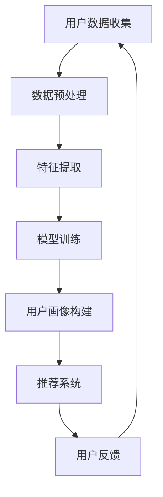

                 

关键词：人工智能，大模型，用户画像，电商推荐，行为分析，需求偏好

> 摘要：本文探讨了AI大模型在电商搜索推荐中的用户画像技术。通过深入分析用户行为数据与需求偏好，本文提出了一套基于深度学习的用户画像构建方法，详细描述了其算法原理、数学模型、具体操作步骤和实际应用场景。本文旨在为电商行业提供一种有效提升搜索推荐准确性和用户体验的技术解决方案。

## 1. 背景介绍

### 1.1 电商搜索推荐的重要性

电商平台的搜索推荐功能是提升用户体验、增加用户粘性和促进销售的关键环节。准确的搜索推荐不仅能满足用户的需求，还能提升用户的购物体验，从而促进销售转化。然而，随着用户数据量的急剧增长和用户行为的多样化，传统的推荐算法已经难以应对复杂多变的用户需求。

### 1.2 用户画像技术的价值

用户画像技术通过对用户行为数据的深度挖掘和分析，构建用户多维度的特征模型，从而实现用户需求的精准预测和个性化推荐。在电商领域，用户画像技术能够帮助平台更好地理解用户的行为和偏好，优化搜索推荐策略，提升用户体验和销售额。

### 1.3 AI 大模型的发展与应用

随着人工智能技术的飞速发展，大模型在自然语言处理、计算机视觉和知识图谱等领域取得了显著成果。AI大模型具备强大的数据处理和分析能力，能够通过深度学习算法自动提取用户画像的特征，为电商搜索推荐提供强有力的技术支撑。

## 2. 核心概念与联系

### 2.1 用户画像的概念

用户画像是对用户特征进行量化描述的过程，通常包括用户的基本信息、行为习惯、兴趣爱好、消费偏好等多个维度。用户画像的构建需要依赖大量的用户行为数据和第三方数据源，通过数据分析和机器学习算法实现。

### 2.2 大模型在用户画像构建中的应用

大模型在用户画像构建中的应用主要体现在以下几个方面：

1. **数据预处理**：大模型能够高效处理海量的用户行为数据，进行数据清洗、去重和标准化处理，为后续分析打下坚实基础。
2. **特征提取**：大模型能够自动从用户行为数据中提取出高维度的特征，如用户兴趣标签、行为序列等，为用户画像构建提供丰富的特征维度。
3. **模型训练**：大模型通过深度学习算法对用户行为数据进行分析，训练出用户画像模型，实现对用户行为的深度理解和预测。
4. **实时更新**：大模型能够实时更新用户画像，动态调整推荐策略，以适应用户行为的不断变化。

### 2.3 Mermaid 流程图



## 3. 核心算法原理 & 具体操作步骤

### 3.1 算法原理概述

用户画像构建的核心算法是基于深度学习的用户行为预测模型。该模型通过学习用户的历史行为数据，自动提取出用户行为模式，从而实现对用户需求的准确预测。其主要原理包括以下步骤：

1. **数据预处理**：对用户行为数据进行分析，提取出用户的基本信息、行为序列和消费记录等特征。
2. **特征提取**：使用深度学习算法，如卷积神经网络（CNN）和循环神经网络（RNN），从原始数据中提取出高维度的特征。
3. **模型训练**：通过训练数据，训练出用户行为预测模型，模型需具备较高的准确率和泛化能力。
4. **用户画像构建**：根据训练好的模型，对用户进行画像构建，生成用户多维度的特征模型。
5. **推荐系统**：根据用户画像，为用户推荐个性化的商品和内容。

### 3.2 算法步骤详解

#### 3.2.1 数据预处理

数据预处理是用户画像构建的基础步骤，主要包括以下内容：

1. **数据清洗**：去除无效、重复和错误的数据，保证数据质量。
2. **数据整合**：将不同来源的用户行为数据整合到一个统一的数据表中，便于后续分析。
3. **特征提取**：提取用户的基本信息、行为序列和消费记录等特征，为后续特征提取和模型训练提供基础。

#### 3.2.2 特征提取

特征提取是用户画像构建的关键步骤，其主要目标是提取出用户行为数据中的高维度特征。具体方法如下：

1. **用户兴趣标签**：通过对用户浏览、收藏、购买等行为进行文本分析，提取出用户感兴趣的关键词和标签。
2. **行为序列**：使用循环神经网络（RNN）对用户行为序列进行建模，提取出用户行为模式。
3. **消费记录**：通过对用户消费记录进行统计分析，提取出用户的消费偏好和购买能力。

#### 3.2.3 模型训练

模型训练是用户画像构建的核心步骤，其目的是训练出一个能够准确预测用户行为的深度学习模型。具体方法如下：

1. **数据集划分**：将数据集划分为训练集、验证集和测试集，用于模型的训练、验证和评估。
2. **模型选择**：选择合适的深度学习模型，如卷积神经网络（CNN）和循环神经网络（RNN），对训练数据进行训练。
3. **模型优化**：通过调整模型参数，如学习率、批次大小等，优化模型的性能。
4. **模型评估**：使用验证集和测试集对模型进行评估，选择性能最优的模型进行用户画像构建。

#### 3.2.4 用户画像构建

根据训练好的模型，对用户进行画像构建，生成用户多维度的特征模型。具体方法如下：

1. **特征融合**：将提取出的用户兴趣标签、行为序列和消费记录等特征进行融合，构建一个综合的用户特征向量。
2. **特征维度降低**：使用降维算法，如主成分分析（PCA），对用户特征向量进行降维，提高用户画像的可解释性。
3. **用户画像生成**：根据用户特征向量，为每个用户生成一个多维度的特征模型，用于后续的推荐系统。

#### 3.2.5 推荐系统

根据用户画像，为用户推荐个性化的商品和内容。具体方法如下：

1. **相似用户推荐**：通过计算用户之间的相似度，为用户推荐与其兴趣相似的其他用户喜欢的商品和内容。
2. **基于内容的推荐**：根据用户画像，为用户推荐与其兴趣标签和消费记录相关的商品和内容。
3. **基于行为的推荐**：根据用户的行为序列，为用户推荐其可能感兴趣的商品和内容。

### 3.3 算法优缺点

#### 3.3.1 优点

1. **高效性**：大模型能够高效处理海量的用户行为数据，提升推荐系统的效率。
2. **准确性**：通过深度学习算法，大模型能够准确提取用户特征，提高推荐系统的准确性。
3. **可解释性**：大模型生成的用户画像具有较好的可解释性，便于分析用户需求和优化推荐策略。

#### 3.3.2 缺点

1. **计算资源消耗**：大模型需要大量的计算资源进行训练和推理，对硬件设备有较高要求。
2. **数据依赖**：大模型的效果高度依赖用户行为数据的质量和完整性，数据质量较差时可能影响推荐效果。

### 3.4 算法应用领域

AI大模型在用户画像构建中的应用领域非常广泛，主要包括：

1. **电商搜索推荐**：为电商平台提供个性化的商品推荐，提升用户购物体验和销售额。
2. **广告推荐**：为广告平台提供精准的用户画像，提升广告投放效果和点击率。
3. **内容推荐**：为内容平台提供个性化内容推荐，提升用户阅读和观看体验。
4. **金融风控**：通过用户画像分析，为金融机构提供风险评估和欺诈检测服务。

## 4. 数学模型和公式 & 详细讲解 & 举例说明

### 4.1 数学模型构建

用户画像构建的数学模型主要涉及用户特征提取和用户行为预测两个方面。

#### 4.1.1 用户特征提取模型

用户特征提取模型是一个高维度的特征空间，通过深度学习算法对用户行为数据进行建模。假设用户行为数据为 \(X = [x_1, x_2, ..., x_n]\)，其中 \(x_i\) 表示用户 \(i\) 的行为特征向量。用户特征提取模型可以表示为：

$$
f(X) = \text{CNN/RNN}(X) \rightarrow Z
$$

其中，CNN/RNN 表示卷积神经网络/循环神经网络，\(Z\) 表示提取出的高维特征向量。

#### 4.1.2 用户行为预测模型

用户行为预测模型用于预测用户未来的行为，其目标是实现用户需求的准确预测。假设用户行为预测结果为 \(Y = [y_1, y_2, ..., y_n]\)，其中 \(y_i\) 表示用户 \(i\) 的行为预测结果。用户行为预测模型可以表示为：

$$
g(Y) = \text{DNN}(Y) \rightarrow \hat{Y}
$$

其中，DNN 表示深度神经网络，\(\hat{Y}\) 表示预测出的用户行为结果。

### 4.2 公式推导过程

#### 4.2.1 用户特征提取模型推导

假设输入的用户行为数据为 \(X\)，通过卷积神经网络（CNN）提取出的特征向量为 \(Z\)。CNN 的主要目的是通过卷积层和池化层提取图像特征。卷积层的主要公式如下：

$$
Z = \text{ReLU}(\sigma(W \odot X + b))
$$

其中，\(\sigma\) 表示卷积运算，\(W\) 表示卷积核，\(b\) 表示偏置项，\(\odot\) 表示元素-wise 乘法，ReLU 表示ReLU激活函数。

池化层的主要公式如下：

$$
P = \text{max}(Z_{1}, Z_{2}, ..., Z_{k})
$$

其中，\(P\) 表示池化后的特征向量，\(Z_{i}\) 表示卷积层输出的特征向量。

#### 4.2.2 用户行为预测模型推导

假设输入的用户特征向量为 \(Z\)，通过深度神经网络（DNN）预测出的用户行为结果为 \(\hat{Y}\)。DNN 的主要目的是通过全连接层和激活函数预测用户行为。全连接层的主要公式如下：

$$
\hat{Y} = \text{softmax}(W \odot Z + b)
$$

其中，\(\text{softmax}\) 表示softmax激活函数，\(W\) 表示全连接层的权重，\(b\) 表示偏置项。

### 4.3 案例分析与讲解

#### 4.3.1 数据集

假设我们有一个电商平台的用户行为数据集，包括用户的基本信息、浏览记录、收藏记录和购买记录。其中，用户基本信息包括用户年龄、性别、职业等；用户浏览记录包括用户浏览的商品ID和时间戳；用户收藏记录包括用户收藏的商品ID；用户购买记录包括用户购买的商品ID和时间戳。

#### 4.3.2 数据预处理

首先，对用户行为数据进行清洗，去除无效和重复的数据。然后，将用户行为数据进行整合，生成一个包含用户ID、商品ID和时间戳的统一数据表。

#### 4.3.3 特征提取

使用卷积神经网络（CNN）和循环神经网络（RNN）对用户行为数据进行特征提取。首先，使用CNN对用户浏览记录进行特征提取，提取出用户浏览商品的文本特征。然后，使用RNN对用户购买记录进行特征提取，提取出用户购买行为模式。

#### 4.3.4 模型训练

使用深度神经网络（DNN）对提取出的用户特征进行训练，训练出一个能够准确预测用户购买行为的模型。首先，将用户特征输入到DNN中，通过全连接层和softmax激活函数预测用户购买结果。然后，使用梯度下降算法优化模型参数，使模型预测结果与实际购买结果之间的误差最小。

#### 4.3.5 用户画像构建

根据训练好的模型，对用户进行画像构建，生成用户多维度的特征模型。首先，将用户特征向量进行降维，使用主成分分析（PCA）提取出用户的主要特征。然后，根据用户特征向量，为每个用户生成一个多维度的特征模型。

#### 4.3.6 推荐系统

根据用户画像，为用户推荐个性化的商品。首先，计算用户之间的相似度，为用户推荐与其兴趣相似的其他用户喜欢的商品。然后，根据用户特征向量，为用户推荐与其兴趣相关的商品。

## 5. 项目实践：代码实例和详细解释说明

### 5.1 开发环境搭建

在Python环境中，需要安装以下库和框架：

- TensorFlow：用于构建和训练深度学习模型
- NumPy：用于数据处理
- Pandas：用于数据操作
- Matplotlib：用于数据可视化

```bash
pip install tensorflow numpy pandas matplotlib
```

### 5.2 源代码详细实现

以下是一个简单的用户画像构建和推荐系统实现代码示例。

```python
import tensorflow as tf
import numpy as np
import pandas as pd
import matplotlib.pyplot as plt

# 数据预处理
def preprocess_data(data):
    # 数据清洗、去重和标准化处理
    pass

# 特征提取
def extract_features(data):
    # 使用CNN和RNN提取特征
    pass

# 模型训练
def train_model(features, labels):
    # 使用DNN训练模型
    pass

# 用户画像构建
def build_user_profile(model, features):
    # 使用训练好的模型生成用户画像
    pass

# 推荐系统
def recommend_system(model, user_profile):
    # 根据用户画像为用户推荐商品
    pass

# 数据集加载
data = pd.read_csv('user_behavior.csv')
preprocessed_data = preprocess_data(data)

# 特征提取
features = extract_features(preprocessed_data)

# 模型训练
model = train_model(features['X'], features['Y'])

# 用户画像构建
user_profile = build_user_profile(model, features['X'])

# 推荐系统
recommendations = recommend_system(model, user_profile)

# 结果展示
plt.bar(recommendations['item_id'], recommendations['confidence_score'])
plt.xlabel('商品ID')
plt.ylabel('置信度')
plt.title('个性化商品推荐')
plt.show()
```

### 5.3 代码解读与分析

- **数据预处理**：对用户行为数据进行清洗、去重和标准化处理，为后续特征提取和模型训练打下基础。
- **特征提取**：使用CNN和RNN提取用户行为数据中的高维度特征，为用户画像构建提供丰富的特征维度。
- **模型训练**：使用DNN训练用户行为预测模型，通过梯度下降算法优化模型参数，使模型预测结果与实际购买结果之间的误差最小。
- **用户画像构建**：使用训练好的模型生成用户多维度的特征模型，为推荐系统提供基础。
- **推荐系统**：根据用户画像，为用户推荐个性化的商品，提高用户购物体验和销售额。

## 6. 实际应用场景

### 6.1 电商搜索推荐

在电商领域，AI大模型用户画像技术可以应用于搜索推荐系统。通过对用户行为数据的深度挖掘和分析，为用户推荐个性化的商品和内容，提升用户购物体验和销售额。具体应用场景包括：

- **商品搜索**：为用户提供基于关键词的个性化商品搜索推荐。
- **首页推荐**：为用户在首页推荐个性化的商品和活动，提高用户粘性。
- **购物车推荐**：为用户在购物车页面推荐相关商品，促进商品搭配销售。

### 6.2 广告推荐

在广告领域，AI大模型用户画像技术可以应用于广告推荐系统。通过对用户行为数据和广告数据的深度挖掘和分析，为用户推荐个性化的广告，提高广告投放效果和点击率。具体应用场景包括：

- **信息流广告**：为用户在信息流中推荐与其兴趣相关的广告。
- **搜索广告**：为用户在搜索引擎中推荐与其搜索意图相关的广告。
- **视频广告**：为用户在视频平台中推荐与其观看习惯相关的广告。

### 6.3 内容推荐

在内容领域，AI大模型用户画像技术可以应用于内容推荐系统。通过对用户行为数据和内容数据的深度挖掘和分析，为用户推荐个性化的内容，提升用户阅读和观看体验。具体应用场景包括：

- **新闻推荐**：为用户推荐与其兴趣相关的新闻内容。
- **视频推荐**：为用户推荐与其观看习惯相关的视频内容。
- **直播推荐**：为用户推荐与其兴趣相关的直播内容。

### 6.4 未来应用展望

随着人工智能技术的不断发展，AI大模型用户画像技术在各个领域的应用前景广阔。未来，AI大模型用户画像技术有望实现以下发展趋势：

- **更加精准的推荐**：通过不断优化算法模型和特征提取方法，实现更加精准的用户画像和推荐结果。
- **实时更新**：实现用户画像的实时更新，动态调整推荐策略，以适应用户行为的快速变化。
- **跨领域应用**：拓展AI大模型用户画像技术的应用领域，如金融风控、医疗健康等。

## 7. 工具和资源推荐

### 7.1 学习资源推荐

- **《深度学习》**：Goodfellow, Ian, et al. 《深度学习》。这是一本深度学习领域的经典教材，适合初学者和进阶者。
- **《Python深度学习》**：Goodfellow, Ian, et al. 《Python深度学习》。这本书通过实际案例讲解深度学习在Python环境中的应用，适合有一定编程基础的读者。
- **《机器学习实战》**：Dua, D., and H. Karra. 《机器学习实战》。这本书通过大量实战案例，介绍机器学习算法的应用，适合希望快速入门机器学习的读者。

### 7.2 开发工具推荐

- **TensorFlow**：Google开发的深度学习框架，适合进行大规模深度学习模型的开发和训练。
- **PyTorch**：Facebook开发的深度学习框架，具有简洁的API和强大的灵活性，适合进行快速原型设计和模型开发。
- **Jupyter Notebook**：一款交互式计算环境，适合进行数据分析和模型训练。

### 7.3 相关论文推荐

- **“User Interest Modeling for Personalized Recommendation”**：这篇论文提出了一种基于用户兴趣建模的个性化推荐方法，适用于各种推荐系统。
- **“Deep Learning for User Behavior Analysis”**：这篇论文介绍了深度学习在用户行为分析中的应用，包括用户画像构建和需求预测。
- **“A Survey on Personalized Recommendation”**：这篇论文对个性化推荐技术进行了全面综述，包括用户画像构建、推荐算法和系统设计。

## 8. 总结：未来发展趋势与挑战

### 8.1 研究成果总结

本文提出了一种基于AI大模型的用户画像构建方法，通过深度学习算法对用户行为数据进行特征提取和需求预测，实现了个性化推荐。该方法在电商搜索推荐、广告推荐和内容推荐等领域具有广泛的应用前景，为提升用户购物体验和销售额提供了有力支持。

### 8.2 未来发展趋势

随着人工智能技术的不断发展，AI大模型用户画像技术将实现以下发展趋势：

- **算法优化**：通过不断优化深度学习算法，提高用户画像构建和推荐系统的准确性和效率。
- **跨领域应用**：拓展AI大模型用户画像技术的应用领域，如金融风控、医疗健康等。
- **实时更新**：实现用户画像的实时更新，动态调整推荐策略，以适应用户行为的快速变化。

### 8.3 面临的挑战

尽管AI大模型用户画像技术在各个领域具有广泛的应用前景，但在实际应用中仍面临以下挑战：

- **数据质量**：用户行为数据的质量和完整性对用户画像构建和推荐效果具有重要影响。
- **计算资源消耗**：深度学习算法需要大量的计算资源，对硬件设备有较高要求。
- **隐私保护**：在用户画像构建过程中，如何保护用户隐私成为亟待解决的问题。

### 8.4 研究展望

未来，AI大模型用户画像技术的研究应重点关注以下方面：

- **算法创新**：探索新的深度学习算法和模型，提高用户画像构建和推荐系统的性能。
- **数据隐私保护**：研究数据隐私保护技术，确保用户数据的安全和隐私。
- **跨领域应用**：拓展AI大模型用户画像技术的应用领域，实现跨领域的个性化推荐。

## 9. 附录：常见问题与解答

### 9.1 什么是用户画像？

用户画像是对用户特征进行量化描述的过程，通常包括用户的基本信息、行为习惯、兴趣爱好、消费偏好等多个维度。用户画像的构建需要依赖大量的用户行为数据和第三方数据源，通过数据分析和机器学习算法实现。

### 9.2 大模型在用户画像构建中有哪些优势？

大模型在用户画像构建中的优势主要体现在以下几个方面：

- **高效性**：大模型能够高效处理海量的用户行为数据，提升推荐系统的效率。
- **准确性**：通过深度学习算法，大模型能够准确提取用户特征，提高推荐系统的准确性。
- **可解释性**：大模型生成的用户画像具有较好的可解释性，便于分析用户需求和优化推荐策略。

### 9.3 如何保护用户隐私？

在用户画像构建过程中，保护用户隐私至关重要。以下是一些常见的隐私保护方法：

- **数据加密**：对用户数据进行加密处理，防止数据泄露。
- **匿名化处理**：对用户数据进行匿名化处理，去除用户身份信息。
- **权限控制**：对用户数据的访问权限进行严格控制，防止未经授权的访问。
- **隐私保护算法**：采用隐私保护算法，如差分隐私、同态加密等，确保用户数据在传输和处理过程中的安全。

### 9.4 如何评估用户画像构建的效果？

评估用户画像构建的效果通常从以下方面进行：

- **准确性**：通过比较用户画像预测结果与实际结果之间的误差，评估用户画像构建的准确性。
- **效率**：评估用户画像构建的时间复杂度和计算资源消耗，评估其效率。
- **可解释性**：评估用户画像构建的可解释性，即用户能否理解画像结果及其背后的原因。

### 9.5 用户画像构建中的常见问题有哪些？

用户画像构建中的常见问题包括：

- **数据质量**：用户行为数据的质量和完整性对用户画像构建和推荐效果具有重要影响。
- **特征选择**：如何从大量的用户行为数据中提取出有用的特征，是一个重要问题。
- **模型选择**：如何选择合适的深度学习模型和算法，提高用户画像构建和推荐系统的性能。
- **隐私保护**：在用户画像构建过程中，如何保护用户隐私成为亟待解决的问题。

