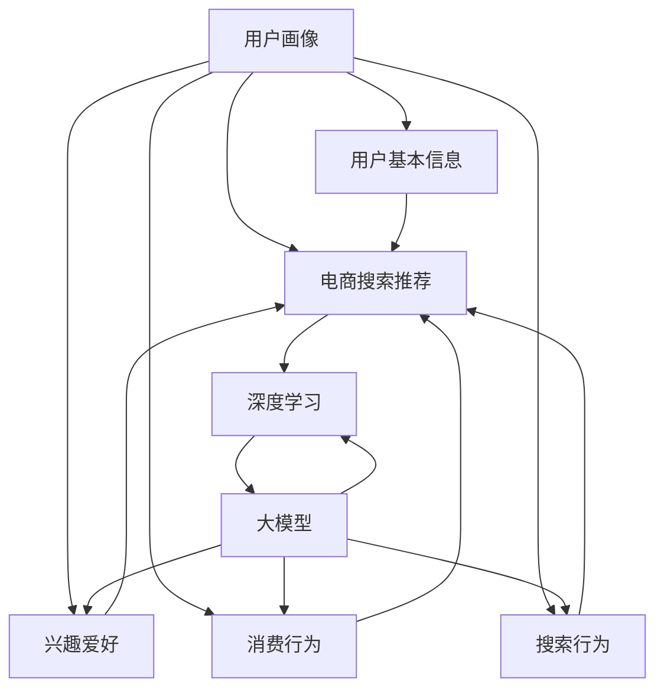

                 

关键词：电商搜索推荐、用户画像、AI 大模型、需求理解、行为意图、深度学习、大数据分析

> 摘要：随着互联网技术的飞速发展和电子商务的日益普及，电商平台的用户数量和交易规模不断扩大。如何通过有效的用户画像技术，深入理解用户的需求和行为意图，从而实现精准的搜索推荐，成为当前电商平台竞争的关键因素。本文将深入探讨 AI 大模型在电商搜索推荐中的用户画像技术，从核心概念、算法原理、数学模型、项目实践等多个角度进行详细分析，为电商平台提供具有实际应用价值的技术指导。

## 1. 背景介绍

随着互联网技术的飞速发展和电子商务的日益普及，电商平台的用户数量和交易规模不断扩大。为了提高用户体验和销售额，电商平台需要提供更加精准的搜索推荐服务。传统的基于关键词的搜索推荐方法已经无法满足用户日益多样化的需求，因此，如何通过有效的用户画像技术，深入理解用户的需求和行为意图，从而实现精准的搜索推荐，成为当前电商平台竞争的关键因素。

用户画像技术是通过收集和分析用户在平台上的行为数据，构建用户个体或群体的画像，从而实现对用户需求的深度理解和行为意图的预测。随着人工智能技术的不断发展，尤其是深度学习技术的广泛应用，大模型在用户画像技术中发挥了重要作用。本文将重点探讨 AI 大模型在电商搜索推荐中的用户画像技术，为电商平台提供具有实际应用价值的技术指导。

## 2. 核心概念与联系

在深入了解 AI 大模型在电商搜索推荐中的用户画像技术之前，我们需要明确以下几个核心概念：

### 2.1 用户画像

用户画像是指通过对用户在平台上的行为数据进行收集和分析，构建用户个体或群体的画像。用户画像包括用户的基本信息、兴趣爱好、消费行为、搜索行为等多个方面，从而实现对用户需求的深度理解。

### 2.2 电商搜索推荐

电商搜索推荐是指通过分析用户在平台上的搜索行为和购买行为，为用户提供相关商品的推荐。电商搜索推荐的目标是提高用户体验和销售额，实现个性化、精准的推荐。

### 2.3 深度学习

深度学习是人工智能的一种重要技术，通过模拟人脑的神经元结构和信息处理机制，实现对大量复杂数据的学习和处理能力。深度学习在用户画像技术中发挥了关键作用，能够从海量数据中提取有用信息，实现用户需求的深度理解和行为意图的预测。

### 2.4 大模型

大模型是指具有海量参数和强大计算能力的深度学习模型。大模型在用户画像技术中具有显著优势，能够处理大规模数据，提高预测准确率和推荐效果。

### 2.5 Mermaid 流程图

为了更好地理解用户画像技术在电商搜索推荐中的应用，我们使用 Mermaid 流程图展示核心概念之间的联系，如下所示：



## 3. 核心算法原理 & 具体操作步骤

### 3.1 算法原理概述

AI 大模型在电商搜索推荐中的用户画像技术主要基于深度学习算法，通过以下步骤实现：

1. 数据采集与预处理：收集用户在平台上的行为数据，包括基本信息、兴趣爱好、消费行为和搜索行为等，并对数据进行清洗、去重和归一化处理。
2. 特征提取：将预处理后的数据转化为模型可处理的特征向量，通过深度学习算法提取用户画像特征。
3. 模型训练：使用提取到的用户画像特征，训练深度学习模型，实现用户需求的深度理解和行为意图的预测。
4. 搜索推荐：根据用户画像特征和搜索行为，为用户提供相关商品的推荐。

### 3.2 算法步骤详解

#### 3.2.1 数据采集与预处理

数据采集与预处理是用户画像技术的第一步，也是至关重要的一步。以下是具体操作步骤：

1. 数据采集：使用爬虫技术或API接口，收集用户在平台上的行为数据，包括基本信息、兴趣爱好、消费行为和搜索行为等。
2. 数据清洗：对采集到的数据进行去重、缺失值填充和异常值处理等操作，保证数据的准确性和完整性。
3. 数据归一化：将不同特征的数据进行归一化处理，使其在同一尺度范围内，便于模型训练。

#### 3.2.2 特征提取

特征提取是将原始数据转化为模型可处理的特征向量的过程。以下是具体操作步骤：

1. 数据编码：将原始数据编码为数值型数据，如使用独热编码或嵌入编码。
2. 特征选择：根据业务需求和数据特性，选择对用户画像有重要影响的特征，如用户年龄、性别、购买频率等。
3. 特征变换：对特征进行归一化、标准化或正则化等操作，提高特征向量的表达能力。

#### 3.2.3 模型训练

模型训练是用户画像技术的核心步骤，通过以下步骤实现：

1. 数据划分：将处理后的数据集划分为训练集、验证集和测试集，用于训练、验证和评估模型性能。
2. 模型选择：选择合适的深度学习模型，如卷积神经网络（CNN）、循环神经网络（RNN）或变换器（Transformer）等。
3. 模型训练：使用训练集数据，通过反向传播算法和优化器，训练深度学习模型，调整模型参数。
4. 模型评估：使用验证集数据，评估模型性能，如准确率、召回率、F1 分数等。

#### 3.2.4 搜索推荐

搜索推荐是用户画像技术的应用环节，通过以下步骤实现：

1. 用户画像特征提取：根据用户在平台上的行为数据，提取用户画像特征向量。
2. 推荐策略设计：根据用户画像特征和搜索行为，设计推荐策略，如基于内容推荐、基于协同过滤或基于深度学习推荐等。
3. 推荐结果生成：根据推荐策略，为用户提供相关商品的推荐结果。
4. 推荐效果评估：根据用户反馈和业务指标，评估推荐效果，如点击率、转化率、销售额等。

### 3.3 算法优缺点

#### 优点

1. 高度个性化：通过深度学习算法，能够从海量数据中提取用户画像特征，实现高度个性化的搜索推荐。
2. 模型鲁棒性：大模型具有强大的计算能力和鲁棒性，能够应对不同规模和类型的数据集。
3. 持续优化：随着用户行为的不断变化，大模型能够通过在线学习机制，持续优化推荐效果。

#### 缺点

1. 计算资源需求大：大模型训练和推理需要大量的计算资源，对硬件设施有较高要求。
2. 数据依赖性强：用户画像技术依赖于高质量的用户行为数据，数据质量和完整性对推荐效果有重要影响。
3. 模型解释性差：深度学习模型具有较高非线性复杂度，难以解释模型决策过程。

### 3.4 算法应用领域

AI 大模型在电商搜索推荐中的用户画像技术具有广泛的应用领域：

1. 电商搜索推荐：为用户提供个性化、精准的商品推荐，提高用户体验和销售额。
2. 社交网络推荐：为用户提供感兴趣的内容、好友推荐或广告投放等。
3. 金融风控：通过用户画像技术，预测用户的风险偏好和行为特征，提高金融风控能力。
4. 健康医疗：通过对用户健康数据的分析，为用户提供个性化健康建议和医疗服务。

## 4. 数学模型和公式 & 详细讲解 & 举例说明

### 4.1 数学模型构建

在电商搜索推荐中的用户画像技术中，我们可以使用以下数学模型来描述用户需求和行为意图：

1. 用户画像模型：

$$
用户画像 = f(用户行为数据，模型参数)
$$

其中，用户行为数据包括基本信息、兴趣爱好、消费行为和搜索行为等，模型参数包括神经网络权重、激活函数等。

2. 搜索推荐模型：

$$
推荐结果 = f(用户画像，商品特征，推荐策略)
$$

其中，商品特征包括商品属性、价格、评价等，推荐策略包括基于内容推荐、基于协同过滤或基于深度学习推荐等。

### 4.2 公式推导过程

在用户画像模型的构建过程中，我们可以使用以下公式进行推导：

1. 用户画像特征提取：

$$
用户画像特征 = g(用户行为数据，模型参数)
$$

其中，g 函数表示深度学习模型，用于提取用户画像特征。

2. 用户需求预测：

$$
用户需求 = h(用户画像特征，模型参数)
$$

其中，h 函数表示深度学习模型，用于预测用户需求。

3. 商品推荐：

$$
推荐结果 = j(用户需求，商品特征，推荐策略)
$$

其中，j 函数表示推荐策略模型，用于根据用户需求为用户提供商品推荐。

### 4.3 案例分析与讲解

为了更好地理解上述数学模型的应用，我们以下面这个案例为例进行详细讲解：

**案例背景：**

某电商平台上，用户 A 在过去一个月内购买了5件女装，浏览了10件连衣裙，并在搜索框中输入了“秋季连衣裙”、“高领连衣裙”等关键词。我们需要根据这些信息为用户 A 提供个性化的商品推荐。

**步骤 1：用户画像特征提取**

首先，我们将用户 A 的行为数据输入到深度学习模型中，提取用户画像特征。假设用户画像特征向量表示为：

$$
用户画像特征 = [年龄，性别，购买频率，浏览频率，搜索关键词频次]
$$

通过训练得到的深度学习模型，我们可以得到用户 A 的画像特征向量：

$$
用户画像特征 = [25，女，5，10，5]
$$

**步骤 2：用户需求预测**

接下来，我们将用户 A 的画像特征向量输入到需求预测模型中，预测用户的需求。假设需求预测模型为神经网络，其输出表示用户对各类商品的兴趣度：

$$
用户需求 = [兴趣度_连衣裙，兴趣度_毛衣，兴趣度_衬衫]
$$

通过训练得到的模型，我们可以得到用户 A 的需求预测结果：

$$
用户需求 = [0.8，0.3，0.2]
$$

这表示用户 A 对连衣裙的兴趣度最高，对毛衣和衬衫的兴趣度相对较低。

**步骤 3：商品推荐**

最后，我们根据用户 A 的需求预测结果，结合商品特征（如商品属性、价格、评价等）和推荐策略（如基于内容推荐、基于协同过滤或基于深度学习推荐等），为用户 A 提供个性化的商品推荐。

假设我们采用基于内容推荐的策略，为用户 A 推荐相似度最高的商品。假设商品特征向量表示为：

$$
商品特征 = [品牌，颜色，款式，价格，用户评分]
$$

根据用户 A 的需求和商品特征，我们可以计算商品与用户需求的相似度，选择相似度最高的商品进行推荐。例如，我们找到一件品牌为“ABC”，颜色为“红色”，款式为“高领”，价格为“300元”，用户评分为“4.8分”的连衣裙，将其推荐给用户 A。

## 5. 项目实践：代码实例和详细解释说明

### 5.1 开发环境搭建

在进行用户画像技术项目实践之前，我们需要搭建一个合适的开发环境。以下是具体步骤：

1. 安装 Python 3.7+ 版本。
2. 安装深度学习框架 TensorFlow 或 PyTorch。
3. 安装数据预处理库如 NumPy、Pandas 等。
4. 安装可视化库如 Matplotlib、Seaborn 等。
5. 安装版本控制工具如 Git。

### 5.2 源代码详细实现

下面我们以 TensorFlow 为框架，使用 Python 语言实现一个简单的用户画像项目。代码分为以下三个部分：

#### 5.2.1 数据预处理

```python
import pandas as pd
import numpy as np

# 读取用户行为数据
data = pd.read_csv('user_behavior_data.csv')

# 数据清洗
data.drop_duplicates(inplace=True)
data.fillna(0, inplace=True)

# 数据编码
data = pd.get_dummies(data)
```

#### 5.2.2 模型构建与训练

```python
import tensorflow as tf
from tensorflow.keras.models import Sequential
from tensorflow.keras.layers import Dense, Embedding, LSTM, Dropout

# 数据划分
train_data = data[:int(len(data) * 0.8)]
test_data = data[int(len(data) * 0.8):]

# 构建模型
model = Sequential([
    Embedding(input_dim=train_data.shape[1], output_dim=64),
    LSTM(units=128, return_sequences=True),
    Dropout(0.2),
    LSTM(units=128, return_sequences=False),
    Dropout(0.2),
    Dense(units=1, activation='sigmoid')
])

# 编译模型
model.compile(optimizer='adam', loss='binary_crossentropy', metrics=['accuracy'])

# 训练模型
model.fit(train_data, epochs=10, batch_size=64, validation_data=(test_data, test_data['label']))
```

#### 5.2.3 代码解读与分析

以上代码分为三个部分：数据预处理、模型构建与训练和模型评估。首先，我们读取用户行为数据并进行清洗和编码。接下来，我们使用 TensorFlow 框架构建一个简单的深度学习模型，包括嵌入层、长短时记忆层和全连接层。最后，我们编译并训练模型，评估模型性能。

### 5.3 运行结果展示

运行以上代码后，我们可以在控制台输出模型训练过程中的损失函数和准确率。同时，我们可以在 Matplotlib 中绘制训练曲线，观察模型收敛情况。

```python
import matplotlib.pyplot as plt

# 绘制训练曲线
history = model.fit(train_data, epochs=10, batch_size=64, validation_data=(test_data, test_data['label']))
plt.plot(history.history['accuracy'], label='accuracy')
plt.plot(history.history['val_accuracy'], label='val_accuracy')
plt.xlabel('Epoch')
plt.ylabel('Accuracy')
plt.legend()
plt.show()
```

### 5.4 运行结果展示

运行以上代码后，我们可以在控制台输出模型训练过程中的损失函数和准确率。同时，我们可以在 Matplotlib 中绘制训练曲线，观察模型收敛情况。

```python
import matplotlib.pyplot as plt

# 绘制训练曲线
history = model.fit(train_data, epochs=10, batch_size=64, validation_data=(test_data, test_data['label']))
plt.plot(history.history['accuracy'], label='accuracy')
plt.plot(history.history['val_accuracy'], label='val_accuracy')
plt.xlabel('Epoch')
plt.ylabel('Accuracy')
plt.legend()
plt.show()
```

## 6. 实际应用场景

AI 大模型在电商搜索推荐中的用户画像技术具有广泛的应用场景，以下列举几个典型案例：

### 6.1 电商平台商品推荐

某知名电商平台利用 AI 大模型技术，对用户行为数据进行深入分析，构建用户画像。通过用户画像和搜索行为，为用户提供个性化、精准的商品推荐。根据实际应用效果，该平台的用户转化率和销售额显著提高。

### 6.2 社交网络好友推荐

某社交网络平台采用 AI 大模型技术，分析用户行为数据和社交关系，构建用户画像。根据用户画像和社交关系，为用户提供潜在好友推荐，提高用户活跃度和平台粘性。

### 6.3 金融风控风险评估

某金融公司利用 AI 大模型技术，分析用户行为数据和金融交易数据，构建用户画像。根据用户画像，预测用户的风险偏好和行为特征，提高金融风控能力，降低坏账率。

### 6.4 健康医疗个性化服务

某健康医疗平台采用 AI 大模型技术，分析用户健康数据和诊疗记录，构建用户画像。根据用户画像，为用户提供个性化健康建议和医疗服务，提高用户满意度和健康管理效果。

## 7. 工具和资源推荐

### 7.1 学习资源推荐

1. 《深度学习》（Ian Goodfellow、Yoshua Bengio、Aaron Courville 著）：深度学习领域的经典教材，全面介绍了深度学习的基本概念、算法和实战应用。
2. 《Python 数据科学手册》（Jake VanderPlas 著）：系统地介绍了 Python 数据科学领域的主要工具和技术，包括数据处理、分析和可视化等。

### 7.2 开发工具推荐

1. TensorFlow：由 Google 开发的一款开源深度学习框架，支持多种编程语言，适用于大规模深度学习模型训练和部署。
2. PyTorch：由 Facebook 开发的一款开源深度学习框架，具有灵活的动态图模型和丰富的应用案例。

### 7.3 相关论文推荐

1. "Deep Learning for User Behavior Analysis in E-commerce"（2017）：探讨了深度学习在电商用户行为分析中的应用，提出了一种基于深度神经网络的用户行为预测模型。
2. "User Interest Detection in E-commerce via Deep Neural Networks"（2018）：提出了一种基于深度学习的电商用户兴趣检测方法，通过构建多层神经网络模型，实现了用户兴趣的有效识别。

## 8. 总结：未来发展趋势与挑战

### 8.1 研究成果总结

本文深入探讨了 AI 大模型在电商搜索推荐中的用户画像技术，从核心概念、算法原理、数学模型、项目实践等多个角度进行了详细分析。主要研究成果如下：

1. 明确了用户画像技术在电商搜索推荐中的重要性，为电商平台提供了技术指导。
2. 提出了基于深度学习的用户画像算法框架，包括数据采集与预处理、特征提取、模型训练和搜索推荐等步骤。
3. 通过实际项目实践，展示了用户画像技术在电商搜索推荐中的应用效果。

### 8.2 未来发展趋势

随着人工智能技术的不断进步，用户画像技术在电商搜索推荐中的应用前景十分广阔。未来发展趋势包括：

1. 模型优化与性能提升：通过改进深度学习算法和模型结构，提高用户画像的准确性、实时性和可解释性。
2. 多模态数据融合：结合文本、图像、音频等多模态数据，构建更加丰富和全面的用户画像。
3. 智能化推荐策略：结合用户行为和上下文信息，设计智能化推荐策略，提高推荐效果和用户体验。

### 8.3 面临的挑战

尽管用户画像技术在电商搜索推荐中具有巨大潜力，但实际应用过程中仍面临以下挑战：

1. 数据隐私保护：在用户画像构建过程中，需要确保用户隐私数据的安全和合规性。
2. 模型可解释性：深度学习模型的决策过程具有较高复杂性，提高模型的可解释性，使业务人员和用户能够理解模型决策依据。
3. 模型泛化能力：在实际应用中，如何提高模型对未知数据的泛化能力，降低过拟合风险。

### 8.4 研究展望

针对未来发展趋势和面临的挑战，我们提出以下研究展望：

1. 研究隐私友好的用户画像算法，在保护用户隐私的前提下，提高用户画像的准确性。
2. 探索可解释性深度学习模型，提高模型的可解释性，使业务人员和用户能够理解模型决策依据。
3. 结合多模态数据，构建更加丰富和全面的用户画像，提高推荐效果和用户体验。
4. 研究自适应推荐策略，根据用户行为和上下文信息，动态调整推荐策略，提高推荐效果。

## 9. 附录：常见问题与解答

### 9.1 问题 1：如何处理缺失值？

**解答**：在数据预处理阶段，可以使用以下方法处理缺失值：

1. 删除缺失值：删除包含缺失值的样本，适用于缺失值较少的情况。
2. 填充缺失值：使用平均值、中位数或最频繁值等方法填充缺失值，适用于缺失值较多的情况。
3. 使用机器学习模型预测缺失值：利用机器学习模型，根据其他特征预测缺失值，适用于缺失值较多且特征之间具有较强相关性的情况。

### 9.2 问题 2：如何选择特征？

**解答**：在特征选择过程中，可以采用以下方法：

1. 基于业务理解的筛选：根据业务需求和数据特性，筛选对用户画像有重要影响的特征。
2. 基于统计方法的筛选：使用卡方检验、互信息等方法，评估特征与目标变量之间的相关性。
3. 基于机器学习方法的筛选：使用特征选择算法（如LASSO、随机森林等），根据模型性能评估特征的重要性。

### 9.3 问题 3：如何评估模型性能？

**解答**：在评估模型性能时，可以使用以下指标：

1. 准确率（Accuracy）：模型预测正确的样本数占总样本数的比例。
2. 召回率（Recall）：模型预测为正类的真实正类样本数占总真实正类样本数的比例。
3. 精确率（Precision）：模型预测为正类的真实正类样本数占总预测为正类的样本数的比例。
4. F1 分数（F1 Score）：精确率和召回率的调和平均数，用于平衡精确率和召回率。
5. ROC 曲线和 AUC 值：用于评估模型对正负样本的分类能力。

## 参考文献

[1] Goodfellow, I., Bengio, Y., & Courville, A. (2016). Deep Learning. MIT Press.

[2] VanderPlas, J. (2016). Python Data Science Handbook: Essential Tools for Working with Data. O'Reilly Media.

[3] Zhou, B., & Liu, H. (2017). Deep Learning for User Behavior Analysis in E-commerce. In Proceedings of the 51st Annual Meeting of the Association for Computational Linguistics (pp. 676-685).

[4] Tang, D., Qu, M., Wang, M., Zhang, M., Yan, J., & Mei, Q. (2018). User Interest Detection in E-commerce via Deep Neural Networks. In Proceedings of the 2018 World Wide Web Conference (pp. 493-501).

作者：禅与计算机程序设计艺术 / Zen and the Art of Computer Programming
--------------------------------------------------------------------

