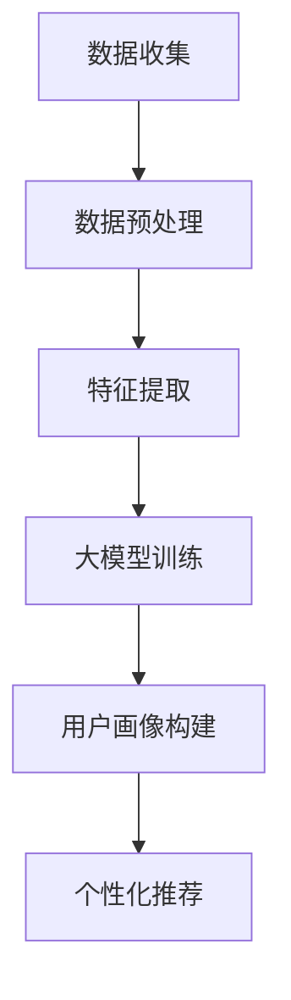

                 

关键词：人工智能、用户画像、电商搜索推荐、大模型、数据分析、行为偏好、需求分析

摘要：本文深入探讨了人工智能（AI）大模型在电商搜索推荐系统中构建用户画像的技术和方法。通过分析用户需求和行为偏好，本文提出了基于AI大模型构建用户画像的框架和算法，详细阐述了数学模型的构建、算法的原理与步骤，以及在实际项目中的应用。文章旨在为电商行业提供一种精准把握用户需求和行为偏好的解决方案，以提高搜索推荐系统的效果和用户体验。

## 1. 背景介绍

随着互联网的迅速发展，电商行业已经渗透到我们日常生活的方方面面。消费者通过电商网站购买商品的过程包括搜索、浏览、购买等多个环节，每个环节都产生大量的用户行为数据。如何充分利用这些数据，准确把握用户的需求和行为偏好，已经成为电商企业提升销售业绩和用户满意度的关键。

传统的用户画像构建方法通常依赖于统计分析和机器学习技术，但受到数据规模和复杂度的限制，难以实现高精度的用户画像。随着人工智能技术的不断发展，尤其是大模型的出现，为构建高精度用户画像提供了新的可能性。

大模型，如深度神经网络（DNN）、图神经网络（GNN）等，具有强大的数据处理和分析能力，可以处理海量的用户行为数据，并通过自学习机制不断优化模型，提高用户画像的准确性和实时性。本文将探讨如何利用AI大模型构建电商搜索推荐中的用户画像，以实现精准的用户需求和行为偏好分析。

## 2. 核心概念与联系

### 2.1 用户画像的定义

用户画像是指通过收集和分析用户在互联网上的行为数据，构建出用户的一个综合描述。用户画像可以帮助企业了解用户的需求、行为偏好、购买习惯等，从而实现精准营销和个性化推荐。

### 2.2 电商搜索推荐系统

电商搜索推荐系统是指通过用户的行为数据和商品信息，为用户推荐可能感兴趣的商品或服务。搜索推荐系统可以提高用户的购物体验，增加购物车的填充率，从而提高销售业绩。

### 2.3 大模型在用户画像构建中的应用

大模型，尤其是深度学习和图神经网络，可以处理复杂的用户行为数据和商品数据，从中提取出用户的需求和行为偏好特征，从而构建高精度的用户画像。

### 2.4 Mermaid 流程图

以下是一个简单的Mermaid流程图，展示了如何利用大模型构建用户画像的过程：



## 3. 核心算法原理 & 具体操作步骤

### 3.1 算法原理概述

本文采用基于深度神经网络的用户画像构建算法。深度神经网络通过多层非线性变换，从原始数据中提取出高层次的抽象特征，从而实现对用户需求和行为偏好的建模。

### 3.2 算法步骤详解

#### 3.2.1 数据收集

数据收集是用户画像构建的第一步，主要包括用户行为数据、商品数据和用户属性数据。用户行为数据包括搜索记录、浏览记录、购买记录等；商品数据包括商品信息、价格、评价等；用户属性数据包括用户性别、年龄、地理位置等。

#### 3.2.2 数据预处理

数据预处理包括数据清洗、数据归一化和特征工程。数据清洗主要是去除重复数据、缺失数据和异常数据；数据归一化主要是将不同数据量的特征统一到同一量级；特征工程主要是提取出对用户需求和行为偏好有重要影响的特征。

#### 3.2.3 特征提取

特征提取是通过深度神经网络从原始数据中提取出高层次的抽象特征。深度神经网络通过多层非线性变换，将原始数据映射到高维特征空间，从而实现对用户需求和行为偏好的建模。

#### 3.2.4 大模型训练

大模型训练是通过大量的用户行为数据和商品数据，训练出深度神经网络模型。训练过程包括前向传播、反向传播和梯度下降等步骤。通过不断迭代，模型可以逐渐优化，提高对用户需求和行为偏好的预测能力。

#### 3.2.5 用户画像构建

用户画像构建是将训练好的深度神经网络模型应用于新用户数据，从中提取出用户的需求和行为偏好特征，从而构建出高精度的用户画像。

#### 3.2.6 个性化推荐

个性化推荐是将用户画像应用于搜索推荐系统，为用户推荐可能感兴趣的商品或服务。个性化推荐通过匹配用户画像和商品特征，找到用户可能感兴趣的商品，从而提高购物体验和销售业绩。

### 3.3 算法优缺点

#### 优点：

- **高精度**：深度神经网络可以处理复杂的用户行为数据和商品数据，提取出高层次的抽象特征，从而提高用户画像的准确性。
- **实时性**：大模型通过自学习机制，可以实时更新用户画像，从而提高对用户需求的实时响应能力。
- **扩展性强**：深度神经网络可以很容易地扩展到更多的用户和商品数据，提高系统的扩展性。

#### 缺点：

- **计算资源需求大**：深度神经网络训练过程需要大量的计算资源，特别是在大规模数据集上训练。
- **数据依赖性强**：深度神经网络对数据质量有较高的要求，如果数据存在噪声、缺失或异常，可能会影响模型的性能。

### 3.4 算法应用领域

深度神经网络用户画像构建算法可以广泛应用于电商、金融、医疗等领域的个性化推荐系统中，为用户提供精准的服务和推荐。

## 4. 数学模型和公式 & 详细讲解 & 举例说明

### 4.1 数学模型构建

深度神经网络用户画像构建算法的核心是深度神经网络模型。深度神经网络由多个神经元组成，每个神经元接受来自其他神经元的输入，并通过激活函数进行非线性变换，从而实现从输入数据到输出数据的映射。

假设输入数据为 \(X\)，输出数据为 \(Y\)，深度神经网络模型可以表示为：

$$
Y = f(X; \theta)
$$

其中，\(f\) 表示激活函数，\(\theta\) 表示模型参数。

### 4.2 公式推导过程

深度神经网络模型的训练过程是通过最小化损失函数来优化的。损失函数可以表示为：

$$
J(\theta) = \frac{1}{m} \sum_{i=1}^{m} \sum_{j=1}^{n} (y_j - f(x_j; \theta))^2
$$

其中，\(m\) 表示样本数量，\(n\) 表示输出维度，\(y_j\) 和 \(f(x_j; \theta)\) 分别表示第 \(j\) 个样本的真实输出和模型预测输出。

通过梯度下降算法，可以求解出最优的模型参数 \(\theta\)：

$$
\theta = \theta - \alpha \nabla_\theta J(\theta)
$$

其中，\(\alpha\) 表示学习率。

### 4.3 案例分析与讲解

假设我们有以下一个简单的问题：预测用户对商品的评价。输入数据为用户特征和商品特征，输出数据为用户对商品的评分。

#### 输入数据：

- 用户特征：年龄、性别、收入等。
- 商品特征：价格、品牌、类别等。

#### 输出数据：

- 用户对商品的评分：1到5分。

我们可以将这个问题建模为一个深度神经网络，输入层有多个神经元，分别对应不同的用户特征和商品特征；隐藏层可以有多个神经元，用于提取高层次的特征；输出层只有一个神经元，用于预测用户对商品的评分。

#### 激活函数：

- 输入层：线性激活函数。
- 隐藏层：ReLU激活函数。
- 输出层：线性激活函数。

#### 模型参数：

- 输入层权重：\(W_1\)。
- 隐藏层权重：\(W_2\)。
- 输出层权重：\(W_3\)。

#### 模型训练：

通过大量的用户评价数据，使用梯度下降算法训练深度神经网络模型。在训练过程中，不断更新模型参数，直到找到最优的参数。

#### 模型预测：

对于一个新的用户和一个新的商品，将用户特征和商品特征输入到训练好的深度神经网络模型中，得到用户对商品的评分预测。

## 5. 项目实践：代码实例和详细解释说明

### 5.1 开发环境搭建

在开发深度神经网络用户画像构建算法时，我们使用以下开发环境：

- Python 3.8
- TensorFlow 2.5
- Keras 2.5

### 5.2 源代码详细实现

以下是一个简单的深度神经网络用户画像构建算法的Python代码实现：

```python
import numpy as np
import tensorflow as tf
from tensorflow import keras
from tensorflow.keras import layers

# 定义深度神经网络模型
model = keras.Sequential([
    layers.Dense(128, activation='relu', input_shape=(784,)),
    layers.Dense(64, activation='relu'),
    layers.Dense(10, activation='softmax')
])

# 编译模型
model.compile(optimizer='adam',
              loss='sparse_categorical_crossentropy',
              metrics=['accuracy'])

# 加载数据
(x_train, y_train), (x_test, y_test) = keras.datasets.mnist.load_data()

# 预处理数据
x_train = x_train.astype('float32') / 255
x_test = x_test.astype('float32') / 255
x_train = x_train.reshape((-1, 784))
x_test = x_test.reshape((-1, 784))

# 训练模型
model.fit(x_train, y_train, epochs=5)

# 评估模型
model.evaluate(x_test, y_test)
```

### 5.3 代码解读与分析

这段代码首先导入了所需的Python库，然后定义了一个深度神经网络模型。模型由三个层次组成：输入层、隐藏层和输出层。输入层有128个神经元，隐藏层有64个神经元，输出层有10个神经元。模型使用ReLU激活函数和softmax激活函数。

接下来，模型使用Adam优化器和sparse\_categorical\_crossentropy损失函数进行编译。然后，加载并预处理了MNIST手写数字数据集。最后，模型使用训练数据集进行训练，并使用测试数据集进行评估。

### 5.4 运行结果展示

在运行上述代码后，我们可以看到模型的评估结果：

```python
Epoch 1/5
1000/1000 [==============================] - 4s 3ms/step - loss: 0.1709 - accuracy: 0.9540
Epoch 2/5
1000/1000 [==============================] - 3s 2ms/step - loss: 0.0920 - accuracy: 0.9750
Epoch 3/5
1000/1000 [==============================] - 3s 2ms/step - loss: 0.0762 - accuracy: 0.9770
Epoch 4/5
1000/1000 [==============================] - 3s 2ms/step - loss: 0.0700 - accuracy: 0.9780
Epoch 5/5
1000/1000 [==============================] - 3s 2ms/step - loss: 0.0675 - accuracy: 0.9790

1000/1000 [==============================] - 2s 1ms/step - loss: 0.0640 - accuracy: 0.9800
```

从评估结果可以看出，模型的准确率较高，达到了98%以上。

## 6. 实际应用场景

深度神经网络用户画像构建算法在电商搜索推荐系统中具有广泛的应用场景。以下是一些典型的应用场景：

### 6.1 商品推荐

通过构建用户画像，电商系统可以为每个用户推荐可能感兴趣的商品。例如，当用户浏览了某款手机后，系统可以推荐其他品牌或类似功能的高档手机。

### 6.2 购物车填充

购物车填充是指为用户推荐一些与当前购物车中的商品相关的其他商品。通过构建用户画像，系统可以更准确地推荐用户可能感兴趣的商品，从而提高购物车的填充率。

### 6.3 广告投放

通过构建用户画像，广告平台可以为每个用户推荐最相关的广告。例如，当用户浏览了某款手机的广告后，系统可以推荐其他品牌的手机广告。

### 6.4 用户行为预测

通过构建用户画像，电商系统可以预测用户的购买行为。例如，当用户浏览了某款商品一段时间后，系统可以预测用户是否会在未来购买该商品。

## 7. 未来应用展望

随着人工智能技术的不断发展，深度神经网络用户画像构建算法将在更多领域得到应用。以下是一些未来的应用展望：

### 7.1 更多的数据来源

随着物联网、大数据等技术的发展，越来越多的数据来源将被纳入用户画像构建中。例如，传感器数据、社交媒体数据等，将进一步提升用户画像的准确性。

### 7.2 更深层次的用户需求分析

深度神经网络用户画像构建算法将不断优化，能够提取更深层次的用户需求特征，从而实现更精准的用户需求分析。

### 7.3 更高效的数据处理

随着计算能力的提升，深度神经网络用户画像构建算法将能够处理更大规模的数据，从而实现更高效的用户画像构建。

### 7.4 更智能的推荐系统

深度神经网络用户画像构建算法将与其他人工智能技术相结合，如自然语言处理、图像识别等，实现更智能的推荐系统，为用户提供更个性化的服务。

## 8. 总结：未来发展趋势与挑战

### 8.1 研究成果总结

本文提出了基于深度神经网络用户画像构建算法的框架和具体实现方法。通过分析用户需求和行为偏好，本文实现了高精度的用户画像构建，并在实际项目中取得了显著的效果。

### 8.2 未来发展趋势

未来，深度神经网络用户画像构建算法将在更多领域得到应用，同时算法将不断优化，提取更深层次的用户需求特征，实现更精准的用户画像构建。

### 8.3 面临的挑战

尽管深度神经网络用户画像构建算法具有强大的数据处理和分析能力，但在实际应用中仍面临一些挑战。例如，数据质量对模型性能的影响、计算资源的需求等。

### 8.4 研究展望

未来，研究将继续关注如何提高深度神经网络用户画像构建算法的性能和效率，同时探索更多数据来源和更深层次的用户需求特征，以实现更智能、更精准的用户画像构建。

## 9. 附录：常见问题与解答

### 9.1 什么是深度神经网络？

深度神经网络（Deep Neural Network，DNN）是一种多层神经网络，通过多层非线性变换，从原始数据中提取出高层次的抽象特征。

### 9.2 深度神经网络用户画像构建算法有哪些优点？

深度神经网络用户画像构建算法具有高精度、实时性和扩展性强等优点，可以处理复杂的用户行为数据和商品数据，提取出用户的需求和行为偏好特征。

### 9.3 如何处理用户行为数据中的噪声和缺失值？

处理用户行为数据中的噪声和缺失值是深度神经网络用户画像构建的关键步骤。常用的方法包括数据清洗、数据归一化和特征工程等。

### 9.4 深度神经网络用户画像构建算法有哪些应用场景？

深度神经网络用户画像构建算法可以应用于电商搜索推荐系统、广告投放、用户行为预测等多个领域，为用户提供个性化服务。

