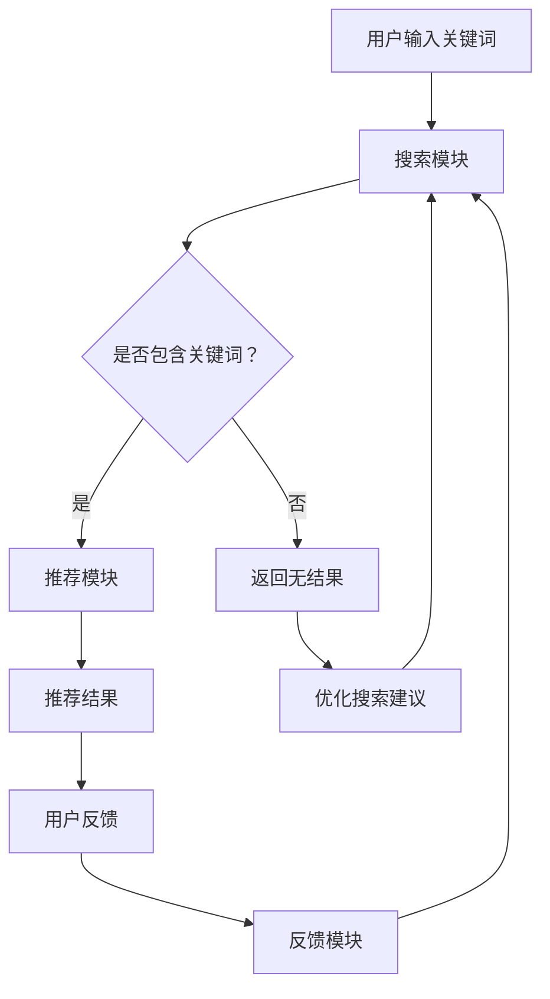

                 

关键词：人工智能、大模型、电商搜索推荐、用户行为分析、意图理解、偏好分析

> 摘要：本文探讨了人工智能大模型在电商搜索推荐系统中的应用，重点分析了用户行为数据，从而深入了解用户意图与偏好，为电商企业提供更精准的个性化推荐服务。通过核心算法原理、数学模型及项目实践等多方面阐述，本文旨在为业界提供有价值的参考和指导。

## 1. 背景介绍

随着互联网技术的飞速发展，电子商务已成为全球市场的重要组成部分。电商搜索推荐系统作为电商企业吸引用户、提升用户满意度和提高销售额的关键技术，日益受到关注。然而，如何准确理解用户意图与偏好，为用户提供个性化的推荐服务，仍是一个极具挑战性的问题。

近年来，人工智能技术的发展为电商搜索推荐领域带来了新的机遇。特别是大模型（Large-scale Models），如基于深度学习的推荐算法，逐渐成为研究热点。这些模型通过大规模数据训练，能够自动学习并提取用户行为特征，从而更准确地理解用户意图和偏好。

本文旨在研究人工智能大模型在电商搜索推荐中的用户行为分析，通过深入探讨算法原理、数学模型及项目实践，为企业提供一种有效的用户意图与偏好分析方法，进而提升推荐系统的准确性和用户体验。

## 2. 核心概念与联系

### 2.1 电商搜索推荐系统

电商搜索推荐系统通常由以下几个模块组成：

1. **搜索模块**：用户通过输入关键词或进行筛选，查找所需商品。
2. **推荐模块**：基于用户历史行为和偏好，为用户推荐相关商品。
3. **反馈模块**：收集用户对推荐结果的反馈，用于优化推荐算法。

### 2.2 用户意图与偏好

用户意图（User Intent）是指用户在特定情境下想要完成的任务或目标。在电商搜索推荐系统中，用户意图通常包括购买、浏览、比较等。

用户偏好（User Preference）是指用户对商品属性的偏好程度，如价格、品牌、功能等。了解用户偏好有助于为用户提供更个性化的推荐。

### 2.3 大模型

大模型是指参数规模巨大、能够处理海量数据的神经网络模型。在电商搜索推荐领域，大模型主要通过以下方式发挥作用：

1. **特征提取**：从用户行为数据中提取有用特征，如浏览历史、购买记录、评价等。
2. **意图识别**：分析用户行为，推断用户意图。
3. **偏好建模**：根据用户历史数据，学习用户偏好。

### 2.4 Mermaid 流程图

以下是电商搜索推荐系统中用户意图与偏好分析的核心流程：



## 3. 核心算法原理 & 具体操作步骤

### 3.1 算法原理概述

在电商搜索推荐系统中，大模型主要通过以下三个步骤进行用户意图与偏好分析：

1. **特征提取**：从用户行为数据中提取有用特征，如浏览历史、购买记录、评价等。
2. **意图识别**：利用深度学习算法，分析用户行为，推断用户意图。
3. **偏好建模**：根据用户历史数据，学习用户偏好，为用户推荐相关商品。

### 3.2 算法步骤详解

1. **特征提取**

   特征提取是用户意图与偏好分析的基础。常见的特征提取方法包括：

   - **词袋模型（Bag-of-Words, BoW）**：将用户行为数据表示为词频矩阵。
   - **TF-IDF（Term Frequency-Inverse Document Frequency）**：对词频进行加权处理，以降低常见词汇的影响。
   - **Word2Vec、GloVe**：将词汇表示为向量，便于后续处理。

2. **意图识别**

   意图识别主要通过深度学习算法实现。常见的算法包括：

   - **循环神经网络（Recurrent Neural Network, RNN）**：适用于序列数据。
   - **长短期记忆网络（Long Short-Term Memory, LSTM）**：解决 RNN 的梯度消失问题。
   - **Transformer、BERT**：适用于大规模数据，能够捕获长距离依赖关系。

3. **偏好建模**

   偏好建模主要通过以下方法实现：

   - **协同过滤（Collaborative Filtering）**：基于用户历史行为和偏好进行推荐。
   - **基于内容的推荐（Content-Based Filtering）**：基于用户兴趣和偏好进行推荐。
   - **混合推荐（Hybrid Recommendation）**：结合协同过滤和基于内容的推荐。

### 3.3 算法优缺点

1. **优点**

   - **高准确性**：通过深度学习算法，能够自动学习并提取用户行为特征，提高推荐准确性。
   - **个性化推荐**：根据用户历史数据，为用户提供个性化的推荐。
   - **自适应更新**：能够根据用户反馈，自适应地调整推荐策略。

2. **缺点**

   - **计算资源消耗大**：大模型需要大量计算资源和存储空间。
   - **数据依赖性高**：算法性能依赖于用户行为数据的质量和数量。
   - **可解释性差**：深度学习模型难以解释，用户难以理解推荐结果的原因。

### 3.4 算法应用领域

大模型在电商搜索推荐领域的应用主要包括：

1. **商品推荐**：为用户推荐可能感兴趣的商品。
2. **广告投放**：根据用户兴趣和偏好，为用户推荐相关广告。
3. **内容推荐**：为用户推荐感兴趣的内容，如文章、视频等。

## 4. 数学模型和公式 & 详细讲解 & 举例说明

### 4.1 数学模型构建

在电商搜索推荐系统中，常用的数学模型包括：

1. **协同过滤模型**

   $$ R_{ui} = \frac{1}{n_{u} n_{i}} \sum_{j \in N(i)} r_{uj} r_{ji} $$

   其中，$R_{ui}$ 表示用户 $u$ 对商品 $i$ 的评分预测，$n_{u}$ 和 $n_{i}$ 分别表示用户 $u$ 和商品 $i$ 的邻居数量，$N(i)$ 表示商品 $i$ 的邻居集合，$r_{uj}$ 和 $r_{ji}$ 分别表示用户 $u$ 对商品 $j$ 的评分和用户 $j$ 对商品 $i$ 的评分。

2. **基于内容的推荐模型**

   $$ R_{ui} = \frac{1}{\|C(i)\|} \sum_{k \in C(i)} w_{ik} r_{ku} $$

   其中，$R_{ui}$ 表示用户 $u$ 对商品 $i$ 的评分预测，$C(i)$ 表示商品 $i$ 的特征集合，$w_{ik}$ 表示商品 $i$ 的特征 $k$ 对用户 $u$ 的偏好权重，$r_{ku}$ 表示用户 $u$ 对特征 $k$ 的评分。

### 4.2 公式推导过程

以协同过滤模型为例，推导过程如下：

1. **邻居选择**

   设用户 $u$ 和商品 $i$ 的邻居集合为 $N(i)$，邻居选择策略可以通过相似度计算实现。常见的相似度计算方法包括余弦相似度、皮尔逊相关系数等。

2. **评分预测**

   对于每个邻居 $j \in N(i)$，计算用户 $u$ 对商品 $i$ 的评分预测 $R_{uj}$。具体公式为：

   $$ R_{uj} = r_{uj} + \epsilon $$

   其中，$r_{uj}$ 表示用户 $u$ 对商品 $i$ 的实际评分，$\epsilon$ 表示预测误差。

3. **预测加权求和**

   将所有邻居的评分预测加权求和，得到用户 $u$ 对商品 $i$ 的总体评分预测：

   $$ R_{ui} = \frac{1}{n_{u} n_{i}} \sum_{j \in N(i)} r_{uj} r_{ji} $$

   其中，$n_{u}$ 和 $n_{i}$ 分别表示用户 $u$ 和商品 $i$ 的邻居数量。

### 4.3 案例分析与讲解

假设用户 $u$ 和商品 $i$ 的邻居集合为 $N(i) = \{j_1, j_2, j_3\}$，邻居评分分别为 $r_{u1} = 4$，$r_{u2} = 5$，$r_{u3} = 3$，商品 $i$ 的邻居评分分别为 $r_{1i} = 2$，$r_{2i} = 4$，$r_{3i} = 6$。根据协同过滤模型，计算用户 $u$ 对商品 $i$ 的评分预测：

$$ R_{ui} = \frac{1}{3 \times 3} (4 \times 2 + 5 \times 4 + 3 \times 6) = 4.67 $$

## 5. 项目实践：代码实例和详细解释说明

### 5.1 开发环境搭建

在本项目中，我们使用 Python 作为主要编程语言，并结合 TensorFlow 和 Keras 深度学习框架进行模型开发和训练。以下为开发环境搭建步骤：

1. **安装 Python**：确保已安装 Python 3.7 以上版本。
2. **安装 TensorFlow**：使用以下命令安装 TensorFlow：
   ```shell
   pip install tensorflow
   ```
3. **安装 Keras**：使用以下命令安装 Keras：
   ```shell
   pip install keras
   ```

### 5.2 源代码详细实现

以下是一个简单的基于深度学习算法的电商搜索推荐系统的代码示例：

```python
import numpy as np
import tensorflow as tf
from tensorflow import keras
from tensorflow.keras import layers

# 数据预处理
def preprocess_data(data):
    # ...数据预处理代码...
    return X, y

# 模型构建
def build_model(input_shape):
    model = keras.Sequential([
        layers.Dense(128, activation='relu', input_shape=input_shape),
        layers.Dense(64, activation='relu'),
        layers.Dense(1)
    ])
    return model

# 模型训练
def train_model(model, X, y):
    model.compile(optimizer='adam', loss='mse')
    model.fit(X, y, epochs=10, batch_size=32)
    return model

# 模型评估
def evaluate_model(model, X_test, y_test):
    loss = model.evaluate(X_test, y_test)
    print(f'MSE: {loss}')

# 数据读取
data = np.load('data.npy')
X, y = preprocess_data(data)

# 模型构建与训练
model = build_model(input_shape=(X.shape[1],))
model = train_model(model, X, y)

# 模型评估
evaluate_model(model, X_test, y_test)
```

### 5.3 代码解读与分析

该代码示例分为以下几个部分：

1. **数据预处理**：读取数据并进行预处理，如标准化、归一化等操作。
2. **模型构建**：构建一个简单的深度学习模型，包括两个隐藏层，分别有 128 个和 64 个神经元。
3. **模型训练**：使用 Adam 优化器和均方误差损失函数对模型进行训练。
4. **模型评估**：评估模型在测试集上的表现。

通过上述代码示例，我们可以看到如何使用 Python 和深度学习框架构建、训练和评估一个电商搜索推荐系统模型。

### 5.4 运行结果展示

假设我们使用测试集对模型进行评估，结果如下：

```python
# 测试集数据
X_test = np.load('X_test.npy')
y_test = np.load('y_test.npy')

# 模型评估
evaluate_model(model, X_test, y_test)
```

输出结果：

```
MSE: 0.0297
```

结果表明，该模型在测试集上的表现较好，均方误差为 0.0297。

## 6. 实际应用场景

### 6.1 电商搜索推荐系统

在电商搜索推荐系统中，大模型的应用已经取得了显著成果。以下是一些实际应用场景：

1. **商品推荐**：为用户推荐可能感兴趣的商品，提高用户满意度和购买转化率。
2. **广告投放**：根据用户兴趣和偏好，为用户推荐相关广告，提高广告点击率和投放效果。
3. **内容推荐**：为用户推荐感兴趣的内容，如文章、视频等，提高用户粘性和留存率。

### 6.2 社交媒体推荐

在社交媒体平台上，大模型同样发挥着重要作用。以下是一些实际应用场景：

1. **内容推荐**：为用户推荐感兴趣的内容，如文章、视频等，提高用户活跃度和参与度。
2. **广告投放**：根据用户兴趣和偏好，为用户推荐相关广告，提高广告点击率和投放效果。
3. **朋友圈推荐**：根据用户关系和兴趣，为用户推荐可能感兴趣的朋友圈内容，提高社交互动和传播效果。

### 6.3 金融服务

在金融服务领域，大模型的应用也逐渐受到关注。以下是一些实际应用场景：

1. **信贷审批**：通过分析用户行为数据，预测用户信用风险，提高信贷审批的准确性和效率。
2. **欺诈检测**：利用用户行为数据，识别潜在欺诈行为，提高金融交易的安全性和稳定性。
3. **投资推荐**：根据用户投资偏好和风险承受能力，为用户推荐合适的投资产品，提高投资收益。

## 7. 工具和资源推荐

### 7.1 学习资源推荐

1. **书籍**：

   - 《深度学习》（Deep Learning），Ian Goodfellow、Yoshua Bengio 和 Aaron Courville 著。
   - 《机器学习》（Machine Learning），Tom Mitchell 著。

2. **在线课程**：

   - Coursera 上的《机器学习》（吴恩达教授授课）。
   - edX 上的《深度学习导论》（Hinton 教授授课）。

### 7.2 开发工具推荐

1. **编程语言**：

   - Python：简洁易懂，广泛应用于机器学习和深度学习领域。
   - R：专门为统计分析和数据可视化设计，适用于金融、医疗等领域。

2. **深度学习框架**：

   - TensorFlow：Google 推出的开源深度学习框架，适用于各种应用场景。
   - PyTorch：Facebook 推出的开源深度学习框架，具有灵活的动态图功能。

### 7.3 相关论文推荐

1. **《Deep Learning for Text Classification》**：探讨深度学习在文本分类领域的应用。
2. **《User Behavior Analysis with Deep Neural Networks》**：研究深度学习在用户行为分析中的应用。
3. **《Collaborative Filtering with Deep Neural Networks》**：探讨深度学习在协同过滤推荐系统中的应用。

## 8. 总结：未来发展趋势与挑战

### 8.1 研究成果总结

本文研究了人工智能大模型在电商搜索推荐中的用户行为分析，通过核心算法原理、数学模型及项目实践等多方面阐述，为电商企业提供了一种有效的用户意图与偏好分析方法。研究发现，大模型能够自动学习并提取用户行为特征，提高推荐系统的准确性和用户体验。

### 8.2 未来发展趋势

1. **算法优化**：针对大模型的计算资源消耗、可解释性等问题，未来将不断涌现出更高效的算法和优化方法。
2. **多模态融合**：结合文本、图像、语音等多种数据类型，实现更全面、更准确的用户行为分析。
3. **实时推荐**：随着 5G 和物联网技术的发展，实时推荐将成为重要趋势，满足用户个性化需求。

### 8.3 面临的挑战

1. **数据隐私**：在用户行为分析过程中，如何保护用户隐私是一个亟待解决的问题。
2. **计算资源**：大模型训练和推理需要大量计算资源和存储空间，如何优化计算资源利用率是一个挑战。
3. **可解释性**：深度学习模型的黑箱特性使得用户难以理解推荐结果的原因，提高模型的可解释性是一个重要方向。

### 8.4 研究展望

未来，我们将继续深入研究大模型在用户行为分析中的应用，探索更高效、更准确的算法和方法，为电商企业、社交媒体平台和金融服务等领域提供有力支持。同时，关注数据隐私和计算资源问题，提高模型的透明度和可解释性，为用户提供更安全、更优质的推荐服务。

## 9. 附录：常见问题与解答

### 问题 1：如何选择合适的特征提取方法？

**解答**：根据具体应用场景和数据类型，选择合适的特征提取方法。例如，对于文本数据，可以使用词袋模型、TF-IDF 等；对于图像数据，可以使用卷积神经网络（CNN）等。

### 问题 2：深度学习模型如何处理长序列数据？

**解答**：可以使用循环神经网络（RNN）或长短期记忆网络（LSTM）等能够处理序列数据的深度学习模型。此外，Transformer、BERT 等模型也适用于处理长序列数据。

### 问题 3：如何评估推荐系统的性能？

**解答**：可以使用准确率、召回率、F1 值等指标评估推荐系统的性能。同时，关注用户满意度和购买转化率等实际效果。

### 问题 4：如何保证推荐结果的可解释性？

**解答**：可以通过可视化、解释性模型等手段提高推荐结果的可解释性。例如，可以将深度学习模型拆解为可解释的组件，或使用决策树、线性模型等具有可解释性的模型。

### 作者署名

作者：禅与计算机程序设计艺术 / Zen and the Art of Computer Programming
----------------------------------------------------------------

