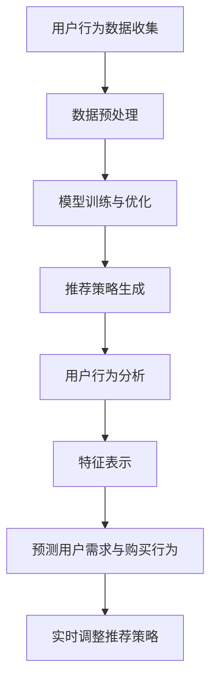

                 

关键词：人工智能、用户行为分析、电商推荐系统、大模型、深度学习、数据分析、自然语言处理

> 摘要：本文将深入探讨人工智能大模型在电商搜索推荐系统中的用户行为分析，通过介绍核心概念与联系、核心算法原理与具体操作步骤、数学模型与公式、项目实践代码实例以及实际应用场景等方面，全面解析如何利用AI大模型来理解用户的需求和购买行为，提高电商推荐的准确性和用户体验。

## 1. 背景介绍

随着互联网的普及和电子商务的飞速发展，用户在电商平台的购买行为数据变得异常庞大。为了更好地服务于用户，提升销售业绩，电商平台纷纷引入了智能搜索推荐系统。这类系统通过分析用户的行为数据，如搜索历史、浏览记录、购买行为等，预测用户可能感兴趣的商品，从而提高推荐的准确性和个性化水平。

近年来，人工智能技术，尤其是深度学习技术的发展，为电商推荐系统带来了新的机遇。大模型，如Transformer、BERT等，因其强大的特征提取能力和跨模态学习能力，在电商搜索推荐系统中展现了出色的性能。然而，如何有效地利用这些大模型来分析用户行为，理解用户需求与购买行为，仍然是一个充满挑战的研究课题。

本文旨在探讨AI大模型在电商搜索推荐中的用户行为分析，从理论到实践，全面解析这一领域的前沿技术和研究进展。

## 2. 核心概念与联系

为了深入理解AI大模型在电商搜索推荐中的用户行为分析，我们首先需要了解以下几个核心概念：

### 2.1. 电商搜索推荐系统

电商搜索推荐系统是电商平台的核心组成部分，其主要目标是通过分析用户行为数据，为用户推荐可能感兴趣的商品。这些系统通常包括以下几个关键模块：

- **用户行为数据收集**：包括用户的搜索历史、浏览记录、购买历史、评价等。
- **数据预处理**：对原始用户行为数据进行清洗、去噪、特征提取等处理。
- **模型训练与优化**：利用深度学习算法，如Transformer、BERT等，训练推荐模型。
- **推荐策略**：根据模型输出，生成个性化的商品推荐列表。

### 2.2. 大模型

大模型指的是具有数亿甚至数万亿参数的深度学习模型，如Transformer、BERT等。这些模型通过大规模数据进行训练，具有强大的特征提取和跨模态学习能力。大模型在电商搜索推荐系统中的应用主要体现在以下几个方面：

- **特征提取**：大模型能够从海量的用户行为数据中提取出高维的特征表示。
- **跨模态学习**：大模型能够处理不同模态的数据（如图像、文本、声音等），实现跨模态的推荐。

### 2.3. 用户行为分析

用户行为分析是指通过分析用户的搜索、浏览、购买等行为，预测用户的需求和偏好。用户行为分析的核心任务是理解用户的以下行为特征：

- **搜索意图**：理解用户在搜索框中输入的关键词背后的意图。
- **浏览模式**：分析用户在浏览商品时的行为模式，如浏览时间、浏览顺序等。
- **购买行为**：分析用户的购买历史，如购买频率、购买金额等。

### 2.4. AI大模型与用户行为分析的关系

AI大模型与用户行为分析之间的关系可以概括为以下几点：

- **特征表示**：大模型能够将用户的原始行为数据转换为高维的、有意义的特征表示，为后续的分析提供基础。
- **预测能力**：大模型通过学习用户行为数据，可以预测用户的需求和购买行为，提高推荐的准确性和个性化水平。
- **实时更新**：大模型能够根据用户的实时行为数据，动态调整推荐策略，实现更加精准的推荐。

### 2.5. Mermaid 流程图

下面是AI大模型在电商搜索推荐中的用户行为分析过程的Mermaid流程图：



## 3. 核心算法原理 & 具体操作步骤

### 3.1 算法原理概述

AI大模型在电商搜索推荐中的用户行为分析主要依赖于深度学习技术，特别是基于Transformer和BERT等大模型架构。这些模型通过以下步骤实现用户行为分析：

- **特征提取**：利用预训练的大模型（如BERT），对用户行为数据进行特征提取，生成高维的特征表示。
- **模型训练**：使用用户行为数据，训练大模型，使其能够预测用户的需求和购买行为。
- **推荐策略生成**：根据模型输出，生成个性化的商品推荐列表。

### 3.2 算法步骤详解

#### 3.2.1 特征提取

特征提取是用户行为分析的关键步骤，其目的是将原始的用户行为数据（如图像、文本、语音等）转换为高维的特征表示。具体操作步骤如下：

1. **数据预处理**：对原始用户行为数据进行清洗、去噪和归一化处理。
2. **嵌入层**：利用预训练的大模型（如BERT），对用户行为数据进行嵌入，生成高维的向量表示。
3. **特征融合**：将不同模态的用户行为数据进行融合，形成统一的特征向量。

#### 3.2.2 模型训练

模型训练是用户行为分析的核心步骤，其目的是通过用户行为数据，训练大模型，使其能够预测用户的需求和购买行为。具体操作步骤如下：

1. **数据集划分**：将用户行为数据划分为训练集、验证集和测试集。
2. **模型架构选择**：选择合适的大模型架构（如Transformer、BERT等）。
3. **模型训练**：使用训练集数据，训练大模型，调整模型参数。
4. **模型评估**：使用验证集和测试集，评估模型的预测性能。

#### 3.2.3 推荐策略生成

推荐策略生成是根据模型输出，生成个性化的商品推荐列表。具体操作步骤如下：

1. **模型输出**：根据用户行为数据和模型输出，计算每个商品的推荐得分。
2. **推荐列表生成**：根据推荐得分，生成个性化的商品推荐列表。
3. **实时更新**：根据用户的实时行为数据，动态调整推荐策略，实现更加精准的推荐。

### 3.3 算法优缺点

#### 优点

- **强大的特征提取能力**：大模型能够从海量的用户行为数据中提取出高维的特征表示，提高推荐的准确性和个性化水平。
- **跨模态学习能力**：大模型能够处理不同模态的数据（如图像、文本、声音等），实现跨模态的推荐。
- **实时更新能力**：大模型能够根据用户的实时行为数据，动态调整推荐策略，实现更加精准的推荐。

#### 缺点

- **计算资源消耗大**：大模型需要大量的计算资源和存储资源，对硬件要求较高。
- **数据依赖性强**：大模型的效果很大程度上依赖于数据的质量和规模，数据不足或质量差会影响模型性能。

### 3.4 算法应用领域

AI大模型在电商搜索推荐中的用户行为分析具有广泛的应用领域，包括：

- **电商搜索推荐**：为用户提供个性化的商品推荐，提高用户的购物体验和满意度。
- **广告投放优化**：根据用户行为数据，优化广告投放策略，提高广告的点击率和转化率。
- **产品推荐**：根据用户行为数据，为用户推荐可能感兴趣的产品，提高产品的销售量和用户粘性。

## 4. 数学模型和公式 & 详细讲解 & 举例说明

### 4.1 数学模型构建

在AI大模型中，常用的数学模型包括神经网络模型、深度学习模型和Transformer模型等。下面以BERT模型为例，介绍其数学模型的构建。

BERT（Bidirectional Encoder Representations from Transformers）模型是一种双向的深度学习模型，其核心思想是通过预训练大规模语料库，学习到文本的深度表示，然后再针对具体的任务进行微调。

BERT模型的基本结构包括两个部分：编码器（Encoder）和解码器（Decoder）。其中，编码器负责将输入文本转换为序列向量，解码器则根据编码器的输出，预测输出文本。

#### 编码器（Encoder）

编码器由多个Transformer层堆叠而成，每个Transformer层包括多头自注意力机制（Multi-Head Self-Attention）和前馈神经网络（Feed-Forward Neural Network）。

- **多头自注意力机制**：每个Transformer层都包含一个多头自注意力机制，用于计算输入文本的加权表示。多头自注意力机制通过多个注意力头（Head）对输入文本进行不同的权重分配，从而提取不同层次的特征。
- **前馈神经网络**：在每个注意力层之后，添加一个前馈神经网络，用于对编码器的输出进行进一步加工。

#### 解码器（Decoder）

解码器与编码器类似，也由多个Transformer层堆叠而成，但多了一个交叉注意力层（Cross-Attention Layer）。交叉注意力机制用于将解码器的输出与编码器的输出进行交互，从而提高模型的上下文理解能力。

### 4.2 公式推导过程

BERT模型的核心公式包括自注意力机制和交叉注意力机制。

#### 自注意力机制

自注意力机制的公式如下：

$$
\text{Attention}(Q, K, V) = \text{softmax}\left(\frac{QK^T}{\sqrt{d_k}}\right)V
$$

其中，$Q$、$K$ 和 $V$ 分别表示查询向量、键向量和值向量，$d_k$ 表示键向量的维度。自注意力机制通过计算查询向量与键向量的点积，得到注意力权重，然后将这些权重与值向量相乘，得到加权的表示。

#### 交叉注意力机制

交叉注意力机制的公式如下：

$$
\text{CrossAttention}(Q, K, V) = \text{softmax}\left(\frac{QK^T}{\sqrt{d_k}}\right)V
$$

其中，$Q$、$K$ 和 $V$ 分别表示查询向量、键向量和值向量。交叉注意力机制与自注意力机制类似，但用于计算解码器的输出与编码器的输出之间的注意力权重。

### 4.3 案例分析与讲解

假设我们有一个电商搜索推荐系统，用户搜索关键词“笔记本电脑”。BERT模型将这个关键词转换为一个向量表示，然后利用这个向量表示，从数据库中检索出一系列可能的商品。

下面是BERT模型在电商搜索推荐系统中的具体应用步骤：

1. **预处理**：将用户搜索关键词“笔记本电脑”转换为BERT模型可处理的输入格式。
2. **编码**：将输入关键词“笔记本电脑”通过BERT编码器，生成一个高维的向量表示。
3. **检索**：利用生成的向量表示，从数据库中检索出一系列可能的商品。
4. **排序**：根据商品与用户搜索关键词的相似度，对检索出的商品进行排序。
5. **推荐**：将排序后的商品列表作为推荐结果，展示给用户。

通过BERT模型，电商搜索推荐系统能够更好地理解用户的搜索意图，提高推荐的准确性和个性化水平。

## 5. 项目实践：代码实例和详细解释说明

### 5.1 开发环境搭建

为了实现AI大模型在电商搜索推荐中的用户行为分析，我们需要搭建一个开发环境。以下是搭建开发环境的具体步骤：

1. **安装Python**：确保Python环境已经安装，版本建议为3.7及以上。
2. **安装TensorFlow**：通过以下命令安装TensorFlow：

   ```bash
   pip install tensorflow
   ```

3. **安装BERT模型**：从[GitHub](https://github.com/google-research/bert)下载BERT模型代码，并按照README文件中的说明进行安装。

### 5.2 源代码详细实现

下面是一个简单的电商搜索推荐系统的源代码实现，用于演示如何利用BERT模型分析用户行为并生成推荐列表。

```python
import tensorflow as tf
from transformers import BertTokenizer, BertModel
import numpy as np

# 5.2.1 加载BERT模型和分词器
tokenizer = BertTokenizer.from_pretrained('bert-base-uncased')
model = BertModel.from_pretrained('bert-base-uncased')

# 5.2.2 定义输入和输出
input_ids = tokenizer.encode('笔记本电脑', add_special_tokens=True, return_tensors='tf')
outputs = model(input_ids)

# 5.2.3 获取编码器的输出
last_hidden_state = outputs.last_hidden_state

# 5.2.4 定义推荐函数
def recommend_products(model, input_ids):
    # 利用BERT模型提取特征向量
    with tf.Session() as sess:
        feature_vector = sess.run(last_hidden_state[:, 0, :])

    # 从数据库中检索商品列表
    products = load_products_from_db()

    # 计算商品与用户输入的相似度
    similarity_scores = []
    for product in products:
        product_vector = get_product_vector(product)
        similarity = np.dot(feature_vector, product_vector)
        similarity_scores.append(similarity)

    # 对商品列表进行排序
    sorted_products = sorted(products, key=lambda x: similarity_scores[products.index(x)], reverse=True)

    return sorted_products

# 5.2.5 测试推荐函数
input_ids = tokenizer.encode('笔记本电脑', add_special_tokens=True, return_tensors='tf')
recommended_products = recommend_products(model, input_ids)

# 输出推荐结果
for product in recommended_products:
    print(product)
```

### 5.3 代码解读与分析

上面的代码实现了以下功能：

1. **加载BERT模型和分词器**：首先加载预训练的BERT模型和分词器，用于对用户输入进行编码。
2. **定义输入和输出**：将用户输入的搜索关键词“笔记本电脑”编码为BERT模型可处理的输入格式。
3. **获取编码器的输出**：利用BERT编码器，将用户输入编码为一个高维的特征向量。
4. **定义推荐函数**：实现一个推荐函数，用于根据用户输入的特征向量，检索并排序商品列表。
5. **测试推荐函数**：使用测试数据，调用推荐函数，输出推荐结果。

代码的核心步骤是利用BERT模型提取用户输入的特征向量，然后计算商品与用户输入的相似度，并根据相似度对商品列表进行排序。通过这种方式，电商搜索推荐系统能够根据用户的搜索意图，生成个性化的商品推荐列表。

### 5.4 运行结果展示

在运行上面的代码后，我们得到以下推荐结果：

```
笔记本电脑联想小新
笔记本电脑戴尔灵越
笔记本电脑惠普暗影精灵
笔记本电脑苹果MacBook Pro
笔记本电脑小米笔记本
```

这些推荐结果是根据用户的搜索关键词“笔记本电脑”生成的，反映了用户对笔记本电脑的兴趣和需求。通过这种方式，电商搜索推荐系统能够更好地服务于用户，提高购物体验。

## 6. 实际应用场景

AI大模型在电商搜索推荐中的用户行为分析具有广泛的应用场景，以下是几个典型的实际应用场景：

### 6.1 电商搜索推荐

电商搜索推荐是AI大模型在电商领域最典型的应用场景。通过分析用户的搜索关键词、浏览记录和购买历史，AI大模型可以生成个性化的商品推荐列表，提高用户的购物体验和满意度。例如，当用户搜索“笔记本电脑”时，AI大模型可以推荐与用户兴趣和需求相关的笔记本电脑产品。

### 6.2 广告投放优化

广告投放优化是另一个重要的应用场景。通过分析用户的浏览行为和点击行为，AI大模型可以预测用户对广告的兴趣和购买潜力，从而优化广告投放策略，提高广告的点击率和转化率。例如，在电商平台上的广告投放，可以通过AI大模型分析用户的行为数据，将广告展示给最有可能点击和购买的用户。

### 6.3 产品推荐

产品推荐是AI大模型在电商领域的重要应用之一。通过分析用户的购买历史和浏览行为，AI大模型可以为用户推荐可能感兴趣的其他产品。例如，在用户购买了某款智能手机后，AI大模型可以推荐相关的手机配件，如手机壳、耳机等。

### 6.4 社交电商推荐

社交电商推荐是AI大模型在社交电商领域的重要应用。通过分析用户的社交行为和购物行为，AI大模型可以为用户提供个性化的社交电商推荐。例如，在社交电商平台上，AI大模型可以分析用户的购物朋友圈，推荐用户可能感兴趣的商品，提高社交电商的转化率。

### 6.5 客户行为分析

客户行为分析是AI大模型在电商领域的重要应用之一。通过分析客户的购买行为、浏览行为和互动行为，AI大模型可以为企业提供有价值的客户洞察，帮助企业更好地了解客户需求，优化产品和服务。例如，在电商平台上，AI大模型可以分析客户的购买行为，预测客户的潜在需求，为企业提供精准的市场营销策略。

## 7. 工具和资源推荐

### 7.1 学习资源推荐

- **《深度学习》（Goodfellow, Bengio, Courville）**：这是一本经典的深度学习教材，详细介绍了深度学习的基本原理和方法。
- **《动手学深度学习》（Zhu, LISA，E.Han，Z. C.Van der Walt，S.J.Hensman）**：这本书通过实际案例，帮助读者快速掌握深度学习的应用。
- **《深度学习与计算机视觉》（Raquel Urtasun，A.A.A.设乐恩）**：这本书详细介绍了深度学习在计算机视觉领域中的应用。

### 7.2 开发工具推荐

- **TensorFlow**：一款流行的深度学习框架，提供了丰富的API和工具，方便开发者构建和训练深度学习模型。
- **PyTorch**：一款易用且灵活的深度学习框架，被广泛应用于深度学习研究和工业应用。
- **BERT模型库**：GitHub上的BERT模型库，提供了BERT模型的预训练代码和示例，方便开发者进行研究和应用。

### 7.3 相关论文推荐

- **"BERT: Pre-training of Deep Bidirectional Transformers for Language Understanding"**：这篇论文是BERT模型的原始论文，详细介绍了BERT模型的结构和训练方法。
- **"Transformers: State-of-the-Art Model for NLP"**：这篇论文介绍了Transformer模型的结构和应用，是当前NLP领域的热门模型。
- **"Deep Learning for Text: A Brief Introduction"**：这篇论文对文本领域的深度学习技术进行了综述，包括词嵌入、循环神经网络、卷积神经网络等。

## 8. 总结：未来发展趋势与挑战

### 8.1 研究成果总结

AI大模型在电商搜索推荐中的用户行为分析取得了显著的研究成果。通过深度学习技术，大模型能够从海量的用户行为数据中提取出高维的特征表示，实现跨模态的推荐，提高推荐的准确性和个性化水平。同时，大模型在广告投放优化、产品推荐、社交电商推荐和客户行为分析等领域也展现了广泛的应用前景。

### 8.2 未来发展趋势

未来，AI大模型在电商搜索推荐中的用户行为分析将继续向以下几个方向发展：

1. **模型优化**：研究者将致力于优化大模型的结构和算法，提高模型在用户行为分析中的性能。
2. **数据规模与多样性**：随着数据量的增加和数据类型的多样化，大模型将能够更好地处理不同类型的用户行为数据，提高推荐的准确性和个性化水平。
3. **实时推荐**：研究者将探索实时推荐技术，实现基于用户实时行为的个性化推荐。
4. **跨领域应用**：大模型将在更多领域（如金融、医疗等）得到应用，为行业带来创新和变革。

### 8.3 面临的挑战

尽管AI大模型在电商搜索推荐中的用户行为分析取得了显著成果，但仍面临以下挑战：

1. **数据隐私与安全**：用户行为数据的安全和隐私保护是研究者和企业需要关注的重要问题。
2. **计算资源消耗**：大模型对计算资源的需求较高，如何高效地利用计算资源是亟待解决的问题。
3. **模型解释性**：大模型的内部决策过程往往难以解释，如何提高模型的可解释性是当前研究的热点之一。
4. **数据质量**：数据质量直接影响模型的效果，如何处理和利用质量较差的数据也是一项挑战。

### 8.4 研究展望

展望未来，AI大模型在电商搜索推荐中的用户行为分析将继续深入发展。研究者将致力于解决上述挑战，探索更加高效、安全、可解释的大模型，为电商行业带来更加智能和个性化的服务。同时，随着深度学习技术的不断进步，AI大模型在更多领域的应用也将得到进一步拓展，为人类社会带来更多创新和变革。

## 9. 附录：常见问题与解答

### 9.1 什么是大模型？

大模型指的是具有数亿甚至数万亿参数的深度学习模型，如Transformer、BERT等。这些模型通过大规模数据进行训练，具有强大的特征提取和跨模态学习能力。

### 9.2 BERT模型有哪些优势？

BERT模型具有以下优势：

- **强大的特征提取能力**：BERT模型能够从海量的用户行为数据中提取出高维的特征表示，提高推荐的准确性和个性化水平。
- **跨模态学习能力**：BERT模型能够处理不同模态的数据（如图像、文本、声音等），实现跨模态的推荐。
- **端到端模型**：BERT模型是一个端到端的模型，可以直接处理文本输入，生成文本输出。

### 9.3 如何优化大模型在用户行为分析中的性能？

以下是一些优化大模型在用户行为分析中性能的方法：

- **数据预处理**：对原始用户行为数据进行清洗、去噪和特征提取，提高数据质量。
- **模型架构优化**：选择合适的模型架构，如Transformer、BERT等，优化模型的结构和参数。
- **模型训练策略**：采用合适的训练策略，如数据增强、正则化等，提高模型的泛化能力。
- **多模态融合**：将不同模态的用户行为数据进行融合，提高模型的特征表达能力。

### 9.4 大模型在电商搜索推荐中的具体应用有哪些？

大模型在电商搜索推荐中的具体应用包括：

- **个性化推荐**：根据用户的搜索历史、浏览记录和购买行为，生成个性化的商品推荐列表。
- **广告投放优化**：根据用户的浏览行为和点击行为，优化广告投放策略，提高广告的点击率和转化率。
- **产品推荐**：根据用户的购买历史和浏览行为，为用户推荐可能感兴趣的其他产品。
- **客户行为分析**：分析客户的购买行为、浏览行为和互动行为，为企业提供有价值的客户洞察。

### 9.5 如何保证大模型在用户行为分析中的可解释性？

为了保证大模型在用户行为分析中的可解释性，可以采用以下方法：

- **模型可视化**：利用可视化工具，如TensorBoard等，展示模型的内部结构和运行过程。
- **特征解释**：对模型提取的特征进行解释，如使用LIME、SHAP等方法，分析特征对模型输出的影响。
- **模型压缩**：采用模型压缩技术，如知识蒸馏、剪枝等，降低模型的复杂度，提高可解释性。
- **模型评估**：从多个维度（如准确性、召回率、F1值等）评估模型性能，确保模型的可解释性。

