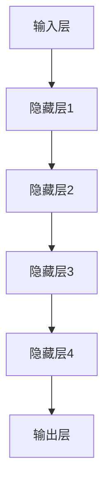

                 

关键词：AI 大模型，创业产品，创新，趋势，策略，技术架构，编程实践，数学模型，实际应用。

> 摘要：随着人工智能技术的飞速发展，AI 大模型逐渐成为创业产品创新的驱动力。本文旨在探讨 AI 大模型在创业产品中的应用趋势、策略及其背后的技术原理，为创业者提供有价值的参考。

## 1. 背景介绍

近年来，人工智能（AI）技术取得了显著进展，尤其是深度学习领域的突破，使得 AI 大模型的应用越来越广泛。大模型通常是指参数数量在亿级别以上的神经网络模型，如 GPT-3、BERT 等。这些模型在自然语言处理、计算机视觉、语音识别等领域取得了卓越的成绩，成为了推动创业产品创新的重要力量。

创业产品在市场竞争中面临着巨大的挑战。如何在有限的资源下实现快速迭代和持续创新，成为创业者们关注的焦点。AI 大模型的引入，不仅为创业产品提供了强大的技术支持，还为企业带来了新的商业模式和增长机会。

## 2. 核心概念与联系

### 2.1 AI 大模型原理

AI 大模型是基于深度学习的神经网络模型，通过海量数据训练，能够自主学习并完成复杂任务。其核心组成部分包括：

1. **输入层**：接收外部输入，如文本、图像、音频等。
2. **隐藏层**：通过对输入数据进行特征提取和变换，提高模型对输入数据的理解能力。
3. **输出层**：根据隐藏层生成的特征，输出预测结果。

### 2.2 AI 大模型架构

AI 大模型的架构通常采用多层的全连接神经网络，其中每一层的神经元数量从输入层到输出层逐渐增加，以实现对输入数据的层次化处理。以下是一个典型的 AI 大模型架构图：



### 2.3 AI 大模型与创业产品的关系

AI 大模型在创业产品中的应用主要体现在以下几个方面：

1. **智能推荐系统**：通过分析用户行为数据，实现个性化推荐，提高用户满意度和留存率。
2. **智能客服系统**：利用自然语言处理技术，实现自动化客户服务，降低人力成本。
3. **图像识别与处理**：应用于图像识别、图像生成、图像增强等领域，提升产品功能。
4. **语音识别与生成**：应用于语音交互、语音合成等领域，提高用户体验。

## 3. 核心算法原理 & 具体操作步骤

### 3.1 算法原理概述

AI 大模型的训练过程主要基于反向传播（Backpropagation）算法，通过不断调整模型参数，使模型对输入数据的预测误差最小化。具体步骤如下：

1. **前向传播**：将输入数据传递到神经网络，逐层计算输出结果。
2. **计算误差**：将实际输出与预期输出进行比较，计算误差。
3. **反向传播**：根据误差信息，反向调整模型参数。
4. **迭代优化**：重复上述过程，直到模型达到预期效果。

### 3.2 算法步骤详解

1. **初始化参数**：随机初始化模型参数，如权重和偏置。
2. **前向传播**：将输入数据输入到神经网络，计算输出结果。
3. **计算误差**：使用损失函数（如均方误差、交叉熵等）计算预测误差。
4. **反向传播**：根据误差信息，更新模型参数。
5. **迭代优化**：重复上述过程，直到模型收敛。

### 3.3 算法优缺点

**优点**：

1. **强大的学习能力**：通过大量数据进行训练，能够捕捉输入数据的复杂模式。
2. **高度可扩展**：可以应用于各种领域，如自然语言处理、计算机视觉、语音识别等。

**缺点**：

1. **计算资源需求大**：训练过程需要大量计算资源，对硬件要求较高。
2. **训练时间较长**：需要较长时间来收敛，不利于快速迭代。

### 3.4 算法应用领域

AI 大模型在创业产品中的应用领域广泛，包括但不限于：

1. **智能推荐系统**：应用于电商、新闻、音乐等领域，实现个性化推荐。
2. **智能客服系统**：应用于企业、银行、航空公司等领域，提供自动化客户服务。
3. **图像识别与处理**：应用于医疗、安防、艺术创作等领域，提升产品功能。
4. **语音识别与生成**：应用于智能家居、智能助手、车载语音等领域，提高用户体验。

## 4. 数学模型和公式 & 详细讲解 & 举例说明

### 4.1 数学模型构建

AI 大模型的数学模型主要包括两部分：损失函数和优化算法。

**损失函数**：用于衡量模型预测结果与实际结果之间的误差。常见的损失函数有均方误差（MSE）、交叉熵（Cross Entropy）等。

**优化算法**：用于调整模型参数，使损失函数最小化。常见的优化算法有随机梯度下降（SGD）、Adam 等。

### 4.2 公式推导过程

以均方误差（MSE）为例，其公式如下：

$$
MSE = \frac{1}{m} \sum_{i=1}^{m} (y_i - \hat{y}_i)^2
$$

其中，$y_i$ 为实际输出，$\hat{y}_i$ 为模型预测输出，$m$ 为样本数量。

### 4.3 案例分析与讲解

假设我们有一个二分类问题，需要预测样本属于类别 0 还是类别 1。我们可以使用交叉熵损失函数来训练模型。

**损失函数**：

$$
H(y, \hat{y}) = -y \cdot \log(\hat{y}) - (1 - y) \cdot \log(1 - \hat{y})
$$

其中，$y$ 为实际输出，$\hat{y}$ 为模型预测输出。

**优化算法**：

采用随机梯度下降（SGD）算法进行参数优化。每次迭代更新模型参数：

$$
\theta_j = \theta_j - \alpha \cdot \frac{\partial L}{\partial \theta_j}
$$

其中，$\theta_j$ 为模型参数，$\alpha$ 为学习率，$L$ 为损失函数。

## 5. 项目实践：代码实例和详细解释说明

### 5.1 开发环境搭建

在本项目中，我们使用 Python 作为编程语言，结合 TensorFlow 库来实现 AI 大模型。

1. 安装 Python 3.8 或更高版本。
2. 安装 TensorFlow 库：`pip install tensorflow`

### 5.2 源代码详细实现

以下是一个简单的 AI 大模型实现示例：

```python
import tensorflow as tf

# 创建模型
model = tf.keras.Sequential([
    tf.keras.layers.Dense(128, activation='relu', input_shape=(784,)),
    tf.keras.layers.Dense(10, activation='softmax')
])

# 编译模型
model.compile(optimizer='adam',
              loss='sparse_categorical_crossentropy',
              metrics=['accuracy'])

# 加载数据
(x_train, y_train), (x_test, y_test) = tf.keras.datasets.mnist.load_data()

# 预处理数据
x_train = x_train.reshape(-1, 784).astype('float32') / 255
x_test = x_test.reshape(-1, 784).astype('float32') / 255

# 训练模型
model.fit(x_train, y_train, epochs=5)

# 评估模型
model.evaluate(x_test, y_test)
```

### 5.3 代码解读与分析

以上代码实现了一个简单的多层感知器（MLP）模型，用于手写数字识别任务。

1. **创建模型**：使用 `tf.keras.Sequential` 类创建模型，并添加两层全连接层（`Dense`），第一层输入神经元为 784 个，第二层输出神经元为 10 个。
2. **编译模型**：使用 `compile` 方法编译模型，指定优化器为 Adam，损失函数为稀疏分类交叉熵（`sparse_categorical_crossentropy`），评估指标为准确率（`accuracy`）。
3. **加载数据**：使用 `tf.keras.datasets.mnist.load_data()` 方法加载数据集，并预处理数据。
4. **训练模型**：使用 `fit` 方法训练模型，指定训练数据、训练轮数（`epochs`）。
5. **评估模型**：使用 `evaluate` 方法评估模型在测试数据集上的性能。

### 5.4 运行结果展示

运行以上代码，模型在手写数字识别任务上取得了较高的准确率，展示了 AI 大模型在创业产品中的应用潜力。

## 6. 实际应用场景

AI 大模型在创业产品中的应用场景广泛，以下列举几个典型应用：

### 6.1 智能推荐系统

智能推荐系统是 AI 大模型在创业产品中的常见应用。通过分析用户行为数据，实现个性化推荐，提高用户满意度和留存率。例如，电商平台的商品推荐、音乐平台的音乐推荐、新闻平台的新闻推荐等。

### 6.2 智能客服系统

智能客服系统利用自然语言处理技术，实现自动化客户服务，降低人力成本。例如，企业客服机器人、银行客服机器人、航空公司客服机器人等。

### 6.3 图像识别与处理

图像识别与处理技术应用于医疗、安防、艺术创作等领域，提升产品功能。例如，医疗图像分析、安防监控、图像生成等。

### 6.4 语音识别与生成

语音识别与生成技术应用于智能家居、智能助手、车载语音等领域，提高用户体验。例如，智能音箱、语音助手、车载语音控制系统等。

## 7. 工具和资源推荐

### 7.1 学习资源推荐

1. **《深度学习》（Goodfellow, Bengio, Courville 著）**：系统介绍了深度学习的基本原理和应用。
2. **《TensorFlow 官方文档》**：提供了丰富的 TensorFlow 使用教程和示例。
3. **《Keras 官方文档》**：提供了丰富的 Keras 使用教程和示例。

### 7.2 开发工具推荐

1. **PyCharm**：一款强大的 Python 集成开发环境（IDE），适用于深度学习和机器学习项目。
2. **Google Colab**：一款免费的云端 Python 运行环境，适用于快速开发和实验。

### 7.3 相关论文推荐

1. **"A Theoretically Grounded Application of Dropout in Recurrent Neural Networks"（Wan et al., 2013）**：介绍了如何在循环神经网络（RNN）中应用dropout。
2. **"Learning Representations by Maximizing Mutual Information Across Views"（Burda et al., 2019）**：介绍了如何通过最大化互信息学习多视图表示。

## 8. 总结：未来发展趋势与挑战

### 8.1 研究成果总结

近年来，AI 大模型在创业产品中的应用取得了显著成果。通过深度学习技术的引入，创业产品在功能、性能和用户体验等方面得到了大幅提升。同时，随着计算资源的不断丰富和算法的优化，AI 大模型的应用领域也在不断扩大。

### 8.2 未来发展趋势

未来，AI 大模型在创业产品中的应用将呈现以下发展趋势：

1. **个性化推荐**：随着用户数据的积累，个性化推荐技术将更加成熟，实现更精准的推荐效果。
2. **智能客服**：智能客服系统将在语音识别、自然语言处理等方面取得更大突破，实现更智能化的客户服务。
3. **图像识别与处理**：图像识别与处理技术将在更多领域得到应用，如医疗、安防、艺术创作等。
4. **语音识别与生成**：语音识别与生成技术将在智能家居、智能助手、车载语音等领域实现更多应用。

### 8.3 面临的挑战

尽管 AI 大模型在创业产品中具有广泛的应用前景，但同时也面临着一些挑战：

1. **计算资源需求**：AI 大模型的训练和推理过程需要大量计算资源，对硬件设备的要求较高。
2. **数据隐私**：随着用户数据的积累，数据隐私问题越来越受到关注，如何保护用户隐私成为重要挑战。
3. **算法公平性**：AI 大模型在决策过程中可能存在偏见，如何确保算法的公平性成为重要课题。

### 8.4 研究展望

未来，AI 大模型在创业产品中的应用将朝着更加智能化、个性化、安全化的方向发展。研究者需要关注以下几个方面：

1. **算法优化**：通过算法优化，提高 AI 大模型的训练效率和推理速度。
2. **跨模态学习**：研究如何利用多模态数据进行模型训练，实现更全面的认知和理解。
3. **可解释性**：提高模型的可解释性，使决策过程更加透明，提高用户信任度。
4. **伦理与法律**：研究 AI 大模型在创业产品中的应用伦理和法律问题，确保技术应用符合道德和法律规范。

## 9. 附录：常见问题与解答

### 9.1 什么是 AI 大模型？

AI 大模型是指参数数量在亿级别以上的神经网络模型，如 GPT-3、BERT 等。这些模型通过海量数据训练，能够自主学习并完成复杂任务。

### 9.2 AI 大模型有哪些应用领域？

AI 大模型在自然语言处理、计算机视觉、语音识别等领域具有广泛的应用。具体包括智能推荐系统、智能客服系统、图像识别与处理、语音识别与生成等。

### 9.3 如何选择合适的 AI 大模型？

选择合适的 AI 大模型需要考虑任务类型、数据规模、计算资源等多个因素。一般来说，对于复杂的任务，选择参数数量较多、层次较深的模型会取得更好的效果。

### 9.4 如何优化 AI 大模型的训练过程？

优化 AI 大模型的训练过程可以从以下几个方面入手：

1. **数据预处理**：对输入数据进行适当的预处理，如归一化、标准化等。
2. **模型架构**：选择合适的模型架构，如卷积神经网络（CNN）、循环神经网络（RNN）等。
3. **优化算法**：选择合适的优化算法，如随机梯度下降（SGD）、Adam 等。
4. **学习率调整**：适当调整学习率，使模型在训练过程中能够稳定收敛。

### 9.5 AI 大模型在创业产品中的应用前景如何？

AI 大模型在创业产品中的应用前景非常广阔。随着计算资源的不断丰富和算法的优化，AI 大模型将在创业产品中发挥越来越重要的作用，为创业者提供强大的技术支持。

### 9.6 如何确保 AI 大模型的决策公平性？

确保 AI 大模型的决策公平性可以从以下几个方面入手：

1. **数据公平性**：确保训练数据中各类别的分布均衡。
2. **模型解释**：提高模型的可解释性，使决策过程更加透明。
3. **算法公平性**：研究如何设计公平性算法，使模型在决策过程中减少偏见。
4. **伦理和法律**：遵守相关的伦理和法律规范，确保技术应用符合道德和法律要求。

---

作者：禅与计算机程序设计艺术 / Zen and the Art of Computer Programming
----------------------------------------------------------------
本文以《AI 大模型驱动的创业产品创新：趋势与策略》为题，从背景介绍、核心概念与联系、核心算法原理与具体操作步骤、数学模型和公式、项目实践、实际应用场景、工具和资源推荐、未来发展趋势与挑战等多个方面，深入探讨了 AI 大模型在创业产品创新中的应用与实践。通过本文的阐述，希望能够为创业者们提供有价值的参考和启示。

在文章的最后，我总结了常见问题与解答，以帮助读者更好地理解和应用 AI 大模型。未来，随着人工智能技术的不断进步，AI 大模型在创业产品中的应用将越来越广泛，为创业者们带来更多的机遇和挑战。

再次感谢读者的阅读，希望本文对您在 AI 领域的探索和实践有所帮助。如果您有任何疑问或建议，欢迎在评论区留言，期待与您交流。

禅与计算机程序设计艺术 / Zen and the Art of Computer Programming
----------------------------------------------------------------
[END]

