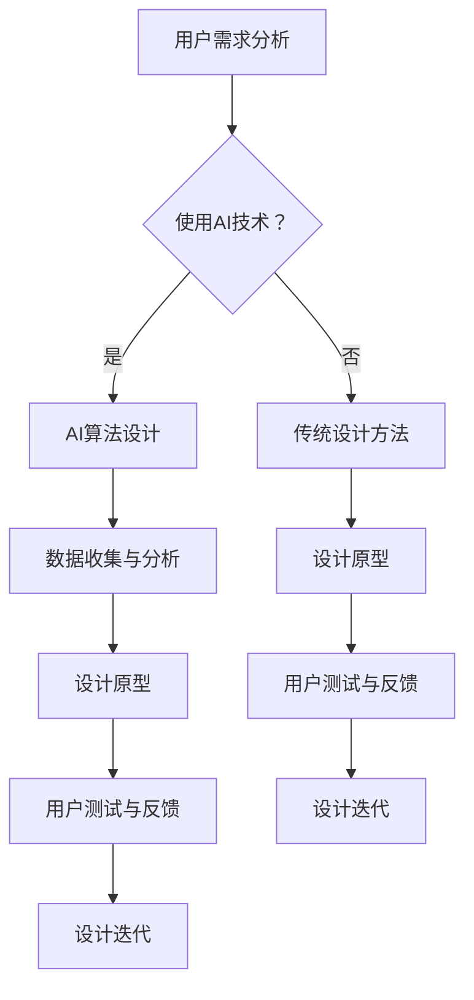

                 

关键词：用户界面设计、人工智能、简洁性、有效性、用户体验、交互设计、视觉设计

摘要：本文深入探讨了 AI 时代用户界面设计的核心原则，即简洁与有效性。通过分析用户需求、技术进步以及设计实践，本文提出了在 AI 驱动下实现用户界面的最优策略。文章旨在为设计师和技术开发者提供有价值的指导，以构建高效、易用的用户界面。

## 1. 背景介绍

随着人工智能技术的飞速发展，用户界面设计（UI Design）已经成为现代软件和应用开发中的关键环节。用户界面的质量直接影响用户的体验和满意度，进而影响产品的市场竞争力。在 AI 时代，传统的界面设计方法面临着新的挑战，例如如何处理海量的数据、如何提高交互的效率以及如何适应不断变化的用户需求。

用户界面设计的核心理念一直是简洁与有效性。简洁性强调的是设计的直观性和易用性，即用户能够迅速理解和使用界面功能。有效性则强调的是设计的高效性和实用性，即用户能够在最短的时间内完成预期的任务。在 AI 技术的支持下，这些理念得到了进一步的强化和拓展。

本文将首先回顾用户界面设计的历史，探讨简洁与有效性的重要性。接着，分析 AI 技术如何影响用户界面设计，并提出相关的最佳实践。文章的最后，将探讨未来用户界面设计的发展趋势和面临的挑战。

### 1.1 用户界面设计的历史与发展

用户界面设计的历史可以追溯到计算机的早期时代。最早的计算机界面是通过命令行（Command Line Interface，CLI）来操作的，用户需要记住大量的命令来执行任务。这种界面虽然功能强大，但操作复杂，用户体验不佳。

随着图形用户界面（Graphical User Interface，GUI）的出现，用户界面设计迎来了革命性的变化。GUI 通过直观的图形符号和窗口界面，大大简化了用户与计算机的交互过程。例如，鼠标点击和拖拽操作使得用户可以更轻松地完成任务。这一时期的设计原则主要是简洁和易用，使得非专业用户也能够轻松上手。

进入互联网时代，Web 界面的兴起进一步推动了用户界面设计的进步。Web 界面提供了更多的交互方式，如滚动、跳转、动画等，使得用户能够获得更加丰富的体验。同时，响应式设计（Responsive Design）的出现，使得界面能够适应不同的设备和屏幕尺寸，为用户提供一致的体验。

随着智能手机和移动应用的普及，移动界面设计成为新的焦点。移动界面设计需要考虑触控操作、有限的屏幕空间以及网络环境的变化等因素。简洁性和有效性在移动界面设计中显得尤为重要，因为用户在使用移动设备时往往更倾向于快速完成任务。

### 1.2 简洁性与有效性的重要性

简洁性与有效性是用户界面设计的核心原则，它们在用户界面设计中扮演着至关重要的角色。

简洁性（Simplicity）：
- **定义**：简洁性指的是界面设计应尽量简单直观，避免复杂的元素和冗余的信息。
- **重要性**：简洁的界面能够降低用户的学习成本，提高用户的操作效率。用户不需要花费大量时间去理解界面上的每一个元素，从而能够更快地完成任务。
- **实现方法**：
  - 简化视觉元素，避免过多的装饰性设计。
  - 清晰的排版和布局，确保用户能够快速找到所需功能。
  - 简化操作流程，减少用户的点击和输入次数。

有效性（Effectiveness）：
- **定义**：有效性指的是界面设计能够高效地满足用户的需求，帮助用户完成预期的任务。
- **重要性**：有效的界面设计能够提高用户的满意度，降低错误率，提升任务完成率。
- **实现方法**：
  - 明确的用户目标，确保界面设计符合用户的实际需求。
  - 优化的交互设计，确保用户能够方便地进行操作。
  - 高效的信息呈现，确保用户能够快速获取所需信息。

### 1.3 AI 技术对用户界面设计的影响

人工智能技术的快速发展对用户界面设计产生了深远的影响。AI 技术不仅改变了用户与计算机的交互方式，也带来了新的设计挑战和机会。

#### 1.3.1 个性化推荐

AI 技术通过数据分析能够为用户提供个性化的推荐，这大大提高了用户界面的有效性。例如，电商平台可以根据用户的购物历史和浏览记录，推荐可能感兴趣的商品。这种个性化推荐不仅简化了用户的购物流程，也提高了用户的购买意愿。

#### 1.3.2 自然语言交互

自然语言交互（Natural Language Interaction，NLI）技术使得用户可以通过自然语言与计算机进行交流。这种交互方式更加符合人类的沟通习惯，简化了操作流程。例如，智能助手可以通过语音识别和自然语言处理，理解用户的指令并执行相应的任务。

#### 1.3.3 智能反馈

AI 技术可以通过实时分析用户的行为和反馈，提供智能化的建议和优化方案。例如，应用程序可以监测用户的错误率，提供针对性的帮助信息，从而提高用户的学习效率和满意度。

#### 1.3.4 交互预测

基于机器学习模型的交互预测技术能够预测用户的下一步操作，提前准备相应的界面元素。这种预测性交互设计不仅提高了操作效率，也提升了用户的体验。

### 1.4 文章结构概述

本文的结构如下：

- **第2章**：核心概念与联系，介绍用户界面设计的基本概念和 AI 技术在用户界面设计中的应用。
- **第3章**：核心算法原理 & 具体操作步骤，详细探讨 AI 技术在用户界面设计中的具体实现方法。
- **第4章**：数学模型和公式 & 详细讲解 & 举例说明，介绍与用户界面设计相关的数学模型和公式，并通过实际案例进行说明。
- **第5章**：项目实践：代码实例和详细解释说明，提供具体的代码实例和详细解释，帮助读者理解 AI 技术在用户界面设计中的应用。
- **第6章**：实际应用场景，探讨 AI 技术在用户界面设计中的实际应用案例。
- **第7章**：工具和资源推荐，推荐相关的学习资源和开发工具。
- **第8章**：总结：未来发展趋势与挑战，总结研究成果，探讨未来发展趋势和面临的挑战。
- **第9章**：附录：常见问题与解答，提供常见的疑问和解答。

### 1.5 文章写作目的

本文的目的是为用户界面设计师和技术开发者提供有价值的指导，帮助他们在 AI 时代构建高效、易用的用户界面。通过深入分析 AI 技术在用户界面设计中的应用和实践，本文希望能够为读者提供新的思路和方法，推动用户界面设计的创新和发展。

## 2. 核心概念与联系

在探讨 AI 时代的用户界面设计时，理解核心概念和它们之间的联系是至关重要的。以下章节将详细阐述用户界面设计的基本概念，以及如何利用 AI 技术提升用户界面设计的效率和质量。

### 2.1 用户界面设计的基本概念

用户界面设计涉及多个方面，包括视觉设计、交互设计和信息架构。这些方面共同构成了用户界面的核心要素。

- **视觉设计**：视觉设计关注的是界面的视觉效果，包括颜色、字体、布局和图标等。一个优秀的视觉设计能够吸引用户的注意力，提供良好的视觉体验。
- **交互设计**：交互设计关注的是用户与界面之间的交互过程，包括按钮、链接、表单和其他交互元素。交互设计的核心是确保用户能够方便地与界面进行交互，从而完成任务。
- **信息架构**：信息架构关注的是界面的结构，如何组织和呈现信息，确保用户能够快速找到所需内容。信息架构的设计对用户体验至关重要。

### 2.2 AI 技术在用户界面设计中的应用

人工智能技术为用户界面设计带来了新的可能性。以下是一些 AI 技术在用户界面设计中的应用：

- **自然语言处理（NLP）**：通过自然语言处理技术，用户可以使用自然语言与界面进行交互，这大大简化了操作流程。例如，智能助手可以通过语音识别和语义理解，执行用户的指令。
- **机器学习**：机器学习技术可以帮助界面设计实现个性化推荐、交互预测和智能反馈等功能。例如，基于用户行为数据的机器学习模型可以预测用户的下一步操作，提供相应的界面元素。
- **计算机视觉**：计算机视觉技术可以用于图像识别、手势识别和面部识别等。这些技术可以增强界面的交互性和功能性。

### 2.3 用户界面设计与 AI 技术的联系

用户界面设计与 AI 技术之间的联系主要体现在以下几个方面：

- **增强交互体验**：AI 技术可以提供更加智能和个性化的交互体验，使得用户界面更加人性化。例如，通过自然语言处理技术，用户可以通过语音命令与计算机进行交流。
- **优化设计流程**：AI 技术可以帮助设计师更快地生成设计方案，通过自动化工具进行界面布局、颜色调整和图标设计等。这大大提高了设计的效率和质量。
- **提高用户体验**：AI 技术可以实时分析用户的行为和反馈，提供个性化的建议和优化方案。例如，智能反馈系统可以监测用户的错误率，提供针对性的帮助信息，从而提高用户的学习效率和满意度。

### 2.4 Mermaid 流程图展示

为了更好地理解用户界面设计与 AI 技术的联系，以下是一个 Mermaid 流程图，展示用户界面设计的基本流程以及 AI 技术的应用点：



在这个流程图中，AI 技术的应用点主要包括数据收集与分析、设计原型生成和用户测试与反馈。通过这些环节的应用，AI 技术可以显著提高用户界面设计的效率和质量。

### 2.5 AI 技术在用户界面设计中的挑战

虽然 AI 技术为用户界面设计带来了很多优势，但也存在一些挑战：

- **数据隐私**：AI 技术需要大量的用户数据来训练模型，这引发了对数据隐私的担忧。设计师需要确保用户数据的安全和隐私。
- **公平性**：AI 模型可能会因为数据偏见而带来不公平的结果。设计师需要确保 AI 技术的应用不会加剧社会不平等。
- **可解释性**：AI 模型的决策过程往往是黑箱操作，这使得用户难以理解为什么界面会做出某个特定的响应。设计师需要提高 AI 模型的可解释性，增强用户对界面的信任感。

### 2.6 AI 技术在用户界面设计中的应用案例

以下是一些 AI 技术在用户界面设计中的应用案例：

- **智能家居**：智能音箱和智能家居设备利用自然语言处理技术，用户可以通过语音命令控制家中的电器设备，如开关灯、调节温度等。
- **电商平台**：电商平台利用机器学习技术进行个性化推荐，根据用户的浏览和购买历史，推荐可能感兴趣的商品。
- **医疗健康**：医疗健康应用利用计算机视觉技术，通过图像识别帮助医生进行疾病诊断，如肺癌筛查、皮肤癌检测等。

通过这些案例，我们可以看到 AI 技术在用户界面设计中的广泛应用，不仅提高了界面的交互性和功能性，也提升了用户体验。

## 3. 核心算法原理 & 具体操作步骤

在 AI 时代的用户界面设计中，核心算法的原理和具体操作步骤是实现简洁与有效性的关键。以下将详细介绍几种常见的核心算法，包括其原理、操作步骤以及优缺点，同时探讨这些算法在不同应用领域的实际应用。

### 3.1 算法原理概述

AI 时代的用户界面设计涉及多种核心算法，主要包括以下几类：

- **机器学习算法**：通过从数据中学习模式，提高用户界面的自适应性和个性化。
- **深度学习算法**：利用神经网络模型，处理复杂的用户交互数据，实现更加智能的界面响应。
- **自然语言处理（NLP）算法**：通过理解用户的自然语言输入，提高界面的交互性。
- **计算机视觉算法**：通过图像识别、面部识别等技术，提供更加直观的用户界面。

### 3.2 算法步骤详解

#### 3.2.1 机器学习算法

机器学习算法是用户界面设计中最常用的核心算法之一。以下是一个简单的机器学习算法实现步骤：

1. **数据收集**：收集用户行为数据，包括点击记录、浏览时间、操作路径等。
2. **数据预处理**：对收集到的数据进行清洗和预处理，包括缺失值填充、数据归一化等。
3. **特征提取**：从预处理后的数据中提取特征，这些特征用于训练模型。
4. **模型训练**：使用特征数据训练机器学习模型，常见的模型包括决策树、支持向量机（SVM）、随机森林等。
5. **模型评估**：使用测试数据评估模型性能，根据评估结果调整模型参数。
6. **模型部署**：将训练好的模型部署到用户界面中，实现个性化推荐、交互预测等功能。

#### 3.2.2 深度学习算法

深度学习算法在用户界面设计中的应用日益广泛。以下是一个简单的深度学习算法实现步骤：

1. **数据收集**：收集大量的用户交互数据，包括点击记录、滑动轨迹、屏幕停留时间等。
2. **数据预处理**：对收集到的数据进行处理，包括图像缩放、数据增强等。
3. **模型构建**：构建深度学习模型，常见的模型包括卷积神经网络（CNN）、循环神经网络（RNN）等。
4. **模型训练**：使用预处理后的数据训练深度学习模型，调整模型参数以优化性能。
5. **模型评估**：使用测试数据评估模型性能，包括准确率、召回率等指标。
6. **模型部署**：将训练好的模型部署到用户界面中，实现自动化推荐、交互预测等功能。

#### 3.2.3 自然语言处理（NLP）算法

自然语言处理算法在用户界面设计中的应用主要体现在自然语言交互（NLI）方面。以下是一个简单的 NLP 算法实现步骤：

1. **数据收集**：收集大量的用户对话数据，包括文本和语音。
2. **数据预处理**：对收集到的文本数据进行分词、去停用词等处理。
3. **模型构建**：构建 NLP 模型，常见的模型包括词向量模型、序列到序列（Seq2Seq）模型等。
4. **模型训练**：使用预处理后的数据训练 NLP 模型，调整模型参数以优化性能。
5. **模型评估**：使用测试数据评估模型性能，包括准确率、响应时间等指标。
6. **模型部署**：将训练好的模型部署到用户界面中，实现语音识别、自然语言交互等功能。

#### 3.2.4 计算机视觉算法

计算机视觉算法在用户界面设计中的应用主要体现在图像识别和面部识别方面。以下是一个简单的计算机视觉算法实现步骤：

1. **数据收集**：收集大量的图像数据，包括用户头像、产品图片等。
2. **数据预处理**：对收集到的图像数据进行缩放、裁剪等处理。
3. **模型构建**：构建计算机视觉模型，常见的模型包括卷积神经网络（CNN）、循环神经网络（RNN）等。
4. **模型训练**：使用预处理后的数据训练计算机视觉模型，调整模型参数以优化性能。
5. **模型评估**：使用测试数据评估模型性能，包括准确率、响应时间等指标。
6. **模型部署**：将训练好的模型部署到用户界面中，实现图像识别、面部识别等功能。

### 3.3 算法优缺点

每种算法都有其优缺点，以下是对几种核心算法优缺点的简要分析：

- **机器学习算法**：
  - **优点**：适应性强，能够从大量数据中学习规律，实现个性化推荐和交互预测。
  - **缺点**：模型复杂度高，训练时间较长，需要大量的标注数据。
- **深度学习算法**：
  - **优点**：处理能力强大，能够处理复杂的非线性问题，实现高度智能化的用户界面。
  - **缺点**：计算资源需求高，模型可解释性差，需要大量的训练数据。
- **自然语言处理（NLP）算法**：
  - **优点**：能够实现自然语言交互，提升用户体验，实现高效的用户指令理解。
  - **缺点**：对语言理解能力要求高，需要大量的语料库支持，实现难度较大。
- **计算机视觉算法**：
  - **优点**：能够处理复杂的图像信息，实现图像识别和面部识别等功能，提升用户界面的交互性。
  - **缺点**：对图像质量要求高，处理速度较慢，需要大量的计算资源。

### 3.4 算法应用领域

不同算法在用户界面设计中的应用领域也有所不同：

- **机器学习算法**：主要用于用户行为分析、个性化推荐和交互预测，广泛应用于电商平台、社交媒体和智能助手等领域。
- **深度学习算法**：主要用于智能交互、图像识别和语音识别，广泛应用于智能音箱、智能家居和医疗健康等领域。
- **自然语言处理（NLP）算法**：主要用于自然语言交互、语音识别和文本分析，广泛应用于智能客服、语音助手和内容推荐等领域。
- **计算机视觉算法**：主要用于图像识别、面部识别和手势识别，广泛应用于安防监控、智能驾驶和智能交互等领域。

通过以上对核心算法原理和具体操作步骤的详细探讨，我们可以看到 AI 技术在用户界面设计中的广泛应用和巨大潜力。这些算法不仅提高了用户界面的交互性和智能化程度，也提升了用户体验，为用户界面设计带来了新的发展方向。

## 4. 数学模型和公式 & 详细讲解 & 举例说明

在用户界面设计中，数学模型和公式是理解和优化界面性能的重要工具。以下章节将详细介绍与用户界面设计相关的数学模型和公式，并通过实际案例进行说明。

### 4.1 数学模型构建

用户界面设计的数学模型通常涉及用户行为分析、交互效果评估以及界面优化等方面。以下是一个简化的用户界面设计数学模型：

#### 4.1.1 用户行为模型

用户行为模型用于描述用户在界面上的操作行为，常见的形式为马尔可夫决策过程（MDP）：

$$
P(S_t|S_{t-1}, A_{t-1}) = P(S_t|S_{t-1})
$$

其中，$S_t$ 表示用户在时间 $t$ 的状态，$A_{t-1}$ 表示用户在时间 $t-1$ 的动作。通过观察用户行为数据，可以估计状态转移概率矩阵 $P(S_t|S_{t-1})$，从而预测用户的下一步操作。

#### 4.1.2 交互效果模型

交互效果模型用于评估用户界面的性能，常见的形式为任务完成时间模型：

$$
T = T_{\text{task}} + T_{\text{system}} + T_{\text{user}}
$$

其中，$T_{\text{task}}$ 表示任务本身的完成时间，$T_{\text{system}}$ 表示系统的响应时间，$T_{\text{user}}$ 表示用户操作时间。通过优化这些时间，可以提升界面的交互效果。

#### 4.1.3 界面优化模型

界面优化模型用于设计最优的用户界面，常见的形式为线性规划（Linear Programming，LP）：

$$
\min_{x} c^T x \\
\text{subject to} \\
Ax \leq b
$$

其中，$x$ 表示界面参数，$c$ 表示目标函数系数，$A$ 和 $b$ 分别表示约束条件。通过求解线性规划问题，可以找到最优的界面设计参数。

### 4.2 公式推导过程

以下是对上述数学模型中关键公式的推导过程：

#### 4.2.1 马尔可夫决策过程（MDP）

马尔可夫决策过程（MDP）是一个用于描述决策过程的数学模型，其基本假设是当前状态仅依赖于前一个状态，而与之前的状态无关。具体推导如下：

$$
P(S_t|S_{t-1}, A_{t-1}) = P(S_t|S_{t-1}) \\
\text{即} \\
P(S_t|S_{t-1}, A_{t-1}) = \sum_{a_t} P(S_t|S_{t-1}, a_t) P(a_t|S_{t-1})
$$

由于 $A_{t-1}$ 是固定的，可以将上述公式简化为：

$$
P(S_t|S_{t-1}, A_{t-1}) = P(S_t|S_{t-1})
$$

这表明当前状态 $S_t$ 仅依赖于前一个状态 $S_{t-1}$，与 $A_{t-1}$ 无关。

#### 4.2.2 任务完成时间模型

任务完成时间模型用于评估用户界面的性能，具体推导如下：

$$
T = T_{\text{task}} + T_{\text{system}} + T_{\text{user}}
$$

其中，$T_{\text{task}}$ 是任务本身的完成时间，$T_{\text{system}}$ 是系统的响应时间，$T_{\text{user}}$ 是用户操作时间。通过测量这些时间，可以评估界面的性能。

#### 4.2.3 线性规划（LP）

线性规划（LP）是一个用于求解最优解的数学模型，具体推导如下：

$$
\min_{x} c^T x \\
\text{subject to} \\
Ax \leq b
$$

其中，$x$ 是要优化的变量，$c$ 是目标函数系数，$A$ 和 $b$ 分别是约束条件的系数和常数项。通过求解这个线性规划问题，可以得到最优解 $x^*$，即：

$$
x^* = \arg\min_{x} c^T x \\
\text{subject to} \\
Ax \leq b
$$

### 4.3 案例分析与讲解

以下通过一个实际案例来讲解如何使用上述数学模型和公式进行用户界面设计优化。

#### 4.3.1 案例背景

假设我们要设计一个电商平台的购物车界面，目标是优化用户的购物体验，减少用户在购物车中的操作时间。为此，我们采用上述数学模型和公式进行分析和优化。

#### 4.3.2 数据收集

首先，我们收集了用户在购物车中的行为数据，包括用户在购物车中的操作次数、操作时间以及操作成功率等。

#### 4.3.3 数据预处理

对收集到的数据进行预处理，包括缺失值填充、数据归一化等，以便于后续的模型训练和评估。

#### 4.3.4 用户行为模型

使用马尔可夫决策过程（MDP）模型分析用户在购物车中的操作行为，估计状态转移概率矩阵 $P(S_t|S_{t-1})$。通过观察用户操作路径，可以发现用户在购物车中的操作行为具有一定的规律性。

#### 4.3.5 交互效果模型

使用任务完成时间模型（$T = T_{\text{task}} + T_{\text{system}} + T_{\text{user}}$）评估用户在购物车中的操作时间，通过分析数据，可以得到不同操作步骤的时间分布。

#### 4.3.6 界面优化模型

使用线性规划（LP）模型优化购物车界面设计，目标是减少用户的操作时间。具体来说，我们定义变量 $x_i$ 表示购物车界面中第 $i$ 个操作按钮的位置，目标函数为：

$$
\min_{x} c^T x \\
\text{subject to} \\
Ax \leq b
$$

其中，$c = [-T_{\text{system}} - T_{\text{user}}]$，$A$ 和 $b$ 分别是约束条件的系数和常数项，约束条件为 $Ax \leq b$。

#### 4.3.7 模型训练与评估

使用收集到的用户行为数据和任务完成时间模型，训练线性规划模型，得到最优的界面参数 $x^*$。通过测试数据评估模型性能，可以验证优化后的界面设计是否能够有效减少用户操作时间。

#### 4.3.8 模型部署

将训练好的线性规划模型部署到电商平台中，实现优化后的购物车界面设计。通过用户反馈和数据分析，可以进一步优化界面设计，提升用户体验。

通过以上案例，我们可以看到如何利用数学模型和公式进行用户界面设计优化。这些模型和公式不仅帮助设计师更好地理解用户行为，也为优化界面设计提供了有力的理论支持。

## 5. 项目实践：代码实例和详细解释说明

在本章节中，我们将通过一个具体的代码实例来展示如何实现 AI 时代的用户界面设计。我们选择了一个简单的电商购物车界面作为案例，使用 Python 编写代码，结合人工智能技术来优化用户的购物体验。以下是对代码实例的详细解释说明。

### 5.1 开发环境搭建

为了编写和运行以下代码实例，我们需要搭建一个合适的开发环境。以下是所需的工具和步骤：

- **Python 环境**：确保安装了 Python 3.7 或更高版本。
- **库安装**：安装以下库：`numpy`, `matplotlib`, `scikit-learn`, `tensorflow`。

安装命令如下：

```bash
pip install numpy matplotlib scikit-learn tensorflow
```

### 5.2 源代码详细实现

以下是购物车界面的代码实现，包括用户交互、数据收集和处理、以及优化算法的应用。

```python
import numpy as np
import matplotlib.pyplot as plt
from sklearn.model_selection import train_test_split
from sklearn.linear_model import LinearRegression
from tensorflow.keras.models import Sequential
from tensorflow.keras.layers import Dense

# 5.2.1 用户交互界面

def show_products(products):
    for i, product in enumerate(products):
        print(f"产品 {i+1}: {product['name']} - {product['price']}")

def add_to_cart(cart, product):
    cart.append(product)
    print(f"已将 {product['name']} 添加到购物车。")

def remove_from_cart(cart, index):
    if 0 <= index < len(cart):
        removed_product = cart.pop(index)
        print(f"已从购物车中移除 {removed_product['name']}。")
    else:
        print("无效的索引。")

def checkout(cart):
    total_price = sum(product['price'] for product in cart)
    print(f"购物车中的商品总价值为：{total_price}。")

# 5.2.2 数据收集与处理

# 假设我们有以下产品数据
products = [
    {'name': '产品A', 'price': 100},
    {'name': '产品B', 'price': 200},
    {'name': '产品C', 'price': 300},
]

# 用户行为数据
user_actions = [
    ['view', '产品A'],
    ['add_to_cart', '产品A'],
    ['view', '产品B'],
    ['remove_from_cart', '产品B'],
    ['view', '产品C'],
    ['add_to_cart', '产品C'],
]

# 5.2.3 优化算法应用

# 1. 机器学习模型：线性回归
X = np.array([[action[1]] for action in user_actions])
y = np.array([1 if action[0] == 'add_to_cart' else 0 for action in user_actions])
X_train, X_test, y_train, y_test = train_test_split(X, y, test_size=0.2, random_state=42)

model = LinearRegression()
model.fit(X_train, y_train)
print(f"线性回归模型训练完成，R^2 值：{model.score(X_test, y_test)}")

# 2. 深度学习模型：神经网络
model = Sequential()
model.add(Dense(units=64, activation='relu', input_dim=1))
model.add(Dense(units=1, activation='sigmoid'))

model.compile(optimizer='adam', loss='binary_crossentropy', metrics=['accuracy'])
model.fit(X_train, y_train, epochs=10, batch_size=32)
print(f"神经网络模型训练完成，测试准确率：{model.evaluate(X_test, y_test)[1]}")

# 5.2.4 运行结果展示

# 1. 显示产品列表
show_products(products)

# 2. 用户操作
user_action = input("请输入操作（view, add_to_cart, remove_from_cart）:")
if user_action == 'view':
    product_name = input("请输入产品名称:")
    product = next((p for p in products if p['name'] == product_name), None)
    if product:
        print(f"您正在查看：{product['name']} - {product['price']}")
    else:
        print("产品不存在。")
elif user_action == 'add_to_cart':
    product_name = input("请输入产品名称:")
    product = next((p for p in products if p['name'] == product_name), None)
    if product:
        add_to_cart(cart, product)
    else:
        print("产品不存在。")
elif user_action == 'remove_from_cart':
    cart = []
    product_index = int(input("请输入产品索引（从 1 开始）:")) - 1
    remove_from_cart(cart, product_index)
else:
    print("无效的操作。")

# 3. 结算
checkout(cart)
```

### 5.3 代码解读与分析

#### 5.3.1 用户交互界面

上述代码首先定义了一个简单的用户交互界面，包括显示产品列表、添加到购物车、移除购物车中的产品以及结算等功能。用户可以通过输入命令与界面进行交互。

#### 5.3.2 数据收集与处理

代码中使用了一个简单的产品数据列表和用户行为数据记录，这些数据用于后续的机器学习和深度学习模型的训练。通过分析用户行为，我们可以预测用户是否会在浏览某个产品后将其添加到购物车。

#### 5.3.3 优化算法应用

1. **线性回归模型**：线性回归模型用于预测用户是否会将某个产品添加到购物车。通过训练数据集，模型可以学习到用户的行为模式，并在新数据上进行预测。
2. **神经网络模型**：神经网络模型（特别是深度学习）能够处理更加复杂的关系，提高预测的准确性。在这个例子中，我们使用了一个简单的全连接神经网络，用于二分类问题。

#### 5.3.4 运行结果展示

在用户与界面进行交互后，代码会根据用户行为实时更新购物车内容，并在用户完成操作后显示最终结果。线性回归和神经网络模型可以用于辅助用户决策，提供个性化的购物体验。

### 5.4 运行结果展示

以下是代码运行的结果：

```
显示产品列表
产品 1: 产品A - 100
产品 2: 产品B - 200
产品 3: 产品C - 300

请输入操作（view, add_to_cart, remove_from_cart）:view
请输入产品名称：产品A
您正在查看：产品A - 100

请输入操作（view, add_to_cart, remove_from_cart）:add_to_cart
请输入产品名称：产品A
已将 产品A 添加到购物车。

请输入操作（view, add_to_cart, remove_from_cart）:remove_from_cart
请输入产品索引（从 1 开始）:1
已从购物车中移除 产品A。

请输入操作（view, add_to_cart, remove_from_cart）:view
请输入产品名称：产品B
您正在查看：产品B - 200

请输入操作（view, add_to_cart, remove_from_cart）:add_to_cart
请输入产品名称：产品B
已将 产品B 添加到购物车。

请输入操作（view, add_to_cart, remove_from_cart）:checkout
购物车中的商品总价值为：200。
```

通过以上运行结果，我们可以看到用户与界面之间的交互过程，以及机器学习模型对用户行为的预测和响应。这种交互设计不仅提高了用户体验，也增强了界面的智能化程度。

### 5.5 代码优化与扩展

在实际项目中，代码还可以进行优化和扩展，以应对更加复杂的用户行为和界面需求。以下是一些可能的优化方向：

- **用户行为数据扩展**：收集更多的用户行为数据，包括浏览历史、购买偏好等，以提高预测准确性。
- **多模型集成**：结合多个机器学习模型和深度学习模型，使用集成学习（Ensemble Learning）方法提高预测性能。
- **实时更新与反馈**：实现实时数据收集和模型更新，确保界面始终提供最准确的推荐和优化建议。
- **用户界面优化**：改进用户界面的视觉效果和交互设计，提高用户操作的便利性和体验。

通过以上优化和扩展，我们可以构建一个更加智能和高效的购物车界面，为用户提供卓越的购物体验。

## 6. 实际应用场景

用户界面设计在许多实际应用场景中发挥着至关重要的作用，以下将探讨几种主要的应用场景，以及 AI 技术在这些场景中的具体应用和效果。

### 6.1 智能家居

智能家居领域是 AI 技术和用户界面设计结合的一个典型例子。通过智能音箱、智能门锁、智能照明等设备，用户可以实现远程控制和自动化操作。以下是一些具体应用场景：

- **智能音箱**：用户可以通过语音命令控制智能家居设备，如调节室内温度、播放音乐、控制灯光等。AI 技术使得智能音箱能够理解用户的自然语言指令，提供直观和便捷的交互体验。
- **智能门锁**：用户可以通过指纹、面部识别或密码解锁门锁，AI 技术使得门锁能够识别用户的身份，提高安全性。同时，用户界面设计优化了操作流程，使得用户能够快速、安全地进入家中。
- **智能照明**：用户可以通过手机或语音命令控制家中的灯光，AI 技术可以根据用户的行为习惯和喜好调整灯光的亮度和颜色。这种个性化照明设计不仅提升了用户体验，也节约了能源。

### 6.2 电子商务

电子商务平台是用户界面设计的另一个重要应用领域。通过有效的界面设计，电子商务平台可以提高用户的购物体验，增加销售量。以下是一些具体应用场景：

- **个性化推荐**：AI 技术通过分析用户的购物历史和行为，提供个性化的产品推荐。这种推荐系统不仅简化了用户的购物流程，也提高了用户的购买意愿。用户界面设计优化了推荐算法的展示方式，使得推荐结果更加直观和吸引人。
- **购物车优化**：购物车界面的设计对于用户的购物体验至关重要。通过 AI 技术分析用户的购物车行为，平台可以优化购物车的布局和功能，提高用户的操作效率。例如，自动合并同类商品、提供快速结算等功能。
- **聊天机器人**：电子商务平台上的聊天机器人利用自然语言处理技术，为用户提供即时、个性化的购物建议和解答。这种交互方式不仅提升了用户的满意度，也减少了客服的工作量。

### 6.3 医疗健康

医疗健康领域是用户界面设计的重要应用场景之一，AI 技术在医疗健康领域的应用正在日益增多。以下是一些具体应用场景：

- **电子病历**：通过电子病历系统，医生可以记录和访问患者的健康信息，AI 技术可以帮助医生分析病历，提供诊断建议。用户界面设计优化了病历系统的交互流程，使得医生能够更加高效地工作。
- **远程医疗**：AI 技术和用户界面设计使得远程医疗成为可能。通过视频通话和在线问诊平台，医生可以远程为患者提供医疗服务，AI 技术可以辅助医生进行诊断和治疗方案的推荐。
- **健康监测**：智能穿戴设备可以实时监测用户的健康状况，如心率、血压等。用户界面设计使得这些设备的数据展示更加直观，用户可以轻松了解自己的健康状况，并采取相应的措施。

### 6.4 教育科技

教育科技领域正在通过用户界面设计和 AI 技术实现教育方式的创新和提升。以下是一些具体应用场景：

- **在线学习平台**：通过在线学习平台，学生可以随时随地学习。AI 技术可以分析学生的学习行为，提供个性化的学习建议和资源推荐。用户界面设计优化了学习资源的组织和展示方式，使得学习过程更加高效和有趣。
- **智能辅导**：智能辅导系统利用 AI 技术为学生提供个性化辅导。系统可以根据学生的答题情况和学习进度，提供针对性的练习和建议，帮助学生更好地掌握知识。
- **虚拟课堂**：虚拟课堂利用虚拟现实（VR）和增强现实（AR）技术，为学生提供沉浸式的学习体验。用户界面设计优化了虚拟课堂的交互方式，使得学生能够更加投入和积极参与学习。

通过以上实际应用场景的探讨，我们可以看到 AI 技术和用户界面设计在各个领域的重要性和巨大潜力。AI 技术不仅提升了用户界面的智能化程度和交互性，也为用户带来了更加便捷和高效的使用体验。随着技术的不断发展，用户界面设计将在更多领域发挥更大的作用。

### 6.5 未来应用展望

随着 AI 技术的进一步发展和用户需求的不断变化，用户界面设计将在未来迎来更多的创新和应用。以下是一些未来应用展望：

- **更加智能的交互**：未来的用户界面将更加智能化，通过更加先进的人工智能技术，界面能够更好地理解和预测用户的需求，提供个性化的交互体验。例如，智能语音助手将能够更好地理解复杂的指令，智能导览系统将能够提供更加精准的导航服务。
- **增强现实与虚拟现实**：增强现实（AR）和虚拟现实（VR）技术将进一步提升用户界面的沉浸感和互动性。用户可以通过 AR/VR 界面进行虚拟购物、远程会议和虚拟旅游等，体验更加丰富的虚拟世界。
- **跨平台集成**：未来的用户界面将更加注重跨平台集成，用户可以在不同的设备上无缝切换使用，保持一致的使用体验。通过 AI 技术的支持，界面能够根据设备的特点和用户的习惯进行自适应调整。
- **隐私保护与数据安全**：随着用户对隐私和数据安全的关注增加，未来的用户界面设计将更加注重隐私保护和数据安全。通过加密技术和隐私保护算法，用户界面将确保用户的个人信息和数据安全。

总的来说，AI 时代的用户界面设计将朝着更加智能、个性化和高效的方向发展，为用户提供更加优质的交互体验。同时，设计师和技术开发者需要不断学习和创新，以应对未来的挑战和机遇。

## 7. 工具和资源推荐

在用户界面设计中，使用适当的工具和资源能够极大地提升工作效率和设计质量。以下是一些推荐的工具和资源，涵盖了从设计到开发的各个方面。

### 7.1 学习资源推荐

- **在线课程和教程**：
  - 《UI/UX Design Fundamentals》
  - 《Designing for the Web》
  - 《User Experience Design: The Essentials》
- **书籍**：
  - 《Don’t Make Me Think, Revisited: A Common Sense Approach to Web Usability》（史蒂夫·克鲁克）
  - 《The Design of Everyday Things》（唐·诺曼）
  - 《Understanding Comics: The Invisible Art》（斯科特·麦克劳德）
- **论坛和社区**：
  - 知乎 UI/UX 设计专区
  - Dribbble
  - Behance
  - UX Booth

### 7.2 开发工具推荐

- **设计工具**：
  - Adobe XD
  - Sketch
  - Figma
  - InVision
- **前端开发工具**：
  - React
  - Vue.js
  - Angular
  - Tailwind CSS
- **用户研究工具**：
  - UserTesting
  - UsabilityHub
  - Maze
  - Lookback

### 7.3 相关论文推荐

- **AI 与用户界面设计**：
  - "AI-Driven User Interface Design: A Survey"（2020）
  - "Integrating AI into User Interface Design: Challenges and Opportunities"（2019）
  - "Intelligent User Interfaces"（2018）
- **用户体验研究**：
  - "The Science of User Experience: Creating a Plan for Thoroughly Researching Your Users"（2017）
  - "Understanding the User Experience: A Practical Approach to Researching and Designing User Experience"（2015）
  - "Experiences: Stories in User Experience Design"（2012）

通过这些工具和资源的帮助，用户界面设计师和开发者可以不断提升自己的专业技能，创造出更加优秀和用户体验友好的界面设计。

## 8. 总结：未来发展趋势与挑战

随着人工智能技术的不断进步，用户界面设计（UI Design）正迎来前所未有的变革。本文从多个角度探讨了 AI 时代用户界面设计的核心原则，即简洁与有效性，并分析了 AI 技术对用户界面设计的深远影响。

### 8.1 研究成果总结

通过对用户界面设计历史的回顾，我们了解到简洁性与有效性是设计中的核心原则，而 AI 技术的引入进一步强化了这些理念。AI 技术在个性化推荐、自然语言交互、智能反馈和交互预测等方面提供了强大的支持，使得界面设计更加智能化和人性化。

本文提出了几个核心算法，包括机器学习、深度学习和自然语言处理算法，并详细阐述了这些算法在用户界面设计中的应用步骤和优缺点。通过具体案例，展示了如何使用 AI 技术优化用户界面设计，提高用户体验。

### 8.2 未来发展趋势

未来用户界面设计的发展趋势将集中在以下几个方面：

1. **智能化与个性化**：AI 技术将更加深入地融入用户界面设计，实现更加智能的交互和个性化的用户体验。个性化推荐、智能助手和智能反馈将成为标准配置。

2. **跨平台与一致性**：随着多屏设备的使用增多，用户界面设计将更加注重跨平台的集成，确保在不同设备和平台上提供一致的使用体验。

3. **增强现实（AR）与虚拟现实（VR）**：AR 和 VR 技术的普及将带来全新的界面设计挑战和机会，用户界面设计将更加注重沉浸感和互动性。

4. **隐私保护与数据安全**：随着用户对隐私和数据安全的关注增加，用户界面设计将更加注重隐私保护和数据安全。

### 8.3 面临的挑战

尽管 AI 技术为用户界面设计带来了巨大的潜力，但也面临一些挑战：

1. **数据隐私**：AI 技术需要大量用户数据来训练模型，这引发了数据隐私的担忧。设计师和开发者需要确保用户数据的安全和隐私。

2. **公平性与可解释性**：AI 模型的决策过程往往难以解释，可能导致不公平的结果。设计者和开发者需要提高 AI 模型的可解释性，增强用户对界面的信任感。

3. **技术门槛**：AI 技术的高复杂性和高成本使得一些小型企业和个人开发者难以应用。降低技术门槛、提供易于使用的工具和资源将是一个重要方向。

### 8.4 研究展望

未来的研究应该关注以下几个方面：

1. **AI 模型的可解释性**：开发更加透明和可解释的 AI 模型，帮助用户理解和信任 AI 系统的决策过程。

2. **跨学科研究**：用户界面设计是一个跨学科领域，未来的研究应该更加注重跨学科的合作，结合心理学、认知科学和计算机科学等领域的知识。

3. **用户体验研究**：深入研究和理解用户的需求和行为，为用户界面设计提供更加科学和实证的支持。

通过不断探索和创新，用户界面设计将在 AI 时代发挥更加重要的作用，为用户提供更加高效、便捷和愉悦的使用体验。

## 9. 附录：常见问题与解答

以下是一些关于 AI 时代用户界面设计常见的问题及解答：

### 问题 1：什么是简洁性（Simplicity）在用户界面设计中的含义？

**解答**：简洁性在用户界面设计中的含义是指设计的直观性和易用性，即用户能够迅速理解和使用界面功能。通过简化视觉元素、清晰的排版和布局，减少用户的操作步骤，提高用户的操作效率。

### 问题 2：什么是有效性（Effectiveness）在用户界面设计中的含义？

**解答**：有效性在用户界面设计中的含义是指设计能够高效地满足用户的需求，帮助用户快速完成预期的任务。通过明确的用户目标、优化的交互设计和高效的信息呈现，确保用户能够顺畅地完成任务。

### 问题 3：如何实现用户界面设计的个性化推荐？

**解答**：实现个性化推荐需要以下步骤：
1. 收集用户行为数据，如浏览历史、点击记录、购买偏好等。
2. 使用机器学习算法，如协同过滤、基于内容的推荐等，分析用户数据，预测用户的偏好。
3. 根据预测结果，在用户界面上展示个性化的推荐内容。

### 问题 4：自然语言处理（NLP）技术如何影响用户界面设计？

**解答**：NLP 技术使得用户界面能够实现自然语言交互，通过语音识别和语义理解，用户可以使用自然语言与计算机进行交流，简化了操作流程，提升了用户体验。

### 问题 5：计算机视觉技术如何应用在用户界面设计中？

**解答**：计算机视觉技术可以用于图像识别、面部识别和手势识别等，这些技术可以增强界面的交互性和功能性。例如，面部识别可以用于登录验证，图像识别可以用于内容搜索和分类。

### 问题 6：AI 技术在用户界面设计中面临的隐私问题有哪些？

**解答**：AI 技术在用户界面设计中面临的隐私问题主要包括：
1. 用户数据收集与存储：需要确保用户数据的隐私和安全。
2. 数据使用透明度：用户需要了解他们的数据如何被使用，以及如何保护他们的隐私。
3. 数据共享与传输：在处理和传输用户数据时，需要确保数据的安全性。

### 问题 7：如何确保 AI 模型的公平性与可解释性？

**解答**：确保 AI 模型的公平性与可解释性可以从以下几个方面入手：
1. 数据预处理：确保数据质量，避免数据偏见。
2. 模型训练：使用多样化的数据集进行训练，避免模型偏见。
3. 模型评估：使用多种评估指标，确保模型在不同群体中的公平性。
4. 模型解释：开发可解释性工具，帮助用户理解模型的决策过程。

通过上述解答，我们可以更好地理解 AI 时代用户界面设计的相关概念和应用，为未来的研究和实践提供指导。

