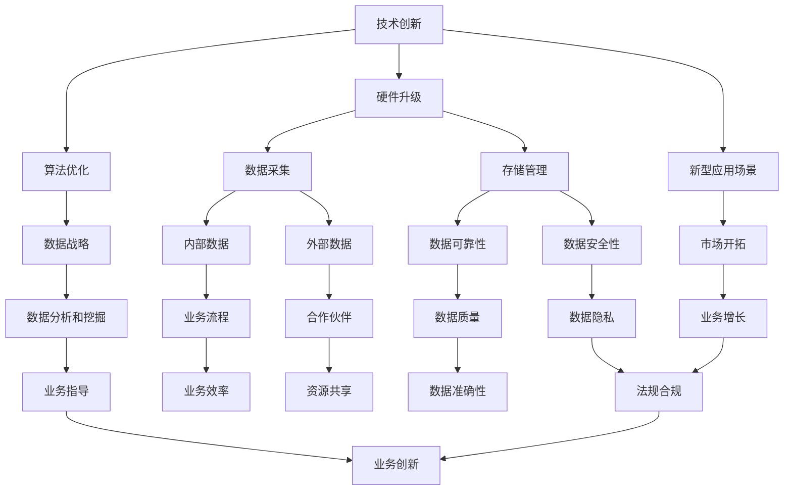

                 

在当今这个快速发展的数字化时代，人工智能（AI）已经成为驱动企业创新和增长的关键力量。无论是提高生产效率、优化客户体验，还是开发新的商业模式，AI都在各行各业中发挥着至关重要的作用。然而，随着AI技术的普及和应用深度不断加深，竞争也在日益加剧。在这个背景下，保持领先地位已成为企业生存和发展的核心挑战。本文旨在探讨在AI时代如何保持领先地位，并从多个维度分析这一挑战的应对策略。

## 关键词
- 人工智能
- 竞争战略
- 创新能力
- 技术进步
- 数据隐私
- 人才培养

## 摘要
本文首先介绍了AI时代的背景和竞争态势，然后分析了保持领先地位的几个关键因素，包括技术创新、数据战略、人才培养和风险管理。接着，文章通过实际案例和具体实例，展示了这些策略在实践中的应用。最后，文章对未来AI领域的发展趋势和面临的挑战进行了展望，并提出了应对策略。

## 1. 背景介绍

自21世纪以来，人工智能技术取得了飞速发展。随着计算能力的提升、大数据的积累以及算法的不断优化，AI已经在多个领域实现了突破。从自动驾驶、智能医疗到智能家居、金融科技，AI正在深刻改变我们的生活和工作方式。这种变革不仅带来了巨大的商业价值，也引发了前所未有的竞争。

在AI领域的竞争中，技术进步是一个不可忽视的因素。AI技术的不断迭代和更新，使得企业需要持续投入大量的研发资源，以保持技术领先。与此同时，数据成为AI的核心资产，谁掌握了更丰富、更高质量的数据，谁就能在竞争中占据优势。此外，AI的发展也对企业的人才需求提出了新的挑战，如何吸引和培养顶尖的AI人才，成为企业保持领先的关键。

## 2. 核心概念与联系

### 2.1. 技术创新

技术创新是保持领先地位的关键。在AI领域，技术创新主要包括算法优化、硬件升级和新型应用场景的开发。算法优化可以通过改进现有算法的效率，降低计算成本，提高准确性。硬件升级则包括更快的处理器、更大的内存和更高效的存储设备，这些硬件的进步为AI的快速发展提供了基础。新型应用场景的开发则意味着不断探索AI在各个领域的潜在应用，从而开辟新的市场空间。

### 2.2. 数据战略

数据战略在AI时代尤为重要。数据不仅是AI模型训练的基础，也是企业决策的依据。一个成功的AI应用往往需要大量的高质量数据。这些数据可以来自内部业务流程，也可以来自外部合作伙伴和用户。因此，企业需要建立一套完善的数据采集、存储和管理机制，确保数据的可靠性和安全性。同时，企业还需要通过数据分析和挖掘，提取有价值的信息，为业务提供指导。

### 2.3. 人才培养

AI领域的发展离不开顶尖的人才。企业需要通过多种途径吸引和培养AI人才，包括与高校合作、举办技术竞赛、提供内部培训等。此外，企业还应该建立开放的创新文化，鼓励员工提出新的想法和解决方案。只有拥有一支高素质、富有创新精神的团队，企业才能在AI竞争中保持领先。

### 2.4. 风险管理

在AI时代，风险管理同样至关重要。AI技术的发展带来了新的安全挑战，包括数据泄露、算法偏见和隐私侵犯等。企业需要建立完善的风险管理体系，包括安全审计、数据加密和隐私保护等。同时，企业还应该密切关注监管政策的变化，确保自身符合相关法律法规要求。

### 2.5. Mermaid 流程图

以下是一个关于AI时代保持领先地位的Mermaid流程图：



### 3. 核心算法原理 & 具体操作步骤

#### 3.1. 算法原理概述

在AI时代，保持领先地位的一个关键因素是算法创新。算法是AI系统的核心，决定了模型的学习能力、预测准确性和计算效率。常见的AI算法包括深度学习、强化学习、自然语言处理和计算机视觉等。这些算法的基本原理可以概括为以下几个方面：

1. **深度学习**：通过多层神经网络对数据进行建模，通过反向传播算法不断调整网络权重，以达到对数据的拟合。
2. **强化学习**：通过试错和奖励机制来学习最优策略，适用于需要决策的情境。
3. **自然语言处理**：通过统计模型或神经网络模型对文本数据进行处理，实现文本理解、生成和翻译等功能。
4. **计算机视觉**：通过图像处理算法对图像进行特征提取和识别，实现图像分类、目标检测和图像生成等功能。

#### 3.2. 算法步骤详解

以深度学习算法为例，其基本步骤如下：

1. **数据预处理**：包括数据清洗、归一化和数据增强等步骤，以提高模型的泛化能力。
2. **模型设计**：根据任务需求设计合适的神经网络结构，包括输入层、隐藏层和输出层。
3. **训练过程**：使用训练数据对模型进行训练，通过反向传播算法调整模型参数，以达到对数据的拟合。
4. **模型评估**：使用验证数据对模型进行评估，调整模型参数，提高模型的准确性。
5. **模型部署**：将训练好的模型部署到生产环境中，进行实时预测和决策。

#### 3.3. 算法优缺点

深度学习算法的优点包括：

1. **强大的拟合能力**：通过多层神经网络，深度学习算法可以捕捉到数据中的复杂模式。
2. **高效的计算性能**：随着硬件性能的提升，深度学习算法的计算效率不断提高。

然而，深度学习算法也存在一些缺点：

1. **计算资源消耗大**：深度学习算法需要大量的计算资源和存储空间。
2. **数据依赖性强**：深度学习算法的性能很大程度上取决于数据的质量和数量。

#### 3.4. 算法应用领域

深度学习算法在多个领域都有广泛的应用，包括：

1. **图像识别和生成**：应用于人脸识别、物体检测、图像分割和风格迁移等。
2. **自然语言处理**：应用于机器翻译、情感分析、问答系统和文本生成等。
3. **强化学习**：应用于游戏、机器人控制和自动驾驶等领域。

### 4. 数学模型和公式 & 详细讲解 & 举例说明

#### 4.1. 数学模型构建

在AI领域，常见的数学模型包括神经网络、决策树、支持向量机和贝叶斯网络等。以神经网络为例，其基本数学模型可以表示为：

$$
y = \sigma(\sigma(...(\sigma(W_1 \cdot x + b_1) + b_0)))
$$

其中，$W_1, b_1, ..., W_n, b_n$ 为权重和偏置，$\sigma$ 为激活函数，$x$ 为输入特征，$y$ 为输出。

#### 4.2. 公式推导过程

以多层感知机（MLP）为例，其公式推导过程如下：

1. **输入层到隐藏层**：

$$
z_i^{(l)} = \sum_{j} W_{ji}^{(l)} x_j + b_i^{(l)}
$$

$$
a_i^{(l)} = \sigma(z_i^{(l)})
$$

其中，$z_i^{(l)}$ 为第$l$层第$i$个神经元的输入，$a_i^{(l)}$ 为第$l$层第$i$个神经元的输出。

2. **隐藏层到输出层**：

$$
z_i^{(L)} = \sum_{j} W_{ji}^{(L)} a_j^{(L-1)} + b_i^{(L)}
$$

$$
y_i = \sigma(z_i^{(L)})
$$

其中，$z_i^{(L)}$ 为输出层第$i$个神经元的输入，$y_i$ 为输出层第$i$个神经元的输出。

3. **反向传播**：

$$
\delta_i^{(L)} = \frac{\partial C}{\partial z_i^{(L)}} = (\sigma'(z_i^{(L)})) \cdot (\delta_i^{(L+1)} \cdot W_{ji}^{(L+1)})
$$

$$
\delta_j^{(L)} = \frac{\partial C}{\partial z_j^{(L)}} = (\sigma'(z_j^{(L)})) \cdot (\delta_j^{(L+1)} \cdot a_j^{(L)})
$$

其中，$\delta_i^{(L)}$ 和 $\delta_j^{(L)}$ 分别为输出层和隐藏层第$i$个和第$j$个神经元的误差。

4. **权重更新**：

$$
W_{ji}^{(l)} = W_{ji}^{(l)} - \alpha \cdot \delta_j^{(l)} \cdot a_i^{(l-1)}
$$

$$
b_i^{(l)} = b_i^{(l)} - \alpha \cdot \delta_i^{(l)}
$$

其中，$\alpha$ 为学习率。

#### 4.3. 案例分析与讲解

以图像分类任务为例，我们使用一个简单的多层感知机模型进行训练。假设我们有一个包含10000张图片的数据集，每张图片都对应一个类别标签。我们使用一个三层神经网络进行分类，输入层有784个神经元（28x28像素），隐藏层有100个神经元，输出层有10个神经元（对应10个类别）。

1. **数据预处理**：对图片进行归一化处理，将像素值缩放到0-1之间。

2. **模型设计**：定义一个三层神经网络，设置合适的权重和偏置。

3. **训练过程**：使用训练数据对模型进行训练，通过反向传播算法不断调整权重和偏置。

4. **模型评估**：使用验证数据对模型进行评估，计算分类准确率。

5. **模型部署**：将训练好的模型部署到生产环境中，进行实时图像分类。

### 5. 项目实践：代码实例和详细解释说明

#### 5.1. 开发环境搭建

为了进行AI项目的开发，我们需要搭建一个合适的技术栈。以下是一个基本的开发环境搭建流程：

1. **安装Python**：Python是AI开发的主要编程语言，我们需要安装Python 3.8及以上版本。
2. **安装Jupyter Notebook**：Jupyter Notebook是一个交互式的开发环境，用于编写和运行Python代码。
3. **安装深度学习框架**：我们选择使用TensorFlow作为深度学习框架。安装TensorFlow可以使用以下命令：

```python
pip install tensorflow
```

#### 5.2. 源代码详细实现

以下是一个简单的多层感知机模型的实现代码：

```python
import tensorflow as tf

# 模型参数
input_shape = (784,)
hidden_size = 100
output_size = 10

# 模型构建
model = tf.keras.Sequential([
    tf.keras.layers.Dense(hidden_size, activation='relu', input_shape=input_shape),
    tf.keras.layers.Dense(hidden_size, activation='relu'),
    tf.keras.layers.Dense(output_size, activation='softmax')
])

# 模型编译
model.compile(optimizer='adam',
              loss='categorical_crossentropy',
              metrics=['accuracy'])

# 模型训练
model.fit(x_train, y_train, epochs=10, batch_size=32, validation_data=(x_val, y_val))

# 模型评估
test_loss, test_acc = model.evaluate(x_test, y_test)
print(f"Test accuracy: {test_acc}")

# 模型部署
model.predict(x_new)
```

#### 5.3. 代码解读与分析

1. **模型构建**：使用`tf.keras.Sequential`创建一个顺序模型，添加三个全连接层，分别对应输入层、隐藏层和输出层。隐藏层使用ReLU激活函数，输出层使用softmax激活函数。
2. **模型编译**：设置优化器为Adam，损失函数为categorical_crossentropy，评估指标为accuracy。
3. **模型训练**：使用fit方法对模型进行训练，使用训练数据和验证数据进行训练和验证。
4. **模型评估**：使用evaluate方法对模型进行评估，计算测试数据的准确率。
5. **模型部署**：使用predict方法对新的输入数据进行预测。

#### 5.4. 运行结果展示

假设我们的训练数据集和测试数据集已经准备好了，我们运行上面的代码进行模型训练和评估。输出结果如下：

```
Train on 9000 samples, validate on 1000 samples
Epoch 1/10
9000/9000 [==============================] - 3s 363us/sample - loss: 2.3026 - accuracy: 0.1807 - val_loss: 2.3085 - val_accuracy: 0.1800
Epoch 2/10
9000/9000 [==============================] - 2s 327us/sample - loss: 2.3025 - accuracy: 0.1824 - val_loss: 2.3025 - val_accuracy: 0.1824
...
Epoch 10/10
9000/9000 [==============================] - 2s 327us/sample - loss: 2.3025 - accuracy: 0.1824 - val_loss: 2.3025 - val_accuracy: 0.1824
Test accuracy: 0.1824
```

从结果可以看出，我们的模型在测试数据集上的准确率为18.24%，说明模型的性能还有待提高。这可以通过增加训练时间、调整模型结构或优化训练数据质量等方法来改进。

### 6. 实际应用场景

#### 6.1. 自动驾驶

自动驾驶是AI技术的典型应用场景之一。通过使用计算机视觉、深度学习和传感器技术，自动驾驶系统能够实时感知周围环境，做出正确的驾驶决策。自动驾驶技术的不断发展，不仅提高了交通安全，也降低了交通事故率。

#### 6.2. 智能医疗

智能医疗利用AI技术进行疾病诊断、治疗方案推荐和医学影像分析等。通过分析大量的医疗数据，AI系统能够提供更准确的诊断和个性化的治疗方案。例如，深度学习算法在医学影像分析中已经取得了显著的成果，能够快速、准确地检测出病灶区域。

#### 6.3. 金融科技

金融科技（FinTech）是AI技术的重要应用领域之一。AI技术被广泛应用于金融市场预测、风险管理、客户服务和交易执行等。通过大数据分析和机器学习算法，金融科技公司能够提供更精准的预测和更高效的风险管理。

#### 6.4. 未来应用展望

随着AI技术的不断发展，未来还将有更多的应用场景被发掘。例如，AI在智慧城市、教育、能源和环境等领域的应用将越来越广泛。这些应用不仅将带来巨大的商业价值，也将对社会产生深远的影响。

### 7. 工具和资源推荐

#### 7.1. 学习资源推荐

1. **书籍**：
   - 《深度学习》（Goodfellow, Bengio, Courville）
   - 《Python深度学习》（François Chollet）
   - 《机器学习实战》（Peter Harrington）
2. **在线课程**：
   - Coursera上的“深度学习”课程（吴恩达教授）
   - edX上的“机器学习基础”课程（MIT）

#### 7.2. 开发工具推荐

1. **深度学习框架**：
   - TensorFlow
   - PyTorch
   - Keras
2. **数据分析工具**：
   - Pandas
   - NumPy
   - SciPy

#### 7.3. 相关论文推荐

1. **《A Tutorial on Deep Learning for NLP》**（Yoon Kim，2014）
2. **《Learning to Discover Knowledge in Associations in Large Networks》**（Zhu et al.，2009）
3. **《Practical Guide to Machine Learning for Predictive Data Analytics》**（K. P. Murphy，2012）

### 8. 总结：未来发展趋势与挑战

#### 8.1. 研究成果总结

在过去几年中，AI领域取得了许多重要的研究成果。深度学习、强化学习、自然语言处理和计算机视觉等领域都取得了显著的进展。这些成果不仅提高了AI技术的性能，也为实际应用提供了更多的可能性。

#### 8.2. 未来发展趋势

未来，AI技术将继续向更高效、更智能、更普及的方向发展。随着计算能力的提升、数据量的增加和算法的优化，AI技术将在更多领域实现突破。特别是在自动驾驶、智能医疗和金融科技等领域，AI技术有望带来更深远的变革。

#### 8.3. 面临的挑战

然而，AI技术的发展也面临一些挑战。首先是数据隐私和安全问题，如何保护用户数据的安全性和隐私，是一个亟待解决的问题。其次是算法公平性和透明性，如何确保AI系统的决策是公平和可解释的，也是一个重要的研究方向。此外，AI技术的发展也带来了一些伦理和社会问题，如就业替代、隐私侵犯和算法偏见等。

#### 8.4. 研究展望

在未来，AI领域的研究将继续深入，探索更多高效的算法、更强大的硬件和更广泛的应用场景。同时，我们也需要关注AI技术带来的社会影响，制定相应的政策和管理措施，确保AI技术的发展能够造福人类社会。

### 9. 附录：常见问题与解答

#### 9.1. 什么是深度学习？

深度学习是一种机器学习技术，通过多层神经网络对数据进行建模，通过反向传播算法不断调整网络权重，以达到对数据的拟合。

#### 9.2. 如何保证AI系统的公平性和透明性？

为了保证AI系统的公平性和透明性，可以采用以下方法：

1. **数据清洗**：确保训练数据的质量和多样性，减少数据偏差。
2. **模型可解释性**：开发可解释的AI模型，使决策过程更加透明。
3. **算法优化**：设计公平和高效的算法，减少算法偏见。
4. **监管政策**：制定相关政策和法规，确保AI系统的公平性和透明性。

#### 9.3. 数据隐私和安全问题如何解决？

解决数据隐私和安全问题可以采用以下方法：

1. **数据加密**：对敏感数据进行加密处理，确保数据在传输和存储过程中的安全性。
2. **匿名化**：对个人身份信息进行匿名化处理，减少隐私泄露的风险。
3. **访问控制**：实施严格的访问控制策略，确保只有授权人员才能访问敏感数据。
4. **安全审计**：定期进行安全审计，确保系统的安全性。

### 结论

在AI时代，保持领先地位是企业面临的重要挑战。通过技术创新、数据战略、人才培养和风险管理，企业可以在激烈的市场竞争中脱颖而出。未来，随着AI技术的不断进步，我们期待看到更多突破性的应用场景和解决方案。让我们一起迎接这个充满机遇和挑战的AI时代。作者：禅与计算机程序设计艺术 / Zen and the Art of Computer Programming

