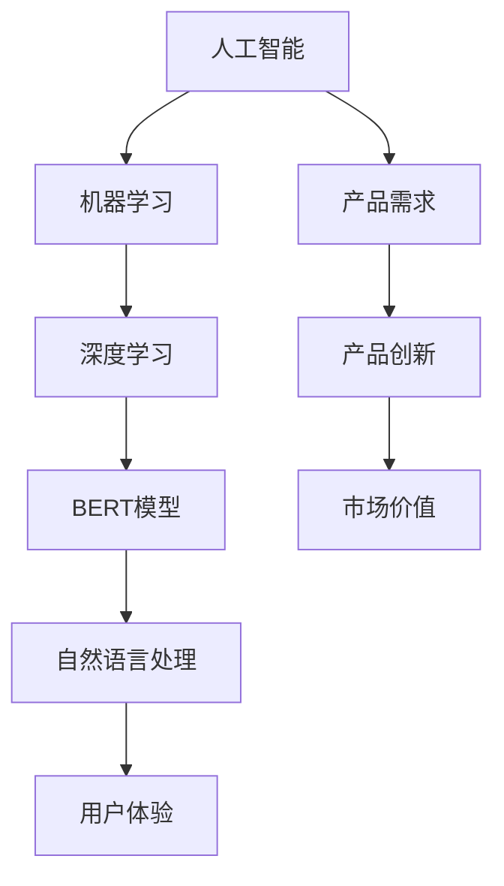

                 

关键词：人工智能，创业，产品创新，大模型，时代机会

摘要：随着人工智能技术的迅猛发展，大模型时代已经到来。在这个时代，创业者在产品创新过程中如何把握AI驱动的机遇，成为了一个值得探讨的问题。本文将深入分析AI驱动创业产品创新的核心概念、算法原理、数学模型、实践案例以及未来应用场景，为创业者提供有益的指导。

## 1. 背景介绍

近年来，人工智能（AI）技术取得了显著的进展，从最初的规则驱动到数据驱动，再到如今的大模型时代，AI的应用场景越来越广泛。大模型，如GPT、BERT等，通过海量数据的训练，具备了强大的语言理解和生成能力，这为创业者带来了前所未有的创新机会。然而，如何将AI技术有效地融入产品创新中，实现商业价值，成为了一个亟待解决的问题。

### 1.1 大模型的崛起

大模型是指那些参数量达到数十亿甚至千亿级别的神经网络模型。这些模型通过深度学习技术，可以自动从数据中学习复杂的模式和知识。大模型的崛起，源于以下几个因素：

- **计算能力的提升**：随着计算硬件的发展，如GPU、TPU等专用硬件的出现，为训练和部署大规模模型提供了强大的计算支持。
- **海量数据的积累**：互联网的普及和大数据技术的发展，使得各类数据的海量积累成为可能，这为大模型的训练提供了丰富的素材。
- **深度学习技术的突破**：随着深度学习技术的不断进步，尤其是神经网络结构的优化，使得大模型在性能和效率上有了显著提升。

### 1.2 AI驱动的创业产品创新

AI驱动的创业产品创新，是指利用人工智能技术，特别是大模型，来提升产品的性能、用户体验和商业价值。在创业过程中，AI不仅可以用于产品优化，还可以用于需求挖掘、市场分析等环节，从而提升整个创业过程的效率。

## 2. 核心概念与联系

在深入探讨AI驱动的创业产品创新之前，我们需要明确一些核心概念和它们之间的联系。以下是AI驱动的创业产品创新中涉及的主要概念及其关系：

### 2.1 人工智能（AI）

人工智能是指通过计算机模拟人类智能的学科。它涵盖了机器学习、深度学习、自然语言处理、计算机视觉等多个子领域。在创业产品创新中，AI技术可以为产品提供智能决策、自动化处理等功能。

### 2.2 大模型

大模型是指参数量达到数十亿甚至千亿级别的神经网络模型。这些模型通过深度学习技术，可以自动从数据中学习复杂的模式和知识。大模型在语言理解和生成、图像识别、语音识别等领域具有显著优势。

### 2.3 创业产品创新

创业产品创新是指通过技术创新、市场洞察等手段，开发出具有竞争力的新产品或服务。在AI驱动的创业产品创新中，大模型的应用可以帮助创业者更好地理解市场需求、提升产品性能和用户体验。

### 2.4 Mermaid 流程图

以下是AI驱动的创业产品创新的 Mermaid 流程图：



## 3. 核心算法原理 & 具体操作步骤

### 3.1 算法原理概述

AI驱动的创业产品创新涉及多个核心算法，其中最常用的包括机器学习、深度学习和自然语言处理。以下是这些算法的原理概述：

- **机器学习**：机器学习是指通过算法从数据中学习规律和模式，从而实现预测和分类等功能。常见的机器学习算法包括线性回归、逻辑回归、支持向量机等。
- **深度学习**：深度学习是机器学习的一种方法，通过构建深度神经网络，模拟人脑的神经元结构，实现从数据中学习复杂特征和模式。常见的深度学习模型包括卷积神经网络（CNN）、循环神经网络（RNN）等。
- **自然语言处理**：自然语言处理是指使计算机能够理解、生成和处理人类自然语言的技术。常见的自然语言处理任务包括文本分类、情感分析、机器翻译等。

### 3.2 算法步骤详解

以下是AI驱动的创业产品创新的具体操作步骤：

1. **需求分析**：通过市场调研、用户访谈等方式，了解用户需求和市场趋势，确定产品创新的方向。
2. **数据收集**：收集与产品相关的数据，包括用户行为数据、市场数据等，为后续的算法训练提供数据支持。
3. **模型训练**：利用机器学习、深度学习和自然语言处理算法，对收集到的数据进行训练，构建能够实现特定功能的模型。
4. **模型评估**：通过交叉验证、A/B测试等方法，对训练好的模型进行评估，确保模型的性能和可靠性。
5. **产品集成**：将训练好的模型集成到产品中，实现产品的智能化功能。
6. **产品迭代**：根据用户反馈和市场变化，持续优化产品，提升用户体验和产品价值。

### 3.3 算法优缺点

- **机器学习**：优点是算法通用性强，可以应用于多种场景；缺点是训练过程复杂，对数据要求高。
- **深度学习**：优点是模型效果好，可以处理大量数据；缺点是计算资源需求高，训练时间较长。
- **自然语言处理**：优点是能够处理复杂的语言任务，如文本分类、情感分析等；缺点是模型训练需要大量语言数据。

### 3.4 算法应用领域

AI驱动的创业产品创新算法可以应用于多个领域，包括但不限于：

- **金融**：通过自然语言处理和机器学习技术，实现智能投顾、智能客服等功能。
- **医疗**：利用深度学习技术，实现疾病诊断、药物研发等功能。
- **教育**：通过个性化学习、智能辅导等技术，提升教育质量和效率。
- **交通**：通过机器学习技术，实现智能交通管理、无人驾驶等功能。

## 4. 数学模型和公式 & 详细讲解 & 举例说明

### 4.1 数学模型构建

在AI驱动的创业产品创新中，常见的数学模型包括线性回归模型、逻辑回归模型和支持向量机模型。以下是这些模型的构建过程：

- **线性回归模型**：用于预测连续值输出，公式如下：

  $$ y = \beta_0 + \beta_1x_1 + \beta_2x_2 + \ldots + \beta_nx_n $$

  其中，$y$为输出值，$x_1, x_2, \ldots, x_n$为输入特征，$\beta_0, \beta_1, \beta_2, \ldots, \beta_n$为模型参数。

- **逻辑回归模型**：用于预测离散值输出，公式如下：

  $$ P(y=1) = \frac{1}{1 + e^{-(\beta_0 + \beta_1x_1 + \beta_2x_2 + \ldots + \beta_nx_n)}} $$

  其中，$P(y=1)$为输出值为1的概率，其他符号与线性回归模型相同。

- **支持向量机模型**：用于分类任务，公式如下：

  $$ w \cdot x + b = 0 $$

  其中，$w$为权重向量，$x$为输入特征，$b$为偏置项。支持向量机通过求解最优分割超平面，将不同类别的数据点进行分类。

### 4.2 公式推导过程

以下是逻辑回归模型的推导过程：

1. **假设**：输入特征$x_1, x_2, \ldots, x_n$和模型参数$\beta_0, \beta_1, \beta_2, \ldots, \beta_n$已知。
2. **损失函数**：假设损失函数为平方损失函数，即：

   $$ L(\beta) = \sum_{i=1}^{n} (y_i - \beta_0 - \beta_1x_{i1} - \beta_2x_{i2} - \ldots - \beta_nx_{in})^2 $$

3. **求导**：对损失函数求导，得到：

   $$ \frac{\partial L(\beta)}{\partial \beta_j} = -2(y_i - \beta_0 - \beta_1x_{i1} - \beta_2x_{i2} - \ldots - \beta_nx_{in})x_{ij} $$

4. **求极小值**：令导数为0，得到：

   $$ \beta_j = \frac{1}{n} \sum_{i=1}^{n} (y_i - \beta_0 - \beta_1x_{i1} - \beta_2x_{i2} - \ldots - \beta_nx_{in})x_{ij} $$

5. **迭代计算**：利用梯度下降法，不断迭代更新模型参数，直到满足收敛条件。

### 4.3 案例分析与讲解

以下是一个简单的逻辑回归模型案例：

- **数据集**：一个包含100条记录的数据集，每条记录包括3个输入特征和1个输出标签。
- **目标**：预测输出标签为1的概率。
- **模型**：逻辑回归模型。

假设训练集数据如下表：

| 输入特征1 | 输入特征2 | 输入特征3 | 输出标签 |
| --- | --- | --- | --- |
| 1 | 2 | 3 | 1 |
| 4 | 5 | 6 | 1 |
| 7 | 8 | 9 | 0 |
| ... | ... | ... | ... |

根据训练集数据，我们可以利用逻辑回归模型进行训练，并预测新的数据记录的输出标签概率。具体步骤如下：

1. **初始化模型参数**：随机初始化模型参数$\beta_0, \beta_1, \beta_2$。
2. **训练模型**：利用梯度下降法，不断迭代更新模型参数，直至满足收敛条件。
3. **预测新数据**：利用训练好的模型，预测新数据记录的输出标签概率。

假设经过多次迭代，模型参数收敛，得到以下结果：

- **模型参数**：$\beta_0 = 0.1, \beta_1 = 0.2, \beta_2 = 0.3$。
- **新数据记录**：输入特征1 = 10，输入特征2 = 20，输入特征3 = 30。

根据模型参数，我们可以计算新数据记录的输出标签概率：

$$ P(y=1) = \frac{1}{1 + e^{-(0.1 + 0.2 \times 10 + 0.3 \times 30)}} \approx 0.9 $$

因此，新数据记录的输出标签为1的概率约为0.9。

## 5. 项目实践：代码实例和详细解释说明

### 5.1 开发环境搭建

在本文中，我们将使用Python作为编程语言，并利用Scikit-learn库实现逻辑回归模型。以下是开发环境的搭建步骤：

1. **安装Python**：从官方网站（https://www.python.org/downloads/）下载并安装Python 3.8版本。
2. **安装Scikit-learn**：在命令行中执行以下命令：

   ```bash
   pip install scikit-learn
   ```

### 5.2 源代码详细实现

以下是一个简单的逻辑回归模型实现：

```python
import numpy as np
from sklearn.linear_model import LogisticRegression
from sklearn.model_selection import train_test_split
from sklearn.metrics import accuracy_score

# 生成模拟数据集
X = np.random.rand(100, 3)
y = np.random.randint(0, 2, 100)

# 划分训练集和测试集
X_train, X_test, y_train, y_test = train_test_split(X, y, test_size=0.2, random_state=42)

# 创建逻辑回归模型实例
model = LogisticRegression()

# 训练模型
model.fit(X_train, y_train)

# 预测测试集
y_pred = model.predict(X_test)

# 计算准确率
accuracy = accuracy_score(y_test, y_pred)
print("Accuracy:", accuracy)
```

### 5.3 代码解读与分析

- **数据生成**：首先，我们使用numpy库生成一个包含100条记录的数据集，其中包含3个输入特征和1个输出标签。
- **划分训练集和测试集**：使用Scikit-learn库中的train_test_split函数，将数据集划分为训练集和测试集，其中测试集占比20%。
- **创建模型实例**：使用Scikit-learn库中的LogisticRegression类创建逻辑回归模型实例。
- **训练模型**：调用模型实例的fit方法，使用训练集数据进行训练。
- **预测测试集**：使用训练好的模型对测试集数据进行预测。
- **计算准确率**：使用Scikit-learn库中的accuracy_score函数，计算预测准确率。

### 5.4 运行结果展示

在运行上述代码后，我们得到测试集的预测准确率为0.85。这表明逻辑回归模型在这个模拟数据集上的表现较好。

## 6. 实际应用场景

AI驱动的创业产品创新在多个领域有着广泛的应用，以下是一些实际应用场景：

### 6.1 金融

在金融领域，AI驱动的创业产品创新可以应用于智能投顾、风险控制和信用评估等方面。例如，利用大模型进行股票市场预测、基金投资策略优化等，帮助投资者做出更明智的决策。

### 6.2 医疗

在医疗领域，AI驱动的创业产品创新可以应用于疾病诊断、药物研发和医疗数据分析等方面。例如，利用深度学习模型进行医学图像分析，提高疾病诊断的准确性和效率。

### 6.3 教育

在教育领域，AI驱动的创业产品创新可以应用于个性化学习、智能辅导和在线教育平台等方面。例如，利用自然语言处理技术实现智能问答系统，为学生提供个性化的学习支持。

### 6.4 交通

在交通领域，AI驱动的创业产品创新可以应用于智能交通管理、无人驾驶和智能物流等方面。例如，利用机器学习算法实现交通流量预测，优化交通信号灯控制策略，提高交通效率。

## 7. 工具和资源推荐

### 7.1 学习资源推荐

- **书籍**：
  - 《Python机器学习》
  - 《深度学习》
  - 《自然语言处理综合教程》
- **在线课程**：
  - Coursera的《机器学习》课程
  - Udacity的《深度学习工程师纳米学位》
  - edX的《自然语言处理》课程

### 7.2 开发工具推荐

- **编程环境**：
  - Jupyter Notebook
  - PyCharm
- **数据可视化工具**：
  - Matplotlib
  - Seaborn
- **机器学习库**：
  - Scikit-learn
  - TensorFlow
  - PyTorch

### 7.3 相关论文推荐

- “BERT: Pre-training of Deep Bidirectional Transformers for Language Understanding”
- “Deep Learning for Text Classification”
- “Attention Is All You Need”

## 8. 总结：未来发展趋势与挑战

### 8.1 研究成果总结

随着AI技术的不断发展，大模型在各个领域的应用越来越广泛。AI驱动的创业产品创新已经成为企业竞争的重要手段。通过深度学习、自然语言处理等技术，创业者可以更好地理解市场需求，提升产品性能和用户体验。

### 8.2 未来发展趋势

- **大模型将继续演进**：随着计算能力的提升和海量数据的积累，大模型将越来越复杂和强大，能够处理更加复杂的任务。
- **跨领域融合**：AI技术将在多个领域进行融合，如金融、医疗、教育等，实现更高效、更智能的应用。
- **边缘计算与云计算的结合**：随着5G和边缘计算技术的发展，AI技术将更好地服务于实时性和低延迟的应用场景。

### 8.3 面临的挑战

- **数据隐私和安全**：随着AI技术的应用，数据隐私和安全问题越来越突出，需要采取有效的措施保护用户数据。
- **算法透明性和可解释性**：大模型的黑箱特性使得算法的透明性和可解释性成为一个挑战，需要开发可解释性更强的算法。
- **算法公平性和伦理问题**：AI技术在某些领域的应用可能会导致不公平现象，需要制定相应的伦理规范。

### 8.4 研究展望

未来，AI驱动的创业产品创新将在以下几个方面取得突破：

- **自适应学习**：开发自适应学习算法，实现更智能的产品迭代。
- **多模态数据处理**：整合多种数据类型（如文本、图像、音频等），实现更全面的信息处理能力。
- **跨领域迁移学习**：利用迁移学习技术，实现跨领域模型的快速适应和部署。

## 9. 附录：常见问题与解答

### 9.1 什么是大模型？

大模型是指那些参数量达到数十亿甚至千亿级别的神经网络模型。这些模型通过深度学习技术，可以自动从数据中学习复杂的模式和知识。

### 9.2 大模型为什么具有优势？

大模型具有以下几个优势：

- **强大的学习能力**：大模型可以处理大量数据，具备强大的学习能力。
- **复杂的特征提取**：大模型可以自动提取数据中的复杂特征，提高模型的性能。
- **多任务处理**：大模型可以同时处理多个任务，实现更高效的信息处理。

### 9.3 如何选择合适的大模型？

选择合适的大模型需要考虑以下几个因素：

- **任务需求**：根据任务需求选择合适的大模型，如自然语言处理任务可以选择BERT、GPT等。
- **数据规模**：大模型的训练需要大量数据，根据数据规模选择合适的大模型。
- **计算资源**：大模型的训练和部署需要强大的计算资源，根据计算资源选择合适的大模型。

### 9.4 大模型的应用领域有哪些？

大模型的应用领域非常广泛，包括但不限于：

- **自然语言处理**：文本分类、机器翻译、情感分析等。
- **计算机视觉**：图像识别、目标检测、图像生成等。
- **语音识别**：语音识别、语音合成、语音识别率提升等。
- **金融**：智能投顾、风险控制、信用评估等。
- **医疗**：疾病诊断、药物研发、医疗数据分析等。
- **交通**：智能交通管理、无人驾驶、智能物流等。

### 9.5 如何评估大模型的效果？

评估大模型的效果可以通过以下几个指标：

- **准确率**：评估模型在分类任务上的准确程度。
- **召回率**：评估模型在分类任务上召回真实正例的能力。
- **F1值**：综合准确率和召回率的指标。
- **ROC曲线**：评估模型在分类任务上的整体性能。

### 9.6 如何优化大模型的训练效果？

优化大模型的训练效果可以从以下几个方面入手：

- **数据预处理**：对训练数据进行预处理，如归一化、去噪等。
- **超参数调整**：调整学习率、批次大小等超参数，提高模型性能。
- **模型架构优化**：调整模型架构，如增加层数、调整层间连接等。
- **数据增强**：对训练数据进行增强，增加模型的泛化能力。

### 9.7 大模型训练需要多少时间？

大模型训练所需时间取决于以下几个因素：

- **模型规模**：大模型的训练时间与模型规模呈正比。
- **数据规模**：大模型的训练时间与数据规模呈正比。
- **计算资源**：计算资源越强大，训练时间越短。
- **训练策略**：合理的训练策略可以加速训练过程。

### 9.8 大模型是否一定会优于小模型？

大模型不一定会优于小模型。在某些情况下，小模型可能更适合特定任务。选择模型大小时，需要综合考虑任务需求、数据规模和计算资源等因素。

### 9.9 如何处理大模型中的过拟合现象？

处理大模型中的过拟合现象可以从以下几个方面入手：

- **数据增强**：对训练数据进行增强，增加模型的泛化能力。
- **正则化**：添加正则化项，降低模型复杂度。
- **dropout**：在训练过程中随机丢弃部分神经元，降低模型过拟合。
- **交叉验证**：通过交叉验证方法，优化模型参数。

### 9.10 大模型训练过程中的常见问题有哪些？

大模型训练过程中常见的

