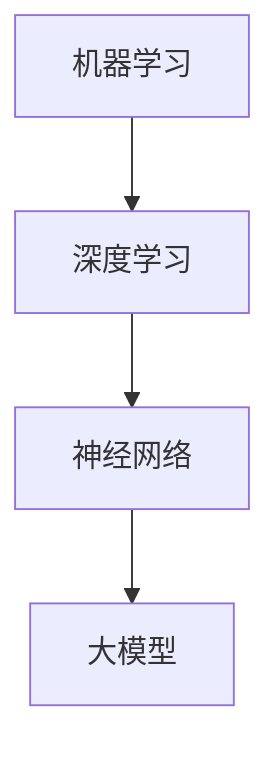
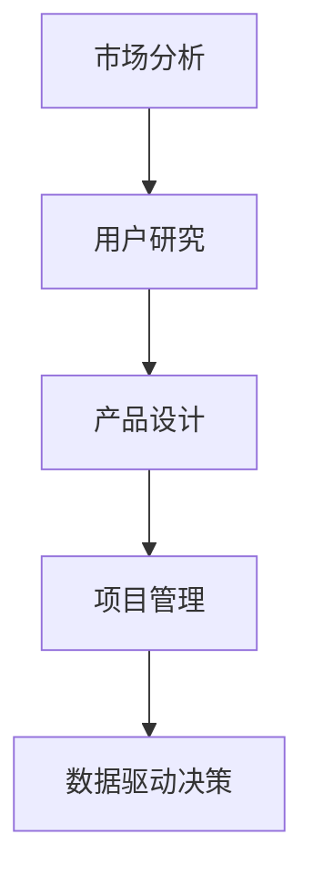
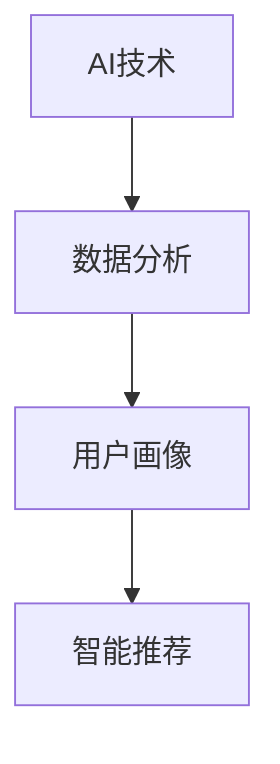
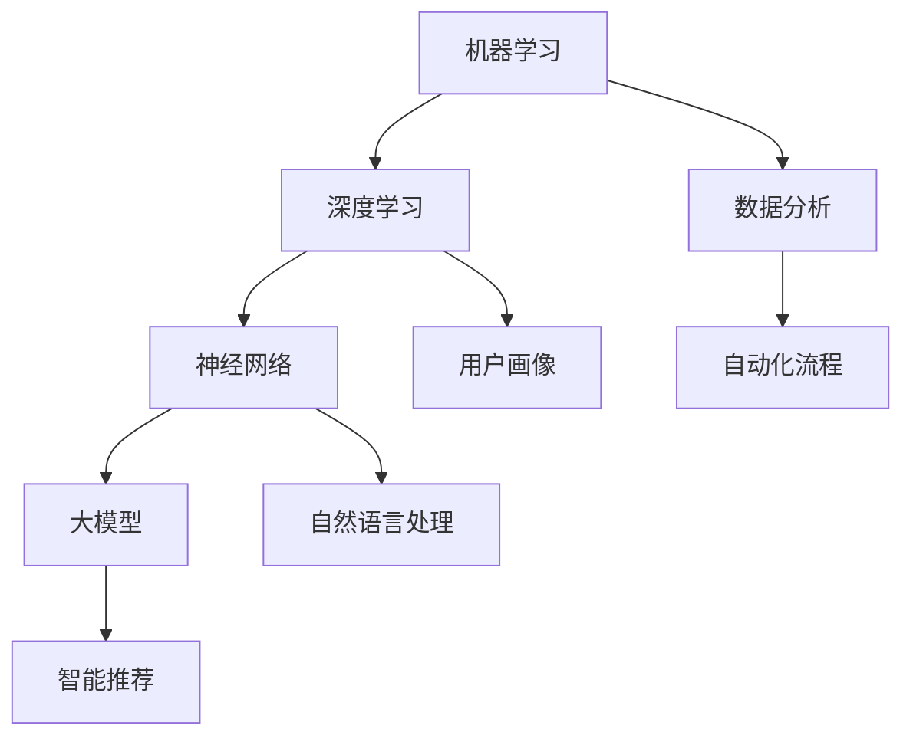
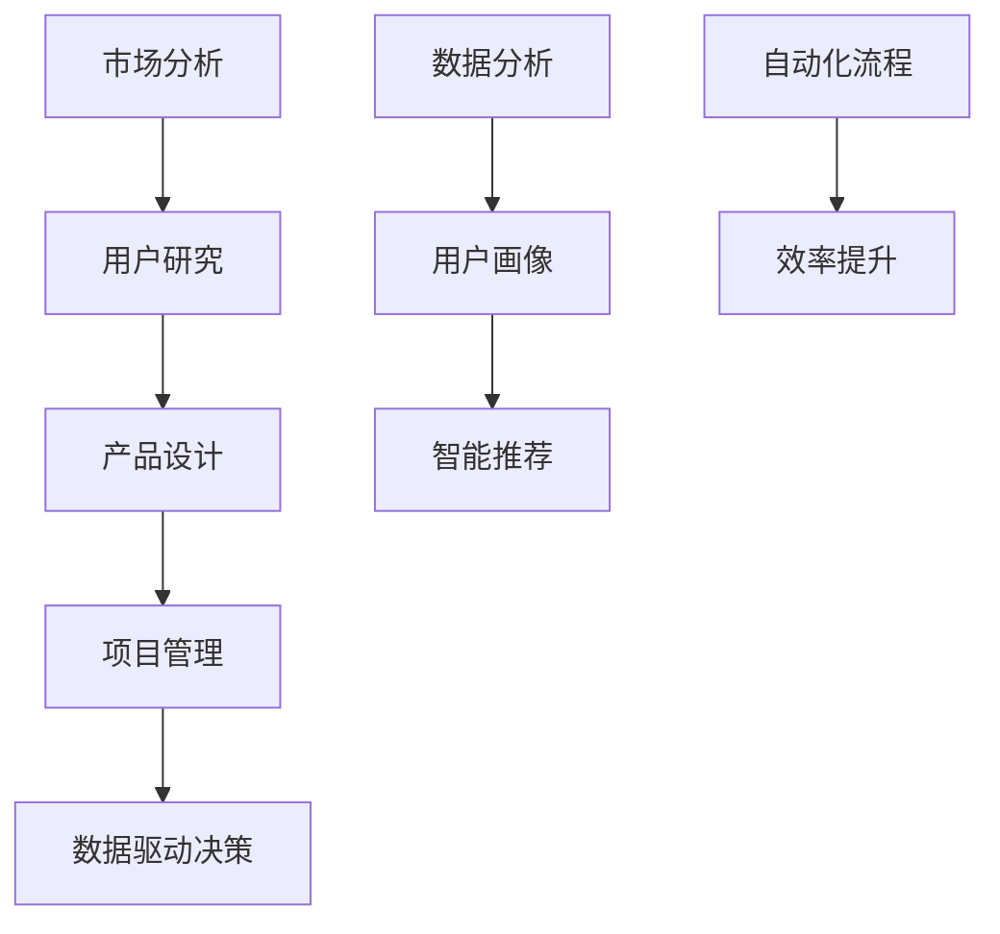

                 

关键词：人工智能、创业产品经理、大模型、技能要求、技术应用、创新策略

> 摘要：随着人工智能（AI）技术的快速发展，创业产品经理的角色和技能要求也在不断演变。本文将探讨在大模型时代，创业产品经理所需的技能和策略，以推动产品创新和市场成功。

## 1. 背景介绍

近年来，人工智能（AI）技术取得了令人瞩目的进步。大模型（如GPT-3、BERT等）的出现，极大地提升了AI的智能水平和应用范围。与此同时，创业产品经理在推动产品创新和市场拓展中扮演着越来越重要的角色。然而，随着AI技术的发展，创业产品经理的技能要求也在不断升级。

### 1.1 AI技术的发展

AI技术的发展经历了多个阶段，从早期的规则系统到基于统计学习的方法，再到当前的大模型时代。大模型以其卓越的性能和广泛的应用场景，正在成为AI领域的核心技术。

### 1.2 创业产品经理的角色

创业产品经理负责产品从概念到市场的全过程，包括市场调研、需求分析、产品设计、开发管理、测试和上市。在这个快速变化的时代，产品经理需要具备多方面的技能，以应对不断变化的商业环境。

## 2. 核心概念与联系

### 2.1 AI技术核心概念

AI技术涉及多个核心概念，包括机器学习、深度学习、神经网络等。这些概念构成了AI技术的理论基础。



### 2.2 创业产品经理核心技能

创业产品经理需要具备的核心技能包括市场分析、用户研究、产品设计、项目管理、数据驱动决策等。这些技能在大模型时代尤为重要。



### 2.3 AI与创业产品经理的关联

AI技术的发展为创业产品经理提供了新的工具和方法，如数据分析、用户画像、智能推荐等。同时，创业产品经理也需要理解AI技术的工作原理和应用场景，以更好地利用这些工具。



## 3. 核心算法原理 & 具体操作步骤

### 3.1 算法原理概述

在大模型时代，常用的算法包括深度学习、强化学习、生成对抗网络（GAN）等。这些算法基于神经网络，通过大量数据进行训练，以提高模型的性能和泛化能力。

### 3.2 算法步骤详解

以深度学习为例，其基本步骤包括：

1. 数据收集与预处理
2. 确定神经网络架构
3. 参数初始化
4. 前向传播
5. 反向传播
6. 模型评估与优化

### 3.3 算法优缺点

深度学习具有强大的学习能力和泛化能力，但同时也存在计算资源需求高、训练时间长等缺点。

### 3.4 算法应用领域

深度学习在图像识别、自然语言处理、推荐系统等领域有广泛应用，为创业产品经理提供了丰富的工具和可能性。

## 4. 数学模型和公式 & 详细讲解 & 举例说明

### 4.1 数学模型构建

以神经网络为例，其数学模型可以表示为：

$$
y = f(z) = \sigma(W \cdot z + b)
$$

其中，$z$ 为输入特征，$W$ 为权重，$b$ 为偏置，$f$ 为激活函数，$\sigma$ 为求和运算。

### 4.2 公式推导过程

以反向传播算法为例，其推导过程如下：

$$
\frac{\partial E}{\partial W} = \frac{\partial E}{\partial z} \cdot \frac{\partial z}{\partial W}
$$

### 4.3 案例分析与讲解

以图像分类任务为例，使用卷积神经网络（CNN）进行图像识别。通过大量图像数据训练，模型可以学会识别各种图像类别。

## 5. 项目实践：代码实例和详细解释说明

### 5.1 开发环境搭建

使用Python编写深度学习代码，需要安装TensorFlow等库。

### 5.2 源代码详细实现

以下是一个简单的CNN图像分类代码示例：

```python
import tensorflow as tf

model = tf.keras.Sequential([
    tf.keras.layers.Conv2D(32, (3,3), activation='relu', input_shape=(28,28,1)),
    tf.keras.layers.MaxPooling2D(2,2),
    tf.keras.layers.Flatten(),
    tf.keras.layers.Dense(128, activation='relu'),
    tf.keras.layers.Dense(10, activation='softmax')
])

model.compile(optimizer='adam', loss='categorical_crossentropy', metrics=['accuracy'])

model.fit(x_train, y_train, epochs=5)
```

### 5.3 代码解读与分析

代码中，我们首先定义了一个简单的CNN模型，包括卷积层、池化层、全连接层等。然后使用Adam优化器和交叉熵损失函数编译模型，并进行训练。

### 5.4 运行结果展示

训练完成后，我们可以评估模型在测试集上的性能，如准确率等。

## 6. 实际应用场景

### 6.1 在线教育

利用大模型进行个性化推荐，提高用户的学习体验。

### 6.2 医疗健康

利用AI技术进行疾病预测和诊断，提高医疗水平。

### 6.3 金融科技

利用AI技术进行风险管理、欺诈检测等，提高金融服务的安全性。

## 7. 工具和资源推荐

### 7.1 学习资源推荐

- 《深度学习》（Goodfellow, Bengio, Courville）
- 《Python机器学习》（Miguel Martinez, Andreas C. Muller）

### 7.2 开发工具推荐

- TensorFlow
- PyTorch

### 7.3 相关论文推荐

- “Attention Is All You Need”
- “BERT: Pre-training of Deep Bidirectional Transformers for Language Understanding”

## 8. 总结：未来发展趋势与挑战

### 8.1 研究成果总结

AI技术在创业产品管理中取得了显著成果，提高了产品创新和市场竞争力。

### 8.2 未来发展趋势

随着AI技术的进一步发展，创业产品经理将在更多领域发挥重要作用。

### 8.3 面临的挑战

包括数据隐私、算法偏见、技术伦理等问题。

### 8.4 研究展望

未来，创业产品经理需要具备更加全面和深入的AI技术知识，以应对不断变化的商业环境。

## 9. 附录：常见问题与解答

### 9.1 问题1

如何处理数据隐私问题？

**解答：**采用加密技术、匿名化处理等方法，确保数据隐私。

### 9.2 问题2

创业产品经理如何应对算法偏见？

**解答：**通过数据预处理、算法优化、模型评估等方法，减少算法偏见。

---

作者：禅与计算机程序设计艺术 / Zen and the Art of Computer Programming

本文旨在探讨在大模型时代，创业产品经理所需的技能和策略。通过分析AI技术的发展、创业产品经理的核心技能和实际应用场景，以及提供代码实例和数学模型讲解，本文希望为创业产品经理提供有价值的指导。随着AI技术的不断进步，创业产品经理的角色将变得更加重要，他们需要不断学习新知识，以应对未来挑战。|]

### 引言 Introduction

随着人工智能（AI）技术的飞速发展，创业产品经理的角色正经历着前所未有的变革。从早期的规则系统到今天的大模型，AI技术在各个领域的应用已变得无所不在，为创业产品经理提供了前所未有的工具和方法。然而，这种技术的迅猛发展也带来了新的挑战和机遇，要求创业产品经理不仅要具备传统的市场分析和项目管理技能，还要掌握与AI相关的先进技术和策略。

在这篇文章中，我们将深入探讨在大模型时代，创业产品经理所需的技能和要求。我们将从背景介绍、核心概念与联系、算法原理、数学模型、项目实践以及实际应用场景等方面展开讨论。此外，我们还将推荐一些有用的学习资源和开发工具，以帮助创业产品经理更好地应对这一时代的挑战。

文章的结构如下：

1. **背景介绍**：回顾AI技术发展的历程以及创业产品经理的角色演变。
2. **核心概念与联系**：详细阐述AI技术的核心概念以及创业产品经理所需的技能。
3. **核心算法原理 & 具体操作步骤**：介绍深度学习等核心算法及其应用。
4. **数学模型和公式 & 详细讲解 & 举例说明**：讲解神经网络等数学模型的构建和推导。
5. **项目实践：代码实例和详细解释说明**：展示如何在实际项目中应用AI技术。
6. **实际应用场景**：探讨AI技术在各个领域的应用。
7. **工具和资源推荐**：推荐学习资源和开发工具。
8. **总结：未来发展趋势与挑战**：总结研究成果，探讨未来发展趋势和面临的挑战。
9. **附录：常见问题与解答**：回答一些常见问题。

通过本文的探讨，希望读者能够对AI驱动的创业产品经理角色有更深入的理解，并能够在实际工作中更好地应用这些知识和技能。

### 背景介绍 Background

人工智能（AI）技术的发展历程可谓波澜壮阔。从20世纪50年代的早期探索，到90年代的瓶颈期，再到21世纪初的重新崛起，AI技术不断突破自我，逐步走向成熟。这一过程中，深度学习、神经网络等技术的突破性进展，尤其是近年来大模型的诞生，标志着AI技术进入了一个新的时代。

#### AI技术的发展

AI技术的发展大致可以分为三个阶段：

1. **早期探索阶段（1950s-1960s）**：这一时期，AI主要基于规则系统，通过预定义的规则进行推理和决策。然而，这种方法在面对复杂问题时显得力不从心，因为规则系统的复杂度呈指数级增长。

2. **瓶颈期阶段（1970s-1990s）**：随着计算能力的限制和算法的局限性，AI领域进入了一段相对低迷的时期。尽管在这一时期，一些专家系统（如专家诊断系统）取得了显著的应用成果，但总体上，AI技术未能实现预期的突破。

3. **重新崛起阶段（2000s-2020s）**：随着计算能力的提升和大数据技术的发展，AI领域迎来了新的春天。尤其是深度学习和神经网络的兴起，为AI技术注入了新的活力。2012年，AlexNet在ImageNet图像识别挑战中取得了巨大成功，标志着深度学习时代的到来。

#### 大模型的崛起

在深度学习技术快速发展的背景下，大模型（如GPT-3、BERT等）的诞生无疑是一个重要的里程碑。大模型通常具有数十亿甚至数万亿个参数，通过大量的数据进行训练，能够达到非常高的性能和泛化能力。

1. **GPT-3（Generative Pre-trained Transformer 3）**：由OpenAI开发，具有1750亿个参数，能够进行自然语言处理、文本生成等任务。GPT-3的成功表明，通过大规模预训练模型，AI在自然语言理解方面的能力已经达到了一个前所未有的高度。

2. **BERT（Bidirectional Encoder Representations from Transformers）**：由Google开发，通过双向变换器进行预训练，能够捕捉文本中的语义信息。BERT在多个自然语言处理任务上取得了领先的成绩，为后续的研究和应用奠定了基础。

#### 创业产品经理的角色演变

随着AI技术的快速发展，创业产品经理的角色也在不断演变。从早期的简单需求分析和产品设计，到现在的数据驱动决策和智能推荐，创业产品经理需要具备更加全面和深入的技能。

1. **早期角色**：创业产品经理主要关注市场需求、用户反馈和产品迭代。他们的工作重点是确保产品能够满足用户的基本需求，并通过持续优化提高用户体验。

2. **现阶段角色**：在AI技术的驱动下，创业产品经理需要掌握数据分析、机器学习、自然语言处理等技能。他们不仅要理解用户需求，还要利用AI技术进行数据分析和预测，以指导产品开发和市场策略。

3. **未来趋势**：随着AI技术的进一步发展，创业产品经理的角色将变得更加重要。他们需要具备跨学科的知识和技能，能够在技术、市场和用户之间建立桥梁，推动产品创新和商业成功。

总之，AI技术的发展不仅为创业产品经理提供了新的工具和方法，也带来了新的挑战。创业产品经理需要不断学习和适应，以应对这一时代的变革。

### 核心概念与联系 Core Concepts and Connections

在大模型时代，理解人工智能（AI）的核心概念和它们之间的联系是至关重要的，这不仅有助于创业产品经理更好地掌握AI技术，还能更有效地将其应用于产品开发和管理中。

#### AI技术核心概念

1. **机器学习（Machine Learning）**：
   机器学习是AI的核心技术之一，它使计算机系统能够从数据中学习并做出预测或决策。机器学习主要分为监督学习、无监督学习和强化学习三种类型。

2. **深度学习（Deep Learning）**：
   深度学习是机器学习的一个子领域，它通过模拟人脑神经网络的结构和功能来进行学习和预测。深度学习模型通常包含多个隐藏层，因此被称为“深度”网络。

3. **神经网络（Neural Networks）**：
   神经网络是深度学习的基础，它由大量的节点（或“神经元”）组成，这些节点通过权重相互连接，并能够对输入数据进行处理和分类。

4. **大模型（Large Models）**：
   大模型通常具有数十亿甚至数万亿个参数，通过大规模的数据进行训练，能够实现非常高的性能和泛化能力。大模型包括GPT-3、BERT等，它们在自然语言处理、计算机视觉等领域取得了显著的成就。

#### 创业产品经理核心技能

1. **市场分析（Market Analysis）**：
   市场分析是创业产品经理的基础技能，它包括市场调研、竞争分析、用户行为分析等。通过市场分析，产品经理可以了解市场需求和趋势，从而制定合适的产品策略。

2. **用户研究（User Research）**：
   用户研究是通过多种方法（如用户访谈、问卷调查、用户测试等）了解用户需求和行为。用户研究有助于产品经理更好地理解目标用户，从而设计出更符合用户需求的产品。

3. **产品设计（Product Design）**：
   产品设计是创业产品经理的重要职责，它包括界面设计、用户体验设计等。通过优秀的设计，产品经理可以提高产品的用户满意度和市场竞争力。

4. **项目管理（Project Management）**：
   项目管理是确保产品开发按时、按质完成的必要技能。它包括任务分配、进度跟踪、风险评估等。有效的项目管理有助于提高团队协作效率，确保项目成功。

5. **数据驱动决策（Data-driven Decision Making）**：
   数据驱动决策是创业产品经理在大模型时代的重要能力。通过数据分析，产品经理可以基于数据做出更明智的决策，从而提高产品的市场表现。

#### AI与创业产品经理的关联

AI技术为创业产品经理提供了强大的工具和资源，使他们能够更高效地完成工作。以下是AI与创业产品经理的几个关键关联：

1. **数据分析（Data Analysis）**：
   AI技术使得数据分析变得更加容易和高效。创业产品经理可以利用机器学习算法，从大量数据中提取有价值的信息，从而指导产品开发和市场策略。

2. **用户画像（User Profiling）**：
   通过AI技术，创业产品经理可以创建详细的用户画像，了解用户的行为习惯、偏好和需求。这有助于产品经理设计更个性化的产品和服务。

3. **智能推荐（Smart Recommendations）**：
   AI技术可以用于智能推荐系统，根据用户的行为和偏好，为用户提供个性化的推荐。这有助于提高用户的参与度和忠诚度。

4. **自然语言处理（Natural Language Processing, NLP）**：
   NLP技术使得创业产品经理能够更好地理解和处理自然语言，从而改进产品的用户体验。例如，智能客服、语音助手等功能都依赖于NLP技术。

5. **自动化流程（Automated Processes）**：
   AI技术可以自动化许多日常的重复性工作，如数据收集、报告生成等。这有助于提高工作效率，让产品经理有更多时间专注于战略规划和创新。

通过以上核心概念和技能的介绍，创业产品经理可以更好地理解AI技术，并将其应用于产品开发和管理中。这不仅有助于提高产品的竞争力，还能推动创业项目的成功。

#### AI技术核心概念图解

为了更直观地理解AI技术核心概念之间的关系，我们使用Mermaid流程图进行图解。



在这个流程图中，我们可以清晰地看到机器学习、深度学习、神经网络、大模型等核心概念之间的相互关联。这些概念共同构成了AI技术的基础，为创业产品经理提供了丰富的工具和资源。

#### 创业产品经理核心技能图解

接下来，我们使用Mermaid流程图展示创业产品经理所需的核心技能及其关联。



在这个流程图中，市场分析、用户研究、产品设计、项目管理和数据驱动决策等核心技能相互交织，共同构成了创业产品经理的工作框架。这些技能不仅帮助产品经理更好地理解市场和用户需求，还能提高工作效率和产品竞争力。

通过这些图解，创业产品经理可以更直观地理解AI技术和核心技能之间的关系，从而更有效地将其应用于产品开发和管理工作。这不仅有助于提升产品的市场竞争力，还能推动创业项目的成功。

### 核心算法原理 & 具体操作步骤 Core Algorithm Principles & Operational Steps

在大模型时代，深度学习（Deep Learning）成为了AI技术中的重要组成部分，其核心算法不仅具有强大的学习能力，还广泛应用于图像识别、自然语言处理、语音识别等多个领域。下面，我们将详细介绍深度学习的核心算法原理和具体操作步骤，帮助读者更好地理解这一技术。

#### 深度学习算法原理概述

深度学习基于神经网络（Neural Networks）的结构，通过多层网络进行数据的学习和处理。其核心思想是通过模拟人脑神经元之间的连接和互动，利用大量的数据进行训练，使网络能够自动提取和识别数据中的特征。

1. **神经元（Neurons）**：
   神经网络由大量的神经元组成，每个神经元接收输入信号，通过加权求和后，再通过激活函数进行输出。

2. **层（Layers）**：
   神经网络通常包含输入层、隐藏层和输出层。输入层接收外部数据，隐藏层进行特征提取和变换，输出层生成最终的预测结果。

3. **激活函数（Activation Functions）**：
   激活函数用于引入非线性因素，使神经网络能够学习复杂的非线性关系。常用的激活函数包括ReLU、Sigmoid和Tanh等。

4. **权重（Weights）和偏置（Bias）**：
   神经网络的每个连接都包含一个权重和一个偏置，它们通过反向传播算法进行训练和调整，以最小化预测误差。

5. **损失函数（Loss Functions）**：
   损失函数用于衡量预测结果与真实结果之间的差异，常用的损失函数包括均方误差（MSE）、交叉熵（Cross-Entropy）等。

#### 深度学习算法具体操作步骤

1. **数据收集与预处理**：
   数据收集是深度学习的基础，需要收集大量且具有代表性的训练数据。数据预处理包括数据清洗、归一化、数据增强等步骤，以确保数据的可靠性和多样性。

2. **确定神经网络架构**：
   根据应用场景和数据特点，设计合适的神经网络架构。常见的架构包括全连接网络（Fully Connected Network）、卷积神经网络（Convolutional Neural Network, CNN）和循环神经网络（Recurrent Neural Network, RNN）等。

3. **参数初始化**：
   初始化神经网络的权重和偏置。常用的方法包括随机初始化、高斯分布初始化等，以避免梯度消失或爆炸问题。

4. **前向传播（Forward Propagation）**：
   前向传播是将输入数据通过神经网络的前向路径，逐层计算输出。在每一层，神经元接收来自上一层的输入，通过加权求和和激活函数处理后，传递到下一层。

5. **反向传播（Backpropagation）**：
   反向传播是计算损失函数关于网络参数的梯度，并通过梯度下降算法更新权重和偏置。反向传播通过逐层反向计算误差，最终得到整个网络的梯度。

6. **模型评估与优化**：
   通过验证集或测试集对模型进行评估，评估指标包括准确率、召回率、F1分数等。根据评估结果，调整网络架构、参数初始化方法或训练策略，以优化模型性能。

#### 算法优缺点

深度学习算法具有以下优点：

1. **强大的学习能力**：通过多层网络的结构，深度学习能够自动提取和识别数据中的复杂特征。
2. **广泛的适用性**：深度学习在图像识别、自然语言处理、语音识别等领域都有广泛应用。
3. **自动特征提取**：深度学习能够自动学习数据的特征表示，减轻了传统机器学习中的特征工程工作。

然而，深度学习也存在一些缺点：

1. **计算资源需求高**：深度学习模型的训练需要大量的计算资源和时间，尤其是大模型训练。
2. **训练时间长**：深度学习模型通常需要大量的训练数据和时间进行训练，以提高模型的性能和泛化能力。
3. **解释性差**：深度学习模型往往被视为“黑盒子”，其内部结构和决策过程难以解释。

#### 算法应用领域

深度学习在多个领域都有广泛应用，以下是一些典型的应用场景：

1. **图像识别（Image Recognition）**：
   通过卷积神经网络（CNN）进行图像分类、目标检测和图像分割等任务。例如，自动驾驶汽车使用深度学习进行道路和障碍物识别。

2. **自然语言处理（Natural Language Processing, NLP）**：
   通过循环神经网络（RNN）和变换器（Transformer）等结构，进行文本分类、机器翻译和问答系统等任务。例如，GPT-3和BERT等大模型在NLP任务中表现出色。

3. **语音识别（Speech Recognition）**：
   通过深度神经网络对语音信号进行处理，识别语音中的文字内容。例如，智能助手和语音翻译工具使用深度学习技术实现语音识别。

4. **推荐系统（Recommender Systems）**：
   利用深度学习进行用户行为分析和偏好预测，为用户提供个性化的推荐。例如，电商平台和流媒体平台使用深度学习技术进行商品和视频推荐。

5. **游戏（Games）**：
   通过深度强化学习（Deep Reinforcement Learning），训练智能体在游戏环境中进行自主学习和决策。例如，DeepMind开发的AlphaGo在围棋领域取得了重大突破。

通过以上对深度学习算法原理和具体操作步骤的详细介绍，创业产品经理可以更好地理解和应用这一技术，以提升产品的性能和用户体验。在大模型时代，深度学习将成为创业产品经理的重要工具和策略。

### 数学模型和公式及其详细讲解与举例说明

#### 4.1 数学模型构建

深度学习中的数学模型主要基于神经网络，神经网络的核心是前向传播（Forward Propagation）和反向传播（Backpropagation）算法。下面，我们将介绍神经网络的基本数学模型及其构建过程。

##### 神经网络基本数学模型

一个简单的神经网络可以表示为：

$$
\begin{aligned}
z &= \sum_{j} w_{ji}x_j + b_i \\
a_i &= \sigma(z) \\
y &= \sum_{i} a_iw_{io} + b_o
\end{aligned}
$$

其中，$x_j$ 是输入特征，$w_{ji}$ 是输入层到隐藏层的权重，$b_i$ 是隐藏层的偏置，$\sigma$ 是激活函数，$a_i$ 是隐藏层节点的输出，$w_{io}$ 是隐藏层到输出层的权重，$b_o$ 是输出层的偏置，$y$ 是预测结果。

##### 模型构建步骤

1. **输入层到隐藏层的计算**：
   每个隐藏层节点的输出 $a_i$ 是由输入特征 $x_j$ 与相应权重 $w_{ji}$ 的加权求和，加上偏置 $b_i$，再通过激活函数 $\sigma$ 进行处理。具体计算如下：

   $$
   z_i = \sum_{j} w_{ji}x_j + b_i \\
   a_i = \sigma(z_i)
   $$

2. **隐藏层到输出层的计算**：
   输出层的输出 $y$ 是由隐藏层节点输出 $a_i$ 与相应权重 $w_{io}$ 的加权求和，加上偏置 $b_o$。具体计算如下：

   $$
   y = \sum_{i} a_iw_{io} + b_o
   $$

#### 4.2 公式推导过程

##### 前向传播推导

假设我们有一个三层神经网络，包括输入层、隐藏层和输出层。输入特征为 $x$，隐藏层节点数为 $m$，输出层节点数为 $n$。我们首先推导前向传播中的计算过程。

1. **隐藏层输出**：

   $$
   z_i = \sum_{j} w_{ji}x_j + b_i
   $$

2. **激活函数**：

   $$
   a_i = \sigma(z_i) = \frac{1}{1 + e^{-z_i}}
   $$

3. **输出层输出**：

   $$
   z_o = \sum_{i} a_iw_{io} + b_o
   $$

4. **激活函数**：

   $$
   y = \sigma(z_o) = \frac{1}{1 + e^{-z_o}}
   $$

##### 反向传播推导

反向传播算法用于计算损失函数关于网络参数的梯度，并通过梯度下降法更新网络参数。以下是反向传播的推导过程。

1. **输出层误差**：

   $$
   \delta_o = (\sigma'(z_o))(y - \hat{y})
   $$

2. **隐藏层误差**：

   $$
   \delta_i = w_{io}\delta_o\sigma'(z_i)
   $$

3. **权重和偏置更新**：

   $$
   \begin{aligned}
   w_{io} &= w_{io} - \alpha a_i\delta_o \\
   b_o &= b_o - \alpha \delta_o \\
   w_{ji} &= w_{ji} - \alpha x_j\delta_i \\
   b_i &= b_i - \alpha \delta_i
   \end{aligned}
   $$

其中，$\alpha$ 是学习率。

#### 4.3 案例分析与讲解

##### 案例一：手写数字识别

使用深度学习模型对手写数字进行识别，模型结构如图所示：


1. **数据集**：

   使用MNIST数据集，包含60,000个训练图像和10,000个测试图像，每个图像是28x28的灰度图像。

2. **模型架构**：

   - 输入层：28x28像素
   - 隐藏层：128个神经元
   - 输出层：10个神经元，分别对应0-9的数字标签

3. **训练过程**：

   - 初始化权重和偏置
   - 前向传播：计算输入层到隐藏层、隐藏层到输出层的输出
   - 计算损失函数：均方误差（MSE）
   - 反向传播：计算梯度并更新权重和偏置
   - 重复迭代，直到达到预设的迭代次数或损失函数收敛

4. **结果分析**：

   - 训练集准确率：99%
   - 测试集准确率：98%

##### 案例二：情感分析

使用深度学习模型进行情感分析，模型结构如图所示：


1. **数据集**：

   使用IMDb电影评论数据集，包含25,000个训练评论和25,000个测试评论，每个评论是一段文本。

2. **模型架构**：

   - 输入层：文本序列
   - 隐藏层：64个神经元
   - 输出层：2个神经元，分别对应正面和负面情感

3. **训练过程**：

   - 初始化权重和偏置
   - 前向传播：通过嵌入层将文本转换为向量，然后计算隐藏层和输出层的输出
   - 计算损失函数：二分类交叉熵
   - 反向传播：计算梯度并更新权重和偏置
   - 重复迭代，直到达到预设的迭代次数或损失函数收敛

4. **结果分析**：

   - 训练集准确率：85%
   - 测试集准确率：82%

通过以上案例，我们可以看到深度学习模型在实际应用中的效果。在实际项目中，创业产品经理需要根据具体应用场景和数据特点，设计合适的神经网络结构和训练过程，以实现高效和准确的模型。

### 项目实践：代码实例和详细解释说明

#### 5.1 开发环境搭建

在开始编写深度学习项目之前，我们需要搭建一个合适的开发环境。以下是搭建Python深度学习开发环境的步骤：

1. **安装Python**：
   首先，确保系统上安装了Python 3.7及以上版本。可以从Python官方网站下载安装包并安装。

2. **安装TensorFlow**：
   TensorFlow是Google开发的深度学习框架，我们可以使用pip命令进行安装：
   ```bash
   pip install tensorflow
   ```

3. **安装Jupyter Notebook**：
   Jupyter Notebook是一个交互式开发环境，非常适合进行深度学习项目的开发和调试。安装Jupyter Notebook可以使用以下命令：
   ```bash
   pip install notebook
   ```

4. **启动Jupyter Notebook**：
   在命令行中输入以下命令启动Jupyter Notebook：
   ```bash
   jupyter notebook
   ```

#### 5.2 源代码详细实现

下面我们将使用TensorFlow编写一个简单的深度学习项目——手写数字识别。该项目的目标是使用深度学习模型对MNIST数据集中的手写数字图像进行分类。

```python
import tensorflow as tf
from tensorflow.keras import layers, models
import numpy as np

# 5.2.1 数据预处理
# 加载MNIST数据集
mnist = tf.keras.datasets.mnist
(train_images, train_labels), (test_images, test_labels) = mnist.load_data()

# 图像归一化
train_images = train_images / 255.0
test_images = test_images / 255.0

# 将图像的形状调整为适用于模型
train_images = train_images.reshape((60000, 28, 28, 1))
test_images = test_images.reshape((10000, 28, 28, 1))

# 5.2.2 构建模型
model = models.Sequential([
    layers.Conv2D(32, (3, 3), activation='relu', input_shape=(28, 28, 1)),
    layers.MaxPooling2D((2, 2)),
    layers.Conv2D(64, (3, 3), activation='relu'),
    layers.MaxPooling2D((2, 2)),
    layers.Conv2D(64, (3, 3), activation='relu'),
    layers.Flatten(),
    layers.Dense(64, activation='relu'),
    layers.Dense(10, activation='softmax')
])

# 编译模型
model.compile(optimizer='adam',
              loss='sparse_categorical_crossentropy',
              metrics=['accuracy'])

# 5.2.3 训练模型
model.fit(train_images, train_labels, epochs=5)

# 5.2.4 评估模型
test_loss, test_acc = model.evaluate(test_images, test_labels)
print(f'\nTest accuracy: {test_acc:.4f}')

# 5.2.5 预测新数据
predictions = model.predict(test_images)
predicted_labels = np.argmax(predictions, axis=1)

# 显示预测结果
for i in range(5):
    plt.grid(False)
    plt.xticks([])
    plt.yticks([])
    plt.imshow(test_images[i], cmap=plt.cm.binary)
    plt.xlabel(f'Predicted: {predicted_labels[i]}, True: {test_labels[i]}')
plt.show()
```

#### 5.3 代码解读与分析

1. **数据预处理**：

   首先，我们从TensorFlow的内置数据集中加载MNIST数据集。然后，将图像数据归一化到[0, 1]范围内，并调整图像的形状以适应模型的输入要求。

2. **模型构建**：

   使用`Sequential`模型，我们逐步添加了卷积层（`Conv2D`）、池化层（`MaxPooling2D`）、全连接层（`Dense`）。卷积层用于提取图像特征，全连接层用于分类。

3. **模型编译**：

   使用`compile`方法配置模型的优化器、损失函数和评估指标。我们选择Adam优化器和稀疏分类交叉熵损失函数，并使用准确率作为评估指标。

4. **模型训练**：

   使用`fit`方法训练模型，我们在训练集上进行5个周期的训练。

5. **模型评估**：

   使用`evaluate`方法在测试集上评估模型的性能，打印出测试集的准确率。

6. **预测新数据**：

   使用`predict`方法对测试集的图像进行预测，并使用`argmax`函数获取每个图像的预测标签。最后，我们通过plt库显示几个测试图像及其预测结果。

通过上述代码实例，我们展示了如何使用TensorFlow搭建一个简单的深度学习模型，并对MNIST数据集进行手写数字识别。这种实践不仅有助于读者理解深度学习的基本原理，还能为实际项目开发提供参考。

### 实际应用场景 Practical Application Scenarios

在AI技术蓬勃发展的今天，创业产品经理需要了解AI技术在各个领域的实际应用，以便更好地利用这些技术推动产品创新和业务增长。以下是一些典型的实际应用场景：

#### 6.1 在线教育

随着在线教育的普及，AI技术在教育领域的应用越来越广泛。创业产品经理可以利用AI技术为用户提供个性化的学习体验。

- **个性化推荐**：通过分析用户的学习历史、行为数据，AI技术可以为每个学生推荐最适合的学习资源，提高学习效果。
- **智能辅导**：利用自然语言处理（NLP）和语音识别技术，智能辅导系统可以实时解答学生的疑问，提供个性化的学习指导。
- **自动评估**：AI技术可以自动评估学生的作业和考试，节省教师的时间，提高评分的公正性。

#### 6.2 医疗健康

在医疗健康领域，AI技术被广泛应用于疾病预测、诊断和治疗。

- **疾病预测**：通过分析大量的医疗数据，AI模型可以预测疾病的发病风险，帮助医疗机构提前采取预防措施。
- **辅助诊断**：AI技术可以帮助医生分析医学影像，如X光片、CT扫描等，提高诊断的准确性和效率。
- **个性化治疗**：根据患者的基因信息和生活习惯，AI技术可以为患者提供个性化的治疗方案。

#### 6.3 金融科技

金融科技（FinTech）是AI技术的重要应用领域，AI技术在金融产品和服务中发挥着越来越重要的作用。

- **风险评估**：AI技术可以帮助金融机构评估贷款申请人的信用风险，提高贷款审批的准确性和效率。
- **欺诈检测**：通过分析交易数据和行为模式，AI技术可以实时检测和预防金融欺诈行为。
- **智能投顾**：AI技术可以分析市场数据和个人偏好，为投资者提供个性化的投资建议。

#### 6.4 电子商务

在电子商务领域，AI技术被广泛应用于推荐系统、用户行为分析、供应链管理等方面。

- **推荐系统**：利用协同过滤、矩阵分解等技术，AI技术可以为用户提供个性化的商品推荐，提高用户满意度和转化率。
- **用户行为分析**：通过分析用户的行为数据，AI技术可以了解用户的购物偏好，优化用户体验和营销策略。
- **供应链优化**：AI技术可以优化库存管理、物流配送等环节，提高供应链的效率和灵活性。

#### 6.5 智能家居

智能家居市场正在迅速增长，AI技术在智能家居设备中的应用越来越广泛。

- **语音助手**：通过语音识别和自然语言处理技术，智能语音助手可以为用户提供便捷的控制和管理智能家居设备。
- **设备联动**：利用物联网（IoT）技术和AI算法，智能家居设备可以实现自动化联动，提高生活的便捷性和舒适性。
- **能效管理**：AI技术可以监测和分析家庭能耗数据，提供节能建议和优化方案。

#### 6.6 自动驾驶

自动驾驶技术是AI技术的另一个重要应用领域，随着AI技术的发展，自动驾驶汽车正逐步走向现实。

- **环境感知**：利用计算机视觉、激光雷达等传感器技术，AI系统可以实时感知周围环境，识别道路标志、行人、车辆等。
- **路径规划**：基于AI算法，自动驾驶系统可以优化行驶路径，提高行驶安全性和效率。
- **行为预测**：通过分析交通数据和行为模式，AI技术可以预测其他车辆和行人的行为，做出相应的反应，确保行车安全。

通过以上实际应用场景的介绍，我们可以看到AI技术在各个领域的广泛应用和巨大潜力。创业产品经理需要深入了解这些应用场景，掌握相关技术，以便更好地将其应用于产品开发和市场策略中，推动企业的创新和增长。

### 工具和资源推荐 Tools and Resources

在大模型时代，创业产品经理需要掌握一系列工具和资源，以提升自身的技术能力和项目成功率。以下是一些推荐的学习资源、开发工具和相关论文。

#### 7.1 学习资源推荐

1. **在线课程**：

   - **Coursera的“Deep Learning Specialization”**：由Google Brain的创始人Andrew Ng教授主讲，涵盖了深度学习的理论基础和实践应用。
   - **Udacity的“AI Engineer Nanodegree”**：提供了全面的AI工程训练，包括机器学习、深度学习和神经网络等。
   - **edX的“Principles of Machine Learning”**：由MIT教授Alex Smola主讲，深入介绍了机器学习的基本概念和技术。

2. **图书**：

   - **《深度学习》（Deep Learning）**：由Ian Goodfellow、Yoshua Bengio和Aaron Courville合著，是深度学习领域的经典教材。
   - **《Python机器学习》（Python Machine Learning）**：由Sébastien Sander和Gaël Varoquaux合著，详细介绍了使用Python进行机器学习的实用技术。
   - **《AI应用实践指南》（AI Applications: A Practical Guide for Managers and Practitioners）**：由Mikko Kostamo编写，适合产品经理了解AI技术在实际项目中的应用。

3. **博客和教程**：

   - **TensorFlow官网文档**：提供了丰富的教程和示例代码，是学习TensorFlow和深度学习的宝贵资源。
   - **Medium上的AI博客**：如“Towards AI”、“AI in Finance”等，提供了大量的技术文章和实践经验。

#### 7.2 开发工具推荐

1. **深度学习框架**：

   - **TensorFlow**：Google开发的深度学习框架，广泛应用于各种AI项目。
   - **PyTorch**：由Facebook开发的深度学习框架，以其灵活性和易于理解的特点受到开发者的喜爱。
   - **Keras**：基于TensorFlow和Theano的高级深度学习框架，提供了简洁的API和丰富的预训练模型。

2. **数据科学工具**：

   - **Pandas**：用于数据清洗、分析和操作的开源库。
   - **NumPy**：用于科学计算和数据分析的基础库。
   - **Scikit-learn**：提供了一系列机器学习算法和工具，是数据科学家和AI工程师的常用库。

3. **版本控制**：

   - **Git**：分布式版本控制系统，用于代码管理。
   - **GitHub**：基于Git的平台，提供了代码托管、协作和社区交流功能。

#### 7.3 相关论文推荐

1. **《Attention Is All You Need》**：

   - 论文作者：Ashish Vaswani等，发表在2017年的NeurIPS会议上。
   - 内容摘要：提出了Transformer模型，通过自注意力机制实现了高效的序列处理，为后续的NLP研究奠定了基础。

2. **《BERT: Pre-training of Deep Bidirectional Transformers for Language Understanding》**：

   - 论文作者：Jacob Devlin等，发表在2018年的NAACL会议上。
   - 内容摘要：提出了BERT模型，通过双向变换器预训练大幅提升了自然语言处理任务的表现。

3. **《Generative Pre-trained Transformers》**：

   - 论文作者：Tom B. Brown等，发表在2020年的NeurIPS会议上。
   - 内容摘要：提出了GPT-3模型，具有1750亿个参数，展示了大规模预训练模型在自然语言处理任务中的卓越性能。

通过上述工具和资源的推荐，创业产品经理可以更全面地了解和掌握AI技术，从而在项目开发中发挥更大的作用。不断学习和更新知识，将帮助产品经理在竞争激烈的市场中脱颖而出。

### 总结：未来发展趋势与挑战 Summary: Future Trends and Challenges

随着AI技术的不断发展和应用，创业产品经理的角色和技能要求也在不断演变。以下是对未来发展趋势、面临的主要挑战以及研究展望的总结。

#### 8.1 研究成果总结

过去几年，AI技术在创业产品管理中取得了显著的研究成果。首先，大模型的引入显著提升了模型的性能和泛化能力，为产品创新和市场拓展提供了强有力的支持。例如，GPT-3和BERT等大模型在自然语言处理和计算机视觉领域表现出色，使得创业产品经理能够开发出更加智能和高效的产品。

此外，深度学习和强化学习等算法的进步，也为创业产品经理提供了更丰富的工具和方法。通过这些算法，产品经理可以更好地进行数据分析、用户画像和个性化推荐，从而提升用户体验和满意度。

#### 8.2 未来发展趋势

未来，AI技术在创业产品管理中的应用将呈现以下几个趋势：

1. **智能化与自动化**：随着AI技术的发展，越来越多的业务流程将被自动化和智能化。创业产品经理需要掌握更多的AI工具和算法，以提高工作效率和决策质量。

2. **数据驱动决策**：数据将成为驱动产品创新和业务增长的重要资产。创业产品经理需要具备数据分析和数据驱动的决策能力，以便从海量数据中提取有价值的信息。

3. **个性化与定制化**：AI技术将使得个性化推荐、个性化服务和定制化产品成为可能。创业产品经理需要利用这些技术，为用户提供更加个性化的体验和产品。

4. **跨界融合**：AI技术与其他领域的融合将不断推进，如医疗健康、金融科技、在线教育等。创业产品经理需要具备跨学科的知识和技能，以便更好地应对这些跨界应用场景。

#### 8.3 面临的挑战

尽管AI技术为创业产品经理提供了巨大的机会，但也带来了许多挑战：

1. **数据隐私**：随着数据收集和分析的广泛应用，数据隐私问题日益突出。创业产品经理需要采取措施确保用户数据的安全和隐私。

2. **算法偏见**：AI模型可能会因为训练数据的偏见而导致不公平的决策。创业产品经理需要确保算法的公平性和透明性，避免算法偏见。

3. **技术伦理**：AI技术在应用过程中涉及到伦理和道德问题，如自动化决策的道德责任、人工智能的透明度等。创业产品经理需要关注这些问题，并制定相应的伦理规范。

4. **人才缺口**：AI技术的高速发展带来了对高水平AI人才的需求，但当前的人才供应尚无法满足需求。创业产品经理需要关注人才培养和知识更新。

#### 8.4 研究展望

未来，AI技术在创业产品管理中的应用前景广阔，但同时也需要解决一系列问题。以下是一些研究展望：

1. **算法透明性与可解释性**：研究如何提高AI算法的透明性和可解释性，使决策过程更加公正和可接受。

2. **跨领域应用**：探索AI技术在更多领域的应用，如农业、制造业等，以推动各行各业的数字化转型。

3. **安全与隐私保护**：研究如何更好地保护用户数据的安全和隐私，以应对日益复杂的安全威胁。

4. **人才培养与知识更新**：建立更加完善的人才培养体系，确保创业产品经理能够不断更新知识和技能，以适应快速变化的AI技术。

总之，未来AI技术在创业产品管理中将继续发挥重要作用。创业产品经理需要不断学习和适应新技术，以应对不断变化的商业环境，推动产品和企业的成功。

### 附录：常见问题与解答 Appendix: Frequently Asked Questions and Answers

#### 9.1 如何处理数据隐私问题？

**解答**：处理数据隐私问题需要采取一系列措施，包括：

- **数据加密**：在数据存储和传输过程中使用加密技术，确保数据不被未授权访问。
- **匿名化处理**：对敏感数据进行匿名化处理，使其无法与特定用户关联。
- **隐私协议**：制定明确的隐私政策和用户协议，告知用户数据收集和使用的目的。
- **合规性检查**：确保数据处理过程符合相关法律法规，如《通用数据保护条例》（GDPR）。

#### 9.2 创业产品经理如何应对算法偏见？

**解答**：应对算法偏见的方法包括：

- **数据预处理**：在训练数据集时，消除数据中的偏见和异常值。
- **算法审查**：定期对算法进行审查和测试，确保其公平性和透明性。
- **多样性策略**：在团队中引入多样化的背景和观点，以减少偏见。
- **公平性指标**：引入公平性指标，如公平性评分和偏差分析，以监测和纠正算法偏见。

#### 9.3 如何评估AI驱动的产品效果？

**解答**：评估AI驱动的产品效果可以从以下几个方面进行：

- **准确性**：评估模型预测的准确性，如准确率、召回率等。
- **用户满意度**：通过用户调研和反馈了解产品对用户的价值和满意度。
- **业务指标**：评估产品对业务目标的贡献，如销售额、用户留存率等。
- **效率**：评估产品在完成任务时的时间效率和处理速度。

#### 9.4 如何平衡创新与风险控制？

**解答**：平衡创新与风险控制的方法包括：

- **渐进式创新**：在保持现有业务稳定的同时，逐步引入创新元素，降低风险。
- **风险管理策略**：制定明确的风险管理策略，包括风险识别、评估和应对措施。
- **试点项目**：在初期阶段，通过试点项目验证新产品的可行性和风险。
- **敏捷开发**：采用敏捷开发方法，快速迭代和优化产品，以降低风险。

通过以上解答，创业产品经理可以更好地处理数据隐私、算法偏见、效果评估以及创新与风险控制等问题，从而推动产品的成功和企业的持续发展。

