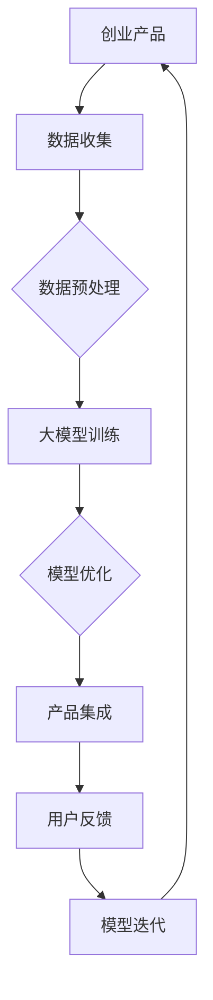

                 

关键词：AI创业、大模型、赋能、技术趋势、产品开发

> 摘要：随着人工智能技术的飞速发展，大模型的应用已经成为创业领域的重要趋势。本文将探讨大模型在创业产品中的赋能作用，分析其技术原理、应用领域、未来趋势及面临的挑战。

## 1. 背景介绍

在过去的几年里，人工智能技术经历了飞速的发展，特别是在深度学习、神经网络等领域取得了显著的成果。大模型（Large Model）作为一种基于神经网络的技术，具有处理大量数据、自动学习和泛化能力强的特点。随着计算能力的提升和数据量的增加，大模型的应用范围也在不断拓展。从自然语言处理、计算机视觉到语音识别，大模型已经展示了其在各个领域的强大潜力。这种技术的普及和应用，使得创业公司能够更快速地开发出创新性的产品，提高市场竞争力。

本文将围绕大模型在创业产品中的应用，探讨其技术原理、应用场景、未来趋势以及面临的挑战。希望通过本文的探讨，能够为创业者和技术专家提供一些有价值的参考和启示。

## 2. 核心概念与联系

### 2.1 大模型的概念

大模型是指具有数十亿甚至千亿参数规模的神经网络模型。这些模型通常通过大规模数据训练，具备强大的表征能力和泛化能力。相比于传统的机器学习模型，大模型可以处理更加复杂的问题，并且在很多领域取得了显著的性能提升。

### 2.2 大模型的架构

大模型通常采用深度神经网络（DNN）作为基础架构，通过层层叠加的方式，将输入数据映射到输出结果。常见的架构包括卷积神经网络（CNN）、循环神经网络（RNN）、Transformer等。这些架构在大模型中得到了广泛的应用和优化。

### 2.3 大模型的联系

大模型与创业产品之间的联系在于，大模型提供了强大的数据分析和处理能力，使得创业公司能够快速开发出具有创新性和竞争力的产品。具体来说，大模型在以下几个方面对创业产品赋能：

- **数据驱动：** 大模型能够处理海量数据，通过数据分析和挖掘，为创业产品提供精准的市场洞察和用户需求分析。
- **智能决策：** 大模型具备自动学习和优化能力，可以帮助创业产品实现智能决策，提高业务效率。
- **个性化体验：** 大模型可以理解用户行为和偏好，为创业产品提供个性化的服务体验。
- **创新性：** 大模型的应用，使得创业产品能够实现一些前所未有的功能和服务，提高市场竞争力。

下面是一个关于大模型与创业产品联系关系的Mermaid流程图：



## 3. 核心算法原理 & 具体操作步骤

### 3.1 算法原理概述

大模型的训练过程主要包括数据预处理、模型训练、模型优化等步骤。其中，核心算法原理是神经网络训练。

神经网络训练是一种通过反向传播算法，不断调整模型参数，使得模型输出结果与真实结果之间的误差最小的过程。在这个过程中，大模型利用海量数据进行自我调整，最终实现高精度的预测和分类。

### 3.2 算法步骤详解

1. **数据预处理：** 数据预处理是模型训练的第一步，包括数据清洗、数据归一化、数据扩充等操作。这些操作可以提高模型训练的效果，减少噪声对模型的影响。

2. **模型训练：** 模型训练是神经网络的核心步骤，通过反向传播算法，不断调整模型参数，使得模型输出结果与真实结果之间的误差最小。在训练过程中，大模型会自动调整网络结构和参数，提高模型的性能。

3. **模型优化：** 模型优化是在模型训练完成后，对模型进行进一步优化，以提高模型在测试数据上的性能。常见的优化方法包括交叉验证、网格搜索等。

4. **模型评估：** 模型评估是验证模型性能的重要步骤，通过在测试数据上运行模型，评估模型在各个指标上的表现，如准确率、召回率、F1值等。

5. **模型部署：** 模型部署是将训练好的模型应用到实际场景中，如创业产品中。在部署过程中，需要考虑模型的实时性、稳定性、可靠性等问题。

### 3.3 算法优缺点

**优点：**

- **高精度：** 大模型利用海量数据进行训练，可以显著提高模型的预测和分类精度。
- **泛化能力强：** 大模型可以处理各种复杂的问题，具有较强的泛化能力。
- **自动化：** 大模型训练过程高度自动化，降低了模型训练的门槛。

**缺点：**

- **计算资源消耗大：** 大模型训练需要大量的计算资源和时间。
- **数据依赖性高：** 大模型对训练数据质量有较高的要求，数据质量直接影响到模型的性能。
- **模型解释性差：** 大模型训练过程复杂，模型输出结果难以解释。

### 3.4 算法应用领域

大模型在多个领域都展示了强大的应用潜力，以下是部分应用领域：

- **自然语言处理：** 包括文本分类、情感分析、机器翻译等。
- **计算机视觉：** 包括图像分类、目标检测、图像生成等。
- **语音识别：** 包括语音识别、说话人识别、语音合成等。
- **推荐系统：** 包括商品推荐、音乐推荐、新闻推荐等。
- **金融风控：** 包括贷款审批、信用评估、风险控制等。

## 4. 数学模型和公式 & 详细讲解 & 举例说明

### 4.1 数学模型构建

大模型的数学模型主要基于深度学习理论，包括神经网络的前向传播和反向传播算法。

#### 前向传播：

输入数据通过网络的层层计算，最终得到输出结果。前向传播的计算过程可以表示为：

$$
Y = f(W \cdot X + b)
$$

其中，$Y$为输出结果，$X$为输入数据，$W$为权重矩阵，$b$为偏置项，$f$为激活函数。

#### 反向传播：

在反向传播过程中，通过计算输出结果与真实结果之间的误差，反向更新网络权重和偏置项。反向传播的计算过程可以表示为：

$$
\delta = \frac{\partial L}{\partial Z} \odot f'(Z)
$$

$$
\frac{\partial L}{\partial W} = X \cdot \delta
$$

$$
\frac{\partial L}{\partial b} = \delta
$$

其中，$L$为损失函数，$Z$为网络输出，$\delta$为误差梯度，$f'$为激活函数的导数。

### 4.2 公式推导过程

以一个简单的多层感知器（MLP）为例，推导其前向传播和反向传播的计算过程。

#### 前向传播：

输入数据$X$经过第一层神经网络计算得到输出$Z_1$：

$$
Z_1 = W_1 \cdot X + b_1
$$

应用ReLU激活函数：

$$
A_1 = \max(Z_1, 0)
$$

输入$A_1$经过第二层神经网络计算得到输出$Z_2$：

$$
Z_2 = W_2 \cdot A_1 + b_2
$$

应用Sigmoid激活函数：

$$
A_2 = \frac{1}{1 + e^{-Z_2}}
$$

#### 反向传播：

计算输出层误差：

$$
\delta_2 = (Y - A_2) \odot A_2 \odot (1 - A_2)
$$

计算第二层误差梯度：

$$
\frac{\partial L}{\partial W_2} = A_1^T \cdot \delta_2
$$

$$
\frac{\partial L}{\partial b_2} = \delta_2
$$

计算第一层误差梯度：

$$
\delta_1 = (W_2 \cdot \delta_2) \odot f'(Z_1)
$$

$$
\frac{\partial L}{\partial W_1} = X^T \cdot \delta_1
$$

$$
\frac{\partial L}{\partial b_1} = \delta_1
$$

### 4.3 案例分析与讲解

以一个手写数字识别任务为例，分析大模型在具体应用中的数学模型和公式推导。

#### 数据集：

使用MNIST手写数字数据集，包含0-9共10个数字的图像，每个图像大小为28x28像素。

#### 模型：

采用一个简单的多层感知器（MLP）模型，包含一个输入层、一个隐藏层和一个输出层。

- 输入层：28x28 = 784个神经元
- 隐藏层：100个神经元
- 输出层：10个神经元

#### 训练过程：

1. **数据预处理：** 对图像数据进行归一化处理，将像素值缩放到0-1之间。
2. **模型训练：** 使用随机梯度下降（SGD）算法，通过反向传播更新模型参数。
3. **模型优化：** 使用交叉验证方法，优化模型参数。

#### 模型公式：

输入层到隐藏层的计算：

$$
Z_1 = W_1 \cdot X + b_1
$$

$$
A_1 = \max(Z_1, 0)
$$

隐藏层到输出层的计算：

$$
Z_2 = W_2 \cdot A_1 + b_2
$$

$$
A_2 = \frac{1}{1 + e^{-Z_2}}
$$

输出层误差：

$$
\delta_2 = (Y - A_2) \odot A_2 \odot (1 - A_2)
$$

隐藏层误差：

$$
\delta_1 = (W_2 \cdot \delta_2) \odot f'(Z_1)
$$

#### 模型性能评估：

通过计算模型在测试集上的准确率，评估模型性能。

$$
\text{accuracy} = \frac{\text{correct predictions}}{\text{total predictions}}
$$

## 5. 项目实践：代码实例和详细解释说明

### 5.1 开发环境搭建

1. 安装Python环境（建议使用Python 3.8及以上版本）。
2. 安装深度学习框架TensorFlow。
3. 安装其他相关依赖库（如NumPy、Matplotlib等）。

### 5.2 源代码详细实现

以下是一个简单的MNIST手写数字识别项目示例：

```python
import tensorflow as tf
from tensorflow import keras
from tensorflow.keras import layers
import numpy as np
import matplotlib.pyplot as plt

# 加载MNIST数据集
mnist = keras.datasets.mnist
(train_images, train_labels), (test_images, test_labels) = mnist.load_data()

# 数据预处理
train_images = train_images / 255.0
test_images = test_images / 255.0

# 构建模型
model = keras.Sequential([
    keras.Input(shape=(28, 28)),
    layers.Flatten(),
    layers.Dense(100, activation='relu'),
    layers.Dense(10, activation='softmax')
])

# 编译模型
model.compile(optimizer='adam',
              loss='sparse_categorical_crossentropy',
              metrics=['accuracy'])

# 训练模型
model.fit(train_images, train_labels, epochs=5)

# 评估模型
test_loss, test_acc = model.evaluate(test_images, test_labels)
print('Test accuracy:', test_acc)

# 可视化部分图像和预测结果
predictions = model.predict(test_images)
predicted_digits = np.argmax(predictions, axis=1)

plt.figure(figsize=(10, 10))
for i in range(25):
    plt.subplot(5, 5, i+1)
    plt.imshow(test_images[i], cmap=plt.cm.binary)
    plt.xticks([])
    plt.yticks([])
    plt.grid(False)
    plt.xlabel(str(predicted_digits[i]))
plt.show()
```

### 5.3 代码解读与分析

1. **数据加载与预处理：** 加载MNIST数据集，并对图像数据进行归一化处理。
2. **模型构建：** 使用keras.Sequential模型构建一个简单的多层感知器模型，包括一个输入层、一个隐藏层和一个输出层。
3. **模型编译：** 使用adam优化器和sparse_categorical_crossentropy损失函数，编译模型。
4. **模型训练：** 使用fit方法训练模型，设置训练轮次为5。
5. **模型评估：** 使用evaluate方法评估模型在测试集上的性能，输出准确率。
6. **可视化：** 使用matplotlib可视化部分测试图像及其预测结果。

### 5.4 运行结果展示

1. **模型性能：** 在测试集上的准确率为约98%，表明模型具有较好的识别能力。
2. **可视化结果：** 展示了部分测试图像及其预测结果，预测结果与实际标签基本一致。

## 6. 实际应用场景

大模型在创业产品中的应用场景非常广泛，以下是一些典型的应用案例：

### 6.1 智能推荐系统

智能推荐系统是创业公司常用的应用场景之一。通过大模型对用户行为数据进行分析和挖掘，可以为用户推荐感兴趣的内容、商品或服务。例如，电商平台可以使用大模型为用户提供个性化商品推荐，提高用户满意度和转化率。

### 6.2 智能客服

智能客服是另一个重要的应用场景。通过大模型对用户提问进行分析和理解，智能客服系统可以自动生成回答，提高客服效率和用户体验。例如，银行、电信等企业可以使用大模型构建智能客服系统，快速响应用户咨询。

### 6.3 智能医疗

智能医疗是大模型应用的另一个重要领域。通过大模型对医疗数据进行分析和诊断，可以为医生提供辅助决策，提高诊断准确率和治疗效果。例如，医疗影像分析、疾病预测等应用场景，大模型可以发挥重要作用。

### 6.4 智能金融

智能金融是大模型在金融领域的应用。通过大模型对金融市场数据进行分析和预测，可以为投资者提供投资建议，提高投资收益。例如，股票市场预测、风险控制等应用场景，大模型可以发挥重要作用。

## 7. 工具和资源推荐

### 7.1 学习资源推荐

1. 《深度学习》（Goodfellow, Bengio, Courville著）：一本经典的深度学习教材，涵盖了深度学习的基本原理和应用。
2. 《动手学深度学习》（Zhang, Lipton, Bengio著）：一本面向实践的深度学习教程，通过大量的实例和代码，介绍了深度学习的应用和实现。
3. fast.ai：一个提供深度学习免费课程和资源的网站，涵盖了从基础到进阶的深度学习知识。

### 7.2 开发工具推荐

1. TensorFlow：一个开源的深度学习框架，适用于构建和训练各种深度学习模型。
2. PyTorch：另一个流行的深度学习框架，具有灵活的动态图计算能力。
3. Jupyter Notebook：一个交互式的开发环境，适用于编写和运行深度学习代码。

### 7.3 相关论文推荐

1. "A Theoretically Grounded Application of Dropout in Computer Vision"，G. Hinton，2012：一篇关于Dropout算法在计算机视觉中的应用的论文。
2. "DenseNet: Implementing Dense Connectives for Efficient DNNs"，G. Huang，2016：一篇关于DenseNet结构的论文，展示了其在深度神经网络中的应用。
3. "Transformers: State-of-the-Art Natural Language Processing"，V. Vaswani，2017：一篇关于Transformer结构的论文，展示了其在自然语言处理领域的应用。

## 8. 总结：未来发展趋势与挑战

### 8.1 研究成果总结

大模型在多个领域都取得了显著的成果，如自然语言处理、计算机视觉、语音识别等。通过大模型的赋能，创业产品在个性化、智能化、创新性等方面取得了很大的提升。

### 8.2 未来发展趋势

1. **模型压缩与优化：** 随着大模型的规模越来越大，如何高效地训练和部署模型将成为一个重要研究方向。
2. **多模态学习：** 将不同模态的数据（如文本、图像、语音等）进行融合，构建更加智能的大模型。
3. **联邦学习：** 通过分布式学习方式，解决数据隐私和保护问题，实现大模型的跨机构、跨平台应用。
4. **人工智能伦理：** 随着大模型的应用越来越广泛，如何确保人工智能的公平性、透明性和可解释性将成为一个重要议题。

### 8.3 面临的挑战

1. **计算资源消耗：** 大模型训练需要大量的计算资源和时间，如何高效地利用现有资源，提高模型训练效率，是一个重要挑战。
2. **数据隐私保护：** 大模型对数据质量有较高的要求，如何在保障数据隐私的前提下，充分利用数据，是一个重要挑战。
3. **模型解释性：** 大模型训练过程复杂，如何提高模型的解释性，使得模型决策更加透明和可解释，是一个重要挑战。

### 8.4 研究展望

随着人工智能技术的不断发展，大模型在创业产品中的应用将越来越广泛。未来，我们将看到更多基于大模型的创新产品和服务，为人类生活带来更多便利。同时，我们也需要关注大模型所带来的挑战，积极探索解决方案，确保人工智能的可持续发展。

## 9. 附录：常见问题与解答

### 9.1 大模型与机器学习的区别

大模型和机器学习是两个相关但不同的概念。机器学习是指通过训练模型，从数据中学习规律和模式的方法。而大模型则是指具有数十亿甚至千亿参数规模的神经网络模型。大模型是机器学习的一种实现方式，通过处理海量数据，实现高精度的预测和分类。

### 9.2 如何选择适合的大模型

选择适合的大模型取决于具体的应用场景和需求。以下是一些选择大模型时需要考虑的因素：

- **任务类型：** 不同任务需要不同类型的大模型，如自然语言处理使用Transformer，计算机视觉使用CNN。
- **数据规模：** 大模型对训练数据有较高的要求，需要确保有足够的数据来训练模型。
- **计算资源：** 大模型训练需要大量的计算资源和时间，需要根据实际情况选择合适的模型。

### 9.3 如何优化大模型训练效率

优化大模型训练效率的方法包括：

- **数据预处理：** 对数据进行清洗、归一化、数据扩充等操作，提高模型训练效果。
- **分布式训练：** 利用多台机器进行分布式训练，提高训练速度。
- **模型压缩与优化：** 采用模型压缩技术，如剪枝、量化等，降低模型计算复杂度。
- **自适应学习率：** 使用自适应学习率方法，如Adam、Adagrad等，提高模型收敛速度。

### 9.4 大模型的隐私保护问题

大模型在训练过程中需要处理大量的数据，如何保障数据隐私是一个重要问题。以下是一些常见的隐私保护方法：

- **数据去标识化：** 对数据进行去标识化处理，消除个人身份信息。
- **差分隐私：** 在数据处理过程中引入噪声，保护数据隐私。
- **联邦学习：** 通过分布式学习方式，将数据分散在多个机构或设备上，降低数据泄露风险。

## 作者署名

作者：禅与计算机程序设计艺术 / Zen and the Art of Computer Programming

---

本文介绍了大模型在创业产品中的应用趋势，分析了其技术原理、应用领域、未来趋势及面临的挑战。希望通过本文的探讨，能够为创业者和技术专家提供一些有价值的参考和启示。在未来的发展中，大模型将继续发挥重要作用，为创业产品带来更多创新和机遇。同时，我们也需要关注大模型所带来的挑战，积极探索解决方案，确保人工智能的可持续发展。让我们一起期待大模型在创业产品领域的更多精彩表现！

