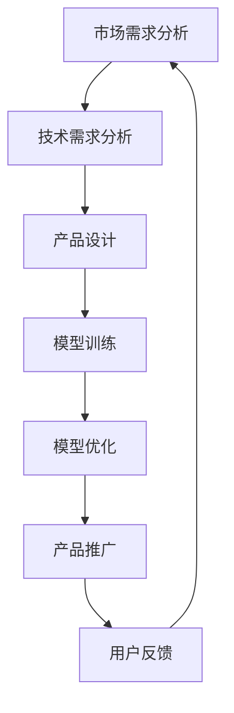

                 

关键词：AI创业、大模型、产品经理、技术策略、市场需求、产品设计

> 摘要：本文将探讨如何利用AI驱动的策略在创业过程中开发出具有市场竞争力的大模型产品。我们将深入分析核心概念、算法原理、项目实践，并结合数学模型和具体案例分析，探讨实际应用场景与未来发展方向。

## 1. 背景介绍

随着人工智能技术的飞速发展，AI已经渗透到我们日常生活的各个方面。从智能手机到智能家居，从自动驾驶到医疗诊断，AI的应用正在不断扩展。然而，对于创业者而言，如何利用AI技术打造出具有市场竞争力的产品，成为了亟需解决的问题。本文旨在为AI驱动的创业提供一份产品经理指南，帮助创业者在激烈的市场竞争中脱颖而出。

### 当前AI技术的应用现状

当前，AI技术在多个领域取得了显著成果。其中，深度学习、自然语言处理、计算机视觉等技术的应用尤为广泛。例如，在金融领域，AI被用于风险管理、信用评估、欺诈检测等方面；在医疗领域，AI被用于疾病预测、诊断辅助、药物研发等方面。这些应用不仅提升了行业的效率，也创造了巨大的市场价值。

### 创业者在AI领域的挑战

尽管AI技术的应用前景广阔，但创业者在这个领域面临诸多挑战。首先，AI技术的研发和应用需要大量的资金和人才支持，这对初创公司来说是一个巨大的负担。其次，市场竞争激烈，创业者需要快速响应市场需求，才能在竞争中立于不败之地。最后，AI技术的更新迭代速度非常快，创业者需要不断学习和适应新技术，以保持竞争优势。

## 2. 核心概念与联系

在AI驱动的创业中，了解核心概念和它们之间的联系是至关重要的。以下是几个关键概念及其关系：

### 2.1 AI驱动的创业

AI驱动的创业是指利用人工智能技术来开发和推广产品或服务，以实现商业目标。这通常涉及数据收集、模型训练、算法优化等多个环节。

### 2.2 大模型

大模型是指具有大规模参数的深度学习模型，如大型神经网络。这些模型通常具有强大的表示能力和泛化能力，可以处理复杂的任务。

### 2.3 产品经理

产品经理是负责产品策略、需求分析、设计、开发和市场推广的核心角色。在AI驱动的创业中，产品经理需要具备一定的AI知识，以更好地理解和指导产品开发。

### 2.4 技术策略

技术策略是指创业公司在研发过程中采用的技术路线和策略。这包括算法选择、数据处理、模型优化等方面。

### 2.5 市场需求

市场需求是指用户对产品或服务的需求和期望。了解市场需求是产品经理的重要任务，它直接影响产品的设计和推广策略。

### Mermaid 流程图

以下是一个简单的Mermaid流程图，展示了AI驱动的创业过程：



## 3. 核心算法原理 & 具体操作步骤

### 3.1 算法原理概述

在AI驱动的创业中，核心算法的选择至关重要。以下是一些常用的算法及其原理：

#### 3.1.1 深度学习

深度学习是一种基于人工神经网络的机器学习技术，通过多层神经网络来提取数据特征，实现复杂的任务。深度学习的核心算法包括卷积神经网络（CNN）、循环神经网络（RNN）和生成对抗网络（GAN）等。

#### 3.1.2 自然语言处理

自然语言处理（NLP）是AI领域的一个重要分支，它涉及文本的识别、理解、生成等任务。NLP的核心算法包括词向量表示、序列模型、文本生成模型等。

#### 3.1.3 计算机视觉

计算机视觉是AI领域的一个分支，它涉及图像的识别、分类、分割等任务。计算机视觉的核心算法包括卷积神经网络（CNN）、生成对抗网络（GAN）等。

### 3.2 算法步骤详解

以下是一个典型的AI驱动的创业项目的算法步骤：

#### 3.2.1 数据收集与预处理

在数据收集阶段，需要从各种渠道获取相关数据，如公开数据集、用户数据、商业数据等。在数据预处理阶段，需要对数据进行清洗、归一化、去噪等处理，以提升数据质量。

#### 3.2.2 模型选择与训练

在模型选择阶段，需要根据任务的需求选择合适的模型。在训练阶段，需要将预处理后的数据输入到模型中，通过反向传播算法来更新模型参数，以提升模型的性能。

#### 3.2.3 模型优化与评估

在模型优化阶段，需要对模型进行调参、剪枝等操作，以提升模型的性能。在评估阶段，需要使用验证集或测试集来评估模型的性能，以确定模型是否满足需求。

#### 3.2.4 模型部署与监控

在模型部署阶段，需要将训练好的模型部署到生产环境中，以实现产品的商业化。在监控阶段，需要实时监控模型的性能和稳定性，以保障产品的正常运行。

### 3.3 算法优缺点

#### 3.3.1 深度学习

优点：强大的表示能力、适用于各种复杂任务。

缺点：对数据量有较高要求、训练过程耗时较长。

#### 3.3.2 自然语言处理

优点：能够处理自然语言中的复杂结构。

缺点：对语言理解能力要求较高、数据预处理复杂。

#### 3.3.3 计算机视觉

优点：能够处理图像和视频数据。

缺点：对计算资源有较高要求、模型解释性较差。

### 3.4 算法应用领域

#### 3.4.1 金融

在金融领域，深度学习可以用于风险管理、信用评估、欺诈检测等任务。

#### 3.4.2 医疗

在医疗领域，自然语言处理可以用于疾病预测、诊断辅助、药物研发等任务。

#### 3.4.3 农业

在农业领域，计算机视觉可以用于作物监测、病虫害检测等任务。

## 4. 数学模型和公式 & 详细讲解 & 举例说明

在AI驱动的创业中，数学模型和公式是理解算法原理和实现具体操作的关键。以下是一些常用的数学模型和公式及其详细讲解。

### 4.1 数学模型构建

#### 4.1.1 卷积神经网络（CNN）

卷积神经网络是一种专门用于图像识别的神经网络。其基本结构包括卷积层、池化层和全连接层。以下是一个简单的CNN模型：

$$
\text{CNN} = \text{Conv} \xrightarrow{\text{ReLU}} \text{Pooling} \xrightarrow{\text{ReLU}} \text{Fully Connected}
$$

#### 4.1.2 循环神经网络（RNN）

循环神经网络是一种用于处理序列数据的神经网络。其基本结构包括输入层、隐藏层和输出层。以下是一个简单的RNN模型：

$$
\text{RNN} = \text{Input} \xrightarrow{\text{ReLU}} \text{Hidden} \xrightarrow{\text{Sigmoid}} \text{Output}
$$

### 4.2 公式推导过程

以下是一个简单的CNN模型中的卷积操作的推导过程：

$$
\begin{aligned}
    \text{卷积操作} &= \text{输入图像} \times \text{卷积核} \\
    &= (x_{ij} \times w_{ij}) \\
    &= x_{ij}w_{ij} \\
    &= \sum_{i=1}^{n} \sum_{j=1}^{m} x_{ij}w_{ij}
\end{aligned}
$$

其中，$x_{ij}$ 表示输入图像中的像素值，$w_{ij}$ 表示卷积核的权重。

### 4.3 案例分析与讲解

#### 4.3.1 金融领域

假设我们要构建一个用于信用评估的模型。我们可以使用一个简单的线性回归模型来预测信用评分：

$$
\text{信用评分} = \text{特征向量} \times \text{权重向量} + \text{偏置项}
$$

其中，特征向量表示借款人的各项特征（如收入、年龄、负债等），权重向量表示特征对信用评分的影响程度，偏置项用于调整模型的输出。

#### 4.3.2 医疗领域

假设我们要构建一个用于疾病预测的模型。我们可以使用一个简单的决策树模型来预测疾病发生概率：

$$
\text{疾病预测} = \text{决策树}(\text{特征向量})
$$

其中，特征向量表示病人的各项检查指标，决策树根据特征向量的取值来预测疾病发生概率。

## 5. 项目实践：代码实例和详细解释说明

### 5.1 开发环境搭建

为了便于读者理解，我们将在Python环境中实现一个简单的线性回归模型。首先，我们需要安装以下库：

```bash
pip install numpy matplotlib scikit-learn
```

### 5.2 源代码详细实现

以下是一个简单的线性回归模型的实现：

```python
import numpy as np
import matplotlib.pyplot as plt
from sklearn.linear_model import LinearRegression

# 数据生成
np.random.seed(0)
X = np.random.rand(100, 1)
y = 3 * X + np.random.randn(100, 1)

# 模型训练
model = LinearRegression()
model.fit(X, y)

# 模型预测
y_pred = model.predict(X)

# 结果可视化
plt.scatter(X, y, color='blue', label='实际数据')
plt.plot(X, y_pred, color='red', label='预测结果')
plt.xlabel('X')
plt.ylabel('Y')
plt.legend()
plt.show()
```

### 5.3 代码解读与分析

上述代码中，我们首先导入了所需的库，然后生成了一组随机数据，用于训练和测试模型。接下来，我们使用scikit-learn中的线性回归模型对数据进行训练，并使用训练好的模型进行预测。最后，我们将实际数据和预测结果绘制在图表上，以直观地展示模型的性能。

### 5.4 运行结果展示

运行上述代码后，我们将看到一个散点图，其中蓝色点表示实际数据，红色线表示预测结果。从图表中可以看出，模型的预测效果较好，大部分预测值与实际值接近。

## 6. 实际应用场景

在AI驱动的创业中，实际应用场景多种多样。以下是一些常见场景及其实例：

### 6.1 金融领域

在金融领域，AI驱动的创业可以应用于信用评估、风险管理和投资决策等方面。例如，一个创业公司可以开发一款基于机器学习的信用评估系统，帮助金融机构更准确地评估借款人的信用风险。

### 6.2 医疗领域

在医疗领域，AI驱动的创业可以应用于疾病预测、诊断辅助和药物研发等方面。例如，一个创业公司可以开发一款基于自然语言处理的疾病预测系统，帮助医生更早地发现患者可能患有的疾病。

### 6.3 农业

在农业领域，AI驱动的创业可以应用于作物监测、病虫害检测和智能灌溉等方面。例如，一个创业公司可以开发一款基于计算机视觉的作物监测系统，帮助农民更准确地了解作物的生长状况。

## 7. 未来应用展望

随着AI技术的不断发展，未来AI驱动的创业将在更多领域得到应用。以下是一些未来应用展望：

### 7.1 教育领域

在教育领域，AI驱动的创业可以应用于智能教学、个性化学习等方面。例如，一个创业公司可以开发一款基于AI的智能教学系统，根据学生的学习情况提供个性化的学习内容。

### 7.2 交通领域

在交通领域，AI驱动的创业可以应用于自动驾驶、智能交通管理等方面。例如，一个创业公司可以开发一款基于计算机视觉的自动驾驶系统，提高交通安全性和效率。

### 7.3 能源领域

在能源领域，AI驱动的创业可以应用于智能电网、新能源开发等方面。例如，一个创业公司可以开发一款基于AI的智能电网管理系统，提高能源利用效率。

## 8. 工具和资源推荐

为了帮助读者更好地了解AI驱动的创业，我们推荐以下工具和资源：

### 8.1 学习资源推荐

- 《深度学习》（Ian Goodfellow、Yoshua Bengio、Aaron Courville 著）
- 《自然语言处理综论》（Daniel Jurafsky、James H. Martin 著）
- 《Python机器学习》（Sebastian Raschka、Vahid Mirjalili 著）

### 8.2 开发工具推荐

- TensorFlow
- PyTorch
- Scikit-learn

### 8.3 相关论文推荐

- "Deep Learning for Text Classification"
- "Unsupervised Representation Learning with Deep Convolutional Networks"
- "Generative Adversarial Networks"

## 9. 总结：未来发展趋势与挑战

### 9.1 研究成果总结

过去几年，AI技术在多个领域取得了显著成果，为创业者提供了丰富的应用场景和机会。然而，AI技术的研发和应用仍然面临诸多挑战，如数据质量、模型解释性、算法公平性等。

### 9.2 未来发展趋势

未来，AI驱动的创业将继续在更多领域得到应用。随着算法和技术的不断进步，AI驱动的创业将更加注重用户体验、个性化服务和智能化应用。

### 9.3 面临的挑战

尽管前景广阔，但AI驱动的创业仍将面临一系列挑战，如技术瓶颈、数据隐私、法律监管等。创业者需要不断创新和适应，以应对这些挑战。

### 9.4 研究展望

在未来，我们期待看到更多创新性的AI应用，如跨学科融合、多模态数据处理等。同时，我们也期待AI技术能够更好地服务于社会，提升人类生活质量。

## 附录：常见问题与解答

### Q: 如何选择合适的AI算法？

A: 选择合适的AI算法需要考虑任务类型、数据特点、计算资源等因素。例如，对于图像识别任务，可以优先考虑卷积神经网络（CNN）；对于文本分类任务，可以优先考虑自然语言处理（NLP）算法。

### Q: AI驱动的创业需要哪些技能？

A: AI驱动的创业需要涉及多个领域，包括计算机科学、数据科学、产品设计、市场营销等。创业者需要具备以下技能：编程能力、数据分析能力、产品经理能力、市场营销能力等。

### Q: 数据质量和模型性能之间的关系是什么？

A: 数据质量对模型性能有着直接的影响。高质量的数据有助于模型更好地学习和泛化，从而提高模型的性能。因此，在AI驱动的创业中，数据预处理和清洗工作至关重要。

---

作者：禅与计算机程序设计艺术 / Zen and the Art of Computer Programming
----------------------------------------------------------------


