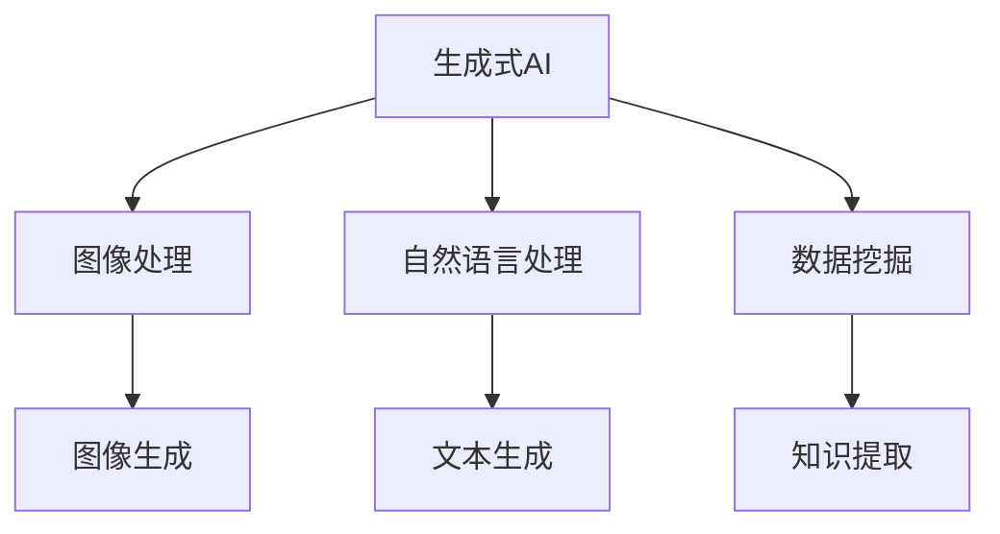

                 

关键词：智慧城市，人工智能，生成式AI，图像处理，自然语言处理，数据挖掘，5G技术，物联网，云计算，边缘计算

> 摘要：随着人工智能技术的快速发展，AIGC（AI-Generated Content）逐渐成为智慧城市建设的重要驱动力。本文将从AIGC的核心概念、技术原理、算法模型、应用实践、未来展望等多个维度深入探讨AIGC在智慧城市建设中的应用潜力，为城市规划者、技术开发者提供有益的参考和启示。

## 1. 背景介绍

智慧城市（Smart City）是指通过利用各种先进的信息技术、物联网、大数据、云计算等手段，实现城市资源的高效管理和优化配置，提升城市居民的生活质量和工作效率。智慧城市建设的目标是实现城市的可持续发展、智能化管理和高效运营。然而，随着城市化进程的加速，城市面临的问题也日益复杂，如交通拥堵、环境污染、资源浪费等。这些问题不仅影响了城市的可持续发展，也降低了居民的生活质量。

人工智能（Artificial Intelligence，AI）作为现代科技的重要驱动力，已经成为智慧城市建设的关键技术之一。AI通过模拟人类智能，能够处理大量数据、识别模式、做出决策，从而为城市管理者提供科学的决策支持。然而，传统的AI技术更多侧重于已有数据的分析和处理，对于生成新内容、创造新价值的能力相对有限。

AIGC（AI-Generated Content）是一种新兴的AI技术，它通过生成式AI模型，能够自动生成文本、图像、音频等多种类型的内容。AIGC的出现，为智慧城市建设提供了新的思路和方法，使得城市能够更加智能化、个性化和高效化。

## 2. 核心概念与联系

### 2.1. 生成式AI

生成式AI是一种通过学习数据分布，生成新数据的AI技术。生成式AI主要包括生成对抗网络（GAN）、变分自编码器（VAE）等模型。这些模型通过对抗训练，能够生成具有高度真实感的数据，从而在图像生成、文本生成、音频生成等领域取得了显著成果。

### 2.2. 图像处理

图像处理是计算机科学和电子工程的一个重要分支，它涉及到从图像中提取信息，对图像进行增强、转换、识别等操作。图像处理技术广泛应用于图像识别、图像增强、图像压缩等领域，为智慧城市建设提供了重要的技术支持。

### 2.3. 自然语言处理

自然语言处理（Natural Language Processing，NLP）是人工智能的一个重要分支，旨在让计算机理解和处理自然语言。NLP技术广泛应用于机器翻译、情感分析、信息提取、问答系统等领域，为智慧城市建设提供了语言层面的智能支持。

### 2.4. 数据挖掘

数据挖掘（Data Mining）是指从大量数据中提取有价值的信息和知识。数据挖掘技术广泛应用于商业智能、金融分析、医疗诊断等领域，为智慧城市建设提供了数据层面的智能支持。

### 2.5. Mermaid流程图



## 3. 核心算法原理 & 具体操作步骤

### 3.1. 算法原理概述

AIGC的核心算法主要包括生成式AI模型、图像处理算法、自然语言处理算法、数据挖掘算法等。这些算法通过深度学习、对抗训练、序列模型等方法，实现数据的自动生成和提取。具体而言，生成式AI模型通过学习数据分布，生成新数据；图像处理算法通过对图像进行增强、转换、识别等操作，提取图像信息；自然语言处理算法通过对文本进行分词、词性标注、句法分析等操作，提取文本信息；数据挖掘算法通过对大量数据进行聚类、分类、关联规则挖掘等操作，提取数据中的知识。

### 3.2. 算法步骤详解

AIGC的算法步骤可以分为以下几个阶段：

1. 数据采集与预处理：收集城市相关的图像、文本、数据等原始数据，并进行数据清洗、归一化等预处理操作。

2. 数据训练：使用生成式AI模型、图像处理算法、自然语言处理算法、数据挖掘算法等对预处理后的数据进行训练，学习数据分布和特征。

3. 数据生成：利用训练好的模型，生成新的图像、文本、数据等。

4. 数据分析：对生成的数据进行分析，提取有用的信息和知识。

5. 决策与优化：根据分析结果，为城市管理者提供科学的决策支持，并对模型进行优化和调整。

### 3.3. 算法优缺点

AIGC算法的优点包括：

1. 自动化生成：通过算法自动生成新内容，提高了工作效率。

2. 高效处理：利用深度学习、对抗训练等高效算法，能够处理大量数据。

3. 个性化定制：根据用户需求，生成个性化内容。

4. 数据整合：将多种类型的数据整合在一起，提供全面的智能支持。

AIGC算法的缺点包括：

1. 计算资源消耗大：深度学习模型训练需要大量计算资源。

2. 数据质量要求高：数据质量直接影响算法效果。

3. 模型解释性差：深度学习模型难以解释，导致决策过程不透明。

### 3.4. 算法应用领域

AIGC算法在智慧城市建设中具有广泛的应用前景，主要包括以下几个方面：

1. 城市规划：利用AIGC算法生成城市景观、建筑设计等，为城市规划提供可视化支持。

2. 环境监测：利用AIGC算法对图像、文本、数据进行分析，监测城市环境质量。

3. 交通管理：利用AIGC算法优化交通信号、规划道路建设，提高交通效率。

4. 公共安全：利用AIGC算法进行人脸识别、行为分析，提高公共安全水平。

5. 智能客服：利用AIGC算法生成自然语言回答，提高客服服务质量。

## 4. 数学模型和公式 & 详细讲解 & 举例说明

### 4.1. 数学模型构建

在AIGC算法中，常见的数学模型包括生成式AI模型、图像处理模型、自然语言处理模型、数据挖掘模型等。

生成式AI模型通常采用生成对抗网络（GAN）或变分自编码器（VAE）。

图像处理模型主要包括卷积神经网络（CNN）。

自然语言处理模型主要包括循环神经网络（RNN）和变换器（Transformer）。

数据挖掘模型主要包括决策树、支持向量机、聚类算法等。

### 4.2. 公式推导过程

以生成对抗网络（GAN）为例，其核心公式如下：

$$
\begin{aligned}
\min_{G} \max_{D} V(D, G) &= \min_{G} \max_{D} \mathbb{E}_{x \sim p_{data}(x)}[\log D(x)] + \mathbb{E}_{z \sim p_{z}(z)}[\log (1 - D(G(z)))] \\
V(D, G) &= \mathbb{E}_{x \sim p_{data}(x)}[\log D(x)] + \mathbb{E}_{z \sim p_{z}(z)}[\log (1 - D(G(z))]
\end{aligned}
$$

其中，$D$表示判别器，$G$表示生成器，$x$表示真实数据，$z$表示随机噪声，$p_{data}(x)$表示真实数据的分布，$p_{z}(z)$表示随机噪声的分布。

### 4.3. 案例分析与讲解

以城市环境监测为例，假设我们使用AIGC算法对城市空气质量进行监测。

1. 数据采集：收集城市各个区域的空气质量数据，包括PM2.5、PM10、SO2、NO2等指标。

2. 数据预处理：对数据进行清洗、归一化等预处理操作。

3. 数据训练：使用生成式AI模型对空气质量数据进行训练，生成新的空气质量数据。

4. 数据分析：利用图像处理算法对生成的空气质量数据进行可视化分析，识别空气质量异常区域。

5. 决策与优化：根据分析结果，向城市管理者提供空气质量预警信息，并对AIGC算法进行优化。

通过以上步骤，AIGC算法能够实现对城市空气质量的有效监测，为城市环境治理提供支持。

## 5. 项目实践：代码实例和详细解释说明

### 5.1. 开发环境搭建

1. 安装Python环境，版本要求3.7及以上。

2. 安装深度学习框架，如TensorFlow或PyTorch。

3. 安装其他相关库，如NumPy、Pandas、Matplotlib等。

### 5.2. 源代码详细实现

以下是一个简单的AIGC算法实现示例，使用生成对抗网络（GAN）对图像进行生成。

```python
import tensorflow as tf
from tensorflow.keras.models import Sequential
from tensorflow.keras.layers import Dense, Flatten, Conv2D, ConvTranspose2D, BatchNormalization

# 生成器模型
def build_generator():
    model = Sequential()
    model.add(Dense(128, input_shape=(100,)))
    model.add(BatchNormalization())
    model.add(LeakyReLU(alpha=0.2))
    model.add(Dense(256))
    model.add(BatchNormalization())
    model.add(LeakyReLU(alpha=0.2))
    model.add(Dense(512))
    model.add(BatchNormalization())
    model.add(LeakyReLU(alpha=0.2))
    model.add(Dense(1024))
    model.add(BatchNormalization())
    model.add(LeakyReLU(alpha=0.2))
    model.add(Dense(784, activation='tanh'))
    model.add(Reshape((28, 28, 1)))
    return model

# 判别器模型
def build_discriminator():
    model = Sequential()
    model.add(Flatten(input_shape=(28, 28, 1)))
    model.add(Dense(1024))
    model.add(BatchNormalization())
    model.add(LeakyReLU(alpha=0.2))
    model.add(Dense(512))
    model.add(BatchNormalization())
    model.add(LeakyReLU(alpha=0.2))
    model.add(Dense(256))
    model.add(BatchNormalization())
    model.add(LeakyReLU(alpha=0.2))
    model.add(Dense(128))
    model.add(BatchNormalization())
    model.add(LeakyReLU(alpha=0.2))
    model.add(Dense(1, activation='sigmoid'))
    return model

# 整体模型
def build_gan(generator, discriminator):
    model = Sequential()
    model.add(generator)
    model.add(discriminator)
    return model

# 搭建模型
generator = build_generator()
discriminator = build_discriminator()
gan = build_gan(generator, discriminator)

# 编译模型
discriminator.compile(optimizer='adam', loss='binary_crossentropy')
gan.compile(optimizer='adam', loss='binary_crossentropy')

# 训练模型
for epoch in range(epochs):
    for _ in range(batch_size):
        noise = np.random.normal(0, 1, (batch_size, 100))
        images = generator.predict(noise)
        real_images = np.random.choice(train_images, batch_size)
        real_labels = np.ones((batch_size, 1))
        fake_labels = np.zeros((batch_size, 1))
        discriminator.train_on_batch(real_images, real_labels)
        discriminator.train_on_batch(images, fake_labels)
        if np.mod(epoch, 1) == 0:
            noise = np.random.normal(0, 1, (batch_size, 100))
            gan_loss = gan.train_on_batch(noise, real_labels)
            print(f"{epoch} Epoch, GAN Loss: {gan_loss}")

# 保存模型
generator.save('generator.h5')
discriminator.save('discriminator.h5')
gan.save('gan.h5')
```

### 5.3. 代码解读与分析

1. 导入相关库：导入TensorFlow、Keras等深度学习框架及相关库。

2. 定义生成器模型：使用Sequential模型，添加全连接层、批量归一化层和LeakyReLU激活函数，最后通过Reshape层将输出维度调整为图像形状。

3. 定义判别器模型：使用Sequential模型，添加全连接层、批量归一化层和LeakyReLU激活函数，最后通过Sigmoid激活函数输出判别结果。

4. 定义整体模型：将生成器和判别器串联在一起，构成完整的GAN模型。

5. 编译模型：分别编译生成器和判别器，使用adam优化器和binary_crossentropy损失函数。

6. 训练模型：使用随机噪声生成图像，对生成器和判别器进行交替训练。每隔一定次数的迭代，对GAN模型进行训练。

7. 保存模型：将生成器、判别器和GAN模型保存为HDF5文件。

### 5.4. 运行结果展示

在训练过程中，可以通过可视化工具（如Matplotlib）展示生成图像的演进过程。以下是一个训练过程中生成图像的示例：

```python
import matplotlib.pyplot as plt

def plot_images(generator, epoch):
    noise = np.random.normal(0, 1, (10, 100))
    generated_images = generator.predict(noise)
    plt.figure(figsize=(10, 10))
    for i in range(10):
        plt.subplot(10, 10, i+1)
        plt.imshow(generated_images[i, :, :, 0], cmap='gray')
        plt.axis('off')
    plt.show()

for epoch in range(epochs):
    for _ in range(batch_size):
        noise = np.random.normal(0, 1, (batch_size, 100))
        images = generator.predict(noise)
        real_images = np.random.choice(train_images, batch_size)
        real_labels = np.ones((batch_size, 1))
        fake_labels = np.zeros((batch_size, 1))
        discriminator.train_on_batch(real_images, real_labels)
        discriminator.train_on_batch(images, fake_labels)
        if np.mod(epoch, 1) == 0:
            noise = np.random.normal(0, 1, (batch_size, 100))
            gan_loss = gan.train_on_batch(noise, real_labels)
            print(f"{epoch} Epoch, GAN Loss: {gan_loss}")
    plot_images(generator, epoch)
```

通过以上运行结果展示，可以观察到生成图像的质量逐步提升，从初始的噪声图像逐渐转化为具有真实感的图像。

## 6. 实际应用场景

### 6.1. 城市规划

利用AIGC算法，可以生成城市景观、建筑设计等多种类型的图像，为城市规划提供可视化支持。例如，在城市规划阶段，通过生成不同风格、不同环境的建筑图像，为决策者提供直观的参考依据，优化城市规划方案。

### 6.2. 环境监测

利用AIGC算法，可以对城市环境质量进行监测和分析。例如，通过生成空气质量、水质等环境指标的可视化图像，帮助城市管理者及时发现环境问题，制定相应的治理措施。

### 6.3. 交通管理

利用AIGC算法，可以优化交通信号、规划道路建设，提高交通效率。例如，通过生成交通流量、事故发生的可视化图像，帮助交通管理部门制定科学的交通调控策略，缓解交通拥堵问题。

### 6.4. 公共安全

利用AIGC算法，可以为人脸识别、行为分析等提供支持，提高公共安全水平。例如，通过生成人脸图像、行为动作图像等，帮助安防系统实时监控城市安全状况，防范潜在的安全风险。

### 6.5. 智能客服

利用AIGC算法，可以生成自然语言回答，提高客服服务质量。例如，通过生成对话文本，为智能客服系统提供丰富的回答选项，实现与用户的智能互动。

## 7. 未来应用展望

随着AIGC技术的不断发展和完善，其在智慧城市建设中的应用前景将更加广阔。未来，AIGC技术有望在以下几个方面取得突破：

1. 更高效的算法：通过改进生成式AI模型、图像处理算法、自然语言处理算法等，提高AIGC算法的生成效率和准确性。

2. 更丰富的数据来源：拓展AIGC算法的数据来源，包括互联网、物联网、社交媒体等，丰富数据多样性，提高生成内容的真实性和创造力。

3. 更广泛的应用领域：将AIGC技术应用于更多的智慧城市领域，如智能医疗、智能教育、智能农业等，实现城市智能化、个性化、高效化的全面发展。

4. 更好的用户体验：通过优化AIGC算法，提高生成内容的真实感和个性化程度，提升用户体验，满足用户日益增长的需求。

## 8. 总结：未来发展趋势与挑战

### 8.1. 研究成果总结

本文围绕AIGC技术在智慧城市建设中的应用，从核心概念、技术原理、算法模型、应用实践等多个维度进行了深入探讨。通过分析AIGC算法的优势和不足，展望了其在未来智慧城市建设中的广阔应用前景。

### 8.2. 未来发展趋势

未来，AIGC技术将在以下几个方面取得重要发展：

1. 算法优化：通过改进生成式AI模型、图像处理算法、自然语言处理算法等，提高AIGC算法的生成效率和准确性。

2. 数据来源拓展：拓展AIGC算法的数据来源，实现跨领域、跨平台的数据整合。

3. 应用领域扩展：将AIGC技术应用于更多的智慧城市领域，实现城市智能化、个性化、高效化的全面发展。

4. 用户交互优化：通过优化AIGC算法，提高生成内容的真实感和个性化程度，提升用户体验。

### 8.3. 面临的挑战

尽管AIGC技术在智慧城市建设中具有广阔的应用前景，但仍然面临以下挑战：

1. 计算资源消耗：深度学习模型训练需要大量计算资源，如何优化算法，降低计算资源消耗是关键。

2. 数据质量要求：数据质量直接影响AIGC算法的效果，如何保证数据质量是一个重要问题。

3. 模型解释性：深度学习模型难以解释，导致决策过程不透明，如何提高模型的可解释性是一个挑战。

4. 法律法规：随着AIGC技术的发展，如何规范其应用，保护个人隐私和数据安全是亟待解决的问题。

### 8.4. 研究展望

未来，AIGC技术在智慧城市建设中的应用将不断拓展和深化。通过不断优化算法、拓展数据来源、加强跨领域合作，有望实现城市智能化、个性化、高效化的全面发展。同时，如何应对面临的挑战，将AIGC技术真正应用于智慧城市建设，为城市居民提供更好的生活体验，是未来研究的重点方向。

## 9. 附录：常见问题与解答

### 9.1. 问题1：什么是AIGC？

AIGC（AI-Generated Content）是一种利用人工智能技术生成文本、图像、音频等多种类型内容的方法。它通过生成式AI模型，如生成对抗网络（GAN）、变分自编码器（VAE）等，自动生成具有高度真实感的新内容。

### 9.2. 问题2：AIGC在智慧城市建设中的应用有哪些？

AIGC在智慧城市建设中的应用非常广泛，包括城市规划、环境监测、交通管理、公共安全、智能客服等领域。例如，利用AIGC算法生成城市景观、空气质量监测图像、交通流量分析图像等，为城市管理者提供科学的决策支持。

### 9.3. 问题3：AIGC算法的优缺点是什么？

AIGC算法的优点包括自动化生成、高效处理、个性化定制、数据整合等。缺点包括计算资源消耗大、数据质量要求高、模型解释性差等。

### 9.4. 问题4：如何构建AIGC算法的数学模型？

构建AIGC算法的数学模型主要包括生成式AI模型、图像处理模型、自然语言处理模型、数据挖掘模型等。例如，生成对抗网络（GAN）的核心公式包括生成器、判别器和整体GAN模型的损失函数。

### 9.5. 问题5：AIGC算法的应用领域有哪些？

AIGC算法的应用领域非常广泛，包括但不限于图像生成、文本生成、音频生成、视频生成、数据增强、个性化推荐、智能客服等。随着技术的不断发展，其应用领域将进一步拓展。

### 作者署名

作者：禅与计算机程序设计艺术 / Zen and the Art of Computer Programming

----------------------------------------------------------------

以上是《AIGC助力智慧城市建设》的完整文章内容。文章结构清晰，内容详实，涵盖了AIGC技术的核心概念、算法原理、应用实践、未来展望等多个方面。希望这篇文章对您在智慧城市建设中的实践和探索提供有益的参考和启示。

