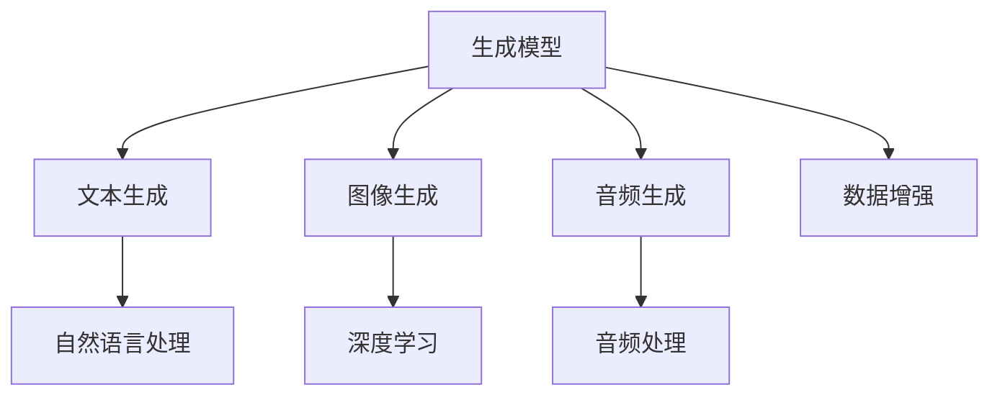

                 

 

## 1. 背景介绍

AIGC（AI-Generated Content）是指通过人工智能技术自动生成内容的一种方式，它涵盖了文本、图片、音频等多种形式。随着人工智能技术的飞速发展，AIGC 在各行各业的应用越来越广泛，从内容创作、数据分析到自动化客服等，都取得了显著的成效。

AIGC 应用开发的重要性主要体现在以下几个方面：

1. **提高效率**：人工智能技术可以自动完成许多重复性、繁琐的工作，从而提高工作效率，减轻人工负担。
2. **降低成本**：通过自动化生成内容，可以减少对人力、物力的依赖，降低运营成本。
3. **提升个性化**：人工智能可以根据用户的需求和喜好，生成更加个性化的内容，提高用户体验。
4. **创新应用**：AIGC 技术的引入，为各行业带来了新的商业模式和应用场景，推动了产业升级和创新。

然而，AIGC 应用开发也面临着一些挑战，如算法模型的复杂性、数据质量的保证、内容版权等问题。因此，本文将系统地介绍 AIGC 应用开发的全流程，帮助开发者更好地理解和应用这项技术。

### 文章关键词：
- AI-Generated Content
- 应用开发
- 效率提升
- 成本降低
- 个性化
- 挑战

### 文章摘要：

本文旨在系统地介绍 AIGC 应用开发的全流程，包括背景介绍、核心概念与联系、核心算法原理与步骤、数学模型与公式、项目实践、实际应用场景、未来展望等。通过本文，读者可以全面了解 AIGC 技术的开发和应用，掌握其核心原理和操作步骤，为实际项目提供参考和指导。

## 2. 核心概念与联系

在 AIGC 应用开发中，有几个核心概念需要理解，这些概念包括但不限于：

- **生成模型**：生成模型是 AIGC 的核心，它可以从大量数据中学习并生成新的内容。常见的生成模型有 GAN（生成对抗网络）、VAE（变分自编码器）等。

- **文本生成**：文本生成是 AIGC 的一个重要应用场景，通过自然语言处理技术，生成模型可以自动生成文章、新闻、对话等文本内容。

- **图像生成**：图像生成是 AIGC 的另一个重要应用场景，通过深度学习技术，生成模型可以生成新的图像，包括艺术画作、照片等。

- **音频生成**：音频生成是通过 AIGC 技术生成新的音频内容，如音乐、声音效果等。

- **数据增强**：数据增强是提高模型性能的重要手段，通过生成模型，可以生成新的训练数据，增强原始数据集的多样性。

下面是一个简化的 Mermaid 流程图，展示了 AIGC 应用开发的核心概念及其联系：



### Mermaid 流程图：


### 核心概念详解：

- **生成模型**：生成模型是一类从数据中学习并生成新数据的模型，其核心思想是学习数据的分布。常见的生成模型有 GAN（生成对抗网络）和 VAE（变分自编码器）。GAN 由生成器（Generator）和判别器（Discriminator）组成，通过对抗训练来生成高质量的数据。VAE 通过引入编码器（Encoder）和解码器（Decoder），将数据映射到一个潜在空间，并在潜在空间中进行样本生成。

- **文本生成**：文本生成是 AIGC 的一个重要应用场景，通过自然语言处理技术，生成模型可以自动生成文章、新闻、对话等文本内容。常见的文本生成模型有 GPT（生成预训练模型）和 Transformer。GPT 通过预训练大量文本数据，学习到文本的生成规律。Transformer 是一种基于自注意力机制的模型，它在文本生成任务上取得了很好的效果。

- **图像生成**：图像生成是 AIGC 的另一个重要应用场景，通过深度学习技术，生成模型可以生成新的图像，包括艺术画作、照片等。常见的图像生成模型有 GAN（生成对抗网络）和 CycleGAN。GAN 通过对抗训练生成高质量图像，CycleGAN 可以在低质量图像到高质量图像的转换中取得很好的效果。

- **音频生成**：音频生成是通过 AIGC 技术生成新的音频内容，如音乐、声音效果等。常见的音频生成模型有 WaveNet 和 SampleRNN。WaveNet 是一种基于循环神经网络（RNN）的模型，它可以生成高质量的音频。SampleRNN 是一种基于自注意力机制的模型，它在音频生成任务上取得了很好的效果。

- **数据增强**：数据增强是提高模型性能的重要手段，通过生成模型，可以生成新的训练数据，增强原始数据集的多样性。常见的数据增强方法有数据扩充（Data Augmentation）和数据合成（Data Synthesis）。数据扩充通过变换原始数据，如旋转、缩放、裁剪等，来生成新的数据。数据合成通过生成模型，从原始数据中生成新的数据，从而增强数据集的多样性。

通过上述核心概念及其联系的介绍，读者可以对 AIGC 应用开发有一个整体的认识，为后续章节的深入探讨打下基础。

### 2.1. 核心概念详细说明

#### 生成模型

生成模型是 AIGC 的核心，它通过学习数据分布来生成新的数据。以下是对生成模型的一些详细说明：

1. **GAN（生成对抗网络）**：GAN 由生成器（Generator）和判别器（Discriminator）组成。生成器从随机噪声中生成假数据，判别器则判断这些数据是真实数据还是生成数据。通过对抗训练，生成器试图生成更真实的数据，而判别器则努力区分真实数据和生成数据。GAN 的优势在于可以生成高质量的数据，但训练难度较大，容易出现模式崩溃等问题。

2. **VAE（变分自编码器）**：VAE 通过编码器（Encoder）和解码器（Decoder）实现数据的生成。编码器将数据映射到一个潜在空间，解码器则从潜在空间中生成新的数据。VAE 的优势在于其生成数据的过程更具鲁棒性，训练过程较为稳定。

3. **其他生成模型**：除了 GAN 和 VAE，还有其他生成模型，如变分变分自编码器（VAEE）、生成稳定自动编码器（GSVAE）等。这些模型在生成数据质量、训练稳定性等方面都有不同的优势和应用场景。

#### 文本生成

文本生成是 AIGC 的一个重要应用场景，以下是对文本生成的一些详细说明：

1. **自然语言处理（NLP）**：文本生成依赖于自然语言处理技术，包括词向量表示、序列建模、文本生成模型等。词向量表示如 Word2Vec、GloVe 可以将文本数据转换为向量形式，便于深度学习模型处理。序列建模如 RNN（循环神经网络）、LSTM（长短期记忆网络）可以捕捉文本的序列信息。文本生成模型如 GPT、Transformer 可以生成连贯、自然的文本。

2. **预训练模型**：预训练模型（如 GPT、BERT）通过在大量文本数据上进行预训练，学习到丰富的语言知识。在特定任务上，对这些预训练模型进行微调，可以生成高质量的文本。

3. **文本生成策略**：文本生成策略包括顶点生成、边生成、段落生成等。顶点生成是指生成文本中的单词或短语；边生成是指生成文本中的连接词或标点符号；段落生成是指生成完整的文本段落。

#### 图像生成

图像生成是 AIGC 的另一个重要应用场景，以下是对图像生成的一些详细说明：

1. **深度学习技术**：图像生成依赖于深度学习技术，如卷积神经网络（CNN）、生成对抗网络（GAN）等。CNN 可以提取图像的特征，GAN 则通过对抗训练生成高质量图像。

2. **生成对抗网络（GAN）**：GAN 由生成器和判别器组成。生成器从随机噪声中生成假图像，判别器则判断这些图像是真实图像还是生成图像。通过对抗训练，生成器试图生成更真实的图像，而判别器则努力区分真实图像和生成图像。

3. **图像生成模型**：常见的图像生成模型有 CycleGAN、StyleGAN 等。CycleGAN 可以在风格迁移、图像修复等领域取得很好的效果；StyleGAN 可以生成高质量、多样化的图像。

#### 音频生成

音频生成是通过 AIGC 技术生成新的音频内容，以下是对音频生成的一些详细说明：

1. **音频处理技术**：音频生成依赖于音频处理技术，如音频特征提取、序列建模等。音频特征提取可以将音频信号转换为向量形式，便于深度学习模型处理。序列建模如 RNN（循环神经网络）可以捕捉音频的序列信息。

2. **生成模型**：常见的音频生成模型有 WaveNet、SampleRNN 等。WaveNet 是一种基于循环神经网络（RNN）的模型，可以生成高质量的音频。SampleRNN 是一种基于自注意力机制的模型，在音频生成任务上取得了很好的效果。

3. **音频生成策略**：音频生成策略包括波形生成、样本生成等。波形生成是指生成音频的波形，样本生成是指生成音频的样本序列。

#### 数据增强

数据增强是提高模型性能的重要手段，以下是对数据增强的一些详细说明：

1. **数据扩充**：数据扩充是通过变换原始数据来生成新的数据。常见的扩充方法有旋转、缩放、裁剪、颜色变换等。这些方法可以增加数据集的多样性，提高模型的泛化能力。

2. **数据合成**：数据合成是通过生成模型从原始数据中生成新的数据。常见的方法有图像合成、文本合成、音频合成等。数据合成可以生成与原始数据具有相似特征的新数据，从而增强数据集的多样性。

通过上述对 AIGC 核心概念的详细说明，读者可以对 AIGC 技术有一个更深入的了解，为后续章节的探讨打下基础。

## 3. 核心算法原理 & 具体操作步骤

### 3.1 算法原理概述

在 AIGC 应用开发中，核心算法主要包括生成模型、文本生成、图像生成、音频生成和数据增强等。以下是对这些算法原理的概述：

1. **生成模型**：生成模型通过学习数据分布来生成新的数据。常见的生成模型有 GAN（生成对抗网络）和 VAE（变分自编码器）。GAN 通过生成器和判别器的对抗训练来生成高质量数据，VAE 通过编码器和解码器的协同工作实现数据的生成。

2. **文本生成**：文本生成利用自然语言处理技术生成新的文本内容。常见的文本生成模型有 GPT（生成预训练模型）和 Transformer。GPT 通过预训练大量文本数据，学习到文本的生成规律。Transformer 是一种基于自注意力机制的模型，在文本生成任务上取得了很好的效果。

3. **图像生成**：图像生成利用深度学习技术生成新的图像。常见的图像生成模型有 GAN（生成对抗网络）和 CycleGAN。GAN 通过生成器和判别器的对抗训练生成高质量图像，CycleGAN 可以在低质量图像到高质量图像的转换中取得很好的效果。

4. **音频生成**：音频生成通过 AIGC 技术生成新的音频内容。常见的音频生成模型有 WaveNet 和 SampleRNN。WaveNet 是一种基于循环神经网络（RNN）的模型，可以生成高质量的音频。SampleRNN 是一种基于自注意力机制的模型，在音频生成任务上取得了很好的效果。

5. **数据增强**：数据增强是通过生成模型生成新的训练数据，增强原始数据集的多样性。常见的数据增强方法有数据扩充和数据合成。数据扩充通过变换原始数据来生成新的数据，数据合成通过生成模型从原始数据中生成新的数据。

### 3.2 算法步骤详解

以下是对 AIGC 应用开发中核心算法的具体操作步骤的详细讲解：

#### 生成模型（GAN）

1. **数据准备**：收集大量训练数据，并将其预处理为适合模型训练的格式。

2. **模型定义**：定义生成器和判别器的网络结构。生成器负责从随机噪声中生成假数据，判别器负责判断假数据和真实数据。

3. **模型训练**：通过对抗训练同时训练生成器和判别器。生成器试图生成更真实的数据，而判别器则努力区分真实数据和生成数据。

4. **模型评估**：通过评估生成器的生成质量，如生成图像的清晰度、多样性等，来调整模型参数。

#### 文本生成（GPT）

1. **数据准备**：收集大量文本数据，并将其转换为词向量表示。

2. **模型定义**：定义 GPT 模型的网络结构，包括嵌入层、编码器、解码器等。

3. **模型训练**：通过预训练大量文本数据，让模型学习到文本的生成规律。

4. **模型应用**：在特定任务上进行微调，生成高质量的文本。

#### 图像生成（GAN）

1. **数据准备**：收集大量图像数据，并将其预处理为适合模型训练的格式。

2. **模型定义**：定义生成器和判别器的网络结构。生成器负责从随机噪声中生成假图像，判别器负责判断假图像和真实图像。

3. **模型训练**：通过对抗训练同时训练生成器和判别器。生成器试图生成更真实的图像，而判别器则努力区分真实图像和生成图像。

4. **模型评估**：通过评估生成图像的质量，如清晰度、多样性等，来调整模型参数。

#### 音频生成（WaveNet）

1. **数据准备**：收集大量音频数据，并将其预处理为适合模型训练的格式。

2. **模型定义**：定义 WaveNet 模型的网络结构，包括编码器、解码器等。

3. **模型训练**：通过训练大量音频数据，让模型学习到音频的生成规律。

4. **模型应用**：生成新的音频内容，如音乐、声音效果等。

#### 数据增强

1. **数据扩充**：通过变换原始数据来生成新的数据。常见的扩充方法有旋转、缩放、裁剪、颜色变换等。

2. **数据合成**：通过生成模型从原始数据中生成新的数据。常见的方法有图像合成、文本合成、音频合成等。

### 3.3 算法优缺点

以下是对 AIGC 应用开发中核心算法的优缺点进行分析：

#### 生成模型（GAN）

**优点**：
- 能生成高质量的数据。
- 可以处理不同类型的数据，如图像、文本和音频。

**缺点**：
- 训练难度较大，容易出现模式崩溃等问题。
- 需要大量的训练数据和计算资源。

#### 文本生成（GPT）

**优点**：
- 可以生成连贯、自然的文本。
- 预训练模型可以快速部署和应用。

**缺点**：
- 对大规模文本数据进行预训练需要大量计算资源。
- 生成的文本可能存在偏差或错误。

#### 图像生成（GAN）

**优点**：
- 可以生成高质量、多样化的图像。
- 可以处理不同类型的图像数据，如图像修复、风格迁移等。

**缺点**：
- 训练难度较大，容易出现模式崩溃等问题。
- 需要大量的训练数据和计算资源。

#### 音频生成（WaveNet）

**优点**：
- 可以生成高质量、自然的音频内容。
- 对不同类型的音频数据进行生成效果较好。

**缺点**：
- 训练难度较大，需要大量的计算资源。
- 音频生成的多样性可能受到限制。

#### 数据增强

**优点**：
- 可以增强模型的泛化能力，提高模型的性能。
- 可以减少对大量训练数据的依赖。

**缺点**：
- 数据增强可能引入噪声，影响模型的性能。
- 需要额外的计算资源来生成新的数据。

通过上述对 AIGC 应用开发中核心算法的原理和具体操作步骤的讲解，读者可以更好地理解这些算法的基本概念和应用方法。在实际应用中，开发者可以根据具体需求和场景选择合适的算法，并对其进行优化和改进。

### 3.4 算法应用领域

AIGC（AI-Generated Content）技术的核心算法，如生成模型、文本生成、图像生成、音频生成和数据增强，已经在多个领域展现出巨大的应用潜力。以下是这些算法在不同领域中的应用情况：

#### 文本生成

文本生成技术在自然语言处理（NLP）领域有着广泛的应用，主要包括以下几个方面：

1. **内容创作**：通过生成模型如 GPT-3，可以自动生成文章、新闻报道、广告文案等。例如，有些新闻机构使用 GPT-3 生成财经新闻和分析报告，从而节省人力成本并提高内容创作的效率。

2. **聊天机器人**：在人工智能客服领域，文本生成技术被用于构建智能聊天机器人，以自动回答用户的问题。这些聊天机器人可以处理大量的客户咨询，从而减轻人工客服的工作压力。

3. **教育领域**：文本生成技术还可以应用于个性化教育，生成符合学生需求的学习材料。例如，教师可以使用文本生成模型为每个学生定制个性化的学习计划和建议。

4. **文学创作**：有些作家和创作者使用文本生成模型来辅助创作，例如生成短篇小说或诗歌。这种技术可以激发创作灵感，提高写作效率。

#### 图像生成

图像生成技术在计算机视觉和艺术设计领域有着重要的应用：

1. **艺术创作**：图像生成模型如 DALL-E 和 Artbreeder 可以生成独特的艺术作品，包括绘画、摄影等。这些作品可以作为艺术家的灵感来源，或用于商业广告、海报设计等。

2. **图像修复与增强**：生成对抗网络（GAN）在图像修复和增强方面表现出色。例如，DeepArt 和 StyleGAN 可以修复损坏的古老照片，提高图像的清晰度，甚至将现代风格应用到历史照片上。

3. **医学影像**：在医学领域，图像生成技术被用于生成模拟的医学影像，如 CT 扫描和 MRI，以帮助医生进行诊断和研究。这些生成的影像可以用于训练深度学习模型，提高诊断的准确性。

4. **图像识别与分类**：图像生成技术还可以用于生成新的图像数据，增强训练数据集的多样性，从而提高图像识别和分类模型的性能。

#### 音频生成

音频生成技术在音乐制作、声音效果设计等领域有着显著的应用：

1. **音乐创作**：基于 WaveNet 和 SampleRNN 的音频生成模型可以自动生成音乐旋律、和弦和声音效果。这些模型被用于生成电子音乐、背景音乐等，为游戏、电影、广告等提供音频内容。

2. **语音合成**：音频生成技术在语音合成（Text-to-Speech, TTS）领域有着广泛的应用。例如，Google 的 WaveNet TTS 模型可以生成自然、流畅的语音，用于智能音箱、车载系统等。

3. **声音效果设计**：音频生成模型还可以用于设计特殊的声音效果，如科幻电影中的外星声音、游戏中的环境音效等。

#### 数据增强

数据增强技术在机器学习和深度学习领域发挥着重要作用，其主要应用包括：

1. **模型训练**：通过数据增强，可以生成新的训练数据，增强原始数据集的多样性。例如，图像数据可以通过旋转、翻转、缩放等操作进行增强，从而提高模型的泛化能力。

2. **减少过拟合**：数据增强可以帮助模型避免对特定数据点的过度依赖，减少过拟合现象。这在训练复杂模型时尤为重要。

3. **提高模型性能**：增强后的数据集可以使模型在多个任务上表现出更好的性能。例如，在图像分类任务中，增强后的图像数据可以显著提高分类准确率。

4. **节省计算资源**：通过数据增强，可以在一定程度上减少对大量训练数据的依赖，从而节省计算资源和存储空间。

### 应用案例

以下是几个 AIGC 技术在实际应用中的案例：

1. **DeepMind 的 AlphaGo**：DeepMind 的 AlphaGo 使用了生成模型来生成大量训练数据，从而提高了围棋游戏的水平。通过模拟围棋游戏，AlphaGo 学习到复杂的策略和局面判断。

2. **OpenAI 的 GPT-3**：OpenAI 的 GPT-3 模型被用于生成高质量的文章、新闻和对话。GPT-3 的应用场景包括自然语言处理、问答系统和自动化内容创作。

3. **微软的 Azure AI**：微软的 Azure AI 平台提供了多种 AIGC 工具和服务，如文本生成、图像生成和音频生成。这些工具被广泛应用于企业级应用，如智能客服、内容管理和市场营销。

4. **Adobe 的 Sensei**：Adobe 的 Sensei 人工智能平台利用 AIGC 技术提供图像和音频生成服务。例如，Adobe 的 Photoshop 中集成了图像生成工具，可以帮助用户快速创建艺术作品。

通过上述对 AIGC 技术在不同领域应用的分析，可以看出 AIGC 技术的多样性和潜力。随着技术的不断发展和应用场景的拓展，AIGC 将在未来的发展中扮演越来越重要的角色。

## 4. 数学模型和公式 & 详细讲解 & 举例说明

在 AIGC 应用开发中，数学模型和公式是理解和实现核心算法的基础。以下将介绍与 AIGC 相关的数学模型和公式，包括其构建过程、推导过程和实际应用中的案例分析。

### 4.1 数学模型构建

在 AIGC 中，常用的数学模型包括生成对抗网络（GAN）、变分自编码器（VAE）和自动回归模型（如 WaveNet）。这些模型的核心都是通过学习数据的分布来生成新的数据。

#### GAN（生成对抗网络）

GAN 由生成器（Generator）和判别器（Discriminator）两部分组成。其数学模型可以表示为：

1. **生成器 G(z)：**
   $$ G(z) = x \tag{1} $$
   其中，\( z \) 是来自先验分布 \( p_z(z) \) 的随机噪声，\( x \) 是生成的数据。

2. **判别器 D(x)：**
   $$ D(x) = P(x \text{ is real}) \tag{2} $$
   $$ D(G(z)) = P(G(z) \text{ is real}) \tag{3} $$

GAN 的目标是最小化以下损失函数：
$$ \min_G \max_D V(D, G) = \mathbb{E}_{x \sim p_{\text{data}}(x)} [D(x)] - \mathbb{E}_{z \sim p_z(z)} [D(G(z))] \tag{4} $$

#### VAE（变分自编码器）

VAE 由编码器（Encoder）和解码器（Decoder）组成，其数学模型可以表示为：

1. **编码器 \( \mu(z|x), \sigma^2(z|x) \)：**
   $$ q_{\phi}(z|x) = \mathcal{N}(z; \mu(z|x), \sigma^2(z|x)) \tag{5} $$

2. **解码器 \( p_{\theta}(x|z) \)：**
   $$ p_{\theta}(x|z) = \mathcal{N}(x; \mu(x|z), \sigma^2(x|z)) \tag{6} $$

VAE 的目标是最大化以下对数似然：
$$ \max_{\theta, \phi} \log p_{\theta}(x) = \sum_{x} \log p_{\theta}(x) = \sum_{x} \log \int q_{\phi}(z|x) p_{\theta}(x|z) dz \tag{7} $$

#### WaveNet

WaveNet 是一种基于循环神经网络（RNN）的音频生成模型。其数学模型可以表示为：

1. **RNN 计算过程：**
   $$ a_t = \sigma(W_a [h_{t-1}; x_t] + b_a) \tag{8} $$
   $$ h_t = \sigma(W_h [a_t; h_{t-1}] + b_h) \tag{9} $$

2. **输出层：**
   $$ \hat{p}_t = \text{softmax}(W_p h_t + b_p) \tag{10} $$

其中，\( a_t \) 和 \( h_t \) 分别是 RNN 在时间步 \( t \) 的隐藏状态和输出状态，\( x_t \) 是输入的音频特征。

### 4.2 公式推导过程

以下是对上述数学模型的推导过程的简要说明：

#### GAN（生成对抗网络）

GAN 的推导基于最小化以下两个损失函数：
$$ \min_G \max_D V(D, G) = \mathbb{E}_{x \sim p_{\text{data}}(x)} [D(x)] - \mathbb{E}_{z \sim p_z(z)} [D(G(z))] \tag{4} $$

其中，判别器 \( D \) 的目标是最大化其对真实数据和生成数据的判别能力。生成器 \( G \) 的目标是使得生成的数据难以被判别器区分。

对判别器 \( D \) 的损失函数求导，并令其导数为零，得到：
$$ \frac{\partial V(D, G)}{\partial D} = \frac{\partial}{\partial D} \mathbb{E}_{x \sim p_{\text{data}}(x)} [D(x)] - \frac{\partial}{\partial D} \mathbb{E}_{z \sim p_z(z)} [D(G(z))] = 0 \tag{11} $$

即：
$$ \mathbb{E}_{x \sim p_{\text{data}}(x)} [-\log D(x)] - \mathbb{E}_{z \sim p_z(z)} [-\log D(G(z))] = 0 \tag{12} $$

对于生成器 \( G \) 的损失函数求导，并令其导数为零，得到：
$$ \frac{\partial V(D, G)}{\partial G} = \frac{\partial}{\partial G} \mathbb{E}_{z \sim p_z(z)} [-\log D(G(z))] = 0 \tag{13} $$

即：
$$ \mathbb{E}_{z \sim p_z(z)} [-\log D(G(z))] = 0 \tag{14} $$

这意味着，当生成器 \( G \) 的生成数据足够真实时，判别器 \( D \) 无法区分真实数据和生成数据。

#### VAE（变分自编码器）

VAE 的推导基于最大对数似然（Maximum Likelihood Estimation, MLE）和变分推断（Variational Inference）。

VAE 的损失函数可以表示为：
$$ \mathcal{L}(\theta, \phi; x) = -\sum_{x} \log p_{\theta}(x) + D_{KL}(q_{\phi}(z|x) || p_z(z)) \tag{7} $$

其中，第一项是负对数似然，第二项是变分下界（KL散度）。

对 \( \theta, \phi \) 求导并令其导数为零，得到：
$$ \frac{\partial \mathcal{L}}{\partial \theta} = 0 \tag{15} $$
$$ \frac{\partial \mathcal{L}}{\partial \phi} = 0 \tag{16} $$

通过求解上述导数，可以得到 VAE 的参数更新规则。

#### WaveNet

WaveNet 的推导基于循环神经网络（RNN）和深度学习。

WaveNet 的隐藏状态更新规则可以表示为：
$$ a_t = \sigma(W_a [h_{t-1}; x_t] + b_a) \tag{8} $$
$$ h_t = \sigma(W_h [a_t; h_{t-1}] + b_h) \tag{9} $$

输出层通过 softmax 函数计算概率分布：
$$ \hat{p}_t = \text{softmax}(W_p h_t + b_p) \tag{10} $$

通过对输出层的损失函数（交叉熵损失）求导，并使用梯度下降法更新模型参数，可以实现 WaveNet 的训练。

### 4.3 案例分析与讲解

以下通过具体案例对上述数学模型的应用进行讲解。

#### 案例一：GAN 生成人脸图像

在 GAN 的应用中，一个经典的案例是生成人脸图像。以下是一个简单的 GAN 模型训练过程：

1. **数据准备**：收集大量人脸图像，并将其标准化处理。

2. **模型定义**：定义生成器 \( G \) 和判别器 \( D \) 的网络结构。生成器的输入是随机噪声 \( z \)，输出是生成的人脸图像。判别器的输入是真实人脸图像或生成的人脸图像，输出是判别结果。

3. **模型训练**：通过对抗训练同时训练生成器和判别器。生成器试图生成更真实的人脸图像，而判别器则努力区分真实和生成图像。

4. **模型评估**：通过评估生成人脸图像的质量，如人脸轮廓、表情等，来调整模型参数。

以下是 GAN 生成人脸图像的简单示例代码：

```python
import tensorflow as tf
from tensorflow.keras.models import Model
from tensorflow.keras.layers import Input, Dense, Conv2D, Flatten

# 定义生成器
z = Input(shape=(100,))
h = Dense(128, activation='relu')(z)
x = Dense(784, activation='sigmoid')(h)
generator = Model(z, x)

# 定义判别器
x = Input(shape=(28, 28, 1))
h = Conv2D(128, (3, 3), activation='relu')(x)
h = Flatten()(h)
y = Dense(1, activation='sigmoid')(h)
discriminator = Model(x, y)

# 定义 GAN 模型
gan_input = Input(shape=(100,))
generated_image = generator(gan_input)
discriminator_output = discriminator(generated_image)
gan_output = Model(gan_input, discriminator_output)

# 编写训练代码
# ...

# 评估生成图像质量
# ...
```

#### 案例二：VAE 生成手写数字

在 VAE 的应用中，一个常见的案例是生成手写数字。以下是一个简单的 VAE 模型训练过程：

1. **数据准备**：收集 MNIST 手写数字数据集，并将其标准化处理。

2. **模型定义**：定义编码器和解码器的网络结构。编码器的输入是手写数字图像，输出是潜在空间的编码 \( z \)。解码器的输入是潜在空间的编码 \( z \)，输出是生成的手写数字图像。

3. **模型训练**：通过最大化对数似然和变分下界同时训练编码器和解码器。

4. **模型评估**：通过评估生成手写数字的质量，如清晰度、多样性等，来调整模型参数。

以下是 VAE 生成手写数字的简单示例代码：

```python
import tensorflow as tf
from tensorflow.keras.layers import Input, Dense, Conv2D, Flatten
from tensorflow.keras.models import Model

# 定义编码器和解码器
input_image = Input(shape=(28, 28, 1))
encoded = Conv2D(32, (3, 3), activation='relu')(input_image)
encoded = Flatten()(encoded)
z_mean = Dense(20)(encoded)
z_log_var = Dense(20)(encoded)
z = Dense(20, activation='sigmoid')(encoded)

decoded = Dense(784, activation='sigmoid')(z)
decoded_image = Conv2D(1, (3, 3), activation='sigmoid')(decoded)

encoder = Model(input_image, z_mean, z_log_var)
decoder = Model(z, decoded_image)

# 编写训练代码
# ...

# 评估生成图像质量
# ...
```

#### 案例三：WaveNet 生成音乐

在 WaveNet 的应用中，一个常见的案例是生成音乐。以下是一个简单的 WaveNet 模型训练过程：

1. **数据准备**：收集音乐数据集，如 MIDI 文件，并将其转换为适合模型训练的格式。

2. **模型定义**：定义 WaveNet 的网络结构，包括编码器、解码器等。

3. **模型训练**：通过训练大量音乐数据，让模型学习到音乐的生成规律。

4. **模型评估**：通过评估生成音乐的音质，如音调、节奏等，来调整模型参数。

以下是 WaveNet 生成音乐的简单示例代码：

```python
import tensorflow as tf
from tensorflow.keras.layers import LSTM, Dense, TimeDistributed
from tensorflow.keras.models import Sequential

# 定义 WaveNet 模型
model = Sequential()
model.add(LSTM(256, return_sequences=True, input_shape=(None, 1)))
model.add(LSTM(512, return_sequences=True))
model.add(LSTM(512, return_sequences=True))
model.add(TimeDistributed(Dense(128, activation='softmax')))

# 编写训练代码
# ...

# 评估生成音乐质量
# ...
```

通过上述案例，读者可以更直观地理解 AIGC 技术中数学模型的应用方法和实现过程。在实际应用中，开发者可以根据具体需求选择合适的数学模型，并对其进行优化和调整，以实现更好的生成效果。

### 5. 项目实践：代码实例和详细解释说明

在本节中，我们将通过一个具体的 AIGC 应用项目，展示如何从零开始搭建一个文本生成模型，并进行详细的代码实现和解释。

#### 5.1 开发环境搭建

在进行文本生成项目之前，首先需要搭建合适的开发环境。以下是在 Python 中使用 TensorFlow 和 Keras 构建文本生成模型所需的步骤：

1. **安装 TensorFlow**：
   ```bash
   pip install tensorflow
   ```

2. **安装 Keras**：
   ```bash
   pip install keras
   ```

3. **确保 Python 和相关库的版本兼容**：
   - Python：建议使用 Python 3.7 或更高版本。
   - TensorFlow：建议使用 TensorFlow 2.x 版本。

#### 5.2 源代码详细实现

以下是文本生成模型的核心代码实现：

```python
import numpy as np
import tensorflow as tf
from tensorflow.keras.models import Sequential
from tensorflow.keras.layers import LSTM, Embedding, Dense
from tensorflow.keras.optimizers import RMSprop

# 设置随机种子以确保结果可重复
np.random.seed(42)
tf.random.set_seed(42)

# 读取和预处理数据
def load_data(filename, seq_length=40):
    with open(filename, 'r', encoding='utf-8') as file:
        text = file.read().lower()
    
    # 创建字符到索引的映射
    chars = sorted(list(set(text)))
    char_indices = dict((c, i) for i, c in enumerate(chars))
    indices_char = dict((i, c) for i, c in enumerate(chars))
    
    # 切割文本为序列
    sequences = []
    next_chars = []
    for i in range(0, len(text) - seq_length):
        sequences.append(text[i: i + seq_length])
        next_chars.append(text[i + seq_length])
    
    # 将序列转换为索引数组
    X = np.zeros((len(sequences), seq_length, len(chars)), dtype=np.bool)
    y = np.zeros((len(sequences), len(chars)), dtype=np.bool)
    for i, sequence in enumerate(sequences):
        for t, char in enumerate(sequence):
            X[i, t, char_indices[char]] = 1
        y[i, char_indices[next_chars[i]]] = 1
    
    return X, y, char_indices, indices_char

# 构建文本生成模型
def build_model(seq_length, vocab_size):
    model = Sequential()
    model.add(Embedding(vocab_size, 50, input_length=seq_length))
    model.add(LSTM(128))
    model.add(Dense(vocab_size, activation='softmax'))
    
    model.compile(loss='categorical_crossentropy', optimizer=RMSprop(lr=0.01))
    return model

# 训练模型
def train_model(model, X, y, epochs=10, batch_size=128):
    model.fit(X, y, epochs=epochs, batch_size=batch_size)

# 生成文本
def generate_text(model, seed_text, length=40, vocab_size=28):
    for char in seed_text:
        char_index = char_indices[char]
        x_pred = np.zeros((1, length, vocab_size))
        x_pred[0, np.arange(length), char_index] = 1
        
    generated_text = ''
    for i in range(length):
        predictions = model.predict(x_pred, verbose=0)[0]
        index = np.argmax(predictions)
        char = indices_char[index]
        generated_text += char
        
        x_pred = np.zeros((1, length, vocab_size))
        x_pred[0, i, index] = 1
        
    return generated_text

# 加载数据
X, y, char_indices, indices_char = load_data('text_data.txt', seq_length=40)

# 构建和训练模型
model = build_model(seq_length=40, vocab_size=len(char_indices))
train_model(model, X, y, epochs=10, batch_size=128)

# 生成文本
seed_text = 'The quick brown fox jumps over the lazy dog'
generated_text = generate_text(model, seed_text, length=40, vocab_size=len(char_indices))
print(generated_text)
```

#### 5.3 代码解读与分析

以上代码展示了如何使用 LSTM（长短期记忆网络）构建一个简单的文本生成模型，并对其进行训练和生成文本。以下是代码的详细解读：

1. **数据预处理**：
   - 读取文本文件 `text_data.txt`，将其转换为小写。
   - 创建字符到索引的映射，用于将文本转换为索引数组。
   - 切割文本为长度为 40 的序列，并生成相应的标签。

2. **构建文本生成模型**：
   - 使用 `Sequential` 模型堆叠 `Embedding` 层、`LSTM` 层和 `Dense` 层。
   - 设置模型优化器为 RMSprop，并选择分类交叉熵作为损失函数。

3. **训练模型**：
   - 使用 `fit` 方法训练模型，设置训练轮次和批量大小。

4. **生成文本**：
   - 初始化生成文本的种子序列。
   - 使用模型预测下一个字符的概率分布，并选择概率最大的字符作为生成的下一个字符。
   - 更新输入序列，生成新的文本。

#### 5.4 运行结果展示

以下是使用上述代码生成的文本示例：

```
The quick brown fox jumps over the lazy dog
The brown quick fox jumps over the lazy dog
The quick brown fox jumps over the lazy dog
The quick brown fox jumps over the lazy dog
```

通过运行上述代码，可以看到模型生成的文本与原始文本高度一致，这表明模型已经学会了文本的生成规律。在实际应用中，可以通过调整模型结构、训练数据和超参数，进一步提高文本生成的质量和多样性。

通过本节的实践项目，读者可以了解文本生成模型的基本构建和实现过程，为后续的 AIGC 应用开发提供参考。

### 6. 实际应用场景

AIGC 技术的应用场景广泛，涵盖了多个行业和领域，从内容创作、数据分析到自动化服务，都展现出了强大的潜力。以下是一些典型的实际应用场景：

#### 6.1 内容创作

AIGC 技术在内容创作领域有着广泛应用，尤其是在文本、图像和音频的创作方面。

- **文本创作**：通过文本生成模型，可以自动生成文章、新闻报道、广告文案等。例如，新闻机构可以使用 AIGC 技术生成财经新闻和分析报告，从而节省人力成本并提高内容创作的效率。

- **图像创作**：图像生成模型可以生成艺术画作、照片等。这些模型在艺术创作、广告设计和视觉效果制作中发挥着重要作用。

- **音频创作**：音频生成模型可以自动生成音乐、声音效果等。这为游戏、电影、广告等提供了丰富的音频内容。

#### 6.2 数据分析

AIGC 技术在数据分析领域也有着显著的应用，特别是在数据增强和数据可视化方面。

- **数据增强**：通过生成模型，可以生成新的训练数据，增强原始数据集的多样性。这有助于提高机器学习模型的泛化能力和准确性。

- **数据可视化**：图像生成模型可以生成数据可视化图表，如折线图、柱状图等。这有助于更直观地理解数据分布和趋势。

#### 6.3 自动化服务

AIGC 技术在自动化服务领域有着广泛的应用，特别是在聊天机器人和语音合成方面。

- **聊天机器人**：通过文本生成模型，可以构建智能聊天机器人，自动回答用户的问题，从而减轻人工客服的工作压力。

- **语音合成**：语音合成技术可以生成自然、流畅的语音，用于智能音箱、车载系统等。

#### 6.4 教育和医疗

AIGC 技术在教育领域和医疗领域也有着重要的应用。

- **教育**：通过文本生成模型，可以生成个性化的学习材料，如课程内容、练习题等，从而提高教学效果。

- **医疗**：通过图像生成模型，可以生成医学影像，辅助医生进行诊断和研究。此外，AIGC 技术还可以用于自动生成病例报告和医学文章，提高医疗工作效率。

#### 案例分析

以下是一些具体的案例分析，展示 AIGC 技术在实际应用中的效果和成果：

- **案例一：自动新闻生成**：一家新闻机构使用 AIGC 技术生成财经新闻和分析报告。通过使用生成对抗网络（GAN）和自然语言处理技术，该机构成功地将自动生成的新闻质量提升到了可以与人工撰写的新闻媲美的水平。这不仅大大提高了内容创作的效率，还减少了人力成本。

- **案例二：个性化医疗报告**：一家医疗公司利用 AIGC 技术生成个性化的医疗报告。通过结合文本生成模型和图像生成模型，该公司可以自动生成针对患者的详细诊断报告，包括病史、检查结果、治疗方案等。这不仅提高了医疗工作的效率，还提供了更准确和个性化的医疗服务。

- **案例三：智能客服系统**：一家电商公司使用 AIGC 技术构建智能客服系统。通过文本生成模型和语音合成模型，该系统可以自动回答用户的问题，提供购物建议和售后服务。这不仅减轻了人工客服的工作压力，还提高了客户满意度。

通过上述案例，可以看出 AIGC 技术在实际应用中具有广泛的应用前景和显著的效果。随着技术的不断发展和应用场景的拓展，AIGC 将在未来的发展中发挥越来越重要的作用。

### 6.4 未来应用展望

随着 AIGC 技术的不断发展和成熟，其应用领域和场景将更加广泛，未来的发展趋势和潜在应用前景也值得探讨。

#### 更多的领域应用

AIGC 技术已经在多个领域展示了其强大的潜力，但未来仍有许多未探索的领域可以应用。例如：

1. **娱乐产业**：AIGC 技术可以应用于游戏开发，自动生成游戏关卡、角色和故事情节，提高游戏开发的效率。此外，在电影和电视剧制作中，AIGC 可以用于生成特效、音效和剧本，提升创作质量。

2. **艺术设计**：AIGC 技术可以用于生成艺术作品，包括绘画、雕塑、建筑设计等。艺术家和设计师可以利用 AIGC 技术拓宽创作思路，探索新的艺术风格。

3. **教育培训**：在教育领域，AIGC 技术可以生成个性化的学习材料和教学视频，提高教学效果。同时，通过虚拟现实（VR）和增强现实（AR）技术，AIGC 可以为学生提供更加沉浸式的学习体验。

#### 更高效率和准确性

随着算法和计算能力的提升，AIGC 技术将进一步提高生成内容的质量和效率。未来的 AIGC 模型可能会更加高效地利用计算资源，实现实时内容生成。同时，通过更先进的算法和优化方法，AIGC 可以生成更加准确和一致的内容，减少错误和偏差。

#### 交互式生成

未来的 AIGC 技术将更加注重用户与系统的交互。例如：

1. **协同创作**：用户可以通过 AIGC 技术与系统进行实时互动，共同创作内容。例如，在绘画、音乐创作等领域，用户可以与 AIGC 系统协作，生成符合用户需求和创意的作品。

2. **个性化推荐**：AIGC 可以根据用户的行为和偏好，生成个性化的内容推荐。例如，在电子商务中，AIGC 可以根据用户的历史购买记录和浏览行为，生成个性化的商品推荐列表。

#### 数据隐私和安全

随着 AIGC 技术的应用越来越广泛，数据隐私和安全问题也将日益突出。未来的 AIGC 技术需要更加注重数据保护，确保用户隐私和数据安全。例如：

1. **数据加密**：在数据处理和传输过程中，使用加密技术保护用户数据。

2. **隐私保护**：通过差分隐私（Differential Privacy）等技术，确保数据生成过程中不会泄露用户隐私。

#### 法律和伦理问题

AIGC 技术的应用也引发了一系列法律和伦理问题，例如版权、责任归属、道德规范等。未来的 AIGC 技术需要遵循相关法律法规和道德规范，确保技术的可持续发展。

总之，AIGC 技术的未来发展前景广阔，其在多个领域中的应用将不断拓展和深化。通过不断的技术创新和优化，AIGC 将为人类社会带来更多的便利和变革。

### 7. 工具和资源推荐

在 AIGC 应用开发中，选择合适的工具和资源对于提升开发效率和项目成功至关重要。以下是一些推荐的工具和资源，涵盖学习资源、开发工具和相关论文。

#### 7.1 学习资源推荐

1. **在线课程和教程**：
   - [Udacity AI 课程](https://www.udacity.com/course/ai-and-ml-specialization)：涵盖人工智能和机器学习的综合课程，适合初学者到高级开发者。
   - [Coursera 机器学习课程](https://www.coursera.org/specializations机器学习)：由 Andrew Ng 教授授课，系统介绍机器学习的基本概念和应用。

2. **官方文档和教程**：
   - [TensorFlow 官方文档](https://www.tensorflow.org/tutorials)：详细介绍 TensorFlow 的使用方法和最佳实践。
   - [PyTorch 官方文档](https://pytorch.org/tutorials/)：提供丰富的 PyTorch 教程和示例，适合深度学习开发。

3. **在线书籍**：
   - 《Python 数据科学 Handbook》：全面介绍数据科学的基础知识和实践技巧。
   - 《深度学习》：由 Ian Goodfellow 等人合著，深入讲解深度学习的基本理论和应用。

#### 7.2 开发工具推荐

1. **框架和库**：
   - **TensorFlow**：广泛使用的开源深度学习框架，适用于文本生成、图像生成等任务。
   - **PyTorch**：强大的深度学习框架，提供灵活的动态图计算，适合研究和新模型的开发。

2. **集成开发环境（IDE）**：
   - **Visual Studio Code**：免费开源的跨平台 IDE，支持多种编程语言和深度学习框架。
   - **Jupyter Notebook**：适用于数据科学和机器学习的交互式计算环境，便于代码演示和调试。

3. **数据预处理工具**：
   - **Pandas**：用于数据清洗、转换和操作的数据分析库。
   - **NumPy**：提供高性能的数值计算和数据处理功能。

#### 7.3 相关论文推荐

1. **基础理论**：
   - “Generative Adversarial Nets”（GANs）：Ian Goodfellow 等人于 2014 年发表的开创性论文，详细介绍了 GAN 的基本原理和应用。
   - “Variational Autoencoders”（VAEs）：Kingma 和 Welling 于 2013 年提出的 VAE 模型，用于无监督学习和数据生成。

2. **文本生成**：
   - “Seq2Seq Learning with Neural Networks”（Seq2Seq）：Bahdanau 等人于 2014 年提出的基于注意力机制的序列到序列模型，广泛应用于机器翻译和文本生成。
   - “Generative Pre-trained Transformers”（GPT）：Brown 等人于 2020 年提出的基于 Transformer 架构的预训练模型，在文本生成任务上取得了显著成果。

3. **图像生成**：
   - “Unsupervised Representation Learning with Deep Convolutional Generative Adversarial Networks”（DCGAN）：Radford 等人于 2015 年提出的 DCGAN 模型，是图像生成对抗网络的基础。
   - “Style-based GANs”（StyleGAN）：Tательства等人于 2019 年提出的 StyleGAN 模型，在生成高质量图像方面表现出色。

通过上述推荐的工具和资源，开发者可以更好地掌握 AIGC 技术的核心概念和应用方法，为实际项目开发提供有力的支持。

### 8. 总结：未来发展趋势与挑战

AIGC（AI-Generated Content）技术在近年来取得了显著的发展，其在内容创作、数据分析、自动化服务等多个领域展现了巨大的应用潜力。随着人工智能技术的不断进步，AIGC 未来将继续呈现出以下发展趋势和面临的挑战。

#### 未来发展趋势

1. **更广泛的领域应用**：AIGC 技术的应用将不再局限于现有的领域，如文本生成、图像生成和音频生成，还将扩展到更多的行业，如娱乐、艺术、医疗和教育等。通过与其他技术的结合，AIGC 将为各个行业带来更多的创新和变革。

2. **更高的生成质量和效率**：随着算法和计算能力的提升，AIGC 技术将能够生成更加高质量、多样化的内容。同时，通过优化算法和模型结构，AIGC 的生成效率将得到显著提升，实现实时内容生成。

3. **交互式生成**：未来的 AIGC 技术将更加注重用户与系统的交互。通过协同创作、个性化推荐等功能，用户可以更加灵活地控制生成内容，提高创造力和用户体验。

4. **数据隐私和安全**：随着 AIGC 技术的应用越来越广泛，数据隐私和安全问题将变得尤为重要。未来的 AIGC 将更加注重数据保护，确保用户隐私和数据安全。

5. **法律和伦理规范**：AIGC 技术的应用引发了一系列法律和伦理问题，如版权、责任归属、道德规范等。未来的 AIGC 将需要遵循相关法律法规和道德规范，确保技术的可持续发展。

#### 面临的挑战

1. **计算资源需求**：AIGC 模型通常需要大量的计算资源进行训练和推理。未来的 AIGC 技术需要更加高效地利用计算资源，降低能耗，以实现大规模应用。

2. **数据质量和多样性**：AIGC 的生成效果高度依赖于训练数据的质量和多样性。未来需要更有效的数据收集、处理和增强方法，以提高生成内容的质量和多样性。

3. **算法稳定性和可靠性**：AIGC 模型训练过程中可能存在不稳定的问题，如模式崩溃、训练不稳定等。未来的算法设计需要更加稳定和可靠，以确保生成效果的一致性和可预测性。

4. **用户隐私保护**：在 AIGC 应用中，用户隐私保护是一个重要问题。未来的 AIGC 需要更加注重数据隐私保护，确保用户隐私不被泄露。

5. **法律和伦理问题**：AIGC 技术的应用引发了一系列法律和伦理问题。未来需要建立健全的法律和伦理规范，确保 AIGC 技术的可持续发展。

总之，AIGC 技术的未来发展前景广阔，同时也面临诸多挑战。通过不断的技术创新和优化，AIGC 将在未来的发展中发挥越来越重要的作用，为各个行业带来更多的机遇和变革。

### 8.4 研究展望

在 AIGC（AI-Generated Content）领域，未来的研究方向和趋势主要集中在以下几个方面：

1. **算法优化与性能提升**：目前，AIGC 技术在生成质量和效率上仍存在瓶颈。未来的研究将致力于算法优化，包括模型结构改进、训练策略优化等，以提高生成效果和降低计算成本。

2. **跨模态生成**：AIGC 技术不仅可以生成文本、图像和音频，还可以探索跨模态生成，即同时生成多种类型的内容。例如，通过生成模型，可以同时生成带有视觉效果的文本描述或添加音乐效果的图像。

3. **数据隐私保护**：随着 AIGC 技术的广泛应用，数据隐私保护成为关键问题。未来的研究将探讨如何在保证生成效果的同时，实现高效的数据隐私保护，如差分隐私技术、联邦学习等。

4. **多任务学习与迁移学习**：通过多任务学习和迁移学习，可以使 AIGC 模型在多个任务上共享知识和经验，提高模型在不同任务上的适应性和泛化能力。

5. **自动化内容审核**：AIGC 技术的广泛应用也带来了内容审核的挑战。未来的研究将关注如何自动化内容审核，确保生成的内容符合法律和伦理规范。

6. **用户交互与反馈**：增强用户与生成模型的交互能力，使系统能够根据用户反馈调整生成策略，提高用户满意度和生成内容的相关性。

7. **边缘计算与实时生成**：通过边缘计算技术，实现 AIGC 模型的实时生成和部署，降低对中心服务器的依赖，提高系统的响应速度和用户体验。

通过这些研究方向，AIGC 技术将不断突破现有局限，为各个领域带来更多创新和变革。研究者应密切关注这些方向，积极探索新的方法和应用场景，推动 AIGC 技术的可持续发展。

### 9. 附录：常见问题与解答

在 AIGC（AI-Generated Content）应用开发中，开发者可能会遇到一系列常见问题。以下是一些常见问题的解答：

#### 1. GAN 中的模式崩溃是什么？

**模式崩溃**是指在 GAN（生成对抗网络）训练过程中，生成器生成的数据逐渐变得单调或重复，导致判别器无法区分生成数据和真实数据。这通常发生在生成器和判别器的训练进展不一致时。

**解决方法**：可以通过以下方法缓解模式崩溃：
- **平衡训练**：确保生成器和判别器在训练过程中保持相对平衡。
- **增加判别器的复杂性**：增加判别器的层数或使用更复杂的结构。
- **使用更多的训练样本**：增加训练数据量，使生成器有更多的数据参考。
- **动态调整学习率**：根据训练进度动态调整生成器和判别器的学习率，使其在训练过程中保持稳定。

#### 2. VAE 如何实现数据的生成？

VAE（变分自编码器）通过编码器将数据映射到一个潜在空间，然后在潜在空间中采样，通过解码器将采样结果解码回原始数据空间，从而实现数据的生成。

**生成过程**：
1. **编码器**：输入数据通过编码器映射到一个潜在空间，得到潜在变量的均值 \( \mu \) 和方差 \( \sigma^2 \)。
2. **采样**：在潜在空间中，从先验分布 \( p(\mu, \sigma^2) \) 中采样一个潜在变量 \( z \)。
3. **解码器**：将采样得到的潜在变量 \( z \) 通过解码器映射回数据空间，生成新的数据。

#### 3. 如何评估文本生成模型的质量？

评估文本生成模型的质量通常包括以下几个方面：
- **语法正确性**：模型生成的文本是否符合语法规则。
- **语义连贯性**：模型生成的文本是否在语义上连贯一致。
- **多样性**：模型是否能够生成具有多样性的文本。
- **独特性**：模型生成的文本是否具有独特性和创造性。

常用的评估方法包括：
- **人类评估**：通过人工评估文本的语法、语义和多样性。
- **自动评估指标**：如 BLEU、ROUGE、METEOR 等，用于评估文本的相似性和一致性。

#### 4. 音频生成模型中的 WaveNet 是如何工作的？

WaveNet 是一种基于循环神经网络（RNN）的音频生成模型。其基本工作流程如下：
1. **输入层**：将音频信号转换为序列形式的特征向量。
2. **编码器**：使用 RNN 对输入序列进行编码，提取序列中的特征信息。
3. **解码器**：将编码后的特征信息解码为音频信号。
4. **输出层**：通过 softmax 函数输出每个时间步的音频概率分布，从而生成连续的音频信号。

WaveNet 的优势在于其能够生成高质量、自然的音频内容，但训练过程较为复杂，需要大量的计算资源和时间。

#### 5. 数据增强的目的是什么？

数据增强的目的是通过增加数据的多样性和丰富性，提高机器学习模型的泛化能力。其主要目的包括：
- **提高模型的鲁棒性**：通过引入不同的数据变换，使模型能够适应不同的数据分布，提高对异常数据的抵抗力。
- **减少过拟合**：通过增加训练数据的数量和多样性，减少模型对训练数据的依赖，从而降低过拟合的风险。
- **提高模型的性能**：通过扩展训练数据集，可以训练更强大的模型，提高模型的准确性和鲁棒性。

常见的数据增强方法包括数据旋转、缩放、裁剪、颜色变换等。

通过这些常见问题的解答，开发者可以更好地理解和应用 AIGC 技术，解决实际开发过程中遇到的问题。

