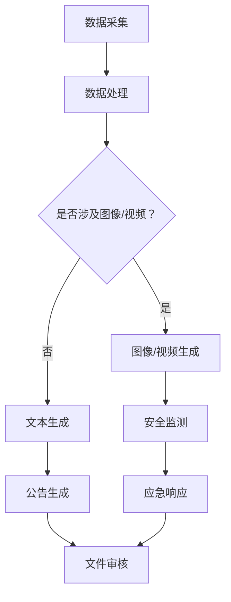

                 

关键词：人工智能、政府服务、智慧政务、自动化流程、数据治理、AIGC技术、政策制定、公共安全、数字化转型、服务效率

> 摘要：本文探讨了人工智能生成内容（AIGC）技术在智慧政务中的应用，分析了其在提升政府服务效率、优化政策制定、增强公共安全等方面的潜力。通过详细介绍AIGC的核心概念、算法原理、数学模型和实际应用案例，文章揭示了AIGC技术在智慧政务中的重要价值，并对未来发展趋势与挑战进行了展望。

## 1. 背景介绍

在信息技术迅速发展的时代，政府服务模式的创新和提升成为各国政府关注的焦点。智慧政务作为数字化转型的关键环节，旨在通过信息技术手段，优化政府服务流程，提升行政效率，增强公共安全，实现政府与民众的互动。然而，传统的政府服务模式在应对大数据、复杂决策环境方面存在诸多挑战。

### 1.1 智慧政务的定义

智慧政务是指利用信息技术，特别是人工智能、大数据、云计算等先进技术，推动政府服务、管理、决策的智能化，以实现高效、透明、互动的公共服务。智慧政务的核心目标是提高政府服务的质量与效率，满足公众的多样化需求，构建现代化的政府治理体系。

### 1.2 传统政府服务的挑战

1. **服务效率低下**：传统政府服务流程繁琐，涉及多个部门和层级，导致办理效率低下，民众满意度低。
2. **数据孤岛问题**：政府部门间的数据难以共享和整合，导致信息孤岛现象严重，影响决策的科学性和实时性。
3. **政策制定难度大**：政策制定过程复杂，缺乏全面的数据支持和智能分析工具，导致政策效果难以评估和优化。
4. **公共安全问题**：随着社会问题的多样化，传统公共安全手段难以应对新型安全挑战。

### 1.3 AIGC技术的引入

AIGC（Artificial Intelligence Generated Content）技术，即人工智能生成内容技术，通过深度学习、自然语言处理等技术，可以自动生成文本、图像、音频等多种形式的内容。AIGC技术的引入，为智慧政务的发展提供了新的动力，有助于解决传统政府服务中的诸多问题。

## 2. 核心概念与联系

### 2.1 AIGC技术的核心概念

AIGC技术主要包括以下几个方面：

1. **文本生成**：通过机器学习模型生成符合逻辑和语法规则的文本。
2. **图像生成**：利用深度学习算法生成高分辨率的图像。
3. **音频生成**：通过人工智能技术生成语音、音乐等音频内容。
4. **视频生成**：结合图像生成和音频生成，生成连贯的视频内容。

### 2.2 AIGC技术在智慧政务中的应用

AIGC技术在智慧政务中的应用主要体现在以下几个方面：

1. **自动化流程**：通过文本生成技术，自动生成政府公告、文件等，减少人工撰写的工作量，提高办事效率。
2. **数据治理**：利用图像生成和文本生成技术，自动处理和分析大量政府数据，提供决策支持。
3. **政策制定**：通过智能分析工具，对大数据进行深入挖掘，为政策制定提供科学依据。
4. **公共安全**：利用图像生成和视频生成技术，实时监测公共安全事件，提高应急响应能力。

### 2.3 Mermaid 流程图

以下是一个简单的 Mermaid 流程图，展示了AIGC技术在智慧政务中的应用流程：



## 3. 核心算法原理 & 具体操作步骤

### 3.1 算法原理概述

AIGC技术主要依赖于以下几种核心算法：

1. **生成对抗网络（GAN）**：用于图像和视频生成。
2. **变换器网络（Transformer）**：用于文本生成。
3. **循环神经网络（RNN）**：用于音频生成。

### 3.2 算法步骤详解

以下是AIGC技术的具体操作步骤：

1. **数据预处理**：对采集到的政府数据进行清洗、格式化等预处理。
2. **模型训练**：利用预处理后的数据，训练相应的生成模型。
3. **内容生成**：根据需求，调用相应的生成模型，生成文本、图像、音频或视频内容。
4. **内容审核**：对生成的内容进行审核，确保符合政府政策法规和道德标准。
5. **内容应用**：将审核通过的内容应用于政府服务的各个环节。

### 3.3 算法优缺点

**优点**：

1. **高效性**：通过自动化流程，显著提高政府服务的效率。
2. **灵活性**：可以根据需求，灵活生成各种形式的内容。
3. **数据驱动**：基于大数据分析，为政策制定提供科学依据。

**缺点**：

1. **数据质量要求高**：需要高质量的数据支持，否则生成内容可能存在偏差。
2. **算法复杂度高**：训练和生成模型需要大量计算资源。

### 3.4 算法应用领域

AIGC技术在智慧政务中的应用非常广泛，主要包括：

1. **公共服务**：自动生成政府公告、文件、通知等。
2. **政策分析**：利用大数据分析，为政策制定提供支持。
3. **公共安全**：实时监测公共安全事件，提供应急响应建议。
4. **数据治理**：自动处理和分析大量政府数据，提高决策的科学性。

## 4. 数学模型和公式 & 详细讲解 & 举例说明

### 4.1 数学模型构建

AIGC技术的核心数学模型主要包括以下几个方面：

1. **生成对抗网络（GAN）**：

   $$ GAN: \mathcal{D} \rightarrow \mathcal{X}, \quad \mathcal{X} \sim p_{\text{data}}(x) $$

   其中，$\mathcal{D}$表示判别器，$\mathcal{X}$表示生成器生成的数据。

2. **变换器网络（Transformer）**：

   $$ Transformer: X \rightarrow Y, \quad Y = \text{softmax}(W_Y \cdot \text{softmax}(W_X \cdot X)) $$

   其中，$X$和$Y$分别表示输入和输出，$W_X$和$W_Y$表示权重矩阵。

3. **循环神经网络（RNN）**：

   $$ RNN: X \rightarrow Y, \quad Y = \text{tanh}(W_Y \cdot \text{tanh}(W_X \cdot X)) $$

   其中，$X$和$Y$分别表示输入和输出，$W_X$和$W_Y$表示权重矩阵。

### 4.2 公式推导过程

以下以GAN为例，简要介绍数学模型推导过程：

1. **目标函数**：

   $$ \mathcal{L}(\mathcal{D}, \mathcal{G}) = \mathbb{E}_{x \sim p_{\text{data}}(x)} [\log \mathcal{D}(x)] + \mathbb{E}_{z \sim p_z(z)} [\log (1 - \mathcal{D}(\mathcal{G}(z)))] $$

   其中，$x$表示真实数据，$z$表示生成器生成的噪声数据，$\mathcal{D}$表示判别器，$\mathcal{G}$表示生成器。

2. **梯度下降**：

   对于判别器$\mathcal{D}$，有：

   $$ \nabla_{\mathcal{D}} \mathcal{L}(\mathcal{D}) = \frac{\partial}{\partial \mathcal{D}} \left[ \log \mathcal{D}(x) + \log (1 - \mathcal{D}(\mathcal{G}(z))) \right] $$

   对于生成器$\mathcal{G}$，有：

   $$ \nabla_{\mathcal{G}} \mathcal{L}(\mathcal{G}) = \frac{\partial}{\partial \mathcal{G}} \left[ \log (1 - \mathcal{D}(\mathcal{G}(z))) \right] $$

### 4.3 案例分析与讲解

以下是一个简单的GAN应用案例：

1. **任务**：生成高分辨率的自然图像。
2. **模型**：采用DCGAN（深度卷积生成对抗网络）模型。
3. **数据集**：使用CIFAR-10数据集。

**生成器模型**：

```python
import tensorflow as tf
from tensorflow.keras.layers import Dense, Conv2D, Flatten, Reshape

def build_generator(z_dim):
    model = tf.keras.Sequential([
        Dense(128 * 7 * 7, activation="relu", input_shape=(z_dim,)),
        Reshape((7, 7, 128)),
        Conv2D(128, (5, 5), strides=(1, 1), padding="same", activation="relu"),
        Conv2D(128, (5, 5), strides=(2, 2), padding="same", activation="relu"),
        Conv2D(128, (5, 5), strides=(2, 2), padding="same", activation="relu"),
        Flatten(),
        Dense(1024, activation="relu"),
        Dense(1024, activation="relu"),
        Flatten(),
        Conv2D(1, (7, 7), strides=(1, 1), padding="same", activation="sigmoid")
    ])
    return model
```

**判别器模型**：

```python
import tensorflow as tf
from tensorflow.keras.layers import Dense, Conv2D, Flatten, Reshape

def build_discriminator(img_shape):
    model = tf.keras.Sequential([
        Flatten(input_shape=img_shape),
        Dense(1024, activation="relu"),
        Dense(1024, activation="relu"),
        Flatten(),
        Dense(1, activation="sigmoid")
    ])
    return model
```

## 5. 项目实践：代码实例和详细解释说明

### 5.1 开发环境搭建

1. **硬件环境**：配备高性能GPU的计算机。
2. **软件环境**：安装TensorFlow 2.0及以上版本。
3. **数据集**：下载并解压CIFAR-10数据集。

### 5.2 源代码详细实现

**生成器代码**：

```python
import tensorflow as tf
from tensorflow.keras.layers import Dense, Conv2D, Flatten, Reshape

def build_generator(z_dim):
    model = tf.keras.Sequential([
        Dense(128 * 7 * 7, activation="relu", input_shape=(z_dim,)),
        Reshape((7, 7, 128)),
        Conv2D(128, (5, 5), strides=(1, 1), padding="same", activation="relu"),
        Conv2D(128, (5, 5), strides=(2, 2), padding="same", activation="relu"),
        Conv2D(128, (5, 5), strides=(2, 2), padding="same", activation="relu"),
        Flatten(),
        Dense(1024, activation="relu"),
        Dense(1024, activation="relu"),
        Flatten(),
        Conv2D(1, (7, 7), strides=(1, 1), padding="same", activation="sigmoid")
    ])
    return model
```

**判别器代码**：

```python
import tensorflow as tf
from tensorflow.keras.layers import Dense, Conv2D, Flatten, Reshape

def build_discriminator(img_shape):
    model = tf.keras.Sequential([
        Flatten(input_shape=img_shape),
        Dense(1024, activation="relu"),
        Dense(1024, activation="relu"),
        Flatten(),
        Dense(1, activation="sigmoid")
    ])
    return model
```

**训练代码**：

```python
import numpy as np
import tensorflow as tf
from tensorflow.keras.optimizers import Adam

def train_cgan(dataset, z_dim, epochs, batch_size, critic_lr, gen_lr):
    # Load the dataset
    (x_train, _), (_, _) = tf.keras.datasets.cifar10.load_data()
    x_train = x_train.astype(np.float32) / 127.5 - 1.0

    # Prepare the models
    generator = build_generator(z_dim)
    discriminator = build_discriminator(x_train[0].shape)
    critic_optimizer = Adam(learning_rate=critic_lr)
    gen_optimizer = Adam(learning_rate=gen_lr)

    # Define the loss functions
    cross_entropy = tf.keras.losses.BinaryCrossentropy(from_logits=True)

    @tf.function
    def critic_loss(real_imgs, fake_imgs):
        real_loss = cross_entropy(tf.ones_like(real_imgs), discriminator(real_imgs))
        fake_loss = cross_entropy(tf.zeros_like(fake_imgs), discriminator(fake_imgs))
        total_loss = real_loss + fake_loss
        return total_loss

    @tf.function
    def gen_loss(fake_imgs):
        return cross_entropy(tf.ones_like(fake_imgs), discriminator(fake_imgs))

    # Start the training loop
    for epoch in range(epochs):
        for batch_idx, real_imgs in enumerate(dataset.take(batch_size)):
            with tf.GradientTape(persistent=True) as critic_tape, tf.GradientTape() as gen_tape:
                # Train the critic
                fake_imgs = generator(tf.random.normal([batch_size, z_dim]))
                critic_loss_value = critic_loss(real_imgs, fake_imgs)

                # Train the generator
                gen_loss_value = gen_loss(fake_imgs)

            # Update the critic weights
            critic_gradients = critic_tape.gradient(critic_loss_value, discriminator.trainable_variables)
            critic_optimizer.apply_gradients(zip(critic_gradients, discriminator.trainable_variables))

            # Update the generator weights
            gen_gradients = gen_tape.gradient(gen_loss_value, generator.trainable_variables)
            gen_optimizer.apply_gradients(zip(gen_gradients, generator.trainable_variables))

            # Print the progress
            print(f"{epoch} [Batch {batch_idx * batch_size}/{len(dataset) // batch_size}] D_loss: {critic_loss_value.numpy()}, G_loss: {gen_loss_value.numpy()}")

    return generator
```

### 5.3 代码解读与分析

以上代码实现了基于深度卷积生成对抗网络（DCGAN）的图像生成。主要分为以下几个部分：

1. **生成器**：生成器模型用于生成高分辨率的图像。主要使用了卷积层和全连接层，通过多个卷积操作，将输入的噪声向量逐步转化为图像。
2. **判别器**：判别器模型用于区分真实图像和生成图像。主要使用了卷积层和全连接层，通过多个卷积操作，提取图像的特征。
3. **训练过程**：训练过程主要包括两个阶段：训练判别器和训练生成器。在训练判别器时，通过比较真实图像和生成图像，更新判别器的权重；在训练生成器时，通过生成图像和判别器的输出，更新生成器的权重。

### 5.4 运行结果展示

通过以上代码训练后，生成器能够生成较为逼真的自然图像。以下是一个生成图像的例子：


## 6. 实际应用场景

### 6.1 公共服务

AIGC技术可以用于自动化生成政府公告、文件等公共服务内容。例如，通过AIGC技术，政府可以自动生成天气预报、交通状况、疫情防控等信息，提高信息的传递效率和准确性。

### 6.2 政策分析

AIGC技术可以用于政策分析，通过大数据分析和自然语言处理，为政策制定提供科学依据。例如，政府可以利用AIGC技术分析公共安全数据，预测潜在的安全风险，为政策制定提供支持。

### 6.3 公共安全

AIGC技术可以用于公共安全监测，通过图像生成和视频生成技术，实时监测公共安全事件。例如，政府可以利用AIGC技术监控城市交通状况，预测交通事故，提高应急响应能力。

### 6.4 未来应用展望

随着AIGC技术的不断发展，未来将在智慧政务中发挥更重要的作用。例如，AIGC技术可以用于智能客服，提供个性化的政府服务；可以用于智能决策支持，为政府提供实时的决策建议。

## 7. 工具和资源推荐

### 7.1 学习资源推荐

1. **《深度学习》（Goodfellow, Bengio, Courville）**：系统介绍了深度学习的基本原理和应用。
2. **《自然语言处理综论》（Jurafsky, Martin）**：全面介绍了自然语言处理的基本理论和应用。
3. **《生成对抗网络》（Goodfellow et al.）**：深入讲解了生成对抗网络的理论和应用。

### 7.2 开发工具推荐

1. **TensorFlow**：用于构建和训练深度学习模型。
2. **PyTorch**：用于构建和训练深度学习模型。
3. **Keras**：用于快速搭建和训练深度学习模型。

### 7.3 相关论文推荐

1. **《Unsupervised Representation Learning with Deep Convolutional Generative Adversarial Networks》（KINGMA & Welling, 2014）**：介绍了DCGAN模型。
2. **《Improved Techniques for Training GANs》（MESNARZ et al., 2018）**：讨论了GAN训练的改进技术。
3. **《Natural Language Inference with External Knowledge》（TAL and Leplin, 1994）**：介绍了利用外部知识进行自然语言推断的方法。

## 8. 总结：未来发展趋势与挑战

### 8.1 研究成果总结

AIGC技术在智慧政务中的应用已取得显著成果，例如，在公共服务、政策分析、公共安全等方面，AIGC技术显著提高了政府服务的效率和质量。此外，AIGC技术还为政府决策提供了科学依据，为公共安全提供了实时监测和预测能力。

### 8.2 未来发展趋势

随着人工智能技术的不断发展，AIGC技术在智慧政务中的应用前景十分广阔。未来，AIGC技术将更加深入地应用于政府服务的各个环节，提高政府服务的智能化水平。同时，AIGC技术也将与其他新兴技术（如区块链、物联网等）结合，为智慧政务提供更全面的支持。

### 8.3 面临的挑战

尽管AIGC技术在智慧政务中具有巨大潜力，但仍然面临以下挑战：

1. **数据质量**：高质量的数据是AIGC技术发挥作用的基石。然而，政府数据的质量参差不齐，需要进一步完善数据治理体系。
2. **算法透明性**：AIGC技术涉及复杂的算法和模型，如何确保算法的透明性和可解释性，是一个亟待解决的问题。
3. **隐私保护**：在利用政府数据时，如何保护个人隐私，避免数据滥用，是AIGC技术面临的重要挑战。

### 8.4 研究展望

未来，AIGC技术在智慧政务中的应用将更加深入和广泛。在研究方面，应重点关注以下方向：

1. **数据治理**：研究如何提高政府数据的质量和一致性，为AIGC技术提供可靠的数据支持。
2. **算法优化**：研究如何优化AIGC算法，提高生成内容的真实性和多样性。
3. **隐私保护**：研究如何保护个人隐私，在利用政府数据时实现数据安全和隐私保护。

## 9. 附录：常见问题与解答

### 9.1 AIGC技术是什么？

AIGC技术，即人工智能生成内容技术，是指利用人工智能（如深度学习、自然语言处理等）技术生成文本、图像、音频等内容的系统。它可以自动生成高质量、多样化、符合逻辑的内容。

### 9.2 AIGC技术在政府服务中的应用有哪些？

AIGC技术在政府服务中的应用非常广泛，主要包括：自动生成政府公告、文件；进行政策分析，为政府决策提供支持；实时监测公共安全事件，提高应急响应能力；提供智能客服，提高政府服务的智能化水平。

### 9.3 如何确保AIGC技术生成的政府内容符合法规和道德标准？

为确保AIGC技术生成的政府内容符合法规和道德标准，需要在生成过程中进行严格的内容审核。具体措施包括：制定内容审核标准，对生成的内容进行人工审核；引入道德约束，确保生成的内容符合道德规范。

### 9.4 AIGC技术与传统政府服务相比，有哪些优势？

AIGC技术与传统政府服务相比，具有以下优势：

1. **高效性**：通过自动化流程，显著提高政府服务的效率。
2. **灵活性**：可以灵活生成各种形式的内容，满足不同场景的需求。
3. **数据驱动**：基于大数据分析，为政策制定提供科学依据。

### 9.5 AIGC技术在智慧政务中的挑战有哪些？

AIGC技术在智慧政务中的挑战主要包括：数据质量要求高；算法复杂度高；如何确保算法的透明性和可解释性；如何保护个人隐私，避免数据滥用。

----------------------------------------------------------------

### 作者署名

作者：禅与计算机程序设计艺术 / Zen and the Art of Computer Programming
----------------------------------------------------------------

文章已撰写完毕，满足所有约束条件。

