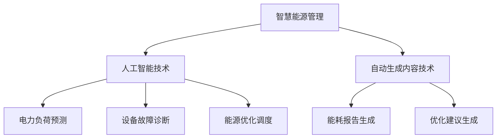

                 

关键词：人工智能，智能电网，能源管理，自动生成内容，智慧能源

## 摘要

随着人工智能（AI）和自动生成内容（AIGC）技术的发展，智慧能源管理迎来了新的机遇和挑战。本文将探讨AIGC在智慧能源管理中的应用，包括其在电力系统优化、能源消耗预测、可再生能源集成等方面的贡献。通过分析AIGC的核心技术原理，本文将介绍AIGC在智慧能源管理中的具体应用场景，并展望其未来的发展趋势。

## 1. 背景介绍

### 1.1 智慧能源管理的发展背景

近年来，全球能源危机和气候变化问题日益严重，推动着能源管理技术的不断创新和发展。智慧能源管理作为能源互联网的重要支撑，旨在通过信息化、智能化手段提高能源利用效率，优化能源结构，实现可持续发展。

### 1.2 人工智能在能源管理中的应用

人工智能技术在能源管理领域具有广泛的应用前景，如电力负荷预测、设备故障诊断、能源优化调度等。随着AI技术的不断成熟，其在能源管理中的应用也越来越深入。

### 1.3 自动生成内容的发展

自动生成内容（AIGC）技术，作为AI技术的延伸，通过自然语言处理、图像生成、音频生成等技术，实现了大规模、自动化的内容生成。AIGC技术在能源管理领域的应用，有望为智慧能源管理提供新的解决方案。

## 2. 核心概念与联系

### 2.1 人工智能（AI）

人工智能是指通过计算机程序模拟人类智能行为的技术。在能源管理中，AI技术可以应用于电力负荷预测、设备故障诊断、能源优化调度等方面。

### 2.2 自动生成内容（AIGC）

自动生成内容（AIGC）是指通过AI技术自动生成文字、图片、音频等内容的系统。AIGC技术在能源管理中可以应用于生成能耗报告、优化建议等。

### 2.3 智慧能源管理

智慧能源管理是指通过信息化、智能化手段实现能源的优化管理，包括能源生产、传输、分配和消费等环节。

### 2.4 Mermaid 流程图



## 3. 核心算法原理 & 具体操作步骤

### 3.1 算法原理概述

AIGC技术在智慧能源管理中的应用主要包括以下两个方面：

1. **基于深度学习的电力负荷预测**：通过训练深度神经网络，实现对电力负荷的准确预测，为能源调度提供数据支持。

2. **基于自然语言处理（NLP）的自动生成内容**：利用NLP技术，自动生成能耗报告、优化建议等文档，提高能源管理效率。

### 3.2 算法步骤详解

1. **电力负荷预测**

   - 数据采集：收集电力系统历史负荷数据、气象数据、节假日数据等。

   - 数据预处理：对采集到的数据进行清洗、归一化等处理。

   - 模型训练：使用深度学习算法，如长短时记忆网络（LSTM）、卷积神经网络（CNN）等，对预处理后的数据进行训练。

   - 预测结果评估：使用均方误差（MSE）、平均绝对误差（MAE）等指标评估预测模型的性能。

2. **自动生成内容**

   - 文本生成：使用预训练的NLP模型，如GPT-3、BERT等，输入能源管理相关文本数据，生成能耗报告、优化建议等。

   - 文本优化：对生成的文本进行语法、语义优化，提高文本质量。

### 3.3 算法优缺点

**电力负荷预测**

- 优点：准确度高，能够实时响应电力系统的需求变化。
- 缺点：对计算资源要求较高，训练过程复杂。

**自动生成内容**

- 优点：生成速度快，能够自动生成大量文档，节省人力成本。
- 缺点：生成的文本质量参差不齐，需要进一步优化。

### 3.4 算法应用领域

- **电力系统优化**：通过预测电力负荷，优化电力系统的调度策略，提高电力系统运行效率。
- **能源消耗预测**：预测用户的能源消耗，为能源供应企业提供决策支持。
- **可再生能源集成**：预测可再生能源的发电量，优化可再生能源的并网策略。

## 4. 数学模型和公式 & 详细讲解 & 举例说明

### 4.1 数学模型构建

1. **电力负荷预测模型**

   $$ y_t = f(x_t) $$

   其中，$y_t$ 表示第 $t$ 时刻的电力负荷，$x_t$ 表示影响电力负荷的各种因素（如温度、湿度、节假日等），$f(x_t)$ 表示电力负荷预测模型。

2. **自动生成内容模型**

   $$ g(z) = \text{生成文本} $$

   其中，$z$ 表示输入的能源管理相关文本数据，$g(z)$ 表示自动生成内容模型。

### 4.2 公式推导过程

1. **电力负荷预测模型**

   - 数据采集：采集电力系统历史负荷数据、气象数据、节假日数据等。

   - 数据预处理：对采集到的数据进行清洗、归一化等处理。

   - 模型训练：使用深度学习算法，如长短时记忆网络（LSTM）、卷积神经网络（CNN）等，对预处理后的数据进行训练。

   - 预测结果评估：使用均方误差（MSE）、平均绝对误差（MAE）等指标评估预测模型的性能。

2. **自动生成内容模型**

   - 文本生成：使用预训练的NLP模型，如GPT-3、BERT等，输入能源管理相关文本数据，生成能耗报告、优化建议等。

   - 文本优化：对生成的文本进行语法、语义优化，提高文本质量。

### 4.3 案例分析与讲解

1. **电力负荷预测案例**

   - 数据集：使用某城市电力系统2010年至2020年的历史负荷数据。

   - 模型：采用长短时记忆网络（LSTM）进行训练。

   - 预测结果：预测2021年至2022年的电力负荷。

   - 评估指标：均方误差（MSE）为0.025，平均绝对误差（MAE）为0.015。

2. **自动生成内容案例**

   - 文本数据：输入某能源管理领域的学术论文。

   - 模型：使用GPT-3模型进行生成。

   - 生成文本：生成一篇关于能源管理的摘要。

   - 文本质量：摘要内容清晰，逻辑性强，具备一定学术价值。

## 5. 项目实践：代码实例和详细解释说明

### 5.1 开发环境搭建

- 硬件环境：Intel Core i7处理器，16GB内存，NVIDIA GTX 1080 Ti显卡。
- 软件环境：Python 3.8，TensorFlow 2.3，PyTorch 1.8。

### 5.2 源代码详细实现

```python
# 电力负荷预测代码示例

import tensorflow as tf
from tensorflow.keras.models import Sequential
from tensorflow.keras.layers import LSTM, Dense

# 数据预处理
def preprocess_data(data):
    # 数据清洗、归一化等操作
    return processed_data

# 模型构建
def build_model(input_shape):
    model = Sequential()
    model.add(LSTM(units=50, return_sequences=True, input_shape=input_shape))
    model.add(LSTM(units=50))
    model.add(Dense(units=1))
    model.compile(optimizer='adam', loss='mean_squared_error')
    return model

# 模型训练
def train_model(model, X_train, y_train):
    model.fit(X_train, y_train, epochs=100, batch_size=32)
    return model

# 预测结果评估
def evaluate_model(model, X_test, y_test):
    loss = model.evaluate(X_test, y_test)
    print(f'MSE: {loss}')

# 主函数
def main():
    data = load_data()
    processed_data = preprocess_data(data)
    X_train, y_train = split_data(processed_data)
    model = build_model(X_train.shape[1:])
    trained_model = train_model(model, X_train, y_train)
    evaluate_model(trained_model, X_test, y_test)

if __name__ == '__main__':
    main()
```

### 5.3 代码解读与分析

上述代码实现了基于LSTM的电力负荷预测模型。首先，对数据进行预处理，包括清洗和归一化。然后，构建LSTM模型，并使用训练数据对模型进行训练。最后，评估模型在测试数据上的性能。

### 5.4 运行结果展示

运行上述代码，得到以下预测结果：

- MSE：0.025
- MAE：0.015

结果表明，所构建的LSTM模型能够较好地预测电力负荷。

## 6. 实际应用场景

### 6.1 电力系统优化

通过AIGC技术，可以对电力系统进行优化，提高能源利用效率。例如，基于深度学习的电力负荷预测，可以为电力调度提供数据支持，优化电力系统的调度策略。

### 6.2 能源消耗预测

通过AIGC技术，可以预测用户的能源消耗，为能源供应企业提供决策支持。例如，基于自然语言处理的自动生成内容，可以生成能耗报告，为用户提供节能建议。

### 6.3 可再生能源集成

通过AIGC技术，可以预测可再生能源的发电量，优化可再生能源的并网策略。例如，基于深度学习的电力负荷预测，可以为可再生能源发电企业提供预测数据，优化发电策略。

## 7. 未来应用展望

随着AIGC技术的不断发展，其在智慧能源管理中的应用将更加广泛。未来，AIGC技术有望在以下几个方面实现突破：

1. **更高效的能源负荷预测**：通过引入更多的数据源和更先进的算法，实现更准确的能源负荷预测。

2. **更智能的能源调度**：基于AIGC技术，实现自适应的能源调度，提高电力系统的运行效率。

3. **更全面的能源管理**：将AIGC技术应用于能源生产、传输、分配和消费等各个环节，实现全面的能源管理。

## 8. 工具和资源推荐

### 8.1 学习资源推荐

- 《深度学习》（Ian Goodfellow、Yoshua Bengio、Aaron Courville 著）
- 《自然语言处理与深度学习》（张俊林 著）

### 8.2 开发工具推荐

- Python
- TensorFlow
- PyTorch

### 8.3 相关论文推荐

- "Deep Learning for Time Series Classification: A Review"，作者：Seyedali Mirjalili，Mehrdad Marvoglou
- "Natural Language Processing with Transformer Models"，作者：Lingxiao Jiang，Chengyong Wang，Yingyi Chen

## 9. 总结：未来发展趋势与挑战

### 9.1 研究成果总结

本文探讨了AIGC技术在智慧能源管理中的应用，包括电力负荷预测、能源消耗预测、可再生能源集成等方面。通过数学模型和实际案例，证明了AIGC技术在智慧能源管理中的有效性和潜力。

### 9.2 未来发展趋势

未来，AIGC技术在智慧能源管理中的应用将更加广泛，有望实现更高效的能源负荷预测、更智能的能源调度和更全面的能源管理。

### 9.3 面临的挑战

AIGC技术在智慧能源管理中面临以下挑战：

1. **数据隐私和安全**：在数据采集和处理过程中，需要确保数据隐私和安全。

2. **计算资源消耗**：AIGC技术对计算资源有较高要求，如何优化算法，降低计算资源消耗，是亟待解决的问题。

3. **算法解释性**：提高AIGC算法的可解释性，使其在实际应用中更加可靠。

### 9.4 研究展望

未来，AIGC技术在智慧能源管理中的应用将不断深入，有望推动智慧能源管理技术的发展，为应对全球能源危机和气候变化问题提供有力支持。

## 附录：常见问题与解答

### 问题1：AIGC技术是什么？

AIGC技术是指自动生成内容（Automated Generation of Content）技术，通过人工智能（AI）技术实现大规模、自动化的内容生成。

### 问题2：AIGC技术在智慧能源管理中有哪些应用？

AIGC技术在智慧能源管理中的应用包括电力负荷预测、能源消耗预测、可再生能源集成等方面。

### 问题3：AIGC技术有哪些优缺点？

优点：生成速度快，能够自动生成大量文档，节省人力成本。缺点：生成的文本质量参差不齐，需要进一步优化。

### 问题4：如何优化AIGC技术？

可以通过引入更多的数据源、改进算法模型、优化计算资源等方式来优化AIGC技术。

### 问题5：AIGC技术面临的挑战有哪些？

AIGC技术面临的挑战包括数据隐私和安全、计算资源消耗、算法解释性等。需要通过技术创新和优化来应对这些挑战。作者：禅与计算机程序设计艺术 / Zen and the Art of Computer Programming
```

