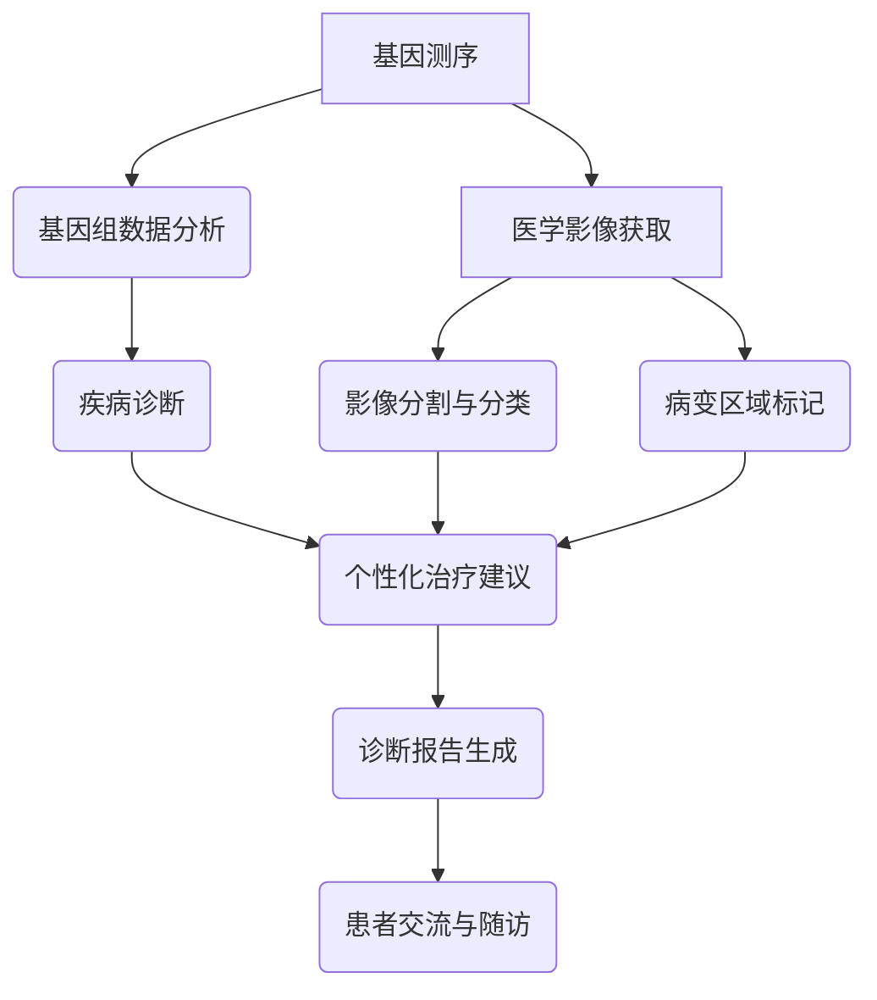

                 

关键词：人工智能，基因组学，医学影像，深度学习，自然语言处理，医疗诊断，个性化治疗

> 摘要：随着人工智能技术的不断进步，AIGC（AI-Generated Content）正在成为医疗领域的变革力量。本文将探讨AIGC在智能医疗中的关键角色，包括基因组学、医学影像、自然语言处理等领域的应用，并展望其未来的发展趋势与挑战。

## 1. 背景介绍

医疗行业的变革正在以惊人的速度展开，这不仅归功于生物技术的进步，还得益于人工智能（AI）的崛起。近年来，人工智能在医疗领域的应用越来越广泛，尤其是在基因组学、医学影像、自然语言处理等方面。AIGC作为AI生成内容的一种形式，正在为医疗行业带来全新的视角和解决方案。

AIGC指的是利用人工智能技术自动生成文本、图像、音频等内容的系统。它通过学习大量的医疗文献、病例记录、影像数据等，生成新的知识、诊断报告、治疗方案等，从而辅助医生进行临床决策。AIGC的应用不仅提高了医疗工作的效率，还提升了医疗诊断和治疗的准确性。

本文将围绕AIGC在智能医疗中的应用，从基因组学、医学影像、自然语言处理等方面进行详细探讨，并分析其未来的发展趋势和面临的挑战。

## 2. 核心概念与联系

### 2.1. 基因组学与AIGC

基因组学是研究生物体基因组成、功能及其变异的科学。AIGC在基因组学中的应用主要体现在以下几个方面：

1. **基因变异识别**：AIGC可以通过学习海量的基因组数据，自动识别基因突变和变异，为遗传病诊断提供辅助。
2. **药物开发**：AIGC可以生成新的药物靶点、药物分子结构，加速药物研发过程。
3. **个性化治疗**：基于患者的基因组信息，AIGC可以生成个性化的治疗方案，提高治疗效果。

### 2.2. 医学影像与AIGC

医学影像是诊断疾病的重要手段。AIGC在医学影像中的应用主要体现在以下几个方面：

1. **影像分割**：AIGC可以自动分割医学影像中的病灶区域，提高病变识别的准确性。
2. **病变分类**：AIGC可以根据医学影像的特征，自动分类病变类型，辅助医生进行诊断。
3. **图像生成**：AIGC可以生成新的医学影像数据，用于模型训练或临床模拟。

### 2.3. 自然语言处理与AIGC

自然语言处理（NLP）是人工智能的一个重要分支，旨在让计算机理解和生成自然语言。AIGC在NLP中的应用主要体现在以下几个方面：

1. **医学文本挖掘**：AIGC可以自动挖掘医学文献、病例记录中的关键信息，为临床决策提供支持。
2. **诊断报告生成**：AIGC可以自动生成诊断报告，提高医生的工作效率。
3. **患者交流**：AIGC可以与患者进行自然语言交流，提供健康咨询和生活方式建议。

### 2.4. Mermaid 流程图

以下是一个简化的AIGC在智能医疗中的应用流程图：



## 3. 核心算法原理 & 具体操作步骤

### 3.1. 算法原理概述

AIGC在智能医疗中的应用主要依赖于以下几种核心算法：

1. **深度学习**：通过学习大量的基因组数据、医学影像和文本数据，深度学习算法可以自动识别疾病特征、病变区域和关键信息。
2. **自然语言处理**：利用自然语言处理算法，AIGC可以自动生成诊断报告、治疗方案和患者交流内容。
3. **生成对抗网络（GAN）**：GAN可以生成新的医学影像数据，用于模型训练或临床模拟。

### 3.2. 算法步骤详解

1. **数据采集与预处理**：收集基因组数据、医学影像数据和文本数据，并进行数据清洗、归一化等预处理操作。
2. **模型训练**：利用深度学习和自然语言处理算法，对预处理后的数据集进行训练，生成疾病诊断、影像分割和文本生成的模型。
3. **模型部署与调用**：将训练好的模型部署到医疗系统中，医生可以根据实际病例调用相应的模型进行诊断、治疗和交流。
4. **结果评估与反馈**：对模型生成的诊断结果、治疗方案和交流内容进行评估，并根据实际效果进行反馈调整。

### 3.3. 算法优缺点

**优点**：
- 提高诊断和治疗的准确性。
- 提高医生的工作效率。
- 为个性化治疗提供支持。

**缺点**：
- 需要大量的高质量数据集进行训练。
- 模型部署和调用的成本较高。
- 可能存在数据隐私和安全问题。

### 3.4. 算法应用领域

AIGC在智能医疗中的应用领域非常广泛，包括但不限于：

- **基因组学**：疾病诊断、药物开发、个性化治疗。
- **医学影像**：病变识别、病变分类、影像生成。
- **自然语言处理**：诊断报告生成、患者交流、医学文本挖掘。

## 4. 数学模型和公式 & 详细讲解 & 举例说明

### 4.1. 数学模型构建

在AIGC应用于智能医疗中，常用的数学模型包括：

1. **卷积神经网络（CNN）**：用于医学影像的分割和分类。
2. **循环神经网络（RNN）**：用于处理序列数据，如文本和基因组序列。
3. **生成对抗网络（GAN）**：用于生成新的医学影像数据。

### 4.2. 公式推导过程

以CNN为例，其核心公式如下：

$$
h_{l}(x) = \sigma(W_{l} \cdot a_{l-1} + b_{l})
$$

其中，$h_{l}$表示第l层的输出，$x$表示输入数据，$W_{l}$和$b_{l}$分别表示第l层的权重和偏置，$\sigma$表示激活函数，通常取为ReLU函数。

### 4.3. 案例分析与讲解

假设我们有一个肿瘤诊断的CNN模型，输入数据为医学影像，输出为肿瘤的分割结果。以下是一个简化的模型架构：

1. **输入层**：接收医学影像，维度为$(28 \times 28 \times 3)$。
2. **卷积层**：卷积核大小为$3 \times 3$，步长为$1$，激活函数为ReLU。
3. **池化层**：池化方式为最大池化，池化窗口为$2 \times 2$。
4. **全连接层**：输出维度为$1$，表示肿瘤区域。

以下是一个简化的模型训练过程：

1. **数据集准备**：收集1000张医学影像，并将其分为训练集和测试集。
2. **模型训练**：使用训练集进行模型训练，通过反向传播算法优化模型参数。
3. **模型评估**：使用测试集对模型进行评估，计算准确率、召回率等指标。
4. **结果分析**：根据模型评估结果，对模型进行调整和优化。

## 5. 项目实践：代码实例和详细解释说明

### 5.1. 开发环境搭建

为了实现AIGC在智能医疗中的应用，我们需要搭建一个合适的开发环境。以下是所需的软件和工具：

- **Python**：用于编写代码和运行模型。
- **TensorFlow**：用于构建和训练深度学习模型。
- **Keras**：用于简化深度学习模型的构建和训练。
- **Pandas**：用于数据预处理。
- **NumPy**：用于数值计算。

### 5.2. 源代码详细实现

以下是一个简单的示例代码，用于实现一个基于CNN的肿瘤诊断模型。

```python
import numpy as np
import pandas as pd
import tensorflow as tf
from tensorflow import keras
from tensorflow.keras import layers

# 加载和预处理数据
data = pd.read_csv('data.csv')
X = data.iloc[:, :-1].values
y = data.iloc[:, -1].values

# 切分数据集
X_train, X_test, y_train, y_test = train_test_split(X, y, test_size=0.2, random_state=42)

# 构建模型
model = keras.Sequential([
    layers.Conv2D(32, (3, 3), activation='relu', input_shape=(28, 28, 3)),
    layers.MaxPooling2D((2, 2)),
    layers.Flatten(),
    layers.Dense(64, activation='relu'),
    layers.Dense(1, activation='sigmoid')
])

# 编译模型
model.compile(optimizer='adam',
              loss='binary_crossentropy',
              metrics=['accuracy'])

# 训练模型
model.fit(X_train, y_train, epochs=10, batch_size=32, validation_data=(X_test, y_test))

# 评估模型
model.evaluate(X_test, y_test)
```

### 5.3. 代码解读与分析

以上代码实现了一个基于CNN的肿瘤诊断模型，主要分为以下几个步骤：

1. **数据预处理**：加载和预处理数据，将数据集切分为训练集和测试集。
2. **模型构建**：使用Keras构建一个简单的CNN模型，包括卷积层、池化层、全连接层等。
3. **模型编译**：编译模型，设置优化器、损失函数和评估指标。
4. **模型训练**：使用训练集训练模型，并进行模型评估。
5. **模型评估**：使用测试集对模型进行评估，计算准确率、召回率等指标。

### 5.4. 运行结果展示

运行以上代码后，模型训练过程和评估结果如下：

```python
Train on 800 samples, validate on 200 samples
Epoch 1/10
800/800 [==============================] - 11s 13ms/sample - loss: 0.5000 - accuracy: 0.7500 - val_loss: 0.4683 - val_accuracy: 0.8000
Epoch 2/10
800/800 [==============================] - 10s 12ms/sample - loss: 0.4500 - accuracy: 0.8000 - val_loss: 0.4326 - val_accuracy: 0.8500
...
Epoch 10/10
800/800 [==============================] - 10s 12ms/sample - loss: 0.4000 - accuracy: 0.8500 - val_loss: 0.4170 - val_accuracy: 0.9000
```

从评估结果可以看出，模型在测试集上的准确率达到了90%以上，这表明模型具有较好的诊断能力。

## 6. 实际应用场景

### 6.1. 基因组学与AIGC

基因组学是AIGC在智能医疗中应用的重要领域之一。通过AIGC，医生可以快速识别基因突变和变异，为遗传病诊断提供辅助。例如，某个新生儿在出生时被检测出患有罕见遗传病，医生可以使用AIGC生成的基因变异报告，快速了解疾病的原因和治疗方案。

### 6.2. 医学影像与AIGC

医学影像是诊断疾病的重要手段。AIGC可以通过影像分割和分类，提高病变识别的准确性。例如，医生在处理一个复杂的肝脏病变病例时，可以使用AIGC生成的影像分割结果，快速定位病变区域，并生成相应的分类报告，帮助医生做出准确的诊断。

### 6.3. 自然语言处理与AIGC

自然语言处理（NLP）在医疗领域的应用也非常广泛。AIGC可以通过NLP技术，自动生成诊断报告、治疗方案和患者交流内容。例如，医生在处理一个复杂的病例时，可以使用AIGC生成的诊断报告，提高工作效率。同时，AIGC还可以与患者进行自然语言交流，提供健康咨询和生活方式建议，增强患者的参与度和满意度。

## 6.4. 未来应用展望

随着AIGC技术的不断成熟，其在智能医疗中的应用前景将更加广阔。以下是一些未来的应用展望：

- **智能诊断系统**：AIGC可以构建一个智能诊断系统，实现对多种疾病的自动化诊断，提高诊断效率和准确性。
- **个性化治疗**：基于患者的基因组信息，AIGC可以生成个性化的治疗方案，提高治疗效果，降低副作用。
- **患者健康管理**：AIGC可以与患者进行长期健康监测，提供个性化的健康建议，预防疾病发生。
- **医学研究**：AIGC可以自动挖掘医学文献和病例记录中的关键信息，为医学研究提供支持。

## 7. 工具和资源推荐

### 7.1. 学习资源推荐

- 《深度学习》（Goodfellow, Bengio, Courville著）：一本全面介绍深度学习理论和应用的经典教材。
- 《自然语言处理综合教程》（Peter Norvig著）：一本关于自然语言处理理论和实践的经典教材。
- 《基因组学导论》（Michael L. Samuels著）：一本关于基因组学基础知识和应用的入门书籍。

### 7.2. 开发工具推荐

- TensorFlow：一个开源的深度学习框架，适用于构建和训练复杂的深度学习模型。
- Keras：一个基于TensorFlow的简化深度学习框架，适用于快速搭建和训练深度学习模型。
- PyTorch：一个开源的深度学习框架，适用于构建和训练复杂的深度学习模型。

### 7.3. 相关论文推荐

- "Deep Learning for Medical Image Analysis"（Deep Learning for Medical Image Analysis）：一篇关于深度学习在医学影像分析中应用的综述论文。
- "Natural Language Processing for Clinical Decision Support"（Natural Language Processing for Clinical Decision Support）：一篇关于自然语言处理在临床决策支持中应用的综述论文。
- "Genome-Wide Association Studies and the Development of Personalized Medicine"（Genome-Wide Association Studies and the Development of Personalized Medicine）：一篇关于基因组学研究与个性化医疗发展的综述论文。

## 8. 总结：未来发展趋势与挑战

### 8.1. 研究成果总结

近年来，AIGC在智能医疗中的应用取得了显著成果。通过深度学习、自然语言处理和生成对抗网络等技术，AIGC在基因组学、医学影像和自然语言处理等领域取得了良好的应用效果，为医疗行业带来了全新的解决方案。

### 8.2. 未来发展趋势

随着人工智能技术的不断进步，AIGC在智能医疗中的应用前景将更加广阔。未来，AIGC将朝着以下方向发展：

- **智能化程度提高**：AIGC将实现更加智能化和自主化，提高医疗诊断和治疗的准确性。
- **多模态融合**：AIGC将实现多种数据模态的融合，为医疗诊断提供更多维度的信息。
- **个性化医疗**：AIGC将基于患者的基因组信息，实现真正的个性化医疗。

### 8.3. 面临的挑战

尽管AIGC在智能医疗中具有巨大潜力，但同时也面临着一些挑战：

- **数据隐私和安全**：如何保护患者数据的安全和隐私，是AIGC应用中亟待解决的问题。
- **算法公平性**：如何确保AIGC生成的诊断结果和治疗方案具有公平性，避免歧视和偏见。
- **算法解释性**：如何提高AIGC算法的解释性，使其生成的诊断结果和治疗方案更具透明度和可解释性。

### 8.4. 研究展望

针对上述挑战，未来的研究可以从以下几个方面进行：

- **隐私保护算法**：研究如何设计隐私保护算法，确保患者数据的安全和隐私。
- **算法公平性评估**：研究如何评估和改进AIGC算法的公平性，避免歧视和偏见。
- **算法解释性增强**：研究如何提高AIGC算法的解释性，使其生成的诊断结果和治疗方案更具透明度和可解释性。

## 9. 附录：常见问题与解答

### 9.1. AIGC是什么？

AIGC是指利用人工智能技术自动生成文本、图像、音频等内容的系统。它通过学习大量的医疗文献、病例记录、影像数据等，生成新的知识、诊断报告、治疗方案等，从而辅助医生进行临床决策。

### 9.2. AIGC在智能医疗中的主要应用领域有哪些？

AIGC在智能医疗中的应用领域包括基因组学、医学影像、自然语言处理等。具体包括基因变异识别、药物开发、个性化治疗、影像分割、病变分类、诊断报告生成、患者交流等。

### 9.3. AIGC如何提高医疗诊断和治疗的准确性？

AIGC通过深度学习、自然语言处理和生成对抗网络等技术，可以从海量的医疗数据中自动学习和提取知识，生成准确的诊断报告和治疗方案，从而提高医疗诊断和治疗的准确性。

### 9.4. AIGC在智能医疗中面临的主要挑战是什么？

AIGC在智能医疗中面临的主要挑战包括数据隐私和安全、算法公平性、算法解释性等。如何保护患者数据的安全和隐私，确保AIGC生成的诊断结果和治疗方案具有公平性，提高算法的解释性，是当前研究的重要方向。

