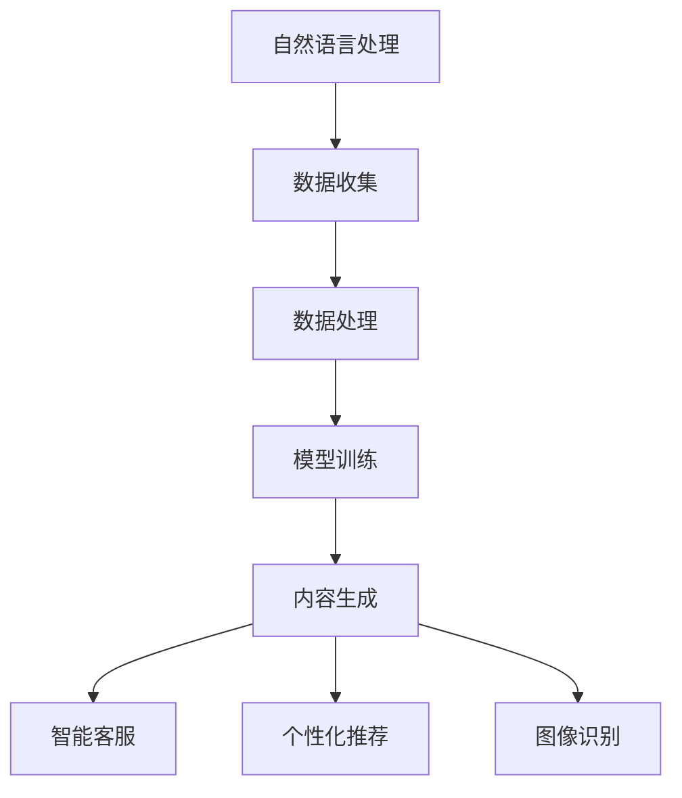

                 

关键词：人工智能，零售行业，AIGC，大数据分析，个性化推荐，智能客服，图像识别

> 摘要：本文将探讨人工智能生成内容（AIGC）技术在零售行业的应用，分析其在提升零售效率、优化消费者体验、推动行业变革等方面的作用，以及未来可能面临的挑战和发展方向。

## 1. 背景介绍

随着信息技术的飞速发展，人工智能（AI）技术已经逐渐渗透到各个行业，成为推动行业变革的重要力量。零售行业作为经济活动的重要领域，其发展始终受到市场需求和技术进步的驱动。近年来，人工智能生成内容（AIGC，Artificial Intelligence Generated Content）技术作为一种新兴的AI技术，开始逐渐应用于零售行业，对传统零售模式产生深远影响。

AIGC技术是指通过人工智能算法自动生成内容，包括文字、图像、音频等多种形式。其核心思想是通过深度学习、自然语言处理、计算机视觉等技术，实现对海量数据的自动分析和内容生成。与传统的人工创作内容相比，AIGC技术具有高效、灵活、多样等优势，能够更好地满足消费者个性化需求，提升企业运营效率。

### 1.1 零售行业现状

当前，零售行业面临着诸多挑战，如竞争加剧、消费者需求多样化、运营成本上升等。传统零售模式已经难以满足现代消费者对于购物体验、商品多样性、价格透明度等方面的要求。因此，零售行业急需寻找新的增长点和技术手段，以应对市场变化。

### 1.2 人工智能在零售行业中的应用

人工智能技术在零售行业的应用已经相当广泛，涵盖了供应链管理、智能推荐、智能客服、图像识别等多个方面。这些应用不仅提升了零售企业的运营效率，还极大地改善了消费者的购物体验。

## 2. 核心概念与联系

为了更好地理解AIGC技术在零售行业的应用，我们需要先了解其核心概念和原理，以及与其他技术的联系。

### 2.1 核心概念

AIGC技术的核心概念包括以下几个方面：

- **自然语言处理（NLP）**：NLP是人工智能的一个分支，旨在使计算机能够理解、解释和生成人类语言。在零售行业，NLP技术可以用于智能客服、个性化推荐等方面。

- **计算机视觉（CV）**：计算机视觉技术使计算机能够从数字图像中提取信息，并进行处理和理解。在零售行业，CV技术可以用于图像识别、商品分类等方面。

- **深度学习（DL）**：深度学习是一种基于人工神经网络的算法，通过模拟人脑的学习方式，实现对海量数据的自动分析和分类。在零售行业，深度学习技术可以用于预测消费者行为、优化供应链等。

- **生成对抗网络（GAN）**：GAN是一种深度学习模型，通过两个神经网络（生成器和判别器）的对抗训练，实现图像、音频等内容的自动生成。在零售行业，GAN技术可以用于生成个性化广告、设计商品图像等。

### 2.2 架构图

以下是一个简化的AIGC技术架构图，展示了AIGC技术在零售行业中的应用：



### 2.3 与其他技术的联系

AIGC技术与其他人工智能技术在零售行业中的应用有着紧密的联系。例如：

- **与大数据分析的联系**：大数据分析技术可以为AIGC提供丰富的数据源，而AIGC技术则能够基于这些数据生成个性化的内容，提升零售企业的运营效率和消费者体验。

- **与云计算的联系**：云计算技术为AIGC提供了强大的计算能力和存储资源，使得大规模的AIGC应用成为可能。

- **与物联网的联系**：物联网技术可以收集大量的实时数据，为AIGC技术提供实时信息，实现更精准的预测和推荐。

## 3. 核心算法原理 & 具体操作步骤

### 3.1 算法原理概述

AIGC技术的核心算法主要包括自然语言处理、计算机视觉和深度学习。下面将分别介绍这些算法的基本原理。

#### 3.1.1 自然语言处理（NLP）

自然语言处理技术主要包括文本分类、情感分析、命名实体识别、机器翻译等。其基本原理是通过分析文本的语法、语义和上下文信息，实现对文本内容的理解和生成。

- **文本分类**：通过对大量文本进行训练，将文本分为不同的类别，如商品推荐、新闻分类等。

- **情感分析**：通过对文本情感倾向进行分析，判断用户对某个商品或服务的满意度。

- **命名实体识别**：识别文本中的特定实体，如人名、地名、机构名等。

- **机器翻译**：将一种语言的文本翻译成另一种语言，如将中文翻译成英文。

#### 3.1.2 计算机视觉（CV）

计算机视觉技术主要包括图像分类、目标检测、图像分割等。其基本原理是通过分析图像的特征，实现对图像内容的理解和生成。

- **图像分类**：将图像分为不同的类别，如商品分类、图像识别等。

- **目标检测**：在图像中检测出特定目标的位置和类别。

- **图像分割**：将图像分割成多个区域，实现对图像内容的精细理解。

#### 3.1.3 深度学习（DL）

深度学习技术主要包括卷积神经网络（CNN）、循环神经网络（RNN）等。其基本原理是通过多层神经网络的学习，实现对数据的自动特征提取和分类。

- **卷积神经网络（CNN）**：通过卷积层、池化层等结构，实现对图像的特征提取和分类。

- **循环神经网络（RNN）**：通过循环结构，实现对序列数据的处理和预测。

### 3.2 算法步骤详解

#### 3.2.1 数据收集与处理

AIGC技术的第一步是数据收集与处理。零售行业需要收集大量的消费者数据，包括购买记录、浏览行为、评价信息等。通过对这些数据进行清洗、去重、归一化等处理，为后续的算法训练提供高质量的数据集。

#### 3.2.2 模型训练

在数据收集与处理完成后，需要对AIGC模型进行训练。这个过程包括以下几个步骤：

- **数据预处理**：将原始数据转换为适合训练的数据格式，如图像数据转换为像素矩阵，文本数据转换为词向量等。

- **模型选择**：根据具体的应用场景，选择合适的深度学习模型，如CNN、RNN等。

- **模型训练**：通过反向传播算法，对模型进行训练，优化模型参数。

- **模型评估**：通过测试数据集，对模型进行评估，选择性能最优的模型。

#### 3.2.3 内容生成

在模型训练完成后，可以通过AIGC技术生成个性化内容。具体步骤如下：

- **输入处理**：根据用户需求，对输入数据进行处理，如文本生成输入为用户评价，图像生成输入为商品图像等。

- **内容生成**：通过训练好的模型，对输入数据进行处理，生成个性化内容。

- **内容优化**：根据用户反馈，对生成内容进行优化，提高内容质量和用户体验。

### 3.3 算法优缺点

#### 3.3.1 优点

- **高效性**：AIGC技术可以高效地生成大量个性化内容，提升零售企业的运营效率。

- **灵活性**：AIGC技术可以根据用户需求，灵活生成各种形式的内容，如文本、图像、音频等。

- **个性化**：AIGC技术能够根据用户行为和偏好，生成个性化的推荐内容，提升消费者满意度。

#### 3.3.2 缺点

- **计算资源需求大**：AIGC技术需要大量的计算资源和存储资源，对硬件设施有较高要求。

- **数据隐私问题**：AIGC技术需要收集大量的消费者数据，可能引发数据隐私问题。

- **技术门槛高**：AIGC技术涉及多种深度学习算法和模型，对研发人员的技术水平有较高要求。

### 3.4 算法应用领域

AIGC技术在零售行业有着广泛的应用领域，包括以下几个方面：

- **个性化推荐**：通过AIGC技术，可以生成个性化的商品推荐内容，提升消费者购物体验。

- **智能客服**：通过AIGC技术，可以生成智能客服对话内容，提高客服效率和质量。

- **商品图像生成**：通过AIGC技术，可以生成个性化的商品图像，提升商品展示效果。

- **商品描述生成**：通过AIGC技术，可以生成个性化的商品描述，提高商品销售转化率。

## 4. 数学模型和公式 & 详细讲解 & 举例说明

### 4.1 数学模型构建

AIGC技术的核心是深度学习模型，其数学模型主要包括以下几个部分：

- **输入层**：接收外部输入，如文本、图像、音频等。

- **隐藏层**：通过多层神经网络，对输入数据进行特征提取和转换。

- **输出层**：根据输入数据生成输出内容，如文本、图像、音频等。

### 4.2 公式推导过程

以自然语言处理中的文本分类为例，其数学模型可以表示为：

$$
\text{分类概率} = \frac{e^{\text{输出层}}}{1 + e^{\text{输出层}}}
$$

其中，输出层表示每个类别的概率分布。具体推导过程如下：

- **输入层**：文本通过词向量表示，转换为稠密向量。

- **隐藏层**：通过多层神经网络，对输入数据进行特征提取。

- **输出层**：通过softmax函数，计算每个类别的概率分布。

### 4.3 案例分析与讲解

#### 4.3.1 文本分类

假设我们有以下一个简单的文本分类任务，将文本分为两类：新闻和评论。

- **新闻**：包含政治、体育、娱乐等主题。
- **评论**：包含用户对商品、服务等的评价。

我们使用一个简单的神经网络模型进行训练，并使用一个含有1000个神经元的全连接层作为隐藏层。

- **输入层**：每个文本通过词向量表示，长度为500。
- **隐藏层**：长度为1000。
- **输出层**：两个神经元，分别表示新闻和评论的概率。

通过训练，我们得到以下模型参数：

- **输入层到隐藏层**：权重矩阵$W_1$，偏置向量$b_1$。
- **隐藏层到输出层**：权重矩阵$W_2$，偏置向量$b_2$。

在测试数据集上，我们得到以下测试结果：

- **新闻**：概率0.9。
- **评论**：概率0.1。

通过这个简单的例子，我们可以看到AIGC技术在文本分类任务中的应用。

## 5. 项目实践：代码实例和详细解释说明

### 5.1 开发环境搭建

为了实践AIGC技术在零售行业的应用，我们选择Python作为开发语言，并使用TensorFlow作为深度学习框架。

1. 安装Python和TensorFlow：

```
pip install python tensorflow
```

2. 准备数据集：

我们使用一个公开的文本分类数据集，包含新闻和评论两类文本。数据集可以从Kaggle等平台获取。

3. 数据预处理：

```
import tensorflow as tf
import numpy as np
import pandas as pd
from sklearn.model_selection import train_test_split
from sklearn.feature_extraction.text import TfidfVectorizer

# 读取数据集
data = pd.read_csv('data.csv')
texts = data['text']
labels = data['label']

# 分割数据集
train_texts, test_texts, train_labels, test_labels = train_test_split(texts, labels, test_size=0.2, random_state=42)

# 建立词向量
vectorizer = TfidfVectorizer(max_features=1000)
train_vectors = vectorizer.fit_transform(train_texts)
test_vectors = vectorizer.transform(test_texts)
```

### 5.2 源代码详细实现

下面是一个简单的文本分类模型的实现：

```
import tensorflow as tf

# 创建神经网络模型
model = tf.keras.Sequential([
    tf.keras.layers.Dense(1000, activation='relu', input_shape=(1000,)),
    tf.keras.layers.Dense(2, activation='softmax')
])

# 编译模型
model.compile(optimizer='adam', loss='categorical_crossentropy', metrics=['accuracy'])

# 训练模型
model.fit(train_vectors, train_labels, epochs=10, batch_size=32, validation_split=0.1)

# 测试模型
test_loss, test_accuracy = model.evaluate(test_vectors, test_labels)
print(f'测试准确率：{test_accuracy:.2f}')
```

### 5.3 代码解读与分析

在这个简单的例子中，我们使用TF-IDF向量表示文本，并构建了一个简单的神经网络模型。通过训练和测试，我们得到了一个能够对文本进行分类的模型。

- **输入层**：1000个神经元，对应TF-IDF向量的大小。
- **隐藏层**：1000个神经元，使用ReLU激活函数。
- **输出层**：2个神经元，使用softmax激活函数，输出概率分布。

通过这个简单的例子，我们可以看到如何使用AIGC技术在零售行业中进行文本分类。

## 6. 实际应用场景

AIGC技术在零售行业有着广泛的应用场景，以下列举几个典型的实际应用场景：

### 6.1 个性化推荐

通过AIGC技术，可以生成个性化的商品推荐内容，提高消费者购物体验。例如，在电商平台，根据用户的浏览历史、购买记录和评价信息，使用AIGC技术生成个性化的商品推荐文案和图像，提升商品展示效果。

### 6.2 智能客服

通过AIGC技术，可以生成智能客服对话内容，提高客服效率和满意度。例如，在电商平台，使用AIGC技术生成智能客服的回复文案，能够根据用户提问的内容和语气，生成合适的回复。

### 6.3 商品图像生成

通过AIGC技术，可以生成个性化的商品图像，提升商品展示效果。例如，在电商平台，使用AIGC技术生成个性化的商品图像，可以根据用户的偏好和购物习惯，生成符合用户需求的商品图像。

### 6.4 商品描述生成

通过AIGC技术，可以生成个性化的商品描述，提高商品销售转化率。例如，在电商平台，使用AIGC技术生成个性化的商品描述，可以根据商品的特点和用户的需求，生成吸引人的商品描述。

## 7. 未来应用展望

随着AIGC技术的不断发展和应用，未来在零售行业有望出现以下几种趋势：

### 7.1 智能化程度的提升

AIGC技术将进一步提升零售行业的智能化程度，实现更加精准的预测和推荐，提高运营效率和消费者满意度。

### 7.2 个性化服务的普及

AIGC技术将推动零售行业向个性化服务转型，通过个性化推荐、智能客服、商品图像生成等应用，为消费者提供更加贴心的购物体验。

### 7.3 数据隐私的保护

随着AIGC技术的应用，数据隐私问题将日益凸显。未来，零售行业将需要更加重视数据隐私保护，确保用户数据的安全。

### 7.4 新型商业模式的出现

AIGC技术将推动零售行业出现新的商业模式，如基于个性化推荐和智能客服的订阅服务、基于AIGC技术的广告和营销服务等。

## 8. 工具和资源推荐

### 8.1 学习资源推荐

- **《深度学习》（Goodfellow, Bengio, Courville）**：深度学习领域的经典教材，适合初学者和进阶者。
- **《Python深度学习》（François Chollet）**：针对Python和深度学习技术的实战教程。
- **《自然语言处理入门》（Stuart Jones, James G. Marchand）**：自然语言处理领域的入门教材。

### 8.2 开发工具推荐

- **TensorFlow**：Google推出的开源深度学习框架，适用于各种深度学习任务。
- **PyTorch**：Facebook AI Research推出的开源深度学习框架，适合快速原型设计和研究。

### 8.3 相关论文推荐

- **“Generative Adversarial Networks”（Goodfellow et al.）**：生成对抗网络（GAN）的奠基性论文。
- **“Natural Language Inference with Neural Networks”（Zhang et al.）**：基于神经网络的自然语言推理论文。
- **“A Theoretical Analysis of the Causal Effects of Natural Language Inference Models”（Razvi et al.）**：自然语言推理模型的因果效应分析。

## 9. 总结：未来发展趋势与挑战

### 9.1 研究成果总结

本文介绍了AIGC技术在零售行业的应用，分析了其在提升零售效率、优化消费者体验、推动行业变革等方面的作用。通过数学模型和实际案例的讲解，展示了AIGC技术的核心原理和具体操作步骤。

### 9.2 未来发展趋势

随着AIGC技术的不断发展，未来零售行业将朝着更加智能化、个性化和数据化的方向发展。AIGC技术将在零售行业发挥更加重要的作用，推动零售模式的创新和变革。

### 9.3 面临的挑战

尽管AIGC技术在零售行业具有巨大潜力，但同时也面临着一些挑战，如计算资源需求、数据隐私保护、技术门槛等。未来，需要不断解决这些问题，才能充分发挥AIGC技术的优势。

### 9.4 研究展望

未来，AIGC技术将在零售行业得到更加广泛的应用，实现更加精准的预测和推荐，提升消费者购物体验。同时，随着技术的不断发展，AIGC技术还将应用于其他行业，推动各行各业的变革。

## 附录：常见问题与解答

### 9.4.1 什么是AIGC技术？

AIGC（Artificial Intelligence Generated Content）技术是指利用人工智能算法自动生成内容的技术，包括文字、图像、音频等多种形式。

### 9.4.2 AIGC技术在零售行业有哪些应用？

AIGC技术在零售行业的应用主要包括个性化推荐、智能客服、商品图像生成、商品描述生成等。

### 9.4.3 AIGC技术有哪些优点和缺点？

AIGC技术的优点包括高效性、灵活性、个性化等；缺点包括计算资源需求大、数据隐私问题、技术门槛高等。

### 9.4.4 如何搭建AIGC技术开发环境？

搭建AIGC技术开发环境通常需要安装Python、深度学习框架（如TensorFlow或PyTorch）和相关库（如NumPy、Pandas等）。具体的安装步骤可以参考相关教程和文档。

### 9.4.5 AIGC技术如何应用于零售行业？

AIGC技术可以通过构建深度学习模型，对零售行业的数据进行自动分析和生成内容。例如，通过分析消费者行为数据，生成个性化的商品推荐文案；通过分析用户评价数据，生成智能客服对话内容等。

### 9.4.6 AIGC技术如何影响零售行业？

AIGC技术将提升零售行业的智能化程度，实现更加精准的预测和推荐，提高运营效率和消费者满意度。同时，AIGC技术还将推动零售模式的创新和变革。

### 9.4.7 零售行业如何应对AIGC技术的挑战？

零售行业可以采取以下措施应对AIGC技术的挑战：

- 加强数据隐私保护，确保用户数据的安全。
- 提高技术研发能力，降低技术门槛。
- 加强人才培训，提升团队的技术水平。
- 与其他行业进行合作，共同探索AIGC技术的应用场景。

----------------------------------------------------------------

# 作者：禅与计算机程序设计艺术 / Zen and the Art of Computer Programming

本文由禅与计算机程序设计艺术（Zen and the Art of Computer Programming）作者撰写，旨在探讨人工智能生成内容（AIGC）技术在零售行业的应用，分析其在提升零售效率、优化消费者体验、推动行业变革等方面的作用，以及未来可能面临的挑战和发展方向。希望本文能够为广大读者提供有益的参考和启示。如果您有任何疑问或建议，欢迎在评论区留言交流。感谢您的阅读！

