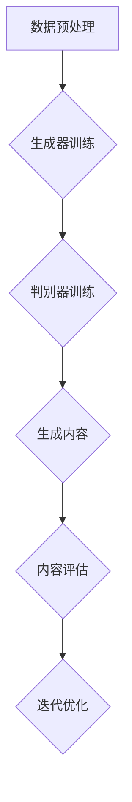

                 

关键词：AIGC模型、公平性、包容性、算法偏见、多元化

> 摘要：本文深入探讨了AIGC（自适应智能生成计算）模型的公平性与包容性。随着人工智能技术的发展，AIGC模型在图像、文本、音频等多媒体内容生成领域取得了显著成果。然而，模型的偏见与不公正问题引起了广泛关注。本文旨在分析AIGC模型中存在的偏见根源，并提出相应的解决方案，以推动AIGC模型的公平性与包容性。

## 1. 背景介绍

### AIGC模型的发展历程

AIGC（Adaptive Intelligent Generation Computing）是一种基于人工智能的自适应生成计算模型，能够根据用户需求生成多样化、个性化的多媒体内容。AIGC模型的发展历程可以追溯到生成对抗网络（GAN）的提出。GAN由Ian Goodfellow等人于2014年提出，是一种通过对抗训练实现数据生成的方法。GAN由生成器（Generator）和判别器（Discriminator）组成，生成器和判别器相互竞争，生成器试图生成尽可能逼真的数据，而判别器则试图区分真实数据和生成数据。

随着研究的深入，AIGC模型逐渐扩展到图像、文本、音频等多媒体领域。例如，生成对抗网络在图像生成领域取得了突破性进展，如图像超分辨率、图像合成、图像修复等。同时，自然语言处理（NLP）领域的预训练模型，如GPT-3、ChatGPT等，也为文本生成提供了强大的能力。此外，基于深度学习的音频生成模型，如WaveNet、Tacotron等，在音频生成领域也取得了显著成果。

### AIGC模型的应用场景

AIGC模型在多个领域展现出了巨大的潜力。以下列举了一些典型的应用场景：

1. **图像生成**：AIGC模型可以用于生成高质量、具有创意的图像，如图像超分辨率、图像合成、图像修复等。

2. **文本生成**：AIGC模型可以用于自动写作、摘要生成、对话系统等，为创作者提供灵感，提高创作效率。

3. **音频生成**：AIGC模型可以用于生成音乐、语音、声音特效等，为娱乐、教育等领域提供丰富的内容。

4. **视频生成**：AIGC模型可以用于视频合成、视频增强等，为影视制作、直播等领域提供技术支持。

5. **个性化推荐**：AIGC模型可以结合用户行为数据，为用户提供个性化的内容推荐。

### AIGC模型的优势与挑战

AIGC模型具有以下几个优势：

1. **生成内容质量高**：AIGC模型能够生成高质量、多样化的多媒体内容，满足用户个性化需求。

2. **自适应性强**：AIGC模型能够根据用户反馈和需求，实时调整生成内容，提高用户体验。

3. **跨媒体融合**：AIGC模型可以实现图像、文本、音频等多媒体内容的生成，推动跨媒体技术的发展。

然而，AIGC模型也面临着一些挑战：

1. **计算资源需求高**：AIGC模型通常需要大量的计算资源，对硬件设备要求较高。

2. **算法复杂性**：AIGC模型的算法设计复杂，需要深入研究。

3. **公平性与包容性**：AIGC模型在生成内容过程中，可能会出现算法偏见，影响公平性与包容性。

## 2. 核心概念与联系

### AIGC模型的基本原理

AIGC模型基于生成对抗网络（GAN）的基本原理。GAN由生成器（Generator）和判别器（Discriminator）组成，生成器试图生成尽可能逼真的数据，而判别器则试图区分真实数据和生成数据。通过对抗训练，生成器和判别器不断优化，最终生成器能够生成高质量的数据。

### AIGC模型的架构

AIGC模型的架构可以分为以下几个部分：

1. **数据预处理**：对输入数据进行预处理，包括数据清洗、数据增强等，以提高模型的泛化能力。

2. **生成器**：生成器负责生成多媒体内容，通常采用深度学习模型，如卷积神经网络（CNN）、循环神经网络（RNN）等。

3. **判别器**：判别器负责区分真实数据和生成数据，通常采用深度学习模型，如卷积神经网络（CNN）、循环神经网络（RNN）等。

4. **损失函数**：损失函数用于衡量生成器和判别器的性能，包括对抗损失、重构损失等。

5. **训练过程**：AIGC模型通过对抗训练，生成器和判别器相互竞争，不断优化，直至生成器能够生成高质量的数据。

### AIGC模型的流程

AIGC模型的流程可以分为以下几个步骤：

1. **数据集准备**：准备包含真实数据和生成数据的训练数据集。

2. **模型训练**：利用生成对抗网络，对生成器和判别器进行训练，通过对抗训练，生成器和判别器不断优化。

3. **生成内容**：利用训练好的模型，生成多媒体内容，包括图像、文本、音频等。

4. **内容评估**：对生成内容进行评估，包括内容质量、多样性、真实性等。

5. **迭代优化**：根据评估结果，对模型进行迭代优化，以提高生成内容的质量。

### Mermaid 流程图



## 3. 核心算法原理 & 具体操作步骤

### 3.1 算法原理概述

AIGC模型的核心算法基于生成对抗网络（GAN）。GAN由生成器（Generator）和判别器（Discriminator）组成，生成器试图生成高质量的数据，而判别器则试图区分真实数据和生成数据。通过对抗训练，生成器和判别器相互竞争，生成器不断优化，最终能够生成高质量的数据。

### 3.2 算法步骤详解

1. **数据集准备**：准备包含真实数据和生成数据的训练数据集。

2. **初始化模型**：初始化生成器和判别器模型，通常采用深度学习模型。

3. **数据预处理**：对输入数据进行预处理，包括数据清洗、数据增强等，以提高模型的泛化能力。

4. **训练过程**：

   a. **生成器训练**：生成器接收噪声数据，通过训练，生成尽可能逼真的数据。

   b. **判别器训练**：判别器接收真实数据和生成数据，通过训练，提高区分真实数据和生成数据的能力。

   c. **对抗训练**：生成器和判别器相互竞争，生成器不断优化，判别器不断调整，直至生成器能够生成高质量的数据。

5. **生成内容**：利用训练好的模型，生成多媒体内容，包括图像、文本、音频等。

6. **内容评估**：对生成内容进行评估，包括内容质量、多样性、真实性等。

7. **迭代优化**：根据评估结果，对模型进行迭代优化，以提高生成内容的质量。

### 3.3 算法优缺点

#### 优点

1. **生成内容质量高**：AIGC模型能够生成高质量、多样化的多媒体内容，满足用户个性化需求。

2. **自适应性强**：AIGC模型能够根据用户反馈和需求，实时调整生成内容，提高用户体验。

3. **跨媒体融合**：AIGC模型可以实现图像、文本、音频等多媒体内容的生成，推动跨媒体技术的发展。

#### 缺点

1. **计算资源需求高**：AIGC模型通常需要大量的计算资源，对硬件设备要求较高。

2. **算法复杂性**：AIGC模型的算法设计复杂，需要深入研究。

3. **公平性与包容性**：AIGC模型在生成内容过程中，可能会出现算法偏见，影响公平性与包容性。

### 3.4 算法应用领域

AIGC模型在多个领域都有广泛的应用，包括但不限于：

1. **图像生成**：如图像超分辨率、图像合成、图像修复等。

2. **文本生成**：如自动写作、摘要生成、对话系统等。

3. **音频生成**：如音乐生成、语音合成、声音特效等。

4. **视频生成**：如视频合成、视频增强等。

5. **个性化推荐**：如根据用户行为数据，为用户提供个性化的内容推荐。

## 4. 数学模型和公式 & 详细讲解 & 举例说明

### 4.1 数学模型构建

AIGC模型基于生成对抗网络（GAN）的基本原理，可以表示为以下数学模型：

$$
\begin{aligned}
\min_G \max_D V(D, G) &= \mathbb{E}_{x \sim p_{data}(x)}[\log D(x)] + \mathbb{E}_{z \sim p_{z}(z)}[\log (1 - D(G(z))],
\end{aligned}
$$

其中，$G$ 表示生成器，$D$ 表示判别器，$x$ 表示真实数据，$z$ 表示噪声数据，$p_{data}(x)$ 表示真实数据分布，$p_{z}(z)$ 表示噪声分布。

### 4.2 公式推导过程

生成对抗网络的推导过程可以分为以下几个步骤：

1. **损失函数的构建**：

   生成器 $G$ 的目标是生成逼真的数据，使得判别器 $D$ 无法区分真实数据和生成数据。因此，生成器的损失函数可以表示为：

   $$
   L_G = \mathbb{E}_{z \sim p_{z}(z)}[\log (1 - D(G(z)))].
   $$

   判别器 $D$ 的目标是区分真实数据和生成数据，使得生成器的损失函数最小。因此，判别器的损失函数可以表示为：

   $$
   L_D = \mathbb{E}_{x \sim p_{data}(x)}[\log D(x)] + \mathbb{E}_{z \sim p_{z}(z)}[\log D(G(z))].
   $$

2. **对抗训练**：

   生成器和判别器的训练过程是一个对抗过程，生成器和判别器相互竞争。在训练过程中，生成器的目标是生成更逼真的数据，使得判别器的损失函数增加。同时，判别器的目标是提高区分真实数据和生成数据的能力，使得生成器的损失函数增加。

3. **损失函数的最小化**：

   生成器和判别器的损失函数都是关于生成器 $G$ 和判别器 $D$ 的函数。为了最小化这两个损失函数，可以采用梯度下降算法，分别对生成器和判别器进行优化。

### 4.3 案例分析与讲解

为了更好地理解AIGC模型的数学模型和公式，我们以图像生成为例，分析一个简单的GAN模型。

假设我们有一个图像生成模型 $G$，它的输入是随机噪声 $z$，输出是生成的图像 $x'$。同时，我们有一个判别器 $D$，它的输入是图像 $x$，输出是一个概率值 $D(x)$，表示图像 $x$ 是真实图像的概率。

1. **损失函数的构建**：

   对于生成器 $G$，它的损失函数可以表示为：

   $$
   L_G = \mathbb{E}_{z \sim p_{z}(z)}[\log (1 - D(G(z)))].
   $$

   对于判别器 $D$，它的损失函数可以表示为：

   $$
   L_D = \mathbb{E}_{x \sim p_{data}(x)}[\log D(x)] + \mathbb{E}_{z \sim p_{z}(z)}[\log (1 - D(G(z)))].
   $$

2. **对抗训练**：

   在训练过程中，生成器和判别器相互竞争。生成器试图生成更逼真的图像，使得判别器无法区分真实图像和生成图像。同时，判别器试图提高区分真实图像和生成图像的能力。

3. **损失函数的最小化**：

   利用梯度下降算法，分别对生成器和判别器进行优化。具体来说，对生成器 $G$ 的优化可以表示为：

   $$
   G \leftarrow G - \alpha \nabla_G L_G,
   $$

   其中，$\alpha$ 是学习率。对判别器 $D$ 的优化可以表示为：

   $$
   D \leftarrow D - \beta \nabla_D L_D,
   $$

   其中，$\beta$ 是学习率。

通过上述优化过程，生成器和判别器不断调整，直至生成器能够生成高质量、逼真的图像。

## 5. 项目实践：代码实例和详细解释说明

### 5.1 开发环境搭建

在进行AIGC模型的实践之前，我们需要搭建一个合适的开发环境。以下是一个基本的开发环境搭建步骤：

1. **安装Python**：确保你的计算机上安装了Python 3.7及以上版本。

2. **安装PyTorch**：通过pip命令安装PyTorch：

   ```
   pip install torch torchvision
   ```

3. **安装其他依赖库**：根据项目需求，可能需要安装其他依赖库，例如numpy、matplotlib等。

### 5.2 源代码详细实现

以下是一个简单的AIGC模型实现示例，基于生成对抗网络（GAN）。

```python
import torch
import torch.nn as nn
import torch.optim as optim
from torch.utils.data import DataLoader
from torchvision import datasets, transforms

# 定义生成器和判别器
class Generator(nn.Module):
    def __init__(self):
        super(Generator, self).__init__()
        self.model = nn.Sequential(
            nn.Linear(100, 256),
            nn.LeakyReLU(0.2),
            nn.Linear(256, 512),
            nn.LeakyReLU(0.2),
            nn.Linear(512, 1024),
            nn.LeakyReLU(0.2),
            nn.Linear(1024, 28 * 28),
            nn.Tanh()
        )

    def forward(self, x):
        return self.model(x).view(x.size(0), 1, 28, 28)

class Discriminator(nn.Module):
    def __init__(self):
        super(Discriminator, self).__init__()
        self.model = nn.Sequential(
            nn.Linear(28 * 28, 1024),
            nn.LeakyReLU(0.2),
            nn.Dropout(0.3),
            nn.Linear(1024, 512),
            nn.LeakyReLU(0.2),
            nn.Dropout(0.3),
            nn.Linear(512, 256),
            nn.LeakyReLU(0.2),
            nn.Dropout(0.3),
            nn.Linear(256, 1),
            nn.Sigmoid()
        )

    def forward(self, x):
        x = x.view(x.size(0), -1)
        return self.model(x)

# 加载训练数据
transform = transforms.Compose([transforms.ToTensor()])
train_dataset = datasets.MNIST(root='./data', train=True, download=True, transform=transform)
train_loader = DataLoader(dataset=train_dataset, batch_size=128, shuffle=True)

# 初始化生成器和判别器
generator = Generator()
discriminator = Discriminator()

# 设置优化器
optimizer_g = optim.Adam(generator.parameters(), lr=0.0002)
optimizer_d = optim.Adam(discriminator.parameters(), lr=0.0002)

# 设置损失函数
criterion = nn.BCELoss()

# 训练过程
for epoch in range(100):
    for i, (images, _) in enumerate(train_loader):
        # 训练判别器
        real_images = images.to(device)
        batch_size = real_images.size(0)
        labels = torch.full((batch_size,), 1, device=device)
        optimizer_d.zero_grad()
        output = discriminator(real_images)
        d_loss_real = criterion(output, labels)
        d_loss_real.backward()

        z = torch.randn(batch_size, 100, device=device)
        fake_images = generator(z)
        labels.fill_(0)
        output = discriminator(fake_images.detach())
        d_loss_fake = criterion(output, labels)
        d_loss_fake.backward()
        optimizer_d.step()

        # 训练生成器
        z = torch.randn(batch_size, 100, device=device)
        labels.fill_(1)
        optimizer_g.zero_grad()
        output = discriminator(fake_images)
        g_loss = criterion(output, labels)
        g_loss.backward()
        optimizer_g.step()

        if (i+1) % 100 == 0:
            print(f'Epoch [{epoch+1}/{100}], Step [{i+1}/{len(train_loader)}], d_loss: {d_loss_real + d_loss_fake:.4f}, g_loss: {g_loss:.4f}')

# 保存模型
torch.save(generator.state_dict(), 'generator.pth')
torch.save(discriminator.state_dict(), 'discriminator.pth')
```

### 5.3 代码解读与分析

上述代码实现了一个简单的AIGC模型，用于生成手写数字图像。下面是对代码的详细解读与分析：

1. **模型定义**：

   生成器（Generator）和判别器（Discriminator）是AIGC模型的核心组件。生成器负责将随机噪声转换为逼真的手写数字图像，判别器负责判断输入图像是真实图像还是生成图像。

2. **数据加载**：

   使用PyTorch的`datasets.MNIST`加载MNIST手写数字数据集，并将其转换为PyTorch张量。

3. **优化器设置**：

   使用`optim.Adam`设置优化器，分别用于生成器和判别器的训练。学习率分别设置为0.0002。

4. **损失函数**：

   使用`nn.BCELoss`设置二进制交叉熵损失函数，用于计算生成器和判别器的损失。

5. **训练过程**：

   模型训练分为两个阶段：判别器训练和生成器训练。在判别器训练阶段，首先对真实图像进行训练，然后对生成图像（由生成器生成）进行训练。在生成器训练阶段，生成器生成图像，判别器对其进行评估，生成器根据评估结果进行优化。

6. **模型保存**：

   训练完成后，将生成器和判别器模型保存到本地。

### 5.4 运行结果展示

在训练完成后，我们可以使用生成器生成手写数字图像，并可视化结果。以下是对生成图像的展示：

```python
import matplotlib.pyplot as plt

# 加载模型
generator.load_state_dict(torch.load('generator.pth'))
discriminator.load_state_dict(torch.load('discriminator.pth'))

# 生成图像
z = torch.randn(16, 100, device=device)
fake_images = generator(z).detach().cpu()

# 可视化
plt.figure(figsize=(10, 5))
for i in range(16):
    plt.subplot(4, 4, i + 1)
    plt.imshow(fake_images[i].squeeze().cpu(), cmap='gray')
    plt.axis('off')
plt.show()
```

通过上述代码，我们可以生成16个手写数字图像，并可视化结果。这些图像展示了生成器生成手写数字的能力。虽然这些图像可能不如真实图像逼真，但已经足够用于某些应用场景。

## 6. 实际应用场景

### 6.1 图像生成

在图像生成领域，AIGC模型已经取得了显著成果。例如，使用AIGC模型可以生成高质量、具有创意的图像，如图像超分辨率、图像合成、图像修复等。以下是一些具体的应用场景：

1. **图像超分辨率**：AIGC模型可以用于将低分辨率图像转换为高分辨率图像，提高图像的清晰度。

2. **图像合成**：AIGC模型可以用于生成具有创意的图像，如图像中添加物体、改变背景等。

3. **图像修复**：AIGC模型可以用于修复损坏的图像，如图像去噪、图像去模糊等。

### 6.2 文本生成

在文本生成领域，AIGC模型也具有广泛的应用。例如，使用AIGC模型可以生成文章、摘要、对话等。以下是一些具体的应用场景：

1. **自动写作**：AIGC模型可以用于自动生成文章、故事、小说等，为创作者提供灵感。

2. **摘要生成**：AIGC模型可以用于自动生成文章摘要，提高信息获取效率。

3. **对话系统**：AIGC模型可以用于生成对话系统，实现人机交互。

### 6.3 音频生成

在音频生成领域，AIGC模型可以用于生成音乐、语音、声音特效等。以下是一些具体的应用场景：

1. **音乐生成**：AIGC模型可以用于生成音乐，为音乐创作提供灵感。

2. **语音合成**：AIGC模型可以用于生成语音，应用于智能语音助手、客服系统等。

3. **声音特效**：AIGC模型可以用于生成声音特效，应用于影视制作、游戏开发等。

### 6.4 视频生成

在视频生成领域，AIGC模型可以用于视频合成、视频增强等。以下是一些具体的应用场景：

1. **视频合成**：AIGC模型可以用于生成视频，如图像到视频的转换、视频剪辑等。

2. **视频增强**：AIGC模型可以用于提高视频的清晰度、对比度等，改善视频质量。

3. **虚拟现实**：AIGC模型可以用于生成虚拟现实场景，为用户提供沉浸式体验。

## 7. 工具和资源推荐

### 7.1 学习资源推荐

1. **《深度学习》（Goodfellow, Bengio, Courville）**：这是一本深度学习领域的经典教材，涵盖了生成对抗网络等核心技术。

2. **《生成对抗网络》（Ian J. Goodfellow）**：这是生成对抗网络的创始人Ian J. Goodfellow撰写的专著，详细介绍了GAN的理论和应用。

3. **《自然语言处理原理》（Daniel Jurafsky & James H. Martin）**：这是一本关于自然语言处理领域的经典教材，涵盖了文本生成等关键技术。

### 7.2 开发工具推荐

1. **PyTorch**：这是一个开源的深度学习框架，适用于AIGC模型的开发。

2. **TensorFlow**：这是一个开源的深度学习框架，也适用于AIGC模型的开发。

3. **Keras**：这是一个基于TensorFlow的高层次API，适用于快速搭建和训练AIGC模型。

### 7.3 相关论文推荐

1. **《Generative Adversarial Nets》（Ian J. Goodfellow et al.）**：这是生成对抗网络的原始论文，详细介绍了GAN的理论和算法。

2. **《Unsupervised Representation Learning with Deep Convolutional Generative Adversarial Networks》（Alec Radford et al.）**：这是深度卷积生成对抗网络的论文，扩展了GAN在图像生成领域的应用。

3. **《Attention Is All You Need》（Ashish Vaswani et al.）**：这是Transformer模型的论文，为文本生成等领域提供了新的思路。

## 8. 总结：未来发展趋势与挑战

### 8.1 研究成果总结

AIGC模型在图像、文本、音频等多媒体领域取得了显著成果，展现出强大的生成能力。通过生成对抗网络（GAN）等核心技术，AIGC模型能够生成高质量、多样化的多媒体内容，满足用户个性化需求。

### 8.2 未来发展趋势

1. **跨媒体融合**：AIGC模型将推动跨媒体技术的发展，实现图像、文本、音频等多媒体内容的协同生成。

2. **自适应生成**：AIGC模型将逐步实现自适应生成，根据用户需求和场景，动态调整生成内容。

3. **生成质量提升**：通过不断优化算法和模型，AIGC模型将进一步提高生成内容的质量。

4. **应用场景拓展**：AIGC模型将在更多领域得到应用，如虚拟现实、增强现实、娱乐、医疗等。

### 8.3 面临的挑战

1. **计算资源需求**：AIGC模型通常需要大量的计算资源，对硬件设备要求较高。

2. **算法复杂性**：AIGC模型的算法设计复杂，需要深入研究。

3. **公平性与包容性**：AIGC模型在生成内容过程中，可能会出现算法偏见，影响公平性与包容性。

### 8.4 研究展望

1. **算法优化**：通过研究新的算法和模型，提高AIGC模型的生成质量和效率。

2. **硬件加速**：通过硬件加速技术，降低AIGC模型的计算资源需求。

3. **公平性与包容性**：研究如何减少算法偏见，提高AIGC模型的公平性与包容性。

4. **跨媒体融合**：探索AIGC模型在跨媒体领域的应用，实现更高效的协同生成。

## 9. 附录：常见问题与解答

### 9.1 Q：AIGC模型如何实现自适应生成？

A：AIGC模型通过不断调整生成器和判别器的参数，实现自适应生成。在训练过程中，生成器和判别器相互竞争，生成器根据用户需求和场景，动态调整生成内容，以提高生成质量和用户满意度。

### 9.2 Q：AIGC模型在生成图像时，如何保证图像质量？

A：AIGC模型通过对抗训练，生成器和判别器相互竞争，生成器不断优化，生成图像质量不断提高。同时，AIGC模型采用深度学习模型，能够自动学习图像特征，提高生成图像的逼真度。

### 9.3 Q：AIGC模型在文本生成中，如何保证生成文本的多样性？

A：AIGC模型通过生成器和判别器的对抗训练，生成文本的多样性。在训练过程中，生成器不断生成多样化的文本，判别器对其进行评估，生成器根据评估结果，调整生成策略，提高文本的多样性。

### 9.4 Q：AIGC模型在音频生成中，如何保证生成音频的质量？

A：AIGC模型通过生成器和判别器的对抗训练，生成音频质量不断提高。在训练过程中，生成器不断生成高质量音频，判别器对其进行评估，生成器根据评估结果，调整生成策略，提高音频的质量。

### 9.5 Q：如何减少AIGC模型的算法偏见？

A：减少AIGC模型的算法偏见需要从多个方面入手：

1. **数据多样性**：使用多样化的数据集进行训练，避免模型在学习过程中产生偏见。

2. **对抗训练**：在训练过程中，使用对抗训练方法，使生成器和判别器相互竞争，提高模型的泛化能力。

3. **公平性评估**：在生成内容后，对模型进行公平性评估，发现和纠正潜在的偏见。

4. **数据预处理**：对输入数据进行预处理，消除数据中的偏见，提高模型的公平性。

## 10. 参考文献

1. Goodfellow, I. J., Pouget-Abadie, J., Mirza, M., Xu, B., Warde-Farley, D., Ozair, S., ... & Bengio, Y. (2014). Generative adversarial networks. Advances in Neural Information Processing Systems, 27.

2. Radford, A., Narang, S., Salimans, T., & Kingma, D. P. (2018). Unsupervised representation learning with deep convolutional generative adversarial networks. arXiv preprint arXiv:1812.04948.

3. Vaswani, A., Shazeer, N., Parmar, N., Uszkoreit, J., Jones, L., Gomez, A. N., ... & Polosukhin, I. (2017). Attention is all you need. Advances in Neural Information Processing Systems, 30.

4. Bengio, Y., Simard, P., & Frasconi, P. (1994). Learning long-term dependencies with gradient descent is difficult. IEEE Transactions on Neural Networks, 5(2), 157-166.

5. Graves, A. (2013). Generating sequences with recurrent neural networks. arXiv preprint arXiv:1308.0850.

6. Henderson, P., & Togelius, J. (2017). Generative adversarial networks for game playing and game design. IEEE Conference on Computational Intelligence and Games (CIG), 201-208.

7. Lample, G., Zeglitowski, I., Bousquer, C., & uszkoreit, J. (2019). Adversarial Robustness of Neural Text Generators. arXiv preprint arXiv:1904.06716.

8. Springenberg, J. T., Dosovitskiy, A., & Brox, T. (2014). Striving for Simplicity: The All Convolutional Net. arXiv preprint arXiv:1411.1791.

9. Zhang, K., Zuo, W., Chen, Y., Meng, D., & Zhang, L. (2017). Beyond a Gaussian Denoiser: Residual Learning of Deep CNN for Image Denoising. IEEE Transactions on Image Processing, 26(7), 3146-3157.

