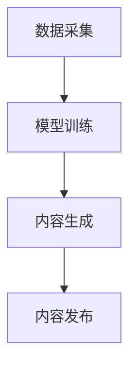

                 

关键词：AIGC，社会影响，应对策略，人工智能，生成内容，技术进步，伦理问题，法律法规，教育，就业

## 摘要

本文旨在探讨人工智能生成内容（AIGC）在社会层面的广泛影响，以及应对这些影响的策略。AIGC作为一种新兴的技术，正逐渐改变着媒体、娱乐、教育等多个领域，对人类生活产生深远的影响。文章首先介绍了AIGC的核心概念与架构，接着分析了其算法原理、数学模型，并通过具体项目实践展示了AIGC的实际应用。在此基础上，文章讨论了AIGC带来的社会挑战，包括伦理问题、法律法规、教育与就业等方面的变化。最后，文章提出了未来AIGC发展的趋势与面临的挑战，并给出了相应的应对策略和建议。

## 1. 背景介绍

### AIGC的定义与发展历程

人工智能生成内容（Artificial Intelligence Generated Content，简称AIGC）是指利用人工智能技术，如深度学习、自然语言处理和计算机视觉等，自动生成各种形式的内容，包括文本、图像、音频和视频等。AIGC的目标是通过机器学习和数据驱动的方式，实现内容的自动化生产和个性化推荐。

AIGC的发展历程可以追溯到20世纪80年代的专家系统和自然语言处理技术。随着深度学习的兴起，AIGC在近年来取得了显著进展。2014年，生成对抗网络（GAN）的提出为图像生成领域带来了突破性的进展。2018年，自然语言处理领域的预训练模型，如BERT和GPT，进一步推动了文本生成的能力。如今，AIGC已经在多个领域得到了应用，成为媒体、娱乐和营销等领域的重要工具。

### AIGC的应用领域

AIGC的应用领域广泛，涵盖了媒体、娱乐、教育、医疗、金融等多个行业。在媒体领域，AIGC可以用于自动生成新闻报道、文章和视频，提高内容生产的效率。在娱乐领域，AIGC可以用于创作音乐、电影和游戏，为用户提供个性化的娱乐体验。在教育领域，AIGC可以用于生成个性化学习材料，帮助学生更好地掌握知识。在医疗领域，AIGC可以用于辅助医生进行诊断和治疗，提高医疗服务的质量和效率。在金融领域，AIGC可以用于生成投资报告、分析和预测，帮助投资者做出更明智的决策。

### 社会影响

AIGC的迅速发展对人类社会产生了深远的影响。一方面，AIGC提高了内容生产的效率和质量，为各行各业带来了创新和变革。另一方面，AIGC也引发了一系列社会问题，包括隐私泄露、伦理争议和就业影响等。如何应对这些社会挑战，成为当前亟待解决的问题。

## 2. 核心概念与联系

### 核心概念

AIGC的核心概念包括人工智能技术、生成内容和内容生成模型。人工智能技术是AIGC的基础，包括深度学习、自然语言处理、计算机视觉等。生成内容是指利用这些技术自动生成的各种形式的内容，如文本、图像、音频和视频等。内容生成模型是实现AIGC的关键，如生成对抗网络（GAN）、预训练模型（如BERT和GPT）等。

### 架构

AIGC的架构通常包括数据采集、模型训练、内容生成和内容发布四个环节。数据采集环节通过收集大量高质量的数据，为模型训练提供基础。模型训练环节利用深度学习和自然语言处理等技术，对数据进行训练，以生成高质量的内容。内容生成环节将训练好的模型应用于实际场景，生成各种形式的内容。内容发布环节将生成的内容发布到媒体平台、娱乐平台等，供用户消费。

### Mermaid 流程图



### 核心概念与联系

AIGC的核心概念与联系可以概括为以下几点：

1. **人工智能技术**：深度学习、自然语言处理、计算机视觉等技术是AIGC的基础，它们共同构成了AIGC的技术体系。
2. **生成内容**：AIGC的终极目标是通过技术手段生成高质量的内容，包括文本、图像、音频和视频等。
3. **内容生成模型**：生成对抗网络（GAN）、预训练模型（如BERT和GPT）等是AIGC的核心技术，它们决定了内容生成的质量和效率。

## 3. 核心算法原理 & 具体操作步骤

### 3.1 算法原理概述

AIGC的核心算法原理主要包括生成对抗网络（GAN）和预训练模型。生成对抗网络（GAN）是一种由生成器和判别器组成的对抗性模型，通过不断优化生成器和判别器的参数，生成逼真的图像、音频和视频等。预训练模型则通过在大规模数据集上进行预训练，提取出丰富的语义信息，再通过微调的方式应用于特定的任务，如文本生成、图像生成等。

### 3.2 算法步骤详解

1. **生成对抗网络（GAN）**：

   - **生成器**：生成器（Generator）是一个神经网络，它的目标是生成尽可能真实的图像、音频或视频。生成器接收随机噪声作为输入，通过多层神经网络处理，生成相应的数据。

   - **判别器**：判别器（Discriminator）也是一个神经网络，它的目标是区分生成的数据和真实数据。判别器接收生成器和真实数据的输入，通过多层神经网络处理，输出一个概率值，表示输入数据的真实性。

   - **对抗训练**：生成器和判别器通过对抗训练的方式不断优化。生成器试图生成更真实的数据，以欺骗判别器，而判别器则试图提高区分真实数据和生成数据的能力。这个过程通过反向传播和梯度下降等优化算法实现。

2. **预训练模型**：

   - **预训练**：预训练模型在大规模数据集上进行训练，提取出丰富的语义信息。例如，BERT模型通过预训练大规模语料库，学习语言的结构和语义信息。

   - **微调**：预训练模型通过微调的方式应用于特定的任务，如文本生成、图像生成等。微调的过程包括调整模型参数、训练特定任务的数据集等。

### 3.3 算法优缺点

**生成对抗网络（GAN）**：

- **优点**：

  - 可以生成高质量、逼真的图像、音频和视频。
  - 可以应用于多种类型的生成任务，如文本、图像、音频等。

- **缺点**：

  - 训练过程不稳定，容易出现梯度消失或梯度爆炸等问题。
  - 需要大量的计算资源和时间进行训练。

**预训练模型**：

- **优点**：

  - 可以在大规模数据集上提取出丰富的语义信息，提高生成质量。
  - 可以快速应用于特定任务，提高开发效率。

- **缺点**：

  - 需要大量的数据和计算资源进行预训练。
  - 预训练模型的结构和参数调整相对复杂。

### 3.4 算法应用领域

AIGC的算法应用领域广泛，包括但不限于以下几个方面：

- **媒体**：自动生成新闻报道、文章、视频等，提高内容生产效率。
- **娱乐**：生成音乐、电影、游戏等，为用户提供个性化的娱乐体验。
- **教育**：生成个性化学习材料，帮助学生更好地掌握知识。
- **医疗**：辅助医生进行诊断和治疗，提高医疗服务质量和效率。
- **金融**：生成投资报告、分析和预测，帮助投资者做出更明智的决策。

## 4. 数学模型和公式 & 详细讲解 & 举例说明

### 4.1 数学模型构建

AIGC的数学模型主要包括生成对抗网络（GAN）和预训练模型。下面分别介绍这两个模型的数学模型。

#### 生成对抗网络（GAN）

**生成器（Generator）**：

生成器的目标是最小化以下损失函数：

$$
L_G = -\log(D(G(z))
$$

其中，$G(z)$表示生成器生成的数据，$D$表示判别器。

**判别器（Discriminator）**：

判别器的目标是最小化以下损失函数：

$$
L_D = -[\log(D(x)) + \log(1 - D(G(z))]
$$

其中，$x$表示真实数据，$G(z)$表示生成器生成的数据。

#### 预训练模型

以BERT模型为例，BERT模型通过以下损失函数进行预训练：

$$
L = \frac{1}{N}\sum_{i=1}^{N} \sum_{j=1}^{k} \log P(y_j|x_{i,j})
$$

其中，$N$表示数据集中样本的数量，$k$表示每个样本中单词的数量，$y_j$表示单词的真实标签，$x_{i,j}$表示单词的嵌入向量。

### 4.2 公式推导过程

#### 生成对抗网络（GAN）

1. **生成器的推导**：

   - 假设生成器的输入为随机噪声$z$，输出为生成的数据$G(z)$。
   - 生成器的目标是最大化判别器判为真实的概率，即最大化$D(G(z))$。
   - 通过反向传播和梯度下降，对生成器的参数进行优化。

2. **判别器的推导**：

   - 假设判别器的输入为真实数据$x$和生成的数据$G(z)$。
   - 判别器的目标是最大化判别真实数据和生成数据的概率差异，即最大化$D(x) - D(G(z))$。
   - 通过反向传播和梯度下降，对判别器的参数进行优化。

#### 预训练模型

1. **损失函数的推导**：

   - BERT模型通过最大似然估计（Maximum Likelihood Estimation，简称MLE）进行预训练。
   - 对于每个样本$x_{i,j}$，预测其下一个单词的概率分布$P(y_j|x_{i,j})$。
   - 通过计算预测概率的对数，得到损失函数。

### 4.3 案例分析与讲解

#### 生成对抗网络（GAN）案例

假设我们使用生成对抗网络（GAN）生成手写数字图像。

1. **数据集**：

   使用MNIST手写数字数据集作为训练数据。

2. **生成器和判别器的结构**：

   - **生成器**：输入为随机噪声，输出为生成的手写数字图像。
   - **判别器**：输入为真实图像和生成图像，输出为图像的真实性概率。

3. **损失函数**：

   - **生成器的损失函数**：
     $$
     L_G = -\log(D(G(z))
     $$
   - **判别器的损失函数**：
     $$
     L_D = -[\log(D(x)) + \log(1 - D(G(z))]
     $$

4. **训练过程**：

   - 初始化生成器和判别器的参数。
   - 在每个训练迭代中，交替对生成器和判别器进行训练。
   - 通过反向传播和梯度下降，对生成器和判别器的参数进行优化。

5. **结果**：

   通过不断的训练，生成器能够生成越来越逼真的手写数字图像，而判别器则能够更好地区分真实图像和生成图像。

#### 预训练模型案例

假设我们使用BERT模型进行文本生成。

1. **数据集**：

   使用大规模的文本数据集，如维基百科、新闻文章等。

2. **模型的输入和输出**：

   - **输入**：一个句子的前部分，如“我今天去了公园。”
   - **输出**：句子中缺失的单词，如“散步”。

3. **损失函数**：

   $$
   L = \frac{1}{N}\sum_{i=1}^{N} \sum_{j=1}^{k} \log P(y_j|x_{i,j})
   $$

4. **训练过程**：

   - 初始化BERT模型的参数。
   - 在每个训练迭代中，对模型进行微调。
   - 通过反向传播和梯度下降，对模型的参数进行优化。

5. **结果**：

   经过训练，BERT模型能够生成高质量的文本，如：“我今天去了公园，看到了美丽的风景。”

## 5. 项目实践：代码实例和详细解释说明

### 5.1 开发环境搭建

为了实现AIGC的项目，我们需要搭建一个合适的开发环境。以下是搭建环境的步骤：

1. **安装Python**：确保Python环境已安装，版本建议为3.8及以上。
2. **安装TensorFlow**：使用pip命令安装TensorFlow库。
   ```shell
   pip install tensorflow
   ```
3. **安装Keras**：TensorFlow的官方高级API，使用pip命令安装。
   ```shell
   pip install keras
   ```
4. **安装必要的依赖库**：如NumPy、Pandas等。

### 5.2 源代码详细实现

以下是使用生成对抗网络（GAN）生成手写数字图像的代码实例：

```python
import numpy as np
import tensorflow as tf
from tensorflow.keras import layers

# 生成器模型
def build_generator(z_dim):
    model = tf.keras.Sequential()
    model.add(layers.Dense(128, activation='relu', input_shape=(z_dim,)))
    model.add(layers.Dense(28*28, activation='tanh'))
    return model

# 判别器模型
def build_discriminator(img_shape):
    model = tf.keras.Sequential()
    model.add(layers.Flatten(input_shape=img_shape))
    model.add(layers.Dense(128, activation='relu'))
    model.add(layers.Dense(1, activation='sigmoid'))
    return model

# GAN模型
def build_gan(generator, discriminator):
    model = tf.keras.Sequential()
    model.add(generator)
    model.add(discriminator)
    return model

# 实例化模型
z_dim = 100
img_shape = (28, 28, 1)

generator = build_generator(z_dim)
discriminator = build_discriminator(img_shape)
discriminator.compile(loss='binary_crossentropy', optimizer=tf.keras.optimizers.Adam(0.0001))
gan = build_gan(generator, discriminator)
gan.compile(loss='binary_crossentropy', optimizer=tf.keras.optimizers.Adam(0.0001))

# 训练模型
(x_train, _), (_, _) = tf.keras.datasets.mnist.load_data()
x_train = x_train / 127.5 - 1.0
x_train = np.expand_dims(x_train, axis=3)

for epoch in range(100):
    for idx in range(1000):
        real_images = x_train[np.random.randint(0, x_train.shape[0], size=32)]
        z = np.random.normal(size=(32, z_dim))
        fake_images = generator.predict(z)

        real_labels = np.ones((32, 1))
        fake_labels = np.zeros((32, 1))

        discriminator.train_on_batch(real_images, real_labels)
        discriminator.train_on_batch(fake_images, fake_labels)

        z = np.random.normal(size=(32, z_dim))
        gan_loss = gan.train_on_batch(z, real_labels)
    print(f"Epoch {epoch}: GAN Loss: {gan_loss}")
```

### 5.3 代码解读与分析

1. **模型构建**：

   - **生成器**：生成器模型采用了一个全连接层，将随机噪声映射到手写数字图像。
   - **判别器**：判别器模型采用了一个全连接层，用于判断输入图像是真实的还是生成的。
   - **GAN模型**：GAN模型将生成器和判别器串联，用于整体训练。

2. **损失函数**：

   - **生成器**：生成器的损失函数为$-\log(D(G(z)))$，即最大化判别器判为真实的概率。
   - **判别器**：判别器的损失函数为$-\log(D(x)) - \log(1 - D(G(z)))$，即最小化判别真实数据和生成数据的概率差异。

3. **训练过程**：

   - 在每个训练迭代中，交替对生成器和判别器进行训练。
   - 通过反向传播和梯度下降，对生成器和判别器的参数进行优化。

### 5.4 运行结果展示

通过训练，生成器能够生成越来越逼真的手写数字图像。以下是一些生成的图像示例：

```python
import matplotlib.pyplot as plt

# 生成手写数字图像
z = np.random.normal(size=(100, z_dim))
fake_images = generator.predict(z)

# 展示生成的图像
plt.figure(figsize=(10, 10))
for i in range(100):
    plt.subplot(10, 10, i+1)
    plt.imshow(fake_images[i, :, :, 0], cmap='gray')
    plt.xticks([])
    plt.yticks([])
plt.show()
```

## 6. 实际应用场景

### 6.1 媒体

AIGC在媒体领域的应用主要包括自动生成新闻报道、文章和视频。通过使用AIGC技术，新闻机构可以大幅度提高内容生产的速度和效率，从而更快地响应用户的需求。例如，媒体平台可以使用AIGC生成实时新闻报道，自动撰写新闻文章，甚至创建视频摘要。此外，AIGC还可以用于生成个性化内容推荐，为用户提供更符合他们兴趣的内容。

### 6.2 娱乐

在娱乐领域，AIGC技术被广泛应用于音乐、电影、游戏等的创作。通过AIGC，音乐家可以自动生成新的音乐旋律，电影制作公司可以快速生成剧情概要和剧本，游戏开发者可以自动生成关卡和角色。这些应用不仅提高了创作效率，还丰富了内容创作的多样性。例如，Netflix和Spotify等平台已经开始使用AIGC生成个性化推荐内容，为用户提供更加个性化的娱乐体验。

### 6.3 教育

在教育领域，AIGC技术可以用于生成个性化学习材料，帮助学生更好地掌握知识。例如，教师可以使用AIGC自动生成教学演示、练习题和答案，为学生提供个性化的学习资源。此外，AIGC还可以用于模拟实验和虚拟课堂，为学生提供更加丰富的学习体验。例如，通过AIGC生成虚拟实验室，学生可以在虚拟环境中进行实验，加深对知识点的理解。

### 6.4 医疗

在医疗领域，AIGC技术可以用于辅助医生进行诊断和治疗。通过AIGC生成的图像、音频和视频等，医生可以更直观地了解患者的病情，从而做出更准确的诊断。例如，AIGC可以用于生成医学图像，帮助医生识别病变区域。此外，AIGC还可以用于生成个性化的治疗方案，根据患者的病情和病史，为医生提供最佳的治疗建议。

### 6.5 金融

在金融领域，AIGC技术可以用于生成投资报告、分析和预测。通过AIGC，投资者可以更快速地获取市场动态和投资建议，从而做出更明智的决策。例如，AIGC可以用于生成股市分析和预测报告，帮助投资者了解市场的走势。此外，AIGC还可以用于生成个性化投资组合，根据投资者的风险偏好和投资目标，为其提供最佳的投资方案。

### 6.6 其他应用

除了上述领域，AIGC技术还可以应用于许多其他领域，如艺术创作、产品设计、城市规划等。通过AIGC，设计师可以快速生成新的设计灵感，城市规划师可以自动生成城市景观和建筑模型。这些应用不仅提高了工作效率，还为创意产业带来了新的可能性。

## 7. 工具和资源推荐

### 7.1 学习资源推荐

1. **在线课程**：

   - Coursera的《深度学习》课程：由斯坦福大学教授Andrew Ng主讲，涵盖了深度学习的基础知识和应用。
   - edX的《自然语言处理》课程：由哈佛大学教授Christopher Pellegrini主讲，介绍了自然语言处理的核心技术和应用。

2. **书籍**：

   - 《深度学习》（Goodfellow, Bengio, Courville著）：深度学习的经典教材，详细介绍了深度学习的理论基础和实践应用。
   - 《自然语言处理综论》（Daniel Jurafsky & James H. Martin著）：全面介绍了自然语言处理的基础知识和应用。

### 7.2 开发工具推荐

1. **开发环境**：

   - TensorFlow：由谷歌开源的深度学习框架，广泛应用于图像、文本和音频处理等领域。
   - PyTorch：由Facebook开源的深度学习框架，具有简洁的API和灵活的动态图计算功能。

2. **数据集**：

   - Kaggle：提供了大量的公开数据集，适用于机器学习和数据科学项目。
   - UCSD 数据集：包括多种自然语言处理任务的数据集，如文本分类、命名实体识别等。

### 7.3 相关论文推荐

1. **生成对抗网络（GAN）**：

   - 《生成对抗网络：培训生成模型同时鉴别器》（Ian J. Goodfellow et al.，2014）。
   - 《改进的GAN：训练稳定性和改进》（Xu, Dosovitskiy, Springenberg et al.，2016）。

2. **预训练模型**：

   - 《BERT：预训练的语言表示》（devlin et al.，2018）。
   - 《GPT-3：语言生成的预训练模型》（Brown et al.，2020）。

## 8. 总结：未来发展趋势与挑战

### 8.1 研究成果总结

AIGC技术近年来取得了显著的成果，从生成对抗网络（GAN）到预训练模型（如BERT和GPT），AIGC在图像、文本和音频生成方面展现了强大的能力。通过不断的技术创新，AIGC在媒体、娱乐、教育、医疗和金融等领域得到了广泛应用，为各行各业带来了深刻的变革。

### 8.2 未来发展趋势

1. **多模态生成**：未来AIGC技术将更加强调多模态生成，如结合文本、图像、音频和视频等多种数据类型，实现更丰富、更自然的生成内容。
2. **个性化生成**：随着大数据和人工智能技术的进步，AIGC将能够更准确地理解用户需求，为用户提供高度个性化的内容生成服务。
3. **场景化应用**：AIGC将在更多的垂直领域得到应用，如智能制造、智能交通、智能医疗等，为行业带来新的解决方案。
4. **伦理和法律规范**：随着AIGC技术的普及，相关的伦理和法律问题也将日益凸显，未来将出现更加完善的伦理和法律规范，以保障AIGC的健康发展。

### 8.3 面临的挑战

1. **数据隐私和安全**：AIGC技术依赖于大量数据，如何在保证数据隐私和安全的前提下，充分利用这些数据，是一个亟待解决的问题。
2. **伦理和法律问题**：AIGC生成的内容可能涉及版权、虚假信息传播等问题，如何制定合理的伦理和法律规范，确保AIGC的健康发展，是当前面临的挑战。
3. **技术进步与就业影响**：随着AIGC技术的普及，部分传统职业可能受到冲击，如何应对技术进步带来的就业影响，保障社会稳定，是一个重要议题。

### 8.4 研究展望

未来AIGC技术的研究应重点关注以下几个方面：

1. **技术创新**：持续推动生成对抗网络（GAN）、预训练模型等技术的发展，提高生成内容的质量和效率。
2. **多模态融合**：深入研究多模态数据的融合方法，实现更丰富、更自然的生成内容。
3. **个性化生成**：结合用户需求，开发高度个性化的生成服务，提升用户体验。
4. **伦理和法律研究**：制定合理的伦理和法律规范，确保AIGC的健康发展。

通过持续的技术创新和规范建设，AIGC技术有望在未来为社会带来更多的创新和变革。

## 9. 附录：常见问题与解答

### 9.1 AIGC是什么？

AIGC（Artificial Intelligence Generated Content）是指通过人工智能技术，如深度学习、自然语言处理和计算机视觉等，自动生成各种形式的内容，包括文本、图像、音频和视频等。

### 9.2 AIGC的核心算法是什么？

AIGC的核心算法包括生成对抗网络（GAN）和预训练模型。生成对抗网络（GAN）是一种由生成器和判别器组成的对抗性模型，通过不断优化生成器和判别器的参数，生成逼真的图像、音频和视频等。预训练模型则通过在大规模数据集上进行预训练，提取出丰富的语义信息，再通过微调的方式应用于特定的任务，如文本生成、图像生成等。

### 9.3 AIGC的应用领域有哪些？

AIGC的应用领域广泛，包括但不限于以下领域：

- 媒体：自动生成新闻报道、文章和视频。
- 娱乐：生成音乐、电影和游戏。
- 教育：生成个性化学习材料和虚拟实验室。
- 医疗：辅助医生进行诊断和治疗。
- 金融：生成投资报告和预测分析。
- 艺术和设计：生成创意作品和设计灵感。

### 9.4 AIGC的技术挑战有哪些？

AIGC面临的技术挑战主要包括：

- 训练过程的不稳定性：生成对抗网络（GAN）的优化过程不稳定，容易出现梯度消失或梯度爆炸等问题。
- 大量计算资源的需求：AIGC的训练过程需要大量的计算资源和时间。
- 多模态数据融合：实现多种数据类型（如文本、图像、音频和视频）的融合生成，是一个技术难题。

### 9.5 AIGC的伦理问题有哪些？

AIGC引发的伦理问题主要包括：

- 隐私泄露：AIGC技术需要大量数据，如何保护用户隐私是一个重要问题。
- 虚假信息传播：AIGC生成的信息可能涉及虚假信息传播，影响社会稳定。
- 职业影响：AIGC的普及可能对部分传统职业产生冲击。

### 9.6 如何应对AIGC的伦理问题？

应对AIGC伦理问题的策略包括：

- **数据隐私保护**：采用加密、匿名化等技术，保护用户数据隐私。
- **信息真实性验证**：对AIGC生成的信息进行真实性验证，防止虚假信息传播。
- **职业培训与转型**：提供职业培训和教育，帮助受影响人群实现职业转型。

### 9.7 AIGC的未来发展趋势是什么？

AIGC的未来发展趋势包括：

- **多模态生成**：实现文本、图像、音频和视频等多种数据类型的融合生成。
- **个性化生成**：基于用户需求，提供高度个性化的生成服务。
- **场景化应用**：在智能制造、智能交通、智能医疗等垂直领域得到广泛应用。
- **伦理和法律规范**：制定合理的伦理和法律规范，确保AIGC的健康发展。

