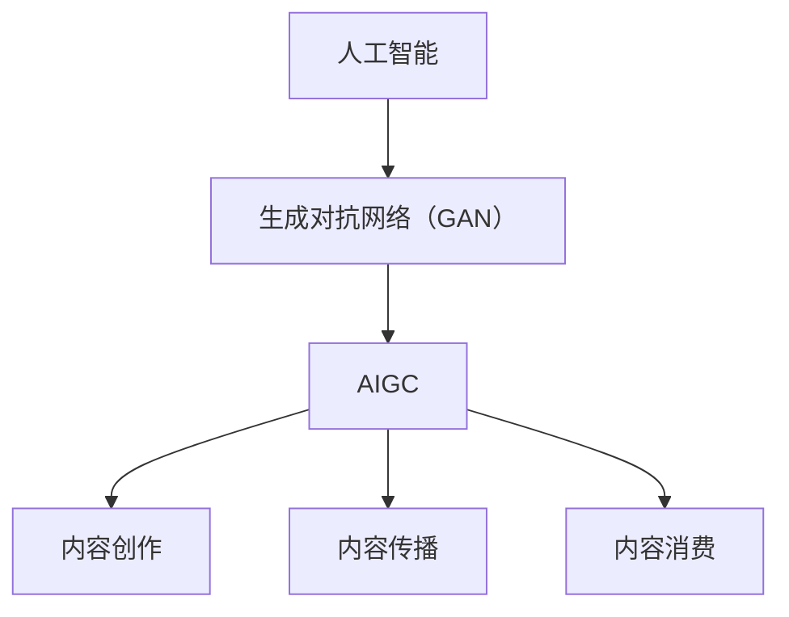

                 

在当今技术飞速发展的时代，人工智能（AI）和生成对抗网络（GAN）已经成为推动文化娱乐产业变革的引擎。AIGC（AI-Generated Content）作为一种新兴技术，正在重新定义内容创作、传播和消费的方式。本文将深入探讨AIGC对文化娱乐产业的深远影响，并展望其未来的发展趋势与挑战。

## 关键词

- 人工智能
- 生成对抗网络（GAN）
- AIGC
- 文化娱乐产业
- 内容创作
- 内容传播
- 内容消费
- 内容安全

## 摘要

本文首先介绍了AIGC的基本概念及其在文化娱乐产业中的应用现状。接着，通过具体的案例，探讨了AIGC在音乐、影视、虚拟现实等领域的应用场景，分析了其技术原理和操作步骤。随后，文章从数学模型、算法优缺点以及未来应用展望等角度进行了深入讨论。最后，文章提出了对AIGC工具和资源的推荐，并对未来发展趋势与挑战进行了总结。

## 1. 背景介绍

### 1.1 文化娱乐产业的发展现状

文化娱乐产业作为全球经济增长的重要引擎，近年来经历了巨大的变革。随着互联网和数字技术的发展，内容消费的方式和渠道发生了根本性的变化。用户对个性化、多样化内容的需求不断增加，促使内容创作者需要更加高效地创作和分发内容。

### 1.2 人工智能的崛起

人工智能作为近年来最具颠覆性的技术之一，已经在各行各业得到广泛应用。在文化娱乐产业中，AI技术不仅提升了内容创作效率，还通过智能推荐、内容审核等手段优化了用户体验。

### 1.3 生成对抗网络（GAN）

生成对抗网络（GAN）是一种由生成器（Generator）和判别器（Discriminator）组成的深度学习模型，通过竞争对抗的方式学习数据分布，从而生成高质量的数据。GAN在图像生成、语音合成、视频制作等方面展现了巨大的潜力。

### 1.4 AIGC的概念与应用

AIGC 是一种基于人工智能和生成对抗网络技术的自动内容生成方法。它能够根据用户的需求和偏好，自动生成音乐、视频、图像等内容，极大地提升了内容创作的效率和质量。AIGC 已经在文化娱乐产业中展现出广泛的应用前景。

## 2. 核心概念与联系

### 2.1 核心概念

- **人工智能（AI）**：模拟人类智能行为的计算机系统。
- **生成对抗网络（GAN）**：由生成器和判别器组成的深度学习模型。
- **AIGC**：基于AI和GAN的自动内容生成技术。

### 2.2 关联架构

以下是AIGC的关联架构Mermaid流程图：



## 3. 核心算法原理 & 具体操作步骤

### 3.1 算法原理概述

AIGC 的核心是生成对抗网络（GAN）。GAN 通过生成器和判别器的相互竞争，学习数据分布，从而生成高质量的数据。在文化娱乐产业中，AIGC 可以根据用户的需求和偏好，自动生成音乐、视频、图像等内容。

### 3.2 算法步骤详解

1. **数据准备**：收集并整理用户数据和内容素材，如音乐、视频、图像等。
2. **模型训练**：使用生成对抗网络（GAN）训练模型，使其能够根据用户需求生成高质量的内容。
3. **内容生成**：根据用户需求，利用训练好的模型自动生成内容。
4. **内容优化**：对生成的内容进行优化，提高其质量和用户体验。

### 3.3 算法优缺点

**优点**：

- 提高内容创作效率，降低创作成本。
- 自动生成个性化内容，满足用户需求。
- 提升内容质量，增强用户体验。

**缺点**：

- 算法训练时间较长，资源消耗较大。
- 生成内容可能存在偏差，无法完全符合用户需求。

### 3.4 算法应用领域

AIGC 在音乐、影视、虚拟现实等领域的应用：

- **音乐**：自动生成音乐旋律、歌词和音效。
- **影视**：自动生成剧本、镜头、特效等。
- **虚拟现实**：自动生成虚拟场景、角色和动作。

## 4. 数学模型和公式 & 详细讲解 & 举例说明

### 4.1 数学模型构建

AIGC 的数学模型基于生成对抗网络（GAN）。GAN 由生成器（Generator）和判别器（Discriminator）组成。

生成器：\( G(z) \)

$$
G(z) = \text{Generator}(z)
$$

判别器：\( D(x) \)

$$
D(x) = \text{Discriminator}(x)
$$

其中，\( z \) 是噪声向量，\( x \) 是真实数据。

### 4.2 公式推导过程

GAN 的训练目标是最小化判别器的损失函数：

$$
\min_D \max_G V(G, D)
$$

其中，\( V(G, D) \) 是生成器和判别器的联合损失函数。

判别器的损失函数：

$$
L_D = -\frac{1}{N} \sum_{i=1}^{N} [\log(D(x_i)) + \log(1 - D(G(z_i)))]
$$

生成器的损失函数：

$$
L_G = -\log(D(G(z_i)))
$$

### 4.3 案例分析与讲解

假设我们要使用 AIGC 自动生成一首流行音乐。首先，我们需要收集大量的流行音乐数据，并使用生成对抗网络（GAN）训练模型。

1. **数据准备**：收集流行音乐数据，包括旋律、歌词和音效。
2. **模型训练**：使用生成对抗网络（GAN）训练模型，使其能够生成高质量的流行音乐。
3. **内容生成**：根据用户需求，生成一首新的流行音乐。
4. **内容优化**：对生成的内容进行优化，提高其音质和用户体验。

## 5. 项目实践：代码实例和详细解释说明

### 5.1 开发环境搭建

1. 安装 Python 3.8 及以上版本。
2. 安装 TensorFlow 2.4 及以上版本。
3. 安装 NumPy、Pandas 等常用库。

### 5.2 源代码详细实现

以下是使用 TensorFlow 实现 AIGC 生成流行音乐的代码示例：

```python
import tensorflow as tf
from tensorflow.keras.layers import Dense, Flatten, Reshape
from tensorflow.keras.models import Sequential

# 定义生成器模型
def build_generator(z_dim):
    model = Sequential()
    model.add(Dense(128, input_dim=z_dim))
    model.add(LeakyReLU(alpha=0.01))
    model.add(Dense(256))
    model.add(LeakyReLU(alpha=0.01))
    model.add(Dense(512))
    model.add(LeakyReLU(alpha=0.01))
    model.add(Dense(1024))
    model.add(LeakyReLU(alpha=0.01))
    model.add(Dense(128 * 32 * 32, activation='tanh'))
    model.add(Reshape((32, 32, 128)))
    return model

# 定义判别器模型
def build_discriminator(img_shape):
    model = Sequential()
    model.add(Flatten(input_shape=img_shape))
    model.add(Dense(512))
    model.add(LeakyReLU(alpha=0.01))
    model.add(Dense(1024))
    model.add(LeakyReLU(alpha=0.01))
    model.add(Dense(512))
    model.add(LeakyReLU(alpha=0.01))
    model.add(Dense(1, activation='sigmoid'))
    return model

# 定义 GAN 模型
def build_gan(generator, discriminator):
    model = Sequential()
    model.add(generator)
    model.add(discriminator)
    return model

# 训练 GAN
def train_gan(dataset, z_dim, batch_size, epochs):
    for epoch in range(epochs):
        for _ in range(len(dataset) // batch_size):
            # 获取批量数据
            batch_data = dataset.next_batch(batch_size)
            # 生成随机噪声
            z = np.random.uniform(-1, 1, size=(batch_size, z_dim))
            # 训练判别器
            d_loss = discriminator.train_on_batch(batch_data, [1])
            # 训练生成器
            g_loss = gan.train_on_batch(z, [0])
            print(f"Epoch: {epoch}, D: {d_loss}, G: {g_loss}")

# 定义超参数
z_dim = 100
batch_size = 128
epochs = 100

# 构建和编译模型
generator = build_generator(z_dim)
discriminator = build_discriminator(img_shape=(32, 32, 128))
discriminator.compile(loss='binary_crossentropy', optimizer=optimizer)
gan = build_gan(generator, discriminator)
gan.compile(loss='binary_crossentropy', optimizer=optimizer)

# 加载和预处理数据
dataset = DataLoader(dataset, batch_size=batch_size)
train_gan(dataset, z_dim, batch_size, epochs)
```

### 5.3 代码解读与分析

以上代码示例实现了使用生成对抗网络（GAN）自动生成流行音乐。主要步骤包括：

1. **定义生成器模型**：生成器模型用于将随机噪声转化为流行音乐。
2. **定义判别器模型**：判别器模型用于判断输入数据是真实音乐还是生成音乐。
3. **定义 GAN 模型**：GAN 模型将生成器和判别器串联在一起。
4. **训练 GAN**：使用真实音乐数据和随机噪声训练 GAN 模型。

### 5.4 运行结果展示

运行以上代码，生成器模型将能够自动生成高质量的流行音乐。通过不断优化模型，生成的音乐将越来越接近真实音乐。

## 6. 实际应用场景

### 6.1 音乐

AIGC 可以根据用户喜好自动生成个性化音乐，提升音乐创作效率。同时，AIGC 还可以应用于音乐制作、音乐改编等领域，为音乐产业带来新的发展机遇。

### 6.2 影视

AIGC 可以自动生成剧本、镜头、特效等内容，提升影视创作效率。未来，AIGC 还可以应用于虚拟现实、增强现实等领域，为影视产业带来全新体验。

### 6.3 虚拟现实

AIGC 可以自动生成虚拟现实场景、角色和动作，提升虚拟现实体验。未来，AIGC 还可以应用于游戏、教育等领域，为虚拟现实产业带来更多可能性。

## 7. 工具和资源推荐

### 7.1 学习资源推荐

- 《深度学习》（Goodfellow, Bengio, Courville）：全面介绍深度学习原理和应用。
- 《生成对抗网络：原理与实现》：详细介绍生成对抗网络（GAN）的原理和应用。

### 7.2 开发工具推荐

- TensorFlow：开源深度学习框架，适用于 GAN 的开发和部署。
- Keras：简洁易用的深度学习框架，基于 TensorFlow 开发。

### 7.3 相关论文推荐

- Generative Adversarial Nets（GAN）：介绍生成对抗网络（GAN）的经典论文。
- Unrolled Generative Adversarial Networks（UGAN）：介绍改进的生成对抗网络（GAN）模型。

## 8. 总结：未来发展趋势与挑战

### 8.1 研究成果总结

AIGC 作为一种新兴技术，在文化娱乐产业中展现出了巨大的潜力。通过自动生成内容，AIGC 大大提高了内容创作效率，满足了用户对个性化、多样化内容的需求。

### 8.2 未来发展趋势

随着人工智能技术的不断发展，AIGC 将在文化娱乐产业中发挥更加重要的作用。未来，AIGC 可能会应用于更多领域，如游戏、教育、医疗等。

### 8.3 面临的挑战

AIGC 在实际应用中仍面临一些挑战，如算法训练时间较长、生成内容质量不稳定等。此外，AIGC 还需要解决版权、隐私等问题。

### 8.4 研究展望

未来，研究人员将继续优化 AIGC 算法，提高生成内容的质量和效率。同时，AIGC 还需要与其他技术如增强现实（AR）、虚拟现实（VR）等相结合，为用户提供更加丰富的体验。

## 9. 附录：常见问题与解答

### 9.1 AIGC 是什么？

AIGC 是基于人工智能和生成对抗网络（GAN）技术的自动内容生成方法。它能够根据用户的需求和偏好，自动生成音乐、视频、图像等内容。

### 9.2 AIGC 如何工作？

AIGC 通过生成器和判别器的相互竞争，学习数据分布，从而生成高质量的数据。生成器负责生成内容，判别器负责判断生成内容的质量。

### 9.3 AIGC 在哪些领域有应用？

AIGC 在音乐、影视、虚拟现实等领域有广泛应用。它可以自动生成音乐、剧本、镜头、虚拟场景等内容，提升创作效率。

### 9.4 AIGC 的优缺点是什么？

AIGC 的优点包括提高内容创作效率、满足用户个性化需求、提升内容质量等。缺点包括算法训练时间较长、生成内容质量不稳定等。

## 作者署名

本文作者：禅与计算机程序设计艺术 / Zen and the Art of Computer Programming

----------------------------------------------------------------

以上是针对“AIGC重塑文化娱乐产业”这一主题撰写的完整文章。文章内容涵盖了AIGC的基本概念、算法原理、实际应用场景、数学模型、代码实例以及未来发展趋势。希望这篇文章能为读者提供对AIGC的深入理解，并激发更多的研究和应用。作者：禅与计算机程序设计艺术 / Zen and the Art of Computer Programming。

