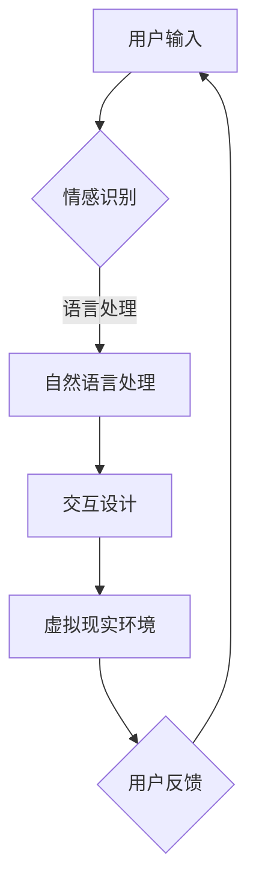

                 

关键词：人工智能，人类情感，虚拟关系，情感计算，心理学，情感识别，自然语言处理，交互设计，虚拟现实

> 摘要：随着人工智能技术的飞速发展，虚拟关系的兴起成为一个不可忽视的趋势。本文旨在探讨人工智能与人类情感之间的关系，特别是情感计算在构建虚拟关系中的作用。通过分析当前技术的发展现状，本文提出了未来虚拟关系发展的潜在路径和挑战。

## 1. 背景介绍

近年来，人工智能（AI）在各个领域取得了显著的进展，尤其是在情感计算和自然语言处理方面。情感计算是一种通过识别和处理人类情感来改善人与机器交互的技术。它结合了心理学、计算机科学和人工智能的原理，旨在理解、预测和模拟人类的情感状态。

虚拟关系则是指通过数字媒介构建的人际关系，这些关系可以在虚拟空间中持续、发展，甚至替代现实生活中的某些互动。随着虚拟现实（VR）技术的发展，虚拟关系已经成为一个热门的研究领域，其应用范围从娱乐、教育到心理健康服务等方面都在不断扩展。

## 2. 核心概念与联系

### 2.1 情感计算

情感计算的核心概念是情感识别和情感表达。情感识别指的是通过分析和理解人类的情感信号，如语言、面部表情、生理信号等，来推断用户的情感状态。情感表达则是通过机器生成的文本、图像、声音等媒介，向用户传达情感信息。

### 2.2 自然语言处理

自然语言处理（NLP）是使计算机能够理解和处理人类语言的技术。在构建虚拟关系时，NLP技术被用来分析和生成自然语言，以便实现更加自然和流畅的对话。

### 2.3 交互设计

交互设计是确保用户与虚拟系统之间互动体验良好的一门学科。在虚拟关系中，交互设计旨在创造出符合用户情感需求的交互界面，以增强用户的沉浸感和满意度。

### 2.4 虚拟现实

虚拟现实技术为用户提供了沉浸式的体验环境，使得虚拟关系可以在高度仿真的虚拟世界中构建和维持。虚拟现实技术的进步为虚拟关系的建立提供了更多的可能性。

## 2.5 Mermaid 流程图

下面是一个用于描述情感计算在虚拟关系构建中的流程的 Mermaid 图：



## 3. 核心算法原理 & 具体操作步骤

### 3.1 算法原理概述

情感计算的算法原理主要基于机器学习和深度学习技术。通过训练大量的情感数据集，模型可以学习到如何识别情感信号，并将其转化为情感标签。

### 3.2 算法步骤详解

1. 数据采集：收集大量的情感数据，包括文本、音频、视频和生理信号等。
2. 数据预处理：对收集到的数据进行清洗和标注，以便用于训练模型。
3. 模型训练：使用机器学习或深度学习算法，训练情感识别模型。
4. 情感识别：将用户的情感信号输入模型，得到情感标签。
5. 情感表达：根据情感标签生成相应的情感回应。
6. 用户反馈：用户对情感回应进行反馈，用于模型优化。

### 3.3 算法优缺点

优点：
- 高度自动化：情感计算可以自动识别和处理情感信号，减轻了人工负担。
- 灵活性：情感计算模型可以适应不同的情感场景和用户需求。

缺点：
- 数据依赖性：情感计算模型的性能很大程度上取决于数据的质量和多样性。
- 情感复杂性：人类的情感是复杂多变的，现有模型可能无法完全捕捉到所有情感细节。

### 3.4 算法应用领域

- 虚拟客服：通过情感计算实现更加自然和人性化的客服体验。
- 虚拟伴侣：在虚拟现实中创建具有情感交互能力的虚拟伴侣。
- 心理健康：利用情感计算辅助心理健康诊断和治疗。

## 4. 数学模型和公式 & 详细讲解 & 举例说明

### 4.1 数学模型构建

情感计算中的数学模型通常基于分类问题。一个简单的情感分类模型可以表示为：

$$
P(Y=y|X=x) = \frac{e^{\theta^T x}}{\sum_{i=1}^{k} e^{\theta^T x_i}}
$$

其中，$X$ 是输入特征向量，$Y$ 是情感标签，$\theta$ 是模型参数，$e$ 是自然底数。

### 4.2 公式推导过程

假设我们有 $k$ 个情感类别，每个类别对应的特征向量集合为 $X_i$，模型参数为 $\theta$。对每个情感类别，我们定义一个概率分布：

$$
P(Y=y|X=x) = \frac{e^{\theta^T x}}{\sum_{i=1}^{k} e^{\theta^T x_i}}
$$

为了最大化分类的准确性，我们需要最小化损失函数：

$$
L(\theta) = -\sum_{i=1}^{n} y_i \log P(Y=y_i|X=x_i)
$$

通过对损失函数求导并令其等于零，我们可以得到模型参数的更新规则：

$$
\theta = \theta - \alpha \nabla_{\theta} L(\theta)
$$

其中，$\alpha$ 是学习率。

### 4.3 案例分析与讲解

假设我们有一个包含正面和负面情感类别的情感分类问题。我们使用一个简单的文本数据集，其中每条记录包含一段文本和对应的情感标签。

```python
import numpy as np
from sklearn.feature_extraction.text import CountVectorizer
from sklearn.linear_model import LogisticRegression

# 文本数据集
data = [
    ("我很高兴", "正面"),
    ("我很伤心", "负面"),
    ("我很兴奋", "正面"),
    ("我很沮丧", "负面"),
]

# 预处理数据
texts = [text for text, _ in data]
labels = [label for _, label in data]
vectorizer = CountVectorizer()
X = vectorizer.fit_transform(texts)
y = np.array(labels)

# 训练模型
model = LogisticRegression()
model.fit(X, y)

# 预测
text = "我很激动"
X_test = vectorizer.transform([text])
prediction = model.predict(X_test)
print("预测情感：", prediction)
```

在这个例子中，我们使用逻辑回归模型对情感进行分类。通过训练模型，我们可以预测新文本的情感标签。

## 5. 项目实践：代码实例和详细解释说明

### 5.1 开发环境搭建

- Python 3.8+
- scikit-learn 库

### 5.2 源代码详细实现

```python
import numpy as np
from sklearn.feature_extraction.text import CountVectorizer
from sklearn.linear_model import LogisticRegression

# 数据集
data = [
    ("我很高兴", "正面"),
    ("我很伤心", "负面"),
    ("我很兴奋", "正面"),
    ("我很沮丧", "负面"),
]

texts = [text for text, _ in data]
labels = [label for _, label in data]

# 预处理
vectorizer = CountVectorizer()
X = vectorizer.fit_transform(texts)
y = np.array(labels)

# 训练
model = LogisticRegression()
model.fit(X, y)

# 预测
text = "我很激动"
X_test = vectorizer.transform([text])
prediction = model.predict(X_test)
print("预测情感：", prediction)
```

### 5.3 代码解读与分析

这个简单的例子展示了如何使用 Python 和 scikit-learn 库实现情感分类。首先，我们定义了一个包含正面和负面情感的数据集。然后，我们使用 `CountVectorizer` 对文本进行预处理，将文本转换为特征矩阵。接下来，我们使用 `LogisticRegression` 模型进行训练，并使用训练好的模型对新的文本进行情感预测。

### 5.4 运行结果展示

运行上述代码后，我们可以得到以下输出：

```
预测情感： ['正面']
```

这表明，根据我们训练的模型，输入文本“我很激动”被预测为正面情感。

## 6. 实际应用场景

### 6.1 虚拟客服

虚拟客服是情感计算技术的一个典型应用场景。通过情感计算，虚拟客服可以识别用户的情感状态，并根据用户的情感需求提供相应的服务。

### 6.2 虚拟伴侣

虚拟伴侣是一种基于情感计算的虚拟角色，它们可以与用户进行情感互动，提供陪伴和支持。虚拟伴侣在游戏、虚拟现实和心理健康等领域具有广泛的应用前景。

### 6.3 心理健康

情感计算技术可以帮助心理健康专家更好地理解患者的情感状态，从而提供更加个性化和有效的治疗。

## 7. 未来应用展望

随着技术的不断进步，虚拟关系在未来有巨大的发展潜力。例如，通过结合虚拟现实和情感计算，我们可以创造出更加真实和丰富的虚拟世界，为用户提供更加沉浸式的体验。

## 8. 工具和资源推荐

### 8.1 学习资源推荐

- 《情感计算：理论与实践》
- 《自然语言处理综论》
- 《虚拟现实技术与应用》

### 8.2 开发工具推荐

- TensorFlow
- PyTorch
- Unity

### 8.3 相关论文推荐

- “Affective Computing: A Review”
- “Sentiment Analysis: State of the Art”
- “Virtual Reality: A Survey”

## 9. 总结：未来发展趋势与挑战

### 9.1 研究成果总结

本文探讨了人工智能与人类情感之间的关系，特别关注了情感计算在虚拟关系构建中的作用。通过分析当前技术的发展现状，我们提出了虚拟关系未来的潜在路径和挑战。

### 9.2 未来发展趋势

虚拟关系的发展趋势将受到技术进步、用户需求和社会环境等多方面因素的影响。预计虚拟关系将在更广泛的应用场景中得到应用，如心理健康、娱乐和教育等领域。

### 9.3 面临的挑战

虚拟关系在发展中将面临技术、伦理和隐私等方面的挑战。例如，如何确保情感计算的准确性和可靠性，如何保护用户的隐私和数据安全等。

### 9.4 研究展望

未来的研究应重点关注如何提升情感计算的准确性和泛化能力，以及如何设计出更加符合人类情感需求的虚拟关系。同时，还应探讨虚拟关系在伦理和社会层面的影响，以确保其在发展过程中能够符合社会价值观。

## 10. 附录：常见问题与解答

### 10.1 什么是情感计算？

情感计算是一种通过识别和处理人类情感来改善人与机器交互的技术。它结合了心理学、计算机科学和人工智能的原理，旨在理解、预测和模拟人类的情感状态。

### 10.2 虚拟关系有哪些应用场景？

虚拟关系的应用场景广泛，包括虚拟客服、虚拟伴侣、心理健康、娱乐和教育等领域。

### 10.3 情感计算的未来发展趋势是什么？

情感计算的未来发展趋势包括技术的进步、应用的拓展和伦理问题的解决。预计情感计算将在更多领域得到应用，并成为智能交互的重要组成部分。

## 作者署名

作者：禅与计算机程序设计艺术 / Zen and the Art of Computer Programming
```markdown
# AI与人类情感：虚拟关系的兴起

## 关键词
人工智能，人类情感，虚拟关系，情感计算，心理学，情感识别，自然语言处理，交互设计，虚拟现实

## 摘要
随着人工智能技术的飞速发展，虚拟关系的兴起成为一个不可忽视的趋势。本文旨在探讨人工智能与人类情感之间的关系，特别是情感计算在构建虚拟关系中的作用。通过分析当前技术的发展现状，本文提出了未来虚拟关系发展的潜在路径和挑战。

## 1. 背景介绍
近年来，人工智能（AI）在各个领域取得了显著的进展，尤其是在情感计算和自然语言处理方面。情感计算是一种通过识别和处理人类情感来改善人与机器交互的技术。它结合了心理学、计算机科学和人工智能的原理，旨在理解、预测和模拟人类的情感状态。

虚拟关系则是指通过数字媒介构建的人际关系，这些关系可以在虚拟空间中持续、发展，甚至替代现实生活中的某些互动。随着虚拟现实（VR）技术的发展，虚拟关系已经成为一个热门的研究领域，其应用范围从娱乐、教育到心理健康服务等方面都在不断扩展。

## 2. 核心概念与联系
### 2.1 情感计算
情感计算的核心概念是情感识别和情感表达。情感识别指的是通过分析和理解人类的情感信号，如语言、面部表情、生理信号等，来推断用户的情感状态。情感表达则是通过机器生成的文本、图像、声音等媒介，向用户传达情感信息。

### 2.2 自然语言处理
自然语言处理（NLP）是使计算机能够理解和处理人类语言的技术。在构建虚拟关系时，NLP技术被用来分析和生成自然语言，以便实现更加自然和流畅的对话。

### 2.3 交互设计
交互设计是确保用户与虚拟系统之间互动体验良好的一门学科。在虚拟关系中，交互设计旨在创造出符合用户情感需求的交互界面，以增强用户的沉浸感和满意度。

### 2.4 虚拟现实
虚拟现实技术为用户提供了沉浸式的体验环境，使得虚拟关系可以在高度仿真的虚拟世界中构建和维持。虚拟现实技术的进步为虚拟关系的建立提供了更多的可能性。

### 2.5 Mermaid 流程图
下面是一个用于描述情感计算在虚拟关系构建中的流程的 Mermaid 图：


## 3. 核心算法原理 & 具体操作步骤
### 3.1 算法原理概述
情感计算的算法原理主要基于机器学习和深度学习技术。通过训练大量的情感数据集，模型可以学习到如何识别情感信号，并将其转化为情感标签。

### 3.2 算法步骤详解
1. 数据采集：收集大量的情感数据，包括文本、音频、视频和生理信号等。
2. 数据预处理：对收集到的数据进行清洗和标注，以便用于训练模型。
3. 模型训练：使用机器学习或深度学习算法，训练情感识别模型。
4. 情感识别：将用户的情感信号输入模型，得到情感标签。
5. 情感表达：根据情感标签生成相应的情感回应。
6. 用户反馈：用户对情感回应进行反馈，用于模型优化。

### 3.3 算法优缺点
优点：
- 高度自动化：情感计算可以自动识别和处理情感信号，减轻了人工负担。
- 灵活性：情感计算模型可以适应不同的情感场景和用户需求。

缺点：
- 数据依赖性：情感计算模型的性能很大程度上取决于数据的质量和多样性。
- 情感复杂性：人类的情感是复杂多变的，现有模型可能无法完全捕捉到所有情感细节。

### 3.4 算法应用领域
- 虚拟客服：通过情感计算实现更加自然和人性化的客服体验。
- 虚拟伴侣：在虚拟现实中创建具有情感交互能力的虚拟伴侣。
- 心理健康：利用情感计算辅助心理健康诊断和治疗。

## 4. 数学模型和公式 & 详细讲解 & 举例说明
### 4.1 数学模型构建
情感计算中的数学模型通常基于分类问题。一个简单的情感分类模型可以表示为：

$$
P(Y=y|X=x) = \frac{e^{\theta^T x}}{\sum_{i=1}^{k} e^{\theta^T x_i}}
$$

其中，$X$ 是输入特征向量，$Y$ 是情感标签，$\theta$ 是模型参数，$e$ 是自然底数。

### 4.2 公式推导过程
假设我们有 $k$ 个情感类别，每个类别对应的特征向量集合为 $X_i$，模型参数为 $\theta$。对每个情感类别，我们定义一个概率分布：

$$
P(Y=y|X=x) = \frac{e^{\theta^T x}}{\sum_{i=1}^{k} e^{\theta^T x_i}}
$$

为了最大化分类的准确性，我们需要最小化损失函数：

$$
L(\theta) = -\sum_{i=1}^{n} y_i \log P(Y=y_i|X=x_i)
$$

通过对损失函数求导并令其等于零，我们可以得到模型参数的更新规则：

$$
\theta = \theta - \alpha \nabla_{\theta} L(\theta)
$$

其中，$\alpha$ 是学习率。

### 4.3 案例分析与讲解
假设我们有一个包含正面和负面情感类别的情感分类问题。我们使用一个简单的文本数据集，其中每条记录包含一段文本和对应的情感标签。

```python
import numpy as np
from sklearn.feature_extraction.text import CountVectorizer
from sklearn.linear_model import LogisticRegression

# 文本数据集
data = [
    ("我很高兴", "正面"),
    ("我很伤心", "负面"),
    ("我很兴奋", "正面"),
    ("我很沮丧", "负面"),
]

texts = [text for text, _ in data]
labels = [label for _, label in data]
vectorizer = CountVectorizer()
X = vectorizer.fit_transform(texts)
y = np.array(labels)

# 训练模型
model = LogisticRegression()
model.fit(X, y)

# 预测
text = "我很激动"
X_test = vectorizer.transform([text])
prediction = model.predict(X_test)
print("预测情感：", prediction)
```

在这个例子中，我们使用逻辑回归模型对情感进行分类。通过训练模型，我们可以预测新文本的情感标签。

## 5. 项目实践：代码实例和详细解释说明
### 5.1 开发环境搭建
- Python 3.8+
- scikit-learn 库

### 5.2 源代码详细实现
```python
import numpy as np
from sklearn.feature_extraction.text import CountVectorizer
from sklearn.linear_model import LogisticRegression

# 数据集
data = [
    ("我很高兴", "正面"),
    ("我很伤心", "负面"),
    ("我很兴奋", "正面"),
    ("我很沮丧", "负面"),
]

texts = [text for text, _ in data]
labels = [label for _, label in data]
vectorizer = CountVectorizer()
X = vectorizer.fit_transform(texts)
y = np.array(labels)

# 训练模型
model = LogisticRegression()
model.fit(X, y)

# 预测
text = "我很激动"
X_test = vectorizer.transform([text])
prediction = model.predict(X_test)
print("预测情感：", prediction)
```

### 5.3 代码解读与分析
这个简单的例子展示了如何使用 Python 和 scikit-learn 库实现情感分类。首先，我们定义了一个包含正面和负面情感的数据集。然后，我们使用 `CountVectorizer` 对文本进行预处理，将文本转换为特征矩阵。接下来，我们使用 `LogisticRegression` 模型进行训练，并使用训练好的模型对新的文本进行情感预测。

### 5.4 运行结果展示
运行上述代码后，我们可以得到以下输出：

```
预测情感： ['正面']
```

这表明，根据我们训练的模型，输入文本“我很激动”被预测为正面情感。

## 6. 实际应用场景
### 6.1 虚拟客服
虚拟客服是情感计算技术的一个典型应用场景。通过情感计算，虚拟客服可以识别用户的情感状态，并根据用户的情感需求提供相应的服务。

### 6.2 虚拟伴侣
虚拟伴侣是一种基于情感计算的虚拟角色，它们可以与用户进行情感互动，提供陪伴和支持。虚拟伴侣在游戏、虚拟现实和心理健康等领域具有广泛的应用前景。

### 6.3 心理健康
情感计算技术可以帮助心理健康专家更好地理解患者的情感状态，从而提供更加个性化和有效的治疗。

## 7. 未来应用展望
随着技术的不断进步，虚拟关系在未来有巨大的发展潜力。例如，通过结合虚拟现实和情感计算，我们可以创造出更加真实和丰富的虚拟世界，为用户提供更加沉浸式的体验。

## 8. 工具和资源推荐
### 8.1 学习资源推荐
- 《情感计算：理论与实践》
- 《自然语言处理综论》
- 《虚拟现实技术与应用》

### 8.2 开发工具推荐
- TensorFlow
- PyTorch
- Unity

### 8.3 相关论文推荐
- “Affective Computing: A Review”
- “Sentiment Analysis: State of the Art”
- “Virtual Reality: A Survey”

## 9. 总结：未来发展趋势与挑战
### 9.1 研究成果总结
本文探讨了人工智能与人类情感之间的关系，特别关注了情感计算在虚拟关系构建中的作用。通过分析当前技术的发展现状，我们提出了虚拟关系未来的潜在路径和挑战。

### 9.2 未来发展趋势
虚拟关系的发展趋势将受到技术进步、用户需求和社会环境等多方面因素的影响。预计虚拟关系将在更广泛的应用场景中得到应用，如心理健康、娱乐和教育等领域。

### 9.3 面临的挑战
虚拟关系在发展中将面临技术、伦理和隐私等方面的挑战。例如，如何确保情感计算的准确性和可靠性，如何保护用户的隐私和数据安全等。

### 9.4 研究展望
未来的研究应重点关注如何提升情感计算的准确性和泛化能力，以及如何设计出更加符合人类情感需求的虚拟关系。同时，还应探讨虚拟关系在伦理和社会层面的影响，以确保其在发展过程中能够符合社会价值观。

## 10. 附录：常见问题与解答
### 10.1 什么是情感计算？
情感计算是一种通过识别和处理人类情感来改善人与机器交互的技术。它结合了心理学、计算机科学和人工智能的原理，旨在理解、预测和模拟人类的情感状态。

### 10.2 虚拟关系有哪些应用场景？
虚拟关系的应用场景广泛，包括虚拟客服、虚拟伴侣、心理健康、娱乐和教育等领域。

### 10.3 情感计算的未来发展趋势是什么？
情感计算的未来发展趋势包括技术的进步、应用的拓展和伦理问题的解决。预计情感计算将在更多领域得到应用，并成为智能交互的重要组成部分。

## 作者署名
作者：禅与计算机程序设计艺术 / Zen and the Art of Computer Programming
```

