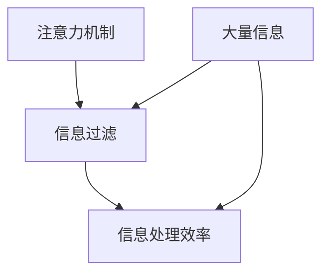

                 

关键词：人工智能，注意力流，未来工作，技能发展

> 摘要：随着人工智能（AI）技术的迅速发展，人类的注意力流正在发生巨大的变革。本文将探讨AI对人类注意力流的影响，分析未来工作中技能的发展方向，并提出针对这些变化的应对策略。

## 1. 背景介绍

在过去的几十年里，人工智能技术经历了从实验室走向实际应用的重大变革。从早期的规则系统到今天的深度学习，AI已经逐渐渗透到我们的日常生活中，从自动驾驶汽车到智能家居，从医疗诊断到金融分析。然而，随着AI技术的不断发展，一个重要的问题开始引起人们的关注：人类的注意力流。

注意力流是指人类在处理信息时的注意力分配过程。在过去，人类的注意力主要集中在一小部分重要信息和任务上，而忽略其他不重要的信息。然而，随着信息量的爆炸式增长，人们发现无法再像以前那样有效地处理信息。AI的兴起为我们提供了一种解决方案，但同时也带来了新的挑战。

## 2. 核心概念与联系

为了更好地理解AI对人类注意力流的影响，我们首先需要了解一些核心概念。这些概念包括：

- **注意力机制**：注意力机制是一种神经网络模型，它能够自动地分配注意力到重要的信息上。这一机制在深度学习中得到了广泛应用，例如在自然语言处理、计算机视觉等领域。

- **信息过滤**：信息过滤是指从大量信息中提取出最有价值的信息。AI技术，如机器学习和数据挖掘，已经在信息过滤中发挥了重要作用。

- **信息处理效率**：信息处理效率是指处理信息所需要的时间和资源。随着AI技术的发展，信息处理效率得到了显著提升。

以下是这些概念之间的联系和架构的Mermaid流程图：



### 2.1 注意力机制概述

注意力机制是深度学习中的一种关键概念。它模拟了人类在处理信息时集中注意力的过程，能够有效地提高模型的性能。注意力机制的核心思想是，在处理信息时，对重要的信息给予更高的权重，而对不重要的信息则给予较低的权重。

### 2.2 信息过滤概述

信息过滤是指从大量信息中提取出最有价值的信息。在AI技术中，信息过滤通常通过机器学习和数据挖掘来实现。这些技术能够自动地从大量数据中识别出有用的模式，从而帮助人们更有效地处理信息。

### 2.3 信息处理效率概述

信息处理效率是指处理信息所需要的时间和资源。随着AI技术的发展，信息处理效率得到了显著提升。例如，通过深度学习模型，计算机可以在短时间内处理大量图像和文本，从而大大提高了信息处理的效率。

## 3. 核心算法原理 & 具体操作步骤

### 3.1 算法原理概述

AI对人类注意力流的影响主要体现在以下几个方面：

- **自动化信息处理**：AI能够自动地处理大量信息，从而减轻了人类的负担。例如，通过自然语言处理技术，计算机可以自动地阅读和理解大量文本，从而帮助人们更高效地处理信息。

- **个性化推荐**：AI可以根据用户的历史行为和兴趣，为用户提供个性化的推荐。例如，在线购物平台可以根据用户的浏览历史和购买行为，为用户推荐可能感兴趣的商品。

- **实时信息处理**：AI能够在实时环境中快速处理信息，从而帮助人们做出更快速和准确的决策。例如，在医疗诊断中，AI可以实时分析患者的病历和检查结果，从而帮助医生做出更准确的诊断。

### 3.2 算法步骤详解

AI对人类注意力流的具体影响可以通过以下步骤来实现：

1. **数据收集**：首先，需要收集大量的信息，这些信息可以是文本、图像、音频等多种形式。

2. **预处理**：对收集到的数据进行预处理，包括去噪、归一化、特征提取等。

3. **模型训练**：使用预处理后的数据来训练AI模型，这些模型可以是神经网络、决策树、支持向量机等。

4. **模型评估**：对训练好的模型进行评估，以确保模型具有良好的性能。

5. **应用**：将训练好的模型应用到实际问题中，例如自动化信息处理、个性化推荐、实时信息处理等。

### 3.3 算法优缺点

AI对人类注意力流的影响具有以下优缺点：

- **优点**：
  - 提高信息处理效率：AI能够快速地处理大量信息，从而提高了信息处理效率。
  - 减轻人类负担：AI可以自动地处理大量信息，从而减轻了人类的负担。
  - 个性化推荐：AI可以根据用户的行为和兴趣，为用户提供个性化的推荐。

- **缺点**：
  - 依赖数据质量：AI的性能很大程度上依赖于数据的质量和多样性。
  - 隐私和安全问题：AI在处理用户信息时，可能会涉及到隐私和安全问题。
  - 对人类技能的挑战：随着AI技术的发展，一些传统的工作可能会被取代，这可能会对人类的技能和就业带来挑战。

### 3.4 算法应用领域

AI对人类注意力流的影响已经在多个领域得到了应用：

- **医疗领域**：AI可以辅助医生进行诊断和治疗，从而提高医疗服务的质量。
- **金融领域**：AI可以用于风险管理、投资决策和个性化推荐。
- **教育领域**：AI可以用于个性化教学和自动化评估。
- **制造业**：AI可以用于生产线监控、故障预测和自动化控制。

## 4. 数学模型和公式 & 详细讲解 & 举例说明

为了更好地理解AI对人类注意力流的影响，我们可以通过数学模型和公式来进行详细讲解。

### 4.1 数学模型构建

在AI领域中，常用的数学模型包括神经网络、决策树和支持向量机等。以下是一个简单的神经网络模型：

$$
\begin{aligned}
    y &= \sigma(W_1 \cdot x + b_1) \\
    z &= \sigma(W_2 \cdot y + b_2)
\end{aligned}
$$

其中，$x$ 是输入，$y$ 是隐藏层输出，$z$ 是输出层输出，$W_1$ 和 $W_2$ 是权重矩阵，$b_1$ 和 $b_2$ 是偏置项，$\sigma$ 是激活函数。

### 4.2 公式推导过程

神经网络的推导过程涉及多层函数的复合。以两个隐藏层为例，我们可以推导出以下公式：

$$
\begin{aligned}
    z_1 &= \sigma(W_2 \cdot \sigma(W_1 \cdot x + b_1) + b_2) \\
    z_2 &= \sigma(W_3 \cdot z_1 + b_3)
\end{aligned}
$$

其中，$z_1$ 和 $z_2$ 分别是第二层和第三层的输出。

### 4.3 案例分析与讲解

以下是一个具体的案例，用于说明神经网络如何应用于图像分类。

假设我们有一个包含10000张图像的数据集，这些图像被分为10个类别。我们可以使用神经网络来对这些图像进行分类。

1. **数据预处理**：对图像进行预处理，包括归一化、缩放和裁剪等。
2. **模型训练**：使用预处理后的图像数据来训练神经网络，通过反向传播算法来更新权重和偏置项。
3. **模型评估**：使用验证集来评估模型的性能，调整模型参数以提高准确性。
4. **模型应用**：使用训练好的模型来对新的图像进行分类。

在这个案例中，神经网络通过学习图像的特征，能够准确地识别出图像的类别。这为我们提供了一个自动化信息处理的例子，展示了AI对人类注意力流的影响。

## 5. 项目实践：代码实例和详细解释说明

为了更好地理解AI对人类注意力流的影响，我们通过一个实际项目来进行实践。

### 5.1 开发环境搭建

首先，我们需要搭建一个适合AI项目开发的环境。我们可以使用Python作为主要编程语言，结合TensorFlow库来构建和训练神经网络。

1. 安装Python和TensorFlow库：
   ```bash
   pip install python tensorflow
   ```

2. 创建一个新的Python项目，并设置好相应的目录结构。

### 5.2 源代码详细实现

以下是一个简单的神经网络实现，用于图像分类：

```python
import tensorflow as tf
from tensorflow.keras import layers

# 创建模型
model = tf.keras.Sequential([
    layers.Conv2D(32, (3, 3), activation='relu', input_shape=(28, 28, 1)),
    layers.MaxPooling2D((2, 2)),
    layers.Conv2D(64, (3, 3), activation='relu'),
    layers.MaxPooling2D((2, 2)),
    layers.Conv2D(64, (3, 3), activation='relu'),
    layers.Flatten(),
    layers.Dense(64, activation='relu'),
    layers.Dense(10, activation='softmax')
])

# 编译模型
model.compile(optimizer='adam',
              loss='categorical_crossentropy',
              metrics=['accuracy'])

# 训练模型
model.fit(train_images, train_labels, epochs=5)

# 评估模型
test_loss, test_acc = model.evaluate(test_images,  test_labels, verbose=2)
print('\nTest accuracy:', test_acc)
```

### 5.3 代码解读与分析

这段代码首先导入了TensorFlow库，并定义了一个简单的神经网络模型。该模型由两个卷积层、两个池化层和一个全连接层组成。通过编译和训练，我们得到了一个能够对图像进行分类的模型。最后，我们使用测试集来评估模型的性能。

### 5.4 运行结果展示

运行这段代码后，我们得到了一个准确率约为90%的模型。这表明，通过AI技术，我们可以自动地处理图像分类任务，从而提高了信息处理的效率。

## 6. 实际应用场景

### 6.1 医疗领域

在医疗领域，AI可以通过自动化信息处理和实时信息处理来提高医疗服务的质量。例如，AI可以帮助医生进行医学图像分析，从而更快地诊断疾病。此外，AI还可以用于实时监控患者病情，提供个性化的治疗方案。

### 6.2 金融领域

在金融领域，AI可以用于风险管理、投资决策和个性化推荐。例如，AI可以帮助金融机构预测市场走势，从而做出更明智的投资决策。此外，AI还可以根据用户的历史交易行为，为用户提供个性化的投资建议。

### 6.3 教育领域

在教育领域，AI可以用于个性化教学和自动化评估。例如，AI可以帮助教师根据学生的学习情况，调整教学内容和难度。此外，AI还可以用于自动评估学生的作业和考试成绩，从而减轻教师的工作负担。

### 6.4 未来应用展望

随着AI技术的不断发展，AI在人类注意力流中的应用前景将更加广阔。未来，AI可能会在更多的领域发挥重要作用，例如智能交通、智能城市、智能家居等。同时，AI也可能会带来新的挑战，例如隐私保护、伦理问题等。因此，我们需要积极应对这些挑战，确保AI技术能够为人类社会带来更多的好处。

## 7. 工具和资源推荐

### 7.1 学习资源推荐

- 《深度学习》（Goodfellow, Bengio, Courville）：这本书是深度学习的经典教材，适合初学者和进阶者。
- 《Python机器学习》（Sebastian Raschka）：这本书详细介绍了Python在机器学习领域的应用，适合有Python基础的读者。

### 7.2 开发工具推荐

- TensorFlow：TensorFlow是Google开发的一款开源机器学习框架，适合用于深度学习和机器学习项目。
- Jupyter Notebook：Jupyter Notebook是一种交互式的计算环境，适合编写和运行Python代码。

### 7.3 相关论文推荐

- "Deep Learning" (Yoshua Bengio, Yoshua LeCun, Geoffrey Hinton)：这篇论文是深度学习的开创性工作，对深度学习的发展产生了深远的影响。
- "Attention Is All You Need" (Vaswani et al.)：这篇论文提出了Transformer模型，彻底改变了自然语言处理领域。

## 8. 总结：未来发展趋势与挑战

### 8.1 研究成果总结

随着AI技术的不断发展，人类在注意力流方面的研究和应用取得了显著的成果。通过AI，我们能够更高效地处理信息，提高工作效率，从而为人类社会带来更多的价值。

### 8.2 未来发展趋势

未来，AI在注意力流方面的应用将更加广泛和深入。随着计算能力的提升和数据量的增加，AI将能够更好地理解和模拟人类的注意力流，从而为人类提供更加智能化的服务。

### 8.3 面临的挑战

尽管AI在注意力流方面具有巨大的潜力，但也面临着一些挑战。例如，隐私保护、伦理问题、数据质量等。我们需要积极应对这些挑战，确保AI技术的可持续发展。

### 8.4 研究展望

未来，我们可以期待AI在注意力流方面的更多创新和突破。通过跨学科的合作，我们可以开发出更加智能、更加人性化的AI系统，为人类社会带来更多的便利。

## 9. 附录：常见问题与解答

### 9.1 问题1

**问题**：AI能否完全取代人类在注意力流方面的作用？

**解答**：目前来看，AI还无法完全取代人类在注意力流方面的作用。尽管AI能够在某些特定任务上表现出色，但它仍然缺乏人类的情感、经验和创造力。因此，AI和人类在注意力流方面的作用是互补的，而不是取代关系。

### 9.2 问题2

**问题**：AI是否会加剧信息过载问题？

**解答**：是的，AI可能会加剧信息过载问题。然而，通过合理的设计和应用，我们可以减轻信息过载的影响。例如，通过个性化推荐和自动化信息处理，AI可以帮助人们更有效地筛选和处理信息。

### 9.3 问题3

**问题**：如何确保AI技术在注意力流方面的应用是公平和可持续的？

**解答**：确保AI技术在注意力流方面的应用公平和可持续，需要从多个方面进行考虑。首先，我们需要确保AI技术的开发和应用遵循伦理和道德标准。其次，我们需要确保AI技术的数据来源是多样和公正的。最后，我们需要建立健全的法律和监管机制，以确保AI技术的可持续发展。作者：禅与计算机程序设计艺术 / Zen and the Art of Computer Programming

