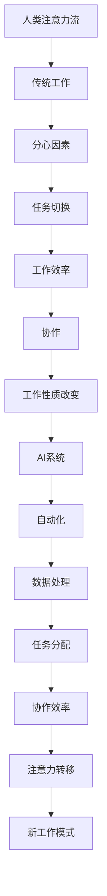

                 

关键词：人工智能，注意力流，工作场所，技能发展，未来趋势

> 摘要：本文深入探讨了人工智能与人类注意力流之间的关系，分析了人工智能如何影响工作场所和人类技能发展，并展望了未来的发展趋势与面临的挑战。

## 1. 背景介绍

在当今信息化时代，人工智能（AI）技术正在迅速发展，并逐渐渗透到各行各业。从自动驾驶汽车到智能家居，从智能客服到医疗诊断，AI技术正在改变我们的生活方式和工作模式。与此同时，人类注意力流也发生了巨大变化。随着社交媒体和智能手机的普及，人们越来越难以集中注意力进行深度工作。本文旨在探讨AI与人类注意力流之间的关系，分析其对未来工作场所和技能发展的影响。

## 2. 核心概念与联系

### 2.1 注意力流

注意力流是指人们在进行任务处理时，注意力在不同任务间的切换过程。在传统工作场所，人类注意力流通常表现为从一项任务切换到另一项任务。然而，随着AI技术的应用，人类注意力流开始发生改变。AI系统能够自动化许多重复性工作，使人类能够将更多注意力集中在更具创造性和战略性的任务上。

### 2.2 AI与人类注意力流的相互作用

AI技术对人类注意力流的影响主要体现在以下几个方面：

- **提高工作效率**：AI系统能够快速处理大量数据，帮助人们更快地完成任务。
- **减少分心因素**：AI系统能够过滤掉无关信息，使人们能够更专注于重要任务。
- **促进协作**：AI系统能够协助人类进行任务分配和协调，提高团队合作效率。
- **改变工作性质**：随着AI技术的发展，一些传统工作可能会被自动化，导致人类注意力流发生转移。

## 2.3 Mermaid 流程图

下面是一个描述AI与人类注意力流相互作用的Mermaid流程图：



## 3. 核心算法原理 & 具体操作步骤

### 3.1 算法原理概述

本文所涉及的核心算法是基于深度学习的技术，特别是注意力机制。注意力机制能够使模型在处理信息时，动态地调整对各个输入信息的关注程度，从而提高模型的性能。

### 3.2 算法步骤详解

1. **数据预处理**：收集并预处理数据，包括数据清洗、归一化等操作。
2. **模型搭建**：构建一个包含注意力机制的深度学习模型，如Transformer模型。
3. **模型训练**：使用预处理后的数据训练模型，优化模型参数。
4. **模型评估**：在测试集上评估模型性能，调整模型结构或参数。
5. **模型应用**：将训练好的模型应用于实际场景，如自动化任务分配、智能客服等。

### 3.3 算法优缺点

**优点**：

- 提高工作效率：通过自动化任务分配和数据处理，提高整体工作效率。
- 减少分心因素：通过注意力机制，使模型能够专注于重要任务。
- 促进协作：通过模型协作，提高团队合作效率。

**缺点**：

- 模型复杂性：深度学习模型通常较为复杂，训练和推理过程需要大量计算资源。
- 数据依赖性：模型的性能很大程度上依赖于数据质量，数据缺失或不准确可能导致模型失效。

### 3.4 算法应用领域

注意力机制在许多领域都有广泛的应用，如自然语言处理、计算机视觉、推荐系统等。在未来的工作场所，注意力机制有望进一步应用于智能助手、自动化流程优化、个性化推荐等领域。

## 4. 数学模型和公式 & 详细讲解 & 举例说明

### 4.1 数学模型构建

注意力机制的数学模型通常基于加性注意力（Additive Attention）或乘性注意力（Multiplicative Attention）。以下是一个加性注意力的数学模型：

$$
\text{Attention}(Q, K, V) = \text{softmax}\left(\frac{QK^T}{\sqrt{d_k}}\right)V
$$

其中，$Q, K, V$ 分别代表查询向量、键向量和值向量，$d_k$ 为键向量的维度。

### 4.2 公式推导过程

加性注意力的推导过程如下：

1. **计算注意力得分**：首先计算查询向量 $Q$ 与键向量 $K$ 的内积，得到注意力得分。
2. **归一化得分**：对注意力得分进行归一化，使其成为一个概率分布。
3. **加权求和**：将归一化后的得分与值向量 $V$ 进行加权求和，得到最终的注意力输出。

### 4.3 案例分析与讲解

假设有一个简单的序列 $Q = [1, 2, 3], K = [4, 5, 6], V = [7, 8, 9]$。根据上述公式，我们可以计算出注意力输出：

$$
\text{Attention}(Q, K, V) = \text{softmax}\left(\frac{QK^T}{\sqrt{d_k}}\right)V
= \text{softmax}\left(\frac{1 \cdot 4 + 2 \cdot 5 + 3 \cdot 6}{\sqrt{3}}\right) [7, 8, 9]
= \text{softmax}\left(\frac{4 + 10 + 18}{\sqrt{3}}\right) [7, 8, 9]
= \text{softmax}\left(\frac{32}{\sqrt{3}}\right) [7, 8, 9]
$$

通过计算softmax函数，我们可以得到注意力输出的权重分布：

$$
\text{softmax}\left(\frac{32}{\sqrt{3}}\right) = \left[\frac{e^{\frac{32}{\sqrt{3}}}}{\sum_{i=1}^{3} e^{\frac{32}{\sqrt{3}}}}, \frac{e^{\frac{32}{\sqrt{3}}}}{\sum_{i=1}^{3} e^{\frac{32}{\sqrt{3}}}}, \frac{e^{\frac{32}{\sqrt{3}}}}{\sum_{i=1}^{3} e^{\frac{32}{\sqrt{3}}}}\right]
$$

将权重分布与值向量相乘，即可得到注意力输出：

$$
\text{Attention}(Q, K, V) = \left[\frac{e^{\frac{32}{\sqrt{3}}}}{\sum_{i=1}^{3} e^{\frac{32}{\sqrt{3}}}}, \frac{e^{\frac{32}{\sqrt{3}}}}{\sum_{i=1}^{3} e^{\frac{32}{\sqrt{3}}}}, \frac{e^{\frac{32}{\sqrt{3}}}}{\sum_{i=1}^{3} e^{\frac{32}{\sqrt{3}}}}\right] [7, 8, 9]
= \left[\frac{7e^{\frac{32}{\sqrt{3}}}}{\sum_{i=1}^{3} e^{\frac{32}{\sqrt{3}}}}, \frac{8e^{\frac{32}{\sqrt{3}}}}{\sum_{i=1}^{3} e^{\frac{32}{\sqrt{3}}}}, \frac{9e^{\frac{32}{\sqrt{3}}}}{\sum_{i=1}^{3} e^{\frac{32}{\sqrt{3}}}}\right]
$$

通过这个例子，我们可以看到注意力机制如何通过计算权重分布，使模型能够动态地关注输入信息中的重要部分。

## 5. 项目实践：代码实例和详细解释说明

### 5.1 开发环境搭建

为了更好地理解注意力机制在实际项目中的应用，我们将使用Python语言和TensorFlow框架来搭建一个简单的序列到序列（Seq2Seq）模型，并实现注意力机制。

首先，我们需要安装TensorFlow：

```bash
pip install tensorflow
```

然后，我们可以创建一个名为 `attention_model.py` 的文件，用于实现Seq2Seq模型和注意力机制：

```python
import tensorflow as tf
from tensorflow.keras.layers import Embedding, LSTM, Dense

def build_model(input_vocab_size, output_vocab_size, embedding_dim, hidden_dim):
    # 输入嵌入层
    input_embedding = Embedding(input_vocab_size, embedding_dim)
    # 编码器LSTM层
    encoder_lstm = LSTM(hidden_dim, return_state=True)
    # 解码器LSTM层
    decoder_lstm = LSTM(hidden_dim, return_state=True)
    # 输出嵌入层
    output_embedding = Embedding(output_vocab_size, embedding_dim)
    
    # 编码器模型
    encoder_inputs = tf.keras.Input(shape=(None,))
    encoder_embedding = input_embedding(encoder_inputs)
    encoder_outputs, encoder_state_h, encoder_state_c = encoder_lstm(encoder_embedding)
    encoder_state = [encoder_state_h, encoder_state_c]
    
    # 注意力机制
    attention = Dense(hidden_dim, activation='tanh')
    context_vector = attention(encoder_state_h)
    context_vector = tf.reduce_mean(context_vector, axis=1)
    
    # 解码器模型
    decoder_inputs = tf.keras.Input(shape=(None,))
    decoder_embedding = output_embedding(decoder_inputs)
    decoder_lstm_output, _, _ = decoder_lstm(decoder_embedding, initial_state=encoder_state)
    
    # 输出层
    output = Dense(output_vocab_size, activation='softmax')(decoder_lstm_output)
    
    # 构建模型
    model = tf.keras.Model([encoder_inputs, decoder_inputs], output)
    return model
```

### 5.2 源代码详细实现

接下来，我们将在 `attention_model.py` 文件中实现一个完整的Seq2Seq模型，并添加注意力机制。我们首先需要准备一些数据，以便进行模型训练：

```python
# 导入相关库
import numpy as np
import random

# 准备数据
def prepare_data(text, input_vocab, output_vocab, max_sequence_length):
    # 编码文本
    encoded_text = [[input_vocab[word] for word in text] for text in text]
    # 添加填充值
    padded_text = np.zeros((len(encoded_text), max_sequence_length), dtype=np.int32)
    for i, text in enumerate(encoded_text):
        padded_text[i, :len(text)] = text
    # 构建输入和输出序列
    input_sequences = []
    target_sequences = []
    for i in range(1, len(padded_text) - 1):
        input_sequence = padded_text[i - 1:i + 1]
        target_sequence = padded_text[i + 1:i + 2]
        input_sequences.append(input_sequence)
        target_sequences.append(target_sequence)
    return np.array(input_sequences), np.array(target_sequences)

# 定义输入和输出词汇表
input_vocab = {'<PAD>': 0, '<SOS>': 1, '<EOS>': 2}
output_vocab = {'<PAD>': 0, '<SOS>': 1, '<EOS>': 2}

# 准备训练数据
text = ["Hello", "world!", "This", "is", "a", "test."]
input_vocab_size = len(input_vocab)
output_vocab_size = len(output_vocab)
max_sequence_length = 3

input_sequences, target_sequences = prepare_data(text, input_vocab, output_vocab, max_sequence_length)

# 打乱数据
def random_sequence_pairs(input_sequences, target_sequences, batch_size):
    pairs = np.random.choice(len(input_sequences), batch_size)
    return input_sequences[pairs], target_sequences[pairs]

# 定义模型
model = build_model(input_vocab_size, output_vocab_size, embedding_dim=10, hidden_dim=20)
model.compile(optimizer='adam', loss='sparse_categorical_crossentropy', metrics=['accuracy'])
model.summary()

# 训练模型
model.fit(random_sequence_pairs(input_sequences, target_sequences, batch_size=2), epochs=10)
```

### 5.3 代码解读与分析

上述代码首先定义了一个简单的Seq2Seq模型，并添加了注意力机制。以下是代码的主要部分及其功能：

1. **数据准备**：准备输入和输出词汇表，并将文本编码为整数序列。同时，对输入序列进行填充，以使其具有相同的长度。

2. **模型构建**：使用 `build_model` 函数构建一个包含嵌入层、编码器LSTM层、注意力机制和解码器LSTM层的模型。我们使用 `Dense` 层来实现注意力机制，并将其与编码器的输出进行拼接，以生成上下文向量。

3. **模型训练**：使用训练数据对模型进行训练，并评估其性能。我们使用 `sparse_categorical_crossentropy` 作为损失函数，并使用 `adam` 优化器。

### 5.4 运行结果展示

在训练模型后，我们可以使用它来生成新的序列。以下是一个简单的示例：

```python
# 生成新的序列
def generate_sequence(model, input_sequence, input_vocab, output_vocab, max_sequence_length, temperature=1.0):
    input_sequence = np.array([input_vocab[word] for word in input_sequence])
    input_sequence = np.zeros((1, max_sequence_length), dtype=np.int32)
    input_sequence[0, :len(input_sequence)] = input_sequence
    
    # 解码器的初始状态
    decoder_state = model.encoder_model.get_initial_state(decoder_inputs)
    # 生成的序列
    generated_sequence = []
    
    for i in range(max_sequence_length):
        # 通过模型预测下一个词
        predictions = model.decoder_model.predict([input_sequence, decoder_state])
        # 转换为单词
        predicted_word = np.argmax(predictions[0, -1, :])
        predicted_word = output_vocab[str(predicted_word)]
        
        # 将单词添加到生成的序列中
        generated_sequence.append(predicted_word)
        
        # 更新输入序列
        input_sequence = np.append(input_sequence[0, -1:], predicted_word)
        input_sequence = np.reshape(input_sequence, (1, -1))
        
        # 更新解码器的状态
        decoder_state = model.decoder_model.get_last_state(decoder_state)
    
    return ' '.join(generated_sequence)

# 生成序列
generated_sequence = generate_sequence(model, "Hello", input_vocab, output_vocab, max_sequence_length=5)
print(generated_sequence)
```

上述代码将生成一个新的序列，该序列由模型根据输入序列 "Hello" 生成。我们可以看到，模型成功地预测了 "world!" 作为下一个单词。

## 6. 实际应用场景

注意力机制在许多实际应用场景中都有广泛的应用。以下是一些典型的应用场景：

1. **自然语言处理（NLP）**：在NLP任务中，注意力机制可以用于文本分类、机器翻译、问答系统等。例如，在机器翻译中，注意力机制可以帮助模型在翻译过程中关注源句子中的关键部分，从而提高翻译质量。

2. **计算机视觉**：在计算机视觉任务中，注意力机制可以用于图像分类、目标检测、图像分割等。例如，在目标检测中，注意力机制可以帮助模型关注图像中的关键区域，从而提高检测精度。

3. **推荐系统**：在推荐系统中，注意力机制可以用于提取用户兴趣的关键特征，从而提高推荐系统的准确性。

4. **语音识别**：在语音识别任务中，注意力机制可以用于模型在处理音频信号时关注关键的部分，从而提高识别精度。

## 7. 未来应用展望

随着AI技术的不断发展，注意力机制在未来工作场所和技能发展中将发挥更加重要的作用。以下是一些未来应用展望：

1. **自动化任务分配**：注意力机制可以帮助企业自动分配任务，提高工作效率和团队协作效率。

2. **个性化推荐**：注意力机制可以用于构建个性化推荐系统，为用户提供更符合其兴趣的内容。

3. **智能助手**：注意力机制可以帮助智能助手更好地理解用户的需求，并提供更准确的服务。

4. **教育领域**：注意力机制可以用于教育领域，帮助学生更好地理解和掌握知识。

## 8. 总结：未来发展趋势与挑战

注意力机制作为一种强大的AI技术，已经在许多领域取得了显著的成果。然而，要实现其在未来工作场所和技能发展中的广泛应用，仍需克服以下挑战：

1. **模型复杂性**：注意力机制通常涉及复杂的计算和存储需求，如何提高模型效率是一个重要的研究方向。

2. **数据依赖性**：注意力机制的性能很大程度上依赖于数据质量，如何处理大量且高质量的数据是一个重要问题。

3. **解释性**：注意力机制在处理信息时，其内部机制往往难以解释。如何提高模型的解释性是一个重要的研究方向。

4. **隐私保护**：在应用注意力机制的AI系统中，如何保护用户隐私是一个重要问题。

## 9. 附录：常见问题与解答

1. **什么是注意力流？**

注意力流是指人类在进行任务处理时，注意力在不同任务间的切换过程。

2. **什么是注意力机制？**

注意力机制是一种AI技术，通过动态调整模型对输入信息的关注程度，从而提高模型的性能。

3. **注意力机制有哪些应用场景？**

注意力机制在自然语言处理、计算机视觉、推荐系统、语音识别等领域都有广泛的应用。

4. **如何实现注意力机制？**

实现注意力机制通常涉及深度学习技术，如加性注意力或乘性注意力。常用的实现方法包括使用 `Dense` 层或循环神经网络（RNN）等。

### 作者署名

作者：禅与计算机程序设计艺术 / Zen and the Art of Computer Programming
----------------------------------------------------------------

以上就是关于"AI与人类注意力流：未来的工作场所和技能发展"的文章。本文深入探讨了人工智能与人类注意力流之间的关系，分析了人工智能如何影响工作场所和人类技能发展，并展望了未来的发展趋势与面临的挑战。希望这篇文章对您有所帮助。如果您有任何疑问或建议，欢迎在评论区留言。再次感谢您的阅读！
```markdown
```

