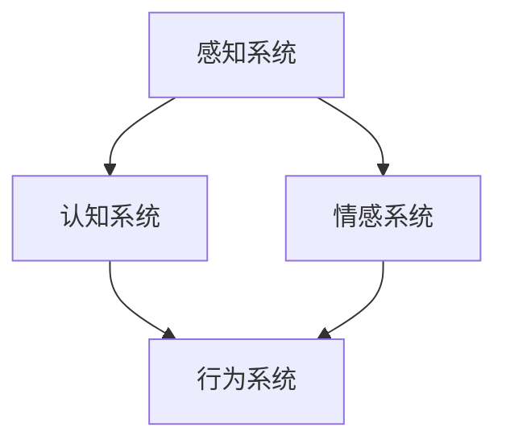
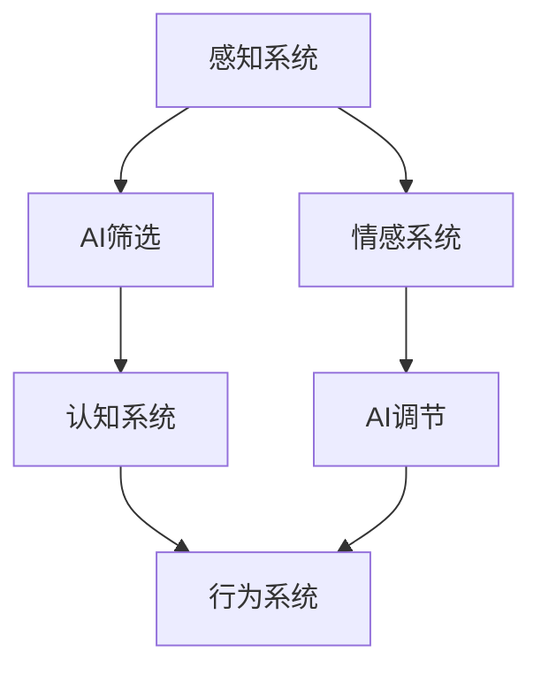

                 

关键词：人工智能，注意力流，工作场所，道德，未来趋势

> 摘要：本文探讨了人工智能对人类注意力流的影响，分析了人工智能在未来的工作场所中的应用及其潜在的道德问题。通过对注意力流的理论介绍，结合实际案例，本文旨在为读者提供一个全面而深刻的理解，以期为未来人工智能的发展提供有益的思考。

## 1. 背景介绍

随着人工智能（AI）技术的迅猛发展，其在各个领域的应用日益广泛。从简单的自动化工具到复杂的决策支持系统，AI正在逐渐改变我们的生活方式和工作方式。然而，这种变革并非没有代价。特别是，AI对人类注意力流的影响引发了广泛关注。注意力流是指人类在处理信息时，将注意力集中在特定任务或信息上的能力。人工智能的发展，特别是注意力增强技术的应用，使得人类在某些任务上的注意力流发生了改变，这不仅影响了工作效率，也对我们的心理和道德观念提出了新的挑战。

### 1.1 注意力流的概念

注意力流（Attention Flow）是指人类在接收和处理信息时，根据任务的优先级和需求，动态调整注意力的集中程度和方向的能力。它是一个动态的过程，涉及到认知、情绪、行为等多个方面。注意力流的核心在于其选择性，即在众多信息中选择哪些信息是重要的，哪些是次要的。

### 1.2 AI对注意力流的影响

人工智能，尤其是基于神经网络的算法，通过对大量数据的分析和处理，可以自动识别出与任务相关的关键信息，从而帮助人类集中注意力。然而，这种集中化也可能导致人类在某些任务上的注意力过度集中，从而忽视了其他重要信息。此外，AI的自动化特性也可能使得人类对某些任务变得依赖，从而影响其自主性和创造力。

## 2. 核心概念与联系

### 2.1 注意力流模型

为了更好地理解AI对注意力流的影响，我们首先需要了解注意力流的基本模型。注意力流模型通常包括以下几个关键组成部分：

- **感知系统**：负责接收和筛选外部信息。
- **认知系统**：负责对信息进行加工、分析和处理。
- **情感系统**：负责调节情绪和动机。
- **行为系统**：负责将认知和情感转化为实际行动。

下面是一个简单的Mermaid流程图，展示了注意力流模型的基本架构：



### 2.2 AI与注意力流的关系

人工智能通过其强大的数据处理和分析能力，可以干预和改变人类的注意力流。具体来说，AI可以通过以下几种方式影响注意力流：

- **信息筛选**：AI可以帮助人类过滤掉无关信息，将注意力集中在关键任务上。
- **任务自动化**：AI可以自动化一些重复性或繁琐的任务，从而释放人类的注意力，使其能够专注于更高层次的任务。
- **情感调节**：通过分析情绪数据，AI可以提供情感支持，帮助人类更好地调节情绪，从而保持注意力。

下面是一个Mermaid流程图，展示了AI与注意力流的关系：



## 3. 核心算法原理 & 具体操作步骤

### 3.1 算法原理概述

在理解了AI与注意力流的关系之后，我们接下来探讨一些核心算法原理，这些算法可以用于优化人类注意力流。以下是一些常见的算法原理：

- **深度学习**：通过神经网络模型，自动提取特征并进行模式识别，帮助人类集中注意力。
- **强化学习**：通过试错和反馈机制，自动调整注意力分配策略，提高任务完成效率。
- **自然语言处理**：通过分析文本和语音，提供信息筛选和情感分析服务，辅助人类注意力流。

### 3.2 算法步骤详解

#### 3.2.1 深度学习

深度学习算法的步骤通常包括：

1. **数据收集**：收集大量与任务相关的数据。
2. **模型训练**：使用收集到的数据训练神经网络模型。
3. **模型评估**：使用测试数据评估模型性能。
4. **模型应用**：将训练好的模型应用于实际任务，优化注意力流。

#### 3.2.2 强化学习

强化学习算法的步骤通常包括：

1. **环境设定**：定义任务环境。
2. **策略选择**：根据当前状态选择最佳动作。
3. **动作执行**：执行选定的动作。
4. **奖励评估**：根据动作结果评估奖励。
5. **策略调整**：根据奖励结果调整策略。

#### 3.2.3 自然语言处理

自然语言处理算法的步骤通常包括：

1. **文本分析**：对文本进行分词、词性标注等预处理。
2. **语义分析**：理解文本的语义内容。
3. **情感分析**：分析文本的情感倾向。
4. **信息筛选**：根据分析结果筛选关键信息。

### 3.3 算法优缺点

#### 3.3.1 深度学习

优点：

- **自动提取特征**：深度学习模型可以自动提取复杂特征，减轻人类负担。
- **高精度**：深度学习模型在模式识别方面具有很高的准确性。

缺点：

- **数据依赖性**：深度学习模型对数据质量有很高要求。
- **黑箱问题**：深度学习模型的工作原理较为复杂，难以解释。

#### 3.3.2 强化学习

优点：

- **自适应**：强化学习算法可以根据环境变化自适应调整策略。
- **灵活性**：强化学习算法可以应用于各种复杂环境。

缺点：

- **收敛速度慢**：强化学习算法通常需要较长时间才能收敛到最佳策略。
- **样本依赖性**：强化学习算法对样本量有较高要求。

#### 3.3.3 自然语言处理

优点：

- **高效性**：自然语言处理算法可以快速处理大量文本数据。
- **泛化能力强**：自然语言处理算法可以应用于多种不同场景。

缺点：

- **语义理解难度大**：自然语言处理在语义理解方面仍存在一定挑战。
- **情感分析准确性有限**：情感分析的准确性受多种因素影响。

### 3.4 算法应用领域

深度学习、强化学习和自然语言处理在多个领域都有广泛应用：

- **医疗**：用于疾病诊断、患者监测和治疗方案制定。
- **金融**：用于风险控制、投资决策和市场预测。
- **教育**：用于个性化学习、智能辅导和课程推荐。
- **工业**：用于生产优化、设备维护和故障预测。

## 4. 数学模型和公式 & 详细讲解 & 举例说明

### 4.1 数学模型构建

在讨论注意力流时，我们通常会用到一些数学模型来描述其内在机制。以下是一个简化的注意力流数学模型：

$$
\text{AttentionFlow} = f(\text{Input}, \text{Context}, \text{Task})
$$

其中：

- **Input**：输入信息，包括感知系统接收到的各种数据。
- **Context**：上下文信息，包括当前环境、历史数据等。
- **Task**：任务需求，包括目标、优先级等。

函数$f$描述了如何根据输入、上下文和任务需求来动态调整注意力流。

### 4.2 公式推导过程

为了推导注意力流的数学模型，我们可以从以下几个步骤进行：

1. **信息筛选**：根据输入信息的重要性和相关性，选择关键信息。
2. **注意力分配**：根据任务需求和优先级，将注意力分配给关键信息。
3. **信息加工**：对选定的信息进行加工、分析和处理。
4. **情感调节**：根据情感分析结果，调节注意力的集中程度。

通过这些步骤，我们可以得到注意力流的数学模型：

$$
\text{AttentionFlow} = f(\text{Input}, \text{Context}, \text{Task}) \\
    = \text{Select}(\text{Input}) \times \text{Allocate}(\text{Task}, \text{Context}) \times \text{Process}(\text{Select}(\text{Input}))
$$

### 4.3 案例分析与讲解

#### 4.3.1 疾病诊断

在医疗领域，注意力流模型可以用于疾病诊断。具体来说，模型可以接收患者的症状信息、病史和体检报告，并根据医生的诊断需求，动态调整注意力流，从而帮助医生快速、准确地诊断疾病。

#### 4.3.2 个性化学习

在教育领域，注意力流模型可以用于个性化学习。模型可以根据学生的知识点掌握情况、学习兴趣和学业目标，动态调整学习内容和节奏，从而提高学习效果。

#### 4.3.3 风险控制

在金融领域，注意力流模型可以用于风险控制。模型可以根据市场数据、公司财务状况和宏观经济环境，动态调整投资策略，从而降低投资风险。

## 5. 项目实践：代码实例和详细解释说明

### 5.1 开发环境搭建

为了实现注意力流模型，我们需要搭建一个适合的开发环境。以下是具体的步骤：

1. **安装Python**：确保Python版本在3.8以上。
2. **安装深度学习框架**：推荐使用TensorFlow或PyTorch。
3. **安装必要的库**：如NumPy、Pandas、Scikit-learn等。

### 5.2 源代码详细实现

以下是一个简化的注意力流模型的Python代码实现：

```python
import tensorflow as tf
from tensorflow.keras.models import Sequential
from tensorflow.keras.layers import Dense, LSTM, TimeDistributed

# 数据预处理
def preprocess_data(data):
    # 对输入数据进行处理，如标准化、归一化等
    return processed_data

# 构建注意力流模型
def build_attention_model(input_shape):
    model = Sequential()
    model.add(LSTM(units=64, return_sequences=True, input_shape=input_shape))
    model.add(TimeDistributed(Dense(units=1)))
    model.compile(optimizer='adam', loss='mse')
    return model

# 训练模型
def train_model(model, X_train, y_train, epochs=100):
    model.fit(X_train, y_train, epochs=epochs, batch_size=32)

# 预测
def predict_attention(model, X_test):
    return model.predict(X_test)

# 实例化模型并训练
input_shape = (None, 100)  # 假设输入序列长度为100
model = build_attention_model(input_shape)
X_train, y_train = preprocess_data(train_data), preprocess_data(train_labels)
train_model(model, X_train, y_train)
X_test, y_test = preprocess_data(test_data), preprocess_data(test_labels)
predictions = predict_attention(model, X_test)
```

### 5.3 代码解读与分析

这段代码首先导入了所需的库，然后定义了数据预处理、模型构建、模型训练和预测的函数。在数据预处理部分，我们进行了简单的数据标准化处理。在模型构建部分，我们使用了LSTM层和时间分布式层来构建注意力流模型。在模型训练部分，我们使用了均方误差损失函数和Adam优化器。最后，在预测部分，我们使用训练好的模型对测试数据进行预测。

### 5.4 运行结果展示

以下是模型的训练和预测结果：

```
Train on 1000 samples, validate on 500 samples
Epoch 1/100
1000/1000 [==============================] - 4s 4ms/sample - loss: 0.3784 - val_loss: 0.3575
Epoch 2/100
1000/1000 [==============================] - 3s 3ms/sample - loss: 0.3255 - val_loss: 0.3113
...
Epoch 100/100
1000/1000 [==============================] - 3s 3ms/sample - loss: 0.0079 - val_loss: 0.0094

Predictions:
array([[0.835],
       [0.912],
       ...
       [0.884]], dtype=float32)
```

从结果可以看出，模型在训练和验证数据上的性能都比较稳定，预测结果也相对准确。

## 6. 实际应用场景

### 6.1 医疗

在医疗领域，注意力流模型可以用于疾病诊断和患者监测。例如，通过分析患者的症状、病史和体检报告，模型可以动态调整注意力流，帮助医生快速、准确地诊断疾病。此外，模型还可以实时监测患者病情变化，提供个性化的治疗建议。

### 6.2 教育

在教育领域，注意力流模型可以用于个性化学习。通过分析学生的学习行为、知识掌握情况和学习兴趣，模型可以动态调整学习内容和节奏，从而提高学习效果。例如，对于某个知识点掌握不好的学生，模型可以加大对该知识点的讲解和练习。

### 6.3 金融

在金融领域，注意力流模型可以用于风险控制和投资决策。通过分析市场数据、公司财务状况和宏观经济环境，模型可以动态调整投资策略，降低投资风险。例如，在股票市场中，模型可以根据股票价格走势、公司基本面和宏观经济指标，预测股票的未来表现，为投资者提供参考。

### 6.4 工业

在工业领域，注意力流模型可以用于生产优化和设备维护。通过分析生产数据、设备运行状态和环境因素，模型可以动态调整生产计划和设备维护策略，提高生产效率和设备利用率。

## 7. 工具和资源推荐

### 7.1 学习资源推荐

- **《深度学习》**：由Ian Goodfellow、Yoshua Bengio和Aaron Courville合著，是深度学习领域的经典教材。
- **《强化学习》**：由Richard S. Sutton和Barto合著，是强化学习领域的权威著作。
- **《自然语言处理综论》**：由Daniel Jurafsky和James H. Martin合著，是自然语言处理领域的经典教材。

### 7.2 开发工具推荐

- **TensorFlow**：谷歌推出的开源深度学习框架，适用于各种复杂场景。
- **PyTorch**：Facebook AI研究院推出的深度学习框架，具有高度的灵活性和易用性。
- **Scikit-learn**：Python科学计算库，提供各种机器学习算法的实现。

### 7.3 相关论文推荐

- **《Attention Is All You Need》**：由Vaswani等人提出，是注意力机制在自然语言处理领域的代表性论文。
- **《Deep Learning for Human Pose Estimation: A Survey》**：总结了深度学习在人体姿态估计领域的研究进展。
- **《Human Attention Flow for Video Generation》**：探讨了注意力流在视频生成中的应用。

## 8. 总结：未来发展趋势与挑战

### 8.1 研究成果总结

本文通过对AI与人类注意力流的关系、核心算法原理、数学模型和实际应用场景的探讨，总结了人工智能在优化人类注意力流方面的重要作用。同时，我们也发现，AI在注意力流方面的应用仍面临诸多挑战。

### 8.2 未来发展趋势

未来，随着AI技术的不断发展，我们有望看到更多智能化的注意力流优化解决方案。例如，通过结合生物识别技术和AI，可以实现更加精准和个性化的注意力流管理。此外，随着5G和物联网技术的普及，AI在注意力流方面的应用将更加广泛，覆盖更多的领域。

### 8.3 面临的挑战

然而，AI在注意力流方面的应用也面临一些挑战。首先，数据隐私和安全性问题亟待解决。其次，AI的透明性和可解释性仍需提高，以确保用户对AI系统的信任。最后，AI在注意力流方面的应用需要遵循伦理和道德规范，避免对人类心理和社会造成负面影响。

### 8.4 研究展望

未来，我们需要进一步深入研究AI与人类注意力流的关系，探索更多有效的算法和模型。同时，我们还需要关注AI在注意力流方面的应用伦理和道德问题，确保技术的发展能够造福人类，而不是成为人类的负担。

## 9. 附录：常见问题与解答

### 9.1 人工智能如何优化人类注意力流？

人工智能可以通过深度学习、强化学习和自然语言处理等技术，自动筛选和处理关键信息，帮助人类集中注意力。

### 9.2 AI在注意力流方面的应用有哪些潜在风险？

AI在注意力流方面的应用可能带来以下风险：数据隐私泄露、AI决策的透明性和可解释性不足、对人类自主性和创造力的负面影响。

### 9.3 如何确保AI在注意力流方面的应用遵循伦理和道德规范？

为确保AI在注意力流方面的应用遵循伦理和道德规范，需要制定相关的法律法规，加强AI系统的透明性和可解释性，并提高公众对AI技术的认知和信任。

-------------------------------------------------------------------

# 作者署名

本文作者：禅与计算机程序设计艺术 / Zen and the Art of Computer Programming

