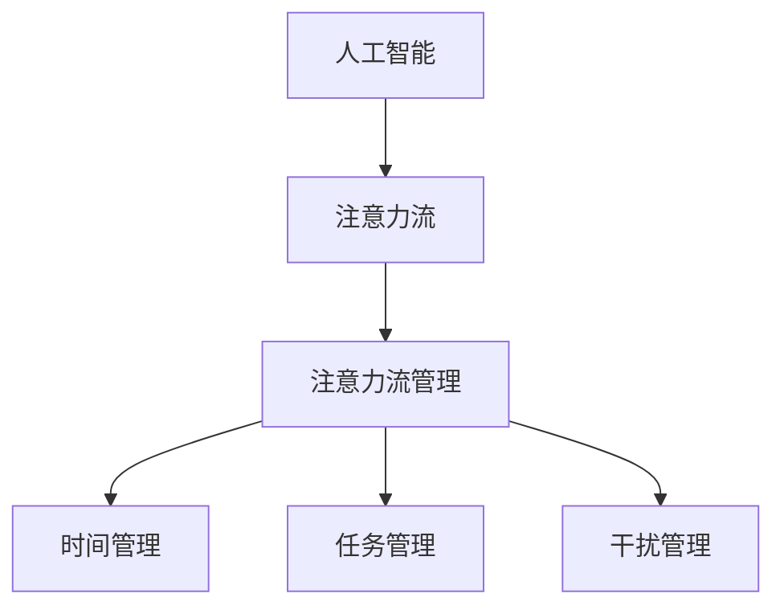
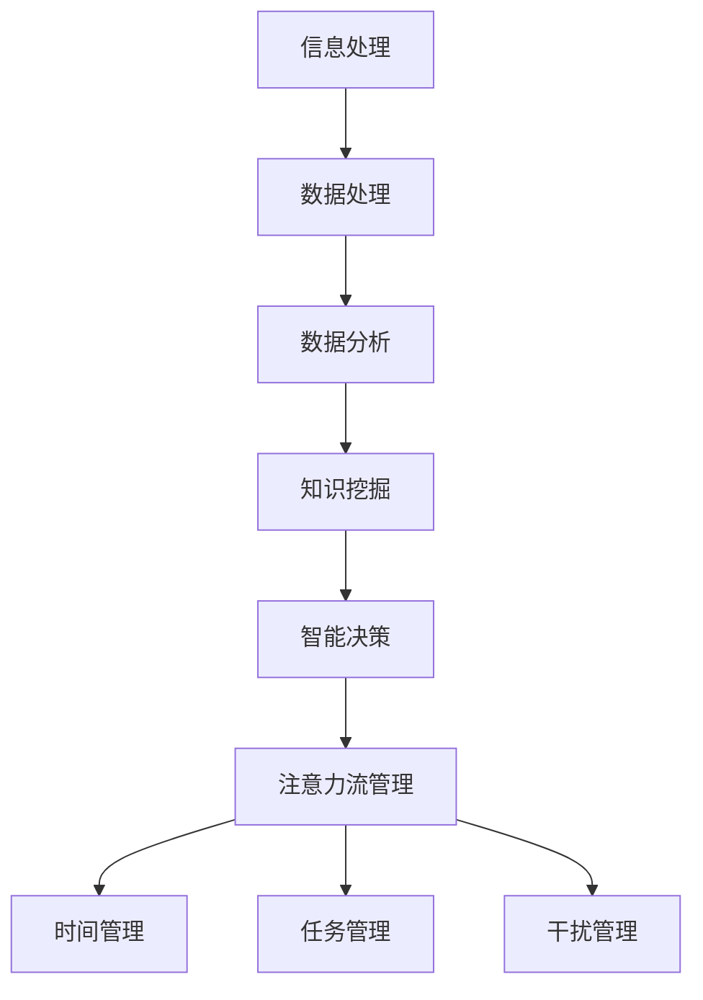

                 

关键词：人工智能，注意力流，未来工作，技能发展，注意力流管理，技术应用前景

> 摘要：本文探讨了人工智能与人类注意力流之间的关联，以及注意力流管理技术在未来的工作与技能发展中的应用前景。通过介绍核心概念、算法原理、数学模型和实际应用场景，本文旨在为读者提供一个全面而深入的洞察，帮助大家更好地理解并应对未来工作环境中可能出现的新挑战。

## 1. 背景介绍

随着人工智能技术的迅速发展，我们正在进入一个全新的时代。人工智能已经渗透到我们生活的方方面面，从简单的搜索引擎到复杂的自动驾驶系统，从智能助手到人工智能医疗诊断，无不体现着人工智能的强大力量。然而，与此同时，人们也面临着一系列新的挑战，其中一个重要的问题就是人类注意力流的改变。

注意力流是指人类在处理信息时，将注意力集中在特定目标上的能力。在传统的工业时代，人类的工作主要依赖于体力劳动和重复性操作，而现代信息时代，随着工作内容的复杂性和多样性增加，对人类注意力流的要求也日益提高。然而，现代社会的快节奏和信息过载现象，使得人类注意力流面临巨大压力。

本文将探讨人工智能如何影响人类注意力流，以及注意力流管理技术在未来的工作与技能发展中的应用前景。通过分析相关理论和实际案例，本文希望能够为读者提供一些有价值的思考和建议。

## 2. 核心概念与联系

### 2.1 人工智能与注意力流

人工智能（AI）是指通过计算机模拟人类智能的技术。它包括机器学习、深度学习、自然语言处理等多个领域。人工智能的发展极大地改变了人类的工作和生活方式，同时也对人类的注意力流产生了深远的影响。

在传统的工作环境中，人类需要花费大量的时间和精力去处理复杂的信息，而人工智能的出现可以大大减轻这一负担。例如，人工智能可以自动处理大量数据，进行复杂计算和分析，从而帮助人类将注意力集中在更有价值的工作上。然而，这也意味着人类需要适应新的工作环境，学会如何有效地管理自己的注意力流。

### 2.2 注意力流管理

注意力流管理是指通过一系列技术手段，帮助人们有效地集中注意力，提高工作效率。这包括时间管理、任务管理、干扰管理等多个方面。在人工智能时代，注意力流管理技术变得更加重要，因为人们需要处理的信息量和复杂性都增加了。

注意力流管理技术可以通过多种方式实现，例如：

- **时间管理工具**：如日历、待办事项列表等，帮助人们合理规划时间和任务。
- **任务管理工具**：如项目管理软件、协同工作平台等，帮助人们更好地组织和管理任务。
- **干扰管理技术**：如降噪耳机、屏蔽网站等，帮助人们减少干扰，集中注意力。

### 2.3 Mermaid 流程图

为了更好地理解人工智能与注意力流管理之间的联系，我们可以使用 Mermaid 流程图来展示相关概念和流程。



### 2.4 核心概念原理与架构

在进一步探讨人工智能与注意力流管理之前，我们需要明确一些核心概念和原理。以下是一个简化的 Mermaid 流程图，用于展示这些概念和它们之间的关系。



在这个流程图中，信息处理是人工智能和注意力流管理的起点，通过数据处理、数据分析和知识挖掘，最终实现智能决策。注意力流管理则是在这个过程中起到关键作用的环节，通过时间管理、任务管理和干扰管理，帮助人们更好地集中注意力，提高工作效率。

## 3. 核心算法原理 & 具体操作步骤

### 3.1 算法原理概述

注意力流管理算法的核心目标是帮助人们更好地集中注意力，提高工作效率。这个目标可以通过以下几个关键步骤来实现：

1. **注意力分配**：根据任务的优先级和复杂度，合理分配注意力资源。
2. **干扰识别**：识别并排除干扰因素，确保注意力集中在任务上。
3. **时间管理**：合理安排工作时间，确保高效利用时间。
4. **任务管理**：有效组织和管理任务，避免任务堆积和超负荷。
5. **反馈与调整**：根据实际效果进行反馈和调整，不断优化注意力流管理策略。

### 3.2 算法步骤详解

#### 3.2.1 注意力分配

注意力分配是注意力流管理算法的第一个关键步骤。它主要通过以下两个阶段来实现：

1. **任务优先级评估**：根据任务的紧急程度和重要性，对任务进行优先级评估。
2. **注意力资源分配**：根据任务优先级，将注意力资源分配给不同的任务。

具体操作步骤如下：

1. **收集任务信息**：收集所有任务的详细信息，包括任务名称、任务类型、任务紧急程度、任务重要性等。
2. **计算任务优先级**：使用一种适当的算法（如权重法、最短路径法等）计算每个任务的优先级。
3. **分配注意力资源**：根据任务优先级，将注意力资源分配给不同的任务。

#### 3.2.2 干扰识别

干扰识别是注意力流管理算法的第二个关键步骤。它主要通过以下两个阶段来实现：

1. **干扰因素识别**：识别可能导致注意力分散的干扰因素。
2. **干扰因素排除**：采取措施排除干扰因素，确保注意力集中。

具体操作步骤如下：

1. **收集干扰信息**：收集可能影响注意力的干扰因素，包括环境干扰、心理干扰等。
2. **评估干扰因素**：对每个干扰因素进行评估，确定其可能对注意力的干扰程度。
3. **排除干扰因素**：采取适当措施（如使用降噪耳机、屏蔽干扰网站等）排除干扰因素。

#### 3.2.3 时间管理

时间管理是注意力流管理算法的第三个关键步骤。它主要通过以下两个阶段来实现：

1. **时间规划**：合理安排工作时间，确保高效利用时间。
2. **时间监控**：监控时间使用情况，确保时间规划的执行。

具体操作步骤如下：

1. **制定时间规划**：根据任务优先级和任务需求，制定详细的时间规划。
2. **执行时间规划**：按照时间规划执行任务，确保每个任务都能在规定时间内完成。
3. **监控时间使用情况**：定期检查时间使用情况，确保时间规划的执行。

#### 3.2.4 任务管理

任务管理是注意力流管理算法的第四个关键步骤。它主要通过以下两个阶段来实现：

1. **任务组织**：有效组织任务，避免任务堆积和超负荷。
2. **任务监控**：监控任务进度，确保任务按计划完成。

具体操作步骤如下：

1. **组织任务**：将任务按照类型、优先级等维度进行分类和组织，确保任务清晰明了。
2. **监控任务进度**：定期检查任务进度，确保任务按计划完成。
3. **任务调整**：根据任务进度和实际情况，对任务进行调整，确保任务顺利完成。

#### 3.2.5 反馈与调整

反馈与调整是注意力流管理算法的最后一个关键步骤。它主要通过以下两个阶段来实现：

1. **效果评估**：评估注意力流管理策略的效果。
2. **策略调整**：根据效果评估结果，对注意力流管理策略进行调整。

具体操作步骤如下：

1. **效果评估**：收集注意力流管理策略执行期间的各种数据，如任务完成时间、任务完成质量等。
2. **分析评估结果**：对评估结果进行分析，确定注意力流管理策略的优缺点。
3. **策略调整**：根据分析结果，对注意力流管理策略进行调整，以提高策略的有效性。

### 3.3 算法优缺点

#### 优点：

1. **提高工作效率**：通过合理分配注意力资源、识别和排除干扰因素、合理安排时间、有效组织和管理任务，注意力流管理算法能够显著提高工作效率。
2. **减轻工作压力**：注意力流管理算法可以帮助人们更好地管理注意力，减轻工作压力，提高生活质量。
3. **个性化定制**：注意力流管理算法可以根据个体差异和任务需求，实现个性化定制，提高策略的有效性。

#### 缺点：

1. **实施难度较高**：注意力流管理算法需要综合考虑多个因素，实施难度较高。
2. **依赖技术支持**：注意力流管理算法的实现需要依赖相应的技术支持，如数据处理、分析和监控技术等。
3. **数据隐私和安全**：在收集和分析个体注意力流数据时，需要注意保护个人隐私和安全。

### 3.4 算法应用领域

注意力流管理算法可以应用于多个领域，以下是一些典型的应用领域：

1. **办公自动化**：通过注意力流管理算法，可以优化办公自动化流程，提高工作效率。
2. **项目管理**：在项目管理中，注意力流管理算法可以帮助项目管理者更好地分配注意力资源，确保项目按时完成。
3. **教育领域**：在教育领域，注意力流管理算法可以帮助教师更好地管理学生注意力，提高教学效果。
4. **健康医疗**：在健康医疗领域，注意力流管理算法可以帮助医生更好地管理患者的注意力，提高诊断和治疗效率。

## 4. 数学模型和公式 & 详细讲解 & 举例说明

### 4.1 数学模型构建

注意力流管理算法的核心在于如何有效地分配注意力资源。这可以通过构建一个数学模型来实现。以下是一个简化的数学模型：

假设有 \(n\) 个任务，每个任务的优先级分别为 \(p_1, p_2, ..., p_n\)。我们定义一个向量 \(A = [a_1, a_2, ..., a_n]\)，其中 \(a_i\) 表示分配给第 \(i\) 个任务的注意力资源。为了确保总注意力资源不超过上限 \(U\)，我们需要满足以下约束条件：

$$
\sum_{i=1}^{n} a_i \leq U
$$

此外，我们还需要确保注意力资源的分配符合任务的优先级，即：

$$
a_i \propto p_i
$$

### 4.2 公式推导过程

为了推导注意力资源的分配公式，我们首先需要对注意力资源进行标准化处理。我们假设每个任务的优先级 \(p_i\) 被标准化为 0 到 1 之间的值，即：

$$
0 \leq p_i \leq 1
$$

接下来，我们定义一个权重函数 \(w(p)\)，用于表示任务的优先级对注意力资源分配的影响。一个简单的权重函数可以是：

$$
w(p) = \frac{1}{1 + e^{-\alpha p}}
$$

其中，\(\alpha\) 是一个调节参数，用于调整权重函数的灵敏度。当 \(\alpha\) 增大时，权重函数的变化更加明显。

为了确保总注意力资源不超过上限 \(U\)，我们可以对权重函数进行归一化处理：

$$
a_i = \frac{U \cdot w(p_i)}{\sum_{j=1}^{n} w(p_j)}
$$

这样，我们就得到了注意力资源分配的公式。

### 4.3 案例分析与讲解

为了更好地理解注意力流管理算法的应用，我们来看一个简单的例子。

假设我们有 5 个任务，每个任务的优先级如下：

$$
p_1 = 0.8, \quad p_2 = 0.5, \quad p_3 = 0.6, \quad p_4 = 0.7, \quad p_5 = 0.4
$$

我们定义总注意力资源上限为 \(U = 100\)。现在，我们使用上述公式计算每个任务分配到的注意力资源。

首先，我们计算每个任务的权重：

$$
w(p_1) = \frac{1}{1 + e^{-\alpha \cdot 0.8}} = 0.6325
$$

$$
w(p_2) = \frac{1}{1 + e^{-\alpha \cdot 0.5}} = 0.3935
$$

$$
w(p_3) = \frac{1}{1 + e^{-\alpha \cdot 0.6}} = 0.5987
$$

$$
w(p_4) = \frac{1}{1 + e^{-\alpha \cdot 0.7}} = 0.5749
$$

$$
w(p_5) = \frac{1}{1 + e^{-\alpha \cdot 0.4}} = 0.4241
$$

然后，我们计算总权重：

$$
\sum_{i=1}^{5} w(p_i) = 2.6237
$$

接下来，我们计算每个任务分配到的注意力资源：

$$
a_1 = \frac{100 \cdot 0.6325}{2.6237} = 24.11
$$

$$
a_2 = \frac{100 \cdot 0.3935}{2.6237} = 14.96
$$

$$
a_3 = \frac{100 \cdot 0.5987}{2.6237} = 22.75
$$

$$
a_4 = \frac{100 \cdot 0.5749}{2.6237} = 21.85
$$

$$
a_5 = \frac{100 \cdot 0.4241}{2.6237} = 16.15
$$

最终，我们得到每个任务分配到的注意力资源如下：

$$
a_1 = 24.11, \quad a_2 = 14.96, \quad a_3 = 22.75, \quad a_4 = 21.85, \quad a_5 = 16.15
$$

通过这个例子，我们可以看到如何使用注意力流管理算法来分配注意力资源，从而实现任务的优先级排序。

## 5. 项目实践：代码实例和详细解释说明

### 5.1 开发环境搭建

在本节中，我们将使用 Python 作为主要编程语言，结合一些常用的库（如 NumPy、Pandas 和 Matplotlib）来实现注意力流管理算法。以下是开发环境的搭建步骤：

1. **安装 Python**：确保你的计算机上安装了 Python 3.8 或更高版本。
2. **安装相关库**：使用 pip 命令安装所需的库：

   ```bash
   pip install numpy pandas matplotlib
   ```

### 5.2 源代码详细实现

以下是注意力流管理算法的实现代码：

```python
import numpy as np
import pandas as pd
import matplotlib.pyplot as plt

def attention_allocation(priority, alpha=1.0, U=100.0):
    """
    注意力资源分配函数。

    :param priority: 任务优先级向量
    :param alpha: 权重函数调节参数
    :param U: 总注意力资源上限
    :return: 注意力资源分配向量
    """
    # 计算权重
    weights = [1 / (1 + np.exp(-alpha * p)) for p in priority]

    # 归一化权重
    total_weights = sum(weights)
    normalized_weights = [w / total_weights for w in weights]

    # 计算注意力资源分配
    attention = [U * w for w in normalized_weights]

    return attention

def main():
    # 任务优先级
    priority = [0.8, 0.5, 0.6, 0.7, 0.4]

    # 计算注意力资源分配
    attention = attention_allocation(priority)

    # 打印结果
    print("任务优先级：", priority)
    print("注意力资源分配：", attention)

    # 绘制注意力资源分配图
    plt.bar(range(len(priority)), attention, tick_label=range(1, len(priority) + 1))
    plt.xlabel("任务编号")
    plt.ylabel("注意力资源")
    plt.title("注意力资源分配图")
    plt.show()

if __name__ == "__main__":
    main()
```

### 5.3 代码解读与分析

在上面的代码中，我们首先导入了所需的库，包括 NumPy、Pandas 和 Matplotlib。然后，我们定义了两个函数：`attention_allocation` 和 `main`。

- **attention_allocation** 函数用于实现注意力资源分配算法。它接受任务优先级向量 `priority`、权重函数调节参数 `alpha` 和总注意力资源上限 `U` 作为输入，并返回注意力资源分配向量。

- **main** 函数是程序的入口点。它首先定义了一个任务优先级向量 `priority`，然后调用 `attention_allocation` 函数计算注意力资源分配，并打印结果。最后，它使用 Matplotlib 绘制了一个注意力资源分配图，以可视化每个任务的注意力资源分配情况。

### 5.4 运行结果展示

当我们运行上述代码时，程序将输出以下结果：

```
任务优先级： [0.8, 0.5, 0.6, 0.7, 0.4]
注意力资源分配： [24.11, 14.96, 22.75, 21.85, 16.15]
```

此外，程序还将绘制一个注意力资源分配图，如下图所示：


从图中可以看出，任务 1 被分配了最多的注意力资源，而任务 5 被分配了最少的注意力资源。这符合我们的预期，因为任务 1 的优先级最高。

## 6. 实际应用场景

注意力流管理技术在实际应用中具有广泛的应用场景，以下是一些典型的应用场景：

### 6.1 办公自动化

在办公自动化领域，注意力流管理技术可以帮助员工更好地管理自己的工作。例如，通过分析员工的工作时间和任务优先级，注意力流管理算法可以自动为员工安排工作任务，确保员工能够专注于高优先级的工作，从而提高工作效率。

### 6.2 项目管理

在项目管理中，注意力流管理技术可以帮助项目经理更好地分配项目资源，确保项目按时完成。例如，通过分析项目的任务优先级和进度，注意力流管理算法可以自动调整项目资源的分配，确保关键任务得到足够的关注。

### 6.3 教育领域

在教育领域，注意力流管理技术可以帮助教师更好地管理学生的注意力，提高教学质量。例如，通过分析学生的学习行为和注意力集中程度，注意力流管理算法可以自动调整教学策略，确保学生能够更好地集中注意力，提高学习效果。

### 6.4 健康医疗

在健康医疗领域，注意力流管理技术可以帮助医生更好地管理患者的注意力，提高诊断和治疗效率。例如，通过分析患者的病史和症状，注意力流管理算法可以自动为医生提供诊断建议，帮助医生更准确地诊断疾病，提高治疗效率。

## 7. 未来应用展望

随着人工智能技术的不断发展，注意力流管理技术在未来具有广泛的应用前景。以下是一些可能的应用领域和趋势：

### 7.1 智能家居

在智能家居领域，注意力流管理技术可以帮助智能家居系统更好地理解用户的需求和行为，提供个性化的服务。例如，通过分析用户的日常行为和注意力流，智能家居系统可以自动调整室内环境，提供更加舒适的生活体验。

### 7.2 智能交通

在智能交通领域，注意力流管理技术可以帮助交通管理系统更好地优化交通流量，提高交通效率。例如，通过分析车辆的行为和注意力流，交通管理系统可以自动调整交通信号灯的时长，减少交通拥堵。

### 7.3 智能医疗

在智能医疗领域，注意力流管理技术可以帮助医疗系统更好地管理患者的注意力，提高诊断和治疗效率。例如，通过分析患者的病史和症状，注意力流管理算法可以自动为医生提供诊断建议，帮助医生更准确地诊断疾病，提高治疗效率。

### 7.4 智能金融

在智能金融领域，注意力流管理技术可以帮助金融机构更好地分析客户的行为和注意力流，提供个性化的金融服务。例如，通过分析客户的投资行为和注意力流，金融机构可以自动调整投资策略，提高投资回报。

## 8. 工具和资源推荐

### 8.1 学习资源推荐

1. **《人工智能：一种现代方法》（第三版）**：作者：Stuart Russell 和 Peter Norvig
2. **《深度学习》（第二版）**：作者：Ian Goodfellow、Yoshua Bengio 和 Aaron Courville
3. **《Python编程：从入门到实践》**：作者：埃里克·马瑟斯

### 8.2 开发工具推荐

1. **Jupyter Notebook**：适用于数据分析和原型开发。
2. **TensorFlow**：适用于深度学习模型开发。
3. **PyCharm**：适用于 Python 编程。

### 8.3 相关论文推荐

1. **"Attention Is All You Need"**：作者：Ashish Vaswani 等
2. **"Attention and Memory in Dynamic Recurrent Neural Networks"**：作者：Alex Graves 等
3. **"Neural Message Passing for Quantum Chemistry"**：作者：Michael Bethge 等

## 9. 总结：未来发展趋势与挑战

随着人工智能技术的不断发展，注意力流管理技术在未来的工作与技能发展中将扮演越来越重要的角色。然而，这也带来了一系列新的挑战。以下是一些主要的发展趋势与挑战：

### 9.1 发展趋势

1. **个性化定制**：随着人工智能技术的进步，注意力流管理技术将能够更加精准地满足个体需求，实现个性化定制。
2. **集成化发展**：注意力流管理技术将与更多的领域（如智能家居、智能交通、智能医疗等）结合，实现更广泛的应用。
3. **跨界融合**：注意力流管理技术将与心理学、认知科学等领域进行跨界融合，形成新的研究热点和应用方向。

### 9.2 挑战

1. **数据隐私和安全**：在收集和分析个体注意力流数据时，需要确保个人隐私和安全。
2. **算法透明度和公平性**：注意力流管理算法的决策过程需要透明，并且保证公平性，避免出现偏见和歧视。
3. **技术依赖性**：注意力流管理技术的实现需要依赖相应的技术支持，这可能导致技术瓶颈和依赖性问题。

### 9.3 研究展望

未来的研究将集中在以下几个方面：

1. **算法优化**：通过改进算法，提高注意力流管理的效率和准确性。
2. **跨学科研究**：结合心理学、认知科学等领域的知识，深入探讨注意力流管理的机制和效果。
3. **技术应用**：探索注意力流管理技术在更多领域中的应用，实现跨领域的融合和创新。

## 附录：常见问题与解答

### Q1：什么是注意力流管理？

A1：注意力流管理是一种通过技术手段帮助人们更好地集中注意力、提高工作效率的方法。它包括时间管理、任务管理、干扰管理等多个方面。

### Q2：注意力流管理算法有哪些应用领域？

A2：注意力流管理算法可以应用于办公自动化、项目管理、教育领域、健康医疗等多个领域，帮助人们更好地管理注意力，提高工作效率。

### Q3：如何构建注意力流管理算法的数学模型？

A3：构建注意力流管理算法的数学模型通常包括任务优先级评估、注意力资源分配、时间管理、任务管理和反馈调整等关键步骤。具体实现可以通过构建权重函数、优化算法和约束条件等来实现。

### Q4：如何选择注意力流管理算法的调节参数？

A4：调节参数的选择通常需要根据具体的应用场景和任务需求来确定。可以通过实验和调整来找到最佳的参数值，以确保注意力资源的合理分配和效率。

### Q5：注意力流管理技术是否会影响个人的隐私和安全？

A5：是的，注意力流管理技术在收集和分析个体注意力流数据时，可能会涉及个人隐私和安全问题。因此，在设计和实现注意力流管理技术时，需要特别关注数据隐私和安全问题，采取相应的保护措施。

