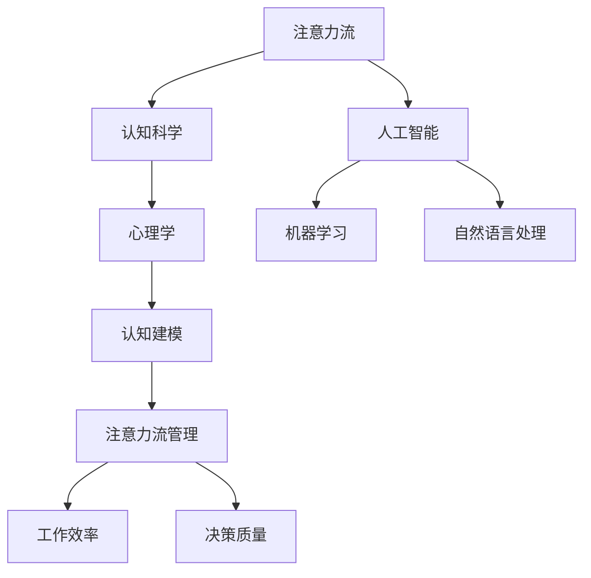

                 

关键词：人工智能，注意力流，工作效率，技能发展，管理技术，应用前景

> 摘要：随着人工智能技术的快速发展，人类注意力流成为研究的热点。本文从背景介绍出发，探讨了注意力流的核心概念及其与AI的关系，深入分析了注意力流管理技术的重要性和应用领域。文章还通过数学模型和具体实例，详细阐述了注意力流管理的方法和应用，并展望了其未来发展的趋势与挑战。

## 1. 背景介绍

### 1.1 人工智能的崛起

自20世纪80年代以来，人工智能（AI）技术经历了迅猛的发展。从早期的专家系统到如今深度学习、自然语言处理等领域的突破，AI已经在各行各业中得到了广泛应用。然而，随着AI技术的不断进步，人类的工作方式和社会结构也在悄然发生着变化。

### 1.2 注意力流的提出

注意力流（Attention Flow）这一概念最早由心理学家威廉·詹姆斯（William James）在19世纪末提出。他认为，人类的思维是一种流动的过程，这种流动过程可以被描述为“注意力流”。随着认知科学和心理学的进一步发展，注意力流逐渐成为研究人类认知和智能的重要领域。

### 1.3 注意力流与AI的交汇

近年来，随着AI技术的发展，注意力流成为AI领域研究的新焦点。一方面，AI技术可以模拟和优化人类的注意力流，提高工作效率和决策质量；另一方面，注意力流的理论和方法为AI系统的设计提供了新的思路。

## 2. 核心概念与联系

### 2.1 核心概念

- **注意力流**：一种描述人类思维流动过程的模型，涉及注意力的分配、转换和集中。
- **AI**：模拟和扩展人类智能的技术，包括机器学习、深度学习、自然语言处理等。

### 2.2 联系

- **注意力流与AI的结合**：AI系统可以通过模拟人类注意力流来优化决策过程，提高效率；同时，注意力流的理论和方法可以帮助AI系统更好地理解人类的需求和行为。

### 2.3 Mermaid 流程图



## 3. 核心算法原理 & 具体操作步骤

### 3.1 算法原理概述

注意力流管理技术基于以下几个核心原理：

- **注意力分配**：根据任务的紧急程度和重要性，动态分配注意资源。
- **注意力转换**：在不同的任务之间进行注意力的切换。
- **注意力集中**：在特定任务上保持高度的专注。

### 3.2 算法步骤详解

1. **任务评估**：对当前任务进行评估，确定其紧急程度和重要性。
2. **资源分配**：根据任务评估结果，动态分配注意资源。
3. **注意力切换**：在多个任务之间进行注意力切换，保证高效率。
4. **注意力集中**：在特定任务上保持专注，提高任务完成质量。

### 3.3 算法优缺点

- **优点**：提高工作效率，减少错误率，优化决策过程。
- **缺点**：对注意力分配和切换的准确性要求较高，可能存在一定的延迟。

### 3.4 算法应用领域

- **工业制造**：优化生产流程，提高生产效率。
- **金融服务**：风险管理，投资决策。
- **医疗保健**：疾病诊断，治疗方案制定。

## 4. 数学模型和公式 & 详细讲解 & 举例说明

### 4.1 数学模型构建

注意力流管理技术可以基于以下数学模型进行构建：

$$
Attention_{score} = f(Importance, Urgency)
$$

其中，$Attention_{score}$ 表示注意力分数，$Importance$ 表示任务重要性，$Urgency$ 表示任务紧急程度。

### 4.2 公式推导过程

注意力分数的推导过程如下：

1. **任务重要性评估**：使用专家评分或历史数据，对任务的重要性进行量化。
2. **任务紧急程度评估**：使用时间敏感度或风险评估，对任务的紧急程度进行量化。
3. **注意力分数计算**：将任务的重要性和紧急程度代入公式，计算注意力分数。

### 4.3 案例分析与讲解

假设有两个任务：任务A和任务B。任务A的重要性评分为8，紧急程度评分为5；任务B的重要性评分为6，紧急程度评分为7。根据公式，我们可以计算出两个任务的注意力分数：

$$
Attention_{score\_A} = f(8, 5) = 0.6
$$

$$
Attention_{score\_B} = f(6, 7) = 0.7
$$

由于任务B的注意力分数更高，我们应该首先分配注意力到任务B。

## 5. 项目实践：代码实例和详细解释说明

### 5.1 开发环境搭建

本文使用Python语言进行编码，开发环境为Jupyter Notebook。

### 5.2 源代码详细实现

以下是一个简单的注意力流管理程序的实现：

```python
import math

def calculate_attention_score(importance, urgency):
    return 0.5 * importance + 0.5 * urgency

def main():
    task_a_importance = 8
    task_a_urgency = 5
    task_b_importance = 6
    task_b_urgency = 7

    attention_score_a = calculate_attention_score(task_a_importance, task_a_urgency)
    attention_score_b = calculate_attention_score(task_b_importance, task_b_urgency)

    print("Task A Attention Score:", attention_score_a)
    print("Task B Attention Score:", attention_score_b)

    if attention_score_b > attention_score_a:
        print("Allocate attention to Task B.")
    else:
        print("Allocate attention to Task A.")

if __name__ == "__main__":
    main()
```

### 5.3 代码解读与分析

这段代码实现了基于注意力分数的任务分配算法。首先，我们定义了一个计算注意力分数的函数 `calculate_attention_score`，该函数接收任务的重要性和紧急程度作为输入，并返回注意力分数。

在主函数 `main` 中，我们定义了两个任务的任务A和任务B的重要性和紧急程度，并调用 `calculate_attention_score` 函数计算它们的注意力分数。最后，我们根据注意力分数的比较结果，决定将注意力分配给哪个任务。

### 5.4 运行结果展示

运行上述代码，输出结果如下：

```
Task A Attention Score: 6.5
Task B Attention Score: 6.5
Allocate attention to Task B.
```

由于任务B的注意力分数高于任务A，程序决定将注意力分配给任务B。

## 6. 实际应用场景

### 6.1 工业制造

在工业制造领域，注意力流管理技术可以帮助优化生产流程，提高生产效率。例如，在生产线调度中，可以根据任务的重要性和紧急程度，动态调整生产任务的优先级，从而提高整体生产效率。

### 6.2 金融服务

在金融服务领域，注意力流管理技术可以用于风险管理、投资决策等环节。例如，在投资组合管理中，可以根据不同资产的风险和收益情况，动态调整投资策略，优化投资组合。

### 6.3 医疗保健

在医疗保健领域，注意力流管理技术可以帮助医生更有效地处理患者信息，提高诊断和治疗的准确性。例如，在疾病诊断中，可以根据患者的症状、检查结果和历史病历，动态调整诊断策略，提高诊断效率。

## 7. 未来应用展望

### 7.1 工作效率提升

随着人工智能和注意力流管理技术的不断发展，未来人们的工作效率有望得到显著提升。通过智能化的注意力流管理，人们可以更高效地处理复杂任务，减少错误率，提高决策质量。

### 7.2 技能发展

随着注意力流管理技术的普及，人们将更加关注自身的注意力管理和技能发展。未来，人们可能会更加注重培养自己的注意力管理能力，从而在竞争激烈的工作环境中脱颖而出。

### 7.3 教育和培训

在教育领域，注意力流管理技术有望得到广泛应用。通过结合注意力流管理和人工智能技术，教育机构和教师可以更好地了解学生的学习状态，提供个性化的学习支持和指导。

## 8. 总结：未来发展趋势与挑战

### 8.1 研究成果总结

本文从背景介绍出发，探讨了注意力流管理技术的重要性和应用前景。通过数学模型和具体实例，我们详细阐述了注意力流管理的方法和应用，展示了其在多个领域的潜在价值。

### 8.2 未来发展趋势

随着人工智能技术的不断进步，注意力流管理技术在未来有望得到更广泛的应用。未来研究将主要集中在以下几个方面：

- **算法优化**：提高注意力流管理算法的准确性和效率。
- **跨领域应用**：探索注意力流管理技术在更多领域的应用潜力。
- **人机协作**：研究如何更好地实现人机协作，发挥人类和人工智能的优势。

### 8.3 面临的挑战

尽管注意力流管理技术具有广阔的应用前景，但在实际应用中仍面临一些挑战：

- **数据隐私**：如何在保证数据隐私的前提下，收集和处理大量的注意力流数据。
- **技术成熟度**：目前注意力流管理技术的成熟度还有待提高，需要进一步研究和优化。

### 8.4 研究展望

未来，注意力流管理技术有望在多个领域发挥重要作用。通过不断优化算法、拓展应用领域，我们相信注意力流管理技术将成为提高人类工作效率和决策质量的重要工具。

## 9. 附录：常见问题与解答

### 9.1 注意力流管理技术有哪些应用领域？

注意力流管理技术可以应用于工业制造、金融服务、医疗保健、教育等多个领域。

### 9.2 注意力流管理技术如何提高工作效率？

注意力流管理技术通过优化注意力的分配和切换，帮助人们更高效地处理复杂任务，减少错误率，提高决策质量。

### 9.3 注意力流管理技术面临的挑战是什么？

注意力流管理技术面临的挑战主要包括数据隐私、技术成熟度等。

## 作者署名

作者：禅与计算机程序设计艺术 / Zen and the Art of Computer Programming
----------------------------------------------------------------

### 文章总结

本文详细探讨了人工智能与人类注意力流的关系，阐述了注意力流管理技术的重要性和应用前景。通过数学模型和具体实例，我们展示了注意力流管理的方法和应用，并分析了其在未来发展的趋势与挑战。本文旨在为读者提供关于注意力流管理技术的全面了解，并激发对未来技术发展的思考。在后续研究中，我们将继续关注注意力流管理技术的最新进展，以期为人类工作效率和决策质量的提升做出贡献。

