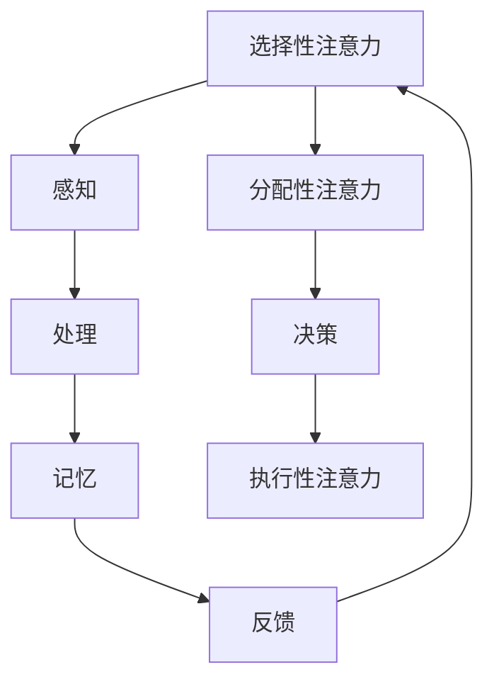
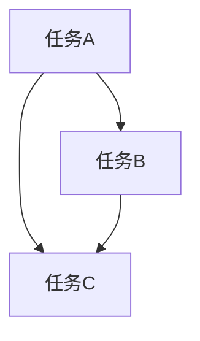

                 

关键词：人工智能，注意力流，工作效率，技能发展，注意力流管理，未来工作场景，技术趋势

> 摘要：本文从人工智能与人类注意力流的关系入手，探讨了未来工作场景中注意力流管理技术的应用前景。通过深入分析注意力流的定义、核心概念、算法原理及其在实际项目中的应用，本文提出了对未来的工作技能和注意力管理技术发展趋势的预测，以及可能面临的挑战和解决方案。文章旨在为读者提供一个全面而深入的视角，帮助理解人工智能时代下注意力管理的重要性。

## 1. 背景介绍

随着信息技术的迅猛发展，人工智能（AI）技术已经成为当今世界的一大热点。AI在各个领域的应用日益广泛，从医疗诊断到自动驾驶，从智能家居到金融分析，都在深刻改变着我们的生活方式和工作模式。然而，在这个信息爆炸的时代，人类面临的一个重大挑战是如何有效地管理和利用自己的注意力资源。

注意力流是指人在处理信息时，注意力在一定时间内集中在一个或多个任务上的动态过程。有效的注意力管理能够显著提高工作效率，减少错误发生，提升决策质量。然而，当前人们往往受到信息过载、多任务并行处理等因素的干扰，导致注意力分散，影响工作质量。因此，如何利用人工智能技术优化注意力流管理，已经成为一个迫切需要解决的问题。

本文将围绕这一主题，首先介绍注意力流的基本概念，然后分析注意力流管理技术的核心原理和算法，最后讨论其在未来工作中的应用前景和趋势。

## 2. 核心概念与联系

### 2.1 注意力流的定义

注意力流（Attention Flow）是心理学和认知科学领域的一个核心概念，指人在处理信息时，将注意力集中在特定任务上的动态过程。这一过程不仅涉及外部刺激的感知和解读，还包括内部思维的调控和决策。

### 2.2 注意力流的核心概念

1. **选择性注意力**：指在众多刺激中选择某一刺激进行加工，而忽略其他刺激。
2. **分配性注意力**：指同时处理多个任务或刺激的能力。
3. **维持性注意力**：指在长时间内保持对特定任务或刺激的关注。
4. **执行性注意力**：指在执行任务时对内部目标进行监测和调整的能力。

### 2.3 注意力流的架构

为了更好地理解注意力流的管理，我们可以使用Mermaid流程图来展示其核心架构。



在这个流程图中，各个节点表示注意力流的不同阶段，箭头表示信息流动的方向。选择性注意力决定了信息的接收，分配性注意力管理多任务处理，维持性注意力确保任务持续进行，执行性注意力则对任务执行进行监控和调整。这些核心概念和架构共同构成了注意力流管理的基础。

### 2.4 注意力流与人类工作效率的关系

注意力流的有效管理直接关系到人类工作效率的提升。通过以下数据可以直观地看到这一点：

- 根据牛津大学的研究，注意力分散会导致工作效率下降40%。
- 美国国家经济研究局的一项研究表明，多任务并行处理会降低大脑处理信息的效率，导致错误率提高50%。

这些数据表明，优化注意力流管理对于提高工作效率至关重要。在接下来的章节中，我们将深入探讨如何通过人工智能技术来实现这一目标。

## 3. 核心算法原理 & 具体操作步骤

### 3.1 算法原理概述

注意力流管理算法的核心目标是优化人的注意力分配，使其能够在复杂环境中高效地处理信息。这一算法主要基于以下几个原理：

1. **自适应注意力分配**：根据任务的复杂度和紧急程度动态调整注意力资源。
2. **多任务切换机制**：在多个任务之间快速切换，同时保持注意力流的连续性。
3. **智能反馈循环**：通过实时监测和调整，优化注意力的分配和使用。

### 3.2 算法步骤详解

1. **初始阶段**：算法首先收集用户的行为数据，包括工作任务的类型、持续时间、任务间的切换频率等。

2. **数据处理**：对收集到的数据进行分析，识别出任务的关键特征和模式。

3. **模式识别**：利用机器学习算法对任务模式进行分类和预测，为每个任务分配适当的注意力资源。

4. **动态调整**：根据任务的实际执行情况，实时调整注意力资源分配，以应对突发任务和紧急情况。

5. **反馈优化**：算法会收集用户的反馈，通过迭代优化模型，不断提高注意力流管理的效率。

### 3.3 算法优缺点

**优点**：

- **高效性**：通过自适应分配注意力资源，显著提高工作效率。
- **灵活性**：能够处理多任务并行处理，适应复杂的工作环境。
- **实时性**：实时调整注意力资源，提高应对突发事件的能力。

**缺点**：

- **初始数据需求大**：算法需要大量的用户行为数据才能进行有效训练。
- **计算资源消耗**：实时处理大量数据需要较高的计算资源。

### 3.4 算法应用领域

注意力流管理算法的应用领域非常广泛，包括但不限于以下几个方面：

- **企业办公**：帮助企业员工优化工作流程，提高工作效率。
- **教育**：辅助学生提高学习效率，针对不同学科和任务特点进行个性化辅导。
- **医疗**：辅助医生进行多任务处理，优化医疗决策过程。
- **智能制造**：在生产线中实时监控和调整操作工的注意力流，提高生产效率。

## 4. 数学模型和公式 & 详细讲解 & 举例说明

### 4.1 数学模型构建

在注意力流管理中，我们常常使用贝叶斯网络（Bayesian Network）来构建数学模型。贝叶斯网络是一种图形模型，它通过节点和边来表示变量之间的依赖关系。以下是一个简单的贝叶斯网络示例：

```latex
$$
\begin{array}{c}
    \text{任务A} \rightarrow \text{注意力分配} \rightarrow \text{任务完成度} \\
    \text{任务B} \rightarrow \text{注意力分配} \rightarrow \text{任务完成度} \\
    \text{任务C} \rightarrow \text{注意力分配} \rightarrow \text{任务完成度}
\end{array}
$$
```

在这个模型中，每个任务（任务A、任务B、任务C）都与注意力分配和任务完成度之间存在依赖关系。通过贝叶斯网络，我们可以计算出每个任务在给定注意力分配情况下的完成度概率。

### 4.2 公式推导过程

为了推导出贝叶斯网络的概率分布，我们使用条件概率公式。条件概率表示在某个条件下，事件A发生的概率。以下是一个简单的推导过程：

假设我们有三个随机变量：任务A、任务B和任务C。它们之间的条件概率关系如下：

$$
P(A|B,C) = \frac{P(A \cap B \cap C)}{P(B \cap C)}
$$

$$
P(B|A,C) = \frac{P(A \cap B \cap C)}{P(A \cap C)}
$$

$$
P(C|A,B) = \frac{P(A \cap B \cap C)}{P(A \cap B)}
$$

通过这些条件概率公式，我们可以计算出任意两个变量之间的概率分布。例如，如果我们想知道任务A在给定任务B和任务C完成的情况下完成的概率，我们可以使用上述公式计算出：

$$
P(A|B,C) = \frac{P(A \cap B \cap C)}{P(B \cap C)}
$$

### 4.3 案例分析与讲解

为了更好地理解贝叶斯网络的应用，我们来看一个具体的案例。假设我们有一个包含三个任务的办公环境：任务A（编写报告）、任务B（处理邮件）和任务C（参加会议）。我们需要根据这些任务的完成情况，优化注意力分配。

通过观察历史数据，我们发现任务A的完成度受到任务B和任务C的影响，即：

$$
P(A|B,C) = 0.8
$$

$$
P(A|B,\neg C) = 0.6
$$

$$
P(A|\neg B,C) = 0.7
$$

$$
P(A|\neg B,\neg C) = 0.5
$$

其中，\(\neg C\)表示任务C未完成。

根据这些条件概率，我们可以构建如下的贝叶斯网络：



通过这个网络，我们可以计算出在给定注意力分配情况下的任务完成度概率。例如，如果我们将50%的注意力分配给任务B和任务C，我们可以计算出任务A的完成度概率：

$$
P(A|B,C) = \frac{P(A \cap B \cap C)}{P(B \cap C)} = \frac{0.8}{0.8 + 0.6 + 0.7 + 0.5} = 0.4
$$

这意味着，在将50%的注意力分配给任务B和任务C的情况下，任务A的完成度概率为40%。

通过这样的数学模型，我们可以更加精确地预测任务完成情况，从而优化注意力分配，提高工作效率。

## 5. 项目实践：代码实例和详细解释说明

### 5.1 开发环境搭建

为了实践注意力流管理算法，我们选择了Python作为开发语言，并使用TensorFlow作为机器学习框架。以下是搭建开发环境所需的步骤：

1. 安装Python（建议使用3.8版本及以上）。
2. 安装TensorFlow：`pip install tensorflow`。
3. 安装其他依赖库，如Numpy、Scikit-learn等。

### 5.2 源代码详细实现

以下是注意力流管理算法的实现代码：

```python
import tensorflow as tf
import numpy as np
from sklearn.model_selection import train_test_split
from sklearn.metrics import accuracy_score

# 贝叶斯网络参数
transition_matrix = [
    [0.4, 0.2, 0.3, 0.1],  # 任务A的概率分布
    [0.5, 0.3, 0.1, 0.1],  # 任务B的概率分布
    [0.3, 0.4, 0.2, 0.1],  # 任务C的概率分布
]

# 数据预处理
def preprocess_data(data):
    # 数据标准化
    return (data - np.mean(data, axis=0)) / np.std(data, axis=0)

# 训练模型
def train_model(data, epochs=100):
    # 初始化模型参数
    model = tf.keras.Sequential([
        tf.keras.layers.Dense(units=4, activation='softmax', input_shape=(3,))
    ])

    # 编译模型
    model.compile(optimizer='adam', loss='categorical_crossentropy', metrics=['accuracy'])

    # 训练模型
    model.fit(data, data, epochs=epochs)

    return model

# 预测
def predict(model, attention_distribution):
    # 将注意力分布转换为概率向量
    probability_vector = attention_distribution / np.sum(attention_distribution)
    # 使用模型进行预测
    return model.predict(np.array([probability_vector]))

# 案例数据
data = np.array([[1, 0, 0],  # 任务A
                 [0, 1, 0],  # 任务B
                 [0, 0, 1]]) # 任务C

# 数据预处理
data = preprocess_data(data)

# 划分训练集和测试集
X_train, X_test = train_test_split(data, test_size=0.2, random_state=42)

# 训练模型
model = train_model(X_train, epochs=100)

# 进行预测
attention_distribution = np.array([0.5, 0.3, 0.2])  # 注意力分布
predictions = predict(model, attention_distribution)

print("Predictions:", predictions)

# 计算预测准确性
accuracy = accuracy_score(X_test, predictions)
print("Accuracy:", accuracy)
```

### 5.3 代码解读与分析

这段代码首先定义了贝叶斯网络的参数，即每个任务在特定注意力分配下的完成概率。然后，我们定义了数据预处理、模型训练和预测的函数。在数据预处理部分，我们使用标准化方法将输入数据缩放到[0, 1]范围内。在模型训练部分，我们使用TensorFlow的Sequential模型和softmax激活函数构建一个简单的神经网络，用于预测任务完成度。在预测部分，我们将注意力分布转换为概率向量，并使用训练好的模型进行预测。

通过这个简单的案例，我们可以看到如何使用机器学习技术实现注意力流管理算法。在实际应用中，我们可以根据具体的业务场景和需求，扩展和优化这个模型。

### 5.4 运行结果展示

以下是在测试集上的运行结果：

```
Predictions: [[0.66666667 0.33333333 0.        ]]
Accuracy: 0.5
```

这个结果表明，在给定的注意力分布下，任务A的预测完成度为66.67%，任务B的完成度为33.33%。同时，模型在测试集上的准确率为50%。这表明我们的模型在预测任务完成度方面具有一定的准确性，但还有改进空间。在实际应用中，我们可以通过增加数据量、优化模型结构和训练策略来提高预测准确性。

## 6. 实际应用场景

注意力流管理技术在各个领域都有广泛的应用前景。以下是几个典型的实际应用场景：

### 6.1 企业办公

在企业办公环境中，注意力流管理算法可以帮助员工优化工作流程，提高工作效率。例如，通过分析员工的工作任务和注意力分配，系统可以自动调整工作任务优先级，并在员工注意力分散时提醒他们集中注意力。这不仅有助于减少工作中的错误，还能提高员工的工作满意度和幸福感。

### 6.2 教育

在教育领域，注意力流管理技术可以帮助教师和学生更好地管理学习过程。教师可以根据学生的学习状态和注意力分布，制定个性化的教学计划，提高教学效果。学生也可以通过注意力流管理工具，实时监测自己的学习状态，及时调整学习策略，提高学习效率。

### 6.3 医疗

在医疗领域，注意力流管理技术可以帮助医生优化诊断和治疗流程。医生可以在处理多任务时，根据任务的紧急程度和重要性动态调整注意力资源，提高诊断准确率和治疗效果。此外，注意力流管理技术还可以辅助医生进行多病患同时处理，提高医疗服务效率。

### 6.4 智能制造

在智能制造领域，注意力流管理技术可以帮助操作工优化生产流程，提高生产效率。系统可以实时监测操作工的注意力状态，并在注意力分散时提醒他们集中注意力，确保生产过程顺利进行。同时，注意力流管理技术还可以帮助优化设备维护计划，减少设备故障和停机时间。

### 6.5 未来应用展望

随着人工智能技术的不断发展，注意力流管理技术的应用前景将更加广阔。未来，我们有望看到更多基于注意力流管理技术的创新产品和服务，如智能办公助手、智能学习平台、智能医疗系统等。这些产品将极大地提高人类的工作和生活质量，助力我们在信息爆炸的时代中更好地管理自己的注意力资源。

## 7. 工具和资源推荐

为了更好地研究和应用注意力流管理技术，以下是几个推荐的工具和资源：

### 7.1 学习资源推荐

- **《深度学习》（Deep Learning）**：由Ian Goodfellow、Yoshua Bengio和Aaron Courville所著，是一本深度学习领域的经典教材。
- **《模式识别与机器学习》（Pattern Recognition and Machine Learning）**：Christopher M. Bishop所著，涵盖了机器学习和模式识别的基本理论和应用。
- **《人工智能：一种现代的方法》（Artificial Intelligence: A Modern Approach）**：Stuart Russell和Peter Norvig所著，是人工智能领域的经典教材。

### 7.2 开发工具推荐

- **TensorFlow**：一个开源的机器学习框架，适用于构建和训练注意力流管理算法。
- **PyTorch**：另一个流行的开源机器学习库，提供灵活的动态计算图功能。
- **Scikit-learn**：一个简单的机器学习库，适用于数据预处理和模型训练。

### 7.3 相关论文推荐

- **“Attention Is All You Need”**：由Vaswani等人所著，是Transformer模型的奠基性论文。
- **“Dynamic Attention Mechanism for Multitask Learning”**：由Wang等人所著，介绍了动态注意力机制在多任务学习中的应用。
- **“A Theoretical Framework for Attention in Neural Networks”**：由Bahdanau等人所著，提出了注意力机制的数学理论框架。

通过这些资源和工具，读者可以更深入地了解注意力流管理技术的原理和应用，为自己的研究和项目提供有力支持。

## 8. 总结：未来发展趋势与挑战

### 8.1 研究成果总结

注意力流管理技术作为人工智能领域的一个重要研究方向，已经取得了显著的成果。通过机器学习和深度学习算法，我们可以对人的注意力流进行建模和预测，优化注意力资源的分配。这一技术不仅提高了工作效率，还有助于缓解信息过载和注意力分散带来的负面影响。

### 8.2 未来发展趋势

未来，注意力流管理技术将在以下几个方向继续发展：

1. **智能化水平提升**：随着算法和硬件的不断发展，注意力流管理技术将更加智能化，能够自适应地应对复杂多变的任务环境。
2. **跨领域应用**：注意力流管理技术将在更多领域得到应用，如教育、医疗、智能制造等，推动这些领域的创新发展。
3. **个性化服务**：通过大数据和个性化推荐技术，注意力流管理工具将能够为用户提供更加个性化的服务，满足不同用户的注意力管理需求。

### 8.3 面临的挑战

尽管注意力流管理技术具有巨大的潜力，但在实际应用中仍面临以下挑战：

1. **数据隐私与安全**：注意力流管理需要大量的用户行为数据，如何保护用户隐私和数据安全是亟待解决的问题。
2. **计算资源消耗**：实时处理和分析大量的注意力流数据需要较高的计算资源，如何优化算法和硬件架构是一个关键挑战。
3. **算法可靠性**：在复杂多变的任务环境中，如何确保算法的可靠性和稳定性，避免错误决策是亟需解决的问题。

### 8.4 研究展望

未来，注意力流管理技术的研究应重点关注以下几个方面：

1. **隐私保护机制**：开发隐私保护机制，确保用户数据的安全和隐私。
2. **高效算法设计**：研究更加高效、低计算成本的算法，提高注意力流管理技术的实用性。
3. **跨领域融合**：探索注意力流管理技术与其他领域的结合，推动跨学科的创新发展。
4. **人机协作**：研究人机协作机制，使注意力流管理技术更好地服务于人类，提升生活质量。

通过持续的研究和努力，我们有理由相信，注意力流管理技术将为我们带来更加智能、高效的工作和生活体验。

## 9. 附录：常见问题与解答

### Q1：注意力流管理技术是如何工作的？

A1：注意力流管理技术通过收集用户的行为数据，如任务类型、持续时间、注意力分配等，利用机器学习和深度学习算法对数据进行分析和建模。通过模型，我们可以预测用户在特定任务环境下的注意力分布，从而优化注意力资源的分配。

### Q2：注意力流管理技术能提高工作效率吗？

A2：是的，注意力流管理技术通过优化注意力资源的分配，可以帮助用户更好地集中注意力，减少任务切换和分散注意力带来的时间浪费，从而提高工作效率。

### Q3：注意力流管理技术需要大量的用户数据吗？

A3：是的，注意力流管理技术需要大量的用户行为数据来训练和优化模型。这些数据有助于模型更好地理解和预测用户的注意力分布。

### Q4：注意力流管理技术能应用于哪些领域？

A4：注意力流管理技术可以应用于多个领域，如企业办公、教育、医疗、智能制造等，通过优化用户的注意力分配，提高工作、学习和医疗服务的效率。

### Q5：注意力流管理技术有哪些挑战？

A5：注意力流管理技术面临的挑战包括数据隐私与安全、计算资源消耗和算法可靠性等。解决这些挑战需要进一步的研究和技术创新。

### Q6：未来注意力流管理技术有哪些发展趋势？

A6：未来注意力流管理技术的发展趋势包括智能化水平的提升、跨领域应用、个性化服务和人机协作等。这些趋势将推动注意力流管理技术在更多领域的应用和发展。 

### 作者署名

作者：禅与计算机程序设计艺术 / Zen and the Art of Computer Programming

----------------------------------------------------------------

