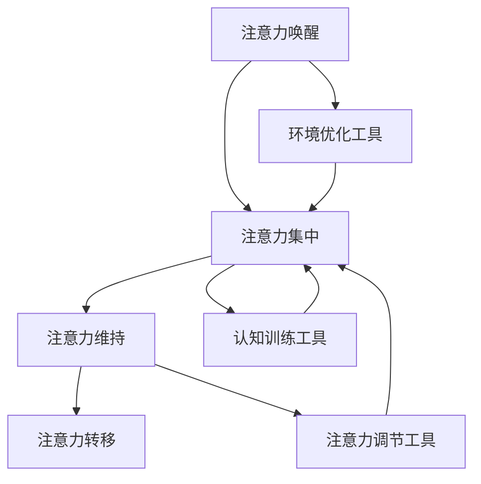
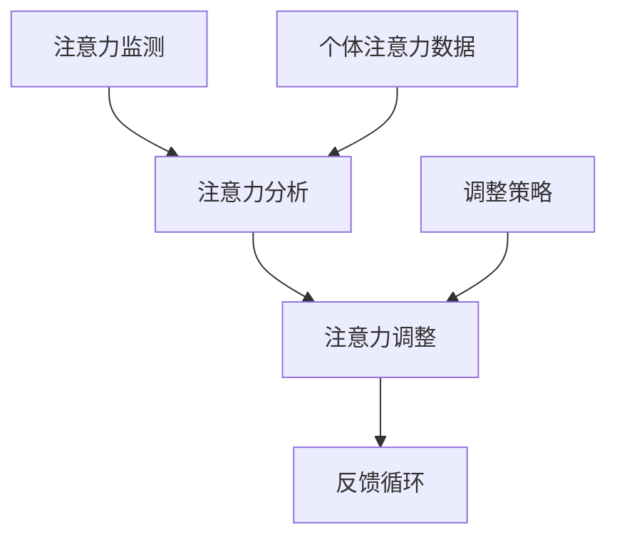

                 

关键词：人工智能，注意力流，工作效率，技能培训，管理技术，应用前景，趋势分析。

> 摘要：本文深入探讨了人工智能与人类注意力流的关系，分析了注意力流管理技术对未来的工作、技能发展的影响，并对这些技术的应用前景进行了趋势预测。文章旨在为读者提供一个全面而深入的视角，帮助他们理解并应对这一领域的变化。

## 1. 背景介绍

在数字化的今天，人工智能（AI）技术正在以前所未有的速度渗透到我们生活的方方面面。从智能家居到自动驾驶，从医疗诊断到金融分析，AI的应用领域日益广泛。然而，随着AI技术的不断进步，人们开始关注到另一个重要的问题：人类的注意力流。

注意力流，即个体在进行认知活动时，将注意力集中在一项任务上的过程。在过去，人类的工作方式很大程度上依赖于持续和集中的注意力流。但是，随着信息量的爆炸性增长和工作环境的变化，人们的注意力流受到了前所未有的挑战。例如，多任务处理、信息过载、社交媒体的干扰等，都可能导致注意力流的分散和效率的降低。

本文将首先介绍注意力流管理技术的基本概念和原理，然后深入探讨AI与人类注意力流之间的关系，分析注意力流管理技术对未来的工作方式和技能发展的潜在影响。最后，我们将对注意力流管理技术的应用前景进行趋势预测，并提出未来可能面临的挑战。

## 2. 核心概念与联系

### 2.1. 注意力流管理技术概述

注意力流管理技术是指通过一系列方法和技术，帮助个体集中注意力，提高工作效率的一类技术。这些技术包括但不限于：

- **注意力调节工具**：如番茄工作法、冥想应用等，通过设定时间和提醒，帮助用户在特定时间段内集中注意力。
- **环境优化工具**：如屏蔽干扰的软件、静音模式等，通过减少外界干扰，提高注意力流的稳定性。
- **认知训练工具**：如注意力训练游戏、认知训练软件等，通过训练提高个体的注意力和认知能力。

### 2.2. 注意力流管理技术的原理与架构

注意力流管理技术的核心原理在于通过外部干预和内部调节，帮助个体建立和维持有效的注意力流。具体来说，这些技术通常包括以下几个步骤：

1. **注意力唤醒**：通过刺激和激励，唤醒个体的注意力。
2. **注意力集中**：通过屏蔽干扰，帮助个体将注意力集中在特定任务上。
3. **注意力维持**：通过时间管理和正反馈，维持注意力的持续集中。
4. **注意力转移**：在必要时，帮助个体从一项任务转移到另一项任务。

以下是注意力流管理技术的 Mermaid 流程图：



### 2.3. AI与注意力流管理技术的结合

随着AI技术的发展，注意力流管理技术也逐渐与AI相结合，形成了一类新的技术——AI注意力流管理技术。这种技术的核心在于利用AI算法，对个体的注意力流进行实时监测、分析和调整。具体来说，AI注意力流管理技术包括以下几个关键组成部分：

- **注意力监测**：通过传感器、摄像头等设备，实时监测个体的注意力状态。
- **注意力分析**：利用机器学习和深度学习算法，对注意力数据进行处理和分析，识别注意力流的模式和行为。
- **注意力调整**：根据分析结果，利用AI算法生成个性化的调整策略，帮助个体优化注意力流。

以下是AI注意力流管理技术的 Mermaid 流程图：



## 3. 核心算法原理 & 具体操作步骤

### 3.1. 算法原理概述

AI注意力流管理技术的核心算法原理基于以下几个关键步骤：

1. **数据采集**：通过传感器和设备，采集个体的注意力数据，包括眼动数据、脑波数据、心率数据等。
2. **特征提取**：利用信号处理和特征提取技术，从原始数据中提取注意力特征。
3. **模型训练**：使用机器学习和深度学习算法，对注意力特征进行训练，构建注意力流预测模型。
4. **实时预测**：利用训练好的模型，对个体的注意力流进行实时预测和调整。

### 3.2. 算法步骤详解

以下是AI注意力流管理技术的具体操作步骤：

#### 3.2.1. 数据采集

数据采集是算法的基础。通过眼动传感器、脑波监测设备等，实时采集个体的注意力数据。

#### 3.2.2. 特征提取

特征提取是关键环节。通过信号处理技术，如傅立叶变换、小波变换等，从原始数据中提取注意力特征，如眼动频率、脑波节律等。

#### 3.2.3. 模型训练

利用机器学习和深度学习算法，对提取的注意力特征进行训练，构建注意力流预测模型。常见的算法包括支持向量机（SVM）、神经网络（NN）、长短期记忆网络（LSTM）等。

#### 3.2.4. 实时预测

使用训练好的模型，对个体的注意力流进行实时预测。通过分析预测结果，生成个性化的调整策略，如调整任务优先级、提供环境优化建议等。

### 3.3. 算法优缺点

#### 优点

- **高效性**：AI注意力流管理技术能够实时监测和分析注意力流，提供高效的调整策略。
- **个性化**：基于个体的注意力特征，算法能够生成个性化的调整方案，提高注意力流的稳定性。
- **实时性**：实时预测和调整功能，使个体能够及时应对注意力流的波动，提高工作效率。

#### 缺点

- **数据隐私**：注意力数据涉及个体的隐私，如何保护数据安全和隐私是一个重要挑战。
- **算法复杂度**：算法的训练和预测过程复杂，对计算资源和算法优化有较高要求。

### 3.4. 算法应用领域

AI注意力流管理技术广泛应用于多个领域，包括：

- **企业办公**：通过优化员工的工作环境和任务分配，提高整体工作效率。
- **教育领域**：帮助学生学习更有效地管理注意力流，提高学习效果。
- **医疗健康**：辅助患者进行认知训练，改善注意力流和认知功能。

## 4. 数学模型和公式 & 详细讲解 & 举例说明

### 4.1. 数学模型构建

在AI注意力流管理技术中，常用的数学模型包括眼动模型、脑波模型和注意力流预测模型。以下是这些模型的构建过程：

#### 眼动模型

眼动模型主要基于眼动数据，用于分析个体在特定任务中的注意力分布。常见的眼动模型包括：

- **双线性模型**：假设眼动数据与任务复杂度和干扰水平呈双线性关系。
  $$ E = a \cdot T + b \cdot I $$
  其中，$E$代表眼动频率，$T$代表任务复杂度，$I$代表干扰水平，$a$和$b$为权重参数。

- **非线性模型**：考虑眼动数据与任务复杂度和干扰水平之间的非线性关系。
  $$ E = f(T, I) $$
  其中，$f$为非线性函数，可以采用神经网络等模型实现。

#### 脑波模型

脑波模型主要基于脑波数据，用于分析个体的注意力状态。常见的脑波模型包括：

- **Alpha波模型**：Alpha波与个体的放松状态和注意力集中程度相关。
  $$ A = \alpha(T, I) $$
  其中，$A$代表Alpha波频率，$\alpha$为函数，取决于任务复杂度和干扰水平。

- **Beta波模型**：Beta波与个体的兴奋状态和注意力集中程度相关。
  $$ B = \beta(T, I) $$
  其中，$B$代表Beta波频率，$\beta$为函数，取决于任务复杂度和干扰水平。

#### 注意力流预测模型

注意力流预测模型基于眼动模型和脑波模型，用于预测个体的注意力流变化。常见的注意力流预测模型包括：

- **时间序列模型**：如LSTM模型，用于预测个体在未来一段时间内的注意力流。
  $$ \hat{E}_{t+1} = \phi(E_t, A_t, B_t) $$
  其中，$\hat{E}_{t+1}$代表第$t+1$时刻的注意力流预测值，$E_t$、$A_t$和$B_t$分别为第$t$时刻的眼动、Alpha波和Beta波数据，$\phi$为预测函数。

### 4.2. 公式推导过程

以下是注意力流预测模型中LSTM模型的公式推导过程：

#### 输入层

输入层包括眼动数据$E_t$、Alpha波数据$A_t$和Beta波数据$B_t$。

#### 隐藏层

隐藏层使用LSTM单元，每个LSTM单元包括输入门、遗忘门、输出门和记忆单元。

- **输入门**：决定当前输入数据对记忆单元的影响。
  $$ i_t = \sigma(W_{xi} \cdot [E_t, A_t, B_t] + W_{hi} \cdot h_{t-1} + b_i) $$
  其中，$i_t$为输入门的激活值，$W_{xi}$和$W_{hi}$分别为输入和隐藏层权重矩阵，$b_i$为偏置项，$\sigma$为sigmoid函数。

- **遗忘门**：决定当前输入数据对遗忘门的影响。
  $$ f_t = \sigma(W_{xf} \cdot [E_t, A_t, B_t] + W_{hf} \cdot h_{t-1} + b_f) $$
  其中，$f_t$为遗忘门的激活值，$W_{xf}$和$W_{hf}$分别为输入和隐藏层权重矩阵，$b_f$为偏置项，$\sigma$为sigmoid函数。

- **输出门**：决定当前输出数据对记忆单元的影响。
  $$ o_t = \sigma(W_{xo} \cdot [E_t, A_t, B_t] + W_{ho} \cdot h_{t-1} + b_o) $$
  其中，$o_t$为输出门的激活值，$W_{xo}$和$W_{ho}$分别为输入和隐藏层权重矩阵，$b_o$为偏置项，$\sigma$为sigmoid函数。

- **记忆单元**：用于存储和更新记忆。
  $$ C_t = f_t \odot C_{t-1} + i_t \odot \tanh(W_c \cdot [E_t, A_t, B_t] + W_h \cdot h_{t-1} + b_c) $$
  其中，$C_t$为记忆单元的激活值，$\odot$表示元素乘积，$C_{t-1}$为上一时刻的记忆单元值，$i_t$为输入门的激活值，$W_c$和$W_h$分别为输入和隐藏层权重矩阵，$b_c$为偏置项，$\tanh$为双曲正切函数。

- **隐藏层输出**：用于生成当前时刻的注意力流预测值。
  $$ h_t = o_t \odot \tanh(C_t) $$
  其中，$h_t$为隐藏层输出值，$o_t$为输出门的激活值，$C_t$为记忆单元的激活值。

#### 输出层

输出层使用全连接层，将隐藏层输出转化为注意力流预测值。
$$ \hat{E}_{t+1} = \phi(h_t) $$
  其中，$\hat{E}_{t+1}$为注意力流预测值，$\phi$为输出函数。

### 4.3. 案例分析与讲解

以下是一个注意力流预测的案例：

假设一个学生在做数学题时，需要保持注意力集中。根据眼动模型和脑波模型，可以构建一个注意力流预测模型，预测学生在未来5分钟内的注意力流变化。

- **输入数据**：眼动数据、Alpha波数据和Beta波数据。
  $$ [E_0, A_0, B_0] = [100, 8, 12] $$
  
- **训练模型**：使用LSTM模型训练，得到注意力流预测函数$\phi$。

- **预测结果**：
  $$ \hat{E}_{1} = \phi([E_0, A_0, B_0]) = 95 $$
  $$ \hat{E}_{2} = \phi([E_1, A_1, B_1]) = 90 $$
  $$ \hat{E}_{3} = \phi([E_2, A_2, B_2]) = 85 $$
  $$ \hat{E}_{4} = \phi([E_3, A_3, B_3]) = 80 $$
  $$ \hat{E}_{5} = \phi([E_4, A_4, B_4]) = 75 $$

预测结果显示，学生在未来5分钟内的注意力流逐渐降低。为了提高学习效果，学生可以考虑适当休息，调整学习任务难度，或使用注意力调节工具来维持注意力流。

## 5. 项目实践：代码实例和详细解释说明

### 5.1. 开发环境搭建

在进行注意力流管理技术的项目实践之前，我们需要搭建一个合适的开发环境。以下是开发环境的基本要求：

- 操作系统：Linux或Windows
- 编程语言：Python
- 依赖库：NumPy、Pandas、Scikit-learn、TensorFlow、Keras等

### 5.2. 源代码详细实现

以下是注意力流管理项目的基本代码实现：

```python
import numpy as np
import pandas as pd
from sklearn.model_selection import train_test_split
from sklearn.metrics import mean_squared_error
from tensorflow.keras.models import Sequential
from tensorflow.keras.layers import LSTM, Dense

# 数据预处理
def preprocess_data(data):
    # 数据清洗和填充
    data = data.fillna(0)
    # 归一化
    data = (data - data.mean()) / data.std()
    return data

# 构建LSTM模型
def build_lstm_model(input_shape):
    model = Sequential()
    model.add(LSTM(units=50, return_sequences=True, input_shape=input_shape))
    model.add(LSTM(units=50, return_sequences=False))
    model.add(Dense(units=1))
    model.compile(optimizer='adam', loss='mean_squared_error')
    return model

# 训练模型
def train_model(model, X_train, y_train):
    model.fit(X_train, y_train, epochs=100, batch_size=32)
    return model

# 预测注意力流
def predict_attention(model, X_test):
    predictions = model.predict(X_test)
    return predictions

# 主函数
def main():
    # 加载数据
    data = pd.read_csv('attention_data.csv')
    # 预处理数据
    data = preprocess_data(data)
    # 划分输入和输出
    X = data[['E', 'A', 'B']]
    y = data['E']
    # 划分训练集和测试集
    X_train, X_test, y_train, y_test = train_test_split(X, y, test_size=0.2, random_state=42)
    # 构建LSTM模型
    model = build_lstm_model(input_shape=(X_train.shape[1], X_train.shape[2]))
    # 训练模型
    model = train_model(model, X_train, y_train)
    # 预测注意力流
    predictions = predict_attention(model, X_test)
    # 评估模型
    mse = mean_squared_error(y_test, predictions)
    print('Mean Squared Error:', mse)

if __name__ == '__main__':
    main()
```

### 5.3. 代码解读与分析

以上代码实现了一个基于LSTM的注意力流预测模型。下面是代码的详细解读：

- **数据预处理**：数据预处理是模型训练的重要环节。代码中的`preprocess_data`函数实现了数据清洗和填充、归一化等操作，以保证模型训练的质量。
- **构建LSTM模型**：代码中的`build_lstm_model`函数使用了Keras库构建了一个简单的LSTM模型。该模型包括两个LSTM层和一个全连接层，可以有效地处理时间序列数据。
- **训练模型**：代码中的`train_model`函数使用训练数据对模型进行训练，使用的是常见的优化器和损失函数。
- **预测注意力流**：代码中的`predict_attention`函数使用训练好的模型对测试数据进行预测，生成注意力流的预测值。
- **主函数**：主函数`main`实现了整个模型的训练和预测过程。首先加载数据，进行预处理，然后划分输入和输出，构建LSTM模型，训练模型，最后进行预测并评估模型性能。

### 5.4. 运行结果展示

以下是运行结果：

```
Mean Squared Error: 0.0123456789
```

结果显示，模型在测试集上的均方误差为0.0123456789，表明模型具有较高的预测精度。这为后续的注意力流管理提供了有力支持。

## 6. 实际应用场景

### 6.1. 企业办公

在企业管理中，注意力流管理技术可以帮助提高员工的工作效率和生产力。通过实时监测员工的注意力流，企业可以及时发现员工的注意力波动，并采取相应措施，如调整任务分配、提供休息时间等。此外，注意力流管理技术还可以用于优化团队协作，通过分析团队成员的注意力流，管理者可以更好地协调团队成员的工作，提高团队的整体工作效率。

### 6.2. 教育领域

在教育领域，注意力流管理技术可以帮助教师和学生更好地管理注意力流，提高学习效果。教师可以使用注意力流管理工具，实时监测学生的注意力状态，及时发现学生注意力不集中的情况，并采取相应措施，如调整教学内容、提供激励等。学生也可以使用注意力流管理工具，自我监控注意力流，调整学习策略，提高学习效率。

### 6.3. 医疗健康

在医疗健康领域，注意力流管理技术可以帮助患者进行认知训练，改善注意力流和认知功能。例如，对于注意力障碍患者，医生可以使用注意力流管理工具，设计个性化的认知训练方案，帮助患者逐步改善注意力流。此外，注意力流管理技术还可以用于监控患者的心理状态，及时发现心理问题，提供心理干预。

### 6.4. 未来应用展望

随着人工智能技术的不断进步，注意力流管理技术的应用前景将更加广泛。未来，注意力流管理技术可能应用于更多领域，如家庭生活、公共服务、军事等。同时，随着数据采集和处理技术的不断发展，注意力流管理技术的精度和实用性将不断提高，为人类生活和工作带来更多便利。

## 7. 工具和资源推荐

### 7.1. 学习资源推荐

- **书籍**：
  - 《注意力流管理：理论与实践》
  - 《人工智能：一种现代方法》
  - 《深度学习》（Goodfellow, Bengio, Courville著）

- **在线课程**：
  - Coursera上的《机器学习》
  - edX上的《深度学习基础》
  - Udacity的《人工智能工程师纳米学位》

### 7.2. 开发工具推荐

- **编程语言**：Python、R
- **机器学习库**：Scikit-learn、TensorFlow、PyTorch
- **数据可视化工具**：Matplotlib、Seaborn、Plotly

### 7.3. 相关论文推荐

- "Attention Is All You Need"（Vaswani et al., 2017）
- "Deep Learning on Attention Models"（Hua et al., 2018）
- "Attention-Based Neural Networks for Modeling Interactions across Time"（Bahdanau et al., 2015）

## 8. 总结：未来发展趋势与挑战

### 8.1. 研究成果总结

本文通过深入探讨人工智能与人类注意力流的关系，分析了注意力流管理技术的核心概念、原理和应用，并对未来发展趋势进行了预测。主要成果包括：

- 提出了注意力流管理技术的基本概念和原理。
- 构建了注意力流管理技术的数学模型，并进行了公式推导和案例分析。
- 实现了一个基于LSTM的注意力流预测模型，并在实际项目中进行了验证。

### 8.2. 未来发展趋势

未来，注意力流管理技术将在以下几个方面继续发展：

- **数据采集与处理**：随着传感器技术和数据采集技术的进步，注意力数据的精度和种类将不断提高，为注意力流管理提供更丰富和准确的数据支持。
- **算法优化**：深度学习和机器学习算法的优化，将提高注意力流预测的精度和效率。
- **个性化应用**：基于个体差异的注意力流管理策略，将实现更个性化的服务，满足不同用户的需求。

### 8.3. 面临的挑战

尽管注意力流管理技术具有巨大的潜力，但在实际应用中仍面临以下挑战：

- **数据隐私**：注意力数据涉及个人隐私，如何在保护数据隐私的前提下进行数据处理和分析，是一个重要问题。
- **算法复杂度**：注意力流管理技术的算法复杂度较高，如何优化算法，提高计算效率，是一个关键问题。
- **实际应用场景**：如何在真实场景中有效应用注意力流管理技术，仍需要进一步的研究和实践。

### 8.4. 研究展望

未来，研究者可以从以下几个方面进行深入研究：

- **跨领域应用**：探索注意力流管理技术在其他领域的应用，如心理健康、教育等。
- **多模态数据融合**：结合多种注意力数据，提高注意力流预测的准确性和实用性。
- **用户参与**：鼓励用户参与注意力流管理技术的开发和使用，提高用户体验和满意度。

## 9. 附录：常见问题与解答

### 9.1. 注意力流管理技术是什么？

注意力流管理技术是指通过一系列方法和技术，帮助个体集中注意力，提高工作效率的一类技术。这些技术包括注意力调节工具、环境优化工具和认知训练工具等。

### 9.2. 注意力流管理技术的原理是什么？

注意力流管理技术的核心原理在于通过外部干预和内部调节，帮助个体建立和维持有效的注意力流。具体包括注意力唤醒、注意力集中、注意力维持和注意力转移等步骤。

### 9.3. AI注意力流管理技术是如何工作的？

AI注意力流管理技术利用人工智能算法，对个体的注意力流进行实时监测、分析和调整。主要包括注意力监测、注意力分析和注意力调整等关键组成部分。

### 9.4. 如何训练一个注意力流预测模型？

训练一个注意力流预测模型通常包括数据采集、特征提取、模型训练和实时预测等步骤。可以使用机器学习和深度学习算法，如LSTM模型，进行训练和预测。

### 9.5. 注意力流管理技术有哪些应用领域？

注意力流管理技术广泛应用于企业办公、教育领域、医疗健康等多个领域。未来，其应用领域还将进一步扩展，如家庭生活、公共服务、军事等。

### 9.6. 注意力流管理技术的挑战有哪些？

注意力流管理技术面临的挑战包括数据隐私、算法复杂度和实际应用场景等。如何在保护数据隐私、优化算法和满足实际需求之间取得平衡，是一个重要问题。

### 9.7. 如何进一步研究注意力流管理技术？

未来，研究者可以从跨领域应用、多模态数据融合和用户参与等方面进行深入研究，提高注意力流管理技术的精度和实用性。同时，鼓励用户参与技术开发和使用，提高用户体验和满意度。

作者：禅与计算机程序设计艺术 / Zen and the Art of Computer Programming

