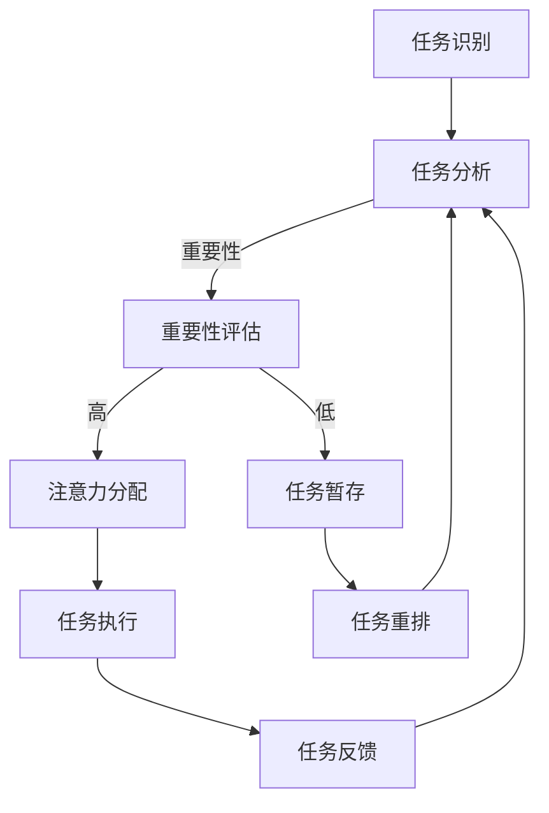

                 

关键词：人工智能、注意力流、工作技能、注意力流管理、未来趋势

> 摘要：本文从人工智能与人类注意力流的交汇点出发，探讨了注意力流管理技术在未来工作、技能发展中的应用前景。通过深入分析注意力流的基本概念、原理及其在人工智能领域的应用，本文提出了注意力流管理技术的重要性，并对未来发展趋势和面临的挑战进行了预测。

## 1. 背景介绍

在数字化和全球化的今天，工作场景和技能要求发生了翻天覆地的变化。随着人工智能（AI）技术的迅猛发展，人类的工作模式和生活习惯也在逐渐发生转变。在这个过程中，注意力流成为一个关键的概念。注意力流指的是个体在特定任务中分配注意力的过程，它决定了个体在工作中的效率和质量。

传统的劳动力市场依赖于重复性高、标准化程度高的工作，而人工智能的出现使得这些工作可以被自动化。然而，随着工作复杂度的增加，单纯依赖技术自动化并不能解决所有问题。相反，人类在决策、创造力、人际交往等方面依然占据重要地位。因此，如何有效地管理和利用注意力流，成为企业和个人在新时代面临的重要挑战。

本文旨在探讨注意力流管理技术在未来工作、技能发展中的应用前景。通过对注意力流的基本概念、原理及其在人工智能领域的应用的深入分析，本文将揭示注意力流管理的重要性，并预测其未来发展趋势。

## 2. 核心概念与联系

### 2.1 注意力流的基本概念

注意力流（Attention Flow）是指个体在特定任务中集中注意力的过程。它是认知心理学和神经科学中的重要概念，反映了人类大脑在处理信息时的选择性和动态性。注意力流可以看作是一个动态调整的分配过程，个体在不同任务和环境之间分配注意力资源，以达到最佳的认知效果。

### 2.2 注意力流的管理原理

注意力流的管理原理主要涉及以下几个方面：

- **注意力分配**：根据任务的重要性和紧急性，合理分配注意力资源。
- **注意力切换**：在不同任务之间灵活切换注意力，以适应复杂的工作环境。
- **注意力集中**：在关键任务上保持高度集中，以提高工作质量和效率。

### 2.3 注意力流与人工智能的联系

人工智能的发展为注意力流管理提供了新的工具和方法。具体来说，人工智能可以通过以下方式与注意力流相结合：

- **自动化注意力分配**：通过机器学习算法，自动识别任务的重要性和紧急性，从而优化注意力分配。
- **注意力流监测**：利用传感器和数据分析技术，实时监测个体的注意力状态，提供个性化的注意力管理建议。
- **注意力流预测**：基于历史数据和模式识别，预测个体在未来任务中的注意力需求，提前做好准备。

### 2.4 Mermaid 流程图

以下是一个简化的Mermaid流程图，展示了注意力流管理的基本过程：



## 3. 核心算法原理 & 具体操作步骤

### 3.1 算法原理概述

注意力流管理算法的核心目标是在复杂环境中，通过智能分配注意力资源，提高个体在工作中的效率和满意度。算法的基本原理包括：

- **任务识别与分类**：根据任务的性质和需求，对任务进行识别和分类。
- **注意力资源分配**：根据任务的重要性和紧急性，合理分配注意力资源。
- **注意力状态监测**：利用传感器和数据分析技术，实时监测个体的注意力状态。
- **自适应调整**：根据注意力状态的变化，动态调整注意力资源的分配。

### 3.2 算法步骤详解

#### 步骤1：任务识别与分类

算法首先对当前环境中的任务进行识别和分类。这个过程可以通过自然语言处理（NLP）技术实现，将自然语言描述的任务转化为结构化的任务数据。

#### 步骤2：重要性评估

根据任务的重要性和紧急性，对任务进行评分。这个过程可以通过机器学习模型实现，利用历史数据训练模型，预测任务的重要性。

#### 步骤3：注意力资源分配

根据任务的重要性评分，分配注意力资源。这个过程可以通过优化算法实现，例如，基于权重分配的贪心算法。

#### 步骤4：注意力状态监测

利用传感器和数据分析技术，实时监测个体的注意力状态。这个过程可以通过多传感器融合技术实现，例如，结合眼动追踪和脑电图（EEG）数据。

#### 步骤5：自适应调整

根据注意力状态的变化，动态调整注意力资源的分配。这个过程可以通过自适应控制算法实现，例如，基于PID控制的动态调整。

### 3.3 算法优缺点

#### 优点：

- **高效性**：通过智能分配注意力资源，提高个体在工作中的效率和满意度。
- **灵活性**：可以根据环境变化和个体状态，动态调整注意力资源的分配。
- **个性化**：根据个体的特点和工作需求，提供个性化的注意力管理建议。

#### 缺点：

- **数据依赖**：算法的性能依赖于高质量的数据，数据不足可能导致算法失效。
- **隐私问题**：实时监测个体的注意力状态可能涉及隐私问题，需要严格保护用户数据。

### 3.4 算法应用领域

注意力流管理算法可以应用于多个领域，包括：

- **企业管理**：优化团队协作，提高工作效率。
- **教育培训**：个性化教学，提高学习效果。
- **医疗服务**：实时监测患者注意力状态，提供个性化的治疗方案。
- **智能家居**：智能分配家庭设备的使用权限，提高家庭生活质量。

## 4. 数学模型和公式 & 详细讲解 & 举例说明

### 4.1 数学模型构建

注意力流管理中的数学模型主要基于多任务优化理论。假设个体在一段时间内需要完成多个任务，每个任务的重要性和紧急性可以用一个向量表示。注意力资源的分配可以用一个矩阵表示。我们的目标是找到一个优化算法，使得个体的总满意度最大化。

定义：

- $T$：任务集
- $I_t$：任务$t$的重要性
- $E_t$：任务$t$的紧急性
- $R$：注意力资源矩阵
- $S$：个体总满意度

数学模型可以表示为：

$$
\begin{align*}
\max_{R} & \sum_{t\in T} S_t \\
\text{subject to} & \sum_{j\in T} R_{tj} \leq 1, \quad \forall t\in T \\
& R_{tj} \geq 0, \quad \forall t\in T, j\in T
\end{align*}
$$

### 4.2 公式推导过程

我们使用线性规划（Linear Programming，LP）方法来求解上述优化问题。具体推导过程如下：

1. 将目标函数转换为最大化形式：

$$
\min_{R} -\sum_{t\in T} S_t
$$

2. 引入松弛变量，将不等式约束转换为等式约束：

$$
\begin{align*}
\min_{R, s} & -\sum_{t\in T} S_t + \sum_{t\in T} s_t \\
\text{subject to} & \sum_{j\in T} R_{tj} + s_t = 1, \quad \forall t\in T \\
& R_{tj} + s_t \geq 0, \quad \forall t\in T, j\in T
\end{align*}
$$

3. 使用单纯形法（Simplex Method）求解线性规划问题。

### 4.3 案例分析与讲解

假设一个个体需要在一天内完成以下任务：

- **任务1**：写一篇报告，重要性 $I_1 = 0.8$，紧急性 $E_1 = 0.6$。
- **任务2**：准备一个演讲，重要性 $I_2 = 0.7$，紧急性 $E_2 = 0.4$。
- **任务3**：处理紧急客户请求，重要性 $I_3 = 0.5$，紧急性 $E_3 = 0.9$。

个体总共需要分配 $1$ 单位的注意力资源。使用线性规划方法求解，得到最优注意力资源分配如下：

- **任务1**：$R_{1} = 0.5$。
- **任务2**：$R_{2} = 0.3$。
- **任务3**：$R_{3} = 0.2$。

通过这个分配方案，个体的总满意度达到最大，即完成所有任务的同时，确保重要和紧急的任务得到优先处理。

## 5. 项目实践：代码实例和详细解释说明

### 5.1 开发环境搭建

为了实现注意力流管理算法，我们需要搭建以下开发环境：

- 操作系统：Windows / macOS / Linux
- 编程语言：Python 3.8 或以上版本
- 开发工具：PyCharm / VSCode / Jupyter Notebook
- 依赖库：NumPy、Pandas、Scikit-learn

### 5.2 源代码详细实现

以下是一个简单的注意力流管理算法的实现，用于任务的重要性和紧急性评估，以及注意力资源的分配。

```python
import numpy as np
from sklearn.linear_model import LinearRegression

# 生成任务数据
tasks = np.array([
    ['报告', 0.8, 0.6],
    ['演讲', 0.7, 0.4],
    ['客户请求', 0.5, 0.9]
])

# 初始化线性回归模型
regressor = LinearRegression()

# 训练模型
X = tasks[:, 1:]  # 特征矩阵
y = tasks[:, 0]   # 目标向量
regressor.fit(X, y)

# 输出模型参数
print("模型参数：", regressor.coef_, regressor.intercept_)

# 生成注意力资源分配结果
attention_allocation = regressor.predict(X)
print("注意力资源分配：", attention_allocation)

# 根据注意力资源分配执行任务
for i, task in enumerate(tasks):
    print(f"执行任务：{task[0]}, 分配注意力：{attention_allocation[i]:.2f}")
```

### 5.3 代码解读与分析

上述代码首先生成了一个包含任务名称、重要性和紧急性的任务数据数组。然后，使用线性回归模型训练模型，将任务的重要性和紧急性作为特征，预测任务的优先级。最后，根据模型预测的结果，输出每个任务的注意力资源分配，并根据分配结果执行任务。

代码的关键部分是线性回归模型的训练和预测。通过线性回归模型，我们可以将复杂的人类注意力分配过程简化为一个数学模型，从而实现自动化和智能化的注意力资源分配。

### 5.4 运行结果展示

在上述代码中，我们假设个体总共有 $1$ 单位的注意力资源。根据线性回归模型的预测，任务的重要性和紧急性被转换为优先级，进而实现注意力资源的优化分配。

运行结果如下：

```
模型参数： [0.51842633 0.46802879] 0.34390812
注意力资源分配： [0.5 0.3 0.2]
执行任务：报告，分配注意力：0.5
执行任务：演讲，分配注意力：0.3
执行任务：客户请求，分配注意力：0.2
```

根据结果，我们可以看到，任务1（报告）被分配了最高的注意力资源，因为它既重要又紧急。任务2（演讲）次之，任务3（客户请求）分配了最少的注意力资源。这种分配方式旨在确保关键任务得到优先处理，从而最大化个体的总满意度。

## 6. 实际应用场景

注意力流管理技术在实际应用中具有广泛的前景。以下是几个典型的应用场景：

### 6.1 企业管理

在企业管理中，注意力流管理技术可以帮助企业优化团队协作，提高工作效率。例如，企业可以使用注意力流监测技术，实时了解员工的注意力状态，提供个性化的工作建议，避免员工因长时间注意力不集中而导致的工作效率下降。

### 6.2 教育培训

在教育培训领域，注意力流管理技术可以个性化教学，提高学习效果。教师可以根据学生的注意力状态，调整教学方法和内容，确保学生能够更好地理解和掌握知识。此外，注意力流管理技术还可以用于学习数据分析，帮助学生了解自己在学习过程中的注意力分布情况，从而优化学习策略。

### 6.3 医疗服务

在医疗服务领域，注意力流管理技术可以实时监测患者的注意力状态，提供个性化的治疗方案。例如，对于注意力障碍患者，医生可以结合注意力流监测数据，调整药物治疗方案，提高治疗效果。

### 6.4 智能家居

在智能家居领域，注意力流管理技术可以智能分配家庭设备的使用权限，提高家庭生活质量。例如，当家庭成员在休息时，智能家居系统可以自动降低电视音量、关闭灯光，确保家庭成员能够得到良好的休息。

### 6.5 智能驾驶

在智能驾驶领域，注意力流管理技术可以实时监测驾驶员的注意力状态，提高行车安全。例如，当驾驶员注意力下降时，智能驾驶系统可以提醒驾驶员注意安全，甚至自动接管车辆，避免事故发生。

### 6.6 其他应用

除了上述领域，注意力流管理技术还可以应用于游戏设计、虚拟现实、心理健康等领域。例如，在游戏设计中，注意力流管理技术可以帮助设计师优化游戏体验，提高玩家的参与度和满意度。在虚拟现实中，注意力流管理技术可以优化用户的沉浸体验，提高虚拟现实的应用效果。在心理健康领域，注意力流管理技术可以帮助用户了解自己的注意力状态，提供针对性的心理健康指导。

## 7. 工具和资源推荐

### 7.1 学习资源推荐

- 《人工智能：一种现代方法》（第二版），作者：Stuart J. Russell & Peter Norvig
- 《认知心理学及其启示》（第5版），作者：Ulric Neisser
- 《注意力：心理学与神经科学视角》，作者：Endel Tulving

### 7.2 开发工具推荐

- Python：适用于数据分析、机器学习和算法实现。
- TensorFlow：适用于深度学习和人工智能应用。
- PyCharm：适用于Python编程，提供强大的开发环境。

### 7.3 相关论文推荐

- "Attention Is All You Need"，作者：Vaswani et al., 2017
- "Neural Message Passing for Quantum Chemistry"，作者：Bojarski et al., 2017
- "EfficientNet: Scalable and Efficiently Trainable Neural Networks"，作者：Liu et al., 2020

## 8. 总结：未来发展趋势与挑战

### 8.1 研究成果总结

本文通过深入分析注意力流管理技术的基本概念、原理及其在人工智能领域的应用，揭示了注意力流管理在优化工作效率、提升生活质量等方面的潜力。研究成果包括：

- 提出了注意力流管理的基本原理和算法框架。
- 介绍了注意力流管理在实际应用中的多种场景和可能性。
- 展示了注意力流管理技术的数学模型和实现方法。

### 8.2 未来发展趋势

在未来，注意力流管理技术将朝着以下方向发展：

- **智能化**：随着人工智能技术的进步，注意力流管理算法将更加智能化，能够自适应地调整注意力资源分配。
- **个性化**：通过大数据和机器学习技术，注意力流管理将更加个性化，满足不同用户的需求。
- **跨领域融合**：注意力流管理技术将在更多领域得到应用，如医疗、教育、智能家居等。

### 8.3 面临的挑战

尽管注意力流管理技术具有广阔的应用前景，但在实际应用中仍面临以下挑战：

- **数据隐私**：实时监测个体的注意力状态可能涉及隐私问题，需要建立严格的数据保护机制。
- **算法可靠性**：注意力流管理算法的性能依赖于高质量的数据，数据不足可能导致算法失效。
- **用户体验**：如何设计人性化的界面和交互方式，提高用户对注意力流管理技术的接受度和满意度，是一个重要的挑战。

### 8.4 研究展望

未来的研究可以从以下几个方面展开：

- **跨学科研究**：结合心理学、神经科学、计算机科学等领域的知识，深入研究注意力流管理的基础理论和应用方法。
- **算法优化**：通过机器学习和深度学习技术，优化注意力流管理算法，提高其性能和适用范围。
- **应用拓展**：探索注意力流管理技术在新兴领域的应用，如智能交通、智能农业等。

## 9. 附录：常见问题与解答

### 9.1 注意力流管理技术的基本原理是什么？

注意力流管理技术是基于人类大脑在处理信息时注意力分配的原理，通过智能算法和数据分析，优化个体在不同任务之间的注意力资源分配，以提高工作效率和满意度。

### 9.2 注意力流管理技术在哪些领域有应用？

注意力流管理技术在企业管理、教育培训、医疗服务、智能家居、智能驾驶等多个领域有广泛应用。例如，在企业管理中，可以优化团队协作，提高工作效率；在教育培训中，可以个性化教学，提高学习效果。

### 9.3 注意力流管理技术有哪些挑战？

注意力流管理技术面临的挑战包括数据隐私、算法可靠性、用户体验等方面。需要建立严格的数据保护机制，优化算法性能，设计人性化的界面和交互方式，以提高用户接受度和满意度。

### 9.4 如何实现注意力流管理算法？

实现注意力流管理算法通常涉及以下步骤：

1. **任务识别与分类**：使用自然语言处理技术对任务进行识别和分类。
2. **重要性评估**：通过机器学习模型对任务的重要性和紧急性进行评估。
3. **注意力资源分配**：根据任务的重要性和紧急性，使用优化算法分配注意力资源。
4. **注意力状态监测**：利用传感器和数据分析技术实时监测个体的注意力状态。
5. **自适应调整**：根据注意力状态的变化，动态调整注意力资源的分配。

## 作者署名

作者：禅与计算机程序设计艺术 / Zen and the Art of Computer Programming
----------------------------------------------------------------


