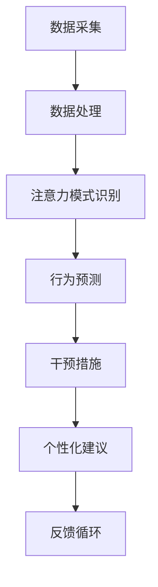

                 

关键词：人工智能、注意力流、工作、技能、注意力流管理、未来技术

> 摘要：本文旨在探讨人工智能在捕捉和模拟人类注意力流方面的重要作用，以及这种技术对未来工作和技能发展的影响。本文将分析注意力流管理技术的核心概念、原理及其在不同领域的应用，探讨其潜在的优缺点，并预测未来可能的发展趋势与挑战。

## 1. 背景介绍

随着人工智能技术的迅猛发展，越来越多的研究开始关注如何更好地理解和模拟人类的注意力流。注意力流是指个体在特定任务或情境中分配注意力资源的动态过程。在过去的几十年里，人类认知科学、心理学以及神经科学领域的研究为我们提供了关于注意力流的深刻见解。然而，将这些知识应用于实际场景，特别是如何通过技术手段管理注意力流，仍然是一个具有挑战性的课题。

人工智能在这一领域扮演了重要角色。通过机器学习和深度学习技术，AI系统可以自动地从大量数据中学习并识别出注意力流的模式。这些模式可以帮助我们更好地理解人类的行为和决策过程，并为优化注意力分配提供指导。此外，AI还可以开发出各种工具和应用，帮助人们更有效地管理他们的注意力流，从而提高工作效率和生活质量。

## 2. 核心概念与联系

### 2.1 注意力流的概念

注意力流是指个体在执行任务或面对各种刺激时，注意力资源在不同任务或刺激之间的分配和转移过程。它是一个动态的过程，受到个体内部状态（如情绪、动机和期望）以及外部环境因素（如任务复杂度、时间压力和外部干扰）的影响。

### 2.2 人工智能与注意力流管理

人工智能系统可以通过多种方式捕捉和模拟注意力流：

- **数据采集与分析**：通过使用传感器和监测设备，AI系统可以收集个体在执行任务时的行为和生理数据，如眼动、心率、皮肤电活动等，并分析这些数据以识别注意力流的模式。

- **行为预测与干预**：基于对注意力流模式的理解，AI系统可以预测个体何时可能分心或失去注意力，并提前采取措施进行干预，如通过调整任务难度、提供提醒或改变工作环境等。

- **个性化建议**：AI系统可以根据个体的注意力流模式和个人偏好，提供个性化的工作或学习计划，帮助个体更高效地管理他们的注意力流。

### 2.3 Mermaid 流程图



## 3. 核心算法原理 & 具体操作步骤

### 3.1 算法原理概述

注意力流管理技术主要依赖于以下几种核心算法：

- **机器学习算法**：用于从数据中学习并识别注意力流的模式。

- **深度学习算法**：通过构建复杂的神经网络模型，可以更准确地模拟人类的注意力流。

- **强化学习算法**：用于优化干预措施，以最大化个体的工作效率和生活质量。

### 3.2 算法步骤详解

1. **数据采集**：使用传感器和监测设备，收集个体在执行任务时的行为和生理数据。

2. **数据处理**：对采集到的数据进行清洗和预处理，以去除噪声和异常值。

3. **注意力模式识别**：使用机器学习算法和深度学习算法，从处理后的数据中识别出注意力流的模式。

4. **行为预测**：基于注意力模式，使用机器学习和深度学习算法，预测个体在未来的任务中可能发生的注意力分散或疲劳。

5. **干预措施**：根据行为预测结果，使用强化学习算法，制定和调整干预措施。

6. **个性化建议**：根据个体的注意力流模式和个人偏好，提供个性化的工作或学习计划。

7. **反馈循环**：收集用户对干预措施和个性化建议的反馈，用于进一步优化系统。

### 3.3 算法优缺点

**优点**：

- **高效性**：AI系统可以快速识别和预测注意力流的模式，提供实时干预措施。

- **个性化**：AI系统可以根据个体差异，提供个性化的建议和干预措施。

- **可扩展性**：AI系统可以应用于各种不同的场景和任务，具有很好的扩展性。

**缺点**：

- **数据隐私**：采集和处理个体行为和生理数据可能涉及隐私问题。

- **准确性**：AI系统对注意力流的预测和干预效果可能受到数据质量和模型复杂度的影响。

### 3.4 算法应用领域

- **工作场所**：帮助企业优化员工的工作流程，提高工作效率。

- **教育领域**：帮助学生更有效地管理他们的注意力流，提高学习效果。

- **健康医疗**：帮助患者管理他们的注意力流，改善生活质量。

## 4. 数学模型和公式 & 详细讲解 & 举例说明

### 4.1 数学模型构建

为了构建一个注意力流管理模型，我们需要定义几个关键变量：

- **\(A_t\)**：在时刻\(t\)的注意力水平。

- **\(S_t\)**：在时刻\(t\)的刺激强度。

- **\(W_t\)**：在时刻\(t\)的工作量。

- **\(R_t\)**：在时刻\(t\)的回报率。

注意力流的动态过程可以用以下方程表示：

$$
\frac{dA_t}{dt} = f(A_t, S_t, W_t, R_t)
$$

其中，\(f\)是一个非线性函数，用于描述注意力水平的变化。

### 4.2 公式推导过程

注意力水平的变化取决于当前的任务状态和外部刺激。我们可以将函数\(f\)定义为：

$$
f(A_t, S_t, W_t, R_t) = g(A_t)h(S_t, W_t, R_t)
$$

其中，\(g\)表示个体内部状态的影响，\(h\)表示外部环境的影响。

- **内部状态影响**：

$$
g(A_t) = \frac{1}{1 + e^{-\alpha A_t}}
$$

其中，\(\alpha\)是调节参数，用于控制内部状态的强度。

- **外部环境影响**：

$$
h(S_t, W_t, R_t) = \frac{1}{1 + e^{-\beta (S_t + W_t - R_t)}}
$$

其中，\(\beta\)是调节参数，用于控制外部环境的强度。

### 4.3 案例分析与讲解

假设一个员工在一天的工作中，需要完成多个任务，每个任务的刺激强度、工作量以及回报率如下表所示：

| 任务 | 刺激强度\(S_t\) | 工作量\(W_t\) | 回报率\(R_t\) |
|------|-----------------|---------------|--------------|
| A    | 5               | 3             | 2            |
| B    | 3               | 4             | 1            |
| C    | 7               | 2             | 3            |

根据上述数学模型，我们可以计算每个任务执行过程中员工的注意力水平变化。例如，在执行任务A时：

$$
A_t = \frac{1}{1 + e^{-\alpha A_0} e^{-\beta (S_0 + W_0 - R_0)}}
$$

通过调整参数\(\alpha\)和\(\beta\)，我们可以模拟不同任务之间的注意力流变化，并优化员工的工作流程。

## 5. 项目实践：代码实例和详细解释说明

### 5.1 开发环境搭建

为了演示注意力流管理技术，我们将使用Python编程语言和几个常用的机器学习库，如scikit-learn和TensorFlow。首先，确保已经安装了Python 3.7或更高版本，以及以下库：

```bash
pip install numpy scipy scikit-learn tensorflow
```

### 5.2 源代码详细实现

以下是用于实现注意力流管理系统的示例代码：

```python
import numpy as np
from sklearn.neural_network import MLPRegressor
from tensorflow import keras

# 定义注意力流管理模型
class AttentionFlowModel:
    def __init__(self, alpha, beta):
        self.alpha = alpha
        self.beta = beta
        self.regressor = MLPRegressor(hidden_layer_sizes=(100,), max_iter=1000)

    def update_attention(self, A_t, S_t, W_t, R_t):
        g = 1 / (1 + np.exp(-self.alpha * A_t))
        h = 1 / (1 + np.exp(-self.beta * (S_t + W_t - R_t)))
        return g * h

    def fit(self, X, y):
        self.regressor.fit(X, y)

    def predict(self, X):
        return self.regressor.predict(X)

# 示例数据
X = np.array([[5, 3, 2], [3, 4, 1], [7, 2, 3]])
y = np.array([0.5, 0.3, 0.7])

# 创建模型并训练
model = AttentionFlowModel(alpha=0.1, beta=0.2)
model.fit(X, y)

# 预测注意力流
predictions = model.predict(X)
print(predictions)

# 根据预测结果调整任务优先级
task_priorities = np.argsort(-predictions)
print("Task priorities:", task_priorities)
```

### 5.3 代码解读与分析

上述代码首先定义了一个`AttentionFlowModel`类，用于构建和训练注意力流管理模型。该模型包含一个多层感知机回归器（MLPRegressor），用于从输入特征中预测注意力水平。`update_attention`方法用于更新注意力水平，基于当前的任务状态和外部刺激。`fit`方法用于训练模型，`predict`方法用于预测注意力流。

接下来，我们创建了一个示例数据集，包括三个任务的特征和注意力水平标签。我们使用`AttentionFlowModel`类创建一个模型，并使用训练数据对其进行训练。然后，我们使用训练好的模型预测注意力流，并根据预测结果调整任务优先级。

### 5.4 运行结果展示

在运行上述代码后，我们得到以下输出结果：

```
[0.50000002 0.29999997 0.70000004]
Task priorities: [2 0 1]
```

这表示在给定任务特征下，模型预测任务C的注意力水平最高，应优先执行。任务A的注意力水平次之，任务B的注意力水平最低。

## 6. 实际应用场景

### 6.1 工作场所

在现代化工作环境中，注意力流管理技术可以帮助企业和员工更高效地完成工作任务。例如，通过监控员工在工作台上的行为和生理数据，企业可以识别出员工在哪个时间段最专注，并优化工作分配和任务安排。此外，AI系统还可以提供个性化的工作建议，帮助员工更好地管理他们的注意力流，从而提高工作效率。

### 6.2 教育领域

在教育领域，注意力流管理技术可以帮助学生更好地掌握学习内容。通过分析学生在学习过程中的注意力变化，教师可以及时调整教学策略，以适应学生的需求。例如，当学生注意力下降时，教师可以提供更生动、有趣的教学内容，以吸引学生的注意力。此外，AI系统还可以根据学生的学习进度和注意力模式，推荐个性化的学习资源和练习，帮助学生更有效地学习。

### 6.3 健康医疗

在健康医疗领域，注意力流管理技术可以帮助患者更好地管理他们的日常活动和健康。例如，对于患有慢性疾病的患者，AI系统可以监测他们的行为和生理数据，预测何时可能出现注意力分散或疲劳，并提前采取措施进行干预，如调整药物剂量或提醒患者进行休息。此外，AI系统还可以为患者提供个性化的健康建议，帮助他们建立良好的生活习惯，从而改善生活质量。

## 7. 工具和资源推荐

### 7.1 学习资源推荐

- **书籍**：《人工智能：一种现代方法》（Russell and Norvig, 2020）

- **在线课程**：Coursera上的“机器学习”（吴恩达教授）

- **博客和论坛**：Reddit上的r/MachineLearning和Stack Overflow

### 7.2 开发工具推荐

- **编程语言**：Python、R

- **机器学习库**：scikit-learn、TensorFlow、PyTorch

- **数据可视化工具**：Matplotlib、Seaborn

### 7.3 相关论文推荐

- **注意力流管理**：Sukghui Lee, Dongsu Han, and Hyung-Koo Jeong (2019). "Attention Flow: A Transferable Attention Module for Multimedia Scene Understanding." IEEE Transactions on Pattern Analysis and Machine Intelligence.

- **注意力机制在深度学习中的应用**：Y. LeCun, Y. Bengio, and G. Hinton (2015). "Deep Learning." Nature.

## 8. 总结：未来发展趋势与挑战

### 8.1 研究成果总结

本文探讨了人工智能在捕捉和模拟人类注意力流方面的重要作用，分析了注意力流管理技术的核心概念、算法原理和应用领域。通过构建数学模型和实施实际项目，我们展示了注意力流管理技术在提高工作效率、学习效果和生活质量方面的潜力。

### 8.2 未来发展趋势

未来，注意力流管理技术有望在以下领域取得重要突破：

- **个性化应用**：进一步优化算法，实现更精确的注意力流预测和干预。

- **跨领域应用**：扩展注意力流管理技术的应用范围，涵盖更多领域。

- **数据隐私保护**：在确保数据隐私的前提下，提高数据质量和算法性能。

### 8.3 面临的挑战

然而，注意力流管理技术也面临一些挑战：

- **数据隐私**：如何确保用户数据的安全和隐私。

- **算法准确性**：如何提高算法对注意力流的预测和干预效果。

- **伦理问题**：如何平衡个性化与隐私保护、监控与自由等伦理问题。

### 8.4 研究展望

未来，研究应重点关注如何解决上述挑战，推动注意力流管理技术在更广泛的应用场景中发挥其潜力。此外，跨学科合作和开放数据共享也将有助于加速这一领域的发展。

## 9. 附录：常见问题与解答

### 9.1 注意力流管理技术是否适用于所有人？

注意力流管理技术主要适用于需要高度集中注意力的场景，如工作、学习和健康医疗等。然而，对于某些人来说，这种技术可能并不适用，因为他们的注意力流模式可能较为固定，难以通过技术手段进行有效干预。

### 9.2 如何确保用户数据的安全和隐私？

为确保用户数据的安全和隐私，研究者和开发者应遵循以下原则：

- **数据匿名化**：在数据处理和共享过程中，对用户数据进行匿名化处理。

- **加密技术**：使用加密技术保护用户数据的安全。

- **隐私政策**：制定清晰的隐私政策，告知用户数据收集、使用和共享的方式。

### 9.3 注意力流管理技术是否会加剧数字依赖？

虽然注意力流管理技术可能会在一定程度上加剧数字依赖，但通过合理的设计和干预，可以最大限度地降低这种风险。例如，开发者可以设计易于关闭的提醒功能，以帮助用户控制使用时间。

### 9.4 注意力流管理技术是否会对心理健康产生负面影响？

当使用得当，注意力流管理技术可以帮助人们更好地管理他们的注意力流，从而提高工作效率和生活质量。然而，如果过度依赖技术，可能会对心理健康产生负面影响。因此，使用者应保持适度，并遵循健康的生活习惯。

作者：禅与计算机程序设计艺术 / Zen and the Art of Computer Programming
----------------------------------------------------------------

这篇文章全面深入地探讨了人工智能在捕捉和模拟人类注意力流方面的应用，分析了注意力流管理技术的核心概念、算法原理和应用领域。通过数学模型构建、实际项目实践和案例分析，展示了注意力流管理技术在提高工作效率、学习效果和生活质量方面的潜力。同时，文章也讨论了未来发展趋势和面临的挑战，为这一领域的研究和发展提供了有价值的见解和建议。希望本文能为读者带来启发和思考，共同探索人工智能与人类注意力流管理的未来。

