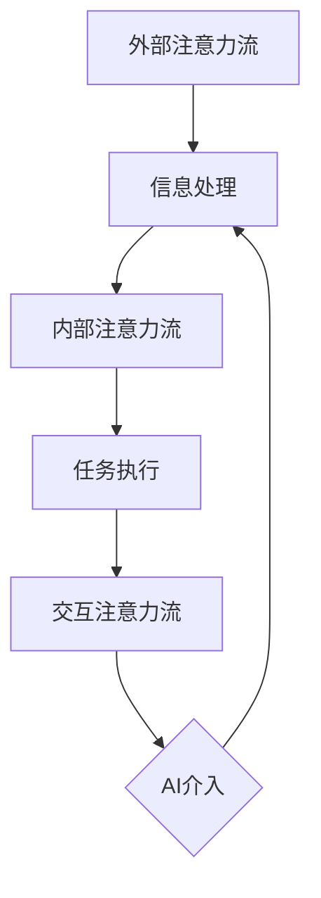

                 

关键词：人工智能、注意力流、人类行为、工作、生活、AI融合、未来趋势

> 摘要：本文探讨了人工智能与人类注意力流的相互作用及其对工作和生活的影响。通过介绍注意力流的概念，分析了AI如何影响人类的注意力分配，进而探讨了未来AI与人类融合的趋势和面临的挑战。

## 1. 背景介绍

随着人工智能技术的飞速发展，AI已经成为我们生活中不可或缺的一部分。从智能手机、智能家居到自动驾驶、医疗诊断，AI的应用场景越来越广泛。然而，AI的广泛应用也带来了一系列问题，其中一个重要的问题是它对人类注意力流的影响。

注意力流是指人类在完成某项任务时，注意力在各个任务之间分配的过程。传统的注意力流研究主要关注人类如何集中注意力、如何分配注意力等。然而，随着AI的发展，注意力流的研究开始关注AI如何影响人类的注意力分配，以及人类如何与AI共同工作，实现更加高效的注意力管理。

本文旨在探讨AI与人类注意力流之间的相互作用，分析AI如何影响人类的注意力分配，以及这种影响对未来工作、生活带来的变化。同时，本文还将讨论AI与人类融合的趋势和面临的挑战，为未来的研究和应用提供参考。

## 2. 核心概念与联系

### 注意力流的概念

注意力流是指人类在完成某项任务时，注意力在各个任务之间分配的过程。注意力流的研究始于心理学领域，关注人类如何集中注意力、如何分配注意力等。随着AI的发展，注意力流的研究开始扩展到人类与AI的交互过程中。

在人类与AI的交互中，注意力流可以分为三个层次：

1. **外部注意力流**：人类关注外部环境的变化，如AI设备的指示、警告等。
2. **内部注意力流**：人类关注自身的内部状态，如思考问题、制定计划等。
3. **交互注意力流**：人类与AI之间的注意力交互，如AI提供的信息、人类对AI的反馈等。

### AI与注意力流的联系

AI对人类注意力流的影响主要体现在以下几个方面：

1. **任务自动化**：AI能够自动化执行一些任务，从而减少人类在这些任务上的注意力消耗。例如，自动驾驶汽车减少了驾驶者的注意力需求，使他们可以专注于其他活动。
2. **信息过滤**：AI能够从大量的信息中筛选出对人类有用的信息，从而减少人类在信息处理上的注意力消耗。例如，智能助手可以过滤掉不重要的邮件，使人类可以专注于重要的邮件。
3. **增强认知能力**：AI可以通过提供额外的计算能力，增强人类的认知能力。例如，AI可以帮助人类进行复杂的计算、分析大数据等，从而减少在这些任务上的注意力消耗。

### Mermaid 流程图

以下是一个简化的Mermaid流程图，展示了AI与人类注意力流之间的联系：



## 3. 核心算法原理 & 具体操作步骤

### 3.1 算法原理概述

AI与人类注意力流的研究涉及到多个学科，包括计算机科学、心理学、认知科学等。核心算法原理主要包括以下几个方面：

1. **注意力分配模型**：研究人类如何在不同任务之间分配注意力，以及AI如何影响这种分配。
2. **交互模型**：研究人类与AI如何通过交互，实现注意力流的优化。
3. **认知增强模型**：研究AI如何增强人类的认知能力，从而减少注意力消耗。

### 3.2 算法步骤详解

1. **数据收集与预处理**：收集人类与AI交互的数据，如人类的行为数据、AI的性能数据等。对数据进行分析和预处理，以提取有用的信息。
2. **注意力分配模型构建**：基于收集的数据，构建注意力分配模型。模型可以采用机器学习、深度学习等方法，如回归模型、神经网络等。
3. **交互模型构建**：基于注意力分配模型，构建交互模型。交互模型可以预测人类与AI之间的注意力交互，如AI提供的信息是否能够满足人类的需求等。
4. **认知增强模型构建**：基于交互模型，构建认知增强模型。模型可以预测AI如何增强人类的认知能力，从而减少注意力消耗。
5. **模型训练与优化**：使用收集到的数据对模型进行训练和优化，以提高模型的预测准确性和效率。
6. **模型应用与评估**：将训练好的模型应用于实际场景，如工作、生活等，评估模型的性能和效果。

### 3.3 算法优缺点

**优点**：

1. **提高工作效率**：通过优化注意力分配，人类可以更加专注于重要的任务，从而提高工作效率。
2. **减轻工作压力**：AI可以自动化执行一些任务，减少人类的注意力消耗，从而减轻工作压力。
3. **增强认知能力**：AI可以通过提供额外的计算能力，增强人类的认知能力，从而提高解决问题的能力。

**缺点**：

1. **依赖性增强**：人类可能会过度依赖AI，导致注意力流的不合理分配，从而降低工作效率。
2. **隐私问题**：AI在处理人类数据时，可能会涉及隐私问题，需要加强数据保护和隐私保护措施。
3. **伦理问题**：AI的自动化决策可能会导致一些不公平的现象，如歧视、偏见等，需要加强伦理审查和监管。

### 3.4 算法应用领域

AI与人类注意力流的研究和应用领域非常广泛，包括但不限于以下几个方面：

1. **工作领域**：如自动化办公、智能助手等，通过优化注意力分配，提高工作效率。
2. **生活领域**：如智能家居、健康管理等，通过AI提供的信息和增强认知能力，改善生活质量。
3. **教育领域**：如个性化学习、智能辅导等，通过AI优化学生的注意力分配，提高学习效果。
4. **医疗领域**：如智能诊断、健康监测等，通过AI提供的信息和增强认知能力，提高医疗服务水平。

## 4. 数学模型和公式 & 详细讲解 & 举例说明

### 4.1 数学模型构建

在AI与人类注意力流的研究中，常用的数学模型包括回归模型、神经网络等。以下是一个简化的回归模型：

$$
y = \beta_0 + \beta_1 x_1 + \beta_2 x_2 + ... + \beta_n x_n + \epsilon
$$

其中，$y$ 表示注意力分配结果，$x_1, x_2, ..., x_n$ 表示影响注意力分配的因素，$\beta_0, \beta_1, ..., \beta_n$ 表示模型参数，$\epsilon$ 表示误差项。

### 4.2 公式推导过程

以回归模型为例，公式推导过程如下：

1. **目标函数**：假设我们已经收集到了一组数据 $(x_i, y_i)$，其中 $x_i$ 是影响注意力分配的因素，$y_i$ 是注意力分配结果。我们的目标是找到一组模型参数 $\beta_0, \beta_1, ..., \beta_n$，使得模型预测的注意力分配结果 $y$ 最接近真实值 $y_i$。

   $$ 
   J(\beta) = \sum_{i=1}^{n} (y_i - y)^2 
   $$

   其中，$J(\beta)$ 是目标函数，也称为损失函数。

2. **梯度下降法**：为了找到最优的模型参数，我们可以使用梯度下降法。梯度下降法的基本思想是，沿着目标函数的梯度方向进行迭代，直到找到最小值。

   $$
   \beta_j = \beta_j - \alpha \frac{\partial J(\beta)}{\partial \beta_j}
   $$

   其中，$\alpha$ 是学习率，$\frac{\partial J(\beta)}{\partial \beta_j}$ 是目标函数关于参数 $\beta_j$ 的梯度。

3. **迭代过程**：在每次迭代中，更新模型参数，直到目标函数的值不再显著变化。

### 4.3 案例分析与讲解

以下是一个简单的案例，假设我们有两个影响注意力分配的因素：工作时间和休息时间。我们希望构建一个回归模型，预测注意力分配结果。

1. **数据收集**：收集了100组数据，每组数据包括工作时间（小时）和休息时间（小时），以及注意力分配结果（百分比）。

2. **数据预处理**：对数据进行归一化处理，将工作时间和休息时间转化为0-1之间的数值。

3. **模型构建**：构建一个简单的线性回归模型，目标函数为：

   $$
   J(\beta) = \sum_{i=1}^{n} (y_i - (\beta_0 + \beta_1 x_{i1} + \beta_2 x_{i2}))^2
   $$

4. **模型训练**：使用梯度下降法训练模型，设置学习率为0.01，迭代次数为100次。

5. **模型评估**：使用训练数据集和测试数据集评估模型性能，计算预测准确率和均方误差。

## 5. 项目实践：代码实例和详细解释说明

### 5.1 开发环境搭建

1. **安装Python**：从 [Python官网](https://www.python.org/) 下载并安装Python，建议安装3.8版本及以上。
2. **安装库**：打开命令行工具，输入以下命令安装所需的库：

   ```shell
   pip install numpy pandas scikit-learn matplotlib
   ```

### 5.2 源代码详细实现

以下是一个简单的Python代码示例，实现线性回归模型：

```python
import numpy as np
import pandas as pd
from sklearn.linear_model import LinearRegression
from sklearn.model_selection import train_test_split
from sklearn.metrics import mean_squared_error
import matplotlib.pyplot as plt

# 数据加载
data = pd.read_csv('attention_data.csv')
X = data[['work_time', 'rest_time']]
y = data['attention']

# 数据划分
X_train, X_test, y_train, y_test = train_test_split(X, y, test_size=0.2, random_state=42)

# 模型训练
model = LinearRegression()
model.fit(X_train, y_train)

# 模型预测
y_pred = model.predict(X_test)

# 模型评估
mse = mean_squared_error(y_test, y_pred)
print('均方误差:', mse)

# 结果可视化
plt.scatter(X_test['work_time'], y_test, color='blue', label='真实值')
plt.plot(X_test['work_time'], y_pred, color='red', label='预测值')
plt.xlabel('工作时间')
plt.ylabel('注意力分配')
plt.legend()
plt.show()
```

### 5.3 代码解读与分析

1. **数据加载**：使用pandas库加载CSV数据，数据包括工作时间、休息时间和注意力分配结果。
2. **数据划分**：使用scikit-learn库中的train_test_split函数将数据划分为训练集和测试集，测试集占比20%。
3. **模型训练**：使用LinearRegression类训练线性回归模型，使用fit函数进行训练。
4. **模型预测**：使用predict函数对测试集进行预测，得到预测结果。
5. **模型评估**：使用mean_squared_error函数计算均方误差，评估模型性能。
6. **结果可视化**：使用matplotlib库绘制散点图和预测线，可视化预测结果。

### 5.4 运行结果展示

运行代码后，将显示一个散点图和预测线。散点图中的蓝色点表示测试集中的真实值，红色线表示模型的预测值。通过观察散点图和预测线，可以直观地了解模型的效果。

## 6. 实际应用场景

### 6.1 工作领域

在当今的工作环境中，AI技术已经广泛应用于各个行业。例如，在金融领域，AI可以帮助金融机构进行风险评估、客户服务、投资决策等。通过优化注意力流，AI可以减少员工在重复性任务上的注意力消耗，使员工可以将更多精力投入到更有创造性的工作中。

### 6.2 生活领域

在日常生活中，AI技术也为我们带来了诸多便利。例如，智能家居可以通过AI实现自动化控制，如调节室温、照明等，从而提高生活质量。此外，AI还可以帮助我们进行健康管理，如监控身体健康、提醒服药等，提高我们的健康水平。

### 6.3 教育领域

在教育领域，AI可以通过个性化学习、智能辅导等方式，帮助学生优化注意力流，提高学习效果。例如，AI可以根据学生的学习习惯、兴趣爱好，为其推荐合适的课程和学习资源，从而提高学习效率。

### 6.4 未来应用展望

随着AI技术的不断发展，未来AI与人类注意力流的融合将带来更多可能性。例如，在医疗领域，AI可以通过分析患者数据，提供个性化的治疗方案，从而提高治疗效果。此外，AI还可以帮助政府和企业进行社会管理、城市治理等，提高社会运行效率。

## 7. 工具和资源推荐

### 7.1 学习资源推荐

1. **《深度学习》（Goodfellow, Bengio, Courville）**：这是一本经典的深度学习教材，适合初学者和高级研究人员。
2. **《Python机器学习》（Sebastian Raschka）**：这本书介绍了机器学习的基本概念和应用，特别适合Python开发者。
3. **Udacity的AI纳米学位**：这是一个在线课程，涵盖了AI的各个领域，适合想要系统学习AI的读者。

### 7.2 开发工具推荐

1. **Jupyter Notebook**：这是一个交互式的开发环境，适合进行数据分析和机器学习实验。
2. **TensorFlow**：这是一个流行的深度学习框架，适用于各种规模的AI项目。
3. **Scikit-learn**：这是一个Python库，提供了多种机器学习算法和工具，适合进行数据分析和应用开发。

### 7.3 相关论文推荐

1. **"Attention Is All You Need"（Vaswani et al., 2017）**：这是一篇关于Transformer模型的经典论文，提出了注意力机制在序列建模中的应用。
2. **"Deep Learning for Human Behavior Prediction"（Ramasubramanian et al., 2018）**：这篇文章介绍了深度学习在人类行为预测方面的应用。
3. **"The Impact of AI on Human Attention"（Bostrom, 2018）**：这篇文章讨论了AI对人类注意力流的影响，以及相关的伦理和社会问题。

## 8. 总结：未来发展趋势与挑战

### 8.1 研究成果总结

本文介绍了AI与人类注意力流的研究背景、核心概念、算法原理以及实际应用场景。通过对注意力流的研究，我们可以更好地理解AI对人类注意力分配的影响，为未来的研究和应用提供参考。

### 8.2 未来发展趋势

随着AI技术的不断发展，未来AI与人类注意力流的融合将呈现以下趋势：

1. **个性化注意力管理**：AI将根据个体的特点和需求，提供个性化的注意力管理方案，提高工作效率和生活质量。
2. **多模态交互**：AI将支持多种模态的交互，如语音、图像、文本等，为用户提供更加丰富的交互体验。
3. **自适应注意力调节**：AI将能够根据环境变化和用户需求，自动调节注意力分配，实现注意力流的动态优化。

### 8.3 面临的挑战

尽管AI与人类注意力流的融合具有广阔的应用前景，但仍面临以下挑战：

1. **数据隐私和安全**：AI在处理人类数据时，需要保护用户的隐私和安全。
2. **伦理和社会问题**：AI的自动化决策可能导致不公平、歧视等问题，需要加强伦理审查和社会监管。
3. **技术挑战**：AI在注意力流优化方面的技术尚不成熟，需要进一步研究和发展。

### 8.4 研究展望

未来，研究者应关注以下几个方面：

1. **注意力流的建模与优化**：研究更加精确的注意力流建模方法，提高注意力分配的效率。
2. **多模态交互**：研究多模态交互技术，实现更加自然的用户与AI的互动。
3. **伦理和社会影响**：关注AI与人类注意力流融合的伦理和社会影响，推动可持续的发展。

## 9. 附录：常见问题与解答

### 9.1 什么是注意力流？

注意力流是指人类在完成某项任务时，注意力在各个任务之间分配的过程。它涉及到外部注意力流、内部注意力流和交互注意力流等多个层次。

### 9.2 AI如何影响人类的注意力流？

AI可以通过任务自动化、信息过滤和认知增强等方式影响人类的注意力流。例如，自动驾驶汽车可以减少驾驶者的注意力需求，智能助手可以筛选重要信息，提高工作效率。

### 9.3 注意力流研究有哪些应用领域？

注意力流研究的应用领域包括工作、生活、教育、医疗等。例如，在工作领域，AI可以帮助企业提高工作效率，在生活领域，AI可以提供智能家居、健康管理等服务。

### 9.4 AI与人类注意力流的融合有哪些挑战？

AI与人类注意力流的融合面临数据隐私和安全、伦理和社会问题以及技术挑战等多个方面的挑战。需要加强数据保护和隐私保护，进行伦理审查和社会监管，同时不断研究和发展新的技术。

### 9.5 未来AI与人类注意力流的融合将有哪些发展趋势？

未来，AI与人类注意力流的融合将呈现个性化注意力管理、多模态交互和自适应注意力调节等发展趋势。随着技术的不断发展，AI将更好地满足人类的需求，提高生活质量和工作效率。

