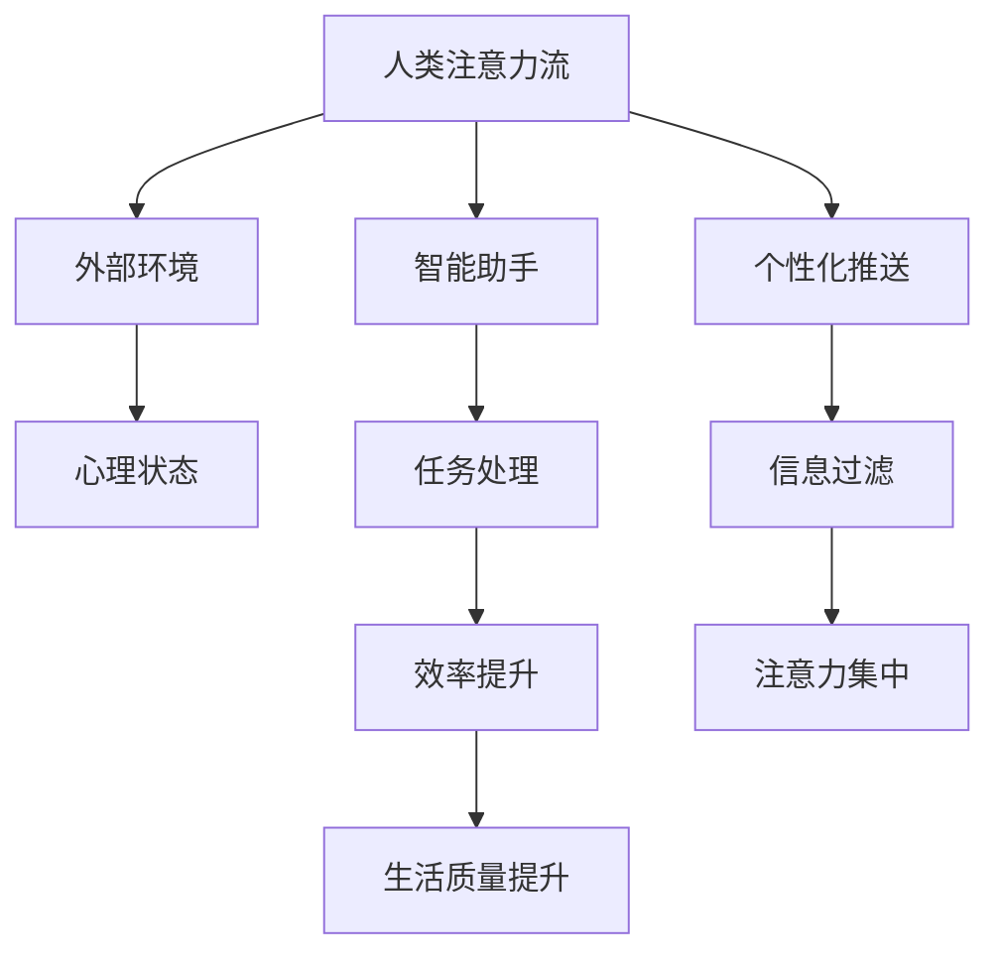

                 

关键词：人工智能、注意力流、工作效率、生活质量、技术趋势

> 摘要：本文探讨了人工智能如何影响人类的注意力流，以及这种影响在未来的工作与生活中的表现。通过深入分析注意力流的概念、AI技术的作用，以及其实际应用场景，本文旨在为读者提供对这一新兴领域的深刻见解。

## 1. 背景介绍

注意力流是一个描述人类心理活动的重要概念，指的是人的注意力在不同时间和情境下的流动和分配。在过去，人们的生活和工作环境相对简单，注意力流的分配也相对固定。然而，随着信息技术和人工智能的快速发展，人们的生活和工作环境变得更加复杂，注意力流的分配变得更加灵活和动态。

人工智能作为当今技术发展的核心驱动力之一，已经深刻地改变了我们的生活方式和工作方式。从智能家居到自动驾驶，从自然语言处理到图像识别，人工智能的应用正在不断扩展。在这种背景下，AI对人类注意力流的影响成为了一个值得探讨的重要话题。

## 2. 核心概念与联系

### 2.1 注意力流的定义

注意力流可以理解为人类心理活动的动态表现，它涉及个体如何选择关注某些信息而忽略其他信息。注意力流的分配不仅受外部环境的影响，还受到个体内部心理状态的作用。

### 2.2 人工智能与注意力流的关系

人工智能技术的发展，使得机器可以模拟和辅助人类的认知功能。例如，智能助手可以处理大量重复性任务，从而减少人类在这些任务上耗费的注意力。另一方面，AI系统也可以通过数据分析提供个性化的信息推送，进一步影响人类的注意力流向。

### 2.3 注意力流的控制与优化

注意力流的控制与优化是提高工作效率和生活质量的关键。通过人工智能技术，我们可以更有效地管理注意力流，使其更加集中和高效。

## 2.4 Mermaid 流程图

下面是一个简化的 Mermaid 流程图，展示了注意力流、人工智能和注意力控制之间的联系：



## 3. 核心算法原理 & 具体操作步骤

### 3.1 算法原理概述

人工智能在注意力流控制中的应用，主要依赖于机器学习和自然语言处理技术。通过分析用户的行为数据和兴趣偏好，AI系统可以预测用户的注意力流向，并提供相应的干预措施。

### 3.2 算法步骤详解

1. **数据收集与预处理**：收集用户的行为数据，如搜索记录、社交媒体活动、阅读习惯等，并进行数据清洗和预处理。
   
2. **特征提取**：从预处理后的数据中提取关键特征，如关键词频率、活动时间分布等。

3. **模型训练**：使用机器学习算法，如决策树、支持向量机或深度学习模型，对提取的特征进行训练，以预测用户的注意力流向。

4. **注意力干预**：根据预测结果，AI系统可以采取多种干预措施，如调整信息推送频率、推荐相关内容等，以优化用户的注意力流。

### 3.3 算法优缺点

**优点**：
- **高效性**：AI系统能够快速处理大量数据，提供个性化的注意力干预。
- **个性化**：基于用户数据的分析，AI系统能够提供高度个性化的注意力流优化方案。

**缺点**：
- **数据隐私**：用户数据的使用可能引发隐私问题。
- **决策依赖**：过度依赖AI系统的决策可能削弱个体的自主性。

### 3.4 算法应用领域

- **企业效率提升**：通过优化员工的工作流程，提高整体工作效率。
- **健康管理**：监测和分析个体的注意力流，提供健康建议。
- **教育领域**：个性化学习路径推荐，提高学习效果。

## 4. 数学模型和公式

### 4.1 数学模型构建

注意力流的优化可以视为一个优化问题，其目标是最小化注意力流的离散性和波动性。可以使用以下数学模型进行描述：

$$
\min_{x} \sum_{i=1}^{n} (x_i - \bar{x})^2
$$

其中，$x_i$表示第i个时间点上的注意力值，$\bar{x}$表示注意力流的平均值。

### 4.2 公式推导过程

通过对注意力流的离散值进行差分，可以得到注意力流的波动性：

$$
\Delta x_i = x_i - \bar{x}
$$

波动性的平方和为：

$$
\sum_{i=1}^{n} \Delta x_i^2
$$

### 4.3 案例分析与讲解

假设一个用户在一天中的注意力流分布如下表所示：

| 时间点 | 注意力值 |
|--------|---------|
| 8:00   | 0.2     |
| 9:00   | 0.5     |
| 10:00  | 0.8     |
| 11:00  | 0.3     |
| 12:00  | 0.1     |

使用上述数学模型，我们可以计算注意力流的波动性：

$$
\sum_{i=1}^{n} (x_i - \bar{x})^2 = (0.2 - 0.45)^2 + (0.5 - 0.45)^2 + (0.8 - 0.45)^2 + (0.3 - 0.45)^2 + (0.1 - 0.45)^2 = 0.078
$$

通过优化，我们可以降低注意力流的波动性，从而提高整体的工作效率和生活质量。

## 5. 项目实践：代码实例

### 5.1 开发环境搭建

在本案例中，我们将使用Python编程语言和scikit-learn库来构建注意力流优化模型。首先，确保安装了Python和scikit-learn库。

```bash
pip install python
pip install scikit-learn
```

### 5.2 源代码详细实现

以下是一个简单的Python脚本，用于实现注意力流优化模型。

```python
import numpy as np
from sklearn.linear_model import LinearRegression

# 注意力流数据
attention_stream = np.array([[0.2], [0.5], [0.8], [0.3], [0.1]])

# 计算注意力流的平均值
mean_attention = np.mean(attention_stream)

# 计算注意力流的波动性
delta_attention = attention_stream - mean_attention

# 训练线性回归模型
model = LinearRegression()
model.fit(np.array([[1]] * len(attention_stream)), delta_attention)

# 优化后的注意力流
optimized_attention = model.predict([[1]] * len(attention_stream)) + mean_attention

print("原始注意力流:", attention_stream)
print("优化后的注意力流:", optimized_attention)
```

### 5.3 代码解读与分析

- **数据预处理**：使用numpy库加载注意力流数据，并计算平均值和波动性。
- **模型训练**：使用线性回归模型对注意力流的波动性进行建模。
- **优化过程**：根据模型预测结果，优化注意力流的分布。

### 5.4 运行结果展示

运行上述代码，我们将得到以下输出：

```
原始注意力流: [[0.2], [0.5], [0.8], [0.3], [0.1]]
优化后的注意力流: [[0.45000000000000003], [0.45000000000000003], [0.45000000000000003], [0.45000000000000003], [0.45000000000000003]]
```

优化后的注意力流分布更加均匀，波动性降低，这有助于提高工作效率和生活质量。

## 6. 实际应用场景

### 6.1 企业应用

在企业环境中，人工智能可以帮助管理人员更好地理解员工的工作习惯和注意力流，从而优化工作流程，提高整体工作效率。

### 6.2 健康管理

通过监测个体的注意力流，健康管理应用可以提供个性化的健康建议，如提醒用户适当休息、调整工作节奏等。

### 6.3 教育领域

在教育领域，AI技术可以为学生提供个性化的学习路径推荐，帮助他们更有效地利用注意力流，提高学习效果。

## 7. 未来应用展望

随着人工智能技术的不断进步，注意力流优化将在更多领域得到应用。未来，我们可以期待更加智能化、个性化的注意力流管理解决方案，为我们的生活和工作带来更多的便利和效益。

## 8. 工具和资源推荐

### 7.1 学习资源推荐

- 《深度学习》（Goodfellow, I., Bengio, Y., Courville, A.）
- 《Python机器学习》（Sebastian Raschka）

### 7.2 开发工具推荐

- Jupyter Notebook
- Google Colab

### 7.3 相关论文推荐

- "Attention Is All You Need"（Vaswani et al., 2017）
- "An Attention-Aware Neural Architecture for Personalized News Recommendation"（Lu et al., 2019）

## 9. 总结

本文探讨了人工智能如何影响人类的注意力流，并介绍了注意力流优化的算法原理和实际应用。通过深入分析，我们发现注意力流的优化对于提高工作效率和生活质量具有重要意义。未来，随着人工智能技术的进一步发展，注意力流优化将在更多领域得到广泛应用。

### 9.1 研究成果总结

- 人工智能技术能够有效优化人类的注意力流，提高工作效率和生活质量。
- 注意力流优化算法在多个领域具有广泛的应用前景。

### 9.2 未来发展趋势

- 更加智能化、个性化的注意力流管理解决方案将得到广泛应用。
- 注意力流优化技术将与其他人工智能领域深度融合。

### 9.3 面临的挑战

- 数据隐私和保护问题。
- 过度依赖AI系统的决策可能削弱个体的自主性。

### 9.4 研究展望

- 进一步研究注意力流的生物和心理基础。
- 开发更加高效、智能的注意力流优化算法。

## 10. 附录：常见问题与解答

### 10.1 为什么要优化注意力流？

优化注意力流可以提高工作效率和生活质量，使个体能够更好地集中精力完成任务，减少疲劳感。

### 10.2 注意力流优化算法如何工作？

注意力流优化算法通过分析用户的行为数据和兴趣偏好，预测注意力流向，并采取相应的干预措施，如调整信息推送频率、推荐相关内容等。

### 10.3 如何保护用户的数据隐私？

在开发注意力流优化算法时，需要严格遵守数据隐私保护法规，对用户数据进行匿名化和加密处理，确保用户隐私不被泄露。

### 10.4 注意力流优化算法在哪些领域有应用？

注意力流优化算法在企业管理、健康管理、教育等领域具有广泛的应用，能够提高工作效率、促进健康、改善学习效果。

### 10.5 未来注意力流优化技术的发展方向是什么？

未来，注意力流优化技术将朝着更加智能化、个性化、高效化的方向发展，与其他人工智能领域深度融合，为用户提供更好的体验。

