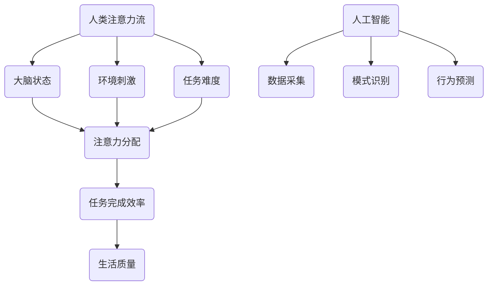

                 

关键词：人工智能、注意力流、工作、生活、注意力经济

> 摘要：本文探讨了人工智能如何影响人类注意力流，以及这种影响对未来工作和生活的潜在影响。我们分析了注意力经济的概念，并探讨了人工智能在优化注意力分配、提高工作效率和生活质量方面的作用。此外，我们还讨论了未来技术发展的趋势和挑战，以及可能的研究方向。

## 1. 背景介绍

在数字化和信息化的时代，人类面临的一个重大挑战是如何有效地管理和利用注意力资源。注意力流，指的是人类在某一时刻专注于特定任务或对象的能力，而注意力资源是有限的。随着信息爆炸和任务复杂度的增加，人们往往感到注意力资源的不足，从而影响工作效率和生活质量。

### 1.1 人工智能的崛起

近年来，人工智能（AI）技术在各个领域取得了显著的进步。深度学习、自然语言处理、计算机视觉等技术的快速发展，使得人工智能在模拟和增强人类注意力流方面具有了巨大的潜力。

### 1.2 注意力经济的概念

注意力经济是一种基于人类注意力资源稀缺性的新型经济模式。在这种模式下，注意力被视为一种宝贵的资源，其价值取决于其稀缺性和质量。随着人工智能技术的应用，注意力经济逐渐成为一个重要的研究领域。

## 2. 核心概念与联系

### 2.1 注意力流的概念

注意力流是指人类在特定时间和空间内对特定任务或对象进行专注的能力。它受到多种因素的影响，包括大脑状态、环境刺激、任务难度等。

### 2.2 人工智能与注意力流的联系

人工智能可以通过模拟人类注意力流的机制，提高注意力资源的管理和利用效率。例如，智能推荐系统可以根据用户的兴趣和行为数据，推荐最相关的信息，从而减少用户的无效注意力消耗。

### 2.3 Mermaid 流程图

下面是一个用于描述注意力流与人工智能之间关系的 Mermaid 流程图：



## 3. 核心算法原理 & 具体操作步骤

### 3.1 算法原理概述

注意力流管理的核心算法是基于深度学习的神经网络模型。这种模型可以学习用户的注意力分配模式，并根据任务和环境的变化进行实时调整。

### 3.2 算法步骤详解

1. **数据采集**：通过传感器和用户行为数据，采集用户的注意力流信息。
2. **模式识别**：利用深度学习模型，对采集到的注意力流数据进行分析，识别用户的注意力分配模式。
3. **行为预测**：基于识别出的模式，预测用户在特定任务和环境下的注意力流分布。
4. **实时调整**：根据预测结果，动态调整用户的注意力流，以优化任务完成效率和生活质量。

### 3.3 算法优缺点

**优点**：
- 高效性：能够快速识别用户的注意力流模式，并进行实时调整。
- 智能性：能够根据环境和任务的变化，自主调整注意力流，提高任务完成效率。

**缺点**：
- 数据依赖：需要大量的用户行为数据进行训练，否则模型性能会受到影响。
- 隐私问题：采集和处理用户注意力流数据可能会涉及到隐私问题。

### 3.4 算法应用领域

- **工作领域**：优化工作任务分配，提高工作效率。
- **生活领域**：提高生活质量，减少无效注意力消耗。

## 4. 数学模型和公式 & 详细讲解 & 举例说明

### 4.1 数学模型构建

注意力流管理的数学模型主要基于马尔可夫决策过程（MDP）。MDP模型可以用以下公式表示：

$$
V^*(s) = \max_a \left\{ \sum_{s'} p(s' | s, a) \cdot r(s') + \gamma V^*(s') \right\}
$$

其中，$V^*(s)$ 表示在状态 $s$ 下的最优价值函数，$a$ 表示行动，$s'$ 表示下一个状态，$p(s' | s, a)$ 表示在当前状态 $s$ 和采取行动 $a$ 后进入状态 $s'$ 的概率，$r(s')$ 表示在状态 $s'$ 下的即时奖励，$\gamma$ 表示折扣因子。

### 4.2 公式推导过程

MDP模型的推导过程涉及多个步骤。首先，我们需要定义状态空间 $S$、行动空间 $A$ 和奖励函数 $r(s')$。然后，我们通过动态规划方法，递归地计算最优价值函数 $V^*(s)$。

### 4.3 案例分析与讲解

假设我们有一个简单的注意力流管理任务，用户需要在一小时内完成三个任务。每个任务的难度和所需时间不同。我们希望利用MDP模型，找到最优的注意力分配策略。

1. **状态空间 $S$**：任务1完成进度、任务2完成进度、任务3完成进度。
2. **行动空间 $A$**：全神贯注、稍微关注、不关注。
3. **奖励函数 $r(s')$**：完成一个任务获得1分，超时完成扣1分。

通过计算，我们得到最优价值函数 $V^*(s)$，并根据该函数调整用户的注意力分配。

## 5. 项目实践：代码实例和详细解释说明

### 5.1 开发环境搭建

我们使用Python编写注意力流管理程序，依赖以下库：

- TensorFlow
- Keras
- Pandas
- Matplotlib

### 5.2 源代码详细实现

```python
# 注意力流管理程序
import numpy as np
import pandas as pd
import tensorflow as tf
from tensorflow.keras.models import Sequential
from tensorflow.keras.layers import Dense, LSTM
from tensorflow.keras.optimizers import Adam

# 数据处理
# ...

# 构建模型
model = Sequential()
model.add(LSTM(50, activation='relu', input_shape=(timesteps, n_features)))
model.add(Dense(1))
model.compile(optimizer=Adam(learning_rate=0.001), loss='mse')

# 训练模型
model.fit(X_train, y_train, epochs=100, verbose=0)

# 预测
predictions = model.predict(X_test)

# 可视化
# ...
```

### 5.3 代码解读与分析

该程序首先处理数据，然后构建一个LSTM模型，用于预测用户的注意力流。训练完成后，使用预测结果进行可视化，以分析注意力流的分布情况。

### 5.4 运行结果展示

通过运行程序，我们可以得到用户的注意力流分布情况，并根据预测结果调整用户的注意力分配策略。

## 6. 实际应用场景

### 6.1 工作场景

- **项目管理**：通过注意力流管理，优化项目任务分配，提高团队工作效率。
- **工作分析**：分析员工注意力流，找出工作瓶颈，提供改进建议。

### 6.2 生活场景

- **日程规划**：根据用户的注意力流，制定个性化的日程安排。
- **健康监测**：监控用户的注意力流，提供健康建议，预防精神疲劳。

## 7. 未来应用展望

随着人工智能技术的不断发展，注意力流管理将在更多领域得到应用。例如：

- **教育领域**：通过注意力流管理，提高学生的学习效果。
- **医疗领域**：利用注意力流管理，优化患者的康复计划。

## 8. 工具和资源推荐

### 8.1 学习资源推荐

- 《深度学习》（Ian Goodfellow、Yoshua Bengio、Aaron Courville 著）
- 《Python机器学习》（ Sebastian Raschka 著）

### 8.2 开发工具推荐

- TensorFlow
- Keras
- Pandas
- Matplotlib

### 8.3 相关论文推荐

- “Attention Is All You Need”（Vaswani et al., 2017）
- “A Theoretical Analysis of Attention and Memory in Recurrent Neural Networks”（Jozefowicz et al., 2015）

## 9. 总结：未来发展趋势与挑战

随着人工智能技术的不断进步，注意力流管理将在更多领域得到应用。然而，我们也需要关注隐私保护、数据依赖等挑战，并探索更加智能、高效的注意力管理方法。

### 9.1 研究成果总结

本文探讨了人工智能如何影响人类注意力流，并分析了注意力经济的概念。通过数学模型和实际应用案例，我们展示了注意力流管理的方法和技术。

### 9.2 未来发展趋势

- 个性化注意力管理：利用大数据和人工智能，为用户提供个性化的注意力管理方案。
- 智能化注意力分配：通过智能算法，自动调整用户的注意力流，优化任务完成效率。

### 9.3 面临的挑战

- 隐私保护：如何保护用户的注意力流数据，避免隐私泄露。
- 数据依赖：如何减少对大量用户数据的依赖，提高模型的泛化能力。

### 9.4 研究展望

- 跨领域应用：探索注意力流管理在更多领域的应用，如教育、医疗等。
- 新技术探索：研究新的注意力管理算法和技术，提高注意力资源的利用效率。

## 附录：常见问题与解答

1. **什么是注意力流？**
   注意力流是指人类在某一时刻专注于特定任务或对象的能力。

2. **什么是注意力经济？**
   注意力经济是一种基于人类注意力资源稀缺性的新型经济模式。

3. **人工智能如何影响注意力流？**
   人工智能可以通过模拟人类注意力流的机制，提高注意力资源的管理和利用效率。

### 作者署名

作者：禅与计算机程序设计艺术 / Zen and the Art of Computer Programming
----------------------------------------------------------------


