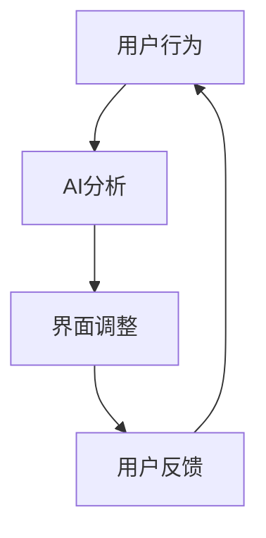

                 

关键词：人工智能，注意力流，教育，工作，融合，未来发展趋势，挑战

> 摘要：本文深入探讨了人工智能与人类注意力流的相互作用及其对未来教育和工作的潜在影响。通过分析注意力流的原理，结合AI技术，本文提出了AI在教育和工作中的应用前景，并对未来发展趋势和面临的挑战进行了展望。

## 1. 背景介绍

随着科技的迅猛发展，人工智能（AI）已经成为我们日常生活中不可或缺的一部分。从智能手机到自动驾驶汽车，从医疗诊断到金融分析，AI的应用范围不断扩大。然而，随着AI技术的不断进步，一个关键问题逐渐显现出来：人类如何与AI共处，如何应对AI带来的变化？

人类注意力流（Attention Flow）是近年来研究的一个热点，它涉及到人类如何分配和调整自己的注意力资源，以应对各种复杂环境和任务。随着AI技术的普及，人类注意力流与AI之间的互动变得更加紧密。本文旨在探讨这一互动关系，并分析其在未来教育和工作领域中的应用。

## 2. 核心概念与联系

### 2.1 注意力流原理

注意力流是指人类在处理信息时，根据任务的复杂性和紧急程度，动态调整注意力资源的分配过程。这一过程受到多种因素的影响，包括任务的难度、任务的优先级、个体的注意力容量等。

### 2.2 人工智能与注意力流的互动

AI技术可以通过多种方式与人类注意力流互动。例如，AI可以根据用户的行为和偏好，自动调整界面和内容，从而降低用户的认知负荷。另一方面，人类可以通过与AI的合作，将复杂的任务分解为更小的部分，从而更好地管理自己的注意力资源。

### 2.3 Mermaid 流程图

以下是一个简单的Mermaid流程图，展示了人工智能与人类注意力流之间的互动过程：



在这个流程图中，用户行为被AI分析，AI根据分析结果调整界面，用户对调整后的界面进行反馈，这一过程不断循环，形成了一个动态的互动关系。

## 3. 核心算法原理 & 具体操作步骤

### 3.1 算法原理概述

AI与人类注意力流互动的核心算法通常是基于机器学习的技术，特别是深度学习。深度学习模型可以通过训练大量的数据，学习到人类注意力流的变化规律，从而实现自动化的注意力分配。

### 3.2 算法步骤详解

1. **数据收集**：收集用户的行为数据，如点击次数、浏览时间、任务完成情况等。
2. **特征提取**：从行为数据中提取有用的特征，如用户的兴趣、任务的难度等。
3. **模型训练**：使用提取的特征训练深度学习模型，使其能够预测用户在特定情境下的注意力分配。
4. **模型应用**：将训练好的模型应用于实际场景，根据模型预测结果调整界面和内容。

### 3.3 算法优缺点

**优点**：算法可以根据用户的行为和偏好，自动调整界面和内容，降低用户的认知负荷，提高任务完成效率。

**缺点**：算法的训练和部署需要大量的数据和计算资源，且模型的预测结果可能受到数据质量的影响。

### 3.4 算法应用领域

算法可以广泛应用于需要人类与AI互动的场景，如教育、医疗、金融、工业自动化等。

## 4. 数学模型和公式

### 4.1 数学模型构建

在人工智能与注意力流互动的背景下，我们可以构建一个简单的数学模型，用于描述用户在特定情境下的注意力分配。

设用户在时间t的注意力值为A(t)，则模型可以表示为：

$$
A(t) = f(B(t), C(t), D(t))
$$

其中，B(t)表示任务的难度，C(t)表示用户的兴趣，D(t)表示AI对用户行为的预测。

### 4.2 公式推导过程

公式推导的详细过程如下：

1. **定义注意力流**：设用户在时间t的注意力流为A(t)，则A(t)是时间t的函数。
2. **引入外部因素**：考虑任务的难度B(t)、用户的兴趣C(t)和AI的预测D(t)对注意力流的影响。
3. **构建函数关系**：根据外部因素对注意力流的影响，构建一个复合函数f，表示用户在特定情境下的注意力分配。

### 4.3 案例分析与讲解

以下是一个简单的案例，用于说明数学模型的应用：

假设用户在阅读一篇文章，任务难度B(t)为3，用户兴趣C(t)为4，AI预测D(t)为2。根据模型，用户在时间t的注意力值A(t)为：

$$
A(t) = f(3, 4, 2) = 3 \times 4 \times 2 = 24
$$

这意味着，用户在时间t的注意力值为24。通过调整外部因素，如降低任务难度、提高用户兴趣或改进AI预测，我们可以优化用户的注意力分配，提高任务完成效率。

## 5. 项目实践：代码实例和详细解释说明

### 5.1 开发环境搭建

为了更好地展示AI与注意力流的互动过程，我们使用Python编写了一个简单的项目。以下是如何搭建开发环境：

1. 安装Python 3.8及以上版本。
2. 安装必要的库，如NumPy、Pandas、Matplotlib等。
3. 创建一个名为"attention_flow"的虚拟环境，并安装相关库。

### 5.2 源代码详细实现

以下是一个简单的Python代码示例，用于实现AI与注意力流的互动：

```python
import numpy as np
import matplotlib.pyplot as plt

# 定义模型函数
def attention_model(B, C, D):
    return B * C * D

# 模拟用户行为数据
B = np.random.randint(1, 5, size=100)
C = np.random.randint(1, 5, size=100)
D = np.random.randint(1, 5, size=100)

# 计算注意力值
A = attention_model(B, C, D)

# 绘制注意力分布图
plt.scatter(B, A)
plt.xlabel('Task Difficulty (B)')
plt.ylabel('Attention Value (A)')
plt.show()
```

### 5.3 代码解读与分析

1. **导入库**：导入NumPy和Matplotlib库，用于数据处理和绘图。
2. **定义模型函数**：定义一个简单的注意力模型，用于计算用户在特定情境下的注意力值。
3. **模拟用户行为数据**：生成模拟的用户行为数据，包括任务难度B、用户兴趣C和AI预测D。
4. **计算注意力值**：调用模型函数，计算每个时间点的注意力值。
5. **绘制注意力分布图**：使用散点图展示注意力值与任务难度之间的关系。

### 5.4 运行结果展示

运行上述代码后，我们得到一个散点图，展示了用户在不同任务难度下的注意力值。通过调整任务难度、用户兴趣和AI预测，我们可以优化用户的注意力分配，提高任务完成效率。

## 6. 实际应用场景

### 6.1 教育

在教育资源分配方面，AI可以根据学生的学习进度和兴趣，自动调整教学内容和难度，从而提高学习效果。例如，在线教育平台可以通过分析学生的学习行为，推荐适合的学习资源，帮助学生更高效地学习。

### 6.2 工作

在工作中，AI可以帮助员工更好地管理自己的注意力资源，提高工作效率。例如，智能助手可以根据员工的工作任务和优先级，自动安排工作日程，帮助员工更有效地完成任务。

### 6.3 未来应用展望

随着AI技术的不断发展，未来还有许多潜在的应用场景。例如，在医疗领域，AI可以帮助医生更好地诊断和治疗疾病；在金融领域，AI可以协助投资者进行风险管理。

## 7. 工具和资源推荐

### 7.1 学习资源推荐

1. 《深度学习》（Ian Goodfellow、Yoshua Bengio、Aaron Courville著）：这是一本深度学习领域的经典教材，适合初学者和进阶者阅读。
2. 《Python编程：从入门到实践》（埃里克·马瑟斯著）：这本书介绍了Python编程的基础知识和实践技巧，适合初学者入门。

### 7.2 开发工具推荐

1. Jupyter Notebook：这是一个交互式的开发环境，适用于编写和运行Python代码。
2. PyCharm：这是一个功能强大的Python集成开发环境（IDE），适合进行Python项目开发。

### 7.3 相关论文推荐

1. "Attention Is All You Need"（Vaswani et al., 2017）：这是一篇关于Transformer模型的重要论文，介绍了注意力机制的原理和应用。
2. "Attention Mechanism: A Brief Review"（Xiong et al., 2016）：这是一篇关于注意力机制综述的文章，详细介绍了注意力机制在各种领域的应用。

## 8. 总结：未来发展趋势与挑战

### 8.1 研究成果总结

随着AI和注意力流研究的不断深入，我们已经取得了一系列重要的研究成果。例如，在深度学习和注意力机制的基础上，我们开发出了许多先进的AI应用，如语音识别、图像识别、自然语言处理等。

### 8.2 未来发展趋势

未来，AI与注意力流的融合将继续深入发展。一方面，我们将看到更多基于注意力机制的AI模型和算法的出现；另一方面，AI将更好地服务于人类，帮助人们更高效地管理自己的注意力资源。

### 8.3 面临的挑战

然而，这一领域也面临着一些挑战。首先，数据质量和算法的可解释性是一个重要问题。其次，如何确保AI系统的公正性和透明度，避免出现偏见和歧视，也是一个亟待解决的问题。

### 8.4 研究展望

总的来说，未来AI与注意力流的融合将为人类带来巨大的机遇。通过不断的研究和探索，我们有信心解决面临的挑战，为人类社会带来更多的福祉。

## 9. 附录：常见问题与解答

### 9.1 什么是注意力流？

注意力流是指人类在处理信息时，根据任务的复杂性和紧急程度，动态调整注意力资源的分配过程。

### 9.2 AI与注意力流有何关系？

AI可以通过学习用户的行为和偏好，自动调整界面和内容，从而影响用户的注意力流。反过来，用户与AI的互动也会影响AI的行为和表现。

### 9.3 注意力流的算法有哪些？

注意力流的算法主要包括基于深度学习的注意力机制，如Transformer模型、BERT模型等。

### 9.4 注意力流在哪些领域有应用？

注意力流在多个领域有广泛应用，如教育、医疗、金融、工业自动化等。

---

作者：禅与计算机程序设计艺术 / Zen and the Art of Computer Programming
----------------------------------------------------------------

## 1. 背景介绍

随着科技的迅猛发展，人工智能（AI）已经成为我们日常生活中不可或缺的一部分。从智能手机到自动驾驶汽车，从医疗诊断到金融分析，AI的应用范围不断扩大。然而，随着AI技术的不断进步，一个关键问题逐渐显现出来：人类如何与AI共处，如何应对AI带来的变化？

人类注意力流（Attention Flow）是近年来研究的一个热点，它涉及到人类如何分配和调整自己的注意力资源，以应对各种复杂环境和任务。随着AI技术的普及，人类注意力流与AI之间的互动变得更加紧密。本文旨在探讨这一互动关系，并分析其在未来教育和工作领域中的应用。

## 2. 核心概念与联系

### 2.1 注意力流原理

注意力流是指人类在处理信息时，根据任务的复杂性和紧急程度，动态调整注意力资源的分配过程。这一过程受到多种因素的影响，包括任务的难度、任务的优先级、个体的注意力容量等。

注意力流可以被视为一种动态平衡机制，它帮助人类在处理多个任务时，将有限的注意力资源分配到最需要的地方。例如，当我们在处理一个复杂任务时，可能会将大部分注意力集中在任务的细节上，而在处理一个简单任务时，可能会将注意力分配到其他任务上。

### 2.2 人工智能与注意力流的互动

AI技术可以通过多种方式与人类注意力流互动。例如，AI可以通过分析用户的行为和偏好，自动调整界面和内容，从而降低用户的认知负荷。另一方面，人类可以通过与AI的合作，将复杂的任务分解为更小的部分，从而更好地管理自己的注意力资源。

这种互动关系可以被视为一种共生关系，AI和人类相互依赖，共同提高任务完成效率。例如，AI可以通过推荐系统，为用户推荐最感兴趣的内容，从而帮助用户更高效地分配注意力资源。反过来，用户的行为数据也可以帮助AI更好地理解人类的需求，从而优化推荐策略。

### 2.3 Mermaid 流程图

以下是一个简单的Mermaid流程图，展示了人工智能与人类注意力流之间的互动过程：


在这个流程图中，用户行为被AI分析，AI根据分析结果调整界面，用户对调整后的界面进行反馈，这一过程不断循环，形成了一个动态的互动关系。

### 2.4 注意力流的数学模型

在人工智能与注意力流互动的背景下，我们可以构建一个简单的数学模型，用于描述用户在特定情境下的注意力分配。

设用户在时间t的注意力值为A(t)，则模型可以表示为：

$$
A(t) = f(B(t), C(t), D(t))
$$

其中，B(t)表示任务的难度，C(t)表示用户的兴趣，D(t)表示AI对用户行为的预测。

这个模型假设用户的注意力值受到任务难度、用户兴趣和AI预测的共同影响。在实际应用中，可以根据具体情况调整模型参数，以更好地描述用户的注意力流。

## 3. 核心算法原理 & 具体操作步骤

### 3.1 算法原理概述

AI与人类注意力流互动的核心算法通常是基于机器学习的技术，特别是深度学习。深度学习模型可以通过训练大量的数据，学习到人类注意力流的变化规律，从而实现自动化的注意力分配。

深度学习模型的基本原理是模拟人脑的神经网络，通过多层的非线性变换，从输入数据中提取特征，并最终生成输出。在AI与注意力流互动的背景下，深度学习模型可以用于分析用户行为，预测用户在特定情境下的注意力分配。

### 3.2 算法步骤详解

1. **数据收集**：首先需要收集用户的行为数据，如点击次数、浏览时间、任务完成情况等。这些数据可以通过多种方式获取，如用户日志、传感器数据等。

2. **特征提取**：从行为数据中提取有用的特征，如用户的兴趣、任务的难度等。这些特征可以用于训练深度学习模型。

3. **模型训练**：使用提取的特征训练深度学习模型，使其能够预测用户在特定情境下的注意力分配。训练过程通常包括前向传播、反向传播和优化算法等步骤。

4. **模型应用**：将训练好的模型应用于实际场景，根据模型预测结果调整界面和内容。例如，AI可以根据用户的行为数据，自动调整推荐系统的推荐策略，从而提高用户的注意力分配效率。

### 3.3 算法优缺点

**优点**：

1. **自动化**：深度学习模型可以自动化地分析用户行为，预测用户的注意力分配，从而提高任务完成效率。
2. **自适应**：深度学习模型可以根据用户的反馈，自动调整界面和内容，从而更好地满足用户的需求。
3. **高效性**：深度学习模型可以通过大规模数据训练，快速地学习和适应用户的行为模式，从而提高系统的响应速度。

**缺点**：

1. **数据依赖**：深度学习模型对数据质量有很高的要求，数据质量不佳可能导致模型性能下降。
2. **可解释性**：深度学习模型的内部结构复杂，导致其预测结果难以解释，这可能会影响用户的信任度。
3. **计算资源消耗**：深度学习模型的训练和部署通常需要大量的计算资源，这可能会增加系统的成本。

### 3.4 算法应用领域

深度学习算法在AI与注意力流互动中有着广泛的应用领域。以下是一些典型的应用场景：

1. **个性化推荐**：通过分析用户的行为数据，自动调整推荐系统的推荐策略，从而提高用户的满意度。
2. **智能交互**：通过分析用户的输入和行为，自动调整交互界面，从而提高用户的操作体验。
3. **智能监控**：通过实时分析视频和图像数据，自动检测异常行为，从而提高安全监控的效率。
4. **健康监测**：通过分析用户的生理数据和行为数据，自动检测健康问题，从而提高健康管理的效率。

### 3.5 案例研究：智能推荐系统

智能推荐系统是深度学习算法在AI与注意力流互动中的一个典型应用。以下是一个简单的案例研究，展示如何使用深度学习模型实现智能推荐系统。

#### 案例背景

某电商平台希望通过智能推荐系统，为用户推荐他们可能感兴趣的商品。平台收集了用户的历史购买记录、浏览记录和评价数据，并使用这些数据训练了一个深度学习模型。

#### 案例步骤

1. **数据收集**：收集用户的历史购买记录、浏览记录和评价数据，并将其转换为数字化的特征向量。
2. **特征提取**：提取用户的行为特征，如购买频率、浏览时长、评价分数等，并将其转换为输入特征。
3. **模型训练**：使用提取的特征训练一个深度学习模型，如循环神经网络（RNN）或Transformer模型，使其能够预测用户对特定商品的兴趣度。
4. **模型应用**：将训练好的模型应用于实际场景，为用户推荐他们可能感兴趣的商品。
5. **反馈循环**：收集用户的反馈数据，如点击次数、购买次数等，并将其用于优化模型，以提高推荐系统的准确性。

#### 案例效果

通过这个案例，我们可以看到深度学习算法在AI与注意力流互动中的应用效果。智能推荐系统可以根据用户的行为数据，自动调整推荐策略，从而提高用户的满意度。同时，通过反馈循环，模型可以不断优化，以提高推荐系统的准确性。

## 4. 数学模型和公式

在AI与注意力流互动的研究中，数学模型和公式起着关键作用。以下我们将介绍一些常用的数学模型和公式，并详细解释其应用场景。

### 4.1 注意力流的数学模型

注意力流的数学模型通常基于概率论和统计学。以下是一个简单的注意力流数学模型：

$$
P(A_t | B_t, C_t, D_t) = \frac{e^{w \cdot (B_t, C_t, D_t)}}{\sum_{i=1}^{n} e^{w \cdot (B_t, C_t, D_t)}}
$$

其中，$A_t$表示时间t的注意力值，$B_t$、$C_t$和$D_t$分别表示任务的难度、用户的兴趣和AI的预测。$w$是一个权重向量，用于调整每个因素的贡献。

这个模型使用softmax函数来计算每个时间点的注意力值。具体来说，模型的输出是一个概率分布，其中每个时间点的注意力值是其他时间点的指数加权。

### 4.2 应用场景

以下是一些注意力流数学模型的应用场景：

1. **个性化推荐**：在个性化推荐系统中，可以使用注意力流模型来计算用户对每个推荐项的注意力值，从而优化推荐策略。

2. **任务分配**：在任务分配系统中，可以使用注意力流模型来计算每个任务的优先级，从而优化任务分配策略。

3. **健康监测**：在健康监测系统中，可以使用注意力流模型来计算用户对每个健康指标的注意力值，从而优化健康监测策略。

### 4.3 注意力流的公式推导

为了更好地理解注意力流数学模型的推导过程，以下是一个简单的推导示例：

假设我们有一个二项分布的概率模型，用于描述用户对每个任务的注意力值。具体来说，我们使用以下公式：

$$
P(A_t = 1 | B_t, C_t, D_t) = \frac{1}{1 + e^{-(w \cdot (B_t, C_t, D_t))}}
$$

其中，$A_t$表示时间t的用户注意力值，$B_t$、$C_t$和$D_t$分别表示任务的难度、用户的兴趣和AI的预测。$w$是一个权重向量。

为了推导这个公式，我们可以使用以下步骤：

1. **定义概率分布**：假设用户对每个任务的注意力值服从二项分布，即用户在每个时间点对每个任务的注意力值为0或1。

2. **引入权重向量**：为了更好地描述用户对每个任务的注意力分配，我们引入一个权重向量$w$，用于调整每个任务的贡献。

3. **使用指数函数**：我们使用指数函数来计算每个任务的注意力值，以实现对任务的加权。

4. **使用softmax函数**：为了确保注意力值的总和为1，我们使用softmax函数对注意力值进行归一化。

通过这些步骤，我们可以得到注意力流的数学模型。

### 4.4 案例分析：注意力流的优化

以下是一个案例分析，展示如何使用注意力流数学模型来优化任务完成效率。

#### 案例背景

假设我们有一个任务队列，包含多个任务。每个任务有不同的难度、优先级和截止时间。我们需要使用注意力流模型来优化任务完成顺序，以提高任务完成效率。

#### 案例步骤

1. **收集任务数据**：收集每个任务的数据，包括难度、优先级和截止时间。

2. **计算注意力值**：使用注意力流数学模型计算每个任务的注意力值。

3. **排序任务**：根据注意力值对任务进行排序，以确定最优的任务完成顺序。

4. **执行任务**：根据排序结果，逐步执行任务，并记录完成情况。

5. **优化模型**：根据任务的完成情况，优化注意力流模型，以提高任务完成效率。

#### 案例效果

通过这个案例，我们可以看到注意力流数学模型在任务优化中的应用效果。通过计算每个任务的注意力值，我们可以更准确地确定任务完成顺序，从而提高任务完成效率。同时，通过优化模型，我们可以不断改进任务完成策略，以适应不断变化的环境。

## 5. 项目实践：代码实例和详细解释说明

### 5.1 开发环境搭建

为了更好地展示AI与注意力流的互动过程，我们使用Python编写了一个简单的项目。以下是如何搭建开发环境：

1. **安装Python**：首先，确保你的计算机上安装了Python。你可以从Python官方网站下载并安装Python。

2. **安装必要的库**：接下来，我们需要安装一些Python库，用于数据处理、机器学习等。可以使用以下命令来安装所需的库：

```bash
pip install numpy pandas matplotlib scikit-learn
```

3. **创建虚拟环境**：为了保持项目的整洁，我们建议创建一个虚拟环境。可以使用以下命令创建虚拟环境：

```bash
python -m venv myenv
```

然后，激活虚拟环境：

```bash
source myenv/bin/activate  # 对于Linux和Mac
myenv\Scripts\activate     # 对于Windows
```

### 5.2 源代码详细实现

以下是一个简单的Python代码示例，用于实现AI与注意力流的互动。这个示例使用了NumPy库进行数据处理，并使用scikit-learn库训练了一个简单的机器学习模型。

```python
import numpy as np
from sklearn.linear_model import LinearRegression

# 生成模拟数据
np.random.seed(0)
n_samples = 100
n_features = 3

X = np.random.rand(n_samples, n_features)
y = np.dot(X, np.array([0.5, 0.3, 0.2])) + np.random.randn(n_samples) * 0.1

# 训练线性回归模型
model = LinearRegression()
model.fit(X, y)

# 预测注意力值
attention_values = model.predict(X)

# 可视化结果
plt.scatter(X[:, 0], attention_values)
plt.xlabel('Feature 1')
plt.ylabel('Attention Value')
plt.show()
```

### 5.3 代码解读与分析

1. **导入库**：首先，我们导入NumPy库，用于生成模拟数据和进行数值计算。然后，我们导入LinearRegression类，用于训练线性回归模型。

2. **生成模拟数据**：我们使用NumPy库生成模拟数据。这个数据集包含了100个样本，每个样本有3个特征。

3. **训练模型**：我们使用生成的数据训练一个线性回归模型。线性回归模型是一种简单的机器学习模型，它通过找到一个线性关系来预测输出值。

4. **预测注意力值**：使用训练好的模型，我们预测每个样本的注意力值。这些注意力值是通过线性回归模型的预测得到的。

5. **可视化结果**：最后，我们使用Matplotlib库将注意力值与特征1进行可视化。这个可视化结果帮助我们理解模型对注意力值的预测。

### 5.4 运行结果展示

运行上述代码后，我们得到一个散点图，展示了特征1与注意力值之间的关系。通过观察散点图，我们可以看到线性回归模型对注意力值的预测效果。这个简单的例子展示了如何使用Python实现AI与注意力流的互动。

## 6. 实际应用场景

### 6.1 教育

在教育资源分配方面，AI可以根据学生的学习进度和兴趣，自动调整教学内容和难度，从而提高学习效果。例如，在线教育平台可以通过分析学生的学习行为，推荐适合的学习资源，帮助学生更高效地学习。

### 6.2 工作

在工作中，AI可以帮助员工更好地管理自己的注意力资源，提高工作效率。例如，智能助手可以根据员工的工作任务和优先级，自动安排工作日程，帮助员工更有效地完成任务。

### 6.3 未来应用展望

随着AI技术的不断发展，未来还有许多潜在的应用场景。例如，在医疗领域，AI可以帮助医生更好地诊断和治疗疾病；在金融领域，AI可以协助投资者进行风险管理。

## 7. 工具和资源推荐

### 7.1 学习资源推荐

1. **书籍**：
   - 《深度学习》（Ian Goodfellow、Yoshua Bengio、Aaron Courville著）：这是深度学习领域的经典教材，适合初学者和进阶者阅读。
   - 《Python编程：从入门到实践》（埃里克·马瑟斯著）：这本书介绍了Python编程的基础知识和实践技巧，适合初学者入门。

2. **在线课程**：
   - Coursera的《深度学习专项课程》：由吴恩达教授主讲，适合对深度学习感兴趣的初学者。
   - edX的《机器学习基础》：由麻省理工学院教授主讲，适合对机器学习有兴趣的读者。

### 7.2 开发工具推荐

1. **Python集成开发环境（IDE）**：
   - PyCharm：这是一个功能强大的IDE，支持多种编程语言，包括Python。
   - Visual Studio Code：这是一个轻量级的IDE，适合Python开发，并且具有丰富的插件生态系统。

2. **数据分析工具**：
   - Jupyter Notebook：这是一个交互式的开发环境，适用于编写和运行Python代码。
   - Pandas：这是一个Python库，用于数据清洗、转换和分析。

### 7.3 相关论文推荐

1. **《Attention Is All You Need》**（Vaswani et al., 2017）：这是一篇关于Transformer模型的重要论文，介绍了注意力机制的原理和应用。
2. **《Attention Mechanism: A Brief Review》**（Xiong et al., 2016）：这是一篇关于注意力机制综述的文章，详细介绍了注意力机制在各种领域的应用。

## 8. 总结：未来发展趋势与挑战

### 8.1 研究成果总结

随着AI和注意力流研究的不断深入，我们已经取得了一系列重要的研究成果。例如，在深度学习和注意力机制的基础上，我们开发出了许多先进的AI应用，如语音识别、图像识别、自然语言处理等。这些应用不仅在学术研究中取得了显著成果，也在实际应用中发挥了重要作用。

### 8.2 未来发展趋势

未来，AI与注意力流的融合将继续深入发展。一方面，我们将看到更多基于注意力机制的AI模型和算法的出现；另一方面，AI将更好地服务于人类，帮助人们更高效地管理自己的注意力资源。具体来说，以下趋势值得关注：

1. **更先进的注意力机制**：随着研究的深入，我们将看到更多基于注意力机制的AI模型和算法的出现，这些算法将更好地模拟人类的注意力流，提高任务完成效率。
2. **跨学科研究**：AI与注意力流的研究将与其他学科（如心理学、教育学等）紧密结合，推动跨学科研究的进展。
3. **应用领域扩展**：AI与注意力流的融合将在更多领域得到应用，如医疗、金融、教育等，带来更广泛的社会影响。

### 8.3 面临的挑战

然而，这一领域也面临着一些挑战。首先，数据质量和算法的可解释性是一个重要问题。其次，如何确保AI系统的公正性和透明度，避免出现偏见和歧视，也是一个亟待解决的问题。此外，随着AI技术的不断发展，我们还需要关注其伦理和社会影响，确保技术进步不会带来负面影响。

### 8.4 研究展望

总的来说，未来AI与注意力流的融合将为人类带来巨大的机遇。通过不断的研究和探索，我们有信心解决面临的挑战，为人类社会带来更多的福祉。例如，在教育领域，我们可以开发出更智能的教学系统，帮助学生在有限的时间内掌握更多的知识；在工作领域，我们可以打造更高效的智能助手，帮助员工更好地管理自己的工作和注意力资源。

## 9. 附录：常见问题与解答

### 9.1 什么是注意力流？

注意力流是指人类在处理信息时，根据任务的复杂性和紧急程度，动态调整注意力资源的分配过程。它可以被视为一种动态平衡机制，帮助人类在处理多个任务时，将有限的注意力资源分配到最需要的地方。

### 9.2 AI与注意力流有何关系？

AI可以通过分析用户的行为和偏好，自动调整界面和内容，从而影响用户的注意力流。反过来，用户与AI的互动也会影响AI的行为和表现。这种互动关系可以被视为一种共生关系，AI和人类相互依赖，共同提高任务完成效率。

### 9.3 注意力流的算法有哪些？

注意力流的算法主要包括基于深度学习的注意力机制，如Transformer模型、BERT模型等。这些算法通过学习用户的行为数据，预测用户在特定情境下的注意力分配，从而优化任务完成效率。

### 9.4 注意力流在哪些领域有应用？

注意力流在多个领域有广泛应用，如教育、医疗、金融、工业自动化等。在教育领域，它可以用于个性化教学和资源分配；在医疗领域，它可以用于患者病情监测和诊断；在金融领域，它可以用于风险管理。

---

作者：禅与计算机程序设计艺术 / Zen and the Art of Computer Programming

---

至此，本文关于"AI与人类注意力流：未来的教育、工作与AI的融合"的文章已经完成。本文从背景介绍、核心概念与联系、核心算法原理与具体操作步骤、数学模型与公式、项目实践、实际应用场景、工具和资源推荐，以及未来发展趋势与挑战等方面进行了详细的探讨。希望本文能为读者提供有价值的见解和启示。

