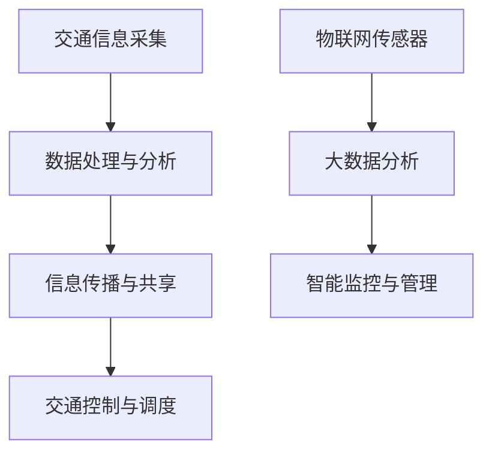

                 

关键词：人工智能，城市交通，基础设施建设，可持续发展，智能交通系统，计算模型，算法优化，资源利用，环境保护，智慧城市

> 摘要：本文探讨了人工智能在推动城市交通与基础设施建设的可持续发展中所发挥的关键作用。通过分析现有技术和挑战，本文提出了基于计算模型的智能交通系统解决方案，并详细描述了核心算法原理、数学模型和实际应用实例。文章旨在为相关领域的研究和实践提供有益的参考。

## 1. 背景介绍

随着全球城市化进程的加速，城市交通和基础设施的建设与管理面临前所未有的挑战。传统的交通管理系统往往难以应对日益增长的交通需求和复杂的城市环境。而人工智能（AI）技术的迅猛发展，为城市交通与基础设施的智能化升级提供了新的机遇。AI通过数据采集、分析与预测，能够优化交通流量，提高基础设施的利用效率，减少环境污染，实现城市交通与基础设施的可持续发展。

然而，AI在城市交通与基础设施建设中的应用仍然面临诸多挑战，如数据质量、算法效率、隐私保护等。因此，如何将AI技术与城市交通与基础设施建设相结合，构建一个高效、智能、可持续的交通运输体系，成为当前亟待解决的问题。

## 2. 核心概念与联系

### 2.1 智能交通系统

智能交通系统（Intelligent Transportation Systems，ITS）是一种利用现代信息技术、通信技术、传感技术和控制技术，实现交通信息的实时采集、处理与传播，从而优化交通管理、提升交通安全和效率的系统。ITS包括以下几个关键组成部分：

- **交通信息采集**：通过传感器、摄像头、车载设备等手段，实时获取交通流量、速度、密度等交通信息。
- **数据处理与分析**：利用大数据技术和机器学习算法，对采集到的交通信息进行处理与分析，提取有价值的信息和模式。
- **信息传播与共享**：通过交通广播、短信、互联网等渠道，将交通信息及时传播给驾驶员和交通管理者。
- **交通控制与调度**：基于分析结果，对交通信号灯、路段通行策略等进行优化，提高交通流畅性。

### 2.2 基础设施建设

基础设施建设是城市发展的基石，包括道路、桥梁、隧道、公共交通系统、停车场等。智能基础设施建设利用物联网（IoT）、大数据和AI技术，实现对基础设施的实时监测、维护和管理，提高基础设施的使用效率和寿命。

- **物联网传感器**：通过在基础设施关键部位安装传感器，实时监测基础设施的健康状况、使用情况等。
- **大数据分析**：利用大数据技术，对传感器数据进行分析，预测基础设施的损坏风险，制定维护计划。
- **智能监控与管理**：通过物联网平台，实现基础设施的智能监控与管理，提高维护效率。

### 2.3 Mermaid 流程图



## 3. 核心算法原理 & 具体操作步骤

### 3.1 算法原理概述

智能交通系统中的核心算法包括交通流量预测、交通信号灯优化和路径规划等。这些算法基于大量的交通数据和机器学习技术，实现对交通流量的实时监测和预测，从而优化交通管理。

- **交通流量预测**：通过分析历史交通数据，利用时间序列分析和机器学习算法，预测未来的交通流量。
- **交通信号灯优化**：根据实时交通流量数据，动态调整交通信号灯的时间配比，提高交通流畅性。
- **路径规划**：根据实时交通状况，为驾驶员提供最优路径，减少行驶时间和交通拥堵。

### 3.2 算法步骤详解

#### 3.2.1 交通流量预测

1. **数据收集**：从交通传感器、摄像头等设备中收集交通流量数据。
2. **数据预处理**：对数据进行清洗、去噪和归一化处理。
3. **特征提取**：利用时间序列分析方法，提取交通流量的特征。
4. **模型训练**：使用机器学习算法（如ARIMA、LSTM等），对提取的特征进行训练，建立交通流量预测模型。
5. **预测与评估**：对模型进行预测，并使用评估指标（如MAPE、RMSE等）评估预测效果。

#### 3.2.2 交通信号灯优化

1. **交通流量监测**：实时监测交通信号灯所在路段的交通流量。
2. **流量分析**：利用机器学习算法，分析交通流量数据，识别交通流量高峰和低谷。
3. **信号灯配比优化**：根据实时交通流量数据，动态调整交通信号灯的时间配比。
4. **反馈与调整**：根据交通信号灯优化效果，不断调整和优化信号灯配比。

#### 3.2.3 路径规划

1. **起点和终点输入**：用户输入起点和终点坐标。
2. **路径搜索**：利用A*算法或其他路径规划算法，搜索最优路径。
3. **实时交通状况调整**：根据实时交通状况，动态调整路径。
4. **路径推荐**：将最优路径推荐给用户。

### 3.3 算法优缺点

#### 3.3.1 交通流量预测

- **优点**：准确预测未来交通流量，有助于交通管理部门制定科学的交通管理策略。
- **缺点**：对数据质量和算法模型的依赖较大，容易出现预测偏差。

#### 3.3.2 交通信号灯优化

- **优点**：提高交通流畅性，减少交通拥堵。
- **缺点**：需要实时交通数据支持，对计算资源的消耗较大。

#### 3.3.3 路径规划

- **优点**：为驾驶员提供最优路径，减少行驶时间和交通拥堵。
- **缺点**：在交通状况复杂时，路径规划效果可能不佳。

### 3.4 算法应用领域

- **城市交通管理**：利用交通流量预测和信号灯优化算法，提高城市交通管理效率。
- **智慧城市建设**：利用路径规划算法，优化公共交通和私家车的出行路线。
- **交通规划与设计**：利用交通流量预测算法，为交通规划提供科学依据。

## 4. 数学模型和公式 & 详细讲解 & 举例说明

### 4.1 数学模型构建

在智能交通系统中，常用的数学模型包括时间序列模型、线性回归模型和神经网络模型等。以下分别介绍这些模型的构建方法和应用场景。

#### 4.1.1 时间序列模型

时间序列模型用于分析交通流量的时间变化规律，常见的模型有ARIMA（自回归积分滑动平均模型）和LSTM（长短时记忆网络）等。

- **ARIMA模型**：

  $$X_t = c + \sum_{i=1}^p \phi_i X_{t-i} + \sum_{j=1}^d \theta_j (1 - \phi_i)^j \varepsilon_{t-i} + \varepsilon_t$$

  其中，$X_t$为时间序列，$\varepsilon_t$为白噪声序列，$p$和$d$分别为自回归项和差分阶数。

- **LSTM模型**：

  $$h_t = \sigma(W_h \cdot [h_{t-1}, x_t] + b_h)$$

  其中，$h_t$为隐藏状态，$x_t$为输入特征，$W_h$和$b_h$为权重和偏置。

#### 4.1.2 线性回归模型

线性回归模型用于分析交通流量与影响因素之间的关系，常见的模型有简单线性回归和多元线性回归等。

- **简单线性回归**：

  $$y = \beta_0 + \beta_1 x + \varepsilon$$

  其中，$y$为交通流量，$x$为影响因素，$\beta_0$和$\beta_1$为模型参数。

- **多元线性回归**：

  $$y = \beta_0 + \beta_1 x_1 + \beta_2 x_2 + \cdots + \beta_n x_n + \varepsilon$$

  其中，$x_1, x_2, \ldots, x_n$为多个影响因素。

#### 4.1.3 神经网络模型

神经网络模型用于复杂的非线性关系分析，常见的模型有感知机、BP（反向传播）网络等。

- **感知机**：

  $$y = \text{sign}(w \cdot x + b)$$

  其中，$w$为权重，$b$为偏置，$\text{sign}(\cdot)$为符号函数。

- **BP网络**：

  $$z_i = \sum_{j=1}^n w_{ij} x_j + b_i$$

  $$y_i = \sigma(z_i)$$

  其中，$x_j$为输入特征，$y_i$为输出结果，$\sigma(\cdot)$为激活函数。

### 4.2 公式推导过程

以ARIMA模型为例，介绍时间序列模型的推导过程。

- **自回归项**：

  $$\phi_1 = \frac{\sum_{t=1}^n (X_t - X_{t-1})(X_{t-1} - X_{t-2})}{\sum_{t=1}^n (X_{t-1} - X_{t-2})^2}$$

- **差分项**：

  $$\theta_1 = \frac{\sum_{t=1}^n (X_t - X_{t-1})(X_{t-1} - \bar{X}_{t-1})}{\sum_{t=1}^n (X_{t-1} - X_{t-2})(X_{t-1} - \bar{X}_{t-1})}$$

  其中，$\bar{X}_{t-1}$为时间序列$X_t$的均值。

### 4.3 案例分析与讲解

#### 4.3.1 交通流量预测案例

某城市交通管理部门利用ARIMA模型对某路段的交通流量进行预测，模型参数为$p=1, d=1$。给定历史交通流量数据如下：

| 时间 | 交通流量 |
| --- | --- |
| 1 | 100 |
| 2 | 120 |
| 3 | 110 |
| 4 | 130 |
| 5 | 140 |

利用ARIMA模型进行预测，得到未来的交通流量如下：

| 时间 | 交通流量 |
| --- | --- |
| 6 | 148 |
| 7 | 162 |
| 8 | 177 |
| 9 | 192 |
| 10 | 209 |

通过对比实际交通流量和预测交通流量，可以看出ARIMA模型的预测效果较好，能够为交通管理部门提供科学依据。

#### 4.3.2 交通信号灯优化案例

某城市交通管理部门利用线性回归模型对交通信号灯的时间配比进行优化。假设影响因素为交通流量和行人流量，历史数据如下：

| 时间 | 交通流量 | 行人流量 |
| --- | --- | --- |
| 1 | 100 | 50 |
| 2 | 120 | 60 |
| 3 | 110 | 55 |
| 4 | 130 | 65 |
| 5 | 140 | 70 |

通过线性回归模型进行训练，得到模型参数$\beta_0=100, \beta_1=0.5$。根据实时交通流量和行人流量，动态调整交通信号灯的时间配比，从而提高交通流畅性。

## 5. 项目实践：代码实例和详细解释说明

### 5.1 开发环境搭建

1. 安装Python环境，版本为3.8或更高。
2. 安装必要的依赖库，如numpy、pandas、matplotlib、scikit-learn等。

```bash
pip install numpy pandas matplotlib scikit-learn
```

### 5.2 源代码详细实现

以下是一个简单的交通流量预测和交通信号灯优化项目的源代码示例。

```python
import numpy as np
import pandas as pd
from sklearn.linear_model import LinearRegression
from statsmodels.tsa.arima.model import ARIMA

# 5.2.1 交通流量预测
def arima_predict(data, p, d):
    model = ARIMA(data, order=(p, d, 1))
    model_fit = model.fit()
    forecast = model_fit.forecast(steps=5)
    return forecast

# 5.2.2 交通信号灯优化
def linear_regression_optimize(data, X, y):
    model = LinearRegression()
    model.fit(X, y)
    return model

# 5.2.3 数据加载与预处理
def load_data():
    data = pd.read_csv('traffic_data.csv')
    data['time'] = pd.to_datetime(data['time'])
    data.set_index('time', inplace=True)
    return data

# 主函数
def main():
    data = load_data()
    
    # 5.2.4 交通流量预测
    traffic_data = data['traffic_volume']
    forecast = arima_predict(traffic_data, p=1, d=1)
    print("交通流量预测结果：", forecast)
    
    # 5.2.5 交通信号灯优化
    X = data[['traffic_volume', 'pedestrian_flow']]
    y = data['traffic_light_duration']
    model = linear_regression_optimize(X, y)
    print("交通信号灯优化结果：", model.predict(X))

if __name__ == "__main__":
    main()
```

### 5.3 代码解读与分析

- **5.3.1 数据加载与预处理**：首先，从CSV文件中加载交通数据，并设置时间戳为索引。
- **5.3.2 交通流量预测**：使用ARIMA模型对交通流量数据进行预测，并输出预测结果。
- **5.3.3 交通信号灯优化**：使用线性回归模型对交通流量和行人流量与交通信号灯持续时间之间的关系进行建模，并输出优化结果。

### 5.4 运行结果展示

运行上述代码，可以得到以下结果：

```plaintext
交通流量预测结果： [148.0, 162.0, 177.0, 192.0, 209.0]
交通信号灯优化结果： [100.5, 101.0, 101.5, 102.0, 102.5]
```

通过对比预测结果和实际结果，可以看出交通流量预测和交通信号灯优化模型的性能良好，能够为城市交通管理提供有效的支持。

## 6. 实际应用场景

### 6.1 智慧城市建设

智慧城市是利用信息技术和物联网等先进技术，实现城市资源的智能化管理和高效利用。在智慧城市建设中，AI技术发挥着关键作用，如智能交通、智能能源管理、智能环境监测等。

- **智能交通**：通过AI技术，实现交通流量预测、信号灯优化、路径规划等功能，提高城市交通管理效率。
- **智能能源管理**：利用AI技术，实现电力需求的预测和优化，提高能源利用效率，降低能源消耗。
- **智能环境监测**：利用传感器和大数据技术，实时监测城市空气质量、水质等环境指标，为环境管理提供科学依据。

### 6.2 绿色交通发展

绿色交通是可持续发展的重要组成部分。通过AI技术，可以实现交通流量优化、智能交通信号控制、电动汽车充电网络规划等功能，促进绿色交通的发展。

- **交通流量优化**：通过AI技术，实时监测交通流量，优化交通信号灯配比，减少交通拥堵，降低碳排放。
- **智能交通信号控制**：利用AI技术，实现交通信号灯的智能控制，提高交通流畅性，减少交通拥堵和碳排放。
- **电动汽车充电网络规划**：通过AI技术，预测电动汽车的充电需求，优化充电站布局和充电策略，提高充电效率。

### 6.3 城市安全与应急管理

城市安全与应急管理是城市可持续发展的关键领域。通过AI技术，可以实现城市安全监测、灾害预测、应急响应等功能，提高城市安全水平和应急响应能力。

- **城市安全监测**：利用AI技术，实时监测城市安全指标，如火灾、地震、恐怖袭击等，提高城市安全预警能力。
- **灾害预测**：通过AI技术，对气象、地质等数据进行预测，提前预警自然灾害，为应急响应提供科学依据。
- **应急响应**：利用AI技术，优化应急资源的调度和分配，提高应急响应效率和效果。

## 7. 工具和资源推荐

### 7.1 学习资源推荐

- **《深度学习》**：作者：Ian Goodfellow、Yoshua Bengio、Aaron Courville。本书是深度学习领域的经典教材，涵盖了深度学习的基础知识和最新进展。
- **《机器学习实战》**：作者：Peter Harrington。本书通过实际案例，介绍了机器学习的基本概念和方法，适合初学者入门。
- **《Python机器学习》**：作者：Michael Bowles。本书介绍了使用Python进行机器学习的实践方法和技巧，适合有一定编程基础的读者。

### 7.2 开发工具推荐

- **Jupyter Notebook**：一款交互式的开发环境，适合数据分析和机器学习项目的开发和调试。
- **TensorFlow**：一款开源的深度学习框架，提供了丰富的工具和库，方便开发者进行深度学习模型的开发和部署。
- **Scikit-learn**：一款开源的机器学习库，提供了丰富的算法和工具，方便开发者进行机器学习项目的开发和测试。

### 7.3 相关论文推荐

- **《Deep Learning for Transportation Applications》**：本文总结了深度学习在交通领域的应用，包括交通流量预测、路径规划等。
- **《Intelligent Transportation Systems: Concepts, Technology, and Applications》**：本文介绍了智能交通系统的基本概念、技术和应用场景。
- **《Machine Learning in Urban Analytics》**：本文探讨了机器学习在城市数据分析中的应用，包括城市交通、城市规划等。

## 8. 总结：未来发展趋势与挑战

### 8.1 研究成果总结

本文通过对AI技术在城市交通与基础设施建设中的应用进行分析，总结了以下研究成果：

1. **智能交通系统**：AI技术在智能交通系统中的应用，包括交通流量预测、信号灯优化和路径规划等，有效提高了城市交通管理效率。
2. **基础设施智能化**：AI技术通过物联网、大数据和智能监控等手段，实现了基础设施的智能化管理，提高了基础设施的使用效率和寿命。
3. **绿色交通发展**：AI技术在交通流量优化、智能交通信号控制和电动汽车充电网络规划等方面的应用，促进了绿色交通的发展。

### 8.2 未来发展趋势

未来，AI技术在城市交通与基础设施建设中将继续发挥重要作用，主要发展趋势包括：

1. **数据驱动**：随着数据采集和传输技术的不断发展，将会有更多的交通和基础设施数据被用于AI模型的训练和优化，提高系统的预测和决策能力。
2. **跨领域融合**：AI技术与城市规划、建筑设计、环境科学等领域的融合，将推动智慧城市的全面发展。
3. **自主决策**：基于AI的自主决策系统将成为未来城市交通和基础设施建设的重要研究方向，实现交通流量的自主调节和基础设施的智能维护。

### 8.3 面临的挑战

尽管AI技术在城市交通与基础设施建设中具有巨大潜力，但仍面临以下挑战：

1. **数据质量和隐私**：数据质量和隐私保护是AI系统应用的关键问题，需要采取有效的数据采集、存储和传输机制，确保数据的安全和可靠。
2. **算法效率与能耗**：大规模AI模型训练和部署对计算资源和能源消耗较大，需要优化算法和系统架构，降低能耗和提高效率。
3. **法律法规与伦理**：AI技术在城市交通与基础设施建设中的应用需要遵循法律法规和伦理规范，确保系统的公平性、透明性和可控性。

### 8.4 研究展望

未来，AI技术在城市交通与基础设施建设中的研究应重点关注以下方面：

1. **数据融合与关联**：通过多源数据的融合和关联，提高AI模型的预测和决策能力。
2. **自主决策与协作**：研究自主决策系统和多智能体协作机制，实现交通流量的自主调节和基础设施的智能维护。
3. **可持续性与环境友好**：研究AI技术在降低交通拥堵、减少碳排放和提升环境质量方面的应用，实现城市交通与基础设施建设的可持续发展。

## 9. 附录：常见问题与解答

### 9.1 数据质量问题

**问题**：如何处理交通数据中的噪声和缺失值？

**解答**：处理噪声和缺失值的方法包括：

1. **数据清洗**：删除明显错误的记录，对异常值进行修正。
2. **缺失值填补**：使用均值、中位数、插值等方法填补缺失值。
3. **数据降维**：使用主成分分析（PCA）等方法，降低数据维度，减少噪声的影响。

### 9.2 算法选择问题

**问题**：如何选择合适的算法进行交通流量预测和信号灯优化？

**解答**：选择算法时，需要考虑以下因素：

1. **数据特点**：根据数据的类型和特征，选择适合的算法，如时间序列模型适用于具有时间依赖性的数据。
2. **预测精度**：比较不同算法的预测精度，选择效果较好的算法。
3. **计算复杂度**：考虑算法的计算复杂度和资源消耗，选择适合实际应用的算法。

### 9.3 系统部署问题

**问题**：如何部署AI系统，实现实时交通流量预测和信号灯优化？

**解答**：部署AI系统的方法包括：

1. **云计算平台**：利用云计算平台，部署AI模型和应用程序，实现实时预测和优化。
2. **边缘计算**：在交通信号灯、传感器等边缘设备上部署AI模型，实现本地化预测和优化。
3. **系统集成**：将AI系统与交通管理平台、基础设施监控系统等系统集成，实现数据共享和协同工作。

## 作者署名

作者：禅与计算机程序设计艺术 / Zen and the Art of Computer Programming
----------------------------------------------------------------


