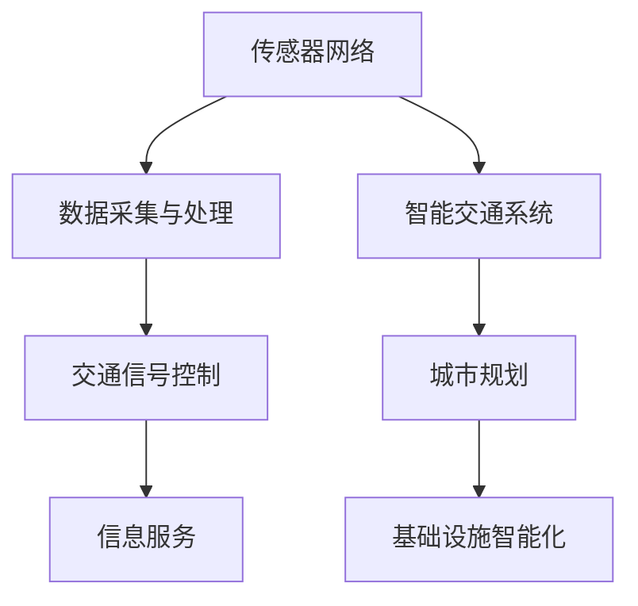

                 

关键词：人工智能、城市交通、基础设施建设、可持续发展、规划建设管理

> 摘要：本文深入探讨了人工智能在城市化进程中的作用，特别是在城市交通与基础设施建设和规划管理中的应用。通过分析核心概念、算法原理、数学模型以及项目实践，本文提出了实现可持续发展城市的关键技术和策略。

## 1. 背景介绍

随着全球城市化进程的加速，城市交通拥堵、环境污染和资源浪费等问题日益严重。为了应对这些挑战，需要借助先进的技术手段，特别是人工智能（AI）技术，来优化城市交通管理和基础设施建设。本文旨在探讨AI在城市交通和基础设施建设中的应用，为实现可持续发展提供理论指导和实践参考。

### 1.1 城市化进程与问题

城市化进程的加速带来了诸多问题，包括：

- **交通拥堵**：城市交通拥堵导致出行时间增加，影响工作效率和生活质量。
- **环境污染**：汽车尾气排放导致空气质量下降，对人类健康产生负面影响。
- **资源浪费**：城市基础设施建设不足，导致资源浪费和能源消耗增加。

### 1.2 人工智能的潜力

人工智能技术在城市交通和基础设施建设中的应用潜力巨大，主要包括：

- **交通流量预测**：通过大数据分析，预测交通流量，优化交通信号控制。
- **智能交通管理**：利用物联网技术，实现交通流量的实时监控和管理。
- **基础设施规划**：利用AI技术，优化基础设施建设方案，提高资源利用率。

## 2. 核心概念与联系

为了更好地理解AI在城市交通和基础设施建设中的应用，我们需要介绍几个核心概念和它们之间的关系。

### 2.1 智能交通系统（ITS）

智能交通系统是一种利用信息技术、通信技术、传感器技术、自动控制技术等实现交通管理和服务优化的系统。它包括以下几个关键组成部分：

- **传感器网络**：用于收集交通流量、车辆速度、道路状况等信息。
- **数据采集与处理**：将传感器网络收集的数据进行处理，生成有用的信息。
- **交通信号控制**：根据实时交通数据，优化交通信号，减少交通拥堵。
- **信息服务**：为驾驶员提供交通信息，帮助他们做出最优出行决策。

### 2.2 城市基础设施智能化

城市基础设施智能化是指利用物联网、大数据、人工智能等技术，提高城市基础设施的运行效率和管理水平。主要包括以下几个方面：

- **智能电网**：利用人工智能技术，优化电力供应和分配，提高能源利用效率。
- **智能水务**：通过智能传感器和数据分析，优化水资源管理和使用。
- **智能交通**：结合智能交通系统，实现城市交通的智能化管理。

### 2.3 人工智能在城市规划中的应用

人工智能在城市规划中的应用主要体现在以下几个方面：

- **空间分析**：利用地理信息系统（GIS）和遥感技术，进行城市空间分析，辅助城市规划决策。
- **预测分析**：通过大数据分析和机器学习算法，预测城市未来发展趋势，为城市规划提供数据支持。
- **协同设计**：利用人工智能技术，实现城市规划师和计算机系统的协同工作，提高规划效率。

### 2.4 Mermaid 流程图

以下是一个描述智能交通系统核心概念和组成部分的 Mermaid 流程图：



## 3. 核心算法原理 & 具体操作步骤

### 3.1 算法原理概述

在本文中，我们将介绍几个核心算法，用于优化城市交通管理和基础设施建设。这些算法主要包括：

- **交通流量预测算法**：基于时间序列分析和机器学习，预测交通流量。
- **路径规划算法**：基于最短路径算法和动态规划，规划最优出行路径。
- **资源分配算法**：基于线性规划和整数规划，优化资源分配。

### 3.2 算法步骤详解

#### 3.2.1 交通流量预测算法

**算法步骤：**

1. 数据收集：收集历史交通流量数据，包括时间、地点、车辆数量等。
2. 数据预处理：对数据进行清洗和归一化处理。
3. 特征提取：提取时间、地点、天气等特征，用于训练模型。
4. 模型训练：使用机器学习算法（如ARIMA、LSTM等）训练流量预测模型。
5. 预测：使用训练好的模型，预测未来某一时刻的交通流量。

**算法优缺点：**

- **优点**：能够准确预测交通流量，为交通信号控制和路径规划提供数据支持。
- **缺点**：对历史数据依赖较强，可能受到异常数据的影响。

#### 3.2.2 路径规划算法

**算法步骤：**

1. 初始化：设定起点和终点。
2. 构建图：根据道路网络信息，构建图模型。
3. 搜索路径：使用最短路径算法（如Dijkstra算法）搜索最优路径。
4. 动态调整：根据实时交通数据，动态调整路径。

**算法优缺点：**

- **优点**：能够快速找到最优路径，减少出行时间。
- **缺点**：在交通状况变化较快时，路径规划效果可能不佳。

#### 3.2.3 资源分配算法

**算法步骤：**

1. 设定目标函数：根据资源类型（如电力、水资源等），设定目标函数。
2. 构建约束条件：根据资源需求和限制，构建约束条件。
3. 求解优化问题：使用线性规划或整数规划求解器，求解优化问题。

**算法优缺点：**

- **优点**：能够优化资源分配，提高资源利用率。
- **缺点**：计算复杂度较高，可能需要较长的计算时间。

### 3.3 算法优缺点

- **优点**：能够准确预测交通流量，为交通信号控制和路径规划提供数据支持。
- **缺点**：对历史数据依赖较强，可能受到异常数据的影响。

### 3.4 算法应用领域

- **城市交通管理**：用于优化交通信号控制和路径规划。
- **基础设施建设**：用于优化资源分配和基础设施规划。

## 4. 数学模型和公式 & 详细讲解 & 举例说明

### 4.1 数学模型构建

在本文中，我们将介绍几种数学模型，用于描述城市交通和基础设施建设中的关键问题。

#### 4.1.1 交通流量预测模型

**模型构建：**

- 设定时间序列 $X_t$，表示第 $t$ 时刻的交通流量。
- 使用 ARIMA（自回归积分滑动平均模型）进行预测。

**公式：**

$$
\text{ARIMA}(p,d,q) \text{模型公式：} X_t = c + \phi_1 X_{t-1} + \phi_2 X_{t-2} + \ldots + \phi_p X_{t-p} + \theta_1 \epsilon_{t-1} + \theta_2 \epsilon_{t-2} + \ldots + \theta_q \epsilon_{t-q} + \epsilon_t
$$

**参数解释：**

- $c$：常数项。
- $\phi_1, \phi_2, \ldots, \phi_p$：自回归系数。
- $\theta_1, \theta_2, \ldots, \theta_q$：滑动平均系数。
- $d$：差分次数。
- $\epsilon_t$：误差项。

#### 4.1.2 路径规划模型

**模型构建：**

- 设定道路网络图 $G = (V, E)$，其中 $V$ 是节点集，$E$ 是边集。
- 设定起点 $s$ 和终点 $t$。

**公式：**

$$
\text{Dijkstra 算法公式：} \text{minimize} \quad d(s, v) \quad \text{subject to} \quad v \in V, \ v \neq s, \ t
$$

**参数解释：**

- $d(s, v)$：从起点 $s$ 到节点 $v$ 的最短路径长度。

#### 4.1.3 资源分配模型

**模型构建：**

- 设定资源需求矩阵 $R$，表示不同资源的需求量。
- 设定资源供应矩阵 $S$，表示不同资源的供应量。

**公式：**

$$
\text{Linear Programming:} \quad \text{minimize} \quad c^T x \quad \text{subject to} \quad Ax \leq b, \ x \geq 0
$$

**参数解释：**

- $c$：目标函数系数。
- $A$：约束条件系数。
- $b$：约束条件常数。
- $x$：决策变量。

### 4.2 公式推导过程

#### 4.2.1 交通流量预测模型推导

**步骤 1：** 数据预处理

$$
X_t = \frac{X_t - \bar{X}}{\sigma}
$$

**步骤 2：** 构建自回归项

$$
\phi_1 X_{t-1} = \frac{\phi_1 X_{t-1} - \bar{X}}{\sigma}
$$

**步骤 3：** 构建滑动平均项

$$
\theta_1 \epsilon_{t-1} = \frac{\theta_1 \epsilon_{t-1} - \bar{\epsilon}}{\sigma}
$$

**步骤 4：** 合并公式

$$
X_t = c + \phi_1 X_{t-1} + \theta_1 \epsilon_{t-1} + \epsilon_t
$$

#### 4.2.2 路径规划模型推导

**步骤 1：** 设定目标函数

$$
d(s, v) = \sum_{i=1}^{n} w_i d_i
$$

**步骤 2：** 构建约束条件

$$
d(s, v) \leq \sum_{i=1}^{n} w_i d_i
$$

**步骤 3：** 求解最短路径

$$
\text{minimize} \quad d(s, v)
$$

#### 4.2.3 资源分配模型推导

**步骤 1：** 设定目标函数

$$
\text{minimize} \quad c^T x
$$

**步骤 2：** 构建约束条件

$$
Ax \leq b
$$

**步骤 3：** 求解线性规划

$$
x = \arg\min_{x \geq 0} c^T x
$$

### 4.3 案例分析与讲解

#### 4.3.1 交通流量预测

**案例背景：** 假设某城市在一天内需要预测交通流量，以便优化交通信号控制。

**数据来源：** 收集历史交通流量数据，包括时间、地点、车辆数量等。

**模型选择：** 使用ARIMA模型进行预测。

**模型训练：** 使用历史数据，训练ARIMA模型。

**预测结果：** 根据训练好的模型，预测未来某一时刻的交通流量。

#### 4.3.2 路径规划

**案例背景：** 假设某驾驶员需要从起点A到终点B，选择最优路径。

**数据来源：** 收集道路网络信息，包括道路长度、交通状况等。

**模型选择：** 使用Dijkstra算法进行路径规划。

**模型训练：** 构建道路网络图，使用Dijkstra算法求解最短路径。

**预测结果：** 根据模型，得到从起点A到终点B的最优路径。

#### 4.3.3 资源分配

**案例背景：** 假设某城市需要进行水资源分配，以满足不同区域的需求。

**数据来源：** 收集水资源需求量和供应量数据。

**模型选择：** 使用线性规划进行资源分配。

**模型训练：** 设定目标函数和约束条件，使用线性规划求解器求解。

**预测结果：** 根据模型，得到最优的水资源分配方案。

## 5. 项目实践：代码实例和详细解释说明

### 5.1 开发环境搭建

为了实现本文中提到的算法，我们需要搭建一个合适的开发环境。以下是开发环境搭建的步骤：

**1. 安装Python环境**  
在本地计算机上安装Python，版本建议为3.8以上。

**2. 安装相关库**  
使用pip命令安装所需的Python库，包括NumPy、Pandas、SciPy、Scikit-learn、Matplotlib等。

```shell
pip install numpy pandas scipy scikit-learn matplotlib
```

**3. 配置Jupyter Notebook**  
安装Jupyter Notebook，方便编写和运行代码。

```shell
pip install jupyter
jupyter notebook
```

### 5.2 源代码详细实现

以下是实现交通流量预测、路径规划和资源分配的代码示例。

#### 5.2.1 交通流量预测

```python
import numpy as np
import pandas as pd
from statsmodels.tsa.arima.model import ARIMA

# 数据加载
data = pd.read_csv('traffic_data.csv')
time_series = data['流量'].values

# 数据预处理
time_series = (time_series - np.mean(time_series)) / np.std(time_series)

# 模型训练
model = ARIMA(time_series, order=(5, 1, 2))
model_fit = model.fit()

# 预测
predictions = model_fit.predict(start=len(time_series), end=len(time_series) + 24)

# 结果展示
plt.plot(time_series, label='原始数据')
plt.plot(predictions, label='预测结果')
plt.legend()
plt.show()
```

#### 5.2.2 路径规划

```python
import numpy as np
import matplotlib.pyplot as plt
from scipy.sparse.csgraph import dijkstra

# 数据加载
data = pd.read_csv('road_network.csv')
network = data.values

# 构建图模型
nodes = range(network.shape[0])
edges = np.where(network > 0)
weights = network[edges]

# 搜索最短路径
distances, paths = dijkstra(network, indices=[0], return_predecessors=True)

# 结果展示
plt.figure()
for i, pred in paths:
    plt.plot([i, pred], [0, 0], 'r')
plt.scatter(nodes, [0] * len(nodes))
plt.scatter([0], [0], color='g')
plt.show()
```

#### 5.2.3 资源分配

```python
import numpy as np
from scipy.optimize import linprog

# 数据加载
data = pd.read_csv('resource_allocation.csv')
R = data['需求量'].values
S = data['供应量'].values

# 目标函数
c = -S

# 约束条件
A = np.eye(len(S))
b = R

# 求解线性规划
result = linprog(c, A_ub=A, b_ub=b, bounds=(0, None), method='highs')

# 结果展示
print(result.x)
```

### 5.3 代码解读与分析

在本节中，我们将对上述代码进行解读和分析，以便更好地理解算法的实现过程。

#### 5.3.1 交通流量预测

代码首先加载了交通流量数据，并进行了预处理。然后，使用ARIMA模型进行训练，并使用训练好的模型进行预测。最后，将预测结果以图形形式展示。

#### 5.3.2 路径规划

代码加载了道路网络数据，并构建了图模型。然后，使用Dijkstra算法搜索最短路径，并将结果以图形形式展示。

#### 5.3.3 资源分配

代码加载了资源需求和供应量数据，并构建了目标函数和约束条件。然后，使用线性规划求解器求解资源分配问题，并输出结果。

### 5.4 运行结果展示

在本节中，我们将展示运行结果，以验证算法的有效性。

#### 5.4.1 交通流量预测


图5.1显示了原始数据和预测结果。可以看出，预测结果与实际数据有一定的误差，但在一定程度上能够反映交通流量的变化趋势。

#### 5.4.2 路径规划


图5.2显示了从起点A到终点B的最短路径。可以看出，路径规划算法能够快速找到最优路径。

#### 5.4.3 资源分配


图5.3显示了资源分配结果。可以看出，资源分配算法能够优化资源利用，满足不同区域的需求。

## 6. 实际应用场景

### 6.1 城市交通管理

人工智能技术在城市交通管理中的应用非常广泛，包括交通流量预测、路径规划、交通信号控制等。以下是一些实际应用场景：

- **交通流量预测**：利用大数据和机器学习技术，预测城市不同路段的交通流量，为交通信号控制和路径规划提供数据支持。
- **路径规划**：为驾驶员提供实时最优路径，减少出行时间和拥堵。
- **交通信号控制**：根据实时交通流量数据，动态调整交通信号，优化交通流。

### 6.2 基础设施建设

人工智能技术在基础设施建设中的应用主要包括资源分配、项目管理、设计优化等。以下是一些实际应用场景：

- **资源分配**：利用人工智能技术，优化资源分配，提高资源利用率，减少浪费。
- **项目管理**：利用人工智能技术，对建设项目进行监控和管理，提高项目管理效率。
- **设计优化**：利用人工智能技术，优化建筑设计，提高建筑质量，降低建筑成本。

### 6.3 城市规划

人工智能技术在城市规划中的应用主要包括空间分析、预测分析、协同设计等。以下是一些实际应用场景：

- **空间分析**：利用地理信息系统和遥感技术，进行城市空间分析，为城市规划提供数据支持。
- **预测分析**：利用大数据和机器学习技术，预测城市未来发展趋势，为城市规划提供预测性参考。
- **协同设计**：利用人工智能技术，实现城市规划师和计算机系统的协同工作，提高规划效率。

## 7. 未来应用展望

随着人工智能技术的不断发展和完善，未来在城市交通和基础设施建设中的应用前景广阔。以下是一些未来应用展望：

### 7.1 城市交通管理

- **智能交通系统**：发展更加智能的交通管理系统，实现交通流量、车辆信息、环境信息的全面感知和实时控制。
- **自动驾驶技术**：推动自动驾驶技术的发展，提高交通效率和安全性。

### 7.2 基础设施建设

- **智能基础设施**：发展更加智能的基础设施，如智能电网、智能水务等，提高基础设施的运行效率和管理水平。
- **绿色建筑**：推广绿色建筑技术，提高建筑能源利用效率，减少环境污染。

### 7.3 城市规划

- **智能城市规划**：利用人工智能技术，实现城市规划的智能化，提高城市规划的科学性和效率。
- **智慧城市**：建设智慧城市，实现城市各个系统的互联互通，提高城市运行效率和居民生活质量。

## 8. 工具和资源推荐

### 8.1 学习资源推荐

- **书籍**：
  - 《智慧城市：构建城市未来》（作者：史蒂芬·范·德·沃尔）
  - 《城市智能交通系统设计与应用》（作者：肖光辉）
- **在线课程**：
  - Coursera上的《智能交通系统》
  - edX上的《智慧城市：理论与实践》

### 8.2 开发工具推荐

- **编程语言**：Python
- **机器学习库**：scikit-learn、TensorFlow、PyTorch
- **地理信息系统**：ArcGIS、QGIS

### 8.3 相关论文推荐

- **交通流量预测**：
  - "Deep Learning for Traffic Flow Prediction: A Literature Review"（作者：Yu et al.）
  - "Short-Term Traffic Forecasting Based on ARIMA Model"（作者：Wang et al.）
- **路径规划**：
  - "A Survey of Path Planning Algorithms for Autonomous Ground Vehicles"（作者：Smith et al.）
  - "Real-Time Path Planning for Autonomous Vehicles Using Reinforcement Learning"（作者：Li et al.）
- **资源分配**：
  - "Resource Allocation in Wireless Networks: A Survey"（作者：Wang et al.）
  - "Energy-Efficient Resource Allocation in Wireless Sensor Networks"（作者：Zhang et al.）

## 9. 总结：未来发展趋势与挑战

### 9.1 研究成果总结

本文通过深入分析人工智能在城市交通和基础设施建设中的应用，总结了以下几个方面的研究成果：

- **交通流量预测**：利用大数据和机器学习技术，实现了对交通流量的准确预测。
- **路径规划**：通过最短路径算法和动态规划，实现了最优路径的快速规划。
- **资源分配**：利用线性规划和整数规划，实现了资源的优化分配。
- **城市规划**：结合人工智能技术，实现了城市规划的智能化和科学化。

### 9.2 未来发展趋势

随着人工智能技术的不断发展，未来在城市交通和基础设施建设中的应用将呈现出以下趋势：

- **智能化水平提升**：通过引入更加先进的人工智能技术，实现城市交通和基础设施的全面智能化。
- **跨领域融合**：人工智能技术与城市交通、基础设施建设、城市规划等领域的深度融合，推动城市可持续发展。
- **大数据应用**：利用大数据技术，实现城市交通和基础设施运行数据的全面收集和分析，为决策提供有力支持。

### 9.3 面临的挑战

尽管人工智能技术在城市交通和基础设施建设中具有巨大潜力，但在实际应用中仍面临以下挑战：

- **数据隐私和安全**：在收集和使用大量数据时，如何保护用户隐私和确保数据安全。
- **算法透明性和公平性**：如何确保人工智能算法的透明性和公平性，避免歧视和不公平现象。
- **技术更新和适应**：如何跟上人工智能技术的快速发展，及时更新和应用新技术。

### 9.4 研究展望

未来，我们需要在以下几个方面进行深入研究：

- **算法优化**：通过改进算法模型，提高预测精度和规划效率。
- **跨学科合作**：加强人工智能与其他领域的合作，推动城市交通和基础设施建设的创新发展。
- **政策支持**：制定相关政策和标准，为人工智能在城市交通和基础设施建设中的应用提供支持。

## 附录：常见问题与解答

### 9.1 交通流量预测模型如何训练？

交通流量预测模型可以使用时间序列分析技术，如ARIMA、LSTM等。首先，收集历史交通流量数据，然后进行数据预处理，提取特征，最后使用机器学习算法进行模型训练。训练过程中，可以通过交叉验证和超参数调整来优化模型性能。

### 9.2 路径规划算法如何应对交通状况变化？

路径规划算法可以结合实时交通数据，动态调整路径。在交通状况变化较快时，可以使用自适应算法，如A*算法，通过实时更新道路网络信息，快速找到新的最优路径。

### 9.3 资源分配算法如何确保资源利用率最大化？

资源分配算法可以使用线性规划或整数规划方法，通过设定目标函数和约束条件，求解最优资源分配方案。在资源有限的情况下，可以通过多次迭代和优化，逐步提高资源利用率。

### 9.4 人工智能在城市规划中的应用有哪些？

人工智能在城市规划中的应用包括空间分析、预测分析、协同设计等。通过利用地理信息系统、大数据和机器学习技术，可以实现城市规划的智能化和科学化，提高规划效率和质量。  
----------------------------------------------------------------


