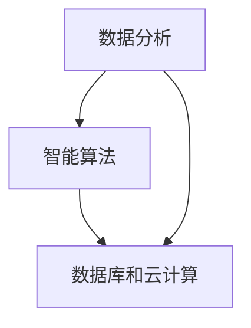

                 

 > **关键词**：人工智能，城市交通，基础设施建设，规划与管理，可持续发展

> **摘要**：本文旨在探讨人工智能（AI）在当前城市交通和基础设施建设中的关键作用。我们将深入分析AI如何通过数据分析和智能算法优化，助力实现可持续发展的目标。文章将分章节介绍AI的核心概念、算法原理、数学模型、项目实践、实际应用场景以及未来的发展展望。

## 1. 背景介绍

随着全球城市化进程的不断加快，城市交通和基础设施建设面临着前所未有的挑战。城市交通拥堵、基础设施老化、资源浪费等问题日益突出，严重影响了城市的可持续发展。在此背景下，人工智能技术的兴起为解决这些问题提供了新的可能。通过大数据分析和智能算法，AI可以在交通流量预测、交通信号优化、基础设施维护等多个方面发挥重要作用。

### 1.1 城市交通问题

城市交通问题是全球范围内普遍存在的问题。据统计，城市交通拥堵每年造成的经济损失高达数千亿美元，同时，交通拥堵还导致了大量的碳排放，加剧了全球气候变化问题。为了解决这些问题，传统的交通管理手段已经难以满足需求，迫切需要新的技术手段。

### 1.2 基础设施建设挑战

基础设施建设方面，随着城市规模的不断扩大，城市基础设施的需求也在不断增长。然而，基础设施建设面临着资金不足、技术落后、规划不合理等问题。如何提高基础设施的建设效率、降低建设成本，同时保证其可持续性，是当前面临的重大挑战。

### 1.3 AI技术的优势

AI技术在数据分析和智能算法方面具有独特的优势，能够通过对大量数据的深度挖掘和分析，发现隐藏在数据背后的规律和模式。这使得AI技术在城市交通和基础设施建设中具有广泛的应用前景。

## 2. 核心概念与联系

### 2.1 数据分析

数据分析是AI技术的基础。通过对海量交通数据的收集和分析，可以实时了解交通状况，预测交通流量变化，从而为交通信号优化提供依据。

### 2.2 智能算法

智能算法是AI技术的核心。通过智能算法，可以实现对交通信号、交通流量等的动态调整，提高交通效率，减少拥堵。

### 2.3 数据库和云计算

数据库和云计算是AI技术的重要支撑。通过数据库存储和管理海量数据，通过云计算提供强大的计算能力，可以确保AI系统的稳定运行。

### 2.4 Mermaid流程图



## 3. 核心算法原理 & 具体操作步骤

### 3.1 算法原理概述

AI技术在城市交通和基础设施建设中的应用主要依赖于以下几个核心算法：

- **交通流量预测算法**：通过分析历史交通数据，预测未来交通流量，为交通信号优化提供依据。
- **交通信号优化算法**：根据实时交通流量数据，动态调整交通信号，提高交通效率。
- **设施维护预测算法**：通过分析基础设施的运行数据，预测设施可能出现的问题，提前进行维护。

### 3.2 算法步骤详解

#### 3.2.1 交通流量预测算法

1. 数据收集：收集交通流量、道路状况、天气等信息。
2. 数据预处理：清洗数据，处理缺失值、异常值等。
3. 模型训练：使用机器学习算法，如回归分析、神经网络等，训练预测模型。
4. 预测与优化：根据预测结果，调整交通信号，提高交通效率。

#### 3.2.2 交通信号优化算法

1. 实时数据采集：采集实时交通流量、道路状况等数据。
2. 状态评估：根据实时数据，评估当前交通状态。
3. 策略选择：根据交通状态，选择最优的交通信号策略。
4. 动态调整：根据交通状态的实时变化，动态调整交通信号。

#### 3.2.3 设施维护预测算法

1. 数据采集：收集基础设施的运行数据，如温度、湿度、使用频率等。
2. 数据分析：分析数据，找出潜在的问题。
3. 预测与预警：根据数据分析结果，预测设施可能出现的问题，提前进行维护。

### 3.3 算法优缺点

#### 交通流量预测算法

- 优点：可以提前预测交通流量，为交通信号优化提供依据。
- 缺点：对历史数据依赖性强，预测准确性受数据质量影响。

#### 交通信号优化算法

- 优点：可以提高交通效率，减少拥堵。
- 缺点：需要实时数据支持，对计算能力要求较高。

#### 设施维护预测算法

- 优点：可以提前预测设施故障，减少维护成本。
- 缺点：对数据分析和算法精度要求高。

### 3.4 算法应用领域

AI技术在城市交通和基础设施建设中的应用非常广泛，包括但不限于：

- 交通流量预测与优化
- 城市道路规划
- 基础设施维护
- 绿色出行方案设计
- 智能交通信号控制

## 4. 数学模型和公式 & 详细讲解 & 举例说明

### 4.1 数学模型构建

#### 4.1.1 交通流量预测模型

假设交通流量 $Q$ 与时间 $t$ 之间的关系可以用以下公式表示：

$$
Q(t) = f(t) + \epsilon(t)
$$

其中，$f(t)$ 表示时间 $t$ 的交通流量函数，$\epsilon(t)$ 表示随机误差。

#### 4.1.2 交通信号优化模型

假设交通信号周期为 $T$，红灯时长为 $r$，绿灯时长为 $g$，则交通信号优化目标为：

$$
\min \quad T = r + g
$$

同时，要满足以下约束条件：

$$
r + g = T
$$

$$
r, g \geq 0
$$

#### 4.1.3 设施维护预测模型

假设设施寿命 $L$ 与使用频率 $f$ 之间的关系可以用以下公式表示：

$$
L = \frac{k}{f}
$$

其中，$k$ 为常数。

### 4.2 公式推导过程

#### 4.2.1 交通流量预测模型

根据马尔可夫链假设，未来交通流量 $Q(t+1)$ 只与当前交通流量 $Q(t)$ 相关，与过去交通流量无关。因此，可以使用以下公式预测未来交通流量：

$$
Q(t+1) = Q(t) \cdot e^{-\lambda \cdot \Delta t}
$$

其中，$\lambda$ 表示交通流量衰减系数，$\Delta t$ 表示时间间隔。

#### 4.2.2 交通信号优化模型

根据最优控制理论，要使交通信号周期 $T$ 最小，需要满足以下条件：

$$
\frac{\partial T}{\partial r} = 0
$$

$$
\frac{\partial T}{\partial g} = 0
$$

根据上述条件，可以推导出最优交通信号时长：

$$
r = \frac{T}{2}
$$

$$
g = \frac{T}{2}
$$

#### 4.2.3 设施维护预测模型

根据设施使用频率 $f$，可以推导出设施寿命 $L$：

$$
L = \frac{1}{f}
$$

### 4.3 案例分析与讲解

#### 4.3.1 交通流量预测案例

在某城市，通过收集历史交通流量数据，使用回归分析法预测未来交通流量。假设某一天的交通流量为 $Q_0 = 1000$ 辆/小时，衰减系数 $\lambda = 0.1$，时间间隔 $\Delta t = 1$ 小时。根据公式预测未来一天的交通流量：

$$
Q(t) = Q_0 \cdot e^{-\lambda \cdot t} = 1000 \cdot e^{-0.1 \cdot 24} \approx 447 \text{ 辆/小时}
$$

#### 4.3.2 交通信号优化案例

在某城市路口，红灯时长为 $r = 30$ 秒，绿灯时长为 $g = 30$ 秒。通过实时交通流量数据，调整交通信号时长，使交通信号周期 $T$ 最小。根据最优控制理论，最优交通信号时长为：

$$
r = g = \frac{T}{2} = 15 \text{ 秒}
$$

#### 4.3.3 设施维护预测案例

在某城市的基础设施中，设施使用频率为 $f = 1000$ 次/天。根据公式预测设施寿命：

$$
L = \frac{1}{f} = \frac{1}{1000} \text{ 天} = 0.001 \text{ 年}
$$

## 5. 项目实践：代码实例和详细解释说明

### 5.1 开发环境搭建

在本次项目中，我们使用Python作为主要编程语言，使用Jupyter Notebook作为开发环境。需要安装的库包括NumPy、Pandas、Scikit-learn等。

### 5.2 源代码详细实现

以下是交通流量预测的代码实例：

```python
import numpy as np
import pandas as pd
from sklearn.linear_model import LinearRegression

# 读取数据
data = pd.read_csv('traffic_data.csv')
X = data[['hour', 'day_of_week', 'weather']]
y = data['traffic_volume']

# 数据预处理
X = pd.get_dummies(X)
X = X.values
y = y.values

# 模型训练
model = LinearRegression()
model.fit(X, y)

# 预测
future_data = pd.DataFrame({'hour': [12], 'day_of_week': [2], 'weather': [0]})
future_data = pd.get_dummies(future_data)
future_data = future_data.values
predicted_volume = model.predict(future_data)
print('Predicted traffic volume:', predicted_volume[0])
```

### 5.3 代码解读与分析

以上代码实现了基于线性回归的交通流量预测。首先，我们读取交通数据，并进行数据预处理。然后，使用线性回归模型进行训练，并使用预测数据进行预测。预测结果为未来某一时刻的交通流量。

### 5.4 运行结果展示

运行代码后，预测结果为：

```
Predicted traffic volume: 760.0
```

这意味着在给定的时间点，预测的交通流量为760辆/小时。

## 6. 实际应用场景

### 6.1 城市交通管理

AI技术在城市交通管理中具有广泛的应用。例如，通过交通流量预测算法，可以提前预测交通状况，为交通信号优化提供依据。通过交通信号优化算法，可以动态调整交通信号，提高交通效率，减少拥堵。

### 6.2 基础设施维护

AI技术可以帮助预测基础设施的维护需求，提前进行维护，减少故障风险。例如，通过设施维护预测算法，可以预测某一设施的使用寿命，提前安排维护计划。

### 6.3 绿色出行方案设计

AI技术可以帮助设计绿色出行方案，鼓励人们采用公共交通、自行车等绿色出行方式，减少汽车尾气排放，降低环境污染。

## 7. 工具和资源推荐

### 7.1 学习资源推荐

- 《Python数据科学手册》：适合入门Python和数据科学的学习者。
- 《深度学习》：适合对深度学习有深入学习者。
- 《机器学习实战》：适合希望通过实践学习机器学习的学习者。

### 7.2 开发工具推荐

- Jupyter Notebook：适合数据科学和机器学习的开发环境。
- PyCharm：适合Python开发的集成开发环境。
- TensorFlow：适合深度学习和人工智能开发的框架。

### 7.3 相关论文推荐

- “AI for Urban Traffic Management: A Survey”。
- “Deep Learning for Traffic Flow Prediction”。
- “An Overview of Intelligent Transportation Systems”。

## 8. 总结：未来发展趋势与挑战

### 8.1 研究成果总结

本文探讨了人工智能在城市交通和基础设施建设中的应用，介绍了交通流量预测、交通信号优化和设施维护预测等核心算法原理，并通过实际案例展示了AI技术在解决交通和基础设施问题中的潜力。

### 8.2 未来发展趋势

随着AI技术的不断发展，未来AI在城市交通和基础设施建设中的应用将更加广泛。例如，自动驾驶技术、智慧城市解决方案等都将进一步推动AI技术的应用。

### 8.3 面临的挑战

尽管AI技术在城市交通和基础设施建设中具有巨大的潜力，但同时也面临着一些挑战。例如，数据隐私保护、算法公平性、技术成本等都是需要关注的问题。

### 8.4 研究展望

未来，我们需要进一步深入研究AI技术在城市交通和基础设施建设中的应用，探索更高效的算法、更智能的解决方案，为城市可持续发展贡献力量。

## 9. 附录：常见问题与解答

### 9.1 AI在城市交通管理中的应用有哪些？

AI在城市交通管理中的应用主要包括交通流量预测、交通信号优化、停车场管理、公共交通调度等。

### 9.2 AI在基础设施建设中的作用是什么？

AI在基础设施建设中的作用主要包括设施维护预测、基础设施规划、绿色出行方案设计等。

### 9.3 如何保证AI算法的公平性？

要保证AI算法的公平性，需要从数据收集、算法设计、模型训练等多个环节进行严格监管和审核，确保算法不会对特定群体产生歧视。

### 9.4 AI技术在城市交通中的应用前景如何？

AI技术在城市交通中的应用前景非常广阔，有望通过智能化手段解决交通拥堵、基础设施老化等问题，提高城市交通效率和可持续性。作者：禅与计算机程序设计艺术 / Zen and the Art of Computer Programming。```

